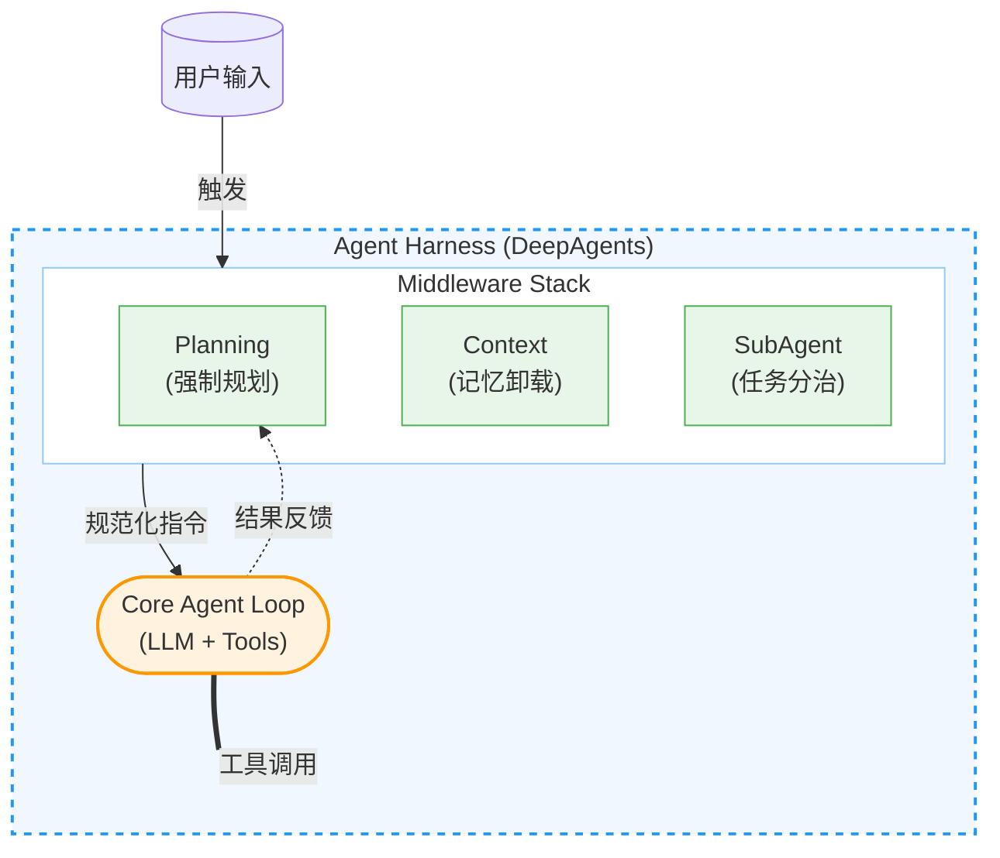
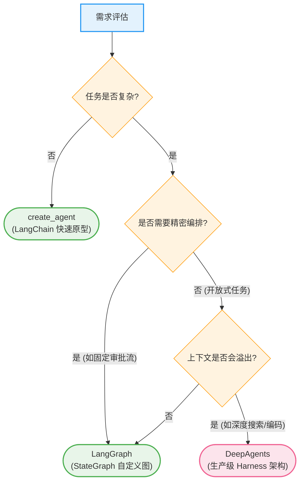
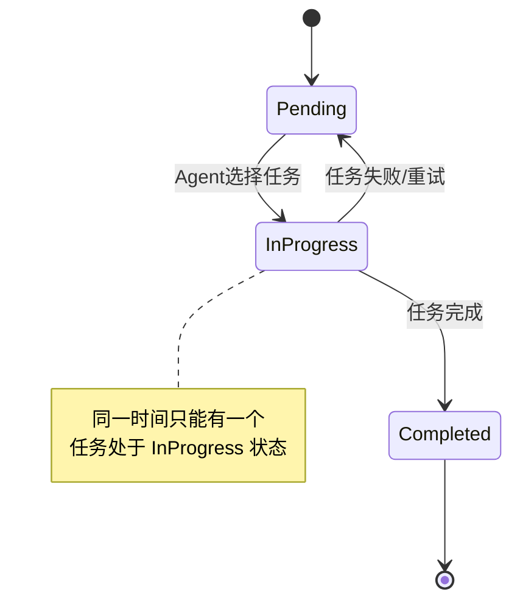
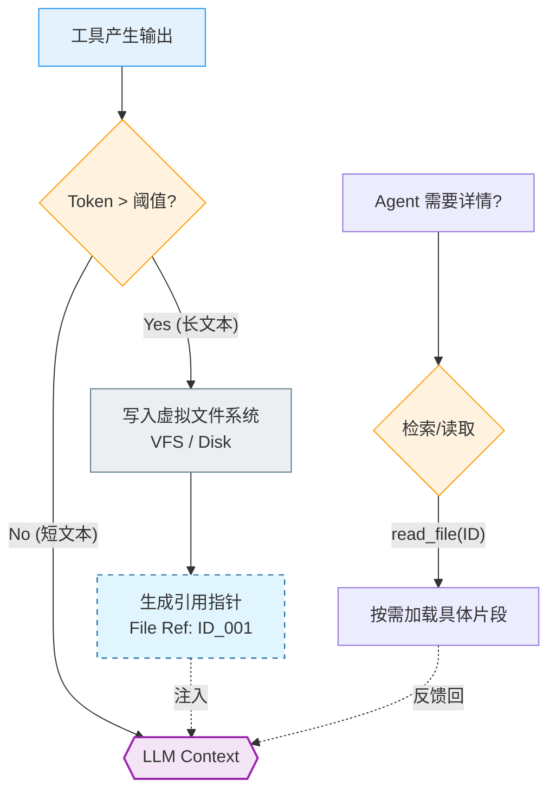
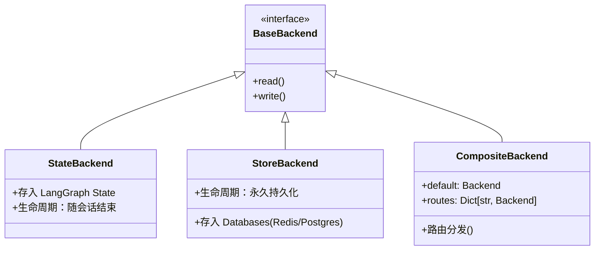

# 第七篇 Deep Agents：构建具备规划与子智能体能力的深度 Agent

> **目标**：掌握 deepagents 库，使用 **Agent Harness** 模式构建能够处理复杂、多步骤、长上下文任务的生产级智能体。

---

## 📋 前置准备

### 环境配置

在开始学习之前，请确保完成以下环境配置：

#### 1. 安装依赖
```bash
# 核心库
pip install deepagents

# 推荐工具（用于本篇实战）
pip install tavily-python langchain-community
```

#### 2. 环境变量配置
```python
import os

# 必须配置
os.environ["ANTHROPIC_API_KEY"] = "sk-..."  # 默认基座模型
os.environ["TAVILY_API_KEY"] = "tvly-..."   # 用于搜索能力

# 可选配置（但强烈推荐用于追踪）
os.environ["LANGSMITH_API_KEY"] = "lsv2-..."
os.environ["LANGSMITH_TRACING"] = "true"
```

### 前置知识
建议具备以下基础知识：
- ✅ **LangGraph 基础** (State, Node, Edge 的概念)
- ✅ **Tool Calling** (如何定义和使用工具)
- ✅ **异步编程** (async/await)

---

## 第1章：Deep Agents 核心架构

### 1.1 什么是 Agent Harness？

在软件工程中，**Harness**（挽具/测试套件）通常指用来控制和测试组件的外部框架。**Deep Agents** 引入了 **Agent Harness** 的核心设计理念：它不改变底层的 LLM 或 LangGraph 图，而是像给赛马套上挽具一样，在 Agent 循环之外包裹了一层**强制性的行为规范**。

**官方定义**：
> deepagents is a standalone library for building agents that can tackle complex, multi-step tasks. Built on LangGraph and inspired by applications like Claude Code, Deep Research, and Manus.



### 1.2 三大核心能力解析

Deep Agents 通过**模块化中间件**注入了三大核心能力，解决了构建复杂 Agent 时的“不可能三角”：

| 核心问题 | 痛点描述 | Deep Agents 解决方案 | 对应中间件 |
| :--- | :--- | :--- | :--- |
| **规划混乱** | 面对模糊目标，Agent 容易陷入死循环或过早停止 | **强制规划 (Planning)**：将隐式思维链转化为显式 Todo List | `TodoListMiddleware` |
| **上下文爆炸** | 中间步骤产生大量数据（如搜索结果），撑爆 Token 窗口 | **上下文卸载 (Context Eviction)**：将长文本自动转存至虚拟文件系统 | `FilesystemMiddleware` |
| **单体瓶颈** | 一个 Prompt 塞入过多指令，导致注意力分散 | **分治策略 (Divide & Conquer)**：动态生成独立的子智能体处理任务 | `SubAgentMiddleware` |

### 1.3 技术选型决策树

什么时候应该使用 Deep Agents，什么时候用原生的 LangGraph？



---

## 第2章：快速上手：构建 Deep Research Agent

本章我们将构建一个能够上网搜索、分析大量资料并撰写报告的“深度研究员”。

### 2.1 定义核心工具

首先，我们需要一个联网搜索工具。为了演示鲁棒性，我们需要做好错误处理。

```python
import os
from typing import Literal
from tavily import TavilyClient
from langchain_core.tools import tool

tavily_client = TavilyClient(api_key=os.environ.get("TAVILY_API_KEY"))

@tool
def internet_search(
    query: str,
    max_results: int = 5,
    topic: Literal["general", "news"] = "general",
) -> str:
    """
    Run a web search using Tavily.
    Always use this tool when you need external information.
    """
    try:
        print(f"🔎 [Tool] Searching for: {query}")
        results = tavily_client.search(query, max_results=max_results, topic=topic)

        output = []
        if results.get("answer"):
            output.append(f"Answer: {results['answer']}\n")

        for res in results.get("results", []):
            title = res.get("title", "No title")
            url = res.get("url", "#")
            content = res.get("content", "")[:300]
            output.append(f"- [{title}]({url})\n  {content}...")

        return "\n".join(output) if output else "No results found."
    except Exception as e:
        return f"Error during search: {str(e)}"
```

### 2.2 构建 Deep Agent

使用 `create_deep_agent` 工厂函数，系统会自动注入 `write_todos`、`read_file` 等基础设施工具。

```python
from deepagents import create_deep_agent
from langchain_core.messages import HumanMessage

# 创建 Deep Agent
agent = create_deep_agent(
    tools=[internet_search],  # 我们自定义的工具
    model="claude-sonnet-4-5-20250929",  # 建议使用强推理模型
    system_prompt="""
    You are an expert researcher. Follow these steps:
    1. PLAN: Always use write_todos to breakdown the user request.
    2. EXECUTE: Use internet_search to gather information.
    3. MANAGE: The system will auto-evict long content to files.
       Trust the file system. Use read_file if you need to review details.
    4. DELIVER: Synthesize findings into a final markdown report.
    """
)

# 执行任务
print("🚀 Deep Research Agent Started...")
query = "请调查 Deep Agents 库的核心特性，并与 LangGraph 做对比。最后生成一份 report.md。"

# 使用 stream 查看实时过程
for event in agent.stream({"messages": [HumanMessage(content=query)]}):
    # 实际开发中可以打印 event 来观察 Agent 的每一步思考
    pass
```

### 2.3 深度运行分析 (Execution Anatomy)

只要运行上面的代码，你会看到 Agent **完全不同于普通 ChatBot** 的行为模式。让我们逐帧拆解它的思考过程：

#### 第一阶段：强制规划 (The Planning Phase)
Agent 收到请求后，并没有直接搜索。`TodoListMiddleware` 强制它先调用 `write_todos`。

**Agent 思考**：
> "这是一个复杂的任务。我需要先搜索，再对比，最后写文件。"

**工具调用 (`write_todos`)**：
```json
{
  "todos": [
    {"task": "Search for Deep Agents library documentation", "status": "pending"},
    {"task": "Search for LangGraph comparison points", "status": "pending"},
    {"task": "Write comparison report to report.md", "status": "pending"}
  ]
}
```

#### 第二阶段：执行与上下文卸载 (Execution & Eviction)
Agent 开始执行第一个 Todo。它调用 `internet_search` 获得了一大段关于 DeepAgents 的介绍。

**关键时刻**：
假设搜索结果非常长（例如 10,000 tokens）。`FilesystemMiddleware` 会监测到这一情况。它不会让这 10k tokens 直接塞进下一轮的 Prompt，而是**自动拦截**：

1.  **自动保存**：将搜索结果写入虚拟文件 `/tmp/virtual/output_1.txt`。
2.  **指针替换**：在 Context 中，将原来的长文本替换为：
    `Tool Output: <Content evicted to /tmp/virtual/output_1.txt. Use read_file to access.>`

这样，Agent 依然“知道”结果在哪里，但它的 Context 保持了轻量级。

#### 第三阶段：合成与交付 (Synthesis)
Agent 完成了所有搜索。此时 Todo List 状态变为：
- [x] Search Deep Agents
- [x] Search LangGraph
- [>] Write report (Current)

Agent 调用 `write_file` 生成最终报告。整个过程行云流水，没有任何 Context 溢出的风险。

---

## 第3章：核心机制深度解析

### 3.1 规划系统：TodoListMiddleware

普通的 Agent 只有隐式的“思维链”（Chain of Thought），容易在长任务中迷失。`TodoListMiddleware` 引入了**显式状态机**。



- **状态持久化**：Todo List 不是 Prompt 里的一段话，而是一个结构化的对象列表。
- **自我纠正机制**：
    - 如果 Agent 尝试执行一个不在 Todo List 里的任务，中间件会报错提示：“请先规划”。
    - 如果任务失败（如搜索无结果），Agent 会修改 Todo List（新增 "Retry search"），而不是盲目继续。

### 3.2 记忆系统：Context Eviction 原理

这是 Deep Agents 最核心的“黑科技”。它通过**虚拟文件系统（VFS）**实现了无限上下文的假象。

**算法流程图**：



**核心工具集**：
- `ls(path)`: 查看当前知识库。
- `read_file(path, offset, limit)`: **最关键的工具**。支持分页读取（offset/limit），允许 Agent 只“加载”它当前需要关注的那一部分数据到内存中。
- `write_file(path, content)`: 创建笔记或报告。
- `edit_file(path, old, new)`: 精确修改文件。

### 3.3 分治系统：SubAgent Spawning

当任务复杂度呈指数级上升时，单体 Agent 必然崩溃。`SubAgentMiddleware` 引入了**组织架构**。

**工作原理**：
1.  主 Agent 调用 `task(name="researcher", goal="Find info about X")`。
2.  系统暂停主 Agent，**Fork** 一个新的子 Agent 实例。
3.  **Context 隔离**：子 Agent 拥有全新的、空白的 Context。主 Agent 累积的历史记录**不会**污染子 Agent。
4.  子 Agent 独立运行，直到完成目标。
5.  子 Agent 销毁，只返回一个简短的 `String` 结果给主 Agent。

### 3.4 自我修正循环 (Self-Correction Loop)

Deep Agents 不只是执行者，更是反思者。当任务失败时，TodoMiddleware 支持动态重规划（Replanning）。

```python
# 当 Agent 发现原定计划行不通时
# 调用 write_todos 修改计划
{
  "todos": [
    {"task": "Run Unit Test", "status": "completed"},  # 原计划
    {"task": "Debug the AttributeError", "status": "pending"}, # 新增的自我修正任务
    {"task": "Run Unit Test Again", "status": "pending"}
  ]
}
```
这种动态调整能力使 Agent 能够应对不确定性和错误，是实现 AGI 自主性的关键一步。

---

## 第4章：存储后端工程化

Deep Agents 的存储后端（Backends）极其灵活，决定了 Agent 的“文件”和“记忆”到底存在哪里。

### 4.1 后端架构全景



### 4.2 StateBackend vs StoreBackend

| 特性 | StateBackend (默认) | StoreBackend |
| :--- | :--- | :--- |
| **存储位置** | 内存 (LangGraph State) | 外部数据库 (BaseStore) |
| **生命周期** | 短 (Thread 结束即消失) | 长 (永久保存) |
| **适用场景** | 临时文件、中间草稿 | 用户配置、长期记忆、成品文档 |
| **速度** | 极快 | 取决于数据库 I/O |

### 4.3 生产级最佳实践：CompositeBackend

在生产环境中，我们需要混合使用：临时文件存内存，重要数据存数据库。Deep Agents 提供了基于路径的路由功能。

```python
from deepagents.backends import CompositeBackend, StateBackend, StoreBackend
from langgraph.store.memory import InMemoryStore

# 初始化持久化存储
store = InMemoryStore()

def make_backend(runtime):
    return CompositeBackend(
        # 默认路由：所有普通文件存内存（State），虽生犹死
        default=StateBackend(runtime),

        # 特殊路由：/memories/ 开头的文件，存入 Store（持久化）
        routes={
            "/memories/": StoreBackend(runtime)
        }
    )

agent = create_deep_agent(
    store=store,
    backend=make_backend,
    system_prompt="Save user preferences to /memories/profile.md"
)
```

**设计哲学**：
通过文件路径（Path）来区分数据的生命周期。Agent 不需要学习复杂的数据库指令，它只需要知道：“如果这类信息很重要，我就把它写进 `/memories/` 文件夹”。

---

## 第5章：CLI 工具与交互实战

DeepAgents 提供了一个开箱即用的命令行工具（CLI），其体验无论是作为 Coding Agent 还是 Research Agent 都非常出色。

### 5.1 安装与启动

```bash
# 推荐使用 uv 工具链安装（隔离环境）
uv tool install deepagents-cli

# 启动 CLI (交互模式)
deepagents
```

### 5.2 核心命令参数详解

| 参数 | 说明 | 示例 |
| :--- | :--- | :--- |
| `--agent <NAME>` | **最重要**。指定 Agent 名称。不同名称拥有独立的记忆空间。 | `deepagents --agent my-coder` |
| `--sandbox <TYPE>` | 启用远程沙箱运行代码（安全模式）。支持 daytona, modal。 | `deepagents --sandbox daytona` |
| `--resume` | 恢复上一次的会话上下文。 | `deepagents --resume` |
| `--model` | 指定模型 ID。 | `deepagents --model claude-3-5-sonnet` |

### 5.3 交互式指令 (Slash Commands)

交互模式下支持以下指令：

- `/clear`: 清空当前对话历史（Token 减负）。
- `/tokens`: 查看当前 Token 使用量统计。
- `/threads`: 列出历史会话列表，方便切换。
- `/exit`: 保存状态并退出。

### 5.4 手动干预记忆 (Manual Memory Intervention)

由于 Deep Agents 使用文件系统管理记忆，你可以直接在本地文件系统中干预 Agent 的长期记忆。

- **记忆位置**：`~/.deepagents/{AGENT_NAME}/memories/`
- **操作方式**：你可以直接用 VS Code 或 Vim 编辑目录下的 `.md` 文件。下次 Agent 启动时，会自动读取你修改后的内容。这是一条非常高效的“上帝通道”。

---

## 第6章：安全机制：Human-in-the-Loop

在生产环境中，让 AI 自动执行 `write_file` 或 `internet_search` 可能带来风险。Deep Agents 集成了 LangGraph 的 **Checkpointer** 机制，实现了精细的人工介入。

### 6.1 拦截危险操作

我们可以配置 `interrupt_on` 参数，指定哪些工具在执行前必须暂停。

```python
from langgraph.checkpoint.memory import MemorySaver

# 1. 必须启用 Checkpointer 才能保存暂停时的状态
checkpointer = MemorySaver()

# 2. 创建 Agent，拦截写入操作
agent = create_deep_agent(
    tools=[internet_search],
    interrupt_on=["write_file", "edit_file"],  # <--- 拦截配置
    checkpointer=checkpointer
)
```

### 6.2 完整的拦截-恢复流程

```python
from langchain_core.messages import HumanMessage

config = {"configurable": {"thread_id": "safe-thread-1"}}

# --- 步骤 1: 触发执行 ---
# 假设 Agent 决定调用 write_file("virus.py", ...)
print("--- Round 1: Agent Running ---")
# 这里的 stream_mode="values" 会在暂停前停止
for event in agent.stream(
    {"messages": [HumanMessage(content="写一个 Python 脚本")]},
    config
):
    pass

# --- 步骤 2: 检查状态 ---
state = agent.get_state(config)
if state.next:
    print(f"⚠️  PAUSED. Next action: {state.next}")
    # 这里可以加入人工审核逻辑：
    # user_input = input("Allow this action? (y/n)")

    # --- 步骤 3: 恢复执行 ---
    # 传入 None 表示"放行"，继续执行被暂停的操作
    print("\n✅ Resuming execution...")
    for event in agent.stream(None, config):
        print(event)
```

这一机制确保了 Agent 永远不会在人类不知情的情况下修改关键代码或数据。

---

## 第7章：进阶定制：子智能体工厂

如何构建更强大的 Agent？答案是定制化子智能体。我们推荐使用**字典配置模式**，它最简洁且易于维护。

### 7.1 字典配置模式（推荐）

这是定义 Subagent 最简单的方式。只需提供一个配置字典，Deep Agents 会自动处理上下文隔离和路由。

```python
# 定义子 Agent 配置
coder_agent_config = {
    "name": "python_coder",
    "description": "A specialist in Python coding tasks.",
    "system_prompt": "You are a senior Python engineer. Write type-safe code...",
    "tools": [read_file, write_file], # 子 Agent 可以有专属工具集
    "model": "claude-3-5-sonnet-20241022", # 子 Agent 可以用更强的模型
}

# 挂载到主 Agent
main_agent = create_deep_agent(
    model="gpt-4o", # 主 Agent 用便宜模型做调度
    subagents=[coder_agent_config]
)
```

### 7.2 编译图模式（高级）

如果你已经有一个非常复杂的 LangGraph 图（比如一个包含 RAG、向量库检索的图），你可以把它直接包装成一个 Subagent。

```python
from deepagents import CompiledSubAgent

# 假设 custom_graph 是一个编译好的 LangGraph CompiledGraph
subagent = CompiledSubAgent(
    name="legal_advisor",
    description="Consults the legal vector database.",
    runnable=custom_graph
)

main_agent = create_deep_agent(subagents=[subagent])
```

### 7.3 子代理的高级通信

主 Agent 不仅能给子 Agent 分配任务，还能通过 Prompt 隐式传递上下文。

```python
# 主 Agent 思考
"我需要分析 user_data.csv。我会把 schema 传给子代理。"

# 主 Agent 调用工具
task(
    name="data_analyst",
    goal="Analyze user_data.csv. Note: The schema includes 'id', 'login_time'."
)
```
子 Agent 启动时，`goal` 字段的内容会被注入到它的 System Prompt 中，从而实现“上下文传递”。

---

## 第8章：最佳实践与总结

### 8.1 架构设计原则

1.  **Memory-First Protocol（内存优先）**：
    在 Prompt 中明确指示 Agent：“在回答问题前，先检查 `/memories/` 目录下的相关文件”。这能大幅提升个性化体验。

2.  **Context Quarantine（上下文隔离）**：
    只要任务涉及“读取大量无关数据”或“执行超过 5 步的尝试”，就坚决使用 Subagent。**保持主 Agent 的 Context 干净是长期运行并保持高智商的关键。**

3.  **General Purpose Agent**：
    如果你懒得配置专门的子 Agent，可以直接在 Prompt 告诉主 Agent：“遇到复杂任务，请调用 `task(name='general-purpose', ...)`”。系统内置了这个通用分身，可以帮你分担脏活。

### 8.2 本章小结

Deep Agents 不仅仅是一个库，它是构建 **AGI 应用的标准蓝图**。

- **Layer 1: Planning** -> 解决“怎么做”的问题。
- **Layer 2: FileSystem** -> 解决“记不住”的问题。
- **Layer 3: Subagents** -> 解决“干不动”的问题。

### 8.3 思考与练习

1.  **练习 1**：尝试修改第 2 章的代码，增加一个 `files_list` 工具，让 Agent 可以列出当前目录下的文件。
2.  **练习 2**：配置 `CompositeBackend`，让 Agent 将你的名字写入 `/memories/name.txt`，重启程序后，验证它是否还记得你的名字。
3.  **思考题**：为什么 Deep Agents 选择用“文件系统”而不是“向量数据库”来作为主要的 Context 卸载机制？它们各自的优缺点是什么？
