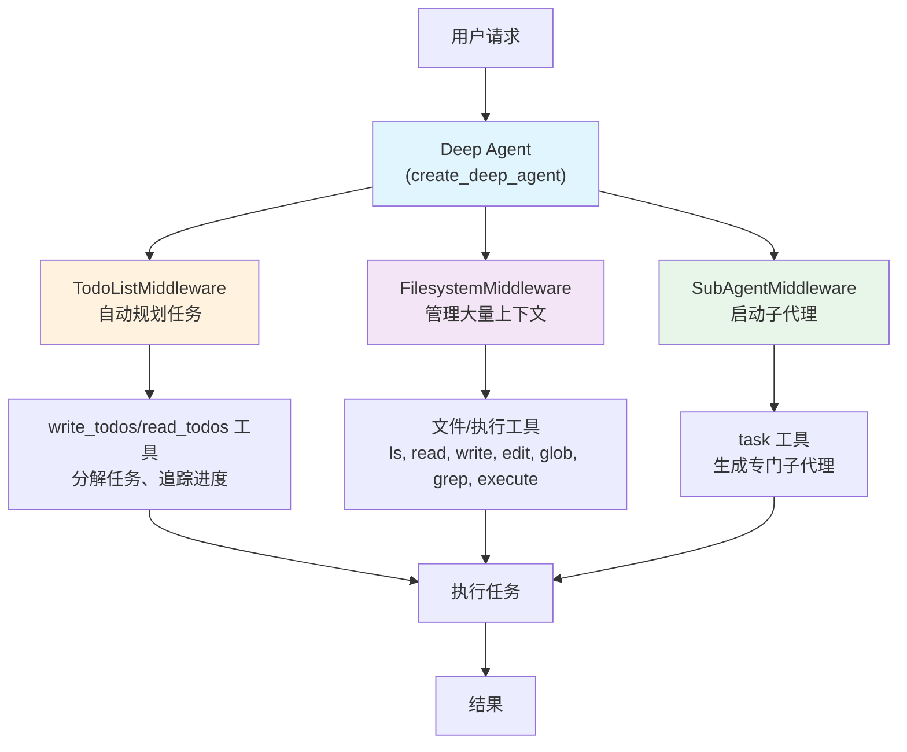

# 第七篇 Deep Agents

> **目标**：掌握 deepagents 库处理复杂多步骤任务

在前三篇中，我们学习了 `create_agent` 和 LangGraph 的使用。但当面对**真正复杂**的多步骤任务时，比如：

- 📊 "研究某个技术话题，阅读多个来源，撰写深度分析报告"
- 🔬 "分析这个代码库，找出性能瓶颈，提出优化方案并实现"
- 💻 "设计并实现一个完整的功能模块，包括测试和文档"

这些任务需要 Agent 能够：
- **自主规划**：将复杂任务分解为可执行的步骤
- **管理上下文**：处理大量信息而不超出 token 限制
- **委派子任务**：启动专门的子代理处理特定问题
- **持久化记忆**：跨会话记住重要信息

这就是 **deepagents** 库的核心价值。

---

## 第1章：Deep Agents 架构与核心概念

### 1.1 Deep Agents 架构概述

#### 1.1.1 什么是 deepagents

**deepagents 是一个独立的 Python 库**，构建在 LangGraph 之上，专门用于处理复杂的多步骤任务。

**灵感来源**：
- Claude Code
- Deep Research
- Manus

**与 create_agent 的关系**：

```python
# create_agent：简单任务
from langchain.agents import create_agent
from langchain_openai import ChatOpenAI

agent = create_agent(
    model=ChatOpenAI(model="gpt-4"),
    tools=[search]
)

result = agent.invoke({"messages": [("user", "查询天气")]})
# ✅ 适合：单次查询、简单工具调用

# ======================================

# create_deep_agent：复杂任务
from deepagents import create_deep_agent

deep_agent = create_deep_agent(
    tools=[search, calculator],
    system_prompt="You are an expert researcher"
)

result = deep_agent.invoke({
    "messages": [{"role": "user", "content": "研究 LangChain 1.0 新特性并写报告"}]
})
# ✅ 适合：多步骤任务、需要规划、大量上下文
```

#### 1.1.2 核心能力

**1. Planning（任务规划）**

deepagents 自动包含 `write_todos` 和 `read_todos` 工具，让 Agent 能够：
- 将复杂任务分解为离散步骤
- 追踪每个步骤的进度
- 动态调整计划
- 查看当前任务状态

```python
# Agent 会自动调用 write_todos
# 内置工具，无需手动定义
```

**2. Context Management（上下文管理）**

deepagents 提供7个文件系统和执行工具，避免上下文过载：
- `ls`：列出文件
- `read_file`：读取文件
- `write_file`：写入文件
- `edit_file`：编辑文件
- `glob`：文件模式匹配
- `grep`：文件内容搜索
- `execute`：执行 Shell 命令

```python
# Agent 会将大量数据保存到文件
# 而不是保留在对话历史中
```

**3. Subagent Spawning（子代理生成）**

deepagents 包含 `task` 工具，可以启动专门的子代理：
- 上下文隔离
- 专注处理特定子任务
- 返回简洁的结果摘要

```python
# Agent 会为复杂子任务启动 subagent
# 内置工具，自动管理
```

**4. Long-term Memory（长期记忆）**

使用 LangGraph 的 Store，支持跨会话记忆。

#### 1.1.3 架构设计



**内置 Middleware 自动附加**：

1. **TodoListMiddleware**：Planning 和任务追踪
2. **FilesystemMiddleware**：通过文件操作卸载上下文
3. **SubAgentMiddleware**：委派工作给专门的代理
4. **SummarizationMiddleware**：当上下文超过 170k tokens 时自动总结，防止超出限制
5. **AnthropicPromptCachingMiddleware**：缓存系统提示词以降低成本（仅 Anthropic 模型）
6. **PatchToolCallsMiddleware**：修复因中断导致的悬空工具调用
7. **HumanInTheLoopMiddleware**：实现人工审批流程（需配置 `interrupt_on` 参数）

**内置工具自动注入**：

- `write_todos`：任务规划
- `read_todos`：读取任务列表
- `ls`, `read_file`, `write_file`, `edit_file`, `glob`, `grep`：文件操作
- `execute`：Shell 命令执行
- `task`：子代理生成

#### 1.1.4 适用场景

| 场景 | create_agent | create_deep_agent |
|------|--------------|-------------------|
| **简单查询** | ✅ 推荐 | ❌ 过度设计 |
| **单次工具调用** | ✅ 推荐 | ❌ 过度设计 |
| **多步骤研究** | ⚠️ 可能上下文过载 | ✅ 推荐 |
| **代码库分析** | ⚠️ 上下文不足 | ✅ 推荐 |
| **长时间运行任务** | ❌ 不适合 | ✅ 推荐 |
| **需要规划** | ⚠️ 手动实现 | ✅ 内置支持 |
| **大量数据处理** | ❌ token 限制 | ✅ 文件系统卸载 |

---

### 1.2 安装与快速开始

#### 1.2.1 安装

> **版本信息**：
> - 当前最新版本：**0.2.8**（2025年11月24日）
> - 最低Python版本：**3.11**
> - 核心依赖：`langchain>=0.3.0`, `langgraph>=0.2.47`

```bash
# 使用 pip
pip install deepagents

# 使用 uv（推荐，更快）
uv add deepagents

# 使用 poetry
poetry add deepagents

# 安装特定版本
pip install deepagents==0.2.8
```

**额外依赖**：

```bash
# 如果使用搜索工具
pip install tavily-python

# 如果使用 OpenAI
pip install langchain-openai

# 如果使用 Anthropic
pip install langchain-anthropic
```

#### 1.2.2 快速开始

**最简单的示例**：

```python
from deepagents import create_deep_agent
import os

# 定义工具
def search(query: str) -> str:
    """Search the web for information"""
    # 实际实现中使用真实搜索 API
    return f"Search results for: {query}"

# 创建 Deep Agent
agent = create_deep_agent(
    tools=[search],
    system_prompt="You are an expert researcher"
)

# 执行任务
result = agent.invoke({
    "messages": [{"role": "user", "content": "What is LangGraph?"}]
})

# 获取结果
print(result["messages"][-1].content)
```

**使用真实搜索工具（Tavily）**：

```python
from deepagents import create_deep_agent
from tavily import TavilyClient
import os

# 初始化 Tavily
tavily_client = TavilyClient(api_key=os.environ["TAVILY_API_KEY"])

def internet_search(
    query: str,
    max_results: int = 5,
    topic: str = "general",
    include_answer: bool = True
) -> str:
    """
    Run a web search using Tavily.

    Args:
        query: The search query
        max_results: Maximum number of results to return
        topic: Search topic (general or news)
        include_answer: Whether to include a direct answer

    Returns:
        Search results as a formatted string
    """
    results = tavily_client.search(
        query=query,
        max_results=max_results,
        topic=topic,
        include_answer=include_answer
    )

    # 格式化结果
    output = []

    if include_answer and results.get("answer"):
        output.append(f"Answer: {results['answer']}\n")

    output.append("Sources:")
    for i, result in enumerate(results.get("results", []), 1):
        output.append(f"{i}. {result['title']}")
        output.append(f"   URL: {result['url']}")
        output.append(f"   {result['content'][:200]}...\n")

    return "\n".join(output)

# 创建 Deep Agent
agent = create_deep_agent(
    tools=[internet_search],
    system_prompt="You are an expert researcher. Use web search to gather information."
)

# 执行复杂研究任务
result = agent.invoke({
    "messages": [{
        "role": "user",
        "content": "Research the latest developments in LangChain 1.0 and summarize the key new features"
    }]
})

print(result["messages"][-1].content)
```

**预期执行流程**：

```
1. Agent 接收任务
2. Agent 调用 write_todos 规划步骤：
   - 搜索 LangChain 1.0 相关信息
   - 阅读搜索结果
   - 整理关键特性
   - 撰写总结
3. Agent 调用 internet_search("LangChain 1.0 features")
4. Agent 可能将搜索结果写入文件（如果内容很多）
5. Agent 分析结果并生成总结
```

---

## 第2章：核心参数与配置

### 2.1 核心参数详解

#### 2.1.1 model 参数

**默认模型**：

```python
# deepagents 默认使用 Claude Sonnet 4.5
agent = create_deep_agent(tools=[search])
# 等价于：
# model="claude-sonnet-4-5-20250929"
```

**自定义模型**：

```python
from langchain_openai import ChatOpenAI
from langchain_anthropic import ChatAnthropic

# 使用 OpenAI
agent = create_deep_agent(
    model=ChatOpenAI(model="gpt-4"),
    tools=[search]
)

# 使用 Anthropic
agent = create_deep_agent(
    model=ChatAnthropic(model="claude-3-5-sonnet-20241022"),
    tools=[search]
)

# 自定义温度
agent = create_deep_agent(
    model=ChatOpenAI(model="gpt-4", temperature=0.3),
    tools=[search]
)
```

#### 2.1.2 system_prompt 参数

**提供自定义指令**：

```python
agent = create_deep_agent(
    tools=[search, calculator],
    system_prompt="""
    You are an expert data analyst and researcher.

    Your responsibilities:
    1. Break down complex tasks into clear steps using the write_todos tool
    2. Use the internet search tool to gather information
    3. Save large amounts of data to files using write_file
    4. Delegate specialized subtasks to subagents using the task tool

    Important guidelines:
    - Always plan before executing
    - Be thorough but concise
    - Cite sources when possible
    - Use file system for managing large contexts
    """
)
```

**不同场景的 system_prompt**：

```python
# 研究任务
researcher_prompt = """
You are an expert researcher.
- Use web search to gather comprehensive information
- Evaluate source credibility
- Synthesize findings into clear summaries
- Cite all sources
"""

# 代码分析
code_analyst_prompt = """
You are an expert code analyst.
- Read code files using read_file
- Identify patterns and anti-patterns
- Provide actionable recommendations
- Save analysis to files
"""

# 数据分析
data_analyst_prompt = """
You are an expert data analyst.
- Load data using read_file
- Perform statistical analysis
- Create visualizations (describe them)
- Save results to files
"""
```

#### 2.1.3 tools 参数

**传递自定义工具**：

```python
from langchain_core.tools import tool

@tool
def calculator(expression: str) -> str:
    """
    Evaluate a mathematical expression.

    Args:
        expression: Math expression to evaluate (e.g., "2 + 2")

    Returns:
        The result as a string
    """
    try:
        result = eval(expression)
        return str(result)
    except Exception as e:
        return f"Error: {str(e)}"

@tool
def get_weather(city: str) -> str:
    """
    Get current weather for a city.

    Args:
        city: City name

    Returns:
        Weather description
    """
    # 实际实现中调用天气 API
    return f"Weather in {city}: Sunny, 20°C"

# 创建包含多个工具的 Agent
agent = create_deep_agent(
    tools=[internet_search, calculator, get_weather],
    system_prompt="You are a helpful assistant with access to search, calculations, and weather data"
)
```

**工具最佳实践**：

```python
from typing import Literal

@tool
def search_news(
    query: str,
    days_back: int = 7,
    language: Literal["en", "zh", "es"] = "en"
) -> str:
    """
    Search recent news articles.

    Args:
        query: Search query
        days_back: How many days back to search (default: 7)
        language: Language of articles (en, zh, or es)

    Returns:
        Formatted news results
    """
    # 1. 清晰的文档字符串（Agent 会读取）
    # 2. 类型注解（提高可靠性）
    # 3. 合理的默认值
    # 4. 使用 Literal 限制选项

    # 实现...
    pass
```

#### 2.1.4 subagents 参数

**配置专门的子代理**：

```python
# 创建专门的代码审查子代理
code_review_subagent = create_deep_agent(
    tools=[read_file, write_file],
    system_prompt="""
    You are a code review expert.
    - Focus on code quality, security, and performance
    - Provide specific, actionable feedback
    - Keep reviews concise but thorough
    """
)

# 创建专门的文档编写子代理
docs_writer_subagent = create_deep_agent(
    tools=[read_file, write_file],
    system_prompt="""
    You are a technical documentation expert.
    - Write clear, comprehensive documentation
    - Include code examples
    - Use proper formatting (Markdown)
    """
)

# 主 Agent 可以使用这些子代理
from deepagents import CompiledSubAgent

main_agent = create_deep_agent(
    tools=[internet_search],
    subagents=[  # ✅ 使用列表，不是字典
        CompiledSubAgent(
            name="code_review",
            description="Expert at reviewing code for quality, security, and performance",
            runnable=code_review_subagent
        ),
        CompiledSubAgent(
            name="write_docs",
            description="Expert at writing clear technical documentation",
            runnable=docs_writer_subagent
        )
    ],
    system_prompt="""
    You are a project coordinator.
    - Delegate code reviews to the code_review subagent
    - Delegate documentation to the write_docs subagent
    """
)
```

#### 2.1.5 interrupt_on 参数（Human-in-the-Loop）

**配置审批流程**：

```python
from langgraph.checkpoint.sqlite import SqliteSaver

# 需要 checkpointer 支持中断
checkpointer = SqliteSaver.from_conn_string("agent_state.db")

agent = create_deep_agent(
    tools=[internet_search, write_file],
    interrupt_on=["write_file"],  # 写文件前需要审批
    checkpointer=checkpointer
)

# 执行
config = {"configurable": {"thread_id": "user-123"}}

try:
    result = agent.invoke(
        {"messages": [{"role": "user", "content": "Research and save to report.md"}]},
        config=config
    )
except Exception as e:
    print(f"中断: {e}")

    # 人工审批
    approve = input("批准写文件？(y/n): ")

    if approve == "y":
        # 恢复执行
        result = agent.invoke(None, config=config)
```

#### 2.1.6 高级参数详解

除了上述常用参数外，`create_deep_agent` 还支持多个高级参数，用于更精细的控制。

**完整参数列表**：

```python
from deepagents import create_deep_agent
from langgraph.checkpoint.sqlite import SqliteSaver
from langgraph.store.memory import InMemoryStore
from langchain_openai import ChatOpenAI

agent = create_deep_agent(
    # === 核心参数 ===
    model=ChatOpenAI(model="gpt-4"),      # LLM 模型（默认 Claude Sonnet 4）
    tools=[search, calculator],            # 自定义工具列表
    system_prompt="You are...",            # 系统提示词

    # === Agent 配置 ===
    subagents=[],                          # 子 Agent 列表（CompiledSubAgent）
    middleware=[],                         # 额外的中间件（在标准中间件之后）

    # === 输出控制 ===
    response_format=None,                  # 结构化输出格式
    # 例: {"type": "json_object"} 强制 JSON 输出

    # === 状态与存储 ===
    context_schema=None,                   # Agent 状态的 schema 定义
    checkpointer=None,                     # 持久化 checkpointer（跨会话记忆）
    store=None,                            # 外部存储（替代默认内存存储）
    backend=None,                          # 自定义后端（文件系统/执行环境）

    # === 控制与调试 ===
    interrupt_on={},                       # 工具中断配置（Human-in-the-Loop）
    debug=False,                           # 调试模式（打印详细日志）
    name=None,                             # Agent 名称（用于日志和追踪）
    cache=None,                            # 缓存配置
)
```

**1. response_format - 结构化输出**

强制 Agent 以特定格式输出结果：

```python
# 强制 JSON 输出
agent = create_deep_agent(
    model=ChatOpenAI(model="gpt-4"),
    tools=[internet_search],
    response_format={"type": "json_object"},
    system_prompt="""
    You are a researcher. Always return results in JSON format with keys:
    - summary: Brief summary
    - findings: List of key findings
    - sources: List of source URLs
    """
)

result = agent.invoke({
    "messages": [{"role": "user", "content": "Research LangChain 1.0"}]
})

# 输出将是有效的 JSON
import json
output = json.loads(result["messages"][-1].content)
print(output["summary"])
print(output["findings"])
```

**2. context_schema - 状态 Schema 定义**

定义 Agent 内部状态的结构：

```python
from typing import TypedDict, List

class ResearchState(TypedDict):
    """自定义研究任务的状态"""
    search_queries: List[str]      # 已执行的搜索
    files_created: List[str]        # 已创建的文件
    subtasks_completed: int         # 完成的子任务数

agent = create_deep_agent(
    model=ChatOpenAI(model="gpt-4"),
    tools=[internet_search],
    context_schema=ResearchState,
    system_prompt="Track your progress using the state variables"
)

# Agent 现在可以访问和更新这些状态字段
```

**3. store - 外部存储**

使用外部存储替代默认的内存存储：

```python
from langgraph.store.memory import InMemoryStore

# 使用持久化存储
store = InMemoryStore()

agent = create_deep_agent(
    model=ChatOpenAI(model="gpt-4"),
    tools=[internet_search],
    store=store,
    system_prompt="""
    Use the store to save important findings across sessions.
    This allows you to remember information from previous runs.
    """
)

# Agent 可以在多次运行之间共享数据
```

**4. backend - 自定义后端**

自定义文件系统或执行环境（高级功能）：

```python
# 注：这是高级功能，用于自定义文件存储或执行环境
# 大多数用户使用默认后端即可

# 示例：使用自定义后端限制文件操作范围
from deepagents.backends import LocalBackend

backend = LocalBackend(root_dir="/safe/directory")

agent = create_deep_agent(
    model=ChatOpenAI(model="gpt-4"),
    tools=[],
    backend=backend,
    system_prompt="All file operations are restricted to /safe/directory"
)
```

**5. debug - 调试模式**

启用详细日志输出：

```python
agent = create_deep_agent(
    model=ChatOpenAI(model="gpt-4"),
    tools=[internet_search],
    debug=True,  # 启用调试
    name="ResearchAgent"  # 设置名称便于识别日志
)

result = agent.invoke({
    "messages": [{"role": "user", "content": "Research topic"}]
})

# 控制台会输出详细的执行日志：
# - 每次 LLM 调用
# - 每次工具调用及参数
# - 状态更新
# - 执行时间
```

**6. cache - 缓存配置**

启用结果缓存以提高性能和降低成本：

```python
from langchain_core.caches import InMemoryCache

agent = create_deep_agent(
    model=ChatOpenAI(model="gpt-4"),
    tools=[internet_search],
    cache=InMemoryCache(),
    system_prompt="You are a researcher"
)

# 相同的查询将从缓存返回，避免重复 LLM 调用
result1 = agent.invoke({"messages": [{"role": "user", "content": "What is LangChain?"}]})
result2 = agent.invoke({"messages": [{"role": "user", "content": "What is LangChain?"}]})
# result2 使用缓存，不会调用 LLM
```

**实际应用示例 - 带完整配置的研究 Agent**：

```python
from deepagents import create_deep_agent
from langchain_openai import ChatOpenAI
from langgraph.checkpoint.sqlite import SqliteSaver
from langchain_core.caches import InMemoryCache

# 生产级配置
agent = create_deep_agent(
    # 使用高质量模型
    model=ChatOpenAI(
        model="gpt-4",
        temperature=0.1  # 低温度保证一致性
    ),

    # 自定义工具
    tools=[internet_search, database_query],

    # 详细的系统提示
    system_prompt="""
    You are an enterprise research assistant.

    Workflow:
    1. Plan tasks using write_todos
    2. Search for information using internet_search
    3. Save findings to files using write_file
    4. Email reports when complete

    Quality standards:
    - Always verify information from multiple sources
    - Save intermediate results to files
    - Use descriptive filenames with timestamps
    """,

    # 持久化状态（SQLite）
    checkpointer=SqliteSaver.from_conn_string("research_agent.db"),

    # 强制 JSON 输出
    response_format={"type": "json_object"},

    # 调试模式（开发阶段）
    debug=True,
    name="ResearchAgent",

    # 缓存（减少重复查询）
    cache=InMemoryCache()
)

# 执行研究任务
config = {"configurable": {"thread_id": "research-2025-01-15"}}

result = agent.invoke({
    "messages": [{
        "role": "user",
        "content": "Research AI market trends in 2025"
    }]
}, config=config)
```

**参数选择建议**：

| 场景 | 推荐参数 | 说明 |
|------|---------|------|
| **开发/调试** | `debug=True`, `name="MyAgent"` | 详细日志便于调试 |
| **生产环境** | `checkpointer=SqliteSaver(...)`, `cache=InMemoryCache()` | 持久化+缓存 |
| **需要审批** | `interrupt_on={"tool": True}` | Human-in-the-Loop |
| **结构化输出** | `response_format={"type": "json_object"}` | API 集成 |
| **跨会话记忆** | `store=InMemoryStore()` | 长期知识库 |

---

## 第3章：内置能力详解

### 3.1 内置工具详解

#### 3.1.1 任务规划工具

**write_todos - 创建和更新任务列表**：

```python
# Agent 会自动调用 write_todos
# 你不需要手动定义这个工具

# 示例：Agent 的内部调用
# write_todos([
#     {"task": "搜索 LangChain 1.0 信息", "status": "pending"},
#     {"task": "分析新特性", "status": "pending"},
#     {"task": "撰写总结", "status": "pending"}
# ])

# Agent 完成第一个任务后会更新：
# write_todos([
#     {"task": "搜索 LangChain 1.0 信息", "status": "completed"},
#     {"task": "分析新特性", "status": "in_progress"},
#     {"task": "撰写总结", "status": "pending"}
# ])
```

**read_todos - 读取当前任务列表状态**：

```python
# Agent 可以随时调用 read_todos 查看当前任务进度
# read_todos()
#
# 返回：
# [
#     {"task": "搜索 LangChain 1.0 信息", "status": "completed"},
#     {"task": "分析新特性", "status": "in_progress"},
#     {"task": "撰写总结", "status": "pending"}
# ]

# 使用场景：
# - Agent 需要确认当前进度
# - Agent 在长时间任务中恢复执行
# - Agent 需要向用户汇报进度
```

**观察规划过程**：

```python
from deepagents import create_deep_agent

agent = create_deep_agent(
    tools=[internet_search],
    system_prompt="You are a researcher. Always plan your work using write_todos."
)

# 流式执行，观察 Agent 的规划
for chunk in agent.stream({
    "messages": [{"role": "user", "content": "Research Python 3.13 features"}]
}):
    print(chunk)
    # 你会看到 Agent 调用 write_todos 和 read_todos 的过程
```

#### 3.1.2 文件系统工具

**ls - 列出文件**：

```python
# Agent 会自动调用
# ls("/path/to/directory")

# 示例：Agent 探索文件结构
# Agent: "让我看看有哪些文件"
# Tool call: ls(".")
# Result: ["research.md", "data.json", "notes.txt"]
```

**read_file - 读取文件**：

```python
# Agent 会自动调用
# read_file("/path/to/file.txt")

# 示例：Agent 读取之前保存的数据
# Agent: "让我读取之前的研究结果"
# Tool call: read_file("research.md")
# Result: "# Research Results\n\n..."
```

**write_file - 写入文件**：

```python
# Agent 会自动调用
# write_file("/path/to/file.txt", "content")

# 示例：Agent 保存大量数据
# Agent: "我将搜索结果保存到文件"
# Tool call: write_file("search_results.md", "# Search Results\n\n...")
# Result: "✅ File written successfully"
```

**edit_file - 编辑文件**：

```python
# Agent 会自动调用
# edit_file("/path/to/file.txt", old_content, new_content)

# 示例：Agent 更新文件内容
# Agent: "让我更新报告的结论部分"
# Tool call: edit_file("report.md", "旧结论", "新结论")
# Result: "✅ File edited successfully"
```

**glob - 文件模式匹配**：

```python
# Agent 会自动调用
# glob(pattern, path)

# 示例1：查找所有 Python 文件
# Agent: "让我找出所有 Python 文件"
# Tool call: glob("**/*.py", ".")
# Result: ["main.py", "utils.py", "src/models.py", "tests/test_main.py"]

# 示例2：查找特定目录下的配置文件
# Agent: "查找所有配置文件"
# Tool call: glob("**/*.{yaml,yml,json}", "./config")
# Result: ["config/app.yaml", "config/database.json"]

# 常用模式：
# - "*.py"：当前目录下所有 .py 文件
# - "**/*.py"：递归查找所有 .py 文件
# - "src/**/*.{js,ts}"：src 目录下所有 JS/TS 文件
# - "test_*.py"：所有以 test_ 开头的 Python 文件
```

**grep - 文件内容搜索**：

```python
# Agent 会自动调用
# grep(pattern, path, context_lines)

# 示例1：搜索包含特定函数的文件
# Agent: "找出所有定义了 async 函数的文件"
# Tool call: grep("async def", ".", context_lines=3)
# Result: """
# main.py:15:
#     13:
#     14: # Database operations
#     15: async def fetch_user(user_id: int):
#     16:     async with db.pool.acquire() as conn:
#     17:         return await conn.fetchrow(...)
#
# utils.py:42:
#     40:
#     41: # API calls
#     42: async def call_external_api(endpoint: str):
# """

# 示例2：查找 TODO 注释
# Agent: "列出所有待办事项"
# Tool call: grep("TODO|FIXME", ".", context_lines=1)
# Result: 所有包含 TODO 或 FIXME 的代码位置

# 示例3：查找特定配置项
# Agent: "找出所有使用 API_KEY 的地方"
# Tool call: grep("API_KEY", "./src", context_lines=2)
# Result: 显示所有引用 API_KEY 的代码及上下文

# 参数说明：
# - pattern: 正则表达式搜索模式
# - path: 搜索路径（文件或目录）
# - context_lines: 显示匹配行前后的行数（默认0）
```

**glob 和 grep 的组合使用**：

```python
# 典型工作流程：
# 1. 使用 glob 定位相关文件
# 2. 使用 grep 在这些文件中搜索内容

# Agent 示例：
# User: "找出所有 Python 文件中包含 'deprecated' 的地方"

# Step 1: Agent 调用 glob
# Tool call: glob("**/*.py", ".")
# Result: ["main.py", "utils.py", "legacy/old_code.py"]

# Step 2: Agent 调用 grep
# Tool call: grep("deprecated", ".", context_lines=2)
# Result: 显示所有包含 deprecated 的代码位置及上下文

# 优势：
# - glob: 快速定位文件，支持复杂的文件名模式
# - grep: 深度内容搜索，支持正则表达式
# - 组合使用：可以精确定位需要的代码或信息
```

**execute - Shell 命令执行**：

```python
# Agent 可以调用 execute 执行 Shell 命令
# execute("ls -la")

# 示例1：运行测试
# Agent: "让我运行项目的测试套件"
# Tool call: execute("pytest tests/")
# Result: """
# ============================= test session starts ==============================
# collected 42 items
#
# tests/test_main.py .....                                                  [ 12%]
# tests/test_utils.py ........                                              [ 31%]
# ...
# ============================= 42 passed in 2.34s ===============================
# """

# 示例2：检查依赖版本
# Agent: "检查 Python 和关键库的版本"
# Tool call: execute("python --version && pip list | grep langchain")
# Result: """
# Python 3.11.5
# langchain                 1.0.7
# langchain-core            1.0.5
# langchain-community       1.0.2
# """

# 示例3：构建项目
# Agent: "构建 Docker 镜像"
# Tool call: execute("docker build -t myapp:latest .")
# Result: 构建输出...

# 安全说明：
# - execute 工具在沙箱环境中运行（如果 backend 实现了 SandboxBackendProtocol）
# - 默认情况下，具有一定的权限限制
# - 生产环境中应谨慎使用，或使用 interrupt_on 要求审批
```

**上下文管理最佳实践**：

```python
agent = create_deep_agent(
    tools=[internet_search],
    system_prompt="""
    You are a researcher.

    Context management rules:
    1. Save search results to files immediately
    2. Use descriptive filenames (e.g., "langchain_features.md", not "temp.txt")
    3. Read files when you need the information
    4. Keep conversation history concise

    Example workflow:
    - Search for information
    - write_file("results.md", search_results)
    - Later: read_file("results.md") to use the information
    - This keeps token usage low
    """
)
```

#### 3.1.3 task 工具

**启动子代理**：

```python
# Agent 会自动调用
# task("instructions for subagent")

# 示例：Agent 委派子任务
# Agent: "这个子任务很复杂，让我启动一个专门的子代理"
# Tool call: task("Analyze the code in main.py and identify performance issues")
#
# Subagent 执行过程：
# 1. read_file("main.py")
# 2. 分析代码
# 3. 返回简洁摘要
#
# Result: "Found 3 performance issues:
#          1. Inefficient loop at line 45
#          2. Unnecessary database queries at line 78
#          3. Missing index on table 'users'"
```

**子代理的优势**：

```python
# 主 Agent 的上下文（简洁）
main_context = [
    "User: Analyze codebase and write report",
    "Agent: I'll use subagents for each file",
    "Tool: task('analyze main.py')",
    "Result: main.py has 3 issues...",  # ✅ 只有摘要
    "Tool: task('analyze utils.py')",
    "Result: utils.py has 2 issues...",  # ✅ 只有摘要
    "Agent: Based on subagent results, I'll write the report"
]

# 如果没有子代理，主 Agent 上下文会包含：
# - main.py 的完整内容（1000行）
# - 详细分析过程（500行）
# - utils.py 的完整内容（800行）
# - 详细分析过程（400行）
# → 总共 2700行，可能超出 token 限制！
```

---

## 第4章：实战案例与最佳实践

### 4.1 实战案例

#### 4.1.1 研究任务

**场景**：研究一个技术话题并生成报告

```python
from deepagents import create_deep_agent
from tavily import TavilyClient
import os

# 搜索工具
tavily_client = TavilyClient(api_key=os.environ["TAVILY_API_KEY"])

def internet_search(query: str, max_results: int = 5) -> str:
    """Search the web"""
    results = tavily_client.search(query, max_results=max_results)

    output = []
    if results.get("answer"):
        output.append(f"Answer: {results['answer']}\n")

    for result in results.get("results", []):
        output.append(f"- {result['title']}")
        output.append(f"  {result['content'][:200]}...")
        output.append(f"  URL: {result['url']}\n")

    return "\n".join(output)

# 创建 Deep Agent
agent = create_deep_agent(
    tools=[internet_search],
    system_prompt="""
    You are an expert technical researcher.

    Research workflow:
    1. Use write_todos to plan your research
    2. Search for information using internet_search
    3. Save search results to files (e.g., "search_results.md")
    4. Analyze the information
    5. Write a comprehensive report to "final_report.md"

    Report should include:
    - Executive summary
    - Detailed analysis
    - Key findings
    - Recommendations
    - Sources cited
    """
)

# 执行研究任务
result = agent.invoke({
    "messages": [{
        "role": "user",
        "content": "Research LangChain 1.0 new features and write a technical report"
    }]
})

print(result["messages"][-1].content)

# 检查生成的文件
import os
if os.path.exists("final_report.md"):
    with open("final_report.md") as f:
        print("\n=== Generated Report ===")
        print(f.read())
```

**预期执行流程**：

```
=== Agent 执行过程 ===

1. [Planning]
   write_todos([
       {"task": "搜索 LangChain 1.0 官方信息", "status": "pending"},
       {"task": "搜索技术博客和分析", "status": "pending"},
       {"task": "整理关键特性", "status": "pending"},
       {"task": "撰写技术报告", "status": "pending"}
   ])

2. [Research Phase]
   internet_search("LangChain 1.0 features release")
   → 保存结果: write_file("search_1.md", results)

   internet_search("LangChain 1.0 vs 0.x differences")
   → 保存结果: write_file("search_2.md", results)

3. [Analysis Phase]
   read_file("search_1.md")
   read_file("search_2.md")
   → 分析和整理

4. [Report Generation]
   write_file("final_report.md", comprehensive_report)

5. [Update Plan]
   write_todos([
       {"task": "搜索 LangChain 1.0 官方信息", "status": "completed"},
       {"task": "搜索技术博客和分析", "status": "completed"},
       {"task": "整理关键特性", "status": "completed"},
       {"task": "撰写技术报告", "status": "completed"}
   ])
```

#### 4.1.2 代码库分析

**场景**：分析代码库并提出优化建议

```python
from deepagents import create_deep_agent

agent = create_deep_agent(
    tools=[],  # 只使用内置的文件工具
    system_prompt="""
    You are an expert code analyst.

    Analysis workflow:
    1. Plan the analysis using write_todos
    2. Use ls to explore the codebase structure
    3. Read key files using read_file
    4. For each file, use the task tool to spawn a subagent for detailed analysis
    5. Aggregate findings and write a comprehensive report

    Analysis should cover:
    - Code structure and organization
    - Performance issues
    - Security vulnerabilities
    - Code quality and best practices
    - Recommendations for improvement
    """
)

result = agent.invoke({
    "messages": [{
        "role": "user",
        "content": "Analyze the codebase in ./src directory and identify optimization opportunities"
    }]
})

print(result["messages"][-1].content)
```

**预期执行流程**：

```
1. [Planning]
   write_todos([
       {"task": "探索代码库结构", "status": "pending"},
       {"task": "分析主要文件", "status": "pending"},
       {"task": "识别优化机会", "status": "pending"},
       {"task": "生成分析报告", "status": "pending"}
   ])

2. [Exploration]
   ls("./src")
   → Result: ["main.py", "utils.py", "models.py", "tests/"]

3. [Detailed Analysis with Subagents]
   task("Analyze main.py for performance issues")
   → Subagent reads file and analyzes
   → Returns: "3 performance issues found in main.py"

   task("Analyze utils.py for code quality")
   → Subagent reads file and analyzes
   → Returns: "2 code smells found in utils.py"

   task("Analyze models.py for best practices")
   → Subagent reads file and analyzes
   → Returns: "Missing type hints and docstrings"

4. [Aggregation]
   write_file("analysis_report.md", aggregated_findings)
```

#### 4.1.3 多步骤数据分析

**场景**：加载数据、分析、生成可视化描述

```python
from deepagents import create_deep_agent
from langchain_core.tools import tool

@tool
def run_python_code(code: str) -> str:
    """
    Execute Python code for data analysis.
    Use this to load data, perform calculations, etc.

    Args:
        code: Python code to execute

    Returns:
        Output of the code execution
    """
    # 实际实现：在沙箱环境中执行
    # 这里简化演示
    try:
        # 安全执行（实际需要沙箱）
        exec_globals = {}
        exec(code, exec_globals)
        return "Code executed successfully"
    except Exception as e:
        return f"Error: {str(e)}"

agent = create_deep_agent(
    tools=[run_python_code],
    system_prompt="""
    You are a data analyst.

    Analysis workflow:
    1. Plan your analysis using write_todos
    2. Use run_python_code to load and analyze data
    3. Save intermediate results to files
    4. Generate visualizations (describe them, as you can't actually create images)
    5. Write a comprehensive analysis report

    Important:
    - Save large datasets to files
    - Use subagents for complex statistical analysis
    - Keep your responses concise
    """
)

result = agent.invoke({
    "messages": [{
        "role": "user",
        "content": "Analyze sales_data.csv and identify trends"
    }]
})

print(result["messages"][-1].content)
```

---

### 4.2 配置与优化

#### 4.2.1 使用 Checkpointer 持久化

```python
from deepagents import create_deep_agent
from langgraph.checkpoint.sqlite import SqliteSaver

# 创建 checkpointer
checkpointer = SqliteSaver.from_conn_string("deep_agent_state.db")

agent = create_deep_agent(
    tools=[internet_search],
    checkpointer=checkpointer
)

# 第一次执行
config = {"configurable": {"thread_id": "research-session-1"}}

result1 = agent.invoke(
    {"messages": [{"role": "user", "content": "Start researching AI trends"}]},
    config=config
)

# 稍后继续（Agent 会记住之前的进度）
result2 = agent.invoke(
    {"messages": [{"role": "user", "content": "Continue the research"}]},
    config=config
)
```

#### 4.2.2 控制成本

```python
from langchain_openai import ChatOpenAI

# 使用更便宜的模型做主 Agent
agent = create_deep_agent(
    model=ChatOpenAI(model="gpt-4o-mini"),  # 更便宜
    tools=[internet_search]
)

# 或者：主 Agent 用贵模型，子代理用便宜模型
from langchain_anthropic import ChatAnthropic
from deepagents import CompiledSubAgent

subagent = create_deep_agent(
    model=ChatOpenAI(model="gpt-4o-mini"),  # 便宜模型
    tools=[read_file, write_file]
)

main_agent = create_deep_agent(
    model=ChatAnthropic(model="claude-3-5-sonnet-20241022"),  # 贵模型
    tools=[internet_search],
    subagents=[  # ✅ 使用列表，不是字典
        CompiledSubAgent(
            name="analyzer",
            description="Analyzes files and code using read/write operations",
            runnable=subagent
        )
    ]
)
```

#### 4.2.3 调试技巧

**启用详细日志**：

```python
from langchain_core.globals import set_verbose

set_verbose(True)

agent = create_deep_agent(tools=[internet_search])

result = agent.invoke({
    "messages": [{"role": "user", "content": "Research topic"}]
})

# 会输出：
# - 每次工具调用
# - 每次 LLM 推理
# - 状态更新
```

**使用 LangSmith 追踪**：

```python
import os

# 配置 LangSmith
os.environ["LANGCHAIN_TRACING_V2"] = "true"
os.environ["LANGCHAIN_API_KEY"] = "your-langsmith-api-key"
os.environ["LANGCHAIN_PROJECT"] = "deep-agents-research"

agent = create_deep_agent(tools=[internet_search])

result = agent.invoke({
    "messages": [{"role": "user", "content": "Research topic"}]
})

# 访问 LangSmith UI 查看完整追踪
```

**流式执行观察进度**：

```python
agent = create_deep_agent(tools=[internet_search])

print("=== 开始执行 ===\n")

for chunk in agent.stream({
    "messages": [{"role": "user", "content": "Research LangChain"}]
}):
    # 打印每个步骤
    print(f"Step: {chunk}")
    print()

print("\n=== 执行完成 ===")
```

---

### 本章小结

本章学习了 **deepagents** 库处理复杂任务：

#### 核心概念

1. **deepagents 是什么**
   - 独立的 Python 库，基于 LangGraph
   - 使用 `create_deep_agent()` 函数创建
   - 专门处理复杂、多步骤任务

2. **内置 Middleware（自动附加）**
   - **TodoListMiddleware**：任务规划和进度追踪
   - **FilesystemMiddleware**：文件操作和上下文卸载
   - **SubAgentMiddleware**：子代理委派
   - **SummarizationMiddleware**：超过 170k tokens 时自动总结
   - **AnthropicPromptCachingMiddleware**：系统提示缓存（仅 Anthropic）
   - **PatchToolCallsMiddleware**：修复中断导致的工具调用问题
   - **HumanInTheLoopMiddleware**：人工审批（需配置 `interrupt_on`）

3. **内置工具（自动注入）**
   - **任务规划工具（2个）**：`write_todos`（创建/更新任务）、`read_todos`（读取任务）
   - **文件/执行工具（7个）**：`ls`、`read_file`、`write_file`、`edit_file`、`glob`、`grep`、`execute`
   - **子代理工具（1个）**：`task`（子代理生成）

4. **核心参数**
   - `model`：LLM 模型（默认 Claude Sonnet 4.5）
   - `system_prompt`：自定义指令
   - `tools`：自定义工具列表
   - `subagents`：预配置的子代理
   - `interrupt_on`：Human-in-the-Loop 审批
   - **高级参数**：`response_format`（JSON 输出）、`context_schema`（状态定义）、`store`（外部存储）、`backend`（自定义后端）、`debug`（调试模式）、`cache`（缓存）、`middleware`（自定义中间件）

5. **适用场景**
   - 多步骤研究任务
   - 代码库分析
   - 大量数据处理
   - 需要规划的复杂任务

#### 最佳实践

1. **使用 system_prompt 指导工作流程**
2. **让 Agent 主动使用 write_todos 规划**
3. **大量数据保存到文件**
4. **复杂子任务委派给 subagent**
5. **使用 checkpointer 持久化状态**
6. **用便宜模型控制成本**

#### 下一步

在下一篇中，我们将学习 **Middleware 工程化**，掌握：
- Middleware Hook 体系
- 内置 Middleware 详解（TodoList、Filesystem、SubAgent、Summarization、AnthropicPromptCaching、PatchToolCalls、HumanInTheLoop）
- 自定义 Middleware 开发

---

## 思考与练习

### 思考题

1. deepagents 和 create_agent 的本质区别是什么？
2. 为什么文件系统工具能解决上下文过载问题？
3. Subagent 如何保持上下文隔离？
4. 何时应该使用 deepagents 而不是 create_agent？

### 练习题

**练习1：实现研究 Agent**

要求：
- 使用 `create_deep_agent`
- 集成 Tavily 搜索
- 研究一个技术话题
- 生成 Markdown 报告

**练习2：代码库分析 Agent**

要求：
- 使用文件系统工具
- 分析至少 3 个文件
- 使用 subagent 分析每个文件
- 生成优化建议报告

**练习3：数据分析 Agent**

要求：
- 加载 CSV 数据
- 执行统计分析
- 识别异常模式
- 生成可视化描述

**练习4：成本优化**

要求：
- 比较不同模型的成本
- 使用便宜模型做 subagent
- 监控 token 消耗
- 优化文件使用策略
