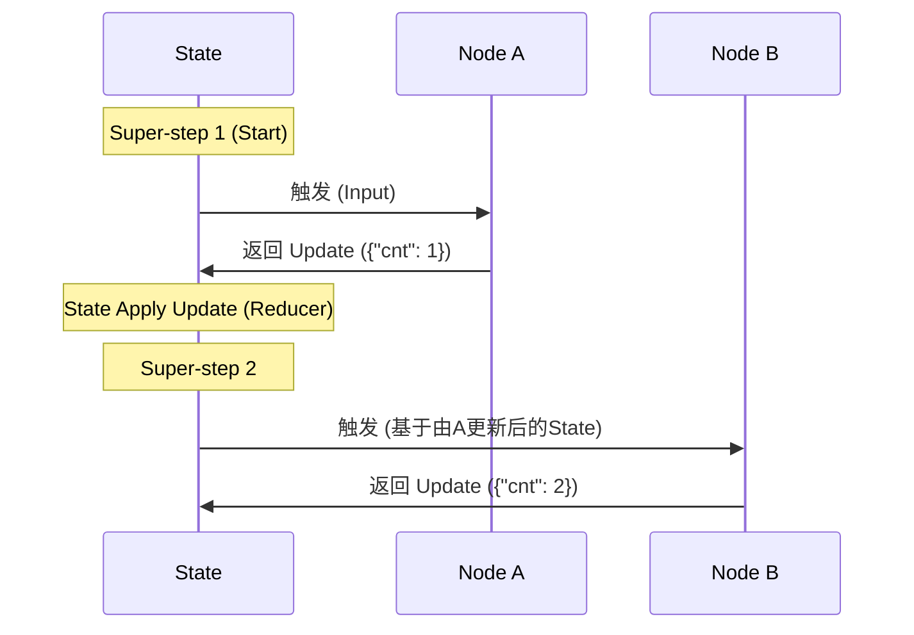

# 第三篇 LangGraph 深入：从 Chain 到 Graph 的思维跃迁

---

## 📌 前置思考：为什么我们需要图？

在 **第二篇** 中，我们体验了快速构建 Agent 带来的便利。它像一个黑盒，我们将 LLM 和 Tools 扔进去，它就能自动运行。

但在生产环境中，我们经常面临这样的挑战：
1.  **非线性流程**：比如 "如果搜索结果为空，先问用户是否换关键词，而不是一直重试"。
2.  **多角色协作**：需要一个 "Research Agent" 负责搜索，一个 "Writer Agent" 负责写作，它们之间需要通过状态切换。
3.  **精确控制**：我们需要精确控制每一步 State 的变化，而不是依赖黑盒内部的 append。

**LangGraph** 应运而生。它不是简单的 DAG（有向无环图），而是一个**带状态的、可循环的、事件驱动的 Actor 模型系统**。

---

## 第1章：LangGraph 架构哲学 (Architecture)

LangGraph 的设计灵感来源于 Google 的 **Pregel** 图计算模型。理解这一点，是精通 LangGraph 的关键。

### 1.1 核心运行机制：BSP 模型

LangGraph 的运行并非简单的 "A调B"，而是遵循 **Bulk Synchronous Parallel (BSP)** 模式。



**关键概念**：
- **Super-step (超步)**：图执行的一个原子周期。所有并行的 Node 执行完，才算一步结束。
- **State (状态)**：图的共享内存。Node **不直接** 通信，而是通过更新 State 来通信。
- **Reducer**：决定 Node 返回的 `dict` 是 "覆盖" State 还是 "追加" 到 State。

### 1.2 三大支柱 (The Three Pillars)

构建任何 Graph，本质上就是定义这三个东西：

| 组件 | 这代表什么？ | 代码体现 |
| :--- | :--- | :--- |
| **State (状态)** | **内存**。当前 Agent 到底知道什么？ | `TypedDict` / `Pydantic` |
| **Nodes (节点)** | **行动**。LLM 思考、工具调用、逻辑判断。 | `def func(state) -> dict:` |
| **Edges (边)** | **路由**。下一步去哪？ | `workflow.add_edge()` |

---

## 第2章：State 深度解析 (State Engineering)

State 是 LangGraph 的灵魂。很多初学者混淆 "State" 和 "Context"。在 LangGraph 中，State 是**强类型**的。

### 2.1 定义 State Schema

最推荐的方式是使用 Python 原生的 `TypedDict`。

```python
from typing import TypedDict, Annotated, List
from langgraph.graph.message import add_messages
from langchain_core.messages import BaseMessage

# 定义我们的图状态
class AgentState(TypedDict):
    # 核心字段：对话历史
    # Annotated[List, add_messages] 是标准范式
    messages: Annotated[List[BaseMessage], add_messages]

    # 自定义字段：当前步骤的总结
    step_summary: str

    # 自定义字段：结构化输出结果
    final_result: dict
```

### 2.2 深入 Reducer：add_messages 的魔法

很多同学只知道 `add_messages` 能追加消息，但它其实隐含了复杂的 **Upsert (更新插入)** 逻辑。

**为什么它很重要？**
在 **Human-in-the-loop**（人工修正）场景中，如果我们想修改 Agent 发出的上一条错误消息，我们不需要删除它，只需要**发送一条 ID 相同的新消息**。

```python
# 假设当前 State
# messages = [HumanMessage(id='1', content='Hi'), AIMessage(id='2', content='Bye')]

# 1. 普通追加 (Append)
# 节点返回: {"messages": [AIMessage(id='3', content='New')]}
# 结果: [msg('1'), msg('2'), msg('3')]

# 2. 更新修正 (Upsert/Update) -> Time Travel 的基础
# 节点返回: {"messages": [AIMessage(id='2', content='Good bye')]}
# 结果: [msg('1'), msg('2', content='Good bye')]  <-- 只有内容变了，ID没变
```

> 💡 **Best Practice**: 始终为你的 Message 分配 `id`，或者利用 LangGraph 自动生成的 ID，以便后续精确控制。

---

## 第3章：构建可控 Agent (Building Control)

为了摆脱预构建 Agent 的黑盒限制，我们从零构建一个 ReAct 循环。

### 3.1 基础循环 (The Loop)

ReAct 的本质就是：Call Model -> Call Tools -> Call Model...

```python
from langgraph.graph import StateGraph, START, END
from langgraph.prebuilt import ToolNode, tools_condition
from langchain_openai import ChatOpenAI
from langchain_core.tools import tool

# 定义模拟工具
@tool
def search_tool(query: str):
    """Search for information"""
    return "LangGraph is powerful"

llm = ChatOpenAI(model="gpt-4o")
tools = [search_tool]

# 1. 定义节点：思考 (Think)
def agent_node(state: AgentState):
    messages = state["messages"]
    model_with_tools = llm.bind_tools(tools)
    response = model_with_tools.invoke(messages)
    # 返回的内容会被 add_messages 追加到 State
    return {"messages": [response]}

# 2. 定义节点：行动 (Act)
tool_node = ToolNode(tools)

# 3. 组装
workflow = StateGraph(AgentState)
workflow.add_node("agent", agent_node)
workflow.add_node("tools", tool_node)

workflow.add_edge(START, "agent")

# 4. 关键：条件路由
# 如果 LLM 决定调用工具 -> 去 "tools"
# 如果 LLM 决定仅回复 -> 去 END
workflow.add_conditional_edges(
    "agent",
    tools_condition,
    {"tools": "tools", END: END}
)

workflow.add_edge("tools", "agent") # 动作完成后，把结果返回给大脑，继续思考
```

### 3.2 动态控制流 (Command API) 🚀

**场景**：假设我们在做一个客服机器人。如果用户说 "再见"，我们需要立刻结束对话，且不经过任何其他判断。或者如果是 "转人工"，我们需要跳转到另一个子图。

传统的 `Conditional Edge` 只能根据当前 State 决定去哪。而 `Command` 允许节点**不仅决定去哪，还能同时更新 State**。

```python
from langgraph.types import Command
from typing import Literal
from langchain_core.messages import SystemMessage

def supervisor_node(state: AgentState) -> Command[Literal["research_agent", "support_agent", END]]:
    """路由节点：决定下一个说话的是谁"""
    user_input = state["messages"][-1].content

    if "投诉" in user_input:
        return Command(
            # 跳转到客服，并附带一条指令（State Update）
            update={"messages": [SystemMessage("注意：用户情绪激动")]},
            # 同时跳转（Control Flow）
            goto="support_agent"
        )
    elif "查询" in user_input:
        return Command(goto="research_agent")

    return Command(goto=END)
```

**为什么 Command 更好？**
- **原子性**：Update + Goto 是原子的。
- **清晰性**：逻辑写在 Python 函数里，而不是分散在 Graph 定义的 Edge 里。

---

## 第4章：企业级特性 (Enterprise Features)

在 Demo 和 Production 之间，隔着 persistence 和 HITL。

### 4.1 持久化 (Persistence)

LangGraph 的持久化不仅是 "保存聊天记录"，它是保存图的**完整快照 (Snapshot)**。

```python
from langgraph.checkpoint.memory import InMemorySaver

# 必须在编译时传入 checkpointer
app = workflow.compile(checkpointer=InMemorySaver())

# 必须在调用时提供 thread_id
config = {"configurable": {"thread_id": "user_123"}}
app.invoke(..., config=config)
```

**底层原理**：
每当一个 Super-step 结束（所有并行节点执行完），LangGraph 就会把当前的 `State` 序列化并存入 Checkpointer。这使得我们可以随时 "加载" 任意历史时刻的状态。

### 4.2 人机回环 (HITL) 与 Time Travel

**场景**：Agent 准备执行 `delete_database()` 操作，我们需要人工审批。

```python
# 1. 编译时设置中断
app = workflow.compile(
    checkpointer=checkpointer,
    interrupt_before=["dangerous_tool_node"]
)

# 2. 运行 -> 暂停在 dangerous_tool_node 之前
app.invoke(...)

# 3. 后台审批：获取当前状态
snapshot = app.get_state(config)
next_step = snapshot.next # ('dangerous_tool_node',)

# 4. 人工决定：
# 选项 A: 批准 -> 继续执行
# app.invoke(None, config=config)

# 选项 B: 拒绝 -> 修改状态 (Time Travel)
# 我们直接把那个 ToolCall 消息改成 "用户拒绝了操作"
from langchain_core.messages import AIMessage

app.update_state(
    config,
    {"messages": [AIMessage(content="操作被拒绝")]},
    # 这里的 as_node 用来伪装成是上一个节点发出的
    as_node="agent"
)
# 然后继续执行，Agent 会看到"操作被拒绝"的消息，而不是去执行工具
app.invoke(None, config=config)
```

这就是 **Time Travel** 的威力：我们不仅能看历史，还能**改写历史**，从而引导 Agent 走向正确的未来。

---

## 第5章：生产级模式 (Production Patterns)

### 5.1 子图 (Subgraphs) - 像乐高一样组合

在复杂的企业应用中，单个 Graph 会变得庞大且难以维护。最佳实践是将其拆分为多个 **子图 (Subgraphs)**。

例如：一个 **主控 Agent** 负责分发任务，一个 **编码 Agent** 负责写代码，一个 **搜索 Agent** 负责查资料。

```python
# 1. 定义子图 (Coding Agent)
# code_graph = StateGraph(CodeState) ...
code_app = code_graph.compile()

# 2. 定义主图 (Main Agent)
main_graph = StateGraph(MainState)

# 3. 将编译好的子图作为一个普通节点加入！
# 注意：入参和出参需要通过 wrapper 转换，或者确保 State 兼容
main_graph.add_node("coding_expert", code_app)

# 4. 路由
main_graph.add_conditional_edges("supervisor", router_logic, {"code": "coding_expert", ...})
```

**为什么这么做？**
- **解耦**：Coding Agent 可以由团队 A 维护，Main Agent 由团队 B 维护。
- **复用**：同一个 Search Agent 可以被多个不同的主图调用。

### 5.2 动态并行 (Map-Reduce with Send)

LangGraph 不仅支持静态的并行（A->B, A->C），还支持动态的并行（Map-Reduce）。
例如：你有 10 个 PDF 文档需要总结，但这 10 个数量是动态的。

使用 `Send` API，我们可以在运行时分发任务：

```python
from langgraph.types import Send

# 1. Map 步骤：生成任务列表
def map_node(state: State):
    subjects = state["subjects"] # ["AI", "Python", "Rust"]
    # 为每个 subject 生成一个 Send 对象
    # Send(节点名, 节点需要的State)
    return [Send("generate_joke", {"subject": s}) for s in subjects]

# 2. Worker 节点：处理单个任务
def generate_joke(state: WorkerState):
    return {"jokes": [f"Joke about {state['subject']}"]}

# 3. 注册 Conditional Edge
# map_node -> 动态分发给 generate_joke
workflow.add_conditional_edges("map_node", map_node)
```

这让 LangGraph 能够处理大规模的数据处理流水线。

### 5.3 运行时配置 (Configuration)

硬编码模型参数是生产环境的大忌。LangGraph 允许通过 `configurable` 字典在运行时透传参数。

**定义节点时接收 config**：

```python
from langchain_core.runnables import ConfigurableField, RunnableConfig

def model_node(state: AgentState, config: RunnableConfig):
    # 1. 获取运行时参数
    user_id = config.get("configurable", {}).get("user_id")
    model_name = config.get("configurable", {}).get("model", "gpt-4")

    # 2. 根据参数动态调整行为
    # llm = ChatOpenAI(model=model_name)
    # ...
```

**调用时传递**：

```python
app.invoke(
    inputs,
    config={"configurable": {"user_id": "1001", "model": "claude-3-5-sonnet"}}
)
```

---

## 第6章：健壮性与调试 (Robustness & Debugging)

生产级应用不仅仅是功能跑通，还要能抗住异常，并且易于调试。

### 6.1 重试策略 (Retry Policies)

网络波动、API 限流是常态。LangGraph 允许在 Node 级别从外部配置重试，而不需要在每个函数内部写 `try...except` 循环。

```python
from langgraph.types import RetryPolicy

# 定义重试策略
policy = RetryPolicy(
    max_attempts=3,          # 最多重试3次
    initial_interval=1.0,    # 初始间隔1秒
    backoff_factor=2.0,      # 每次间隔翻倍 (指数退避)
    retry_on=TimeoutError    # 仅针对特定异常重试
)

# 应用到节点
workflow.add_node("agent", call_model, retry_policy=policy)
```

**为什么这比内部 try-catch 好？**
- **解耦**：业务逻辑保持纯净。
- **透明**：Graph Engine 知道重试发生，可以在监控中记录。

### 6.2 可视化 (Visualization)

当你构建了复杂的图后，肉眼检查代码连接关系非常困难。LangGraph 可以自动生成 Mermaid 图。

```python
from IPython.display import Image, display

# 将编译后的图转换为 Mermaid PNG
png_bytes = app.get_graph().draw_mermaid_png()

# 保存或展示
with open("graph.png", "wb") as f:
    f.write(png_bytes)
```

这对于与非技术人员（产品经理）沟通逻辑至关重要。

### 6.3 异常处理与事务 (Transactional)

LangGraph 的每一步（Super-step）都是事务性的。
- 如果并行执行的三个 Node 中有一个抛出未捕获异常。
- **整个 Super-step 回滚**（即另外两个成功的 Node 的 State 更新也不会应用）。
- 这保证了 State 的一致性，不会出现“一半成功一半失败”的脏数据。

---

## 7. 结语

现在，我们的 LangGraph 技能树已经完整了：
- **核心**：StateGraph, Nodes, Edges
- **控制**：Command (GoTo/Update)
- **记忆**：Checkpointer (Thread ID)
- **运维**：RetryPolicy, Streaming

你已经准备好从 Playbook 走向 Production 了。
