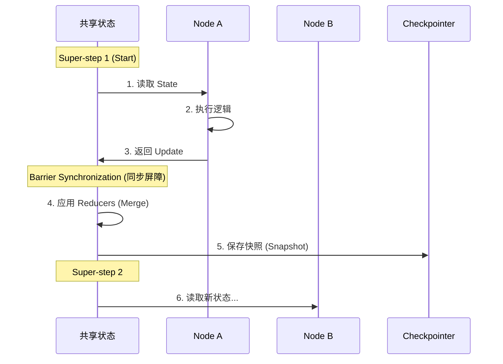

# 第三篇 LangGraph 深入：从 Chain 到 Graph 的思维跃迁

---

## 📌 本篇概要

本篇将深入 LangGraph 的核心架构，从生产级 State 设计模式到原子化的控制流。

| 章节 | 核心内容 | 学习目标 |
|:---|:---|:---|
| **第1章** | 架构哲学 | BSP 模型、Pregel 运行时机制 |
| **第2章** | 状态工程 | `MessagesState` 标准范式、Input/Output Schema 分离 |
| **第3章** | 路由控制 | **Command API** 原子化路由 |
| **第4章** | 持久化与记忆 | Checkpoint 快照机制、Time Travel 状态回滚 |
| **第5章** | 生产级模式 | Streaming 流式输出、运行时配置 Config |

> 💡 **前置知识**: 需掌握第二篇的 Agent 基础。本篇代码基于 LangChain 1.0+ 和 LangGraph 最新标准。

---

## 第1章：LangGraph 架构哲学 (Architecture)

### 1.1 从无状态 DAG 到有状态 Actor

在 LangChain 时代，我们构建的是 **DAG (有向无环图)**，数据像流水一样经过 `Prompt -> Model -> Parser`。

但在构建复杂的 Agent 时，我们需要处理：
1.  **循环 (Loops)**：思考 -> 行动 -> 观察 -> 再思考...
2.  **持久状态 (Persistence)**：多轮对话的记忆管理。
3.  **分支决策 (Branching)**：根据工具执行结果决定下一步。

LangGraph 引入了 **Actor Model** 和 **State Machine (状态机)** 的概念，让 LLM 应用具备了“图”的能力。

### 1.2 核心运行机制：BSP 模型

LangGraph 的底层设计灵感源自 Google Pregel 图计算模型，采用 **BSP (Bulk Synchronous Parallel)** 机制。这是理解并发与状态一致性的基石。



**关键特性**：
*   **并行隔离**：在同一个 Step 中，Node A 看不到 Node B 的更新。
*   **统一归约**：所有更新在 Step 结束时统一合并 (Reduce)。
*   **三阶段执行**：Plan (规划) -> Execute (执行) -> Update (更新)。

---

## 第2章：状态工程 (State Engineering)

在 LangGraph 中，State 不仅仅是数据的集合，更是通信的协议。官方文档推荐使用标准化的模式来定义状态。

### 2.1 核心标准：MessagesState

LangGraph 提供了开箱即用的 **`MessagesState`**，它内置了 `messages` 字段和 `add_messages` reducer。这是构建 Chat Agent 的标准起点。

```python
from langgraph.graph import MessagesState

# ✅ 最佳实践：继承 MessagesState 来定义你的 Agent State
class AgentState(MessagesState):
    # messages 字段已自动包含，能够正确处理追加和更新
    # 仅需定义额外的业务字段
    documents: list[str]
    steps_taken: int
```

**为什么直接用 `MessagesState`？**
1.  **内置 Reducer**：自动处理消息的追加 (Append) 和更新 (Update)。
2.  **减少样板**：避免了手动编写 `Annotated[list, add_messages]` 的繁琐和易错。
3.  **兼容性**：与 LangGraph 的预置组件 (如 `ToolNode`) 完美兼容。

### 2.2 生产级模式：Input/Output Schema 分离

对于对外提供 API 的服务，官方强烈建议显式区分 **Input** (输入)、**Output** (输出) 和 **Overall** (内部) 状态。

```python
from typing import TypedDict

# 1. 定义输入契约 (用户请求)
class InputState(TypedDict):
    question: str
    user_id: str

# 2. 定义输出契约 (API 响应)
class OutputState(TypedDict):
    answer: str
    confidence: float

# 3. 定义内部状态 (全量上下文)
# 继承 Input 和 Output，并添加私有字段
class OverallState(InputState, OutputState):
    scratchpad: list[str]   # 私有字段：思考过程

# 4. 构建图时指定 Schema
# graph = StateGraph(OverallState, input=InputState, output=OutputState)
```

> 💡 **Best Practice**: 这种模式非常适合 REST API 封装，能够清晰地隔离"用户传的"、"系统算的"和"最终返回的"。

### 2.3 深入 add_messages 的 Upsert 机制

`MessagesState` 背后的核心是 `add_messages` reducer。它的行为不仅仅是 append：

1.  **Append (追加)**: 如果新消息 ID 不存在，追加到列表。
2.  **Update (更新)**: 如果新消息 ID 已存在，**替换**旧消息内容。

这是实现 **Human Correction (人工修正)** 的关键：我们无需删除错误消息，只需注入一条 ID 相同的新消息即可覆盖。

---

## 第3章：构建可控 Agent (Command API)

LangGraph 引入了原子化的 **Command API**，这是目前控制流的最佳实践。别再写分散的 `conditional_edges` 了。

### 3.1 实战：使用 Command 实现原子路由

我们将构建一个具备天气查询能力的 ReAct Agent。

**步骤 1：定义工具与模型**

```python
from langchain_openai import ChatOpenAI
from langchain_core.tools import tool

@tool
def get_weather(city: str):
    """查询指定城市的天气"""
    return f"{city} 天气晴朗，25℃"

tools = [get_weather]
model = ChatOpenAI(model="gpt-4o").bind_tools(tools)
```

**步骤 2：定义 Agent 节点 (使用 Command)**

```python
from langgraph.types import Command
from langgraph.graph import END
from typing import Literal

# 定义 Agent 节点
def agent_node(state: AgentState) -> Command[Literal["tools", END]]:
    messages = state["messages"]
    response = model.invoke(messages)

    # 构造状态更新 (Command 的 update 参数)
    update = {"messages": [response]}

    # 核心路由逻辑：原子化决定去向
    if response.tool_calls:
        # 原子操作：更新状态 + 跳转 tools
        return Command(
            update=update,
            goto="tools"
        )

    # 否则 -> 更新状态并结束
    return Command(update=update, goto=END)
```

**步骤 3：组装 Graph**

```python
from langgraph.graph import StateGraph, START
from langgraph.prebuilt import ToolNode

# 使用我们自定义的 AgentState
workflow = StateGraph(AgentState)

# 添加节点
workflow.add_node("agent", agent_node)
workflow.add_node("tools", ToolNode(tools)) # 使用官方预置的 ToolNode

# 定义边
workflow.add_edge(START, "agent")
workflow.add_edge("tools", "agent") # 工具执行完，必须回到 Agent 继续思考

# 编译应用
app = workflow.compile()
```

### 3.2 为什么 Command API 是未来？

| 特性 | 旧版 Conditional Edge | 新版 Command API |
|:---|:---|:---|
| **代码位置** | 分散在 `add_conditional_edges` | 内聚在 Node 函数内部 |
| **状态更新** | 无法在路由时更新 State | `update` 参数支持原子更新 |
| **可读性** | 逻辑割裂，难以调试 | 类似 `return goto`，符合编程直觉 |

---

## 第4章：持久化与 Time Travel

### 4.1 Checkpoint 机制

LangGraph 的持久化是对 **Graph State** 的完整 **Snapshot (快照)**。

```python
from langgraph.checkpoint.memory import MemorySaver

# 1. 注入 Checkpointer (生产环境推荐 PostgresSaver)
checkpointer = MemorySaver()
app = workflow.compile(checkpointer=checkpointer)

# 2. 运行时指定 Thread ID
config = {"configurable": {"thread_id": "session_1"}}

# 第一轮
app.invoke({"messages": [("user", "Hello")]}, config=config)
```

### 4.2 Time Travel (状态回滚)

利用快照，我们可以“穿越”回任意历史状态并分叉执行。

```python
# 1. 获取历史快照
history = list(app.get_state_history(config))
last_snapshot = history[1] # 获取倒数第二步

# 2. Fork 执行 (从过去的状态分叉)
fork_config = config.copy()
fork_config["configurable"]["checkpoint_id"] = last_snapshot.config["configurable"]["checkpoint_id"]

app.invoke(
    {"messages": [("user", "Wait, actually I mean...")]},
    config=fork_config
)
```

---

## 第5章：生产级高级模式 (Advanced Patterns)

### 5.1 Streaming 流式输出

前端交互必备。

```python
# 模式: stream_mode="updates" (推荐)
# 只推送状态的增量变化 (Delta)
async for chunk in app.astream(inputs, stream_mode="updates"):
    for node, update in chunk.items():
        print(f"Node {node} updated: {update}")
```

### 5.2 运行时配置 (Configuration)

避免硬编码，实现多租户隔离。

```python
from langchain_core.runnables import RunnableConfig

def agent_node(state: AgentState, config: RunnableConfig):
    # 从 config 中读取动态参数
    user_id = config.get("configurable", {}).get("user_id")
    model_name = config.get("configurable", {}).get("model", "gpt-4o")

    # 动态构建模型
    model = ChatOpenAI(model=model_name)
    ...

# 调用时传参
app.invoke(inputs, config={"configurable": {"model": "claude-3-5-sonnet"}})
```

## 第6章：健壮性与调试 (Robustness & Debugging)

生产级应用不仅仅是功能跑通，还要能抗住异常，并且易于调试。

### 6.1 重试策略 (Retry Policies)

网络波动、API 限流是常态。LangGraph 允许在 Node 级别从外部配置重试，而不需要在每个函数内部写 `try...except` 循环。

```python
from langgraph.types import RetryPolicy

# 定义重试策略
policy = RetryPolicy(
    max_attempts=3,          # 最多重试3次
    initial_interval=1.0,    # 初始间隔1秒
    backoff_factor=2.0,      # 每次间隔翻倍 (指数退避)
    retry_on=TimeoutError    # 仅针对特定异常重试
)

# 应用到节点
workflow.add_node("agent", call_model, retry_policy=policy)
```

**为什么这比内部 try-catch 好？**

- **解耦**：业务逻辑保持纯净。
- **透明**：Graph Engine 知道重试发生，可以在监控中记录。

### 6.2 可视化 (Visualization)

当你构建了复杂的图后，肉眼检查代码连接关系非常困难。LangGraph 可以自动生成 Mermaid 图。

```python
from IPython.display import Image, display

# 将编译后的图转换为 Mermaid PNG
png_bytes = app.get_graph().draw_mermaid_png()

# 保存或展示
with open("graph.png", "wb") as f:
    f.write(png_bytes)
```

这对于与非技术人员（产品经理）沟通逻辑至关重要。

### 6.3 异常处理与事务 (Transactional)

LangGraph 的每一步（Super-step）都是事务性的。

- 如果并行执行的三个 Node 中有一个抛出未捕获异常。
- **整个 Super-step 回滚**（即另外两个成功的 Node 的 State 更新也不会应用）。
- 这保证了 State 的一致性，不会出现“一半成功一半失败”的脏数据。

## 本篇小结

通过本篇的学习，你应该已经掌握了 LangGraph 的**标准开发范式**：

1.  **State**: 始终继承 **`MessagesState`**，利用内置的 `add_messages` 处理对话历史。
2.  **Control**: 拥抱 **`Command` API**，在 Node 内部原子化地处理状态更新与路由。
3.  **Ops**: 熟练使用 Checkpoint 进行状态管理和回滚，利用 Streaming 优化用户体验。

掌握了这些，你已经构建了坚实的各类 Agent 应用基石。
