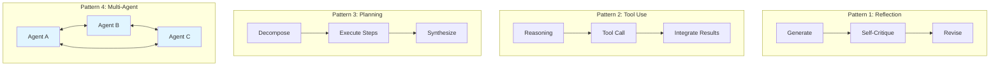
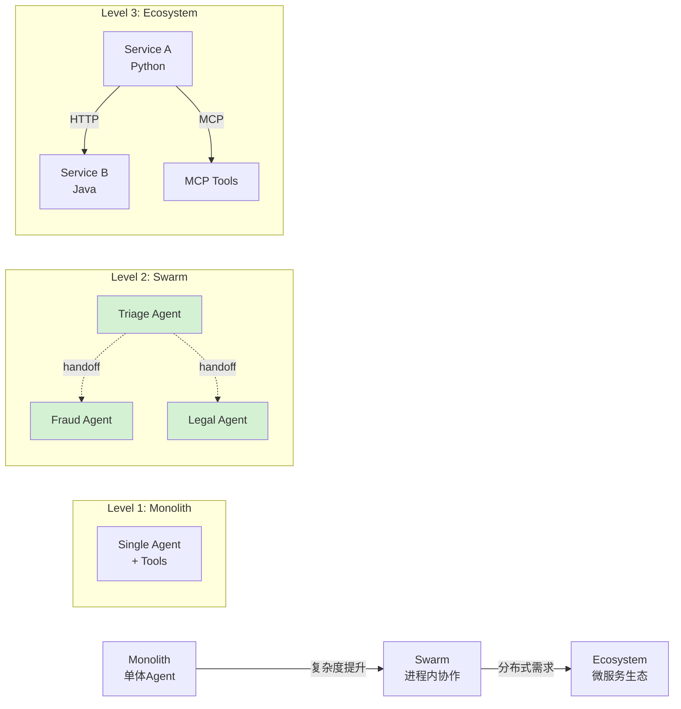
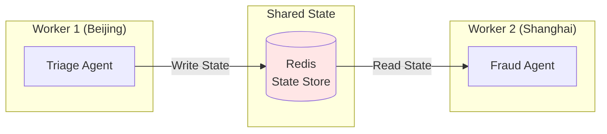
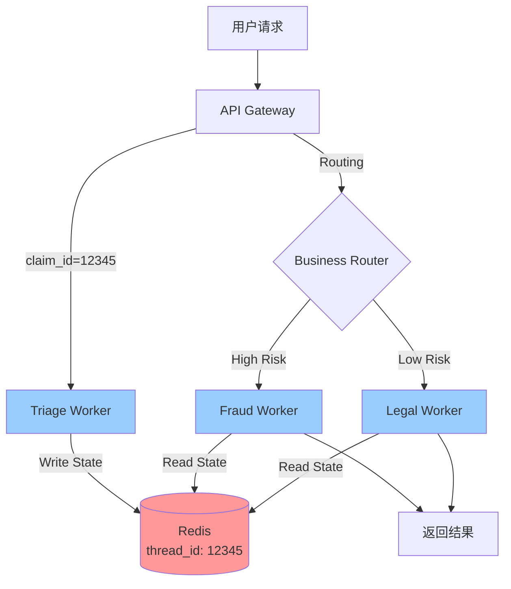
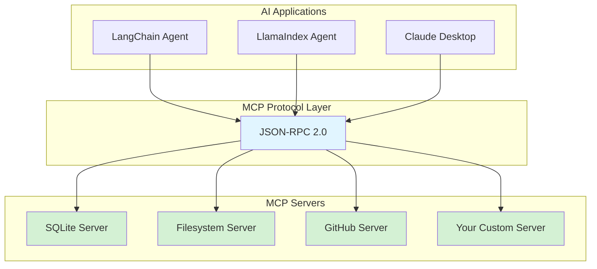
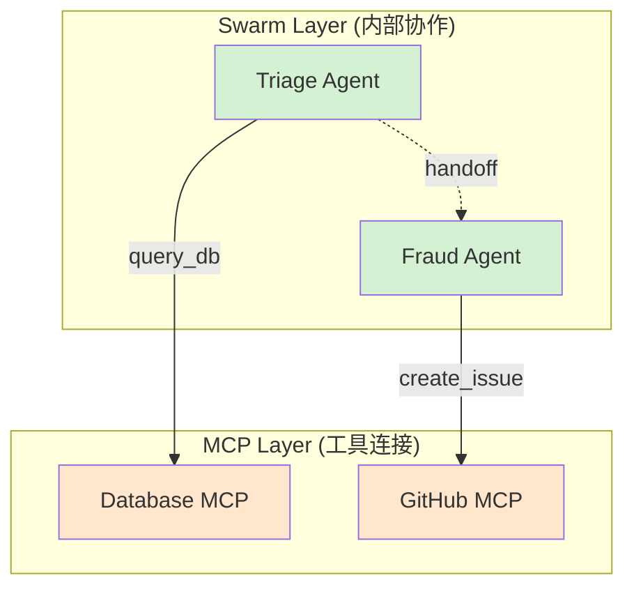
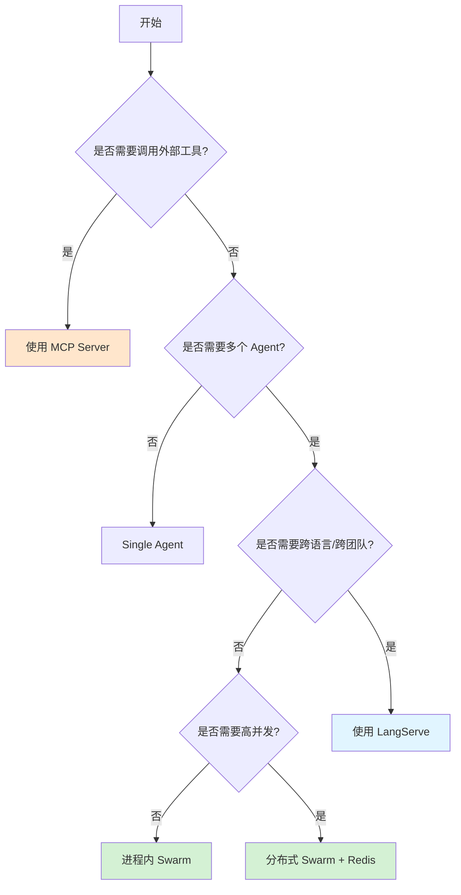

# 第九篇 Agent 架构设计

> **本章摘要**
>
> 引用吴恩达教授观点：Agentic Workflow 的未来在于 **协作 (Collaboration)**。本章将深入探讨 **Multi-Agent Systems (MAS)**，学习如何构建 **去中心化 (Swarm)**、**分布式 (Distributed)** 和 **开放连接 (MCP)** 的智能系统。
>
> 我们将采用 **LangGraph 官方标准**，废弃手写的轮子，聚焦于工业级的架构模式和最佳实践。

## 目录导航

1.  **协作模式演进 (Patterns)**
2.  **Swarm 模式详解 (Official Way)**
3.  **分布式协作 (Distributed State)**
4.  **微服务化标准 (LangServe)**
5.  **标准化工具协议 (MCP)**
6.  **架构总结与选型指南**

---

## 第1章：协作模式演进 (Patterns)

### 1.1 吴恩达的四种 Agentic 模式

在 2024 年的演讲中，Andrew Ng 总结了四种核心的 Agentic Workflow 模式：



**本章聚焦** Pattern 4：**Multi-Agent Collaboration（多智能体协作）**。

### 1.2 架构演进：从单体到生态



1.  **Monolith**：单个 Agent 处理所有逻辑，受限于上下文窗口和推理复杂度。
2.  **Swarm**：多个专家 Agent 在同一进程中协作，通过 Handoff 机制移交控制权。
3.  **Ecosystem**：跨进程、跨语言的微服务架构，通过标准协议互联。

---

## 第2章：Swarm 模式详解 (Official Way)

### 2.1 核心定义：Swarm ≠ 蜂群算法

在 LangGraph 语境下，**Swarm** 不是指分布式群体智能算法，而是指：

> **多个 Agent 通过 Handoffs（控制权移交）进行去中心化协作的设计模式。**

**关键特性**：
- **去中心化**：没有中央路由器，每个 Agent 自己决定下一步该谁接手。
- **Handoff**：不只是返回结果，而是传递完整的上下文和控制权。
- **共享状态**：所有 Agent 操作同一个 State 对象。

### 2.2 官方推荐写法：Tool-Based Routing

LangGraph 官方推荐的 Multi-Agent 实现方式是：**定义 `transfer_to_X` 工具，通过 Tool Call 触发条件边跳转**。

#### 2.2.1 实战场景：保险理赔系统

**业务流程**：
```
用户提交理赔
  → Triage Agent (分流)
  → Claim Processor (初审)
  → 风控 Agent / 法务 Agent (专业处理)
  → 结案
```

#### 2.2.2 Step 1: 定义全局状态

```python
from typing import Annotated, TypedDict
from langgraph.graph.message import add_messages

class InsuranceState(TypedDict):
    """全局共享状态"""
    messages: Annotated[list, add_messages]  # 对话历史（自动合并）
    claim_id: str                             # 案件ID
    risk_score: float                         # 风险评分
    current_agent: str                        # 当前处理人
```

**关键点**：使用 `add_messages` 注解，LangGraph 会自动合并消息而不是覆盖。

#### 2.2.3 Step 2: 创建 Transfer 工具

```python
from langchain_core.tools import tool

def create_transfer_tool(target_agent: str):
    """工厂函数：生成移交工具"""
    @tool(f"transfer_to_{target_agent}")
    def transfer() -> str:
        f"""将任务移交给 {target_agent} 继续处理。"""
        return target_agent
    return transfer
```

**为什么这样设计**？
- Tool 的返回值会被路由函数读取，决定下一个节点。
- Tool 的 docstring 会成为 LLM 的决策依据。

#### 2.2.4 Step 3: 定义 Agent 节点

```python
from langchain_openai import ChatOpenAI
from langchain_core.messages import SystemMessage

llm = ChatOpenAI(model="gpt-4o", temperature=0)

# === Triage Agent ===
triage_tools = [
    create_transfer_tool("ClaimProcessor")
]

def triage_node(state: InsuranceState):
    """分流专员：收集信息并转发"""
    system_msg = SystemMessage(content="""
    你是理赔分流专员。职责：
    1. 询问用户案件编号和基本情况
    2. 记录到系统后，调用 transfer_to_ClaimProcessor 移交
    """)

    response = llm.bind_tools(triage_tools).invoke(
        [system_msg] + state["messages"]
    )
    return {"messages": [response]}

# === Claim Processor ===
processor_tools = [
    create_transfer_tool("FraudDetector"),
    create_transfer_tool("LegalAdvisor")
]

def processor_node(state: InsuranceState):
    """初审专员：计算风险并分流"""
    system_msg = SystemMessage(content="""
    你是理赔初审员。职责：
    1. 分析案件，计算风险评分（0-100）
    2. 如果风险 > 70，调用 transfer_to_FraudDetector
    3. 否则调用 transfer_to_LegalAdvisor
    """)

    response = llm.bind_tools(processor_tools).invoke(
        [system_msg] + state["messages"]
    )
    return {"messages": [response]}

# === Fraud Detector ===
def fraud_node(state: InsuranceState):
    """风控专员：终端节点，不再移交"""
    system_msg = SystemMessage(content="你是风控专员，进行最终审核。")
    response = llm.invoke([system_msg] + state["messages"])
    return {"messages": [response]}

# === Legal Advisor ===
def legal_node(state: InsuranceState):
    """法务专员：终端节点"""
    system_msg = SystemMessage(content="你是法务顾问，提供法律意见。")
    response = llm.invoke([system_msg] + state["messages"])
    return {"messages": [response]}
```

#### 2.2.5 Step 4: 构建路由图

```python
from langgraph.graph import StateGraph, END

# 1. 初始化图
workflow = StateGraph(InsuranceState)

# 2. 添加节点
workflow.add_node("Triage", triage_node)
workflow.add_node("ClaimProcessor", processor_node)
workflow.add_node("FraudDetector", fraud_node)
workflow.add_node("LegalAdvisor", legal_node)

# 3. 定义路由函数
def router(state: InsuranceState):
    """根据最后一条消息的 Tool Call 决定路由"""
    last_msg = state["messages"][-1]

    # 检查是否有工具调用
    if hasattr(last_msg, "tool_calls") and last_msg.tool_calls:
        tool_call = last_msg.tool_calls[0]
        tool_name = tool_call["name"]

        # 如果是 transfer_to_X 工具，返回目标节点名
        if tool_name.startswith("transfer_to_"):
            return tool_name.replace("transfer_to_", "")

    # 否则结束
    return END

# 4. 添加条件边（核心机制）
workflow.add_conditional_edges("Triage", router)
workflow.add_conditional_edges("ClaimProcessor", router)

# 5. 终端节点直接结束
workflow.add_edge("FraudDetector", END)
workflow.add_edge("LegalAdvisor", END)

# 6. 设置入口
workflow.set_entry_point("Triage")

# 7. 编译
app = workflow.compile()
```

**关键设计点**：
- `add_conditional_edges(node, router)`：让 router 函数根据 state 决定下一步。
- router 通过解析 `tool_calls` 实现动态路由。
- 这是 **LangGraph 官方推荐的 Handoff 标准写法**。

#### 2.2.6 运行测试

```python
from langchain_core.messages import HumanMessage

result = app.invoke({
    "messages": [HumanMessage(content="我要报案，案件号 C12345")],
    "claim_id": "",
    "risk_score": 0.0,
    "current_agent": ""
})

print(result["messages"][-1].content)
```

**执行流程**：
```
Triage: 收集信息 → 调用 transfer_to_ClaimProcessor
  ↓
ClaimProcessor: 计算风险 → 调用 transfer_to_FraudDetector
  ↓
FraudDetector: 最终审核 → END
```

### 2.3 Swarm 模式总结

**优点**：
- 状态共享零成本（内存级）
- 开发调试简单
- 适合复杂业务流程

**局限**：
- 所有 Agent 必须在同一进程
- 无法跨语言、跨团队复用
- 受单机资源限制

**何时使用**：保险理赔、工单审批、复杂咨询等需要多角色紧密协作的场景。

---

## 第3章：分布式协作 (Distributed State)

### 3.1 问题：Swarm 的单点瓶颈

在上一章中，所有 Agent 必须在同一个 Python 进程里。但现实场景往往需要：
- **水平扩展**：多个 Worker 处理并发请求。
- **跨地域部署**：Triage 在北京，Fraud 在上海。
- **语言异构**：Python 写的 Agent 调用 Java 写的风控服务。

**核心挑战**：如何让分布式的 Agent 共享状态？

### 3.2 解决方案：Shared State via Database

LangGraph 提供了 **Checkpointer** 机制，将 State 持久化到外部存储。



### 3.3 实战：Redis Checkpointer

#### 3.3.1 安装依赖

```bash
pip install langgraph-checkpoint-redis redis
```

#### 3.3.2 修改代码：启用持久化

```python
from langgraph.checkpoint.redis import RedisSaver
import redis

# 1. 连接 Redis
redis_client = redis.Redis(host="localhost", port=6379, db=0)

# 2. 创建 Checkpointer
checkpointer = RedisSaver(redis_client)

# 3. 编译时传入
app = workflow.compile(checkpointer=checkpointer)
```

#### 3.3.3 分布式运行

**Worker 1（Triage 服务）：**
```python
# worker_triage.py
from fastapi import FastAPI
from langserve import add_routes

# 只包含 Triage 节点的子图
triage_graph = create_triage_subgraph()
triage_app = triage_graph.compile(checkpointer=checkpointer)

api = FastAPI()
add_routes(api, triage_app, path="/triage")

# 启动：uvicorn worker_triage:api --port 8001
```

**Worker 2（Fraud 服务）：**
```python
# worker_fraud.py
fraud_graph = create_fraud_subgraph()
fraud_app = fraud_graph.compile(checkpointer=checkpointer)

api = FastAPI()
add_routes(api, fraud_app, path="/fraud")

# 启动：uvicorn worker_fraud:api --port 8002
```

**核心机制**：
1. Triage 处理完后，将 State 写入 Redis（thread_id 作为 key）。
2. Router 根据业务逻辑将请求转发到 Fraud 服务。
3. Fraud 服务从 Redis 读取 State，继续处理。

### 3.4 Thread ID：分布式协作的钥匙

```python
# 调用时必须指定 thread_id
config = {"configurable": {"thread_id": "claim-12345"}}

# Worker 1
result1 = triage_app.invoke(input_data, config=config)

# Worker 2（使用相同 thread_id）
result2 = fraud_app.invoke(None, config=config)  # 自动恢复状态
```

**最佳实践**：
- 使用业务 ID（如 `claim_id`）作为 thread_id。
- 设置 TTL，定期清理过期状态。

### 3.5 分布式架构图



**这才是企业级的 Swarm**：去中心化 + 分布式。

---

## 第4章：微服务化标准 (LangServe)

### 4.1 为什么需要 LangServe？

在分布式 Swarm 中，我们需要将 Agent 暴露为 HTTP 服务。传统做法是手写 FastAPI 路由，但这会带来问题：
- 需要手动处理流式输出 (Streaming)
- 需要实现批处理 (Batch) 接口
- 缺乏标准化的错误处理
- 无法自动生成 OpenAPI 文档

**LangServe 的价值**：一行代码搞定所有。

### 4.2 核心 API：add_routes

```python
from fastapi import FastAPI
from langserve import add_routes

app = FastAPI()

# 魔法：将任何 Runnable 变成 REST API
add_routes(
    app,
    your_agent_or_chain,
    path="/agent",
    enabled_endpoints=["invoke", "batch", "stream"]
)
```

**自动生成的端点**：
- `POST /agent/invoke`：同步调用
- `POST /agent/batch`：批量调用
- `POST /agent/stream`：流式输出（SSE）
- `GET /agent/playground`：可视化调试界面
- `GET /agent/input_schema`：输入 JSON Schema
- `GET /agent/output_schema`：输出 JSON Schema

### 4.3 实战：暴露保险 Swarm

```python
# server.py
from fastapi import FastAPI
from langserve import add_routes
from insurance_swarm import app as swarm_app  # 之前定义的 LangGraph

api = FastAPI(
    title="Insurance Claims API",
    version="1.0",
    description="Distributed multi-agent insurance processing"
)

add_routes(
    api,
    swarm_app,
    path="/claims",
    enabled_endpoints=["invoke", "stream"]
)

if __name__ == "__main__":
    import uvicorn
    uvicorn.run(api, host="0.0.0.0", port=8000)
```

**启动服务后**，访问 `http://localhost:8000/docs` 即可看到完整的 API 文档。

### 4.4 客户端调用：RemoteRunnable

```python
# client.py
from langserve import RemoteRunnable

# 连接远程服务
remote_claims = RemoteRunnable("http://localhost:8000/claims")

# 像调用本地函数一样
result = remote_claims.invoke({
    "messages": [{"role": "user", "content": "报案编号 C9527"}],
    "claim_id": "",
    "risk_score": 0.0
})

print(result["messages"][-1]["content"])
```

**流式调用**：
```python
for chunk in remote_claims.stream(input_data):
    print(chunk, end="", flush=True)
```

### 4.5 LangServe 的高级特性

**1. 自动类型转换**
```python
# 服务端定义 Pydantic 模型
class ClaimInput(BaseModel):
    claim_id: str
    description: str

# 客户端自动校验
remote_claims.invoke(ClaimInput(claim_id="C123", description="车损"))
```

**2. LangSmith 集成**
```python
# 只需设置环境变量，LangServe 自动上报追踪数据
os.environ["LANGCHAIN_TRACING_V2"] = "true"
os.environ["LANGCHAIN_API_KEY"] = "your-key"
```

**3. 自定义中间件**
```python
from fastapi.middleware.cors import CORSMiddleware

app.add_middleware(
    CORSMiddleware,
    allow_origins=["*"],
    allow_methods=["*"]
)
```

### 4.6 LangServe vs 手写 FastAPI

| 特性 | LangServe | 手写 FastAPI |
|------|-----------|--------------|
| 开发时间 | 5 分钟 | 2 小时 |
| 流式输出 | 自动支持 | 需手动实现 SSE |
| 批处理 | 自动优化 | 需自己写并发逻辑 |
| OpenAPI 文档 | 自动生成 | 需手写装饰器 |
| LangSmith 追踪 | 零配置 | 需集成 SDK |

**结论**：除非有特殊需求（如 WebSocket、gRPC），否则应该优先使用 LangServe。

---

## 第5章：标准化工具协议 (MCP)

### 5.1 MCP 的定位

在前面的章节中，我们解决了 **Agent 之间的协作**。但还有一个问题：**如何连接外部工具**？

传统做法：为每个 Agent 框架（LangChain、LlamaIndex、AutoGPT）都写一遍工具代码。

**MCP (Model Context Protocol)** 的愿景：**Write once, run anywhere.**

### 5.2 MCP 架构原理



**核心概念**：
- **MCP Server**：独立进程，通过 stdio 或 HTTP 暴露能力。
- **MCP Client**：Agent 框架侧的适配器，负责发现和调用 Server。
- **通信协议**：基于 JSON-RPC 2.0，传输层可以是 stdio、SSE、WebSocket。

### 5.3 MCP 的三种原语

MCP Server 可以暴露三种类型的能力：

**1. Resources（资源）**：只读数据源
```python
@mcp.resource("user://profile/{user_id}")
def get_user_profile(user_id: str):
    return {"name": "Alice", "age": 30}
```

**2. Tools（工具）**：可执行操作
```python
@mcp.tool()
def send_email(to: str, subject: str, body: str):
    """发送邮件"""
    # 实际发送逻辑
    return "Email sent"
```

**3. Prompts（提示词模板）**：预设提示
```python
@mcp.prompt()
def code_review_prompt(language: str):
    return f"Review this {language} code for security issues..."
```

### 5.4 实战：构建 SQLite MCP Server

#### 5.4.1 服务端实现

```python
# db_server.py
from mcp.server.fastmcp import FastMCP
import sqlite3

# 初始化 MCP Server
mcp = FastMCP("DatabaseService")

@mcp.tool()
def query_db(sql: str) -> str:
    """执行只读 SQL 查询

    Args:
        sql: SELECT 语句（不允许 UPDATE/DELETE）

    Returns:
        查询结果的 JSON 字符串
    """
    # 安全检查
    if not sql.strip().lower().startswith("select"):
        return "Error: Only SELECT queries allowed"

    try:
        conn = sqlite3.connect("claims.db")
        cursor = conn.cursor()
        cursor.execute(sql)
        results = cursor.fetchall()
        conn.close()
        return str(results)
    except Exception as e:
        return f"Error: {str(e)}"

@mcp.resource("db://schema")
def get_schema():
    """获取数据库表结构"""
    conn = sqlite3.connect("claims.db")
    cursor = conn.cursor()
    cursor.execute("SELECT name FROM sqlite_master WHERE type='table'")
    tables = cursor.fetchall()
    conn.close()
    return {"tables": tables}

if __name__ == "__main__":
    mcp.run()  # 默认通过 stdio 运行
```

#### 5.4.2 客户端调用

```python
# agent.py
from langchain_mcp_adapters.client import MultiServerMCPClient
from langchain.agents import create_react_agent
from langchain_openai import ChatOpenAI

async def main():
    # 1. 连接 MCP Server
    client = MultiServerMCPClient({
        "database": {
            "transport": "stdio",
            "command": "python",
            "args": ["db_server.py"]
        }
    })

    # 2. 自动发现并加载工具
    tools = await client.get_tools()
    print(f"Loaded tools: {[t.name for t in tools]}")
    # 输出: ['query_db']

    # 3. 创建 Agent
    llm = ChatOpenAI(model="gpt-4o")
    agent = create_react_agent(llm, tools)

    # 4. 运行
    result = agent.invoke({
        "input": "查询 claims 表中风险评分大于 80 的案件数量"
    })
    print(result["output"])

import asyncio
asyncio.run(main())
```

**执行流程**：
```
Agent: "需要查数据库"
  → 调用 query_db 工具
  → MCP Client 通过 stdio 发送 JSON-RPC 请求到 db_server.py
  → db_server.py 执行 SQL 并返回结果
  → Agent 收到结果并生成最终回答
```

### 5.5 MCP 的生态优势

**官方 MCP Servers**（开箱即用）：
- `@modelcontextprotocol/server-sqlite`：SQLite 操作
- `@modelcontextprotocol/server-filesystem`：文件系统访问
- `@modelcontextprotocol/server-github`：GitHub API
- `@modelcontextprotocol/server-brave-search`：搜索引擎

**使用方法**：
```bash
# 安装
npm install -g @modelcontextprotocol/server-github

# 配置到 Agent
client = MultiServerMCPClient({
    "github": {
        "transport": "stdio",
        "command": "mcp-server-github",
        "env": {"GITHUB_TOKEN": "your-token"}
    }
})
```

### 5.6 MCP vs 直接调用 API

| 方式 | MCP Server | 直接调用 API |
|------|------------|--------------|
| **重用性** | 一次编写，所有 Agent 框架可用 | 需为每个框架写一遍 |
| **安全性** | Server 控制权限，Agent 无需 API Key | Agent 需持有敏感凭证 |
| **可观测性** | Server 可统一记录日志 | 分散在各个 Agent 中 |
| **版本管理** | Server 独立升级 | Agent 代码耦合 |

**最佳实践**：
- **确定性工具**（数据库、文件、API）→ 用 MCP
- **推理性任务**（需要多轮对话）→ 用 Swarm/LangServe

### 5.7 MCP 与 Swarm 的协作



**设计原则**：
- Swarm 管理内部协作逻辑
- MCP 处理外部工具调用
- 两者通过 Tools 接口无缝集成

---

## 第6章：架构总结与选型指南

### 6.1 技术栈对比

| 维度 | Swarm (进程内) | Distributed (Redis) | LangServe | MCP |
|------|----------------|---------------------|-----------|-----|
| **通信方式** | 内存共享 | 网络 + DB | HTTP | JSON-RPC |
| **延迟** | 微秒级 | 毫秒级 | 10-100ms | 5-20ms |
| **复杂度** | 低 | 中 | 中 | 低 |
| **扩展性** | 单机 | 水平扩展 | 水平扩展 | 独立扩展 |
| **适用场景** | 紧密协作流程 | 高并发分布式 | 微服务架构 | 工具标准化 |

### 6.2 选型决策树



### 6.3 典型架构模式

#### 模式 1：简单协作流程
```
场景：在线客服（分流 → 技术支持 / 售后）
方案：进程内 Swarm
理由：流程固定，状态简单，无需分布式
```

#### 模式 2：高并发业务
```
场景：保险理赔（每天 10 万单）
方案：分布式 Swarm (Redis Checkpointer) + LangServe
理由：需要水平扩展，异步处理
```

#### 模式 3：微服务生态
```
场景：企业 AI 中台（接入 50+ 业务系统）
方案：LangServe (Agent 服务) + MCP (工具标准化)
理由：跨团队协作，需要标准化接口
```

### 6.4 工程最佳实践

#### 1. 死循环检测
```python
def router_with_ttl(state: InsuranceState):
    # 记录跳转次数
    hop_count = state.get("_hop_count", 0)

    if hop_count > 20:
        return END  # 强制终止

    # 正常路由逻辑
    next_node = normal_router(state)
    state["_hop_count"] = hop_count + 1
    return next_node
```

#### 2. 状态快照
```python
# 在关键节点保存快照，用于回滚
def processor_node(state: InsuranceState):
    # 处理前快照
    snapshot = state.copy()

    try:
        # 处理逻辑
        result = process_claim(state)
    except Exception as e:
        # 回滚
        return snapshot

    return result
```

#### 3. 分布式追踪
```python
from langsmith import traceable

@traceable(run_type="agent")
def triage_node(state: InsuranceState):
    # LangSmith 自动记录输入输出
    ...
```

**查看追踪**：访问 https://smith.langchain.com

#### 4. 优雅降级
```python
def call_remote_agent_with_fallback(url: str, input_data: dict):
    try:
        # 尝试调用远程服务
        return RemoteRunnable(url).invoke(input_data)
    except Exception as e:
        # 降级到本地规则
        return fallback_rule_engine(input_data)
```

### 6.5 性能优化建议

**1. Redis Checkpointer 优化**
```python
# 设置 TTL，避免内存泄漏
redis_client.setex(
    f"thread:{thread_id}",
    86400,  # 24 小时过期
    state_json
)
```

**2. LangServe 批处理**
```python
# 客户端批量调用，服务端自动并行处理
results = remote_agent.batch([
    {"input": "case 1"},
    {"input": "case 2"},
    {"input": "case 3"}
])
```

**3. MCP Server 连接池**
```python
# 使用 connection pooling 复用进程
client = MultiServerMCPClient({
    "db": {
        "transport": "stdio",
        "command": "python",
        "args": ["db_server.py"],
        "pool_size": 5  # 预启动 5 个进程
    }
})
```

### 6.6 安全考虑

**1. Agent 权限隔离**
```python
# 为不同 Agent 分配不同的 MCP Server 权限
triage_tools = await client.get_tools(server="readonly_db")
fraud_tools = await client.get_tools(server="full_access_db")
```

**2. 输入验证**
```python
from pydantic import BaseModel, validator

class ClaimInput(BaseModel):
    claim_id: str

    @validator("claim_id")
    def validate_claim_id(cls, v):
        if not v.startswith("C"):
            raise ValueError("Invalid claim ID format")
        return v
```

**3. 速率限制**
```python
from fastapi_limiter import FastAPILimiter
from fastapi_limiter.depends import RateLimiter

# LangServe 服务添加限流
@app.post("/claims/invoke", dependencies=[Depends(RateLimiter(times=10, seconds=60))])
```

---

## 结语：架构的本质是控制复杂度

从吴恩达教授的四种模式到工业级的分布式 Swarm，我们学习了构建 Multi-Agent Systems 的完整路径：

1.  **进程内协作 (Swarm)**：通过 Handoff 机制实现去中心化协作。
2.  **分布式状态 (Redis Checkpointer)**：突破单机限制，实现水平扩展。
3.  **微服务标准 (LangServe)**：一行代码将 Agent 变成 REST API。
4.  **工具标准化 (MCP)**：Write once, run anywhere.

**设计原则**：
- **内部用 Swarm**：管理业务流程和协作逻辑。
- **外部用 MCP**：连接数据库、API、文件等工具。
- **跨服务用 LangServe**：实现微服务化和语言异构。

**未来展望**：
- **Multi-modal Agents**：融合视觉、语音的多模态协作。
- **Human-in-the-loop**：在关键决策点引入人类审核。
- **Self-evolving Swarm**：Agent 通过强化学习优化协作策略。

架构的本质不是技术的堆砌，而是在 **复杂度、性能、可维护性** 之间找到最优平衡。从 Monolith 到 Swarm 到 Ecosystem，每一步演进都应该基于真实的业务需求，而非技术炫技。

> **"The best architecture is the one you can actually maintain."**
>
> — Martin Fowler

---

**参考资料**：
- [Andrew Ng - Agentic Patterns](https://www.deeplearning.ai/the-batch/agentic-design-patterns-part-2-reflection/)
- [LangGraph Multi-Agent Documentation](https://langchain-ai.github.io/langgraph/concepts/multi_agent/)
- [Model Context Protocol Specification](https://spec.modelcontextprotocol.io/)
- [LangServe Documentation](https://python.langchain.com/docs/langserve)
