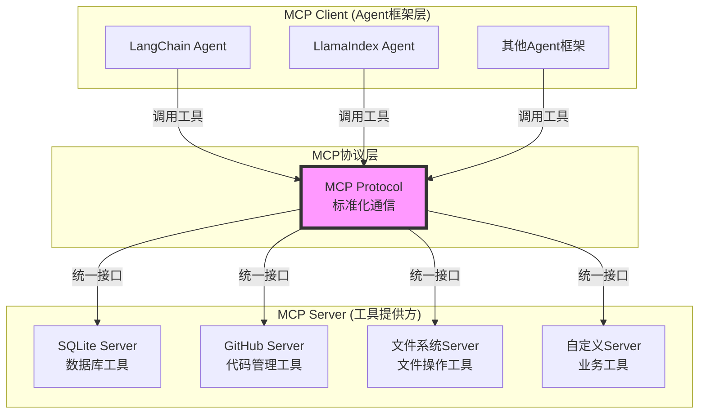
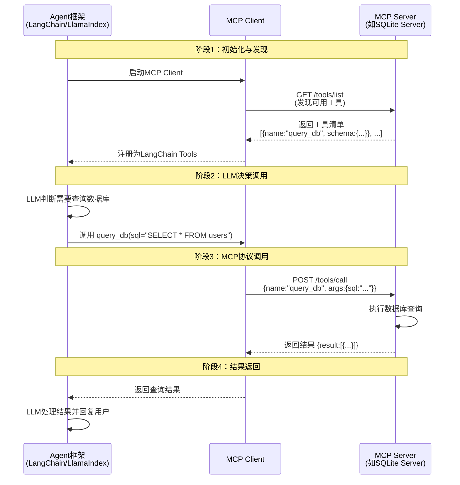
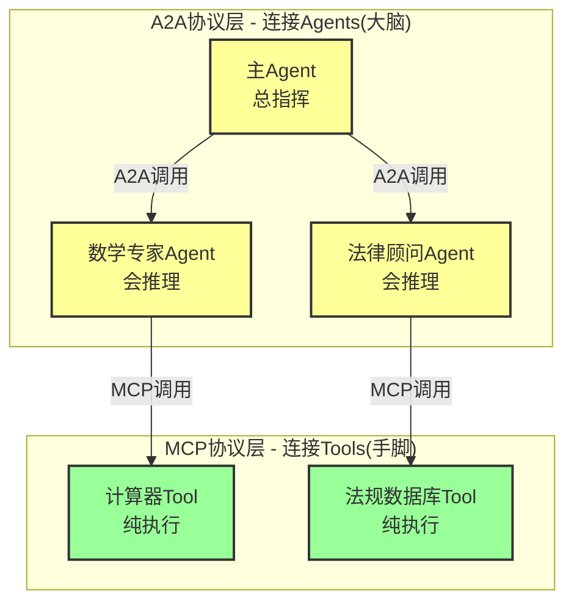
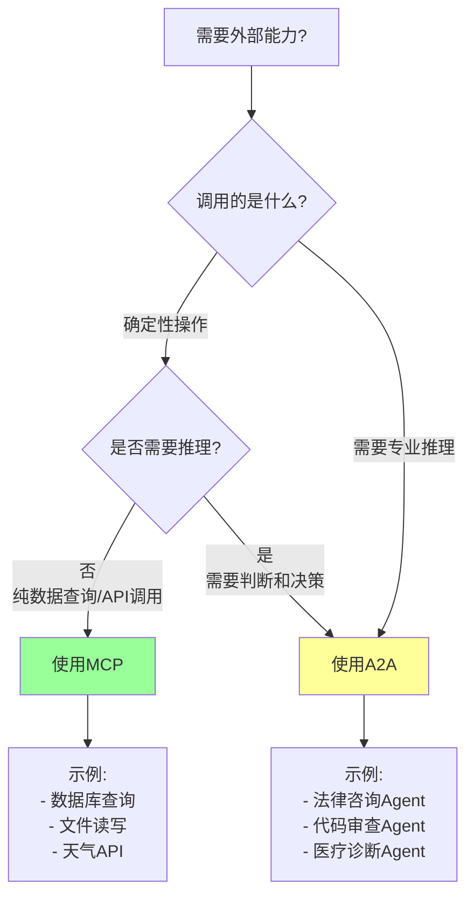
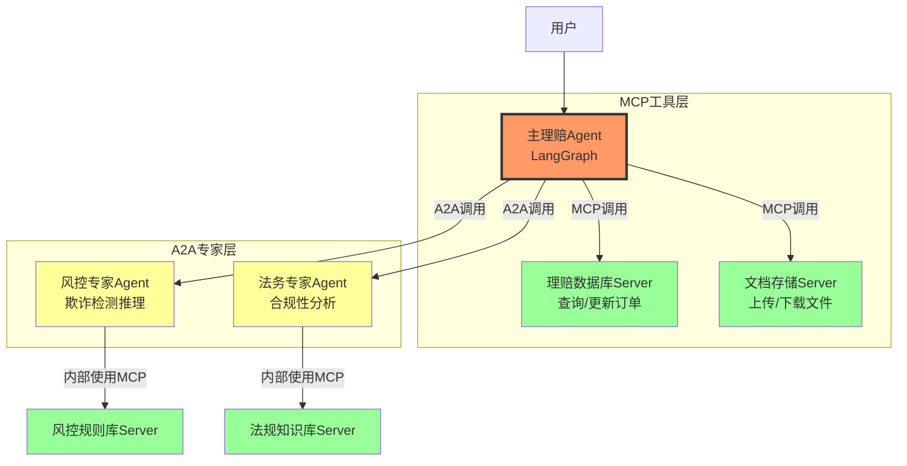

# 第九篇 终章：构建 Agent 互联网络 (The Agent Internet)

> **前言**: 在之前的篇章中，我们学会了如何使用现成的库。但在 Agent 这个狂野的西部，现有的库往往满足不了复杂的企业级需求。本篇将带你**从零开始，亲手打造**一套工业级的 Agent 互联框架 —— **FastA2A (服务端)** 和 **python-a2a (客户端)**。我们将用这两个自研框架，构建一个真正的分布式 Agent 集群。

## 📋 目录导航

1.  **架构设计**：为什么我们需要微服务化的 Agent？
2.  **造轮子 (Server)**：手写 `FastA2A` 框架核心
3.  **造轮子 (Client)**：手写 `python-a2a` SDK 核心
4.  **集群实战**：部署一个 Math Worker 和一个 Orchestrator
5.  **生态扩展**：MCP 与 Swarm 的融合
6.  **深度实战**：企业级 Swarm 保险理赔系统
7.  **架构选型**：Supervisor vs Swarm vs Hierarchical
8.  **工程治理**：死循环检测与状态一致性

---

## 第1章：架构设计 —— Agent Microservices

在单体应用中，我们用 `LangGraph` 编排一切。但当系统扩大到一定规模，或者涉及跨团队协作时，我们需要将 Agent 拆分为独立的**微服务**。

### 1.1 A2A 协议标准 (The Spec)

在开始写代码之前，我们需要定义 Agent 之间的"通用语言"。

*   **Manifest (握手)**: `GET /.well-known/agent-manifest`
    *   返回：Agent 名称、描述、支持的 Tools 列表（JSON Schema）。
*   **Invoke (调用)**: `POST /agent/invoke`
    *   输入：`{"task": "...", "context": {...}}`
    *   输出：`{"result": "...", "thought_process": "..."}`

---

## 第2章：造轮子 —— 服务端框架 FastA2A

我们将基于 FastAPI 和 Pydantic，封装一个极简但强大的 Agent 服务端框架。

### 2.1 框架核心代码 (`fasta2a.core`)

这是一个可以直接复制到你的项目中的微框架核心。

```python
import inspect
from fastapi import FastAPI, HTTPException
from pydantic import BaseModel, create_model
from typing import List, Callable, Dict, Any, Optional
from langchain_core.tools import StructuredTool

# --- 数据模型定义 ---
class ToolSchema(BaseModel):
    name: str
    description: str
    args_schema: Dict[str, Any]

class AgentManifest(BaseModel):
    name: str
    description: str
    tools: List[ToolSchema]

class InvokeRequest(BaseModel):
    query: str
    thread_id: Optional[str] = None

# --- FastA2A 核心类 ---
class FastA2A:
    def __init__(self, title: str, description: str, agent_executor: Any):
        """
        初始化 A2A 服务
        :param agent_executor: 一个编译好的 LangGraph Runnable 或者 LangChain AgentExecutor
        """
        self.app = FastAPI(title=title, description=description)
        self.agent = agent_executor
        self.manifest = AgentManifest(
            name=title,
            description=description,
            tools=[]
        )
        self._setup_routes()

    def _extract_tools_from_agent(self):
        """自动从 Agent 中提取工具定义（这是一个高级反射操作）"""
        # 这里假设传入的是一个绑定了 tools 的 LangChain Agent
        # 在实际实现中，这里需要根据具体的 Agent 类型做适配
        # 为了演示，我们提供一个手动注册工具的方法作为替代方案
        pass

    def register_tool(self, func: Callable):
        """手动注册能力，暴露给外界"""
        # 将 Python 函数转换为 Pydantic Schema
        tool = StructuredTool.from_function(func)
        schema = tool.args_schema.schema() if tool.args_schema else {}

        self.manifest.tools.append(ToolSchema(
            name=tool.name,
            description=tool.description,
            args_schema=schema
        ))
        return func

    def _setup_routes(self):
        # 1. 暴露 Manifest (握手协议)
        @self.app.get("/.well-known/agent-manifest", response_model=AgentManifest)
        async def get_manifest():
            return self.manifest

        # 2. 暴露 Invoke (调用接口)
        @self.app.post("/agent/invoke")
        async def invoke(req: InvokeRequest):
            try:
                # 适配 LangChain/LangGraph 的调用方式
                # 这里做了一个简单的适配层
                input_payload = {"messages": [("human", req.query)]}

                # 支持 thread_id 透传 (LangGraph Checkpoint)
                config = {}
                if req.thread_id:
                    config = {"configurable": {"thread_id": req.thread_id}}

                result = await self.agent.ainvoke(input_payload, config=config)

                # 解析结果：假设是标准的消息列表
                if "messages" in result:
                    final_msg = result["messages"][-1].content
                elif "output" in result:
                    final_msg = result["output"]
                else:
                    final_msg = str(result)

                return {"status": "success", "response": final_msg}
            except Exception as e:
                raise HTTPException(status_code=500, detail=str(e))

    def start(self, port: int = 8000):
        import uvicorn
        uvicorn.run(self.app, host="0.0.0.0", port=port)
```

**设计深度解析**：
*   **反射与自省**：`AgentManifest` 不是手写的，而是通过 `pydantic` 和 `inspect` 动态生成的。这意味着 Client 端看到的 API 文档永远与代码保持同步。
*   **依赖倒置**：`FastA2A` 不关心你内部用的是 LangChain 还是 LangGraph，只要你能响应 `ainvoke`，我就能把你变成服务。

---

## 第3章：造轮子 —— 客户端 SDK python-a2a

服务端建好了，客户端怎么调用？如果还要写 `requests.post` 就太低级了。我们要实现的效果是：**像调用本地函数一样调用远程 Agent**。

### 3.1 SDK 核心代码 (`python_a2a.client`)

```python
import requests
from langchain_core.tools import Tool
from pydantic import BaseModel
from typing import Optional

class RemoteAgentClient:
    def __init__(self, base_url: str, api_key: Optional[str] = None):
        self.base_url = base_url.rstrip("/")
        self.headers = {"Authorization": f"Bearer {api_key}"} if api_key else {}
        self.manifest = None
        self._connect()

    def _connect(self):
        """握手：自动获取远程 Agent 的元数据"""
        try:
            resp = requests.get(f"{self.base_url}/.well-known/agent-manifest", headers=self.headers)
            resp.raise_for_status()
            self.manifest = resp.json()
            print(f"✅ [A2A] Connected to: {self.manifest['name']} ({self.manifest['description']})")
        except Exception as e:
            print(f"❌ [A2A] Connection failed: {e}")

    def sync_invoke(self, query: str, thread_id: str = None) -> str:
        """同步调用"""
        payload = {"query": query, "thread_id": thread_id}
        resp = requests.post(f"{self.base_url}/agent/invoke", json=payload, headers=self.headers)
        if resp.status_code != 200:
            return f"Error: {resp.text}"
        return resp.json()["response"]

    def as_langchain_tool(self) -> Tool:
        """
        核心魔法：将远程 Agent 转化为一个标准的 LangChain Tool。
        这样你的主 Agent 就可以像使用 Calculator 一样使用这个远程 Agent。
        """
        if not self.manifest:
            raise RuntimeError("Client not connected")

        # 动态生成 Tool 的描述
        # 我们把远程支持的所有 Tools 描述都拼接到 Tool 描述里
        # 让 LLM 知道它可以找这个远程 Agent 干什么
        tools_desc = "\n".join([f"- {t['name']}: {t['description']}" for t in self.manifest['tools']])

        full_description = (
            f"这是一个远程专家 Agent: {self.manifest['name']}。\n"
            f"擅长解决以下问题：\n{self.manifest['description']}\n"
            f"它具备的具体能力：\n{tools_desc}\n"
            "如果你遇到相关问题，可以将问题作为 query 传递给它。"
        )

        return Tool(
            name=f"ask_{self.manifest['name'].lower().replace(' ', '_')}",
            description=full_description,
            func=self.sync_invoke
        )
```

---

## 第4章：综合实战 —— 部署 Agent 互联网络

现在让我们把上述框架付诸实践。我们将模拟两个进程。

### 4.1 节点 A：数学专家 Service (使用 FastA2A)

```python
# math_service.py
from langchain_openai import ChatOpenAI
from langchain.agents import create_tool_calling_agent, AgentExecutor
from langchain_core.tools import tool
from langchain_core.prompts import ChatPromptTemplate

# 引入我们的框架
from fasta2a.core import FastA2A

# 1. 定义具体能力
@tool
def solve_quadratic(a: float, b: float, c: float) -> str:
    """Solve quadratic equation ax^2 + bx + c = 0"""
    delta = b**2 - 4*a*c
    if delta < 0: return "No real solution"
    x1 = (-b + delta**0.5) / (2*a)
    x2 = (-b - delta**0.5) / (2*a)
    return f"x1={x1}, x2={x2}"

# 2. 构建 Agent 逻辑
llm = ChatOpenAI(model="gpt-4o")
tools = [solve_quadratic]
prompt = ChatPromptTemplate.from_messages([
    ("system", "你是数学专家。用户会问你数学题，请使用工具解答。"),
    ("human", "{messages}"),
    ("placeholder", "{agent_scratchpad}"),
])
agent = create_tool_calling_agent(llm, tools, prompt)
executor = AgentExecutor(agent=agent, tools=tools)

# 3. 启动 A2A 服务
service = FastA2A(title="MathExpert", description="解决代数和微积分问题", agent_executor=executor)

# 手动注册工具到 Manifest（为了让别人知道我会什么）
service.register_tool(solve_quadratic)

if __name__ == "__main__":
    service.start(port=8001)
```

### 4.2 节点 B：总监 Agent (使用 python-a2a)

总监 Agent 运行在另一个进程中，它数学不好，但它知道求助。

```python
# boss_agent.py
from langchain_openai import ChatOpenAI
from langchain.agents import create_react_agent, AgentExecutor
from langchain import hub

# 引入我们的 SDK
from python_a2a.client import RemoteAgentClient

# 1. 连接远程服务
math_client = RemoteAgentClient(base_url="http://localhost:8001")

# 2. 将远程服务转化为工具
# 这一步，Boss Agent 瞬间学会了数学！
tools = [math_client.as_langchain_tool()]

# 3. 构建 Boss Agent
llm = ChatOpenAI(model="gpt-4o")
prompt = hub.pull("hwchase17/react")

boss = create_react_agent(llm, tools, prompt)
boss_executor = AgentExecutor(agent=boss, tools=tools, verbose=True)

# 4. 运行
query = "我们需要解一个方程：2x^2 + 5x - 3 = 0。请找专家帮我算一下结果。"
boss_executor.invoke({"input": query})
```

**执行流程透视**：
1.  **Boss 思考**：用户问的是方程，我会解吗？不会。但我有一个工具 `ask_math_expert`，它的描述说它可以解方程。
2.  **Boss 行动**：调用 `ask_math_expert("解方程 2x^2 + 5x - 3 = 0")`。
3.  **SDK 介入**：`RemoteAgentClient` 将该字符串打包成 JSON，发送 HTTP POST 到 `localhost:8001`。
4.  **Math Service 响应**：`FastA2A` 收到请求，传给内部的 Agent。
5.  **Math Agent 思考**：我有 `solve_quadratic` 工具，提取参数 a=2, b=5, c=-3。执行计算。
6.  **结果回传**：x1=0.5, x2=-3.0 -> HTTP Response -> Boss Agent。
7.  **Boss 总结**：专家说结果是 0.5 和 -3。

---

## 第5章：MCP深度解析 —— 工具层的标准化革命

在讨论生态扩展之前，我们需要深入理解 **MCP (Model Context Protocol)** —— 这个正在改变整个 AI 工具生态的协议标准。

### 5.1 为什么需要MCP？传统工具集成的三大痛点

在MCP出现之前，每个Agent框架都活在自己的"工具孤岛"中：

#### 痛点1：重复造轮子 —— 每个框架都要重写工具集成代码

```python
# 在 LangChain 中集成数据库工具
from langchain_core.tools import tool

@tool
def query_database(query: str) -> str:
    """Query the database"""
    return execute_sql(query)

# 在 LlamaIndex 中，需要重写一遍
from llama_index.core.tools import FunctionTool

def query_database_llamaindex(query: str) -> str:
    """Query the database"""
    return execute_sql(query)

database_tool = FunctionTool.from_defaults(fn=query_database_llamaindex)

# 在 Semantic Kernel 中，又要重写一遍
from semantic_kernel.functions import kernel_function

class DatabasePlugin:
    @kernel_function(name="query_database", description="Query the database")
    def query(self, query: str) -> str:
        return execute_sql(query)
```

**问题**：同一个数据库查询功能，在三个框架中需要写三遍代码，维护成本呈指数级增长。

#### 痛点2：工具能力无法跨框架复用

你用LangChain开发的精美数据库工具，无法直接给使用LlamaIndex的同事用。每个团队都在重复发明轮子。

#### 痛点3：缺乏标准化的工具描述格式

- LangChain使用`StructuredTool`和Pydantic Schema
- LlamaIndex使用`FunctionTool`和自定义元数据
- Semantic Kernel使用`@kernel_function`装饰器

**结果**：工具生态碎片化，无法形成统一的"工具市场"。

### 5.2 MCP的解决方案：一次编写，到处运行

MCP通过定义一个**标准协议**，让工具开发者只需编写一次，就能被所有支持MCP的Agent框架使用。

**类比**：
- **传统方式**：每个手机厂商都有自己的充电接口(Apple Lightning、Micro USB、USB-C)
- **MCP方式**：统一使用USB-C接口，一根线充所有设备

### 5.3 MCP架构深度解析

#### 5.3.1 整体架构：Client-Server模型



**核心设计理念**：
- **解耦**：工具开发者不需要关心有多少种Agent框架
- **标准化**：所有通信都遵循MCP协议(基于JSON-RPC 2.0)
- **可扩展**：新框架只需实现MCP Client，即可使用所有MCP工具

#### 5.3.2 MCP工作流程详解



### 5.4 MCP核心概念：Resources、Tools、Prompts

MCP定义了三种能力暴露方式：

#### 1. Resources(资源) —— 类似GET端点

暴露**只读数据**给LLM：

```python
from mcp.server.fastmcp import FastMCP

mcp = FastMCP("MyServer")

@mcp.resource("user://{user_id}")
def get_user_info(user_id: str) -> str:
    """获取用户信息(只读)"""
    user = db.query(f"SELECT * FROM users WHERE id={user_id}")
    return json.dumps(user)
```

**使用场景**：文档检索、配置读取、日志查看等

#### 2. Tools(工具) —— 类似POST端点

执行**有副作用的操作**：

```python
@mcp.tool()
def create_user(name: str, email: str) -> dict:
    """创建新用户(写操作)"""
    user_id = db.execute("INSERT INTO users (name, email) VALUES (?, ?)", name, email)
    return {"user_id": user_id, "status": "created"}
```

**使用场景**：数据写入、发送邮件、调用API等

#### 3. Prompts(提示模板) —— 预定义交互模式

提供**可复用的提示词模板**：

```python
@mcp.prompt()
def code_review_template(language: str = "python") -> list:
    """代码审查提示模板"""
    return [
        {
            "role": "system",
            "content": f"你是{language}代码审查专家，请严格检查代码质量..."
        }
    ]
```

### 5.5 实战：创建并使用MCP Server

#### 5.5.1 创建MCP Server —— 数据库工具服务

```python
# database_mcp_server.py
from mcp.server.fastmcp import FastMCP
import sqlite3
import json

mcp = FastMCP("DatabaseServer")

# 初始化数据库连接
DB_PATH = "demo.db"

@mcp.tool()
def query_database(sql: str) -> str:
    """
    执行SQL查询(只读)

    Args:
        sql: SELECT查询语句

    Returns:
        JSON格式的查询结果
    """
    if not sql.strip().upper().startswith("SELECT"):
        return json.dumps({"error": "只允许SELECT查询"})

    try:
        conn = sqlite3.connect(DB_PATH)
        cursor = conn.cursor()
        cursor.execute(sql)
        results = cursor.fetchall()
        columns = [desc[0] for desc in cursor.description]

        # 转换为字典列表
        data = [dict(zip(columns, row)) for row in results]
        return json.dumps(data, ensure_ascii=False)
    except Exception as e:
        return json.dumps({"error": str(e)})
    finally:
        conn.close()

@mcp.tool()
def insert_record(table: str, data: dict) -> str:
    """
    插入数据记录

    Args:
        table: 表名
        data: 要插入的数据(字典格式)

    Returns:
        插入结果
    """
    try:
        conn = sqlite3.connect(DB_PATH)
        cursor = conn.cursor()

        columns = ", ".join(data.keys())
        placeholders = ", ".join(["?" for _ in data])
        sql = f"INSERT INTO {table} ({columns}) VALUES ({placeholders})"

        cursor.execute(sql, list(data.values()))
        conn.commit()

        return json.dumps({
            "status": "success",
            "inserted_id": cursor.lastrowid
        })
    except Exception as e:
        return json.dumps({"status": "error", "message": str(e)})
    finally:
        conn.close()

@mcp.resource("schema://{table}")
def get_table_schema(table: str) -> str:
    """获取表结构定义"""
    conn = sqlite3.connect(DB_PATH)
    cursor = conn.cursor()
    cursor.execute(f"PRAGMA table_info({table})")
    schema = cursor.fetchall()
    conn.close()
    return json.dumps(schema)

if __name__ == "__main__":
    # 启动HTTP服务器(推荐用于生产环境)
    mcp.run(transport="streamable-http", port=8000)
```

**启动服务器**：

```bash
# 安装依赖
pip install "mcp[cli]"

# 运行服务器
python database_mcp_server.py
```

服务器启动后，会在 `http://localhost:8000/mcp` 暴露MCP接口。

#### 5.5.2 在LangChain中集成MCP工具

```python
# agent_with_mcp.py
from langchain_openai import ChatOpenAI
from langchain.agents import create_react_agent, AgentExecutor
from langchain import hub
from langchain_mcp_adapters.client import MultiServerMCPClient
import asyncio

async def main():
    # 1. 连接到MCP Server
    client = MultiServerMCPClient({
        "database": {
            "transport": "http",
            "url": "http://localhost:8000/mcp",
        }
    })

    # 2. 自动获取MCP工具并转换为LangChain Tools
    tools = await client.get_tools()

    print(f"✅ 已从MCP Server加载 {len(tools)} 个工具：")
    for tool in tools:
        print(f"   - {tool.name}: {tool.description}")

    # 3. 创建Agent(工具已自动注册)
    llm = ChatOpenAI(model="gpt-4o", temperature=0)
    prompt = hub.pull("hwchase17/react")

    agent = create_react_agent(llm, tools, prompt)
    executor = AgentExecutor(agent=agent, tools=tools, verbose=True)

    # 4. 测试调用
    result = executor.invoke({
        "input": "查询users表中所有email包含'gmail.com'的用户"
    })

    print("\n" + "="*50)
    print(result["output"])

if __name__ == "__main__":
    asyncio.run(main())
```

**运行效果**：

```
✅ 已从MCP Server加载 3 个工具：
   - query_database: 执行SQL查询(只读)
   - insert_record: 插入数据记录
   - get_table_schema: 获取表结构定义

> Entering new AgentExecutor chain...
I need to query the database to find users with gmail.com emails.

Action: query_database
Action Input: SELECT * FROM users WHERE email LIKE '%gmail.com'

Observation: [{"id": 1, "name": "Alice", "email": "alice@gmail.com"}, ...]

Thought: I now have the results.

Final Answer: 找到3位使用Gmail邮箱的用户：Alice, Bob, Charlie
```

### 5.6 MCP vs 传统Function Calling对比

#### 5.6.1 详细对比表

| 维度 | 传统Function Call | MCP |
|------|------------------|-----|
| **代码复用性** | 低(框架绑定，LangChain代码无法给LlamaIndex用) | 高(一次编写，所有框架可用) |
| **维护成本** | 高(每个框架一套代码) | 低(统一维护MCP Server) |
| **跨框架支持** | 需重写(每个框架有不同的Tool定义方式) | 开箱即用(框架只需实现MCP Client) |
| **工具生态** | 分散(各框架各自的工具库) | 统一(MCP工具市场) |
| **远程调用** | 需手动封装HTTP接口 | 原生支持(HTTP/SSE/stdio传输) |
| **工具发现** | 静态注册 | 动态发现(服务端自动暴露能力) |
| **适用场景** | 简单的本地工具 | 企业级工具集成、远程服务 |

#### 5.6.2 代码对比示例

**传统方式**：工具与框架强耦合

```python
# 传统LangChain方式 —— 工具定义在Agent代码里
from langchain_core.tools import tool

@tool
def search_database(query: str) -> str:
    """搜索数据库"""
    return db.search(query)

tools = [search_database]
agent = create_react_agent(llm, tools, prompt)

# 问题：如果换成LlamaIndex，这个工具无法直接使用！
```

**MCP方式**：工具与框架解耦

```python
# MCP方式 —— 工具独立部署为MCP Server
# database_server.py (独立服务)
from mcp.server.fastmcp import FastMCP

mcp = FastMCP("DatabaseServer")

@mcp.tool()
def search_database(query: str) -> str:
    """搜索数据库"""
    return db.search(query)

mcp.run(transport="streamable-http", port=8000)

# ---------- 分隔线 ----------

# 在LangChain中使用
from langchain_mcp_adapters.client import MultiServerMCPClient

client = MultiServerMCPClient({"db": {"transport": "http", "url": "http://localhost:8000/mcp"}})
tools = await client.get_tools()
agent = create_react_agent(llm, tools, prompt)

# 同样的MCP Server，LlamaIndex也能用！
# from llama_index.tools.mcp import MCPToolSpec
# tool_spec = MCPToolSpec(url="http://localhost:8000/mcp")
```

### 5.7 MCP的适用场景

#### ✅ 适合使用MCP的场景

1. **企业内部工具统一管理**：一个MCP Server暴露CRM、ERP、数据仓库等所有企业工具
2. **跨团队协作**：前端团队用LangChain，后端团队用LlamaIndex，共享同一套MCP工具
3. **工具市场化**：第三方可以提供MCP Server作为SaaS服务(如"天气查询MCP Server")
4. **安全隔离**：敏感工具(如数据库操作)独立部署为MCP Server，通过鉴权控制访问

#### ❌ 不适合使用MCP的场景

1. **简单的纯计算工具**：如计算器、字符串处理等，直接用传统Function Call更简单
2. **极致性能要求**：MCP有网络调用开销，对延迟敏感的场景不适用
3. **一次性脚本**：如果工具只用一次，不需要复用，传统方式更快

### 5.8 小结：MCP的革命性意义

MCP正在做的事情，类似于当年Docker对应用部署的革命：

- **Docker之前**：每个应用部署方式不同，运维噩梦
- **Docker之后**：统一的容器标准，一次打包到处运行

- **MCP之前**：每个Agent框架有自己的工具生态，碎片化严重
- **MCP之后**：统一的工具协议，工具可跨框架复用

> **核心洞察**：MCP不是替代传统Function Call，而是为**企业级工具集成**提供了标准化方案。对于简单场景，传统方式依然有效；但对于需要跨框架、跨团队、可持续维护的工具生态，MCP是必然选择。

---

## 第6章：MCP与A2A深度对比 —— 工具层vs.Agent层

现在我们已经深入理解了MCP(工具层协议)和A2A(Agent层协议)，是时候清晰地对比它们的区别了。

### 6.1 本质区别：连接的对象不同



### 6.2 详细对比表

| 维度 | MCP (工具层协议) | A2A (Agent层协议) |
|------|-----------------|------------------|
| **连接对象** | Tools/Resources(确定性工具) | Agents(具备推理能力的智能体) |
| **是否有推理** | ❌ 无(纯执行，如计算器) | ✅ 有(内部有LLM推理) |
| **是否有状态** | ❌ 无状态(每次调用独立) | ✅ 有状态(保留对话历史) |
| **Token消耗** | 极低(只传参数和结果) | 高(每次调用都有LLM推理) |
| **响应时间** | 毫秒级(数据库查询、API调用) | 秒级(需要LLM思考) |
| **典型使用场景** | - 查询数据库<br/>- 读取文件<br/>- 调用外部API<br/>- 执行计算 | - 跨领域专家协作<br/>- 多轮对话任务<br/>- 需要专业推理的子任务 |
| **返回内容** | 结构化数据(JSON/字符串) | 自然语言推理结果 |
| **类比** | "手"(执行指令) | "脑"(思考决策) |
| **协议复杂度** | 低(基于JSON-RPC 2.0) | 高(需要处理对话状态、Handoff) |
| **部署位置** | 可本地可远程(通常是独立服务) | 通常是远程(微服务架构) |

### 6.3 选型决策树



### 6.4 实战对比示例

#### 场景：智能客服系统

**需求**：用户咨询订单状态，系统需要查询数据库并提供专业回复。

##### 方案1：纯MCP方案(不推荐)

```python
# ❌ 错误示例：把数据库查询当Agent用
from langchain_mcp_adapters.client import MultiServerMCPClient

client = MultiServerMCPClient({
    "order_db": {"transport": "http", "url": "http://localhost:8000/mcp"}
})

tools = await client.get_tools()
agent = create_react_agent(llm, tools, prompt)

# 问题：如果需要复杂的订单分析推理，MCP工具做不到！
```

##### 方案2：纯A2A方案(过度设计)

```python
# ❌ 过度设计：把简单的数据库查询包装成Agent
from python_a2a.client import RemoteAgentClient

order_agent = RemoteAgentClient("http://localhost:8001")  # 这个Agent内部只查数据库

# 问题：浪费计算资源，每次查询都要跑一遍LLM
```

##### 方案3：MCP + A2A融合(推荐)

```python
# ✅ 正确方案：MCP处理工具调用，A2A处理专业推理

# 1. 主Agent使用MCP工具查询数据
from langchain_mcp_adapters.client import MultiServerMCPClient

mcp_client = MultiServerMCPClient({
    "order_db": {"transport": "http", "url": "http://localhost:8000/mcp"}
})

mcp_tools = await mcp_client.get_tools()

# 2. 主Agent使用A2A调用专业客服Agent(处理复杂售后逻辑)
from python_a2a.client import RemoteAgentClient

customer_service_agent = RemoteAgentClient("http://localhost:8002")
a2a_tools = [customer_service_agent.as_langchain_tool()]

# 3. 融合两者
all_tools = mcp_tools + a2a_tools

agent = create_react_agent(llm, all_tools, prompt)
```

**执行流程**：

```
用户: "我的订单CLM12345什么时候发货?"

主Agent思考: 需要查询订单状态
  -> 调用MCP工具 query_order(order_id="CLM12345")
  -> 得到结果: {"status": "已发货", "tracking": "SF1234567890"}

主Agent思考: 用户可能还想知道物流详情，这需要专业的客服话术
  -> 调用A2A客服专家Agent
  -> 客服Agent推理后返回: "您的订单已于今天上午发货，快递单号SF1234567890..."

主Agent整合信息，回复用户
```

### 6.5 MCP + A2A融合架构：企业级实战

#### 场景：保险理赔智能系统(升级版)

**需求**：
1. 查询理赔单详情(数据库操作) → MCP
2. 风险评估推理(需要专业风控Agent) → A2A
3. 法律合规检查(需要专业法务Agent) → A2A

#### 架构图



#### 完整代码实现

**步骤1：部署MCP Server(理赔数据库)**

```python
# claim_database_mcp_server.py
from mcp.server.fastmcp import FastMCP
import sqlite3
import json

mcp = FastMCP("ClaimDatabaseServer")

@mcp.tool()
def get_claim_details(claim_id: str) -> str:
    """查询理赔单详细信息"""
    conn = sqlite3.connect("claims.db")
    cursor = conn.cursor()
    cursor.execute("SELECT * FROM claims WHERE id = ?", (claim_id,))
    result = cursor.fetchone()
    conn.close()

    if result:
        return json.dumps({
            "claim_id": result[0],
            "amount": result[1],
            "type": result[2],
            "status": result[3],
            "submit_date": result[4]
        })
    return json.dumps({"error": "未找到理赔单"})

@mcp.tool()
def update_claim_status(claim_id: str, status: str) -> str:
    """更新理赔单状态"""
    conn = sqlite3.connect("claims.db")
    cursor = conn.cursor()
    cursor.execute("UPDATE claims SET status = ? WHERE id = ?", (status, claim_id))
    conn.commit()
    conn.close()
    return json.dumps({"status": "success"})

if __name__ == "__main__":
    mcp.run(transport="streamable-http", port=8100)
```

**步骤2：部署A2A Agent(风控专家)**

```python
# fraud_detection_a2a_agent.py
from langchain_openai import ChatOpenAI
from langchain.agents import create_react_agent, AgentExecutor
from langchain_core.prompts import ChatPromptTemplate
from langchain_core.tools import tool
from fasta2a.core import FastA2A

# 风控专用工具
@tool
def calculate_fraud_score(amount: float, claim_type: str, history_count: int) -> dict:
    """
    计算欺诈风险评分

    Args:
        amount: 理赔金额
        claim_type: 理赔类型
        history_count: 历史理赔次数

    Returns:
        风险评分和等级
    """
    base_score = min(amount / 1000, 50)

    # 历史理赔次数越多，风险越高
    history_factor = history_count * 5

    # 人伤理赔风险更高
    type_factor = 20 if claim_type == "人伤" else 0

    total_score = base_score + history_factor + type_factor

    level = "HIGH" if total_score > 60 else ("MEDIUM" if total_score > 30 else "LOW")

    return {
        "score": round(total_score, 2),
        "level": level,
        "reason": f"基于金额{amount}元、类型{claim_type}、历史{history_count}次综合判定"
    }

# 创建风控Agent
llm = ChatOpenAI(model="gpt-4o", temperature=0)
tools = [calculate_fraud_score]

prompt = ChatPromptTemplate.from_messages([
    ("system", "你是保险风控专家。分析理赔申请，识别欺诈风险。"),
    ("human", "{messages}"),
    ("placeholder", "{agent_scratchpad}"),
])

agent = create_react_agent(llm, tools, prompt)
executor = AgentExecutor(agent=agent, tools=tools)

# 启动A2A服务
service = FastA2A(
    title="FraudDetectionAgent",
    description="专业的保险欺诈检测Agent，能够分析理赔申请并评估风险",
    agent_executor=executor
)

service.register_tool(calculate_fraud_score)

if __name__ == "__main__":
    service.start(port=8201)
```

**步骤3：主Agent融合MCP和A2A**

```python
# main_claim_agent.py
from langchain_openai import ChatOpenAI
from langchain.agents import create_react_agent, AgentExecutor
from langchain import hub
from langchain_mcp_adapters.client import MultiServerMCPClient
from python_a2a.client import RemoteAgentClient
import asyncio

async def main():
    # 1. 连接MCP Server(数据库工具)
    mcp_client = MultiServerMCPClient({
        "claim_db": {
            "transport": "http",
            "url": "http://localhost:8100/mcp"
        }
    })

    mcp_tools = await mcp_client.get_tools()
    print(f"✅ 加载MCP工具: {[t.name for t in mcp_tools]}")

    # 2. 连接A2A Agent(风控专家)
    fraud_agent = RemoteAgentClient("http://localhost:8201")
    a2a_tools = [fraud_agent.as_langchain_tool()]
    print(f"✅ 连接A2A专家: {fraud_agent.manifest['name']}")

    # 3. 融合所有工具
    all_tools = mcp_tools + a2a_tools

    # 4. 创建主Agent
    llm = ChatOpenAI(model="gpt-4o", temperature=0)
    prompt = hub.pull("hwchase17/react")

    agent = create_react_agent(llm, all_tools, prompt)
    executor = AgentExecutor(agent=agent, tools=all_tools, verbose=True)

    # 5. 处理理赔申请
    result = executor.invoke({
        "input": """
        处理理赔单CLM001：
        1. 先查询详细信息
        2. 如果金额超过3万，请调用风控专家评估风险
        3. 给出最终处理建议
        """
    })

    print("\n" + "="*60)
    print("最终处理结果：")
    print(result["output"])

if __name__ == "__main__":
    asyncio.run(main())
```

**执行效果展示**：

```
✅ 加载MCP工具: ['get_claim_details', 'update_claim_status']
✅ 连接A2A专家: FraudDetectionAgent

> Entering new AgentExecutor chain...

Thought: 需要先查询理赔单详情
Action: get_claim_details
Action Input: CLM001

Observation: {"claim_id": "CLM001", "amount": 50000, "type": "人伤", "status": "待审核", "submit_date": "2024-01-15"}

Thought: 金额5万元，超过3万阈值，需要风控评估
Action: ask_frauddetectionagent
Action Input: 请评估理赔单CLM001的风险，金额50000元，类型人伤，申请人历史理赔2次

Observation: 根据综合分析，该理赔单风险评分75分，等级HIGH。主要风险因素：
1. 金额较高(50000元)
2. 人伤类型本身风险较大
3. 申请人有2次历史理赔记录
建议：转人工详细审核，核实医疗证明真实性。

Thought: 已完成分析

Final Answer:
理赔单CLM001处理建议：
- 基本信息：人伤理赔，金额5万元
- 风险等级：HIGH(评分75分)
- 处理建议：不建议自动批准，需转人工审核，重点核实：
  1. 二级以上医院诊断证明
  2. 事故现场照片和交警责任认定
  3. 既往理赔记录的关联性分析
```

### 6.6 融合架构的核心优势

1. **职责清晰**：
   - MCP处理确定性操作(查数据、存文件)
   - A2A处理推理任务(风险评估、合规分析)

2. **成本优化**：
   - 数据库查询用MCP，毫秒级响应，零Token消耗
   - 只在需要推理时才调用A2A，按需使用LLM资源

3. **可扩展性**：
   - 新增数据源？部署新的MCP Server即可
   - 新增专业领域？部署新的A2A Agent即可
   - 主Agent代码无需修改

4. **团队协作**：
   - DBA团队维护MCP数据库Server
   - 业务专家团队维护A2A领域Agent
   - AI团队维护主Agent编排逻辑

### 6.7 小结：选型金字塔

```
         A2A (Agent层)
      需要推理和专业知识
    /                    \
   /                      \
  /                        \
 /                          \
|    MCP (Tool层)            |
|    确定性工具和数据访问    |
|____________________________|
```

**选型原则**：
- 能用MCP就不用A2A(降低成本)
- 需要推理时才用A2A(发挥价值)
- 两者结合才是企业级最佳实践

---

## 第7章：生态扩展与未来

### 7.1 从集群到 Swarm

我们在第1章提到的 OpenAI Swarm 模式，其实是 A2A 的一种特例——**In-Process A2A**。
而在本章构建的分布式集群，则是 **Networked A2A**。

通过 `FastA2A` 和 `python-a2a`，你实际上已经构建了一个简易版的 **Agent Internet Protocol (AIP)**。你可以在此基础上增加：
*   **鉴权中间件**：在 `FastA2A` 中增加 API Key 校验。
*   **计费系统**：记录每次 Token 消耗。
*   **服务发现**：建立一个 `Registry Server`，让 Client 自动发现有哪些 `FastA2A` 服务在线。

> **结语**：真正的架构师不等待标准，他们创造标准。有了这套 A2A 框架，你可以构建分布式的 Agent 集群。但若是单体进程内的复杂协作，我们则需要更精细的 **Swarm** 模式。接下来，我们将通过一个企业级案例，深入 LangGraph 的高级用法。

---

## 第8章：企业级多Agent协作系统实战 - 智能保险理赔系统

在前面的章节中，我们要么使用 LangGraph 编排（单体），要么使用 A2A 协议（分布式）。现在，让我们聚焦于**单体进程内的高级协作**，通过 **Swarm 模式** 解决复杂的业务状态传递问题。

### 8.1 场景描述：车险理赔全流程自动化

业务需求：
> "每天有上千个理赔申请。需经过 分流 -> 风控 -> 法务 -> 赔付。流程需全自动化，且要支持人工随时介入。"

**Agent 角色分解**：
1. **TriageAgent (理赔分流)**：接收申请，录入 `claim_id`，查询基本信息。
2. **ClaimProcessor (核心处理)**：计算风险评分，操作数据库，决定下一步流向。
3. **LegalAdvisor (法务顾问)**：基于 RAG 检索相关法规，判断合规性。
4. **FraudDetector (风控检测)**：多轮博弈式分析，识别欺诈风险。

**核心挑战**：
- **状态传递**：在 Agent 切换（Handoff）时，不仅要传递对话历史（Messages），还要传递结构化的业务数据（如 `risk_score`, `claim_amount`）。
- **持久化**：系统可能随时中断，必须支持从断点恢复（Checkpointing）。

### 8.2 架构设计：Swarm + 复杂状态管理

我们使用 **LangGraph** 实现 Swarm 模式。与 A2A 不同，这里的 Handoff 是进程内的，极其高效。

**状态定义 (State)**：
此处不仅使用 `MessagesState`，而是定义一个包含业务实体的 `TypedDict`。

```python
from typing import TypedDict, Annotated, Literal
from langgraph.graph.message import add_messages

class InsuranceClaimState(TypedDict):
    """保险理赔系统的全量状态"""
    # 基础对话历史 (自动合并)
    messages: Annotated[list, add_messages]

    # --- 结构化业务状态 ---
    claim_id: str          # 理赔单ID
    risk_score: float      # 风险评分 (0-100)
    current_agent: str     # 当前执政 Agent
    claim_amount: float    # 理赔金额
    is_fraud: bool         # 欺诈标记
    legal_approved: bool   # 法务审核状态
```

### 8.3 完整代码实现

#### 8.3.1 定义工具 (Tools)

```python
from langchain_core.tools import tool

# 1. 业务数据查询
@tool
def query_claim_database(claim_id: str) -> str:
    """从核心业务系统查询理赔详情"""
    # 模拟数据库数据
    mock_db = {
        "CLM001": {"amount": 5000, "type": "车辆损伤", "date": "2024-01-15"},
        "CLM002": {"amount": 50000, "type": "人伤", "date": "2024-01-20"},
    }
    return str(mock_db.get(claim_id, {"error": "未找到理赔单"}))

# 2. 风险计算
@tool
def calculate_risk_score(amount: float) -> dict:
    """计算风险评分"""
    base_score = min(amount / 1000, 50)
    return {"score": base_score, "level": "HIGH" if base_score > 30 else "LOW"}

# 3. 法规检索 (RAG)
@tool
def check_legal_compliance(claim_type: str) -> str:
    """检索理赔合规性条款"""
    rules = {
        "车辆损伤": "需提交现场照片与交警责任认定书。",
        "人伤": "需提交二级以上医院诊断证明。"
    }
    return rules.get(claim_type, "通用理赔条款...")

# 4. Handoff 转接工具工厂
def create_transfer_tool(target_agent: str):
    """创建一个将控制权移交给 target_agent 的工具"""
    @tool(f"transfer_to_{target_agent}")
    def transfer():
        f"""将任务转交给 {target_agent} 处理"""
        return target_agent
    return transfer
```

#### 8.3.2 定义 Agent 节点 (Nodes)与逻辑

```python
from langchain_openai import ChatOpenAI
from langchain_core.messages import SystemMessage
from langgraph.graph import StateGraph, END
from langgraph.checkpoint.memory import MemorySaver

llm = ChatOpenAI(model="gpt-4o")

def create_agent_node(agent_name: str, system_prompt: str, tools: list):
    """通用的 Agent 节点创建工厂"""
    # 将业务工具和转接工具绑定给 LLM
    model_with_tools = llm.bind_tools(tools)

    def node(state: InsuranceClaimState):
        # 1. 动态注入 System Prompt
        # 可以根据 State 中的变量调整 Prompt
        dynamic_prompt = SystemMessage(content=f"""
        {system_prompt}
        [Context Info]
        Claim ID: {state.get('claim_id', 'N/A')}
        Risk Score: {state.get('risk_score', 'N/A')}
        """)

        messages = [dynamic_prompt] + state["messages"]
        response = model_with_tools.invoke(messages)

        # 2. 更新状态
        return {
            "messages": [response],
            "current_agent": agent_name
        }
    return node

# --- 配置各 Agent ---

# Triage (分流)
triage_node = create_agent_node(
    "TriageAgent",
    "你是理赔分流专员。先询问 Claim ID，查询详情后，转交给 ClaimProcessor。",
    [query_claim_database, create_transfer_tool("ClaimProcessor")]
)

# Processor (处理)
processor_node = create_agent_node(
    "ClaimProcessor",
    "你是核心处理专员。先计算风险评分。如果评分 > 30 转交 FraudDetector，否则转交 LegalAdvisor。",
    [calculate_risk_score, create_transfer_tool("FraudDetector"), create_transfer_tool("LegalAdvisor")]
)

# Legal (法务)
legal_node = create_agent_node(
    "LegalAdvisor",
    "你是法务顾问。检查合规性。批准后结束流程。",
    [check_legal_compliance] # 结束时直接返回 END，无需转接
)

# Fraud (风控)
fraud_node = create_agent_node(
    "FraudDetector",
    "你是风控专家。你需要严格审查高风险理赔。如果确认欺诈则拒绝，否则转回 LegalAdvisor。",
    [create_transfer_tool("LegalAdvisor")]
)
```

#### 8.3.3 构建 Graph 与路由

```python
workflow = StateGraph(InsuranceClaimState)

workflow.add_node("TriageAgent", triage_node)
workflow.add_node("ClaimProcessor", processor_node)
workflow.add_node("LegalAdvisor", legal_node)
workflow.add_node("FraudDetector", fraud_node)

def swarm_router(state) -> Literal["TriageAgent", "ClaimProcessor", "LegalAdvisor", "FraudDetector", "__end__"]:
    last_msg = state["messages"][-1]

    # 检查是否有工具调用
    if not hasattr(last_msg, "tool_calls") or not last_msg.tool_calls:
        return END

    tool_name = last_msg.tool_calls[0]["name"]

    # 路由逻辑
    if tool_name.startswith("transfer_to_"):
        target = tool_name.replace("transfer_to_", "")
        return target

    return END # 继续当前 Agent 或结束

# 为每个 Agent 节点添加路由边
for node in ["TriageAgent", "ClaimProcessor", "LegalAdvisor", "FraudDetector"]:
    workflow.add_conditional_edges(node, swarm_router)

workflow.set_entry_point("TriageAgent")

# --- 启用 Checkpointer (持久化) ---
# 这允许我们在对话中途暂停、恢复，或在后端重启后继续会话
memory = MemorySaver()
app = workflow.compile(checkpointer=memory)
```

---

## 第9章：Agent 架构模式深度对比与选型

在设计系统时，何时用 Supervisor？何时用 Swarm？以下是深度的选型指南。

### 9.1 模式对比表

| 维度 | **Supervisor (中心化)** | **Swarm (去中心化/网络状)** | **Hierarchical (层级式)** |
| :--- | :--- | :--- | :--- |
| **拓扑结构** | 星型结构 (Hub-Spoke) | 网状结构 (Mesh) | 树状结构 (Tree) |
| **控制权** | **Router/Supervisor** 独裁 | **每个 Agent** 自主决定 | 上级指挥下级，下级汇报上级 |
| **适用场景** | 意图分类明确、任务相互独立的工具调用 | 流程复杂、需要多轮对话、状态要在 Agent 间流转 | 组织架构清晰、权限分级的大型系统 |
| **Token 消耗** | **高** (Supervisor 需读取所有历史来做决策) | **低** (Agent 间只传递必要上下文) | **中** (每层级只关注局部) |
| **容错性** | **单点故障** (Supervisor 挂了全挂) | **高** (局部故障不影响整体) | **中** (上级故障影响下级分支) |
| **开发复杂度** | 低 (只需写好 Router Prompt) | 高 (需定义每个 Agent 的 Handoff 逻辑) | 极高 (由于递归结构，调试困难) |

### 9.2 选型法则

1.  **简单任务用 Supervisor**：如果你只是做一个 "工具箱"，用户问天气就查天气，问股票就查股票，选 Supervisor。
2.  **复杂流程用 Swarm**：如果你的业务是流程式的 (如：挂号 -> 就诊 -> 缴费 -> 取药)，且每一步都可能退回上一步，选 Swarm。
3.  **Handoffs 是关键**：Swarm 的精髓在于 Handoffs。如果你的 Agent 不需要把控制权完全移交出去，不要用 Swarm。

---

## 第10章：工程化治理与避坑

写出 Demo 容易，上生产难。以下是多 Agent 系统最容易踩的坑及解决方案。

### 10.1 死循环检测 (Infinite Loops)

在 Swarm 模式中，最怕 A 把认为转给 B，B 又觉得该 A 处理，转回 A。

**解决方案：TTL (Time To Live)**

```python
def router_with_ttl(state):
    # 1. 检查路由深度
    if len(state["messages"]) > 50:
        return END # 强制结束，防止 Token 耗尽

    # 2. 检查最近的转接历史
    recent_tools = [m.tool_calls[0]["name"] for m in state["messages"][-5:] if m.tool_calls]
    # 如果检测到 A -> B -> A -> B 模式
    if detect_loop(recent_tools):
         return "HumanHandoff" # 转人工

    return swarm_router(state)
```

### 10.2 上下文爆炸 (Context Window Management)

多 Agent 协作往往导致对话极长。

**解决方案：基于 Summary 的 Handoff**

不要把整个 `messages` 列表传给下一个 Agent，而是先进行 **Map-Reduce**。

```python
def handoff_optimizer(state):
    # 在转接前，把当前 Agent 的对话历史总结成一个 Summary
    summary = llm.invoke(f"总结这些对话的关键信息: {state['messages']}")

    # 构造新的状态，只保留 Summary 和必要的结构化数据
    new_state = {
        "messages": [SystemMessage(content=f"上一环节摘要: {summary}")],
        "claim_id": state["claim_id"],
        ...
    }
    return new_state
```

### 10.3 状态的一致性

在分布式 A2A 场景下，Data Consistency 是个大问题。

*   **建议**：尽量保持 State 无状态 (Stateless)，或者将状态下沉到数据库 (Database)，而不是保存在 Memory 中。
*   **锁机制**：如果多个 Agent 同时操作同一个理赔单，需要引入分布式锁 (Redis Lock)。

> **全篇总结**：从 Swarm 到 A2A，从单体到微服务。Agent 的世界没有银弹，只有根据业务场景权衡后的最佳实践。希望本篇能成为你构建下一代智能系统的蓝图。

---
