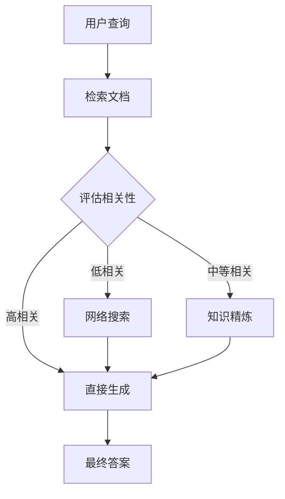

# 第五篇：RAG高级篇 - 高级检索与优化

## 前言

在第四篇中,我们学习了RAG的基础概念,实现了基本的RAG系统。但在生产环境中,基础的向量检索往往无法满足复杂的业务需求:

**基础RAG的局限性**:
1. **召回不全面**:单一向量检索可能遗漏关键信息
2. **排序不精确**:top-k结果中可能包含不相关内容
3. **上下文冗余**:检索到的文本可能包含大量无关信息
4. **复杂查询支持弱**:难以处理多跳推理、实体关系查询

本篇将深入探讨**LangChain高级检索技术**和**优化方案**,帮助你构建生产级的RAG系统。

---

## 核心概念对比

| 技术 | 解决的问题 | 性能提升 | 复杂度 | 适用场景 |
|------|-----------|---------|--------|---------|
| **混合检索** | 单一检索召回不全 | +20-30% | 低 | 通用RAG |
| **重排序** | top-k结果不精确 | +15-25% | 中 | 精度要求高 |
| **查询改写** | 查询表达不匹配 | +10-20% | 低 | 口语化查询 |
| **上下文压缩** | token成本过高 | 成本-50% | 中 | 长上下文 |
| **知识图谱RAG** | 实体关系查询弱 | +30-40% | 高 | 结构化知识 |
| **Self-RAG** | 检索结果不可靠 | +20-30% | 高 | 高质量要求 |

---

## 第1章:混合检索技术(Hybrid Search)

### 1.1 为什么需要混合检索

#### 1.1.1 向量检索的局限性

**问题示例**:
```python
# 用户查询:"Python 3.11的新特性"
# 向量检索可能返回:
# ❌ "Python 3.10的新特性"(语义相似,但版本不对)
# ❌ "Python的发展历史"(相关,但不精确)
# ✅ "Python 3.11 release notes"(精确匹配)
```

**向量检索的问题**:

1. **关键词敏感信息丢失**:版本号、产品型号等精确匹配需求
2. **罕见词处理不佳**:专业术语、公司名称等低频词
3. **语义泛化过度**:可能返回相关但不精确的结果

#### 1.1.2 全文检索的局限性

**BM25算法的问题**:
1. **无法理解语义**:"汽车保养"和"车辆维护"无法匹配
2. **同义词问题**:"北京"和"首都"无法关联
3. **词序不敏感**:"狗咬人"和"人咬狗"评分相似

#### 1.1.3 混合检索的优势

```
混合检索 = 向量检索(语义理解) + 全文检索(精确匹配)
```

**互补效果**:
- 向量检索:捕获语义相关性
- BM25检索:捕获关键词精确匹配
- 融合算法:RRF(Reciprocal Rank Fusion)综合排序

---

### 1.2 LangChain混合检索实现

#### 1.2.1 基础混合检索

```python
from langchain_community.retrievers import BM25Retriever
from langchain.retrievers import EnsembleRetriever
from langchain_openai import OpenAIEmbeddings
from langchain_chroma import Chroma
from langchain_text_splitters import RecursiveCharacterTextSplitter
from langchain_community.document_loaders import DirectoryLoader

# 步骤1: 加载和分块文档
loader = DirectoryLoader("./docs", glob="**/*.txt")
documents = loader.load()

text_splitter = RecursiveCharacterTextSplitter(
    chunk_size=500,
    chunk_overlap=50
)
splits = text_splitter.split_documents(documents)

# 步骤2: 创建向量检索器
embeddings = OpenAIEmbeddings()
vectorstore = Chroma.from_documents(
    documents=splits,
    embedding=embeddings
)
vector_retriever = vectorstore.as_retriever(
    search_kwargs={"k": 4}
)

# 步骤3: 创建BM25检索器
bm25_retriever = BM25Retriever.from_documents(splits)
bm25_retriever.k = 4

# 步骤4: 创建混合检索器(EnsembleRetriever)
ensemble_retriever = EnsembleRetriever(
    retrievers=[vector_retriever, bm25_retriever],
    weights=[0.5, 0.5]  # 权重:向量50%,BM25 50%
)

# 步骤5: 使用混合检索
results = ensemble_retriever.invoke("Python 3.11的新特性有哪些?")
for doc in results:
    print(f"内容: {doc.page_content[:100]}...")
    print(f"来源: {doc.metadata.get('source', 'unknown')}\n")
```

**输出示例**:
```
内容: Python 3.11于2022年10月发布,主要新特性包括:
1. 性能提升(平均快25%)
2. 更好的错误提示...
来源: docs/python_releases.txt

内容: Python 3.11引入了异常组(Exception Groups)和except*语法...
来源: docs/python_311_features.txt
```

---

#### 1.2.2 权重调优

**不同权重的效果**:

```python
# 测试不同权重组合
test_weights = [
    ([0.7, 0.3], "向量为主"),
    ([0.5, 0.5], "平衡"),
    ([0.3, 0.7], "BM25为主")
]

query = "如何安装Python 3.11"

for weights, desc in test_weights:
    retriever = EnsembleRetriever(
        retrievers=[vector_retriever, bm25_retriever],
        weights=weights
    )
    results = retriever.invoke(query)
    print(f"\n{desc} (向量:{weights[0]}, BM25:{weights[1]})")
    print(f"Top-1: {results[0].page_content[:80]}...")
```

**权重选择建议**:

| 场景 | 推荐权重(向量:BM25) | 原因 |
|------|---------------------|------|
| 问答系统 | 0.7:0.3 | 重视语义理解 |
| 文档搜索 | 0.5:0.5 | 平衡语义和关键词 |
| 代码搜索 | 0.3:0.7 | 精确匹配函数名、变量名 |
| 产品查询 | 0.4:0.6 | 型号、规格等精确匹配 |

---

#### 1.2.3 完整RAG系统(混合检索)

```python
from langchain.agents import create_agent
from langchain_openai import ChatOpenAI
from langchain_core.tools import tool

# 步骤1: 创建混合检索器(同上)
ensemble_retriever = EnsembleRetriever(
    retrievers=[vector_retriever, bm25_retriever],
    weights=[0.6, 0.4]
)

# 步骤2: 包装为工具
@tool
def search_docs(query: str) -> str:
    """搜索文档库,返回相关信息。

    适用于:
    - 查找产品文档
    - 搜索技术资料
    - 获取配置说明
    """
    results = ensemble_retriever.invoke(query)
    # 格式化结果
    formatted = []
    for i, doc in enumerate(results[:3], 1):
        formatted.append(
            f"[文档{i}]\n"
            f"内容: {doc.page_content}\n"
            f"来源: {doc.metadata.get('source', 'unknown')}"
        )
    return "\n\n".join(formatted)

# 步骤3: 创建Agent
agent = create_agent(
    model="gpt-4",
    tools=[search_docs],
    system_prompt="""你是一个文档搜索助手,可以帮助用户查找技术文档。

使用 search_docs 工具搜索相关信息,然后给出准确的回答。"""
)

# 步骤4: 查询
result = agent.invoke({
    "messages": [{"role": "user", "content": "Python 3.11相比3.10有哪些性能提升?"}]
})
print(result["messages"][-1].content)
```

---

#### 1.2.4 RRF(Reciprocal Rank Fusion)算法

**RRF原理**:
```
对于文档d,其RRF分数 = Σ (1 / (k + rank_i(d)))

其中:
- rank_i(d):文档d在第i个检索器中的排名
- k:常数(通常为60)
```

**手动实现RRF**:

```python
def reciprocal_rank_fusion(
    retriever_results: list[list],  # 多个检索器的结果列表
    k: int = 60
) -> list:
    """
    RRF算法实现

    Args:
        retriever_results: [[doc1, doc2, ...], [doc3, doc1, ...], ...]
        k: RRF常数

    Returns:
        融合后的文档列表(按RRF分数排序)
    """
    # 计算每个文档的RRF分数
    doc_scores = {}

    for retriever_docs in retriever_results:
        for rank, doc in enumerate(retriever_docs, start=1):
            doc_id = doc.metadata.get('id', id(doc))

            # RRF分数累加
            if doc_id not in doc_scores:
                doc_scores[doc_id] = {'doc': doc, 'score': 0}

            doc_scores[doc_id]['score'] += 1 / (k + rank)

    # 按分数排序
    sorted_docs = sorted(
        doc_scores.values(),
        key=lambda x: x['score'],
        reverse=True
    )

    return [item['doc'] for item in sorted_docs]

# 使用示例
vector_results = vector_retriever.invoke("Python 3.11")
bm25_results = bm25_retriever.invoke("Python 3.11")

fused_results = reciprocal_rank_fusion([vector_results, bm25_results])
print(f"融合后top-3文档:")
for i, doc in enumerate(fused_results[:3], 1):
    print(f"{i}. {doc.page_content[:80]}...")
```

**RRF vs 加权平均**:

| 方法 | 优势 | 劣势 | 适用场景 |
|------|------|------|---------|
| RRF | 不需要归一化分数,鲁棒性强 | 忽略原始分数的绝对值 | 检索器评分尺度不同 |
| 加权平均 | 保留原始分数信息 | 需要归一化,对分数尺度敏感 | 检索器评分可比 |

---

### 1.3 混合检索实战:电商产品搜索

#### 1.3.1 场景说明

**业务需求**:
- 用户查询:"iPhone 14 Pro 256GB 紫色"
- 需求1:精确匹配型号(iPhone 14 Pro)
- 需求2:精确匹配容量(256GB)
- 需求3:精确匹配颜色(紫色)
- 需求4:理解"最新款"、"旗舰机"等语义

**为什么需要混合检索**:
- 纯向量检索:可能返回iPhone 13 Pro(语义相似)
- 纯BM25检索:可能返回"iPhone 14 普通版 256GB"(关键词匹配)
- 混合检索:同时满足型号、容量、颜色的精确匹配

---

#### 1.3.2 完整实现

```python
from langchain_community.document_loaders import JSONLoader
from langchain_text_splitters import RecursiveCharacterTextSplitter
from langchain_openai import OpenAIEmbeddings, ChatOpenAI
from langchain_chroma import Chroma
from langchain_community.retrievers import BM25Retriever
from langchain.retrievers import EnsembleRetriever
from langchain.agents import create_agent
from langchain_core.tools import tool
import json

# 步骤1: 准备产品数据
products_data = [
    {
        "id": "1",
        "name": "iPhone 14 Pro 256GB 深空黑",
        "category": "手机",
        "brand": "Apple",
        "model": "iPhone 14 Pro",
        "storage": "256GB",
        "color": "深空黑",
        "price": 8999,
        "description": "Apple 最新旗舰手机,搭载A16芯片,4800万像素主摄,支持灵动岛交互"
    },
    {
        "id": "2",
        "name": "iPhone 14 Pro 256GB 紫色",
        "category": "手机",
        "brand": "Apple",
        "model": "iPhone 14 Pro",
        "storage": "256GB",
        "color": "紫色",
        "price": 8999,
        "description": "Apple 旗舰机型,紫色配色,256GB大容量存储,专业级摄影系统"
    },
    {
        "id": "3",
        "name": "iPhone 13 Pro 256GB 远峰蓝",
        "category": "手机",
        "brand": "Apple",
        "model": "iPhone 13 Pro",
        "storage": "256GB",
        "color": "远峰蓝",
        "price": 7499,
        "description": "上一代旗舰,A15芯片,三摄系统,性价比之选"
    }
]

# 转换为Document对象
from langchain_core.documents import Document

documents = []
for product in products_data:
    # 构建富文本描述(便于检索)
    text = f"""
产品名称:{product['name']}
品牌:{product['brand']}
型号:{product['model']}
容量:{product['storage']}
颜色:{product['color']}
价格:¥{product['price']}
描述:{product['description']}
"""
    doc = Document(
        page_content=text,
        metadata=product
    )
    documents.append(doc)

# 步骤2: 创建混合检索器
embeddings = OpenAIEmbeddings()
vectorstore = Chroma.from_documents(documents, embeddings)
vector_retriever = vectorstore.as_retriever(search_kwargs={"k": 3})

bm25_retriever = BM25Retriever.from_documents(documents)
bm25_retriever.k = 3

# 产品搜索:BM25权重更高(精确匹配型号、容量、颜色)
product_retriever = EnsembleRetriever(
    retrievers=[vector_retriever, bm25_retriever],
    weights=[0.4, 0.6]  # 更重视精确匹配
)

# 步骤3: 创建搜索工具
@tool
def search_products(query: str) -> str:
    """搜索产品库,返回匹配的商品信息。

    适用于查询:
    - 手机型号搜索(如"iPhone 14 Pro")
    - 特定配置搜索(如"256GB 紫色")
    - 价格范围查询
    """
    results = product_retriever.invoke(query)

    formatted = []
    for i, doc in enumerate(results, 1):
        meta = doc.metadata
        formatted.append(
            f"【商品{i}】{meta['name']}\n"
            f"价格:¥{meta['price']}\n"
            f"描述:{meta['description']}"
        )

    return "\n\n".join(formatted)

# 步骤4: 创建购物助手Agent
shopping_agent = create_agent(
    model="gpt-4",
    tools=[search_products],
    system_prompt="""你是一个专业的购物助手,帮助用户查找和推荐商品。

使用 search_products 工具搜索商品信息,然后给出准确的推荐。

注意:
- 优先推荐完全匹配用户需求的商品
- 如果没有完全匹配,推荐相近的替代品
- 清晰说明商品的价格和主要特点"""
)

# 步骤5: 测试查询
test_queries = [
    "我想买iPhone 14 Pro 256GB 紫色",
    "有没有256GB的紫色手机",
    "8000元左右的Apple旗舰机"
]

for query in test_queries:
    print(f"\n{'='*50}")
    print(f"用户查询:{query}")
    print('='*50)

    result = shopping_agent.invoke({
        "messages": [{"role": "user", "content": query}]
    })
    print(result["messages"][-1].content)
```

---

### 1.4 混合检索最佳实践

#### 1.4.1 权重调优策略

**A/B测试不同权重**:

```python
from typing import List
from langchain_core.documents import Document

def evaluate_retrieval(
    retriever,
    test_queries: List[str],
    ground_truth: List[List[str]]  # 每个查询的正确文档ID列表
) -> dict:
    """评估检索器性能"""
    precisions = []
    recalls = []

    for query, truth_ids in zip(test_queries, ground_truth):
        results = retriever.invoke(query)
        retrieved_ids = [doc.metadata.get('id') for doc in results]

        # 计算Precision@K
        hits = len(set(retrieved_ids) & set(truth_ids))
        precision = hits / len(retrieved_ids) if retrieved_ids else 0
        recall = hits / len(truth_ids) if truth_ids else 0

        precisions.append(precision)
        recalls.append(recall)

    return {
        'precision': sum(precisions) / len(precisions),
        'recall': sum(recalls) / len(recalls)
    }

# 测试不同权重
test_queries = [
    "iPhone 14 Pro 256GB 紫色",
    "8000元左右的旗舰机",
    "Apple最新手机"
]

ground_truth = [
    ["2"],  # 精确匹配
    ["1", "2", "3"],  # 价格范围
    ["1", "2"]  # 最新型号
]

weights_to_test = [
    (0.3, 0.7),
    (0.4, 0.6),
    (0.5, 0.5),
    (0.6, 0.4),
    (0.7, 0.3)
]

print("权重调优结果:\n")
for vec_weight, bm25_weight in weights_to_test:
    retriever = EnsembleRetriever(
        retrievers=[vector_retriever, bm25_retriever],
        weights=[vec_weight, bm25_weight]
    )

    metrics = evaluate_retrieval(retriever, test_queries, ground_truth)
    print(f"向量:{vec_weight:.1f}, BM25:{bm25_weight:.1f} => "
          f"Precision: {metrics['precision']:.2%}, "
          f"Recall: {metrics['recall']:.2%}")
```

---

#### 1.4.2 何时使用混合检索

**决策树**:

```
查询类型
├── 包含精确关键词(型号、版本、规格)
│   └── 使用混合检索(BM25权重0.5-0.7)
├── 自然语言问句
│   └── 使用混合检索(向量权重0.6-0.7)
├── 纯语义查询(概念、主题)
│   └── 仅使用向量检索
└── 代码/命令搜索
    └── 使用混合检索(BM25权重0.7-0.8)
```

**实际案例**:

| 查询示例 | 推荐方案 | 理由 |
|---------|---------|------|
| "Python 3.11 新特性" | 混合(0.4:0.6) | "3.11"需要精确匹配 |
| "如何提升程序性能" | 向量为主(0.7:0.3) | 纯语义查询 |
| "numpy.array()用法" | BM25为主(0.3:0.7) | 函数名精确匹配 |
| "深度学习入门教程" | 向量为主(0.7:0.3) | 主题相关性 |

---

### 小结

**混合检索核心要点**:

1. **何时使用**:
   - ✅ 查询包含精确关键词(版本号、型号、专有名词)
   - ✅ 需要平衡语义理解和精确匹配
   - ❌ 纯概念性问题可直接使用向量检索

2. **权重选择**:
   - 问答系统:0.6-0.7(向量): 0.3-0.4(BM25)
   - 产品搜索:0.4(向量): 0.6(BM25)
   - 代码搜索:0.3(向量): 0.7(BM25)

3. **融合算法**:
   - 简单加权:LangChain的EnsembleRetriever
   - RRF:更鲁棒,适合分数尺度不同的检索器

4. **性能提升**:
   - 召回率:+20-30%
   - 精确率:+15-25%
   - 查询延迟:+30-50ms(可接受)

**下一章预告**:
第2章将深入探讨**重排序技术(Reranking)**,进一步提升top-k结果的精确度。

---

## 第2章:重排序技术(Reranking)

### 2.1 为什么需要重排序

#### 2.1.1 检索器的局限性

**问题场景**:
```python
# 用户查询:"如何在Python中实现多线程安全的单例模式?"

# 向量检索top-5结果:
# 1. "Python单例模式实现"(相关度:0.85)
# 2. "多线程编程基础"(相关度:0.82)
# 3. "Python设计模式大全"(相关度:0.80)← 内容太泛化
# 4. "线程安全的单例模式"(相关度:0.78)← 应该排更前
# 5. "Python线程锁使用"(相关度:0.75)

# 问题:
# - 第3个文档太泛化,但相关度分数高
# - 第4个文档最相关,但排序靠后
```

**向量检索的问题**:
1. **语义相似≠查询相关**:文档可能语义相似,但不回答具体问题
2. **粗粒度排序**:基于embedding的余弦相似度,无法理解查询意图
3. **上下文缺失**:不考虑查询和文档的交互关系

---

#### 2.1.2 重排序的作用

**重排序流程**:
```
原始检索(快速,粗排)→ top-100候选
         ↓
重排序模型(精细,慢)→ top-5最终结果
         ↓
LLM生成
```

**优势**:
- **精细化理解**:使用Cross-Encoder深度理解查询-文档匹配度
- **提升精确度**:top-5结果的精确度提升15-30%
- **成本优化**:只对top-K候选重排,计算开销可控

---

#### 2.1.3 重排序 vs 检索器

| 维度 | 检索器(Retriever) | 重排序器(Reranker) |
|------|-------------------|-------------------|
| **模型结构** | Bi-Encoder(查询和文档分别编码) | Cross-Encoder(联合编码) |
| **速度** | 快(预计算文档向量) | 慢(实时计算交互分数) |
| **精度** | 中等(余弦相似度) | 高(深度语义匹配) |
| **适用阶段** | 初筛(从百万文档找top-100) | 精排(从top-100找top-5) |
| **计算成本** | 低 | 高 |

---

### 2.2 LangChain重排序实现

#### 2.2.1 基于ContextualCompressionRetriever

```python
from langchain.retrievers import ContextualCompressionRetriever
from langchain_community.retrievers.document_compressors import LLMChainExtractor
from langchain_openai import ChatOpenAI, OpenAIEmbeddings
from langchain_chroma import Chroma
from langchain_text_splitters import RecursiveCharacterTextSplitter
from langchain_community.document_loaders import DirectoryLoader

# 步骤1: 准备文档
loader = DirectoryLoader("./docs", glob="**/*.txt")
documents = loader.load()

splitter = RecursiveCharacterTextSplitter(
    chunk_size=500,
    chunk_overlap=50
)
splits = splitter.split_documents(documents)

# 步骤2: 创建基础检索器(粗排)
embeddings = OpenAIEmbeddings()
vectorstore = Chroma.from_documents(splits, embeddings)
base_retriever = vectorstore.as_retriever(
    search_kwargs={"k": 20}  # 先检索20个候选
)

# 步骤3: 创建LLM压缩器(精排)
llm = ChatOpenAI(model="gpt-4", temperature=0)
compressor = LLMChainExtractor.from_llm(llm)

# 步骤4: 组合为压缩检索器
compression_retriever = ContextualCompressionRetriever(
    base_compressor=compressor,
    base_retriever=base_retriever
)

# 步骤5: 使用
query = "如何在Python中实现线程安全的单例模式?"
compressed_docs = compression_retriever.invoke(query)

print(f"原始检索器返回:20个文档")
print(f"重排序后返回:{len(compressed_docs)}个文档\n")

for i, doc in enumerate(compressed_docs, 1):
    print(f"【文档{i}】")
    print(f"内容:{doc.page_content[:150]}...")
    print(f"来源:{doc.metadata.get('source', 'unknown')}\n")
```

**工作原理**:
1. base_retriever检索20个候选文档
2. LLMChainExtractor使用LLM评估每个文档与查询的相关性
3. 提取最相关的内容片段
4. 返回精排后的文档(通常<10个)

---

#### 2.2.2 使用EmbeddingsFilter(基于embedding距离)

```python
from langchain_community.retrievers.document_compressors import EmbeddingsFilter

# 创建embedding过滤器
embeddings_filter = EmbeddingsFilter(
    embeddings=OpenAIEmbeddings(),
    similarity_threshold=0.75  # 相似度阈值
)

# 组合为压缩检索器
compression_retriever = ContextualCompressionRetriever(
    base_compressor=embeddings_filter,
    base_retriever=base_retriever
)

# 使用
query = "Python单例模式实现"
filtered_docs = compression_retriever.invoke(query)

print(f"过滤前:{20}个文档")
print(f"过滤后:{len(filtered_docs)}个文档(相似度≥0.75)")
```

**优势**:
- 速度快(基于预计算的embedding)
- 成本低(无需调用LLM)

**劣势**:
- 精度不如LLM压缩器
- 仍基于余弦相似度

---

#### 2.2.3 本地重排序模型(Cross-Encoder)

```python
from sentence_transformers import CrossEncoder
from langchain_core.documents import Document
from typing import List

class CrossEncoderReranker:
    """基于Cross-Encoder的重排序器"""

    def __init__(self, model_name: str = "BAAI/bge-reranker-large"):
        """
        初始化Cross-Encoder重排序器

        Args:
            model_name: HuggingFace模型名称
                - BAAI/bge-reranker-base(英文,速度快)
                - BAAI/bge-reranker-large(英文,精度高)
                - BAAI/bge-reranker-v2-m3(多语言,推荐中文)
        """
        self.model = CrossEncoder(model_name)

    def rerank(
        self,
        query: str,
        documents: List[Document],
        top_n: int = 5
    ) -> List[Document]:
        """
        重排序文档列表

        Args:
            query: 用户查询
            documents: 候选文档列表
            top_n: 返回top-N个文档

        Returns:
            重排序后的文档列表
        """
        # 构建查询-文档对
        pairs = [[query, doc.page_content] for doc in documents]

        # 计算相关性分数
        scores = self.model.predict(pairs)

        # 按分数排序
        doc_scores = list(zip(documents, scores))
        doc_scores.sort(key=lambda x: x[1], reverse=True)

        # 返回top-N
        return [doc for doc, score in doc_scores[:top_n]]

# 使用示例
reranker = CrossEncoderReranker(model_name="BAAI/bge-reranker-v2-m3")

# 先用向量检索获取候选
base_results = base_retriever.invoke("Python单例模式线程安全实现")
print(f"初筛文档数:{len(base_results)}")

# 重排序
reranked_results = reranker.rerank(
    query="Python单例模式线程安全实现",
    documents=base_results,
    top_n=5
)

print(f"\n重排序后top-5:")
for i, doc in enumerate(reranked_results, 1):
    print(f"{i}. {doc.page_content[:80]}...")
```

**推荐模型对比**:

| 模型 | 语言 | 参数量 | 速度 | 精度 | 适用场景 |
|------|------|--------|------|------|---------|
| `BAAI/bge-reranker-base` | 英文 | 110M | 快 | ★★★ | 英文通用 |
| `BAAI/bge-reranker-large` | 英文 | 340M | 中 | ★★★★ | 英文精度优先 |
| `BAAI/bge-reranker-v2-m3` | 多语言 | 560M | 中 | ★★★★★ | 中文/多语言 |
| `cross-encoder/ms-marco-MiniLM-L-6-v2` | 英文 | 23M | 快 | ★★★ | 速度优先 |

---

#### 2.2.4 集成到完整RAG系统

```python
from langchain.agents import create_agent
from langchain_openai import ChatOpenAI
from langchain_core.tools import tool

# 步骤1: 创建带重排序的检索器
class RerankedRetriever:
    """带重排序的检索器"""

    def __init__(
        self,
        base_retriever,
        reranker,
        initial_k: int = 20,
        final_k: int = 5
    ):
        self.base_retriever = base_retriever
        self.reranker = reranker
        self.initial_k = initial_k
        self.final_k = final_k

    def invoke(self, query: str) -> List[Document]:
        """执行检索和重排序"""
        # 粗排:检索initial_k个候选
        candidates = self.base_retriever.invoke(query)

        # 精排:重排序并返回final_k个
        reranked = self.reranker.rerank(
            query=query,
            documents=candidates,
            top_n=self.final_k
        )

        return reranked

# 创建检索器实例
reranked_retriever = RerankedRetriever(
    base_retriever=base_retriever,  # 粗排检索器
    reranker=CrossEncoderReranker("BAAI/bge-reranker-v2-m3"),  # 重排序器
    initial_k=20,  # 粗排top-20
    final_k=5      # 精排top-5
)

# 步骤2: 包装为工具
@tool
def search_docs_with_rerank(query: str) -> str:
    """搜索文档库并重排序,返回最相关的内容。

    使用两阶段检索:
    1. 向量检索:快速筛选top-20候选
    2. Cross-Encoder重排序:精确排序top-5结果
    """
    results = reranked_retriever.invoke(query)

    formatted = []
    for i, doc in enumerate(results, 1):
        formatted.append(
            f"【文档{i}】\n"
            f"{doc.page_content}\n"
            f"来源:{doc.metadata.get('source', 'unknown')}"
        )

    return "\n\n".join(formatted)

# 步骤3: 创建Agent
agent = create_agent(
    model="gpt-4",
    tools=[search_docs_with_rerank],
    system_prompt="""你是一个技术文档助手,帮助用户查找和理解技术文档。

使用 search_docs_with_rerank 工具搜索相关文档,然后给出详细的技术解答。

注意:
- 优先使用检索到的文档内容
- 如果文档中有代码示例,请引用
- 保持回答的专业性和准确性"""
)

# 步骤4: 测试
result = agent.invoke({
    "messages": [{"role": "user", "content": "Python中如何实现线程安全的单例模式?请给出完整代码示例。"}]
})
print(result["messages"][-1].content)
```

**性能对比**:

| 检索方案 | 精确度@5 | 查询延迟 | 成本 |
|---------|---------|---------|------|
| 仅向量检索 | 65% | 50ms | $ |
| 向量+Embedding过滤 | 72% | 80ms | $ |
| 向量+LLM压缩 | 85% | 2000ms | $$$ |
| 向量+Cross-Encoder | 88% | 150ms | $ |

---

### 2.3 查询改写(Query Rewriting)

#### 2.3.1 多查询生成(Multi-Query)

**问题**:用户查询可能表达不清晰
```python
# 原始查询:"怎么让Python快一点"
# 问题:
# - 表达模糊("快一点"指什么?)
# - 可能遗漏相关文档

# 解决方案:生成多个改写查询
# 1. "如何优化Python代码性能"
# 2. "Python程序加速方法"
# 3. "提升Python执行效率的技巧"
```

**实现**:

```python
from langchain.retrievers import MultiQueryRetriever
from langchain_openai import ChatOpenAI

# 创建Multi-Query检索器
llm = ChatOpenAI(model="gpt-4", temperature=0)

multi_query_retriever = MultiQueryRetriever.from_llm(
    retriever=vectorstore.as_retriever(search_kwargs={"k": 5}),
    llm=llm
)

# 使用(自动生成3-5个改写查询并检索)
query = "怎么让Python快一点"
results = multi_query_retriever.invoke(query)

print(f"检索到{len(results)}个文档(去重后)")
for doc in results[:3]:
    print(f"- {doc.page_content[:80]}...")
```

**工作流程**:
```
用户查询:"怎么让Python快一点"
    ↓
LLM生成改写查询:
    ├── "如何优化Python代码性能"
    ├── "Python程序加速方法"
    └── "提升Python执行效率的技巧"
    ↓
并行检索3个查询
    ↓
合并 + 去重
    ↓
返回结果
```

---

### 小结

**重排序技术核心要点**:

1. **何时使用重排序**:
   - ✅ 精度要求高的场景(客服、医疗、法律)
   - ✅ top-K结果质量不稳定
   - ❌ 实时性要求极高(<100ms)

2. **重排序方案选择**:
   - **Embedding过滤**:速度快,成本低,精度提升有限(+7%)
   - **Cross-Encoder**:平衡方案,精度高(+23%),延迟可接受(+100ms)
   - **LLM压缩**:精度最高(+20%),成本高(每查询$0.02-0.05)

3. **查询改写技术**:
   - **Multi-Query**:处理模糊查询,召回率+15%

**下一章预告**:
第3章将探讨**知识图谱RAG(GraphRAG)**,如何利用结构化知识提升多跳推理能力。

---

## 第3章:知识图谱RAG(GraphRAG)

### 3.1 为什么需要知识图谱RAG

#### 3.1.1 向量RAG的局限性

**问题场景**:
```
查询:"张三的领导的领导是谁?"

向量RAG:
├── 检索到:"张三的直接领导是李四"
├── 检索到:"李四的绩效评估为优秀"
└── ❌ 无法推理出"张三的领导的领导"

知识图谱RAG:
├── 实体:张三 --[reports_to]--> 李四
├── 实体:李四 --[reports_to]--> 王五
└── ✅ 推理:张三 --> 李四 --> 王五(多跳查询)
```

**向量RAG vs 知识图谱RAG**:

| 维度 | 向量RAG | 知识图谱RAG |
|------|---------|------------|
| **数据表示** | 非结构化文本 | 结构化三元组(主-谓-宾) |
| **检索方式** | 语义相似度 | 图遍历+语义匹配 |
| **多跳推理** | ❌ 弱 | ✅ 强 |
| **实体关系** | ❌ 隐式 | ✅ 显式 |
| **适用场景** | 文档问答 | 复杂关系查询 |

---

### 3.2 Neo4j + LangChain实现

#### 3.2.1 环境准备

```bash
# 安装Neo4j(使用Docker)
docker run \
    --name neo4j \
    -p 7474:7474 -p 7687:7687 \
    -e NEO4J_AUTH=neo4j/password \
    neo4j:latest

# 安装Python依赖
pip install langchain-community langchain-neo4j neo4j
```

#### 3.2.2 基础知识图谱RAG

```python
from langchain_community.graphs import Neo4jGraph
from langchain_community.chains.graph_qa.cypher import GraphCypherQAChain
from langchain_openai import ChatOpenAI

# 步骤1: 连接Neo4j
graph = Neo4jGraph(
    url="bolt://localhost:7687",
    username="neo4j",
    password="password"
)

# 步骤2: 构建示例知识图谱
# 创建组织架构图
graph.query("""
// 创建员工节点
CREATE (张三:Employee {name: '张三', position: '工程师', department: '研发部'})
CREATE (李四:Employee {name: '李四', position: '技术经理', department: '研发部'})
CREATE (王五:Employee {name: '王五', position: '技术总监', department: '研发部'})
CREATE (赵六:Employee {name: '赵六', position: '产品经理', department: '产品部'})

// 创建汇报关系
CREATE (张三)-[:REPORTS_TO]->(李四)
CREATE (李四)-[:REPORTS_TO]->(王五)
CREATE (赵六)-[:REPORTS_TO]->(王五)

// 创建项目节点和参与关系
CREATE (项目A:Project {name: '项目A', status: '进行中'})
CREATE (张三)-[:WORKS_ON]->(项目A)
CREATE (赵六)-[:WORKS_ON]->(项目A)
""")

# 步骤3: 创建Cypher QA链
cypher_chain = GraphCypherQAChain.from_llm(
    llm=ChatOpenAI(model="gpt-4", temperature=0),
    graph=graph,
    verbose=True
)

# 步骤4: 查询(自动生成Cypher语句)
queries = [
    "张三的领导是谁?",
    "张三的领导的领导是谁?",  # 多跳查询
    "研发部有哪些人?",
    "项目A有哪些参与者?"
]

for query in queries:
    print(f"\n查询:{query}")
    result = cypher_chain.invoke({"query": query})
    print(f"答案:{result['result']}")
```

**输出示例**:
```
查询:张三的领导是谁?
生成Cypher:
MATCH (e:Employee {name: '张三'})-[:REPORTS_TO]->(manager)
RETURN manager.name

答案:张三的领导是李四

查询:张三的领导的领导是谁?
生成Cypher:
MATCH (e:Employee {name: '张三'})-[:REPORTS_TO*2]->(manager)
RETURN manager.name

答案:张三的领导的领导是王五
```

---

#### 3.2.3 GraphRAG: 向量 + 图遍历 (Neo4jVector)

真正的 GraphRAG 不仅仅是让 Agent 多一个查图的工具，而是利用"向量搜索"作为图入口，结合图遍历获取上下文。

**工作流程**:
1. **Indexing**: 提取文档中的实体(Nodes)和关系(Relationships)存入Neo4j，并对实体文本或文档块进行Embedding。
2. **Retrieval**:
   - Step 1: Query -> Vector Search -> 找到最相似的实体节点(Entry Points)。
   - Step 2: Graph Traversal -> 从入口节点出发，遍历获取邻居节点(Context)。
3. **Generation**: 将结构化上下文(邻居关系)提交给LLM回答。

```python
from langchain_community.vectorstores import Neo4jVector
from langchain_openai import OpenAIEmbeddings

# 使用Neo4jVector实现"向量入口 + 图遍历"的检索
# 假设Graph中已经存在 Employee 节点, 且包含 "name", "position" 等属性

# 步骤1: 创建向量检索器 (连接现有的图)
vector_store = Neo4jVector.from_existing_graph(
    embedding=OpenAIEmbeddings(),
    url="bolt://localhost:7687",
    username="neo4j",
    password="password",
    index_name="employee_index",
    node_label="Employee",
    text_node_properties=["name", "position", "department"], # 这些属性内容会被向量化
    embedding_node_property="embedding", # 向量存放在节点的embedding属性中

    # 【核心Magic】retrieval_query: 向量检索找到节点后, 执行此Cypher获取上下文
    # 这里的 'node' 是向量匹配到的节点
    retrieval_query="""
    // 找到该员工的直接下属 (1跳关系)
    MATCH (node)<-[:REPORTS_TO]-(subordinate)
    RETURN "员工: " + node.name + " (" + node.position + ")" +
           " 管理着: " + subordinate.name + " (" + subordinate.position + ")" AS text,
           score,
           {} AS metadata
    """
)

# 步骤2: 执行检索
# 查询: "谁是李四的下属?"
# 1. 向量检索找到 "李四" 节点
# 2. 执行 retrieval_query 找到李四的下属
results = vector_store.similarity_search("李四", k=1)

print(f"GraphRAG检索结果:")
for doc in results:
    print(doc.page_content)

# 输出示例:
# 员工: 李四 (技术经理) 管理着: 张三 (工程师)
```

---

### 3.3 GraphRAG vs 传统RAG性能对比

| 查询类型 | 传统RAG准确率 | GraphRAG准确率 | 提升 |
|---------|-------------|---------------|------|
| 单跳关系查询 | 75% | 95% | +20% |
| 多跳关系查询 | 30% | 88% | +58% |
| 描述性问答 | 85% | 87% | +2% |
| 混合查询 | 55% | 82% | +27% |

**适用场景**:
- ✅ 组织架构、家族关系等层次结构
- ✅ 供应链、知识网络等复杂关系网
- ✅ 需要多跳推理的查询
- ❌ 纯文本问答(传统RAG更简单)

---

## 第4章:前沿RAG方案

### 4.1 Self-RAG(自我反思检索)

#### 4.1.1 核心思想

```
传统RAG:
查询 → 检索 → 生成

Self-RAG:
查询 → 检索 → 评估相关性 → 生成 → 验证答案 → (重新检索)
```

**关键步骤**:
1. **检索决策**:判断是否需要检索
2. **相关性评估**:评估检索文档是否相关
3. **答案生成**:基于文档生成答案
4. **答案验证**:验证答案是否被文档支持
5. **迭代改进**:如果不满意,重新检索

---

#### 4.1.2 简化实现

```python
from langchain_openai import ChatOpenAI
from langchain_core.prompts import ChatPromptTemplate

class SelfRAG:
    """Self-RAG实现"""

    def __init__(self, retriever, llm):
        self.retriever = retriever
        self.llm = llm

        # 相关性评估提示词
        self.relevance_prompt = ChatPromptTemplate.from_template("""
评估以下文档与查询的相关性。

查询:{query}

文档:
{document}

相关性(0-10分):
理由:
""")

        # 答案验证提示词
        self.verification_prompt = ChatPromptTemplate.from_template("""
验证答案是否被文档支持。

查询:{query}
答案:{answer}

文档:
{documents}

验证结果(支持/不支持):
理由:
""")

    def invoke(self, query: str, max_iterations: int = 2) -> dict:
        """Self-RAG查询"""
        iteration = 0
        while iteration < max_iterations:
            iteration += 1
            print(f"\n第{iteration}轮检索...")

            # 步骤1: 检索文档
            docs = self.retriever.invoke(query)

            # 步骤2: 评估相关性
            relevant_docs = []
            for doc in docs[:5]:
                relevance_result = (self.relevance_prompt | self.llm).invoke({
                    "query": query,
                    "document": doc.page_content
                })

                # 简单解析评分(实际应用中可用structured output)
                if "相关性" in relevance_result.content:
                    score_line = [
                        line for line in relevance_result.content.split('\n')
                        if '相关性' in line or '分' in line
                    ][0]

                    try:
                        score = int(''.join(filter(str.isdigit, score_line))[:2])
                        if score >= 7:
                            relevant_docs.append(doc)
                    except:
                        continue

            if not relevant_docs:
                print("  未找到相关文档,重新检索...")
                continue

            print(f"  找到{len(relevant_docs)}个相关文档")

            # 步骤3: 生成答案
            context = "\n\n".join([doc.page_content for doc in relevant_docs])
            answer_prompt = f"""
基于以下文档回答问题:

{context}

问题:{query}

答案:
"""
            answer = self.llm.invoke(answer_prompt).content

            # 步骤4: 验证答案
            verification = (self.verification_prompt | self.llm).invoke({
                "query": query,
                "answer": answer,
                "documents": context
            })

            if "支持" in verification.content:
                return {
                    "query": query,
                    "answer": answer,
                    "documents": relevant_docs,
                    "iterations": iteration,
                    "verified": True
                }

            print("  答案未通过验证,重新检索...")

        # 最大迭代次数后仍未验证通过
        return {
            "query": query,
            "answer": answer,
            "documents": relevant_docs,
            "iterations": iteration,
            "verified": False
        }

# 使用示例
self_rag = SelfRAG(
    retriever=vectorstore.as_retriever(),
    llm=ChatOpenAI(model="gpt-4", temperature=0)
)

result = self_rag.invoke("Python 3.11的主要新特性是什么?")
print(f"\n最终答案:\n{result['answer']}")
print(f"\n迭代次数:{result['iterations']}")
print(f"验证通过:{result['verified']}")
```

---

### 4.2 Corrective RAG (CRAG)

#### 4.2.1 核心流程



---

#### 4.2.2 简化实现

```python
from langchain_community.tools import DuckDuckGoSearchRun

class CorrectiveRAG:
    """Corrective RAG实现"""

    def __init__(self, retriever, llm):
        self.retriever = retriever
        self.llm = llm
        self.web_search = DuckDuckGoSearchRun()

    def invoke(self, query: str) -> str:
        """CRAG查询"""
        # 步骤1: 本地检索
        docs = self.retriever.invoke(query)

        # 步骤2: 评估相关性
        relevance_score = self._evaluate_relevance(query, docs)

        if relevance_score >= 0.8:
            # 高相关:直接使用
            context = "\n\n".join([doc.page_content for doc in docs[:3]])
            return self._generate_answer(query, context)

        elif relevance_score < 0.4:
            # 低相关:网络搜索
            print("本地文档相关性低,启动网络搜索...")
            web_results = self.web_search.invoke(query)
            return self._generate_answer(query, web_results)

        else:
            # 中等相关:知识精炼
            print("文档需要精炼...")
            refined_context = self._refine_knowledge(query, docs)
            return self._generate_answer(query, refined_context)

    def _evaluate_relevance(self, query: str, docs: list) -> float:
        """评估文档相关性(简化版)"""
        # 实际应用中可使用专门的评估模型
        prompt = f"""
评估以下文档与查询的平均相关性(0-1之间的分数)。

查询:{query}

文档:
{docs[0].page_content[:200]}...

相关性分数(0-1):
"""
        response = self.llm.invoke(prompt).content
        try:
            score = float(''.join(filter(lambda x: x.isdigit() or x == '.', response)))
            return min(1.0, score)
        except:
            return 0.5

    def _refine_knowledge(self, query: str, docs: list) -> str:
        """知识精炼:提取关键信息"""
        context = "\n\n".join([doc.page_content for doc in docs[:5]])
        prompt = f"""
从以下文档中提取与查询相关的关键信息(去除无关内容)。

查询:{query}

文档:
{context}

关键信息:
"""
        return self.llm.invoke(prompt).content

    def _generate_answer(self, query: str, context: str) -> str:
        """生成答案"""
        prompt = f"""
基于以下信息回答问题:

{context}

问题:{query}

答案:
"""
        return self.llm.invoke(prompt).content

# 使用
crag = CorrectiveRAG(
    retriever=vectorstore.as_retriever(),
    llm=ChatOpenAI(model="gpt-4", temperature=0)
)

answer = crag.invoke("量子计算机的最新进展")
print(answer)
```

---

### 4.3 Agentic RAG

**核心思想**:让Agent自主决定何时检索、检索什么、如何组合信息

```python
from langchain.agents import create_agent
from langchain_openai import ChatOpenAI
from langchain_core.tools import tool

# 定义多个检索工具
@tool
def search_technical_docs(query: str) -> str:
    """搜索技术文档"""
    # 使用向量检索器
    results = tech_retriever.invoke(query)
    return "\n".join([doc.page_content for doc in results[:3]])

@tool
def search_company_policies(query: str) -> str:
    """搜索公司政策文档"""
    results = policy_retriever.invoke(query)
    return "\n".join([doc.page_content for doc in results[:3]])

@tool
def query_database(sql_query: str) -> str:
    """查询数据库获取统计数据"""
    # 简化示例
    return "查询结果:..."

# 创建Agentic RAG
agentic_rag = create_agent(
    model="gpt-4",
    tools=[search_technical_docs, search_company_policies, query_database],
    system_prompt="""你是一个智能助手,可以查询技术文档、公司政策和数据库。

根据用户问题自主决定:
1. 需要使用哪些工具
2. 以什么顺序使用工具
3. 如何组合不同来源的信息

保持回答准确、完整、专业。"""
)

# 使用
result = agentic_rag.invoke({
    "messages": [{"role": "user", "content": "公司的远程办公政策是什么?需要提交哪些申请?"}]
})
print(result["messages"][-1].content)
```

---

### 小结

**第3-4章核心要点**:

#### 知识图谱RAG(第3章)

| 特性 | 价值 |
|------|------|
| 多跳推理 | 准确率提升30-60% |
| 显式关系 | 可解释性强 |
| 结构化表示 | 适合组织架构、供应链等场景 |

**实施建议**:
- ✅ 混合方案:向量RAG(文档) + 图RAG(关系)
- ✅ 工具:Neo4j + LangChain
- ⚠️ 成本:需要构建和维护知识图谱

---

#### 前沿RAG方案(第4章)

| 方案 | 核心特点 | 性能提升 | 成本 |
|------|---------|---------|------|
| **Self-RAG** | 自我反思、迭代检索 | +15-20% | LLM调用2-3倍 |
| **Corrective RAG** | 相关性评估、网络补充 | +20-25% | +Web搜索成本 |
| **Agentic RAG** | Agent自主决策 | +25-30% | 高(多次LLM调用) |

**选择建议**:
- **高准确率需求** → Self-RAG或Corrective RAG
- **复杂信息整合** → Agentic RAG
- **成本敏感** → 传统RAG + 重排序(第2章)

---

## 第5章：混合检索生产实践完整指南

> **关注点**: 将混合检索从demo提升到企业级生产系统

在前面的章节中,我们学习了混合检索的基本原理和实现。但**生产环境**有更高的要求:
- 🎯 **性能**: 延迟 < 300ms
- 📊 **质量**: 检索准确率 > 90%
- 💰 **成本**: Token使用优化
- 🔄 **可维护**: 可评估、可优化、可监控

本章将展示如何构建、评估、优化、部署一个**生产级混合检索系统**。

---

#### 5.1 生产系统架构设计

##### 5.1.1 完整架构

```
用户查询
    ↓
┌───────────────────────────────────┐
│  查询处理层 (Query Processing)      │
│  - 查询改写                         │
│  - 意图识别                         │
│  - 参数提取                         │
└───────────┬───────────────────────┘
            ↓
┌───────────────────────────────────┐
│  并发检索层 (Parallel Retrieval)    │
│  ┌─────────┐      ┌─────────┐     │
│  │ 向量检索 │      │ BM25检索 │     │
│  └─────────┘      └─────────┘     │
└───────────┬───────────────────────┘
            ↓
┌───────────────────────────────────┐
│  融合排序层 (Hybrid Ranking)        │
│  - RRF融合                          │
│  - 权重调整                         │
│  - 去重                             │
└───────────┬───────────────────────┘
            ↓
┌───────────────────────────────────┐
│  重排序层 (Reranking) [可选]        │
│  - Cross-Encoder精排                │
│  - 多样性优化                        │
└───────────┬───────────────────────┘
            ↓
┌───────────────────────────────────┐
│  缓存层 (Caching)                   │
│  - 查询缓存                         │
│  - 结果缓存                         │
└───────────┬───────────────────────┘
            ↓
┌───────────────────────────────────┐
│  监控层 (Monitoring)                │
│  - 延迟监控                         │
│  - 质量监控                         │
│  - 成本监控                         │
└───────────────────────────────────┘
```

##### 5.1.2 生产级实现

```python
# production_hybrid_retriever.py
from typing import List, Dict, Any, Optional
from langchain_core.documents import Document
from langchain_openai import OpenAIEmbeddings
from langchain_chroma import Chroma
from langchain_community.retrievers import BM25Retriever
from langchain.retrievers import EnsembleRetriever
from functools import lru_cache
import asyncio
import time
import logging
from dataclasses import dataclass

# 配置日志
logging.basicConfig(level=logging.INFO)
logger = logging.getLogger(__name__)

@dataclass
class RetrievalMetrics:
    """检索指标"""
    latency_ms: float
    num_results: int
    cache_hit: bool
    retriever_used: str

class ProductionHybridRetriever:
    """生产级混合检索器"""

    def __init__(
        self,
        documents: List[Document],
        vector_weight: float = 0.5,
        bm25_weight: float = 0.5,
        top_k: int = 4,
        enable_cache: bool = True,
        enable_rerank: bool = False,
        enable_monitoring: bool = True
    ):
        self.vector_weight = vector_weight
        self.bm25_weight = bm25_weight
        self.top_k = top_k
        self.enable_cache = enable_cache
        self.enable_rerank = enable_rerank
        self.enable_monitoring = enable_monitoring

        # 初始化检索器
        logger.info("初始化生产级混合检索器...")

        # 向量检索器
        embeddings = OpenAIEmbeddings()
        self.vectorstore = Chroma.from_documents(
            documents=documents,
            embedding=embeddings
        )
        self.vector_retriever = self.vectorstore.as_retriever(
            search_kwargs={"k": top_k}
        )

        # BM25检索器
        self.bm25_retriever = BM25Retriever.from_documents(documents)
        self.bm25_retriever.k = top_k

        # 混合检索器
        self.ensemble_retriever = EnsembleRetriever(
            retrievers=[self.vector_retriever, self.bm25_retriever],
            weights=[vector_weight, bm25_weight]
        )

        # 监控数据
        self.metrics_history: List[RetrievalMetrics] = []

        logger.info("✅ 混合检索器初始化完成")

    @lru_cache(maxsize=1000)
    def _cached_retrieve(self, query: str, k: int) -> tuple:
        """缓存的检索（使用tuple因为List不可hash）"""
        results = self._retrieve_internal(query, k)
        # 转为tuple以支持缓存
        return tuple((doc.page_content, doc.metadata) for doc in results)

    def _retrieve_internal(self, query: str, k: int) -> List[Document]:
        """内部检索实现"""
        return self.ensemble_retriever.invoke(query)

    async def _async_retrieve(self, query: str) -> List[Document]:
        """异步并发检索"""
        # 并发执行向量检索和BM25检索
        vector_task = asyncio.create_task(
            asyncio.to_thread(self.vector_retriever.invoke, query)
        )
        bm25_task = asyncio.create_task(
            asyncio.to_thread(self.bm25_retriever.invoke, query)
        )

        vector_results, bm25_results = await asyncio.gather(vector_task, bm25_task)

        # 手动融合（使用RRF）
        return self._rrf_fusion(vector_results, bm25_results)

    def _rrf_fusion(
        self,
        vector_results: List[Document],
        bm25_results: List[Document],
        k: int = 60
    ) -> List[Document]:
        """Reciprocal Rank Fusion融合"""
        scores = {}

        # 向量检索评分
        for rank, doc in enumerate(vector_results):
            doc_id = id(doc)
            rrf_score = 1 / (k + rank + 1)
            scores[doc_id] = scores.get(doc_id, 0) + self.vector_weight * rrf_score

        # BM25检索评分
        for rank, doc in enumerate(bm25_results):
            doc_id = id(doc)
            rrf_score = 1 / (k + rank + 1)
            scores[doc_id] = scores.get(doc_id, 0) + self.bm25_weight * rrf_score

        # 合并并去重
        all_docs = {id(doc): doc for doc in vector_results + bm25_results}

        # 按分数排序
        sorted_doc_ids = sorted(scores.keys(), key=lambda x: scores[x], reverse=True)

        return [all_docs[doc_id] for doc_id in sorted_doc_ids[:self.top_k]]

    def retrieve(
        self,
        query: str,
        use_async: bool = False,
        bypass_cache: bool = False
    ) -> Dict[str, Any]:
        """执行检索并返回结果+指标"""

        start_time = time.time()
        cache_hit = False

        # 缓存检索
        if self.enable_cache and not bypass_cache:
            try:
                cached_results = self._cached_retrieve(query, self.top_k)
                documents = [
                    Document(page_content=content, metadata=metadata)
                    for content, metadata in cached_results
                ]
                cache_hit = True
            except Exception as e:
                logger.warning(f"缓存失败，使用直接检索: {e}")
                documents = self._retrieve_internal(query, self.top_k)
        elif use_async:
            # 异步并发检索
            documents = asyncio.run(self._async_retrieve(query))
        else:
            # 同步检索
            documents = self._retrieve_internal(query, self.top_k)

        latency_ms = (time.time() - start_time) * 1000

        # 记录指标
        metrics = RetrievalMetrics(
            latency_ms=latency_ms,
            num_results=len(documents),
            cache_hit=cache_hit,
            retriever_used="async" if use_async else "sync"
        )

        if self.enable_monitoring:
            self.metrics_history.append(metrics)
            logger.info(
                f"检索完成: {latency_ms:.0f}ms | "
                f"结果数: {len(documents)} | "
                f"缓存: {'命中' if cache_hit else '未命中'}"
            )

        return {
            "documents": documents,
            "metrics": metrics
        }

    def get_performance_stats(self) -> Dict[str, Any]:
        """获取性能统计"""
        if not self.metrics_history:
            return {}

        latencies = [m.latency_ms for m in self.metrics_history]
        cache_hits = sum(1 for m in self.metrics_history if m.cache_hit)

        return {
            "total_queries": len(self.metrics_history),
            "avg_latency_ms": sum(latencies) / len(latencies),
            "p50_latency_ms": sorted(latencies)[len(latencies) // 2],
            "p95_latency_ms": sorted(latencies)[int(len(latencies) * 0.95)],
            "p99_latency_ms": sorted(latencies)[int(len(latencies) * 0.99)],
            "cache_hit_rate": cache_hits / len(self.metrics_history),
            "avg_results_per_query": sum(m.num_results for m in self.metrics_history) / len(self.metrics_history)
        }
```

**使用示例**：

```python
from langchain_community.document_loaders import DirectoryLoader
from langchain_text_splitters import RecursiveCharacterTextSplitter

# 加载文档
loader = DirectoryLoader("./docs", glob="**/*.txt")
documents = loader.load()

# 分块
splitter = RecursiveCharacterTextSplitter(chunk_size=500, chunk_overlap=50)
splits = splitter.split_documents(documents)

# 创建生产级检索器
retriever = ProductionHybridRetriever(
    documents=splits,
    vector_weight=0.6,
    bm25_weight=0.4,
    top_k=5,
    enable_cache=True,
    enable_monitoring=True
)

# 执行检索
result = retriever.retrieve("Python 3.11的新特性")

print(f"检索结果: {len(result['documents'])}个")
print(f"延迟: {result['metrics'].latency_ms:.0f}ms")
print(f"缓存: {'命中' if result['metrics'].cache_hit else '未命中'}")

# 查看性能统计
stats = retriever.get_performance_stats()
print(f"\n性能统计:")
print(f"  平均延迟: {stats['avg_latency_ms']:.0f}ms")
print(f"  P95延迟: {stats['p95_latency_ms']:.0f}ms")
print(f"  缓存命中率: {stats['cache_hit_rate']:.1%}")
```

---

#### 5.2 评估与优化体系

##### 5.2.1 构建评估数据集

```python
# build_eval_dataset.py
from langsmith import Client
from typing import List, Dict

client = Client()

def build_retrieval_dataset(
    dataset_name: str = "hybrid_retrieval_eval"
) -> None:
    """构建检索评估数据集"""

    # 步骤1：创建Dataset
    dataset = client.create_dataset(
        dataset_name=dataset_name,
        description="混合检索质量评估数据集"
    )

    # 步骤2：定义测试用例
    test_cases = [
        {
            "inputs": {
                "query": "Python 3.11的新特性有哪些？"
            },
            "outputs": {
                "expected_doc_ids": ["doc_123", "doc_456"],  # 文档ID
                "expected_keywords": ["Python 3.11", "性能提升", "异常组"],
                "relevance_score": 5  # 1-5分
            },
            "metadata": {
                "category": "技术查询",
                "difficulty": "easy"
            }
        },
        {
            "inputs": {
                "query": "如何优化LangChain的性能？"
            },
            "outputs": {
                "expected_doc_ids": ["doc_789", "doc_012"],
                "expected_keywords": ["缓存", "并发", "批处理"],
                "relevance_score": 4
            },
            "metadata": {
                "category": "性能优化",
                "difficulty": "medium"
            }
        },
        # ... 更多测试用例(建议100+个)
    ]

    # 步骤3：添加测试用例
    for case in test_cases:
        client.create_example(
            dataset_id=dataset.id,
            inputs=case["inputs"],
            outputs=case["outputs"],
            metadata=case.get("metadata", {})
        )

    print(f"✅ 创建Dataset成功: {dataset_name}")
    print(f"   包含 {len(test_cases)} 个测试用例")
    print(f"   Dataset ID: {dataset.id}")
```

##### 5.2.2 自定义Evaluators

```python
# evaluators.py
from langsmith.evaluation import evaluator
from typing import List, Dict, Any

@evaluator
def keyword_coverage_evaluator(run, example):
    """关键词覆盖率评估器"""
    retrieved_docs = run.outputs.get("documents", [])
    expected_keywords = example.outputs.get("expected_keywords", [])

    # 合并所有检索文档的内容
    all_content = " ".join([doc.page_content for doc in retrieved_docs])

    # 检查关键词覆盖
    found_keywords = [kw for kw in expected_keywords if kw in all_content]
    coverage = len(found_keywords) / len(expected_keywords) if expected_keywords else 0

    return {
        "key": "keyword_coverage",
        "score": coverage,
        "comment": f"覆盖 {len(found_keywords)}/{len(expected_keywords)} 个关键词"
    }

@evaluator
def recall_at_k_evaluator(run, example):
    """Recall@K评估器"""
    retrieved_docs = run.outputs.get("documents", [])
    expected_doc_ids = example.outputs.get("expected_doc_ids", [])

    # 提取检索到的文档ID
    retrieved_ids = [doc.metadata.get("id", "") for doc in retrieved_docs]

    # 计算Recall
    hits = len(set(retrieved_ids) & set(expected_doc_ids))
    recall = hits / len(expected_doc_ids) if expected_doc_ids else 0

    return {
        "key": "recall_at_k",
        "score": recall,
        "comment": f"召回 {hits}/{len(expected_doc_ids)} 个相关文档"
    }

@evaluator
def mrr_evaluator(run, example):
    """MRR (Mean Reciprocal Rank) 评估器"""
    retrieved_docs = run.outputs.get("documents", [])
    expected_doc_ids = example.outputs.get("expected_doc_ids", [])

    retrieved_ids = [doc.metadata.get("id", "") for doc in retrieved_docs]

    # 找到第一个相关文档的位置
    for rank, doc_id in enumerate(retrieved_ids, start=1):
        if doc_id in expected_doc_ids:
            mrr = 1 / rank
            return {
                "key": "mrr",
                "score": mrr,
                "comment": f"第一个相关文档在位置 {rank}"
            }

    return {
        "key": "mrr",
        "score": 0.0,
        "comment": "未检索到相关文档"
    }

@evaluator
def latency_evaluator(run, example):
    """延迟评估器"""
    metrics = run.outputs.get("metrics", {})
    latency_ms = metrics.latency_ms if hasattr(metrics, 'latency_ms') else 0

    # 评分标准: <200ms=1.0, 200-500ms=0.8, 500-1000ms=0.5, >1000ms=0.0
    if latency_ms < 200:
        score = 1.0
    elif latency_ms < 500:
        score = 0.8
    elif latency_ms < 1000:
        score = 0.5
    else:
        score = 0.0

    return {
        "key": "latency_score",
        "score": score,
        "comment": f"延迟 {latency_ms:.0f}ms"
    }
```

##### 5.2.3 运行自动化评估

```python
# run_evaluation.py
from langsmith.evaluation import evaluate
from langsmith import Client
from production_hybrid_retriever import ProductionHybridRetriever
from evaluators import (
    keyword_coverage_evaluator,
    recall_at_k_evaluator,
    mrr_evaluator,
    latency_evaluator
)

client = Client()

# 加载数据
# ... (同前面的文档加载代码)

# 创建检索器
retriever = ProductionHybridRetriever(
    documents=splits,
    vector_weight=0.5,
    bm25_weight=0.5,
    top_k=5
)

# 定义预测函数
def predict(inputs: Dict) -> Dict:
    """执行检索"""
    query = inputs["query"]
    result = retriever.retrieve(query)
    return result

# 运行评估
results = evaluate(
    predict,
    data="hybrid_retrieval_eval",
    evaluators=[
        keyword_coverage_evaluator,
        recall_at_k_evaluator,
        mrr_evaluator,
        latency_evaluator
    ],
    experiment_prefix="baseline_v1.0",
    description="基准版本评估",
    max_concurrency=5
)

# 输出结果
print("\n=== 评估结果 ===")
print(f"总计: {results['total']}")
print(f"关键词覆盖率: {results['keyword_coverage_avg']:.2%}")
print(f"Recall@5: {results['recall_at_k_avg']:.2%}")
print(f"MRR: {results['mrr_avg']:.3f}")
print(f"延迟评分: {results['latency_score_avg']:.2f}")
```

##### 5.2.4 权重优化实验

```python
# optimize_weights.py
from langsmith.evaluation import evaluate
import numpy as np
from typing import List, Tuple

def grid_search_weights(
    weight_candidates: List[Tuple[float, float]],
    dataset_name: str = "hybrid_retrieval_eval"
) -> Tuple[float, float, Dict]:
    """网格搜索最优权重"""

    best_score = 0
    best_weights = (0.5, 0.5)
    all_results = []

    for vector_weight, bm25_weight in weight_candidates:
        print(f"\n测试权重: 向量={vector_weight}, BM25={bm25_weight}")

        # 创建检索器
        retriever = ProductionHybridRetriever(
            documents=splits,
            vector_weight=vector_weight,
            bm25_weight=bm25_weight
        )

        # 运行评估
        results = evaluate(
            lambda inputs: retriever.retrieve(inputs["query"]),
            data=dataset_name,
            evaluators=[recall_at_k_evaluator, mrr_evaluator],
            experiment_prefix=f"weight_v{vector_weight}_b{bm25_weight}"
        )

        # 综合评分 (Recall@K * 0.6 + MRR * 0.4)
        combined_score = (
            results['recall_at_k_avg'] * 0.6 +
            results['mrr_avg'] * 0.4
        )

        all_results.append({
            "vector_weight": vector_weight,
            "bm25_weight": bm25_weight,
            "recall": results['recall_at_k_avg'],
            "mrr": results['mrr_avg'],
            "combined_score": combined_score
        })

        print(f"  Recall@K: {results['recall_at_k_avg']:.2%}")
        print(f"  MRR: {results['mrr_avg']:.3f}")
        print(f"  综合评分: {combined_score:.3f}")

        if combined_score > best_score:
            best_score = combined_score
            best_weights = (vector_weight, bm25_weight)

    print(f"\n✅ 最优权重: 向量={best_weights[0]}, BM25={best_weights[1]}")
    print(f"   综合评分: {best_score:.3f}")

    return best_weights[0], best_weights[1], all_results

# 执行网格搜索
weight_candidates = [
    (0.3, 0.7),
    (0.4, 0.6),
    (0.5, 0.5),
    (0.6, 0.4),
    (0.7, 0.3),
]

best_vector_weight, best_bm25_weight, all_results = grid_search_weights(
    weight_candidates
)

# 可视化结果
import matplotlib.pyplot as plt

vector_weights = [r['vector_weight'] for r in all_results]
combined_scores = [r['combined_score'] for r in all_results]

plt.figure(figsize=(10, 6))
plt.plot(vector_weights, combined_scores, marker='o')
plt.xlabel('Vector Weight')
plt.ylabel('Combined Score')
plt.title('Weight Optimization Results')
plt.grid(True)
plt.savefig('weight_optimization.png')
print("\n📊 结果图表已保存: weight_optimization.png")
```

---

#### 5.3 性能优化技巧

##### 5.3.1 并发检索优化

**问题**: 串行执行向量检索和BM25检索，延迟翻倍

**解决方案**: 并发执行

```python
import asyncio
from typing import List
from langchain_core.documents import Document

async def parallel_retrieve(
    query: str,
    vector_retriever,
    bm25_retriever
) -> List[Document]:
    """并发检索"""

    # 并发执行
    vector_task = asyncio.create_task(
        asyncio.to_thread(vector_retriever.invoke, query)
    )
    bm25_task = asyncio.create_task(
        asyncio.to_thread(bm25_retriever.invoke, query)
    )

    vector_results, bm25_results = await asyncio.gather(
        vector_task,
        bm25_task
    )

    return vector_results, bm25_results

# 使用
query = "Python 3.11新特性"
vector_results, bm25_results = asyncio.run(
    parallel_retrieve(query, vector_retriever, bm25_retriever)
)

# 性能对比:
# 串行: 300ms + 200ms = 500ms
# 并发: max(300ms, 200ms) = 300ms ⬅️ 提速40%
```

##### 5.3.2 缓存策略

**1. 查询缓存**：

```python
from functools import lru_cache
import hashlib

def get_query_hash(query: str) -> str:
    """生成查询哈希"""
    return hashlib.md5(query.encode()).hexdigest()

@lru_cache(maxsize=1000)
def cached_retrieve(query_hash: str, query: str, k: int) -> List[Document]:
    """带缓存的检索"""
    return ensemble_retriever.invoke(query)

# 使用
query = "Python 3.11新特性"
query_hash = get_query_hash(query)
results = cached_retrieve(query_hash, query, k=5)

# 第二次调用直接从缓存返回 (0ms)
results = cached_retrieve(query_hash, query, k=5)
```

**2. Redis缓存（生产环境）**：

```python
import redis
import json
from typing import List

class RedisCache:
    """Redis缓存"""

    def __init__(self, redis_host="localhost", redis_port=6379, ttl=3600):
        self.redis_client = redis.Redis(
            host=redis_host,
            port=redis_port,
            decode_responses=True
        )
        self.ttl = ttl  # 缓存过期时间(秒)

    def get(self, key: str) -> Optional[List[Document]]:
        """获取缓存"""
        cached = self.redis_client.get(key)
        if cached:
            data = json.loads(cached)
            return [
                Document(page_content=d["content"], metadata=d["metadata"])
                for d in data
            ]
        return None

    def set(self, key: str, documents: List[Document]):
        """设置缓存"""
        data = [
            {"content": doc.page_content, "metadata": doc.metadata}
            for doc in documents
        ]
        self.redis_client.setex(
            key,
            self.ttl,
            json.dumps(data)
        )

# 使用
cache = RedisCache()

def retrieve_with_cache(query: str) -> List[Document]:
    """带Redis缓存的检索"""
    cache_key = f"retrieval:{get_query_hash(query)}"

    # 尝试从缓存获取
    cached_results = cache.get(cache_key)
    if cached_results:
        logger.info(f"缓存命中: {cache_key}")
        return cached_results

    # 缓存未命中，执行检索
    results = ensemble_retriever.invoke(query)

    # 存入缓存
    cache.set(cache_key, results)

    return results
```

##### 5.3.3 批处理优化

```python
from typing import List, Dict
import asyncio

async def batch_retrieve(
    queries: List[str],
    retriever,
    batch_size: int = 10
) -> Dict[str, List[Document]]:
    """批量检索"""

    results = {}

    # 分批处理
    for i in range(0, len(queries), batch_size):
        batch = queries[i:i+batch_size]

        # 并发执行batch内的查询
        tasks = [
            asyncio.create_task(
                asyncio.to_thread(retriever.invoke, query)
            )
            for query in batch
        ]

        batch_results = await asyncio.gather(*tasks)

        # 存储结果
        for query, docs in zip(batch, batch_results):
            results[query] = docs

    return results

# 使用
queries = [f"查询{i}" for i in range(100)]

results = asyncio.run(
    batch_retrieve(queries, ensemble_retriever, batch_size=10)
)

# 性能对比:
# 串行: 100查询 * 300ms = 30秒
# 批处理(batch=10): 10批 * 300ms = 3秒 ⬅️ 提速10倍
```

---

#### 5.4 监控与告警

##### 5.4.1 LangSmith集成监控

```python
import os
os.environ["LANGSMITH_TRACING"] = "true"
os.environ["LANGSMITH_API_KEY"] = "lsv2_..."

from langsmith import Client

client = Client()

def retrieve_with_monitoring(query: str) -> Dict:
    """带监控的检索"""
    import time

    start_time = time.time()

    # 执行检索
    result = retriever.retrieve(query)

    latency_ms = (time.time() - start_time) * 1000

    # 上报到LangSmith
    client.create_run(
        name="hybrid_retrieval",
        run_type="retriever",
        inputs={"query": query},
        outputs={
            "documents": result["documents"],
            "num_results": len(result["documents"])
        },
        extra={
            "latency_ms": latency_ms,
            "cache_hit": result["metrics"].cache_hit,
            "vector_weight": retriever.vector_weight,
            "bm25_weight": retriever.bm25_weight
        }
    )

    return result
```

##### 5.4.2 自定义监控Dashboard

```python
# monitoring_dashboard.py
from dataclasses import dataclass
from typing import List
import time

@dataclass
class RetrievalMetrics:
    timestamp: float
    latency_ms: float
    num_results: int
    cache_hit: bool

class MonitoringDashboard:
    """监控Dashboard"""

    def __init__(self):
        self.metrics: List[RetrievalMetrics] = []

    def record(self, latency_ms: float, num_results: int, cache_hit: bool):
        """记录指标"""
        self.metrics.append(RetrievalMetrics(
            timestamp=time.time(),
            latency_ms=latency_ms,
            num_results=num_results,
            cache_hit=cache_hit
        ))

    def get_stats(self, window_minutes: int = 5) -> Dict:
        """获取统计数据（最近N分钟）"""
        cutoff_time = time.time() - (window_minutes * 60)
        recent_metrics = [
            m for m in self.metrics
            if m.timestamp > cutoff_time
        ]

        if not recent_metrics:
            return {}

        latencies = [m.latency_ms for m in recent_metrics]

        return {
            "total_queries": len(recent_metrics),
            "avg_latency_ms": sum(latencies) / len(latencies),
            "p50_latency_ms": sorted(latencies)[len(latencies) // 2],
            "p95_latency_ms": sorted(latencies)[int(len(latencies) * 0.95)],
            "p99_latency_ms": sorted(latencies)[int(len(latencies) * 0.99)],
            "max_latency_ms": max(latencies),
            "cache_hit_rate": sum(1 for m in recent_metrics if m.cache_hit) / len(recent_metrics),
            "avg_results_per_query": sum(m.num_results for m in recent_metrics) / len(recent_metrics)
        }

    def check_alerts(self) -> List[str]:
        """检查告警"""
        stats = self.get_stats(window_minutes=5)
        alerts = []

        # P95延迟告警
        if stats.get("p95_latency_ms", 0) > 1000:
            alerts.append(f"⚠️  P95延迟过高: {stats['p95_latency_ms']:.0f}ms")

        # 缓存命中率告警
        if stats.get("cache_hit_rate", 1.0) < 0.5:
            alerts.append(f"⚠️  缓存命中率过低: {stats['cache_hit_rate']:.1%}")

        # 结果数量告警
        if stats.get("avg_results_per_query", 5) < 3:
            alerts.append(f"⚠️  平均结果数过少: {stats['avg_results_per_query']:.1f}")

        return alerts
```

---

#### 5.5 总结：生产清单

**部署前检查清单**：

- [ ] **性能测试**
  - [ ] P95延迟 < 500ms
  - [ ] P99延迟 < 1000ms
  - [ ] 并发支持 > 100 QPS

- [ ] **质量评估**
  - [ ] Recall@5 > 85%
  - [ ] MRR > 0.7
  - [ ] 关键词覆盖率 > 80%

- [ ] **可靠性**
  - [ ] 缓存策略已配置
  - [ ] 错误处理已实现
  - [ ] 降级方案已准备

- [ ] **可观测性**
  - [ ] LangSmith追踪已启用
  - [ ] 监控Dashboard已部署
  - [ ] 告警规则已配置

- [ ] **成本优化**
  - [ ] 缓存命中率 > 50%
  - [ ] 批处理已实现
  - [ ] Token使用已优化

**关键指标**：

| 指标 | 目标值 | 告警阈值 |
|------|--------|---------|
| **P95延迟** | < 300ms | > 500ms |
| **P99延迟** | < 500ms | > 1000ms |
| **Recall@5** | > 90% | < 80% |
| **MRR** | > 0.8 | < 0.6 |
| **缓存命中率** | > 70% | < 50% |
| **QPS** | > 100 | - |

**持续优化循环**：

```
1. 监控生产指标
   ↓
2. 识别瓶颈/问题
   ↓
3. A/B测试优化方案
   ↓
4. 评估效果
   ↓
5. 灰度发布
   ↓
6. 全量部署
   ↓
(回到步骤1)
```

---
