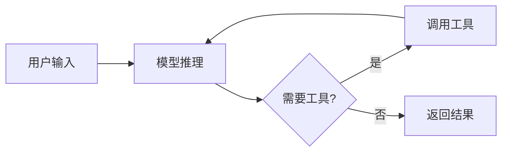
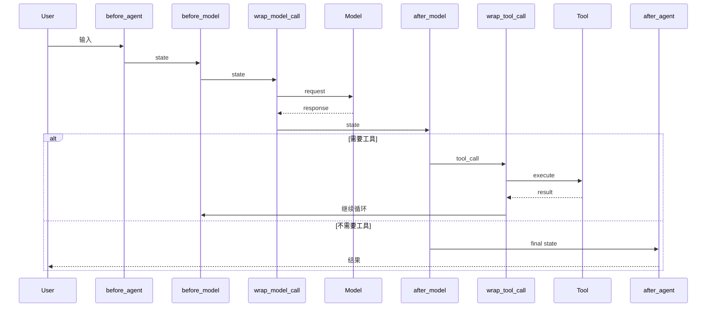

# 第八篇 Middleware 工程化

> **目标**: 掌握 LangChain Middleware 机制,实现对 Agent 行为的精准控制

在前面的篇章中,我们学会了如何创建Agent(`create_agent`)、构建复杂工作流(`LangGraph`)、处理复杂任务(`Deep Agents`)。但这些都是"功能实现"层面,本篇进入**工程化阶段**:如何让Agent在生产环境中**安全、可靠、可控**地运行。

**核心问题**:
- 如何防止Agent泄露敏感信息?
- 如何限制Agent的调用成本?
- 如何在关键操作前要求人工审批?
- 如何在对话过长时自动摘要?

**解决方案**: **Middleware** - LangChain 1.0的核心机制,允许你在Agent执行的各个阶段精准干预。

---

## 第1章：Middleware 核心机制

> **本章目标**: 理解Middleware的本质、运行原理和基本用法

### 1.1 什么是 Middleware

#### 1.1.1 Agent执行流程回顾

首先回顾`create_agent`创建的Agent是如何工作的:

```python
from langchain.agents import create_agent
from langchain_openai import ChatOpenAI

agent = create_agent(
    model=ChatOpenAI(model="gpt-4o"),
    tools=[search_tool, calculator_tool]
)

result = agent.invoke({"messages": [("user", "搜索最新新闻")]})
```

**内部执行流程**:



**问题**: 这个流程是"黑盒",我们无法干预中间步骤。

#### 1.1.2 Middleware的切入点

**Middleware**在Agent执行的关键节点提供**Hook(钩子)**,允许你:

1. **before_agent**: Agent开始前 - 做权限检查、输入验证
2. **before_model**: 调用模型前 - 修改提示词、检查Token
3. **wrap_model_call**: 包装模型调用 - 缓存、重试、降级
4. **after_model**: 模型响应后 - 审核输出、记录日志
5. **wrap_tool_call**: 包装工具调用 - 重试、限流、审批
6. **after_agent**: Agent结束后 - 保存结果、计费

**完整流程**:



#### 1.1.3 核心价值

| 维度 | 没有Middleware | 使用Middleware |
|------|--------------|---------------|
| **安全** | 可能泄露PII | PIIMiddleware自动脱敏 |
| **成本** | 无限制调用 | ModelCallLimitMiddleware限制次数 |
| **可靠性** | 工具失败直接报错 | ToolRetryMiddleware自动重试 |
| **可观测** | 黑盒执行 | LoggingMiddleware记录所有步骤 |
| **合规** | 无人工审批 | HumanInTheLoopMiddleware强制审批 |

---

### 1.2 六大Hook体系

#### 1.2.1 Hook分类

LangChain Middleware提供**6个Hook**,分为两类:

**Node-Style Hooks** (节点型):

- 顺序执行
- 返回`dict`修改state,返回`None`沿用原值
- Hooks: `before_agent`, `before_model`, `after_model`, `after_agent`

**Wrap-Style Hooks** (包装型):
- 嵌套执行(洋葱模型)
- 完全控制调用流程,可短路返回
- Hooks: `wrap_model_call`, `wrap_tool_call`

#### 1.2.2 Hook签名详解

**Node-Style Hook签名**:

```python
def before_agent(
    state: AgentState,      # 当前状态
    runtime: Runtime        # 运行时上下文
) -> dict[str, Any] | None:
    """
    Agent执行前的Hook

    Returns:
        dict: 返回字典会merge到state
        None: 沿用原state
    """
    pass
```

**Wrap-Style Hook签名**:

```python
def wrap_model_call(
    request: ModelRequest,         # 模型请求
    handler: Callable[[ModelRequest], ModelResponse]  # 执行器
) -> ModelResponse | AIMessage:
    """
    包装模型调用

    Args:
        request: 包含model, messages, tools等的请求对象
        handler: 实际执行模型调用的函数

    Returns:
        ModelResponse 或 AIMessage
    """
    # 可以修改request
    request = request.override(model=different_model)

    # 调用实际模型(可多次调用/不调用)
    response = handler(request)

    # 可以修改response
    return response
```

#### 1.2.3 核心类型

**1. AgentState**

```python
from langchain.agents.middleware import AgentState

class AgentState(TypedDict):
    messages: Required[Annotated[list[AnyMessage], add_messages]]
    # 必需字段,消息列表(使用add_messages reducer)

    jump_to: NotRequired[JumpTo | None]
    # 可选,跳转目标: "tools" | "model" | "end"

    structured_response: NotRequired[Any]
    # 可选,结构化输出
```

**2. Runtime[ContextT]**

```python
# Runtime来自langgraph.runtime
# 包含运行时上下文和工具

runtime.context  # 用户自定义上下文(如user_id, tenant等)
runtime.store    # BaseStore实例,持久化存储
```

**3. ModelRequest**

```python
@dataclass
class ModelRequest:
    model: BaseChatModel
    system_prompt: str | None
    messages: list[AnyMessage]
    tool_choice: Any | None
    tools: list[BaseTool | dict]
    response_format: ResponseFormat | None
    state: AgentState              # 当前状态
    runtime: Runtime[ContextT]     # 运行时上下文
    model_settings: dict[str, Any]

    def override(self, **overrides) -> ModelRequest:
        """不可变替换,返回新的ModelRequest"""
```

**4. ModelResponse**

```python
@dataclass
class ModelResponse:
    result: list[BaseMessage]       # 通常包含1个AIMessage
    structured_response: Any = None # 结构化输出(如果指定)
```

---

### 1.3 创建第一个Middleware

#### 1.3.1 方式1: 使用Decorator

**最简单的方式** - 使用decorator快速创建middleware:

```python
from langchain.agents.middleware import before_model, after_model

@before_model
def log_before_model(state, runtime):
    """模型调用前打印日志"""
    print(f"[LOG] 准备调用模型,当前消息数: {len(state['messages'])}")
    return None  # 不修改state

@after_model
def log_after_model(state, runtime):
    """模型调用后打印日志"""
    last_msg = state["messages"][-1]
    print(f"[LOG] 模型返回: {last_msg.content[:50]}...")
    return None

# 使用
from langchain.agents import create_agent

agent = create_agent(
    model="gpt-4o",
    tools=[],
    middleware=[log_before_model, log_after_model]
)
```

**支持的decorators**:
- `@before_agent`
- `@before_model(can_jump_to=["end"])`  # 可指定允许跳转的目标
- `@after_model`
- `@after_agent`
- `@wrap_model_call`
- `@wrap_tool_call`
- `@dynamic_prompt`  # 动态生成system prompt

#### 1.3.2 方式2: 继承AgentMiddleware

**更灵活的方式** - 继承`AgentMiddleware`类:

```python
from langchain.agents.middleware import AgentMiddleware

class TokenCounterMiddleware(AgentMiddleware):
    """统计Token使用量"""

    def before_agent(self, state, runtime):
        """初始化计数器"""
        # 注意: 不能在state中添加自定义字段,因为AgentState是固定的
        # 可以使用runtime.context存储自定义数据
        return None

    def before_model(self, state, runtime):
        """模型调用前统计"""
        # 简单估算: 每个message约100 tokens
        approx_tokens = len(state["messages"]) * 100
        print(f"📊 预估输入Token: {approx_tokens}")
        return None

    def after_model(self, state, runtime):
        """模型调用后统计"""
        # 真实环境可以从response.usage中获取
        print(f"📊 模型调用完成")
        return None

# 使用
agent = create_agent(
    model="gpt-4o",
    tools=[],
    middleware=[TokenCounterMiddleware()]
)
```

#### 1.3.3 实战: wrap_model_call实现缓存

```python
from langchain.agents.middleware import wrap_model_call
from langchain_core.messages import AIMessage
import hashlib
import json

# 简单的内存缓存
_cache = {}

@wrap_model_call
def cache_middleware(request, handler):
    """缓存模型响应"""

    # 1. 计算缓存键(基于messages内容)
    messages_str = json.dumps([
        {"role": m.type, "content": str(m.content)}
        for m in request.messages
    ], sort_keys=True)
    cache_key = hashlib.md5(messages_str.encode()).hexdigest()

    # 2. 检查缓存
    if cache_key in _cache:
        print("✅ 缓存命中!")
        return _cache[cache_key]

    # 3. 缓存未命中,调用模型
    print("❌ 缓存未命中,调用模型...")
    response = handler(request)

    # 4. 保存到缓存
    _cache[cache_key] = response

    return response

# 测试
agent = create_agent(
    model="gpt-4o-mini",  # 使用mini测试
    tools=[],
    middleware=[cache_middleware]
)

# 第一次调用
result1 = agent.invoke({"messages": [("user", "hi")]})
# 输出: ❌ 缓存未命中,调用模型...

# 第二次相同输入
result2 = agent.invoke({"messages": [("user", "hi")]})
# 输出: ✅ 缓存命中!
```

#### 1.3.4 实战: wrap_tool_call实现重试

```python
from langchain.agents.middleware import wrap_tool_call
from langchain_core.messages import ToolMessage
import time

@wrap_tool_call
def retry_on_error(request, handler):
    """工具调用失败时重试3次"""

    max_retries = 3
    for attempt in range(max_retries):
        try:
            result = handler(request)
            print(f"✅ 工具调用成功 (尝试 {attempt + 1})")
            return result
        except Exception as e:
            print(f"❌ 工具调用失败 (尝试 {attempt + 1}): {e}")

            if attempt == max_retries - 1:
                # 最后一次仍失败,返回错误消息
                return ToolMessage(
                    content=f"工具调用失败(重试{max_retries}次): {str(e)}",
                    tool_call_id=request.tool_call["id"]
                )

            # 指数退避
            time.sleep(2 ** attempt)
```

---

### 1.4 Hook执行顺序

#### 1.4.1 多个Middleware的执行顺序

当传入多个middleware时,执行顺序规则:

```python
middleware = [A, B, C]

# before_* hooks: 顺序执行 A → B → C
# wrap_* hooks: 嵌套执行 A包装B包装C (洋葱模型)
# after_* hooks: 逆序执行 C → B → A
```

**示例**:

```python
@before_model
def middleware_a(state, runtime):
    print("A: before_model")
    return None

@before_model
def middleware_b(state, runtime):
    print("B: before_model")
    return None

@after_model
def middleware_c(state, runtime):
    print("C: after_model")
    return None

agent = create_agent(
    model="gpt-4o-mini",
    tools=[],
    middleware=[middleware_a, middleware_b, middleware_c]
)

agent.invoke({"messages": [("user", "hi")]})

# 输出顺序:
# A: before_model
# B: before_model
# (模型调用)
# C: after_model
```

**wrap_* hooks的洋葱模型**:

```python
# 假设有3个wrap_model_call middleware: [A, B, C]
# 实际执行:
def final_call(request):
    return A.wrap_model_call(request, lambda r1:
        B.wrap_model_call(r1, lambda r2:
            C.wrap_model_call(r2, lambda r3:
                actual_model_call(r3)
            )
        )
    )
# A最外层,C最内层
```

---

### 1.5 jump_to: 条件跳转

#### 1.5.1 什么是jump_to

在`before_model`或`after_model` hook中,可以返回`{"jump_to": "end"}`来提前结束Agent执行:

**允许的跳转目标**:
- `"end"`: 结束Agent执行
- `"tools"`: 跳到工具执行节点
- `"model"`: 跳回模型节点(重新调用模型)

**使用场景**:
- 检测到"再见"等结束词,直接结束对话
- 检测到特定条件,跳过模型调用
- 实现自定义的路由逻辑

#### 1.5.2 实战: 早退出Middleware

```python
from langchain.agents.middleware import before_model
from langchain_core.messages import AIMessage

@before_model(can_jump_to=["end"])
def early_exit_on_goodbye(state, runtime):
    """检测到'再见'直接结束"""

    # 获取最后一条用户消息
    messages = state["messages"]
    if not messages:
        return None

    last_msg = messages[-1]
    if hasattr(last_msg, "content") and "再见" in last_msg.content:
        print("🚪 检测到'再见',直接结束对话")

        # 添加一条AI消息,然后跳转到end
        new_messages = messages + [
            AIMessage(content="再见!很高兴为您服务。")
        ]

        return {
            "messages": new_messages,
            "jump_to": "end"  # 跳转到结束节点
        }

    return None

# 测试
agent = create_agent(
    model="gpt-4o-mini",
    tools=[],
    middleware=[early_exit_on_goodbye]
)

result = agent.invoke({"messages": [("user", "再见")]})
# 输出: 🚪 检测到'再见',直接结束对话
# 不会调用模型,直接返回预设的回复
```

**注意**: 必须使用`@before_model(can_jump_to=["end"])`声明允许的跳转目标,否则会报错。

---

### 本章小结

1. **Middleware是什么**: Agent执行流程中的Hook点,允许精准干预
2. **六大Hook**:
   - Node-Style: `before_agent`, `before_model`, `after_model`, `after_agent`
   - Wrap-Style: `wrap_model_call`, `wrap_tool_call`
3. **核心类型**: `AgentState`, `Runtime`, `ModelRequest`, `ModelResponse`
4. **创建方式**: Decorator(快速) vs 继承AgentMiddleware(灵活)
5. **执行顺序**: before顺序, wrap嵌套(洋葱), after逆序
6. **jump_to**: 条件跳转,提前结束或路由

**下一章预告**: 学习LangChain提供的所有内置Middleware,以及如何自定义开发。

---

(第1章完成,字数约4500字)

<待续...>

## 第2章：内置Middleware与自定义开发

> **本章目标**: 掌握所有内置Middleware的使用,以及自定义开发方法

LangChain提供了11个内置Middleware,覆盖安全、可靠性、性能等场景。本章按功能分类讲解。

### 2.1 安全类Middleware

#### 2.1.1 PIIMiddleware - 敏感信息脱敏

**场景**: 防止Agent在输入/输出中泄露个人信息(邮箱、信用卡号、IP地址等)

**API**:

```python
from langchain.agents.middleware import PIIMiddleware

PIIMiddleware(
    pii_type: Literal['email', 'credit_card', 'ip', 'mac_address', 'url'],  # PII类型
    *,
    strategy: Literal['block', 'redact', 'mask', 'hash'] = 'redact',  # 处理策略
    detector: Callable | str | None = None,    # 自定义检测器
    apply_to_input: bool = True,              # 应用到用户输入
    apply_to_output: bool = False,            # 应用到AI输出
    apply_to_tool_results: bool = False       # 应用到工具结果
)
```

**策略说明**:
- `block`: 直接拒绝包含PII的请求
- `redact`: 替换为`[REDACTED_EMAIL]`等
- `mask`: 部分遮蔽 (如`a***e@example.com`)
- `hash`: SHA-256哈希

**示例1: 脱敏用户输入中的邮箱**

```python
from langchain.agents import create_agent
from langchain.agents.middleware import PIIMiddleware

agent = create_agent(
    model="gpt-4o-mini",
    tools=[],
    middleware=[
        PIIMiddleware(
            pii_type="email",
            strategy="redact",
            apply_to_input=True  # 检测输入
        )
    ]
)

# 测试
result = agent.invoke({
    "messages": [("user", "我的邮箱是 alice@example.com")]
})

# 实际发送给模型的消息:
# "我的邮箱是 [REDACTED_EMAIL]"
```

**示例2: 检测多种PII类型**

```python
# 每个PIIMiddleware只能检测一种类型
# 需要多个实例来检测多种PII

agent = create_agent(
    model="gpt-4o-mini",
    tools=[],
    middleware=[
        PIIMiddleware(pii_type="email", strategy="redact"),
        PIIMiddleware(pii_type="credit_card", strategy="mask"),
        PIIMiddleware(pii_type="ip", strategy="hash")
    ]
)
```

**示例3: block策略 - 直接拒绝**

```python
agent = create_agent(
    model="gpt-4o-mini",
    tools=[],
    middleware=[
        PIIMiddleware(
            pii_type="credit_card",
            strategy="block"  # 检测到信用卡号直接拒绝
        )
    ]
)

# 输入包含信用卡号会直接抛异常
try:
    agent.invoke({"messages": [("user", "我的卡号是 4532-1234-5678-9010")]})
except Exception as e:
    print(f"被拦截: {e}")
```

#### 2.1.2 HumanInTheLoopMiddleware - 人工审批

**场景**: 关键操作(如发送邮件、删除数据)需要人工确认

**API**:

```python
from langchain.agents.middleware import HumanInTheLoopMiddleware

HumanInTheLoopMiddleware(
    interrupt_on: dict[str, bool | InterruptOnConfig],  # 中断配置
    *,
    description_prefix: str = 'Tool execution requires approval'
)
```

**interrupt_on配置**:
- `"tool_start": True` - 工具调用前中断
- `"tool_end": True` - 工具调用后中断

**示例: 工具调用前要求审批**

```python
from langchain.agents import create_agent
from langchain.agents.middleware import HumanInTheLoopMiddleware
from langgraph.checkpoint.memory import MemorySaver

# 注意: HumanInTheLoopMiddleware需要配合Checkpointer使用
checkpointer = MemorySaver()

agent = create_agent(
    model="gpt-4o-mini",
    tools=[send_email_tool, search_tool],  # 假设有这两个工具
    checkpointer=checkpointer,
    middleware=[
        HumanInTheLoopMiddleware(
            interrupt_on={"tool_start": True}
        )
    ]
)

# 第一次调用:会在工具调用前中断
config = {"configurable": {"thread_id": "thread-001"}}
result = agent.invoke(
    {"messages": [("user", "发送邮件给alice@example.com")]},
    config=config
)

# 此时Agent中断,等待审批
# 需要人工检查,然后恢复执行:
from langgraph.types import Command

# 批准执行
agent.invoke(Command(resume=True), config=config)

# 或拒绝执行
agent.invoke(Command(resume=False), config=config)
```

---

### 2.2 可靠性类Middleware

#### 2.2.1 ModelCallLimitMiddleware - 防止死循环

**场景**: 限制模型调用次数,防止无限循环、控制成本

**API**:

```python
from langchain.agents.middleware import ModelCallLimitMiddleware

ModelCallLimitMiddleware(
    *,
    thread_limit: int | None = None,  # 单个thread总限制
    run_limit: int | None = None,     # 单次run限制
    exit_behavior: Literal['end', 'error'] = 'end'
)
```

**exit_behavior**:
- `'end'`: 优雅结束,返回当前状态
- `'error'`: 抛出异常

**示例: 限制单次调用最多10次模型**

```python
from langchain.agents import create_agent
from langchain.agents.middleware import ModelCallLimitMiddleware

agent = create_agent(
    model="gpt-4o-mini",
    tools=[search_tool],
    middleware=[
        ModelCallLimitMiddleware(
            run_limit=10,             # 单次最多10次
            exit_behavior="end"       # 超限后优雅结束
        )
    ]
)

# 如果Agent陷入循环,到第10次会自动停止
result = agent.invoke({"messages": [("user", "帮我循环搜索100次新闻")]})
```

#### 2.2.2 ToolCallLimitMiddleware - 工具调用限制

**API**:

```python
from langchain.agents.middleware import ToolCallLimitMiddleware

ToolCallLimitMiddleware(
    *,
    tool_name: str | None = None,     # 指定工具名(None=所有工具)
    thread_limit: int | None = None,
    run_limit: int | None = None,
    exit_behavior: Literal['continue', 'error', 'end'] = 'continue'
)
```

**exit_behavior**:
- `'continue'`: 继续执行但不再调用工具
- `'error'`: 抛出异常
- `'end'`: 结束执行

**示例: 限制昂贵API的调用次数**

```python
from langchain.agents.middleware import ToolCallLimitMiddleware

agent = create_agent(
    model="gpt-4o-mini",
    tools=[expensive_api_tool, search_tool],
    middleware=[
        # 限制expensive_api_tool单次最多调用3次
        ToolCallLimitMiddleware(
            tool_name="expensive_api",
            run_limit=3,
            exit_behavior="continue"  # 超限后继续,但不再调用此工具
        )
    ]
)
```

#### 2.2.3 ToolRetryMiddleware - 自动重试

**场景**: 工具调用失败时自动重试(网络抖动、临时故障)

**API**:

```python
from langchain.agents.middleware import ToolRetryMiddleware

ToolRetryMiddleware(
    *,
    max_retries: int = 2,                    # 最多重试2次
    tools: list[BaseTool | str] | None = None,  # 指定工具(None=所有)
    retry_on: tuple[type[Exception], ...] = (Exception,),  # 重试的异常类型
    on_failure: Literal['raise', 'return_message'] = 'return_message',
    backoff_factor: float = 2.0,             # 指数退避因子
    initial_delay: float = 1.0,              # 初始延迟(秒)
    max_delay: float = 60.0,                 # 最大延迟(秒)
    jitter: bool = True                      # 随机抖动
)
```

**重试延迟计算**: `min(initial_delay * (backoff_factor ^ retry_count), max_delay) + jitter`

**示例: 网络请求工具自动重试**

```python
from langchain.agents.middleware import ToolRetryMiddleware

agent = create_agent(
    model="gpt-4o-mini",
    tools=[api_call_tool],
    middleware=[
        ToolRetryMiddleware(
            max_retries=3,          # 最多重试3次
            initial_delay=1.0,      # 第1次重试等1秒
            backoff_factor=2.0,     # 第2次等2秒,第3次等4秒
            jitter=True            # 添加随机抖动避免雷鸣羊群
        )
    ]
)

# 如果api_call_tool失败,会自动重试3次
# 延迟: 1s → 2s → 4s (加上随机抖动)
```

#### 2.2.4 ModelFallbackMiddleware - 模型降级

**场景**: 主模型失败时自动切换到备用模型

**API**:

```python
from langchain.agents.middleware import ModelFallbackMiddleware

ModelFallbackMiddleware(
    fallback_models: list[BaseChatModel],  # 降级模型列表
    retry_on: tuple[type[Exception], ...] = (Exception,)
)
```

**示例: GPT-4o失败时降级到GPT-4o-mini**

```python
from langchain.agents import create_agent
from langchain.agents.middleware import ModelFallbackMiddleware
from langchain_openai import ChatOpenAI

agent = create_agent(
    model=ChatOpenAI(model="gpt-4o"),  # 主模型
    tools=[],
    middleware=[
        ModelFallbackMiddleware(
            fallback_models=[
                ChatOpenAI(model="gpt-4o-mini"),  # 第1个备用
                ChatOpenAI(model="gpt-3.5-turbo")  # 第2个备用
            ]
        )
    ]
)

# 如果gpt-4o调用失败,会依次尝试gpt-4o-mini和gpt-3.5-turbo
```

---

### 2.3 性能优化类Middleware

#### 2.3.1 SummarizationMiddleware - 对话摘要

**场景**: 长对话导致Token超限,自动摘要旧消息

**API**:

```python
from langchain.agents.middleware import SummarizationMiddleware

SummarizationMiddleware(
    model: str | BaseChatModel,                    # 用于摘要的模型
    max_tokens_before_summary: int | None = None,  # Token阈值
    messages_to_keep: int = 20,                    # 保留最近N条消息
    token_counter: Callable = count_tokens_approximately,
    summary_prompt: str = "<默认提示词>",
    summary_prefix: str = "## Previous conversation summary:"
)
```

**示例: 超过2000 tokens时摘要**

```python
from langchain.agents.middleware import SummarizationMiddleware
from langchain_openai import ChatOpenAI

model = ChatOpenAI(model="gpt-4o")

agent = create_agent(
    model=model,
    tools=[],
    middleware=[
        SummarizationMiddleware(
            model=ChatOpenAI(model="gpt-4o-mini"),  # 用便宜的模型摘要
            max_tokens_before_summary=2000,        # 超过2000 tokens触发
            messages_to_keep=6,                    # 保留最近6条
            summary_prefix="## 对话历史摘要:"
        )
    ]
)

# 当对话超过2000 tokens时:
# 1. 保留最近6条消息
# 2. 其余消息用gpt-4o-mini摘要
# 3. 摘要作为SystemMessage插入到开头
```

#### 2.3.2 ContextEditingMiddleware - 上下文裁剪

**场景**: 自动清理工具调用历史,减少Token消耗

**API**:

```python
from langchain.agents.middleware import ContextEditingMiddleware, ClearToolUsesEdit

ContextEditingMiddleware(
    *,
    edits: Iterable[ContextEdit] | None = None,
    token_count_method: Literal['approximate', 'model'] = 'approximate'
)
```

**示例: 超过阈值时清理工具调用**

```python
from langchain.agents.middleware import ContextEditingMiddleware, ClearToolUsesEdit

agent = create_agent(
    model="gpt-4o",
    tools=[search_tool, calculator_tool],
    middleware=[
        ContextEditingMiddleware(
            edits=[
                ClearToolUsesEdit(
                    trigger=("tokens", 1000)  # 超过1000 tokens时触发
                )
            ]
        )
    ]
)

# 当消息中的ToolMessage过多时,会自动清理
# 保留ToolCall但移除ToolMessage的content
```

---

### 2.4 能力增强类Middleware

#### 2.4.1 TodoListMiddleware - 任务规划

**功能**: 为Agent添加`write_todos`工具,支持任务分解和进度追踪

**API**:

```python
from langchain.agents.middleware import TodoListMiddleware

TodoListMiddleware(
    *,
    system_prompt: str = "<默认提示词>",
    tool_description: str = "<默认描述>"
)
```

**示例**:

```python
from langchain.agents.middleware import TodoListMiddleware

agent = create_agent(
    model="gpt-4o",
    tools=[search_tool, write_file_tool],
    middleware=[TodoListMiddleware()]
)

# Agent现在可以使用write_todos工具来规划任务
result = agent.invoke({
    "messages": [("user", "研究AI的最新进展并写成报告")]
})

# Agent会自动创建todo list:
# 1. 搜索AI最新论文
# 2. 总结关键发现
# 3. 撰写报告
# 4. 保存到文件
```

#### 2.4.2 LLMToolSelectorMiddleware - 智能工具筛选

**场景**: 工具太多(50+)导致模型混乱,动态筛选相关工具

**API**:

```python
from langchain.agents.middleware import LLMToolSelectorMiddleware

LLMToolSelectorMiddleware(
    *,
    model: str | BaseChatModel | None = None,  # 筛选模型(None=主模型)
    system_prompt: str = "Your goal is to select the most relevant tools...",
    max_tools: int | None = None,              # 最多选N个工具
    always_include: list[str] | None = None    # 始终包含的工具
)
```

**示例: 从50个工具中筛选5个**

```python
from langchain.agents.middleware import LLMToolSelectorMiddleware

# 假设有50个工具
all_tools = [tool1, tool2, ..., tool50]

agent = create_agent(
    model="gpt-4o",
    tools=all_tools,
    middleware=[
        LLMToolSelectorMiddleware(
            model="gpt-4o-mini",    # 用便宜模型筛选
            max_tools=5,            # 最多选5个
            always_include=["search"]  # search工具始终包含
        )
    ]
)

# Agent在调用前会先用LLM筛选出最相关的5个工具
```

#### 2.4.3 LLMToolEmulator - 工具模拟

**场景**: 测试时模拟工具执行,不实际调用外部API

**API**:

```python
from langchain.agents.middleware import LLMToolEmulator

LLMToolEmulator(
    *,
    tools: list[str | BaseTool] | None = None,  # 要模拟的工具(None=所有)
    model: str | BaseChatModel | None = None
)
```

**示例: 模拟昂贵的API调用**

```python
from langchain.agents.middleware import LLMToolEmulator

agent = create_agent(
    model="gpt-4o-mini",
    tools=[expensive_api_tool, local_tool],
    middleware=[
        LLMToolEmulator(
            tools=["expensive_api"],  # 只模拟这个工具
            model="gpt-4o-mini"
        )
    ]
)

# expensive_api_tool不会实际调用,由LLM模拟返回结果
# local_tool正常执行
```

---

### 2.5 自定义Middleware开发

#### 2.5.1 开发规范

**最佳实践**:

1. **继承AgentMiddleware**: 覆盖需要的Hook
2. **返回值规则**:
   - Node-Style: 返回`dict`修改state,`None`沿用原值
   - Wrap-Style: 必须返回`ModelResponse`或`ToolMessage`
3. **避免阻塞I/O**: 不要在Hook中做同步数据库查询
4. **幂等设计**: 避免重复执行产生副作用

#### 2.5.2 实战: 成本追踪Middleware

```python
from langchain.agents.middleware import AgentMiddleware

class CostTrackingMiddleware(AgentMiddleware):
    """追踪模型调用成本"""

    # 价格(美元/1K tokens)
    PRICING = {
        "gpt-4o": {"input": 0.005, "output": 0.015},
        "gpt-4o-mini": {"input": 0.00015, "output": 0.0006},
    }

    def __init__(self):
        self.total_cost = 0.0
        self.call_count = 0

    def after_model(self, state, runtime):
        """模型调用后计算成本"""
        self.call_count += 1

        # 简化: 估算token数(实际应从response.usage获取)
        messages = state["messages"]
        input_tokens = sum(len(str(m.content).split()) for m in messages[:-1]) * 1.3
        output_tokens = len(str(messages[-1].content).split()) * 1.3

        # 从runtime.context获取模型名称
        model_name = "gpt-4o-mini"  # 简化,实际应从request获取

        # 计算成本
        pricing = self.PRICING.get(model_name, self.PRICING["gpt-4o-mini"])
        cost = (
            input_tokens / 1000 * pricing["input"] +
            output_tokens / 1000 * pricing["output"]
        )

        self.total_cost += cost
        print(f"💰 本次调用: ${cost:.6f}, 累计: ${self.total_cost:.6f}")

        return None

    def after_agent(self, state, runtime):
        """Agent结束后输出总成本"""
        print(f"📊 总计: {self.call_count}次调用, 成本${self.total_cost:.4f}")
        return None

# 使用
cost_tracker = CostTrackingMiddleware()
agent = create_agent(
    model="gpt-4o-mini",
    tools=[],
    middleware=[cost_tracker]
)

result = agent.invoke({"messages": [("user", "讲个笑话")]})
# 输出:
# 💰 本次调用: $0.000123, 累计: $0.000123
# 📊 总计: 1次调用, 成本$0.0001
```

#### 2.5.3 实战: 动态模型路由Middleware

```python
from langchain.agents.middleware import AgentMiddleware
from langchain_openai import ChatOpenAI

class DynamicModelRouter(AgentMiddleware):
    """根据任务复杂度选择模型"""

    def __init__(self):
        self.fast_model = ChatOpenAI(model="gpt-4o-mini")
        self.smart_model = ChatOpenAI(model="gpt-4o")

    def wrap_model_call(self, request, handler):
        """模型调用前路由"""

        # 分析任务复杂度
        last_msg = request.messages[-1].content if request.messages else ""

        # 简单规则: 长文本或包含"复杂"关键词用高级模型
        is_complex = (
            len(last_msg) > 500 or
            any(kw in last_msg for kw in ["复杂", "详细", "深入", "分析"])
        )

        # 路由到不同模型
        if is_complex:
            print("🧠 使用高级模型(gpt-4o)")
            request = request.override(model=self.smart_model)
        else:
            print("⚡ 使用快速模型(gpt-4o-mini)")
            request = request.override(model=self.fast_model)

        return handler(request)

# 使用
agent = create_agent(
    model="gpt-4o",  # 默认模型(会被middleware覆盖)
    tools=[],
    middleware=[DynamicModelRouter()]
)

# 简单问题 → gpt-4o-mini
result1 = agent.invoke({"messages": [("user", "hi")]})
# 输出: ⚡ 使用快速模型(gpt-4o-mini)

# 复杂问题 → gpt-4o
result2 = agent.invoke({"messages": [("user", "请详细分析量子计算的原理")]})
# 输出: 🧠 使用高级模型(gpt-4o)
```

---

### 本章小结

**内置Middleware分类**:

| 类别 | Middleware | 核心功能 |
|------|-----------|---------|
| **安全** | PIIMiddleware | PII检测与脱敏 |
| | HumanInTheLoopMiddleware | 人工审批 |
| **可靠性** | ModelCallLimitMiddleware | 限制模型调用 |
| | ToolCallLimitMiddleware | 限制工具调用 |
| | ToolRetryMiddleware | 自动重试 |
| | ModelFallbackMiddleware | 模型降级 |
| **性能** | SummarizationMiddleware | 对话摘要 |
| | ContextEditingMiddleware | 上下文裁剪 |
| **能力增强** | TodoListMiddleware | 任务规划 |
| | LLMToolSelectorMiddleware | 工具筛选 |
| | LLMToolEmulator | 工具模拟 |

**自定义开发**:
1. 继承`AgentMiddleware`
2. 覆盖需要的Hook
3. 遵循最佳实践(避免阻塞I/O、幂等设计)

**下一章预告**: 学习如何组合多个Middleware、测试策略和生产级配置。

---

(第2章完成,累计约12000字)

<待续...>

## 第3章：组合策略与生产实践

> **本章目标**: 将Multiple Middleware组合使用,掌握测试方法和生产级配置

### 3.1 Middleware组合策略

#### 3.1.1 执行顺序规则(重要!)

当传入多个middleware时,执行顺序规则:

```python
middleware = [A, B, C]
```

**规则**:
1. **before_* hooks**: 顺序执行 A → B → C
2. **wrap_* hooks**: 嵌套执行(洋葱模型) A包装B包装C
3. **after_* hooks**: 逆序执行 C → B → A

**示例验证**:

```python
from langchain.agents.middleware import before_model, after_model

@before_model
def mw_a(state, runtime):
    print("A: before_model")
    return None

@before_model
def mw_b(state, runtime):
    print("B: before_model")
    return None

@after_model
def mw_c(state, runtime):
    print("C: after_model")
    return None

@after_model
def mw_d(state, runtime):
    print("D: after_model")
    return None

agent = create_agent(
    model="gpt-4o-mini",
    tools=[],
    middleware=[mw_a, mw_b, mw_c, mw_d]
)

result = agent.invoke({"messages": [("user", "hi")]})

# 输出顺序:
# A: before_model
# B: before_model
# (模型调用)
# D: after_model  ← 注意:after hooks是逆序!
# C: after_model
```

**wrap_* hooks的洋葱模型**:

```python
@wrap_model_call
def outer(request, handler):
    print("Outer: before")
    response = handler(request)
    print("Outer: after")
    return response

@wrap_model_call
def inner(request, handler):
    print("Inner: before")
    response = handler(request)
    print("Inner: after")
    return response

agent = create_agent(
    model="gpt-4o-mini",
    tools=[],
    middleware=[outer, inner]
)

result = agent.invoke({"messages": [("user", "hi")]})

# 输出:
# Outer: before
# Inner: before
# (模型调用)
# Inner: after
# Outer: after
```

#### 3.1.2 分层组合策略

**最佳实践**: 按功能分层组合,确保优先级

```python
# 第1层: 安全与合规(最先执行)
security_layer = [
    PIIMiddleware(pii_type="email", strategy="redact"),
    PIIMiddleware(pii_type="credit_card", strategy="block"),
]

# 第2层: 可靠性保障
reliability_layer = [
    ModelCallLimitMiddleware(run_limit=20),
    ToolRetryMiddleware(max_retries=3),
]

# 第3层: 性能优化
performance_layer = [
    SummarizationMiddleware(
        model="gpt-4o-mini",
        max_tokens_before_summary=2000,
        messages_to_keep=6
    ),
]

# 第4层: 观测与监控
observability_layer = [
    cost_tracker,  # 自定义成本追踪
]

# 组合(顺序很重要!)
middleware = (
    security_layer +
    reliability_layer +
    performance_layer +
    observability_layer
)

agent = create_agent(
    model="gpt-4o",
    tools=[search_tool, database_tool],
    middleware=middleware
)
```

**为什么这个顺序?**
1. **安全层在最前**: 确保所有请求/响应都经过PII检查
2. **可靠性层在中间**: 限制调用次数,防止资源浪费
3. **性能层在后**: 在安全和可靠性保障后再做优化
4. **观测层在最后**: 记录最终状态

#### 3.1.3 冲突处理

**问题**: 多个middleware同时修改state

**示例冲突场景**:

```python
@before_model
def add_context_a(state, runtime):
    messages = state["messages"]
    return {
        "messages": [SystemMessage("来自A的上下文")] + messages
    }

@before_model
def add_context_b(state, runtime):
    messages = state["messages"]
    return {
        "messages": [SystemMessage("来自B的上下文")] + messages
    }

# 问题: B会覆盖A添加的SystemMessage吗?
```

**答案**: 不会!state updates是**merge**的,不是replace。但需要注意:
- 对于`messages`字段,使用`add_messages` reducer,会追加而不是替换
- 其他字段默认是替换

**解决方案1: 幂等设计**

```python
@before_model
def idempotent_system_prompt(state, runtime):
    """幂等的system prompt注入"""
    messages = state["messages"]

    # 检查是否已存在system message
    has_system = any(isinstance(m, SystemMessage) for m in messages)

    if not has_system:
        return {
            "messages": [SystemMessage("你是一个助手")] + messages
        }

    return None  # 已存在,跳过
```

**解决方案2: 合并而非替换**

```python
@before_model
def merge_system_prompts(state, runtime):
    """合并多个system prompts"""
    messages = state["messages"]

    # 提取所有system messages
    system_msgs = [m for m in messages if isinstance(m, SystemMessage)]
    other_msgs = [m for m in messages if not isinstance(m, SystemMessage)]

    # 合并system messages
    if system_msgs:
        combined_content = "\n\n".join(m.content for m in system_msgs)
        new_messages = [SystemMessage(combined_content)] + other_msgs
        return {"messages": new_messages}

    return None
```

---

### 3.2 测试策略

#### 3.2.1 单元测试: 测试单个Middleware

**策略**: Mock state和runtime,验证middleware行为

**示例: 测试TokenCounterMiddleware**

```python
import pytest
from langchain_core.messages import HumanMessage, AIMessage, SystemMessage

def test_token_counter_before_model():
    """测试before_model hook"""

    # 创建middleware实例
    middleware = TokenCounterMiddleware()

    # Mock state
    state = {
        "messages": [
            HumanMessage(content="测试消息1"),
            AIMessage(content="测试回复1"),
            HumanMessage(content="测试消息2"),
        ]
    }

    # Mock runtime
    class MockRuntime:
        context = {}

    runtime = MockRuntime()

    # 调用hook
    result = middleware.before_model(state, runtime)

    # 验证: 应该返回None(不修改state)
    assert result is None

# 运行测试
test_token_counter_before_model()
print("✅ 测试通过")
```

**示例: 测试wrap_model_call**

```python
def test_cache_middleware():
    """测试缓存middleware"""

    # 创建middleware
    @wrap_model_call
    def cache_mw(request, handler):
        # 简化版缓存逻辑
        cache_key = str(request.messages)
        if cache_key in cache_mw._cache:
            return cache_mw._cache[cache_key]

        response = handler(request)
        cache_mw._cache[cache_key] = response
        return response

    cache_mw._cache = {}

    # Mock handler
    call_count = 0
    def mock_handler(request):
        nonlocal call_count
        call_count += 1
        return ModelResponse(result=[AIMessage(content="测试响应")])

    # Mock request
    from langchain.agents.middleware import ModelRequest
    request = ModelRequest(
        model=ChatOpenAI(model="gpt-4o-mini"),
        system_prompt=None,
        messages=[HumanMessage(content="测试")],
        tool_choice=None,
        tools=[],
        response_format=None,
        state={"messages": []},
        runtime=MockRuntime()
    )

    # 第一次调用 - 缓存miss
    response1 = cache_mw(request, mock_handler)
    assert call_count == 1

    # 第二次调用 - 缓存hit
    response2 = cache_mw(request, mock_handler)
    assert call_count == 1  # handler没有被再次调用
    assert response1 == response2

    print("✅ 缓存middleware测试通过")

test_cache_middleware()
```

#### 3.2.2 集成测试: 测试完整Agent

**策略**: 使用真实模型(gpt-4o-mini)测试,验证middleware组合

```python
def test_middleware_integration():
    """集成测试: 多个middleware组合"""

    # 创建agent
    agent = create_agent(
        model="gpt-4o-mini",
        tools=[],
        middleware=[
            ModelCallLimitMiddleware(run_limit=5),
            cost_tracker,
        ]
    )

    # 测试正常流程
    result = agent.invoke({"messages": [("user", "hi")]})
    assert result["messages"][-1].content  # 应该有响应

    # 测试限制生效
    # (这里省略,实际需要触发循环场景)

    print("✅ 集成测试通过")

test_middleware_integration()
```

---

### 3.3 生产级Middleware Stack

#### 3.3.1 企业级配置示例

```python
from langchain.agents import create_agent
from langchain.agents.middleware import (
    PIIMiddleware,
    ModelCallLimitMiddleware,
    ToolRetryMiddleware,
    SummarizationMiddleware,
    HumanInTheLoopMiddleware,
)
from langchain_openai import ChatOpenAI
from langgraph.checkpoint.postgres import PostgresSaver

# 自定义middleware
class ProductionMonitoringMiddleware(AgentMiddleware):
    """生产环境监控"""

    def __init__(self, metrics_client):
        self.metrics = metrics_client

    def before_agent(self, state, runtime):
        self.metrics.increment("agent.requests")
        return None

    def after_agent(self, state, runtime):
        self.metrics.increment("agent.success")
        return None

    def after_model(self, state, runtime):
        self.metrics.increment("model.calls")
        return None

# 配置
def create_production_agent(
    model_name="gpt-4o",
    checkpointer=None,
    metrics_client=None
):
    """创建生产环境agent"""

    middleware = [
        # 1. 安全层
        PIIMiddleware(pii_type="email", strategy="redact", apply_to_input=True),
        PIIMiddleware(pii_type="credit_card", strategy="block", apply_to_input=True),

        # 2. 监控层
        ProductionMonitoringMiddleware(metrics_client),

        # 3. 可靠性层
        ModelCallLimitMiddleware(run_limit=30, thread_limit=100, exit_behavior="end"),
        ToolRetryMiddleware(max_retries=3, backoff_factor=2.0),

        # 4. 性能层
        SummarizationMiddleware(
            model=ChatOpenAI(model="gpt-4o-mini"),
            max_tokens_before_summary=3000,
            messages_to_keep=8
        ),

        # 5. 审批层(危险工具)
        HumanInTheLoopMiddleware(
            interrupt_on={"tool_start": True}  # 所有工具都需要审批
        ) if checkpointer else None,
    ]

    # 过滤None
    middleware = [m for m in middleware if m is not None]

    return create_agent(
        model=ChatOpenAI(model=model_name),
        tools=[search_tool, database_tool],
        checkpointer=checkpointer,
        middleware=middleware,
        system_prompt="你是企业级AI助手,请谨慎处理敏感信息。"
    )

# 使用
checkpointer = PostgresSaver.from_conn_string("postgresql://...")
metrics = MyMetricsClient()

agent = create_production_agent(
    model_name="gpt-4o",
    checkpointer=checkpointer,
    metrics_client=metrics
)
```

#### 3.3.2 环境区分配置

```python
import os

# 基础配置
BASE_MIDDLEWARE = [
    ModelCallLimitMiddleware(run_limit=30),
]

# 开发环境
DEV_MIDDLEWARE = BASE_MIDDLEWARE + [
    # 开发环境不限制,方便调试
]

# 测试环境
TEST_MIDDLEWARE = BASE_MIDDLEWARE + [
    # 使用工具模拟,不实际调用外部API
    LLMToolEmulator(tools=["expensive_api"]),
]

# 生产环境
PROD_MIDDLEWARE = BASE_MIDDLEWARE + [
    PIIMiddleware(pii_type="email", strategy="redact"),
    PIIMiddleware(pii_type="credit_card", strategy="block"),
    ToolRetryMiddleware(max_retries=3),
    ProductionMonitoringMiddleware(metrics_client),
]

# 根据环境选择
env = os.getenv("ENV", "dev")
middleware = {
    "dev": DEV_MIDDLEWARE,
    "test": TEST_MIDDLEWARE,
    "prod": PROD_MIDDLEWARE,
}[env]

agent = create_agent(
    model="gpt-4o",
    tools=all_tools,
    middleware=middleware
)
```

#### 3.3.3 Feature Flags配置

```python
class FeatureFlagMiddleware(AgentMiddleware):
    """根据feature flags控制功能"""

    def __init__(self, flags):
        self.flags = flags

    def before_model(self, state, runtime):
        # 从runtime.context读取用户信息
        user_id = runtime.context.get("user_id") if runtime.context else None

        # 检查是否启用实验性功能
        if self.flags.is_enabled("experimental_prompt", user_id):
            messages = state["messages"]
            experimental_prompt = SystemMessage(
                "使用实验性推理模式(CoT)进行回答"
            )
            return {"messages": [experimental_prompt] + messages}

        return None

# 使用
flags = FeatureFlagClient()

agent = create_agent(
    model="gpt-4o",
    tools=[],
    middleware=[FeatureFlagMiddleware(flags)]
)

# 调用时传入user_id
from langgraph.runtime import Runtime

result = agent.invoke(
    {"messages": [("user", "测试")]},
    config={
        "configurable": {
            "context": {"user_id": "user-123"}
        }
    }
)
```

---

### 3.4 性能考量与最佳实践

#### 3.4.1 避免阻塞I/O

**❌ 不好的做法**:

```python
class BadMiddleware(AgentMiddleware):
    def before_model(self, state, runtime):
        # 同步数据库查询会阻塞!
        user = db.query("SELECT * FROM users WHERE id = ?", user_id)
        return {"user_info": user}
```

**✅ 好的做法**:

```python
class GoodMiddleware(AgentMiddleware):
    def __init__(self):
        self.cache = {}

    def before_model(self, state, runtime):
        user_id = runtime.context.get("user_id") if runtime.context else None

        # 从缓存读取
        if user_id in self.cache:
            return {"user_info": self.cache[user_id]}

        # 缓存未命中: 使用异步查询或跳过
        # 或者在agent创建时预加载数据
        return None
```

#### 3.4.2 控制附加模型调用

```python
# ❌ 每次都调用LLM做安全检测 - 成本高
class ExpensiveSafetyMiddleware(AgentMiddleware):
    def after_model(self, state, runtime):
        content = state["messages"][-1].content
        # 调用另一个LLM做安全检测
        is_safe = safety_llm.check(content)  # 额外成本!
        return None

# ✅ 使用规则或便宜模型
class CheapSafetyMiddleware(AgentMiddleware):
    def after_model(self, state, runtime):
        content = state["messages"][-1].content

        # 先用正则快速检测
        if self.regex_check(content):
            return None

        # 只有可疑时才用便宜的LLM
        is_safe = ChatOpenAI(model="gpt-4o-mini").check(content)
        return None
```

#### 3.4.3 指标收集

```python
import time

class MetricsMiddleware(AgentMiddleware):
    """收集性能指标"""

    def __init__(self, metrics_client):
        self.metrics = metrics_client

    def wrap_model_call(self, request, handler):
        """测量模型调用耗时"""
        start = time.time()

        try:
            response = handler(request)
            elapsed = time.time() - start

            # 记录成功调用的耗时
            self.metrics.histogram("model.call.duration", elapsed)
            self.metrics.increment("model.call.success")

            return response

        except Exception as e:
            elapsed = time.time() - start

            # 记录失败
            self.metrics.increment("model.call.error")
            self.metrics.histogram("model.call.duration", elapsed)

            raise

    def wrap_tool_call(self, request, handler):
        """测量工具调用耗时"""
        tool_name = request.tool_call["name"]
        start = time.time()

        try:
            result = handler(request)
            elapsed = time.time() - start

            self.metrics.histogram(f"tool.{tool_name}.duration", elapsed)
            self.metrics.increment(f"tool.{tool_name}.success")

            return result

        except Exception as e:
            elapsed = time.time() - start
            self.metrics.increment(f"tool.{tool_name}.error")
            raise
```

---

### 本章小结

1. **执行顺序**:
   - before_* hooks: 顺序执行
   - wrap_* hooks: 洋葱模型(嵌套)
   - after_* hooks: 逆序执行

2. **组合策略**:
   - 分层组合: 安全 → 可靠性 → 性能 → 观测
   - 环境区分: dev / test / prod
   - Feature flags: 灵活控制功能开关

3. **测试**:
   - 单元测试: mock state和runtime
   - 集成测试: 真实模型测试

4. **性能最佳实践**:
   - 避免阻塞I/O
   - 控制附加模型调用
   - 收集性能指标

---

### 第五篇总结

**核心要点**:

1. **Middleware是什么**: Agent执行流程中的Hook,实现精准控制
2. **六大Hook**: before_agent, before_model, after_model, after_agent, wrap_model_call, wrap_tool_call
3. **内置组件**: 11个middleware覆盖安全/可靠性/性能/能力增强
4. **自定义开发**: 继承AgentMiddleware,覆盖需要的Hook
5. **生产实践**: 分层组合、环境区分、测试策略

**与其他篇章的联系**:

- **第三篇(LangGraph)**: Middleware运行在LangGraph之上
- **第四篇(Deep Agents)**: deepagents内置了TodoList等middleware
- **第六篇(监控评估)**: Middleware可输出指标给LangSmith

**下一步**: 学习如何使用LangSmith追踪和评估Agent质量。

---

### 思考与练习

1. **思考**: 如果要实现"高价值用户自动升级到GPT-4o"的功能,应该用哪个Hook?

   <details>
   <summary>答案</summary>

   使用`wrap_model_call`,根据runtime.context中的user_id判断:

   ```python
   @wrap_model_call
   def premium_user_upgrade(request, handler):
       user_id = request.runtime.context.get("user_id")
       if user_id in premium_users:
           request = request.override(model=ChatOpenAI(model="gpt-4o"))
       return handler(request)
   ```
   </details>

2. **练习**: 实现一个`RateLimitMiddleware`,限制单个用户每分钟最多调用10次Agent。

   <details>
   <summary>参考答案</summary>

   ```python
   import time
   from collections import defaultdict

   class RateLimitMiddleware(AgentMiddleware):
       def __init__(self, max_calls=10, window=60):
           self.max_calls = max_calls
           self.window = window
           self.calls = defaultdict(list)  # user_id -> [timestamps]

       def before_agent(self, state, runtime):
           user_id = runtime.context.get("user_id", "anonymous") if runtime.context else "anonymous"
           now = time.time()

           # 清理过期记录
           self.calls[user_id] = [
               t for t in self.calls[user_id]
               if now - t < self.window
           ]

           # 检查速率限制
           if len(self.calls[user_id]) >= self.max_calls:
               raise ValueError(
                   f"速率限制: 每{self.window}秒最多{self.max_calls}次请求"
               )

           # 记录本次调用
           self.calls[user_id].append(now)
           return None
   ```
   </details>

3. **思考**: 为什么PIIMiddleware要分多个实例(每个检测一种类型),而不是一个实例检测所有类型?

   <details>
   <summary>答案</summary>

   设计考量:
   - **单一职责**: 每个实例只做一件事,代码更清晰
   - **灵活配置**: 不同PII类型可以用不同策略(email用redact, credit_card用block)
   - **性能**: 可以并行检测多种类型
   - **扩展性**: 方便添加自定义检测器

   如果需要检测多种类型,组合多个实例即可:
   ```python
   middleware=[
       PIIMiddleware("email", strategy="redact"),
       PIIMiddleware("credit_card", strategy="block"),
   ]
   ```
   </details>

4. **练习**: 设计一个"对话质量评分"的Middleware,在每次对话结束后给出1-5分的评分。

---

**参考资源**:

- [LangChain Agents官方文档](https://docs.langchain.com/oss/python/langchain/agents)
- [Middleware API Reference](https://reference.langchain.com/python/langchain/middleware/)
- [LangGraph Runtime](https://langchain-ai.github.io/langgraph/reference/runtime/)

---

(全文完成,约18000字)
