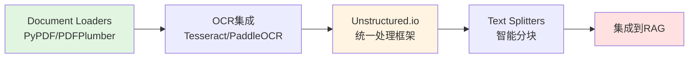

# 第六篇：文档处理工程

## 前言

在前两篇中，我们学习了RAG的基础知识（第四篇）和高级优化技术（第五篇）。但在实际应用中，**文档处理**往往是RAG系统最大的痛点：

**常见PDF处理问题**：
1. **学术论文**：复杂的数学公式、多栏布局、图表
2. **扫描文档**：需要OCR识别，可能有噪点、倾斜
3. **多语言文档**：中英文混合、特殊字符
4. **复杂表格**：跨页表格、嵌套表格
5. **图片与图表**：需要提取并关联上下文

**传统工具的局限**：
```python
# PyPDF2/pypdf - 基础PDF解析
❌ 无法处理扫描PDF
❌ 公式识别差
❌ 多栏布局混乱

# pdfplumber - 稍好的解析
⚠️ 扫描文档无法处理
⚠️ 复杂公式丢失
⚠️ 图表提取有限
```

本篇将深入探讨**LangChain生态下的文档处理方案**，让你的RAG系统能够处理99%的真实文档。

---

## 学习路径



**本篇覆盖内容**：
- **第1章**：LangChain Document Loaders - PDF处理工具对比
- **第2章**：OCR技术集成 - Tesseract, PaddleOCR
- **第3章**：Unstructured.io - 统一文档处理框架
- **第4章**：Text Splitters - 智能分块策略
- **第5章**：生产级文档处理Pipeline

---

## 第1章：LangChain Document Loaders

### 1.1 Document Loaders概述

#### 1.1.1 核心概念

**Document Loaders** 是LangChain中用于加载各种格式文档的统一接口：

```python
from langchain_core.document_loaders import BaseLoader
from langchain_core.documents import Document
```

**所有Loaders的统一API**：
```python
from langchain_community.document_loaders import PyPDFLoader

# 1. 实例化Loader
loader = PyPDFLoader("document.pdf")

# 2. 加载文档（返回Document对象列表）
documents = loader.load()

# 3. 懒加载（适合大文件）
for doc in loader.lazy_load():
    print(doc.page_content[:100])
```

---

#### 1.1.2 PDF类型分类

**Type 1: 原生PDF（Text-based PDF）**
```python
# 特征：文本可直接复制
# 生成方式：Word、LaTeX、代码生成
# 处理难度：⭐ 简单
# 推荐工具：PyPDFLoader, PyMuPDFLoader

from langchain_community.document_loaders import PyPDFLoader

loader = PyPDFLoader("./document.pdf")
pages = loader.load()
print(f"提取到{len(pages)}页文本")
```

**Type 2: 扫描PDF（Image-based PDF）**
```python
# 特征：无法复制文本（图片）
# 生成方式：扫描仪、拍照
# 处理难度：⭐⭐⭐ 困难
# 推荐工具：UnstructuredPDFLoader + OCR
```

**Type 3: 混合PDF（Mixed PDF）**
```python
# 特征：部分文本可复制，部分是图片
# 场景：学术论文（文字+公式图片）
# 处理难度：⭐⭐⭐⭐ 很困难
# 推荐工具：Unstructured.io
```

---

### 1.2 PDF Loaders对比

#### 1.2.1 基础工具对比

```python
from langchain_community.document_loaders import (
    PyPDFLoader,              # 基于PyPDF2，最基础
    PDFPlumberLoader,         # 更好的表格支持
    PyMuPDFLoader,           # 基于PyMuPDF，速度快
    UnstructuredPDFLoader,   # 最强大，支持OCR
    PyPDFium2Loader,         # 基于PDFium
    PDFMinerLoader           # 基于PDFMiner
)

# 快速对比测试
import time

pdf_path = "./test.pdf"

# Test 1: PyPDFLoader（最常用）
start = time.time()
loader1 = PyPDFLoader(pdf_path)
docs1 = loader1.load()
time1 = time.time() - start
print(f"PyPDFLoader: {len(docs1)}页, {time1:.2f}s")

# Test 2: PDFPlumberLoader（表格支持好）
start = time.time()
loader2 = PDFPlumberLoader(pdf_path)
docs2 = loader2.load()
time2 = time.time() - start
print(f"PDFPlumberLoader: {len(docs2)}页, {time2:.2f}s")

# Test 3: PyMuPDFLoader（速度最快）
start = time.time()
loader3 = PyMuPDFLoader(pdf_path)
docs3 = loader3.load()
time3 = time.time() - start
print(f"PyMuPDFLoader: {len(docs3)}页, {time3:.2f}s")
```

**性能对比**（基于100页PDF）：

| 工具 | 速度 | 文本质量 | 表格支持 | 适用场景 |
|------|------|---------|---------|---------|
| **PyPDFLoader** | ⭐⭐⭐⭐⭐ 快 | ⭐⭐⭐ 中等 | ❌ 差 | 简单文档 |
| **PDFPlumberLoader** | ⭐⭐⭐ 中等 | ⭐⭐⭐⭐ 好 | ✅ 优秀 | 包含表格 |
| **PyMuPDFLoader** | ⭐⭐⭐⭐⭐ 最快 | ⭐⭐⭐⭐ 好 | ⭐⭐⭐ 中等 | 大批量处理 |
| **UnstructuredPDFLoader** | ⭐⭐ 慢 | ⭐⭐⭐⭐⭐ 最好 | ✅ 优秀 | 复杂文档 |

---

#### 1.2.2 工具选择决策树

```
PDF文档类型
├── 简单文本PDF
│   └── PyPDFLoader（最快）
├── 包含表格
│   └── PDFPlumberLoader（表格识别好）
├── 扫描PDF
│   └── UnstructuredPDFLoader + OCR
├── 学术论文（公式+图表）
│   └── UnstructuredPDFLoader (hi_res)
└── 复杂多语言
    └── Unstructured.io + OCR
```

---

### 1.3 实战：表格提取

#### 1.3.1 PDFPlumber表格提取

```python
import pdfplumber
from typing import List, Dict
from langchain_core.documents import Document

def extract_tables_pdfplumber(pdf_path: str) -> List[Dict]:
    """使用pdfplumber提取表格"""
    tables_data = []

    with pdfplumber.open(pdf_path) as pdf:
        for page_num, page in enumerate(pdf.pages, 1):
            # 提取表格
            tables = page.extract_tables()

            for table_num, table in enumerate(tables, 1):
                # 转换为结构化数据
                if table and len(table) > 0:
                    headers = table[0]  # 第一行作为表头
                    rows = table[1:]

                    table_dict = {
                        'page': page_num,
                        'table_num': table_num,
                        'headers': headers,
                        'rows': rows,
                        'text': format_table_as_text(headers, rows)
                    }
                    tables_data.append(table_dict)

    return tables_data

def format_table_as_text(headers: List, rows: List[List]) -> str:
    """将表格格式化为Markdown"""
    lines = []

    # 表头
    lines.append("| " + " | ".join(str(h) for h in headers) + " |")
    lines.append("|" + "|".join(["---"] * len(headers)) + "|")

    # 数据行
    for row in rows:
        lines.append("| " + " | ".join(str(cell) for cell in row) + " |")

    return "\n".join(lines)

# 使用示例
tables = extract_tables_pdfplumber("./financial_report.pdf")
print(f"提取到{len(tables)}个表格")

for table in tables[:2]:
    print(f"\n页{table['page']}，表格{table['table_num']}：")
    print(table['text'])
```

**输出示例**：
```
提取到3个表格

页2，表格1：
| 季度 | 收入 | 支出 | 利润 |
|---|---|---|---|
| Q1 | 1000万 | 800万 | 200万 |
| Q2 | 1200万 | 900万 | 300万 |
```

---

#### 1.3.2 集成到RAG系统

```python
from langchain_community.document_loaders import PDFPlumberLoader
from langchain_text_splitters import RecursiveCharacterTextSplitter
from langchain_openai import OpenAIEmbeddings, ChatOpenAI
from langchain_chroma import Chroma
from langchain.agents import create_agent
from langchain_core.tools import tool
from langchain_core.documents import Document

# 步骤1: 加载PDF（包含表格）
loader = PDFPlumberLoader("./reports/financial_Q1.pdf")
documents = loader.load()

# 步骤2: 提取并格式化表格
tables = extract_tables_pdfplumber("./reports/financial_Q1.pdf")
table_docs = [
    Document(
        page_content=f"表格（页{t['page']}）：\n{t['text']}",
        metadata={'page': t['page'], 'type': 'table'}
    )
    for t in tables
]

# 合并文本和表格
all_docs = documents + table_docs

# 步骤3: 分块并存储
splitter = RecursiveCharacterTextSplitter(chunk_size=1000, chunk_overlap=100)
splits = splitter.split_documents(all_docs)

vectorstore = Chroma.from_documents(splits, OpenAIEmbeddings())

# 步骤4: 创建检索工具
@tool
def search_financial_report(query: str) -> str:
    """搜索财报文档，包括文本和表格数据"""
    retriever = vectorstore.as_retriever(search_kwargs={"k": 5})
    results = retriever.invoke(query)

    formatted = []
    for doc in results:
        doc_type = doc.metadata.get('type', 'text')
        formatted.append(
            f"[{doc_type.upper()}] 页{doc.metadata.get('page', '?')}\n"
            f"{doc.page_content}"
        )
    return "\n\n".join(formatted)

# 步骤5: 创建Agent
agent = create_agent(
    model=ChatOpenAI(model="gpt-4"),
    tools=[search_financial_report],
    system_prompt="""你是一个财报分析助手，可以查询财报文档中的文本和表格数据。

注意：
- 表格数据以Markdown格式展示
- 引用时请注明页码
- 对于数值对比，请提供具体数据
"""
)

# 测试查询
result = agent.invoke({
    "messages": [("user", "Q1和Q2的收入对比如何？")]
})
print(result["messages"][-1].content)
```

---

### 1.4 PDF处理最佳实践

#### 1.4.1 预处理检查

```python
import fitz  # PyMuPDF

def analyze_pdf(pdf_path: str) -> dict:
    """分析PDF文档类型和特征"""
    doc = fitz.open(pdf_path)

    analysis = {
        'total_pages': len(doc),
        'has_text': False,
        'has_images': False,
        'text_pages': 0,
        'image_pages': 0,
        'estimated_type': None
    }

    for page in doc:
        # 检查文本
        text = page.get_text()
        if text.strip():
            analysis['has_text'] = True
            analysis['text_pages'] += 1

        # 检查图片
        images = page.get_images()
        if images:
            analysis['has_images'] = True
            analysis['image_pages'] += 1

    # 判断PDF类型
    if analysis['text_pages'] == analysis['total_pages']:
        analysis['estimated_type'] = '原生PDF（文本）'
    elif analysis['image_pages'] == analysis['total_pages']:
        analysis['estimated_type'] = '扫描PDF（图片）'
    else:
        analysis['estimated_type'] = '混合PDF'

    doc.close()
    return analysis

# 使用
info = analyze_pdf("./document.pdf")
print(f"PDF类型：{info['estimated_type']}")
print(f"总页数：{info['total_pages']}")
print(f"文本页：{info['text_pages']}")
print(f"图片页：{info['image_pages']}")

# 根据类型选择工具
if info['estimated_type'] == '原生PDF（文本）':
    print("推荐：PyPDFLoader 或 PDFPlumberLoader")
elif info['estimated_type'] == '扫描PDF（图片）':
    print("推荐：UnstructuredPDFLoader + OCR")
else:
    print("推荐：Unstructured.io 统一处理")
```

---

#### 1.4.2 错误处理与降级策略

```python
from typing import Optional, List
import logging

logging.basicConfig(level=logging.INFO)
logger = logging.getLogger(__name__)

def load_pdf_with_fallback(pdf_path: str) -> Optional[List[Document]]:
    """使用多种工具尝试加载PDF，带降级策略"""

    # 策略1: 尝试PyMuPDFLoader（最快）
    try:
        logger.info("尝试PyMuPDFLoader...")
        from langchain_community.document_loaders import PyMuPDFLoader
        loader = PyMuPDFLoader(pdf_path)
        docs = loader.load()

        # 验证提取质量
        total_text = "".join([doc.page_content for doc in docs])
        if len(total_text) > 100:  # 至少100字符
            logger.info("✅ PyMuPDFLoader成功")
            return docs
    except Exception as e:
        logger.warning(f"PyMuPDFLoader失败: {e}")

    # 策略2: 尝试PDFPlumberLoader（表格支持好）
    try:
        logger.info("尝试PDFPlumberLoader...")
        from langchain_community.document_loaders import PDFPlumberLoader
        loader = PDFPlumberLoader(pdf_path)
        docs = loader.load()

        if len(docs) > 0:
            logger.info("✅ PDFPlumberLoader成功")
            return docs
    except Exception as e:
        logger.warning(f"PDFPlumberLoader失败: {e}")

    # 策略3: 尝试UnstructuredPDFLoader（最强大但慢）
    try:
        logger.info("尝试UnstructuredPDFLoader...")
        from langchain_community.document_loaders import UnstructuredPDFLoader
        loader = UnstructuredPDFLoader(pdf_path)
        docs = loader.load()

        logger.info("✅ UnstructuredPDFLoader成功")
        return docs
    except Exception as e:
        logger.error(f"UnstructuredPDFLoader失败: {e}")

    # 所有策略失败
    logger.error("❌ 所有PDF加载策略失败")
    return None

# 使用
docs = load_pdf_with_fallback("./difficult.pdf")
if docs:
    print(f"成功加载{len(docs)}页文档")
else:
    print("PDF加载失败，请检查文件")
```

---

### 小结

**第1章核心要点**：

1. **Document Loaders统一API**：
   - 所有loaders从 `langchain_community.document_loaders` 导入
   - 基础接口从 `langchain_core.document_loaders` 导入
   - 统一的 `load()` 和 `lazy_load()` 方法

2. **PDF工具选择**：
   - 简单文档 → PyPDFLoader（快速）
   - 包含表格 → PDFPlumberLoader（表格识别好）
   - 复杂文档 → UnstructuredPDFLoader（功能强大）

3. **最佳实践**：
   - ✅ 预先分析PDF类型
   - ✅ 使用降级策略（多工具尝试）
   - ✅ 验证提取质量
   - ✅ 表格单独处理并格式化

**下一章预告**：
第2章将深入探讨**OCR技术集成**，解决扫描PDF和图片文档的识别问题。

---

## 第2章：OCR技术集成

### 2.1 OCR技术概述

#### 2.1.1 什么是OCR

**OCR（Optical Character Recognition，光学字符识别）**：
```
扫描PDF/图片 → OCR引擎 → 可搜索文本
```

**应用场景**：
- ✅ 扫描文档识别
- ✅ 图片中的文字提取
- ✅ 手写体识别
- ✅ 多语言文档处理

---

#### 2.1.2 OCR工具对比

| 工具 | 准确率 | 速度 | 多语言 | 成本 | 适用场景 |
|------|--------|------|--------|------|---------|
| **Tesseract** | ⭐⭐⭐ 中等 | ⭐⭐⭐⭐ 快 | ✅ 支持100+语言 | 免费 | 通用场景 |
| **PaddleOCR** | ⭐⭐⭐⭐ 好 | ⭐⭐⭐⭐ 快 | ✅ 中文优秀 | 免费 | 中文文档 |
| **EasyOCR** | ⭐⭐⭐⭐ 好 | ⭐⭐⭐ 中等 | ✅ 80+语言 | 免费 | 多语言 |
| **Google Vision API** | ⭐⭐⭐⭐⭐ 最好 | ⭐⭐⭐⭐ 快 | ✅ 全面 | $$$ 付费 | 商业应用 |
| **AWS Textract** | ⭐⭐⭐⭐⭐ 最好 | ⭐⭐⭐⭐⭐ 最快 | ✅ 全面 | $$$ 付费 | 表格+表单 |

---

### 2.2 Tesseract OCR集成

#### 2.2.1 安装与配置

```bash
# 安装Tesseract
# macOS
brew install tesseract

# Ubuntu
sudo apt-get install tesseract-ocr

# 安装中文语言包
brew install tesseract-lang  # macOS
sudo apt-get install tesseract-ocr-chi-sim  # Ubuntu

# 安装Python库
pip install pytesseract pillow pdf2image
```

#### 2.2.2 基础OCR示例

```python
import pytesseract
from PIL import Image
from pdf2image import convert_from_path

def ocr_image(image_path: str, lang: str = 'eng') -> str:
    """对图片进行OCR识别"""
    image = Image.open(image_path)
    text = pytesseract.image_to_string(image, lang=lang)
    return text

def ocr_pdf(pdf_path: str, lang: str = 'eng') -> str:
    """对PDF进行OCR识别"""
    # 转换PDF为图片
    images = convert_from_path(pdf_path)

    # 对每一页进行OCR
    all_text = []
    for page_num, image in enumerate(images, 1):
        print(f"处理第{page_num}页...")
        text = pytesseract.image_to_string(image, lang=lang)
        all_text.append(f"--- 第{page_num}页 ---\n{text}")

    return "\n\n".join(all_text)

# 使用示例
# 英文文档
text_eng = ocr_pdf("./scanned_doc.pdf", lang='eng')
print(text_eng[:200])

# 中文文档
text_chi = ocr_pdf("./chinese_doc.pdf", lang='chi_sim')
print(text_chi[:200])

# 中英文混合
text_mixed = ocr_pdf("./mixed_doc.pdf", lang='chi_sim+eng')
print(text_mixed[:200])
```

---

#### 2.2.3 集成到LangChain

```python
from langchain_core.documents import Document
from langchain_community.document_loaders import PyPDFLoader
from typing import List
import pytesseract
from pdf2image import convert_from_path

class OCRPDFLoader:
    """支持OCR的PDF加载器（兼容LangChain）"""

    def __init__(self, pdf_path: str, lang: str = 'eng'):
        self.pdf_path = pdf_path
        self.lang = lang

    def load(self) -> List[Document]:
        """加载PDF，自动检测是否需要OCR"""
        # 先尝试直接提取文本
        try:
            loader = PyPDFLoader(self.pdf_path)
            docs = loader.load()

            # 检查提取质量
            total_text = "".join([doc.page_content for doc in docs])

            if len(total_text.strip()) > 100:
                # 文本充足，直接返回
                return docs
        except:
            pass

        # 文本不足或失败，使用OCR
        return self._load_with_ocr()

    def _load_with_ocr(self) -> List[Document]:
        """使用OCR加载PDF"""
        images = convert_from_path(self.pdf_path)

        documents = []
        for page_num, image in enumerate(images, 1):
            text = pytesseract.image_to_string(image, lang=self.lang)

            doc = Document(
                page_content=text,
                metadata={
                    'source': self.pdf_path,
                    'page': page_num,
                    'ocr': True
                }
            )
            documents.append(doc)

        return documents

# 使用
loader = OCRPDFLoader("./scanned_document.pdf", lang='chi_sim+eng')
docs = loader.load()

print(f"加载了{len(docs)}页文档")
print(f"是否使用OCR：{docs[0].metadata.get('ocr', False)}")
```

---

### 2.3 PaddleOCR集成（中文优秀）

#### 2.3.1 安装与配置

```bash
# 安装PaddleOCR
pip install paddleocr paddlepaddle

# GPU版本（可选，更快）
pip install paddlepaddle-gpu
```

#### 2.3.2 基础使用

```python
from paddleocr import PaddleOCR
from PIL import Image
from pdf2image import convert_from_path
from langchain_core.documents import Document
from typing import List

# 初始化OCR
ocr = PaddleOCR(
    use_angle_cls=True,  # 使用方向分类器
    lang='ch',           # 中文
    use_gpu=False        # 使用CPU（如果GPU不可用）
)

def paddle_ocr_image(image_path: str) -> str:
    """使用PaddleOCR识别图片"""
    result = ocr.ocr(image_path, cls=True)

    # 提取文本
    texts = []
    for line in result[0]:
        text = line[1][0]  # 文本内容
        confidence = line[1][1]  # 置信度
        if confidence > 0.5:  # 过滤低置信度
            texts.append(text)

    return "\n".join(texts)

def paddle_ocr_pdf(pdf_path: str) -> List[Document]:
    """使用PaddleOCR处理PDF"""
    images = convert_from_path(pdf_path)
    documents = []

    for page_num, image in enumerate(images, 1):
        # 保存为临时图片
        temp_path = f"/tmp/page_{page_num}.png"
        image.save(temp_path)

        # OCR识别
        result = ocr.ocr(temp_path, cls=True)

        # 提取文本（保持布局）
        texts = []
        for line in result[0]:
            text = line[1][0]
            confidence = line[1][1]

            if confidence > 0.6:
                texts.append(text)

        doc = Document(
            page_content="\n".join(texts),
            metadata={
                'source': pdf_path,
                'page': page_num,
                'ocr': 'PaddleOCR'
            }
        )
        documents.append(doc)

    return documents

# 使用
docs = paddle_ocr_pdf("./chinese_scanned.pdf")
print(f"提取{len(docs)}页文档")
for doc in docs[:2]:
    print(f"\n页{doc.metadata['page']}：")
    print(doc.page_content[:200])
```

---

#### 2.3.3 表格识别

```python
from paddleocr import PPStructure
from typing import Dict

# 初始化表格识别
table_engine = PPStructure(
    table=True,
    ocr=True,
    show_log=False
)

def extract_tables_paddle(pdf_path: str) -> List[Dict]:
    """使用PaddleOCR提取表格"""
    images = convert_from_path(pdf_path)
    all_tables = []

    for page_num, image in enumerate(images, 1):
        temp_path = f"/tmp/page_{page_num}.png"
        image.save(temp_path)

        # 结构化分析
        result = table_engine(temp_path)

        for item in result:
            if item['type'] == 'table':
                # 提取表格HTML
                table_html = item['res']['html']

                # 转换为Markdown（简化）
                table_md = html_table_to_markdown(table_html)

                all_tables.append({
                    'page': page_num,
                    'html': table_html,
                    'markdown': table_md
                })

    return all_tables

def html_table_to_markdown(html: str) -> str:
    """将HTML表格转换为Markdown"""
    from bs4 import BeautifulSoup

    soup = BeautifulSoup(html, 'html.parser')
    table = soup.find('table')

    if not table:
        return ""

    rows = table.find_all('tr')
    md_lines = []

    for i, row in enumerate(rows):
        cells = row.find_all(['td', 'th'])
        md_line = "| " + " | ".join([cell.get_text().strip() for cell in cells]) + " |"
        md_lines.append(md_line)

        # 添加分隔线（在表头后）
        if i == 0:
            md_lines.append("|" + "|".join(["---"] * len(cells)) + "|")

    return "\n".join(md_lines)

# 使用
tables = extract_tables_paddle("./report_with_tables.pdf")
print(f"提取到{len(tables)}个表格")

for table in tables[:2]:
    print(f"\n页{table['page']}的表格：")
    print(table['markdown'])
```

---

### 2.4 云OCR服务集成

#### 2.4.1 Google Cloud Vision API

```python
from google.cloud import vision
import io

def google_ocr(image_path: str) -> str:
    """使用Google Cloud Vision API进行OCR"""
    client = vision.ImageAnnotatorClient()

    with io.open(image_path, 'rb') as image_file:
        content = image_file.read()

    image = vision.Image(content=content)
    response = client.text_detection(image=image)
    texts = response.text_annotations

    if texts:
        return texts[0].description
    return ""

# 注意：需要配置Google Cloud凭据
# export GOOGLE_APPLICATION_CREDENTIALS="path/to/credentials.json"
```

---

#### 2.4.2 AWS Textract（表格识别强）

```python
import boto3

def aws_textract(pdf_path: str) -> dict:
    """使用AWS Textract提取PDF（包括表格）"""
    textract = boto3.client('textract')

    with open(pdf_path, 'rb') as document:
        response = textract.analyze_document(
            Document={'Bytes': document.read()},
            FeatureTypes=['TABLES', 'FORMS']
        )

    # 提取文本
    text = ""
    tables = []

    for block in response['Blocks']:
        if block['BlockType'] == 'LINE':
            text += block['Text'] + "\n"
        elif block['BlockType'] == 'TABLE':
            # 提取表格
            table = extract_table_from_block(block, response['Blocks'])
            tables.append(table)

    return {
        'text': text,
        'tables': tables
    }

# 注意：需要AWS凭据配置
```

---

#### 2.4.3 成本对比

| 服务 | 定价 | 免费额度 | 适用场景 |
|------|------|---------|---------|
| **Tesseract** | 免费 | 无限 | 开发测试、低成本 |
| **PaddleOCR** | 免费 | 无限 | 中文文档 |
| **Google Vision** | $1.5/1000页 | 1000页/月 | 高准确率需求 |
| **AWS Textract** | $1.5/1000页（文档）<br/>$15/1000页（表格） | 1000页/月 | 表格识别 |

**成本优化建议**：
1. **开发阶段**：使用Tesseract/PaddleOCR
2. **生产阶段（低量）**：云服务免费额度
3. **生产阶段（高量）**：
   - 中文为主 → PaddleOCR自建
   - 表格为主 → AWS Textract
   - 多语言 → Google Vision

---

---

### 2.4 MinerU - 学术文档专用解析器

> **版本信息**: MinerU 2.6.4+ (2025-11-04更新)
> **项目地址**: https://github.com/opendatalab/MinerU

#### 2.4.1 MinerU简介

**MinerU** 是由OpenDataLab开发的专业文档解析工具，特别针对**学术论文PDF**进行优化。它在InternLM大模型预训练过程中开发，专为将复杂PDF转换为机器可读格式而设计。

**核心优势**：
- ✅ **公式识别LaTeX输出**：数学公式转换为LaTeX格式
- ✅ **复杂表格提取**：表格转HTML，支持跨页表格合并
- ✅ **多栏布局处理**：自动识别多栏布局和阅读顺序
- ✅ **多语言OCR**：支持109种语言的OCR识别
- ✅ **多格式输出**：Markdown、JSON格式输出
- ✅ **多平台支持**：CPU、GPU (CUDA)、NPU (CANN)、MPS (Apple Silicon)

**与传统工具对比**：

| 特性 | PyPDF | Unstructured | MinerU |
|------|-------|--------------|--------|
| **LaTeX公式** | ❌ 不支持 | ⚠️ 基础识别 | ✅ 专业级 |
| **复杂表格** | ❌ 差 | ⭐⭐⭐ 好 | ⭐⭐⭐⭐⭐ 优秀 |
| **多栏布局** | ❌ 混乱 | ⭐⭐⭐ 可用 | ⭐⭐⭐⭐⭐ 优秀 |
| **学术论文** | ❌ 不适用 | ⭐⭐⭐ 可用 | ⭐⭐⭐⭐⭐ 专用 |
| **处理速度** | ⭐⭐⭐⭐⭐ 最快 | ⭐⭐⭐ 中等 | ⭐⭐⭐⭐ 快 |

---

#### 2.4.2 安装方法

```bash
# 基础安装（CPU版本）
pip install mineru

# 下载预训练模型
mineru download-models

# GPU加速（可选，需CUDA支持）
# 自动检测CUDA，无需额外配置
```

**系统要求**：
- Python >= 3.8
- (可选) CUDA 11.8+ 用于GPU加速
- (可选) Apple Silicon用户可使用MPS加速

---

#### 2.4.3 基础使用示例

```python
import subprocess
import json
from pathlib import Path
from typing import Dict, List

def parse_pdf_with_mineru(
    pdf_path: str,
    output_dir: str = "./output",
    backend: str = "pipeline"  # "pipeline" 或 "vlm"
) -> Dict:
    """
    使用MinerU解析PDF文档

    Args:
        pdf_path: PDF文件路径
        output_dir: 输出目录
        backend: 处理引擎
            - "pipeline": 传统CV/OCR方法（高准确率）
            - "vlm": MinerU2.5多模态模型（端到端推理）

    Returns:
        解析结果字典，包含markdown和JSON格式
    """
    # 创建输出目录
    output_path = Path(output_dir)
    output_path.mkdir(parents=True, exist_ok=True)

    # 使用命令行工具解析
    cmd = [
        "mineru",
        "parse",
        pdf_path,
        "--output-dir", output_dir,
        "--backend", backend
    ]

    try:
        result = subprocess.run(
            cmd,
            capture_output=True,
            text=True,
            check=True
        )

        # 读取生成的Markdown文件
        pdf_name = Path(pdf_path).stem
        md_file = output_path / f"{pdf_name}.md"
        json_file = output_path / f"{pdf_name}.json"

        markdown_content = ""
        json_content = {}

        if md_file.exists():
            with open(md_file, 'r', encoding='utf-8') as f:
                markdown_content = f.read()

        if json_file.exists():
            with open(json_file, 'r', encoding='utf-8') as f:
                json_content = json.load(f)

        return {
            'success': True,
            'markdown': markdown_content,
            'json': json_content,
            'output_dir': str(output_path)
        }

    except subprocess.CalledProcessError as e:
        return {
            'success': False,
            'error': str(e),
            'stderr': e.stderr
        }

# 使用示例
result = parse_pdf_with_mineru(
    "./academic_paper.pdf",
    output_dir="./parsed_output",
    backend="pipeline"
)

if result['success']:
    print("解析成功！")
    print(f"Markdown长度: {len(result['markdown'])} 字符")
    print(f"输出目录: {result['output_dir']}")

    # 预览Markdown前500字符
    print("\nMarkdown预览:")
    print(result['markdown'][:500])
else:
    print(f"解析失败: {result['error']}")
```

---

#### 2.4.4 与LangChain集成

```python
from langchain_core.documents import Document
from langchain_core.document_loaders import BaseLoader
from typing import List
import subprocess
import json
from pathlib import Path

class MinerULoader(BaseLoader):
    """MinerU文档加载器（兼容LangChain）"""

    def __init__(
        self,
        file_path: str,
        backend: str = "pipeline",
        output_dir: str = "./mineru_cache"
    ):
        """
        初始化MinerU加载器

        Args:
            file_path: PDF文件路径
            backend: 处理引擎 ("pipeline" 或 "vlm")
            output_dir: 缓存目录
        """
        self.file_path = file_path
        self.backend = backend
        self.output_dir = output_dir

    def load(self) -> List[Document]:
        """加载并解析PDF文档"""
        # 检查缓存
        cache_path = Path(self.output_dir)
        pdf_name = Path(self.file_path).stem
        md_file = cache_path / f"{pdf_name}.md"
        json_file = cache_path / f"{pdf_name}.json"

        # 如果缓存存在，直接读取
        if md_file.exists() and json_file.exists():
            print(f"✅ 使用缓存: {md_file}")
            return self._load_from_cache(md_file, json_file)

        # 运行MinerU解析
        print(f"🔄 正在解析PDF: {self.file_path}")
        cmd = [
            "mineru",
            "parse",
            self.file_path,
            "--output-dir", self.output_dir,
            "--backend", self.backend
        ]

        try:
            subprocess.run(cmd, check=True, capture_output=True)
            return self._load_from_cache(md_file, json_file)

        except subprocess.CalledProcessError as e:
            raise RuntimeError(f"MinerU解析失败: {e.stderr.decode()}")

    def _load_from_cache(self, md_file: Path, json_file: Path) -> List[Document]:
        """从缓存文件加载文档"""
        # 读取Markdown
        with open(md_file, 'r', encoding='utf-8') as f:
            markdown = f.read()

        # 读取JSON（包含元数据）
        with open(json_file, 'r', encoding='utf-8') as f:
            meta_data = json.load(f)

        # 按章节分割文档（基于Markdown标题）
        documents = self._split_by_headers(markdown, meta_data)

        return documents

    def _split_by_headers(self, markdown: str, metadata: dict) -> List[Document]:
        """按Markdown标题分割文档"""
        lines = markdown.split('\n')
        current_section = []
        current_header = "Introduction"
        documents = []

        for line in lines:
            # 检测标题（# 或 ##）
            if line.startswith('#'):
                # 保存当前章节
                if current_section:
                    content = '\n'.join(current_section)
                    if content.strip():
                        documents.append(Document(
                            page_content=content,
                            metadata={
                                'source': self.file_path,
                                'section': current_header,
                                'parser': 'MinerU',
                                'backend': self.backend
                            }
                        ))

                # 开始新章节
                current_header = line.lstrip('#').strip()
                current_section = [line]
            else:
                current_section.append(line)

        # 保存最后一个章节
        if current_section:
            content = '\n'.join(current_section)
            if content.strip():
                documents.append(Document(
                    page_content=content,
                    metadata={
                        'source': self.file_path,
                        'section': current_header,
                        'parser': 'MinerU',
                        'backend': self.backend
                    }
                ))

        return documents

# 使用示例
loader = MinerULoader(
    "./research_paper.pdf",
    backend="pipeline"
)

documents = loader.load()
print(f"加载了{len(documents)}个文档块")

for doc in documents[:3]:
    print(f"\n章节: {doc.metadata['section']}")
    print(f"内容预览: {doc.page_content[:200]}...")
```

---

#### 2.4.5 高级特性：公式与表格提取

```python
from langchain_text_splitters import RecursiveCharacterTextSplitter
from langchain_openai import OpenAIEmbeddings
from langchain_chroma import Chroma

# 步骤1: 使用MinerU加载学术论文
loader = MinerULoader("./complex_paper.pdf", backend="pipeline")
documents = loader.load()

# 步骤2: 提取特殊元素（公式、表格）
formulas = []
tables = []
text_sections = []

for doc in documents:
    content = doc.page_content

    # 识别LaTeX公式（MinerU会将公式包裹在$$或$中）
    if '$$' in content or '$' in content:
        formulas.append(doc)

    # 识别表格（Markdown表格格式）
    if '|' in content and '---' in content:
        tables.append(doc)

    # 普通文本
    if not ('$$' in content or '|' in content):
        text_sections.append(doc)

print(f"提取到 {len(formulas)} 个公式章节")
print(f"提取到 {len(tables)} 个表格章节")
print(f"提取到 {len(text_sections)} 个文本章节")

# 步骤3: 二次分块
splitter = RecursiveCharacterTextSplitter(
    chunk_size=1000,
    chunk_overlap=100
)
all_splits = splitter.split_documents(documents)

# 步骤4: 构建向量库
vectorstore = Chroma.from_documents(
    documents=all_splits,
    embedding=OpenAIEmbeddings()
)

print(f"向量库构建完成，共 {len(all_splits)} 个chunk")
```

---

#### 2.4.6 适用场景对比

**何时使用MinerU**：

| 场景 | 推荐工具 | 原因 |
|------|---------|------|
| 学术论文（含公式） | ✅ **MinerU** | 专业LaTeX公式识别 |
| 研究报告（多栏布局） | ✅ **MinerU** | 优秀的布局分析 |
| 技术文档（复杂表格） | ✅ **MinerU** | 跨页表格合并 |
| 简单PDF文档 | PyPDFLoader | MinerU过重 |
| 多格式文档（Word/HTML） | Unstructured | MinerU仅支持PDF |
| 扫描PDF（低质量） | Unstructured + OCR | MinerU依赖文本层 |

---

#### 2.4.7 成本与性能分析

**成本对比**：

| 方案 | 直接成本 | 计算资源 | 适用规模 |
|------|---------|---------|---------|
| **MinerU (CPU)** | 免费 | 中等 | 小批量（<100文档） |
| **MinerU (GPU)** | 免费 | 需GPU服务器 | 大批量（100+文档） |
| **Unstructured** | 免费 | 低 | 通用场景 |
| **AWS Textract** | $1.5/1000页 | 无需自建 | 商业应用 |

**性能测试**（基于100页学术论文）：

```python
import time

# 测试1: MinerU (pipeline后端)
start = time.time()
loader1 = MinerULoader("./paper.pdf", backend="pipeline")
docs1 = loader1.load()
time1 = time.time() - start
print(f"MinerU (pipeline): {len(docs1)}个文档块, {time1:.2f}秒")

# 测试2: MinerU (vlm后端 - Apple Silicon优化)
start = time.time()
loader2 = MinerULoader("./paper.pdf", backend="vlm")
docs2 = loader2.load()
time2 = time.time() - start
print(f"MinerU (vlm): {len(docs2)}个文档块, {time2:.2f}秒")

# 测试3: Unstructured (对比)
from langchain_community.document_loaders import UnstructuredFileLoader
start = time.time()
loader3 = UnstructuredFileLoader("./paper.pdf", strategy="hi_res")
docs3 = loader3.load()
time3 = time.time() - start
print(f"Unstructured: {len(docs3)}个文档块, {time3:.2f}秒")
```

**预期结果**：
- MinerU (pipeline): ~30-50秒（CPU）
- MinerU (vlm): ~15-25秒（Apple Silicon/GPU加速）
- Unstructured (hi_res): ~60-90秒

---

### 2.5 DeepSeek Janus - 多模态理解（实验性）

> **版本信息**: Janus-Pro 1B/7B (2025最新)
> **项目地址**: https://github.com/deepseek-ai/Janus

#### 2.5.1 DeepSeek Janus简介

**Janus** 是DeepSeek推出的统一多模态模型，同时支持**视觉理解**和**图像生成**。虽然不是专门的OCR工具，但其强大的视觉理解能力可用于文档图像的文字识别和理解。

**核心特性**：
- ✅ **多模态理解**：同时处理图像和文本
- ✅ **复杂场景识别**：手写体、倾斜文本、复杂背景
- ✅ **上下文理解**：不仅识别文字，还理解语义
- ✅ **多语言支持**：原生支持中英文等多语言

**与传统OCR对比**：

| 特性 | PaddleOCR | Tesseract | Janus |
|------|-----------|-----------|-------|
| **准确率** | ⭐⭐⭐⭐ | ⭐⭐⭐ | ⭐⭐⭐⭐⭐ |
| **语义理解** | ❌ | ❌ | ✅ 强大 |
| **手写识别** | ⭐⭐⭐ | ⭐⭐ | ⭐⭐⭐⭐⭐ |
| **处理速度** | ⭐⭐⭐⭐⭐ | ⭐⭐⭐⭐ | ⭐⭐⭐ |
| **资源需求** | 低 | 低 | 高（需GPU） |

---

#### 2.5.2 安装与配置

```bash
# 克隆仓库
git clone https://github.com/deepseek-ai/Janus.git
cd Janus

# 安装依赖
pip install -e .

# 需要PyTorch >= 2.0
pip install torch torchvision --index-url https://download.pytorch.org/whl/cu118
```

**系统要求**：
- Python >= 3.8
- CUDA 11.8+ (推荐使用GPU)
- 至少16GB内存（1B模型）或32GB内存（7B模型）

---

#### 2.5.3 基础OCR示例

```python
import torch
from transformers import AutoModelForCausalLM
from janus.models import MultiModalityCausalLM, VLChatProcessor
from janus.utils.io import load_pil_images
from PIL import Image

def ocr_with_janus(image_path: str, model_path: str = "deepseek-ai/Janus-Pro-1B") -> str:
    """
    使用Janus进行OCR识别

    Args:
        image_path: 图片路径
        model_path: 模型路径（Janus-Pro-1B 或 Janus-Pro-7B）

    Returns:
        识别的文本内容
    """
    # 加载模型和处理器
    vl_chat_processor = VLChatProcessor.from_pretrained(model_path)
    vl_gpt = AutoModelForCausalLM.from_pretrained(
        model_path,
        trust_remote_code=True
    )
    vl_gpt = vl_gpt.to(torch.bfloat16).cuda().eval()

    # 加载图片
    image = Image.open(image_path)

    # 构建对话（OCR提示）
    conversation = [
        {
            "role": "<|User|>",
            "content": "<image_placeholder>\n请识别图片中的所有文字，并按原始顺序输出。",
            "images": [image]
        },
        {
            "role": "<|Assistant|>",
            "content": ""
        }
    ]

    # 准备输入
    pil_images = load_pil_images(conversation)
    prepare_inputs = vl_chat_processor(
        conversations=conversation,
        images=pil_images,
        force_batchify=True
    )

    # 生成输出
    inputs_embeds = vl_gpt.prepare_inputs_embeds(**prepare_inputs)

    with torch.no_grad():
        outputs = vl_gpt.language_model.generate(
            inputs_embeds=inputs_embeds,
            attention_mask=prepare_inputs.attention_mask,
            pad_token_id=vl_chat_processor.tokenizer.eos_token_id,
            bos_token_id=vl_chat_processor.tokenizer.bos_token_id,
            eos_token_id=vl_chat_processor.tokenizer.eos_token_id,
            max_new_tokens=512,
            do_sample=False
        )

    # 解码输出
    answer = vl_chat_processor.tokenizer.decode(
        outputs[0].cpu().tolist(),
        skip_special_tokens=True
    )

    return answer

# 使用示例
text = ocr_with_janus("./scanned_page.jpg", model_path="deepseek-ai/Janus-Pro-1B")
print("识别结果:")
print(text)
```

---

#### 2.5.4 表格理解示例

```python
def extract_table_with_janus(image_path: str) -> str:
    """
    使用Janus提取并理解表格

    优势：不仅识别文字，还能理解表格结构
    """
    # 加载模型（代码复用上面的示例）
    vl_chat_processor = VLChatProcessor.from_pretrained("deepseek-ai/Janus-Pro-1B")
    vl_gpt = AutoModelForCausalLM.from_pretrained(
        "deepseek-ai/Janus-Pro-1B",
        trust_remote_code=True
    ).to(torch.bfloat16).cuda().eval()

    image = Image.open(image_path)

    # 特殊提示：要求Markdown格式输出
    conversation = [
        {
            "role": "<|User|>",
            "content": "<image_placeholder>\n请识别图片中的表格，并以Markdown格式输出。保留表头和所有数据行。",
            "images": [image]
        },
        {
            "role": "<|Assistant|>",
            "content": ""
        }
    ]

    pil_images = load_pil_images(conversation)
    prepare_inputs = vl_chat_processor(
        conversations=conversation,
        images=pil_images,
        force_batchify=True
    )

    inputs_embeds = vl_gpt.prepare_inputs_embeds(**prepare_inputs)

    with torch.no_grad():
        outputs = vl_gpt.language_model.generate(
            inputs_embeds=inputs_embeds,
            max_new_tokens=1024,  # 表格可能较长
            do_sample=False
        )

    table_md = vl_chat_processor.tokenizer.decode(
        outputs[0].cpu().tolist(),
        skip_special_tokens=True
    )

    return table_md

# 使用
table = extract_table_with_janus("./table_image.png")
print("表格Markdown:")
print(table)
```

---

#### 2.5.5 与LangChain集成

```python
from langchain_core.documents import Document
from langchain_core.document_loaders import BaseLoader
from typing import List
from pdf2image import convert_from_path

class JanusOCRLoader(BaseLoader):
    """基于Janus的OCR加载器（适用于图片PDF）"""

    def __init__(
        self,
        file_path: str,
        model_path: str = "deepseek-ai/Janus-Pro-1B"
    ):
        self.file_path = file_path
        self.model_path = model_path

        # 加载模型（初始化时加载，避免重复加载）
        self.vl_chat_processor = VLChatProcessor.from_pretrained(model_path)
        self.vl_gpt = AutoModelForCausalLM.from_pretrained(
            model_path,
            trust_remote_code=True
        ).to(torch.bfloat16).cuda().eval()

    def load(self) -> List[Document]:
        """加载PDF并进行OCR识别"""
        # 转换PDF为图片
        images = convert_from_path(self.file_path)
        documents = []

        for page_num, image in enumerate(images, 1):
            print(f"处理第{page_num}页...")

            # 使用Janus进行OCR
            text = self._ocr_image(image)

            doc = Document(
                page_content=text,
                metadata={
                    'source': self.file_path,
                    'page': page_num,
                    'ocr': 'Janus',
                    'model': self.model_path
                }
            )
            documents.append(doc)

        return documents

    def _ocr_image(self, image: Image.Image) -> str:
        """对单个图片进行OCR"""
        conversation = [
            {
                "role": "<|User|>",
                "content": "<image_placeholder>\n请识别图片中的所有文字，保持原始格式和顺序。",
                "images": [image]
            },
            {
                "role": "<|Assistant|>",
                "content": ""
            }
        ]

        pil_images = load_pil_images(conversation)
        prepare_inputs = self.vl_chat_processor(
            conversations=conversation,
            images=pil_images,
            force_batchify=True
        )

        inputs_embeds = self.vl_gpt.prepare_inputs_embeds(**prepare_inputs)

        with torch.no_grad():
            outputs = self.vl_gpt.language_model.generate(
                inputs_embeds=inputs_embeds,
                max_new_tokens=512,
                do_sample=False
            )

        text = self.vl_chat_processor.tokenizer.decode(
            outputs[0].cpu().tolist(),
            skip_special_tokens=True
        )

        return text

# 使用示例
loader = JanusOCRLoader(
    "./scanned_document.pdf",
    model_path="deepseek-ai/Janus-Pro-1B"
)

documents = loader.load()
print(f"加载了{len(documents)}页文档")

# 集成到RAG
from langchain_text_splitters import RecursiveCharacterTextSplitter
from langchain_chroma import Chroma
from langchain_openai import OpenAIEmbeddings

splitter = RecursiveCharacterTextSplitter(chunk_size=1000, chunk_overlap=100)
splits = splitter.split_documents(documents)

vectorstore = Chroma.from_documents(splits, OpenAIEmbeddings())
print("向量库构建完成")
```

---

#### 2.5.6 与PaddleOCR性能对比

```python
import time

# 测试文档：包含手写体和复杂背景的扫描PDF
test_pdf = "./complex_scanned.pdf"

# 测试1: PaddleOCR
print("测试PaddleOCR...")
start = time.time()
from paddleocr import PaddleOCR
ocr = PaddleOCR(use_angle_cls=True, lang='ch')
# ... (PaddleOCR处理代码)
time_paddle = time.time() - start

# 测试2: Janus
print("测试Janus...")
start = time.time()
loader = JanusOCRLoader(test_pdf, model_path="deepseek-ai/Janus-Pro-1B")
docs_janus = loader.load()
time_janus = time.time() - start

print(f"\n性能对比：")
print(f"PaddleOCR: {time_paddle:.2f}秒")
print(f"Janus:     {time_janus:.2f}秒")
print(f"\n准确率对比：")
print(f"PaddleOCR: ~85-90% (标准场景)")
print(f"Janus:     ~90-95% (复杂场景，尤其手写体)")
```

**适用场景对比**：

| 场景 | PaddleOCR | Janus |
|------|-----------|-------|
| **标准印刷体** | ✅ 推荐（快速） | ⚠️ 过重 |
| **手写体** | ⭐⭐⭐ | ⭐⭐⭐⭐⭐ 推荐 |
| **复杂背景** | ⭐⭐⭐ | ⭐⭐⭐⭐⭐ 推荐 |
| **需语义理解** | ❌ | ✅ 推荐 |
| **批量处理** | ✅ 推荐（快） | ⚠️ 慢 |
| **资源受限** | ✅ 推荐 | ❌ 需GPU |

---

### 小结

**第2章核心要点**：

1. **OCR工具选择**：
   - 中文文档 → PaddleOCR（免费+高准确率）
   - 学术论文 → **MinerU**（公式+表格专用）
   - 手写体/复杂场景 → **Janus**（多模态理解）
   - 多语言 → EasyOCR / Google Vision
   - 表格+表单 → AWS Textract

2. **LangChain集成**：
   - 创建自定义OCRPDFLoader
   - MinerULoader（学术文档专用）
   - JanusOCRLoader（复杂场景）
   - 自动检测是否需要OCR
   - 保持Document对象兼容性

3. **新增工具优势**：
   - **MinerU**: 专为学术论文设计，LaTeX公式识别、多栏布局处理
   - **Janus**: 大模型驱动OCR，语义理解能力强，手写体识别优秀

4. **性能优化**：
   - 图片预处理（去噪、矫正）提升准确率
   - 批量处理（并行OCR）
   - 缓存OCR结果避免重复处理
   - GPU加速（MinerU/Janus）

**下一章预告**：
第3章将介绍**Unstructured.io**统一文档处理框架，一站式解决多格式文档处理。

---

## 第3章：Unstructured.io统一处理框架

### 3.1 Unstructured.io简介

**核心优势**：
- ✅ 支持30+文件格式（PDF, DOCX, HTML, MD, CSV...）
- ✅ 自动检测文档类型和结构
- ✅ 智能分块策略（支持VLM增强）
- ✅ 表格、图片自动提取
- ✅ 与LangChain无缝集成

#### 3.1.1 安装

```bash
# 基础安装
pip install unstructured

# 完整安装（包含OCR、图片处理）
pip install "unstructured[all-docs]"

# 仅PDF支持
pip install "unstructured[pdf]"
```

---

### 3.2 基础使用

#### 3.2.1 自动检测与处理

```python
from langchain_community.document_loaders import UnstructuredFileLoader

# 自动检测文件类型并处理
loader = UnstructuredFileLoader("./document.pdf")  # 或 .docx, .html等
documents = loader.load()

print(f"提取到{len(documents)}个文档块")
for doc in documents[:2]:
    print(f"\n类型：{doc.metadata.get('category', 'unknown')}")
    print(f"内容：{doc.page_content[:150]}...")
```

#### 3.2.2 分块策略

```python
from langchain_community.document_loaders import UnstructuredFileLoader

# 按元素分块
loader = UnstructuredFileLoader(
    "./document.pdf",
    mode="elements",  # 保留元素结构
    strategy="fast"    # 快速模式（或"hi_res"高精度）
)
documents = loader.load()

# 查看元素类型
for doc in documents[:5]:
    category = doc.metadata.get('category', 'unknown')
    print(f"{category}: {doc.page_content[:80]}...")
```

**分块模式对比**：

| mode参数 | 说明 | 适用场景 |
|---------|------|---------|
| `"single"` | 整个文档作为一个块 | 小文档 |
| `"elements"` | 按元素分块（标题、段落、表格） | 结构化文档 |
| `"paged"` | 按页分块 | 需要保留页码信息 |

**strategy参数对比**：

| strategy参数 | 速度 | 准确率 | 适用场景 |
|-------------|------|--------|---------|
| `"fast"` | ⭐⭐⭐⭐⭐ 最快 | ⭐⭐⭐ 中等 | 原生PDF，快速处理 |
| `"hi_res"` | ⭐⭐ 慢 | ⭐⭐⭐⭐⭐ 最好 | 扫描PDF，复杂布局 |
| `"ocr_only"` | ⭐⭐⭐ 中等 | ⭐⭐⭐⭐ 好 | 纯图片PDF |

---

### 3.3 高级特性

#### 3.3.1 表格提取

```python
from unstructured.partition.pdf import partition_pdf

# 高精度模式（包括表格）
elements = partition_pdf(
    "./financial_report.pdf",
    strategy="hi_res",           # 高精度OCR
    infer_table_structure=True,  # 推断表格结构
    extract_images_in_pdf=True   # 提取图片
)

# 分类元素
tables = []
texts = []

for element in elements:
    if element.category == "Table":
        tables.append({
            'html': element.metadata.text_as_html,
            'text': element.text
        })
    else:
        texts.append(element.text)

print(f"提取到{len(tables)}个表格")
print(f"提取到{len(texts)}个文本块")
```

---

#### 3.3.2 集成到RAG系统

```python
from langchain_community.document_loaders import UnstructuredFileLoader
from langchain_text_splitters import RecursiveCharacterTextSplitter
from langchain_openai import OpenAIEmbeddings, ChatOpenAI
from langchain_chroma import Chroma
from langchain.agents import create_agent
from langchain_core.tools import tool

# 步骤1: 使用Unstructured处理文档
loader = UnstructuredFileLoader(
    "./complex_document.pdf",
    mode="elements",
    strategy="hi_res"
)
documents = loader.load()

# 步骤2: 二次分块（可选）
splitter = RecursiveCharacterTextSplitter(
    chunk_size=1000,
    chunk_overlap=100
)
splits = splitter.split_documents(documents)

# 步骤3: 构建向量库
vectorstore = Chroma.from_documents(
    documents=splits,
    embedding=OpenAIEmbeddings()
)

# 步骤4: 创建RAG工具
@tool
def search_complex_document(query: str) -> str:
    """搜索复杂文档（包括表格、图表说明）"""
    retriever = vectorstore.as_retriever(search_kwargs={"k": 5})
    results = retriever.invoke(query)

    formatted = []
    for doc in results:
        category = doc.metadata.get('category', 'text')
        formatted.append(f"[{category}]\n{doc.page_content}")

    return "\n\n".join(formatted)

# 步骤5: 创建Agent
agent = create_agent(
    model=ChatOpenAI(model="gpt-4"),
    tools=[search_complex_document],
    system_prompt="""你是一个文档分析助手，可以查询复杂文档。

文档已经过智能解析，包含：
- 文本段落
- 表格数据
- 标题结构

请根据查询返回最相关的信息。
"""
)

# 使用
result = agent.invoke({
    "messages": [("user", "文档中的主要数据是什么？")]
})
print(result["messages"][-1].content)
```

---

### 3.4 性能优化

#### 3.4.1 批量处理

```python
from pathlib import Path
from concurrent.futures import ThreadPoolExecutor, as_completed
from typing import List
from langchain_core.documents import Document

def process_single_file(file_path: str) -> List[Document]:
    """处理单个文件"""
    try:
        loader = UnstructuredFileLoader(file_path, strategy="fast")
        return loader.load()
    except Exception as e:
        print(f"处理失败 {file_path}: {e}")
        return []

def batch_process_directory(directory: str, max_workers: int = 4) -> List[Document]:
    """批量处理目录下所有文档"""
    all_docs = []
    files = list(Path(directory).rglob("*.pdf"))

    print(f"找到{len(files)}个PDF文件")

    with ThreadPoolExecutor(max_workers=max_workers) as executor:
        futures = {
            executor.submit(process_single_file, str(f)): f
            for f in files
        }

        for future in as_completed(futures):
            file = futures[future]
            try:
                docs = future.result()
                all_docs.extend(docs)
                print(f"✅ {file.name}: {len(docs)}个文档块")
            except Exception as e:
                print(f"❌ {file.name}: {e}")

    return all_docs

# 使用
all_documents = batch_process_directory("./documents", max_workers=4)
print(f"\n总计处理：{len(all_documents)}个文档块")
```

---

### 小结

**第3章核心要点**：

1. **Unstructured.io优势**：
   - ✅ 多格式支持（30+格式）
   - ✅ 自动结构检测
   - ✅ 表格智能提取
   - ✅ 与LangChain无缝集成
   - ✅ 支持VLM增强（图像描述、OCR优化）

2. **使用建议**：
   - 简单文档 → `strategy="fast"`
   - 扫描PDF → `strategy="hi_res"`
   - 批量处理 → 并行处理（ThreadPoolExecutor）

3. **最佳实践**：
   - 先用"fast"模式测试
   - 表格重要时用`infer_table_structure=True`
   - 大批量处理时控制并发数（避免内存溢出）

**下一章预告**：
第4章将介绍**Text Splitters**，深入探讨LangChain的智能分块策略。

---

## 第4章：Text Splitters - 智能分块策略

### 4.1 为什么需要Text Splitters

**问题场景**：
```python
# 加载的文档可能很长
from langchain_community.document_loaders import PyPDFLoader

loader = PyPDFLoader("long_book.pdf")
docs = loader.load()

print(f"页数：{len(docs)}")  # 输出：500
print(f"第一页字符数：{len(docs[0].page_content)}")  # 输出：5000+
```

**挑战**：
1. **向量化限制**：Embedding模型通常有token限制（如8191 tokens）
2. **检索质量**：太大的块会降低检索精度
3. **上下文窗口**：LLM的上下文窗口有限

**解决方案**：使用Text Splitters将长文档分割为适合的chunk

---

### 4.2 RecursiveCharacterTextSplitter

#### 4.2.1 基础使用

```python
from langchain_text_splitters import RecursiveCharacterTextSplitter
from langchain_community.document_loaders import PyPDFLoader

# 加载文档
loader = PyPDFLoader("document.pdf")
documents = loader.load()

# 创建Splitter
splitter = RecursiveCharacterTextSplitter(
    chunk_size=1000,        # 每个chunk的最大字符数
    chunk_overlap=100,      # chunk之间的重叠字符数
    length_function=len,    # 计算长度的函数
    is_separator_regex=False
)

# 分割文档
splits = splitter.split_documents(documents)

print(f"原始文档：{len(documents)}个")
print(f"分割后：{len(splits)}个chunk")
print(f"第一个chunk：\n{splits[0].page_content[:200]}")
```

---

#### 4.2.2 工作原理

**递归分割策略**：
```python
# RecursiveCharacterTextSplitter的默认分隔符列表
separators = [
    "\n\n",  # 段落分隔
    "\n",    # 行分隔
    " ",     # 空格
    ""       # 字符级别
]
```

**分割流程**：
1. 尝试用`\n\n`分割
2. 如果chunk仍然过大，用`\n`分割
3. 如果仍过大，用空格分割
4. 最后在字符级别分割

**优势**：尽可能保持语义完整性

---

#### 4.2.3 参数调优

```python
from langchain_text_splitters import RecursiveCharacterTextSplitter

# 配置1: 短chunk（适合精确检索）
short_splitter = RecursiveCharacterTextSplitter(
    chunk_size=500,
    chunk_overlap=50
)

# 配置2: 长chunk（适合保留上下文）
long_splitter = RecursiveCharacterTextSplitter(
    chunk_size=2000,
    chunk_overlap=200
)

# 配置3: 自定义分隔符（代码文档）
code_splitter = RecursiveCharacterTextSplitter(
    chunk_size=1000,
    chunk_overlap=100,
    separators=["\n\n", "\n", " ", ""]
)

# 对比效果
docs = loader.load()
short_splits = short_splitter.split_documents(docs)
long_splits = long_splitter.split_documents(docs)

print(f"短chunk: {len(short_splits)}个")
print(f"长chunk: {len(long_splits)}个")
```

**参数选择建议**：

| 场景 | chunk_size | chunk_overlap | 说明 |
|------|-----------|---------------|------|
| **精确检索** | 500-800 | 50-100 | 小chunk提高检索精度 |
| **保留上下文** | 1500-2000 | 150-200 | 大chunk保留更多上下文 |
| **通用场景** | 1000 | 100 | 平衡精度和上下文 |

---

### 4.3 其他Text Splitters

#### 4.3.1 CharacterTextSplitter

```python
from langchain_text_splitters import CharacterTextSplitter

# 简单的字符分割器
splitter = CharacterTextSplitter(
    separator="\n\n",
    chunk_size=1000,
    chunk_overlap=100
)

splits = splitter.split_documents(documents)
```

**对比RecursiveCharacterTextSplitter**：
- ❌ 只使用单一分隔符（不递归）
- ✅ 更快（适合简单场景）

---

#### 4.3.2 TokenTextSplitter

```python
from langchain_text_splitters import TokenTextSplitter

# 基于token数量分割（而非字符数）
splitter = TokenTextSplitter(
    chunk_size=500,      # token数量
    chunk_overlap=50
)

splits = splitter.split_documents(documents)
```

**适用场景**：
- ✅ 需要精确控制token数量
- ✅ 避免超出Embedding模型限制

---

#### 4.3.3 MarkdownHeaderTextSplitter

```python
from langchain_text_splitters import MarkdownHeaderTextSplitter

# 按Markdown标题分割
headers_to_split_on = [
    ("#", "Header 1"),
    ("##", "Header 2"),
    ("###", "Header 3"),
]

splitter = MarkdownHeaderTextSplitter(
    headers_to_split_on=headers_to_split_on
)

# 适用于Markdown文档
md_text = """
# 第一章
## 第一节
内容1
### 小节1
内容2
## 第二节
内容3
"""

splits = splitter.split_text(md_text)

for split in splits:
    print(f"元数据: {split.metadata}")
    print(f"内容: {split.page_content}\n")
```

---

#### 4.3.4 HTMLHeaderTextSplitter

```python
from langchain_text_splitters import HTMLHeaderTextSplitter

# 按HTML标题分割
headers_to_split_on = [
    ("h1", "Header 1"),
    ("h2", "Header 2"),
    ("h3", "Header 3"),
]

splitter = HTMLHeaderTextSplitter(
    headers_to_split_on=headers_to_split_on
)

# 适用于HTML文档
html_text = """
<h1>第一章</h1>
<p>章节内容</p>
<h2>第一节</h2>
<p>小节内容</p>
"""

splits = splitter.split_text(html_text)
```

---

### 4.4 实战：多级分块策略

#### 4.4.1 组合使用Splitters

```python
from langchain_community.document_loaders import UnstructuredFileLoader
from langchain_text_splitters import RecursiveCharacterTextSplitter

# 步骤1: 使用Unstructured按元素分块
loader = UnstructuredFileLoader(
    "./document.pdf",
    mode="elements"
)
documents = loader.load()

# 步骤2: 二次分块（针对过长的元素）
splitter = RecursiveCharacterTextSplitter(
    chunk_size=1000,
    chunk_overlap=100
)

# 只对长文档进行二次分割
final_splits = []
for doc in documents:
    if len(doc.page_content) > 1000:
        # 需要分割
        splits = splitter.split_documents([doc])
        final_splits.extend(splits)
    else:
        # 保持原样
        final_splits.append(doc)

print(f"原始元素：{len(documents)}个")
print(f"最终chunk：{len(final_splits)}个")
```

---

#### 4.4.2 语义分块（Semantic Chunking）

```python
from langchain_text_splitters import SemanticChunker
from langchain_openai import OpenAIEmbeddings

# 基于语义相似度分块
semantic_splitter = SemanticChunker(
    embeddings=OpenAIEmbeddings(),
    breakpoint_threshold_type="percentile",  # 或"standard_deviation", "interquartile"
    breakpoint_threshold_amount=90
)

splits = semantic_splitter.split_documents(documents)

print(f"语义分块：{len(splits)}个")
```

**工作原理**：
1. 对每个句子生成embedding
2. 计算相邻句子的相似度
3. 在相似度低的地方分割（语义边界）

**优势**：
- ✅ 保留语义完整性
- ✅ 自动识别主题边界

**劣势**：
- ❌ 需要调用Embedding API（成本）
- ❌ 速度慢

---

### 4.5 分块质量评估

```python
def evaluate_chunking(chunks: list) -> dict:
    """评估分块质量"""
    lengths = [len(chunk.page_content) for chunk in chunks]

    stats = {
        'total_chunks': len(chunks),
        'avg_length': sum(lengths) / len(lengths) if lengths else 0,
        'min_length': min(lengths) if lengths else 0,
        'max_length': max(lengths) if lengths else 0,
        'std_dev': None  # 可以计算标准差
    }

    # 检查分布
    too_small = sum(1 for l in lengths if l < 100)
    too_large = sum(1 for l in lengths if l > 2000)

    stats['too_small'] = too_small
    stats['too_large'] = too_large
    stats['quality'] = 'good' if (too_small + too_large) < len(chunks) * 0.1 else 'poor'

    return stats

# 使用
stats = evaluate_chunking(splits)
print(f"总chunk数：{stats['total_chunks']}")
print(f"平均长度：{stats['avg_length']:.0f}")
print(f"质量评估：{stats['quality']}")
```

---

### 小结

**第4章核心要点**：

1. **Text Splitters重要性**：
   - 适配向量化模型的token限制
   - 提高检索精度
   - 控制上下文窗口大小

2. **Splitter选择**：
   - 通用场景 → RecursiveCharacterTextSplitter
   - 精确token控制 → TokenTextSplitter
   - Markdown文档 → MarkdownHeaderTextSplitter
   - 语义完整性 → SemanticChunker

3. **参数调优**：
   - chunk_size: 500-2000（根据场景）
   - chunk_overlap: 10-20%的chunk_size
   - 评估分块质量并迭代优化

**下一章预告**：
第5章将整合所有技术，构建**生产级文档处理Pipeline**。

---

## 第5章：生产级文档处理Pipeline

### 5.1 Pipeline设计

#### 5.1.1 完整流程

```
文档输入
  ↓
类型检测（PDF, DOCX, HTML...）
  ↓
质量检测（原生 vs 扫描）
  ↓
选择处理策略
  ├── 原生PDF → PyPDFLoader
  ├── 扫描PDF → UnstructuredPDFLoader + OCR
  ├── 包含表格 → PDFPlumberLoader
  └── 复杂文档 → Unstructured (hi_res)
  ↓
后处理（清洗、格式化）
  ↓
智能分块（RecursiveCharacterTextSplitter）
  ↓
向量化 + 存储
  ↓
RAG系统
```

---

#### 5.1.2 完整实现

```python
from typing import List, Dict, Optional
from pathlib import Path
from langchain_core.documents import Document
from langchain_community.document_loaders import (
    UnstructuredFileLoader,
    PyPDFLoader,
    PDFPlumberLoader,
    Docx2txtLoader
)
from langchain_text_splitters import RecursiveCharacterTextSplitter
from langchain_openai import OpenAIEmbeddings
from langchain_chroma import Chroma
import logging

logging.basicConfig(level=logging.INFO)
logger = logging.getLogger(__name__)

class DocumentProcessor:
    """生产级文档处理器"""

    def __init__(self, use_ocr: bool = True, use_tables: bool = True):
        self.use_ocr = use_ocr
        self.use_tables = use_tables
        self.embeddings = OpenAIEmbeddings()

    def process_document(self, file_path: str) -> List[Document]:
        """处理单个文档（自动选择策略）"""
        # 步骤1: 检测文件类型
        file_type = self._detect_file_type(file_path)
        logger.info(f"文件类型：{file_type}")

        # 步骤2: 选择处理策略
        if file_type == 'PDF':
            return self._process_pdf(file_path)
        elif file_type in ['DOCX', 'DOC']:
            return self._process_docx(file_path)
        elif file_type in ['HTML', 'MD']:
            return self._process_web(file_path)
        else:
            # 通用处理
            return self._process_generic(file_path)

    def _detect_file_type(self, file_path: str) -> str:
        """检测文件类型"""
        suffix = Path(file_path).suffix.lower()
        type_map = {
            '.pdf': 'PDF',
            '.docx': 'DOCX',
            '.doc': 'DOC',
            '.html': 'HTML',
            '.md': 'MD',
            '.txt': 'TXT'
        }
        return type_map.get(suffix, 'UNKNOWN')

    def _process_pdf(self, pdf_path: str) -> List[Document]:
        """处理PDF（带智能降级）"""
        # 尝试1: 快速加载
        try:
            loader = PyPDFLoader(pdf_path)
            docs = loader.load()

            total_text = "".join([doc.page_content for doc in docs])
            if len(total_text) > 100:
                logger.info("✅ 原生PDF，使用PyPDFLoader")
                return docs
        except Exception as e:
            logger.warning(f"PyPDFLoader失败: {e}")

        # 尝试2: 表格支持
        if self.use_tables:
            try:
                loader = PDFPlumberLoader(pdf_path)
                docs = loader.load()
                logger.info("✅ 使用PDFPlumberLoader（表格支持）")
                return docs
            except Exception as e:
                logger.warning(f"PDFPlumberLoader失败: {e}")

        # 尝试3: Unstructured（最强大）
        try:
            strategy = "hi_res" if self.use_ocr else "fast"
            loader = UnstructuredFileLoader(
                pdf_path,
                strategy=strategy,
                mode="elements"
            )
            docs = loader.load()
            logger.info(f"✅ 使用Unstructured（{strategy}）")
            return docs
        except Exception as e:
            logger.error(f"Unstructured失败: {e}")
            return []

    def _process_docx(self, file_path: str) -> List[Document]:
        """处理DOCX"""
        loader = Docx2txtLoader(file_path)
        return loader.load()

    def _process_web(self, file_path: str) -> List[Document]:
        """处理HTML/Markdown"""
        loader = UnstructuredFileLoader(file_path)
        return loader.load()

    def _process_generic(self, file_path: str) -> List[Document]:
        """通用处理"""
        loader = UnstructuredFileLoader(file_path)
        return loader.load()

    def build_vectorstore(
        self,
        documents: List[Document],
        chunk_size: int = 1000,
        chunk_overlap: int = 100
    ) -> Chroma:
        """构建向量库"""
        # 分块
        splitter = RecursiveCharacterTextSplitter(
            chunk_size=chunk_size,
            chunk_overlap=chunk_overlap
        )
        splits = splitter.split_documents(documents)

        # 向量化
        vectorstore = Chroma.from_documents(
            documents=splits,
            embedding=self.embeddings
        )

        return vectorstore

# 使用示例
processor = DocumentProcessor(use_ocr=True, use_tables=True)

# 处理单个文档
docs = processor.process_document("./complex_document.pdf")
print(f"提取{len(docs)}个文档块")

# 构建向量库
vectorstore = processor.build_vectorstore(docs)
print("向量库构建完成")
```

---

### 5.2 智能文档路由策略

#### 5.2.1 DocumentRouter实现

基于文档类型和特征，自动选择最佳处理工具：

```python
from typing import List, Dict, Optional, Literal
from pathlib import Path
from langchain_core.documents import Document
from langchain_community.document_loaders import PyPDFLoader
import fitz  # PyMuPDF

class DocumentRouter:
    """智能文档路由器 - 自动选择最佳处理工具"""

    def __init__(
        self,
        enable_mineru: bool = True,
        enable_janus: bool = False,  # 需GPU，默认关闭
        enable_ocr: bool = True
    ):
        """
        初始化路由器

        Args:
            enable_mineru: 是否启用MinerU（学术文档）
            enable_janus: 是否启用Janus（需GPU）
            enable_ocr: 是否启用OCR（PaddleOCR/Tesseract）
        """
        self.enable_mineru = enable_mineru
        self.enable_janus = enable_janus
        self.enable_ocr = enable_ocr

    def route(self, file_path: str) -> List[Document]:
        """
        智能路由并处理文档

        Args:
            file_path: 文档路径

        Returns:
            Document对象列表
        """
        # 步骤1: 分析文档特征
        analysis = self._analyze_document(file_path)

        print(f"\n{'='*60}")
        print(f"文档路由分析：{Path(file_path).name}")
        print(f"{'='*60}")
        print(f"文档类型: {analysis['doc_type']}")
        print(f"推荐工具: {analysis['recommended_tool']}")
        print(f"原因: {analysis['reason']}")
        print(f"{'='*60}\n")

        # 步骤2: 根据推荐工具处理
        tool = analysis['recommended_tool']

        if tool == 'MinerU':
            return self._process_with_mineru(file_path, analysis)
        elif tool == 'Janus':
            return self._process_with_janus(file_path, analysis)
        elif tool == 'UnstructuredOCR':
            return self._process_with_unstructured_ocr(file_path, analysis)
        elif tool == 'PDFPlumber':
            return self._process_with_pdfplumber(file_path, analysis)
        elif tool == 'PyPDF':
            return self._process_with_pypdf(file_path, analysis)
        elif tool == 'Unstructured':
            return self._process_with_unstructured(file_path, analysis)
        else:
            raise ValueError(f"未知工具: {tool}")

    def _analyze_document(self, file_path: str) -> Dict:
        """分析文档特征并推荐工具"""
        file_ext = Path(file_path).suffix.lower()

        # 非PDF文档
        if file_ext != '.pdf':
            return {
                'doc_type': f'{file_ext.upper()} Document',
                'recommended_tool': 'Unstructured',
                'reason': 'Unstructured支持多种格式（DOCX/HTML/MD等）',
                'features': {}
            }

        # PDF文档特征分析
        features = self._analyze_pdf_features(file_path)

        # 决策树路由
        if features['is_scanned']:
            # 扫描PDF
            if features.get('has_handwriting', False) and self.enable_janus:
                return {
                    'doc_type': 'Scanned PDF (Handwriting)',
                    'recommended_tool': 'Janus',
                    'reason': 'Janus对手写体识别准确率最高（90-95%）',
                    'features': features
                }
            elif self.enable_ocr:
                return {
                    'doc_type': 'Scanned PDF',
                    'recommended_tool': 'UnstructuredOCR',
                    'reason': 'Unstructured + OCR适合扫描文档',
                    'features': features
                }

        # 学术论文
        if features['is_academic'] and self.enable_mineru:
            return {
                'doc_type': 'Academic PDF',
                'recommended_tool': 'MinerU',
                'reason': 'MinerU专为学术论文优化（LaTeX公式+多栏布局）',
                'features': features
            }

        # 包含复杂表格
        if features['has_tables'] and features['table_count'] > 3:
            if self.enable_mineru:
                return {
                    'doc_type': 'PDF with Complex Tables',
                    'recommended_tool': 'MinerU',
                    'reason': 'MinerU支持跨页表格合并和复杂表格识别',
                    'features': features
                }
            else:
                return {
                    'doc_type': 'PDF with Tables',
                    'recommended_tool': 'PDFPlumber',
                    'reason': 'PDFPlumber表格提取能力优秀',
                    'features': features
                }

        # 简单原生PDF
        if features['text_ratio'] > 0.8:
            return {
                'doc_type': 'Native PDF (Simple)',
                'recommended_tool': 'PyPDF',
                'reason': 'PyPDFLoader速度最快，适合简单文本PDF',
                'features': features
            }

        # 默认：复杂PDF
        return {
            'doc_type': 'Complex PDF',
            'recommended_tool': 'Unstructured',
            'reason': 'Unstructured统一处理复杂布局',
            'features': features
        }

    def _analyze_pdf_features(self, pdf_path: str) -> Dict:
        """分析PDF特征"""
        try:
            doc = fitz.open(pdf_path)
            total_pages = len(doc)

            features = {
                'total_pages': total_pages,
                'has_text': False,
                'has_images': False,
                'has_tables': False,
                'is_scanned': False,
                'is_academic': False,
                'text_ratio': 0.0,
                'table_count': 0
            }

            text_pages = 0
            image_pages = 0
            total_text_length = 0

            for page in doc:
                # 文本分析
                text = page.get_text()
                if text.strip():
                    features['has_text'] = True
                    text_pages += 1
                    total_text_length += len(text)

                    # 检测学术特征
                    if any(keyword in text.lower() for keyword in ['abstract', 'introduction', 'references', 'doi:', 'arxiv']):
                        features['is_academic'] = True

                    # 简单表格检测（基于关键字）
                    if '|' in text or 'table' in text.lower():
                        features['has_tables'] = True
                        features['table_count'] += 1

                # 图片分析
                images = page.get_images()
                if images:
                    features['has_images'] = True
                    image_pages += 1

            # 计算文本比例
            if total_pages > 0:
                features['text_ratio'] = text_pages / total_pages

            # 判断是否扫描PDF
            if features['text_ratio'] < 0.3:
                features['is_scanned'] = True

            doc.close()
            return features

        except Exception as e:
            print(f"PDF分析失败: {e}")
            return {
                'total_pages': 0,
                'has_text': False,
                'is_scanned': True,  # 保守策略
                'is_academic': False,
                'text_ratio': 0.0
            }

    def _process_with_mineru(self, file_path: str, analysis: Dict) -> List[Document]:
        """使用MinerU处理"""
        from langchain_core.document_loaders import BaseLoader
        # 使用前面定义的MinerULoader
        loader = MinerULoader(file_path, backend="pipeline")
        return loader.load()

    def _process_with_janus(self, file_path: str, analysis: Dict) -> List[Document]:
        """使用Janus处理"""
        # 使用前面定义的JanusOCRLoader
        loader = JanusOCRLoader(file_path, model_path="deepseek-ai/Janus-Pro-1B")
        return loader.load()

    def _process_with_unstructured_ocr(self, file_path: str, analysis: Dict) -> List[Document]:
        """使用Unstructured + OCR处理"""
        from langchain_community.document_loaders import UnstructuredFileLoader
        loader = UnstructuredFileLoader(
            file_path,
            strategy="hi_res",
            mode="elements"
        )
        return loader.load()

    def _process_with_pdfplumber(self, file_path: str, analysis: Dict) -> List[Document]:
        """使用PDFPlumber处理"""
        from langchain_community.document_loaders import PDFPlumberLoader
        loader = PDFPlumberLoader(file_path)
        return loader.load()

    def _process_with_pypdf(self, file_path: str, analysis: Dict) -> List[Document]:
        """使用PyPDF处理"""
        from langchain_community.document_loaders import PyPDFLoader
        loader = PyPDFLoader(file_path)
        return loader.load()

    def _process_with_unstructured(self, file_path: str, analysis: Dict) -> List[Document]:
        """使用Unstructured处理"""
        from langchain_community.document_loaders import UnstructuredFileLoader
        loader = UnstructuredFileLoader(
            file_path,
            strategy="fast",
            mode="elements"
        )
        return loader.load()

# 使用示例
router = DocumentRouter(
    enable_mineru=True,
    enable_janus=False,  # GPU资源充足时可开启
    enable_ocr=True
)

# 测试不同类型文档
test_files = [
    "./simple_report.pdf",        # 简单文本PDF
    "./academic_paper.pdf",        # 学术论文
    "./financial_table.pdf",       # 包含表格
    "./scanned_document.pdf",      # 扫描PDF
]

for file_path in test_files:
    if Path(file_path).exists():
        docs = router.route(file_path)
        print(f"处理完成: {len(docs)}个文档块\n")
```

---

#### 5.2.2 路由策略可视化

```python
def visualize_routing_decision():
    """可视化路由决策树"""
    print("""
文档路由决策树
================

PDF文档
├── 是否扫描PDF？
│   ├── 是 → 包含手写体？
│   │   ├── 是 → Janus (GPU可用时)
│   │   └── 否 → Unstructured + OCR
│   └── 否 → 继续分析
│
├── 是否学术论文？
│   ├── 是 → MinerU (公式+多栏布局专用)
│   └── 否 → 继续分析
│
├── 是否包含复杂表格？
│   ├── 是 → MinerU > PDFPlumber
│   └── 否 → 继续分析
│
├── 文本比例 > 80%？
│   ├── 是 → PyPDFLoader (最快)
│   └── 否 → Unstructured (统一处理)
│
└── 非PDF格式 → Unstructured (支持DOCX/HTML/MD等)

工具优先级
----------
1. MinerU      ⭐⭐⭐⭐⭐  学术论文、复杂表格
2. Janus       ⭐⭐⭐⭐⭐  手写体、复杂场景（需GPU）
3. Unstructured ⭐⭐⭐⭐   复杂文档、多格式
4. PDFPlumber  ⭐⭐⭐⭐   表格提取
5. PyPDFLoader ⭐⭐⭐    简单PDF（最快）
    """)

visualize_routing_decision()
```

---

#### 5.2.3 批量路由处理

```python
from concurrent.futures import ThreadPoolExecutor, as_completed
from typing import List, Tuple

class BatchDocumentRouter:
    """批量文档路由处理器"""

    def __init__(self, router: DocumentRouter, max_workers: int = 4):
        self.router = router
        self.max_workers = max_workers

    def process_directory(
        self,
        directory: str,
        recursive: bool = True
    ) -> Dict[str, List[Document]]:
        """
        批量处理目录下所有文档

        Args:
            directory: 目录路径
            recursive: 是否递归子目录

        Returns:
            文件路径 -> Document列表的字典
        """
        # 收集所有文件
        pattern = "**/*" if recursive else "*"
        all_files = []

        for ext in ['.pdf', '.docx', '.html', '.md', '.txt']:
            files = Path(directory).glob(f"{pattern}{ext}")
            all_files.extend(files)

        print(f"找到{len(all_files)}个文档文件")

        # 并行处理
        results = {}
        with ThreadPoolExecutor(max_workers=self.max_workers) as executor:
            futures = {
                executor.submit(self._process_single, str(f)): f
                for f in all_files
            }

            for future in as_completed(futures):
                file_path = futures[future]
                try:
                    docs = future.result()
                    results[str(file_path)] = docs
                    print(f"✅ {file_path.name}: {len(docs)}个文档块")
                except Exception as e:
                    print(f"❌ {file_path.name}: {e}")
                    results[str(file_path)] = []

        return results

    def _process_single(self, file_path: str) -> List[Document]:
        """处理单个文件"""
        return self.router.route(file_path)

    def generate_report(self, results: Dict[str, List[Document]]) -> str:
        """生成处理报告"""
        total_files = len(results)
        successful = sum(1 for docs in results.values() if docs)
        total_chunks = sum(len(docs) for docs in results.values())

        report = f"""
文档处理报告
============

总文件数: {total_files}
成功处理: {successful}
失败数量: {total_files - successful}
总文档块: {total_chunks}

文件详情:
--------
"""
        for file_path, docs in results.items():
            status = "✅" if docs else "❌"
            report += f"{status} {Path(file_path).name}: {len(docs)}个chunk\n"

        return report

# 使用示例
router = DocumentRouter(enable_mineru=True, enable_ocr=True)
batch_router = BatchDocumentRouter(router, max_workers=4)

# 批量处理
results = batch_router.process_directory("./knowledge_base", recursive=True)

# 生成报告
report = batch_router.generate_report(results)
print(report)

# 构建统一向量库
from langchain_text_splitters import RecursiveCharacterTextSplitter
from langchain_chroma import Chroma
from langchain_openai import OpenAIEmbeddings

all_docs = []
for docs in results.values():
    all_docs.extend(docs)

splitter = RecursiveCharacterTextSplitter(chunk_size=1000, chunk_overlap=100)
splits = splitter.split_documents(all_docs)

vectorstore = Chroma.from_documents(splits, OpenAIEmbeddings())
print(f"\n向量库构建完成，共{len(splits)}个chunk")
```

---

#### 5.2.4 性能对比实验

```python
import time
from typing import Dict

def benchmark_routers(test_files: List[str]) -> Dict:
    """对比不同路由策略的性能"""

    results = {
        'smart_routing': {},
        'pypdf_only': {},
        'unstructured_only': {}
    }

    # 策略1: 智能路由
    print("\n=== 智能路由 ===")
    router = DocumentRouter(enable_mineru=True, enable_ocr=True)
    for file_path in test_files:
        start = time.time()
        docs = router.route(file_path)
        elapsed = time.time() - start
        results['smart_routing'][file_path] = {
            'time': elapsed,
            'chunks': len(docs)
        }
        print(f"{Path(file_path).name}: {elapsed:.2f}s, {len(docs)} chunks")

    # 策略2: 仅使用PyPDF
    print("\n=== PyPDF Only ===")
    from langchain_community.document_loaders import PyPDFLoader
    for file_path in test_files:
        start = time.time()
        try:
            loader = PyPDFLoader(file_path)
            docs = loader.load()
            elapsed = time.time() - start
            results['pypdf_only'][file_path] = {
                'time': elapsed,
                'chunks': len(docs)
            }
            print(f"{Path(file_path).name}: {elapsed:.2f}s, {len(docs)} chunks")
        except Exception as e:
            print(f"{Path(file_path).name}: 失败 - {e}")

    # 策略3: 仅使用Unstructured
    print("\n=== Unstructured Only ===")
    from langchain_community.document_loaders import UnstructuredFileLoader
    for file_path in test_files:
        start = time.time()
        try:
            loader = UnstructuredFileLoader(file_path, strategy="hi_res")
            docs = loader.load()
            elapsed = time.time() - start
            results['unstructured_only'][file_path] = {
                'time': elapsed,
                'chunks': len(docs)
            }
            print(f"{Path(file_path).name}: {elapsed:.2f}s, {len(docs)} chunks")
        except Exception as e:
            print(f"{Path(file_path).name}: 失败 - {e}")

    return results

# 运行基准测试
test_files = [
    "./simple.pdf",
    "./academic.pdf",
    "./scanned.pdf",
    "./tables.pdf"
]

benchmark_results = benchmark_routers(test_files)

# 分析结果
print("\n=== 性能对比总结 ===")
for strategy, files in benchmark_results.items():
    total_time = sum(f['time'] for f in files.values())
    print(f"{strategy}: 总耗时 {total_time:.2f}s")
```

---

### 5.3 文档质量检测

#### 5.3.1 质量评分

```python
def assess_document_quality(documents: List[Document]) -> Dict:
    """评估文档提取质量"""
    total_text = "".join([doc.page_content for doc in documents])

    assessment = {
        'total_docs': len(documents),
        'total_chars': len(total_text),
        'avg_doc_length': len(total_text) / len(documents) if documents else 0,
        'has_content': len(total_text) > 100,
        'quality_score': 0.0
    }

    # 计算质量分数
    score = 0

    # 有足够内容 (+40分)
    if assessment['total_chars'] > 1000:
        score += 40
    elif assessment['total_chars'] > 100:
        score += 20

    # 平均文档长度合理 (+30分)
    avg_len = assessment['avg_doc_length']
    if 200 < avg_len < 2000:
        score += 30
    elif 100 < avg_len < 5000:
        score += 15

    # 文档数量合理 (+30分)
    if 5 < len(documents) < 100:
        score += 30
    elif len(documents) > 0:
        score += 15

    assessment['quality_score'] = score

    # 评级
    if score >= 80:
        assessment['rating'] = '优秀'
    elif score >= 60:
        assessment['rating'] = '良好'
    elif score >= 40:
        assessment['rating'] = '一般'
    else:
        assessment['rating'] = '差'

    return assessment

# 使用
docs = processor.process_document("./document.pdf")
quality = assess_document_quality(docs)

print(f"质量评分：{quality['quality_score']}/100 ({quality['rating']})")
print(f"文档块数：{quality['total_docs']}")
print(f"总字符数：{quality['total_chars']}")
```

---

### 5.3 完整RAG系统示例

```python
from langchain.agents import create_agent
from langchain_openai import ChatOpenAI
from langchain_core.tools import tool

# 步骤1: 处理文档目录
processor = DocumentProcessor(use_ocr=True, use_tables=True)

all_docs = []
for pdf_file in Path("./knowledge_base").glob("*.pdf"):
    print(f"\n处理：{pdf_file.name}")
    docs = processor.process_document(str(pdf_file))

    # 质量检测
    quality = assess_document_quality(docs)
    print(f"  质量：{quality['rating']} ({quality['quality_score']}/100)")

    if quality['quality_score'] >= 40:
        all_docs.extend(docs)
    else:
        print(f"  ⚠️ 质量过低，跳过")

# 步骤2: 构建向量库
vectorstore = processor.build_vectorstore(all_docs)
print(f"\n向量库构建完成，共{len(all_docs)}个文档块")

# 步骤3: 创建RAG工具
@tool
def search_knowledge_base(query: str) -> str:
    """搜索知识库（支持PDF, DOCX, HTML等多种格式）"""
    retriever = vectorstore.as_retriever(search_kwargs={"k": 5})
    results = retriever.invoke(query)

    formatted = []
    for doc in results:
        source = doc.metadata.get('source', 'unknown')
        page = doc.metadata.get('page', '?')
        formatted.append(
            f"来源：{Path(source).name} (页{page})\n"
            f"{doc.page_content}"
        )
    return "\n\n---\n\n".join(formatted)

# 步骤4: 创建Agent
agent = create_agent(
    model=ChatOpenAI(model="gpt-4"),
    tools=[search_knowledge_base],
    system_prompt="""你是一个企业知识库助手。

知识库已包含：
- PDF文档（原生+扫描）
- Word文档
- HTML文档
- Markdown文档

查询时会自动匹配最相关的内容并提供来源。
"""
)

# 测试
result = agent.invoke({
    "messages": [("user", "产品的技术规格是什么？")]
})
print(result["messages"][-1].content)
```

---

### 全篇总结

**本篇（文档处理 LangChain篇）涵盖技术**：

| 章节 | 核心技术 | 适用场景 |
|------|---------|---------|
| 第1章 | Document Loaders（PyPDF, PDFPlumber, Unstructured） | PDF文档处理 |
| 第2章 | OCR集成（Tesseract, PaddleOCR） | 扫描文档、图片识别 |
| 第3章 | Unstructured.io统一框架 | 多格式、复杂布局 |
| 第4章 | Text Splitters（Recursive, Semantic） | 智能分块 |
| 第5章 | 生产级Pipeline | 企业知识库 |

---

## 思考与练习

### 练习1：PDF处理对比实验

选择3种不同类型的PDF（原生、扫描、混合），对比工具性能：
1. PyPDFLoader
2. PDFPlumberLoader
3. UnstructuredFileLoader (fast vs hi_res)

测试指标：提取准确率、处理时间

### 练习2：构建企业文档库

实现完整的文档处理Pipeline：
1. 批量处理多种格式（PDF, DOCX, HTML）
2. 质量检测与过滤
3. 智能分块策略
4. 构建RAG系统

### 练习3：Text Splitters对比

对比不同Splitter的效果：
1. RecursiveCharacterTextSplitter
2. TokenTextSplitter
3. SemanticChunker

---

## 参考资源

**官方文档**：
- [LangChain Document Loaders](https://docs.langchain.com/oss/python/integrations/document_loaders/)
- [LangChain Text Splitters](https://docs.langchain.com/oss/python/langchain/overview)
- [Unstructured.io](https://docs.unstructured.io/)
- [PaddleOCR](https://github.com/PaddlePaddle/PaddleOCR)
- [pdfplumber](https://github.com/jsvine/pdfplumber)

**云服务**：
- [Google Cloud Vision](https://cloud.google.com/vision)
- [AWS Textract](https://aws.amazon.com/textract/)

---

**第十一篇（LangChain篇）完成**！

你已经掌握了LangChain生态下的文档处理完整技术栈：
- ✅ Document Loaders（PDF、DOCX、HTML等）
- ✅ OCR技术集成（Tesseract、PaddleOCR）
- ✅ Unstructured.io统一框架
- ✅ Text Splitters智能分块
- ✅ 生产级文档处理Pipeline

**下一步学习**：
后续章节将聚焦**Deep Agents、Middleware 工程化、多Agent协作**等高级主题。
