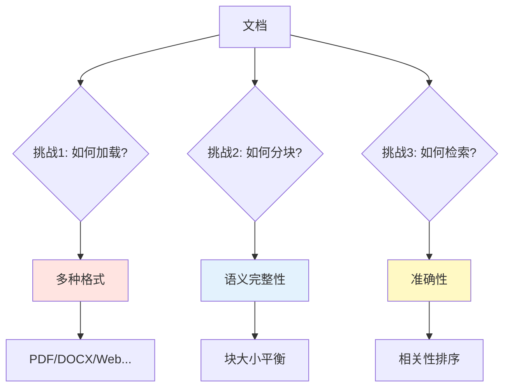
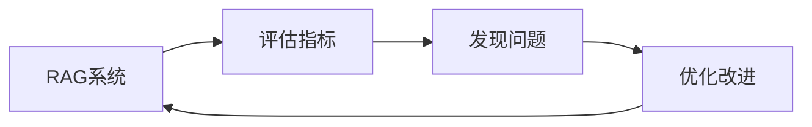

# 第四篇：RAG基础篇

---

## 📋 前置准备

### 环境配置

```bash
# 核心依赖
pip install langchain>=1.0.7
pip install langchain-openai>=1.0.3
pip install langchain-community>=0.4.1
pip install langchain-text-splitters>=0.4.0

# 向量数据库
pip install langchain-chroma>=0.2.0
pip install chromadb>=0.5.0

# 可选依赖
pip install pypdf  # PDF支持
pip install python-dotenv  # 环境变量管理
```

### 环境变量

```python
# .env
OPENAI_API_KEY=sk-your-api-key
```

---

# 第 1 章：LangChain RAG核心概念

## 1.1 什么是RAG

RAG（Retrieval-Augmented Generation，检索增强生成）是一种结合检索和生成的技术，通过从外部知识库检索相关信息来增强LLM的回答能力。

### 1.1.1 RAG的核心挑战



**常见问题**：
- 📄 **文档加载**：需要支持PDF、DOCX、HTML、Markdown等多种格式
- ✂️ **智能分块**：如何保持语义完整性？固定大小 vs 语义分块？
- 🔍 **精确检索**：如何提高检索准确率？向量检索 vs 关键词检索？
- 🎯 **相关性排序**：如何确保最相关的内容排在前面？
- 💾 **存储管理**：如何高效存储和查询大规模文档？

### 1.1.2 LangChain RAG的优势

**LangChain RAG的特点**：

| 维度 | 特点 | 说明 |
|------|------|------|
| **灵活性** | 高度可定制 | 可精细控制每个步骤 |
| **组合性** | LCEL链式组合 | 使用管道组合各组件 |
| **扩展性** | 丰富的集成 | 支持多种向量库和模型 |
| **生态** | 完整的工具链 | Agent、Memory、Tools等 |
| **生产级** | LangSmith监控 | 追踪、调试、优化 |

---

## 1.2 LangChain RAG核心组件

### 1.2.1 文档加载器（Document Loaders）

LangChain提供丰富的文档加载器：

```python
from langchain_community.document_loaders import DirectoryLoader, TextLoader

# 加载目录下所有文本文件
loader = DirectoryLoader(
    "./data",
    glob="**/*.txt",
    loader_cls=TextLoader
)
documents = loader.load()

print(f"加载了 {len(documents)} 个文档")
for doc in documents[:2]:
    print(f"内容: {doc.page_content[:100]}...")
    print(f"元数据: {doc.metadata}")
```

**常用加载器**：

```python
# PDF加载器
from langchain_community.document_loaders import PyPDFLoader

loader = PyPDFLoader("document.pdf")
pages = loader.load()

# 网页加载器
from langchain_community.document_loaders import WebBaseLoader

loader = WebBaseLoader("https://example.com")
docs = loader.load()

# CSV加载器
from langchain_community.document_loaders import CSVLoader

loader = CSVLoader("data.csv")
docs = loader.load()

# Markdown加载器
from langchain_community.document_loaders import UnstructuredMarkdownLoader

loader = UnstructuredMarkdownLoader("README.md")
docs = loader.load()
```

### 1.2.2 文本分割器（Text Splitters）

```python
from langchain_text_splitters import RecursiveCharacterTextSplitter

# 创建分割器
text_splitter = RecursiveCharacterTextSplitter(
    chunk_size=1000,        # 块大小
    chunk_overlap=200,      # 重叠大小
    length_function=len,    # 长度计算函数
    separators=["\n\n", "\n", "。", ".", " ", ""]  # 分隔符优先级
)

# 分割文档
chunks = text_splitter.split_documents(documents)

print(f"分割成 {len(chunks)} 个块")
for i, chunk in enumerate(chunks[:3]):
    print(f"\n块 {i+1}:")
    print(f"内容: {chunk.page_content[:100]}...")
    print(f"长度: {len(chunk.page_content)}")
```

**其他分割器**：

```python
# 字符分割器（简单）
from langchain_text_splitters import CharacterTextSplitter

splitter = CharacterTextSplitter(
    chunk_size=1000,
    chunk_overlap=0,
    separator="\n"
)

# Token分割器（精确控制token数）
from langchain_text_splitters import TokenTextSplitter

splitter = TokenTextSplitter(
    chunk_size=1000,
    chunk_overlap=0
)

# Markdown分割器（保留结构）
from langchain_text_splitters import MarkdownHeaderTextSplitter

headers_to_split_on = [
    ("#", "Header 1"),
    ("##", "Header 2"),
    ("###", "Header 3"),
]
splitter = MarkdownHeaderTextSplitter(headers_to_split_on=headers_to_split_on)
```

### 1.2.3 Embeddings（向量化）

```python
from langchain_openai import OpenAIEmbeddings

# 创建embeddings模型
embeddings = OpenAIEmbeddings(
    model="text-embedding-3-large",  # 或 text-embedding-3-small
    api_key="your-api-key"
)

# 向量化单个文本
vector = embeddings.embed_query("这是一段测试文本")
print(f"向量维度: {len(vector)}")

# 批量向量化
texts = ["文本1", "文本2", "文本3"]
vectors = embeddings.embed_documents(texts)
print(f"批量向量化了 {len(vectors)} 个文本")
```

### 1.2.4 向量存储（Vector Stores）

#### Chroma向量库

```python
from langchain_chroma import Chroma
from langchain_openai import OpenAIEmbeddings

embeddings = OpenAIEmbeddings(model="text-embedding-3-large")

# 方式1: 从文档创建
vectorstore = Chroma.from_documents(
    documents=chunks,
    embedding=embeddings,
    persist_directory="./chroma_db"
)

# 方式2: 加载已有向量库
vectorstore = Chroma(
    persist_directory="./chroma_db",
    embedding_function=embeddings
)

# 添加文档
vectorstore.add_documents(documents=new_docs)

# 相似度搜索
results = vectorstore.similarity_search("查询文本", k=3)
for doc in results:
    print(doc.page_content)
```

#### 其他向量库

```python
# FAISS
from langchain_community.vectorstores import FAISS

vectorstore = FAISS.from_documents(chunks, embeddings)
vectorstore.save_local("faiss_index")
vectorstore = FAISS.load_local("faiss_index", embeddings)

# Qdrant
from langchain_community.vectorstores import Qdrant
from qdrant_client import QdrantClient

client = QdrantClient(host="localhost", port=6333)
vectorstore = Qdrant(
    client=client,
    collection_name="my_documents",
    embeddings=embeddings
)

# Pinecone
from langchain_community.vectorstores import Pinecone
import pinecone

pinecone.init(api_key="your-key", environment="your-env")
vectorstore = Pinecone.from_documents(chunks, embeddings, index_name="my-index")
```

---

## 1.3 快速开始：第一个RAG应用

### 1.3.1 5分钟实现完整RAG

```python
"""
完整的RAG应用 - LangChain版本
"""
from langchain_community.document_loaders import DirectoryLoader, TextLoader
from langchain_text_splitters import RecursiveCharacterTextSplitter
from langchain_openai import OpenAIEmbeddings, ChatOpenAI
from langchain_chroma import Chroma
from langchain_core.prompts import ChatPromptTemplate
from langchain_core.runnables import RunnablePassthrough
from langchain_core.output_parsers import StrOutputParser
import os

# 设置API Key
os.environ["OPENAI_API_KEY"] = "sk-your-key"

# 步骤1: 加载文档
print("📄 加载文档...")
loader = DirectoryLoader(
    "./data",
    glob="**/*.txt",
    loader_cls=TextLoader
)
documents = loader.load()
print(f"✅ 加载了 {len(documents)} 个文档")

# 步骤2: 分割文档
print("✂️  分割文档...")
text_splitter = RecursiveCharacterTextSplitter(
    chunk_size=1000,
    chunk_overlap=200
)
chunks = text_splitter.split_documents(documents)
print(f"✅ 创建了 {len(chunks)} 个块")

# 步骤3: 创建向量库
print("🔨 创建向量库...")
embeddings = OpenAIEmbeddings(model="text-embedding-3-large")
vectorstore = Chroma.from_documents(
    documents=chunks,
    embedding=embeddings,
    persist_directory="./chroma_db"
)
print("✅ 向量库创建完成")

# 步骤4: 创建检索器
retriever = vectorstore.as_retriever(
    search_type="similarity",
    search_kwargs={"k": 3}
)

# 步骤5: 创建Prompt模板
prompt = ChatPromptTemplate.from_template("""
请基于以下上下文回答问题。如果上下文中没有相关信息，请说"我不知道"。

上下文：
{context}

问题：{question}

回答：
""")

# 步骤6: 创建LLM
llm = ChatOpenAI(model="gpt-4", temperature=0)

# 步骤7: 构建RAG链
def format_docs(docs):
    return "\n\n".join(doc.page_content for doc in docs)

rag_chain = (
    RunnablePassthrough.assign(
        context=retriever | format_docs
    )
    | prompt
    | llm
    | StrOutputParser()
)

# 步骤8: 查询
questions = [
    "文档的主要内容是什么？",
    "有哪些关键概念？",
    "如何快速上手？"
]

for question in questions:
    print(f"\n❓ 问题: {question}")
    response = rag_chain.invoke({"question": question})
    print(f"💡 回答: {response}")
    print("-" * 80)
```

---

# 第 2 章：RAG核心组件深入

## 2.1 文本分割策略

### 2.1.1 RecursiveCharacterTextSplitter（推荐）

```python
from langchain_text_splitters import RecursiveCharacterTextSplitter

# 智能递归分割
splitter = RecursiveCharacterTextSplitter(
    chunk_size=1000,
    chunk_overlap=200,
    separators=["\n\n", "\n", "。", ".", " ", ""],
    length_function=len,
)

chunks = splitter.split_documents(documents)

# 查看分割效果
for i, chunk in enumerate(chunks[:3]):
    print(f"\n块 {i+1} (长度: {len(chunk.page_content)}):")
    print(chunk.page_content[:200])
```

### 2.1.2 分块参数优化

```python
# 不同场景的分块策略

# 场景1: 短文本问答（如FAQ）
short_splitter = RecursiveCharacterTextSplitter(
    chunk_size=500,
    chunk_overlap=50
)

# 场景2: 长文档分析（如技术文档）
long_splitter = RecursiveCharacterTextSplitter(
    chunk_size=2000,
    chunk_overlap=400
)

# 场景3: 代码文档
code_splitter = RecursiveCharacterTextSplitter.from_language(
    language="python",
    chunk_size=1000,
    chunk_overlap=100
)
```

---

## 2.2 向量存储深入

### 2.2.1 Chroma进阶用法

```python
from langchain_chroma import Chroma
from langchain_openai import OpenAIEmbeddings

embeddings = OpenAIEmbeddings(model="text-embedding-3-large")

# 创建持久化向量库
vectorstore = Chroma(
    collection_name="my_collection",
    embedding_function=embeddings,
    persist_directory="./chroma_db"
)

# 添加文档（带元数据）
vectorstore.add_documents(
    documents=chunks,
    ids=[f"doc_{i}" for i in range(len(chunks))]
)

# 高级检索：使用元数据过滤
results = vectorstore.similarity_search(
    query="查询文本",
    k=3,
    filter={"source": "document.pdf"}
)

# MMR检索（最大边际相关性，增加多样性）
results = vectorstore.max_marginal_relevance_search(
    query="查询文本",
    k=5,
    fetch_k=20,
    lambda_mult=0.5  # 0=多样性, 1=相关性
)
```

### 2.2.2 向量数据库选择指南

| 数据库 | 类型 | 性能 | 部署难度 | 适用场景 |
|--------|------|------|---------|---------|
| **Chroma** | 嵌入式 | 中 | ⭐ | 开发测试、中小型应用 |
| **FAISS** | 库 | 高 | ⭐⭐ | 单机高性能、大规模检索 |
| **Qdrant** | 服务 | 高 | ⭐⭐⭐ | 生产环境、分布式 |
| **Pinecone** | 云服务 | 高 | ⭐ | 云原生、无需运维 |
| **Weaviate** | 服务 | 高 | ⭐⭐⭐ | 企业级、GraphRAG |

---

## 2.3 检索器（Retrievers）

### 2.3.1 基础检索器

```python
# 相似度检索
retriever = vectorstore.as_retriever(
    search_type="similarity",
    search_kwargs={"k": 5}
)

# MMR检索
retriever = vectorstore.as_retriever(
    search_type="mmr",
    search_kwargs={
        "k": 5,
        "fetch_k": 20,
        "lambda_mult": 0.5
    }
)

# 相似度阈值过滤
retriever = vectorstore.as_retriever(
    search_type="similarity_score_threshold",
    search_kwargs={
        "score_threshold": 0.7,
        "k": 5
    }
)
```

### 2.3.2 自定义检索器

```python
from langchain_core.retrievers import BaseRetriever
from langchain_core.documents import Document
from typing import List

class CustomRetriever(BaseRetriever):
    vectorstore: object
    top_k: int = 5

    def _get_relevant_documents(self, query: str) -> List[Document]:
        """自定义检索逻辑"""
        # 1. 向量检索
        vector_results = self.vectorstore.similarity_search(query, k=self.top_k)

        # 2. 自定义后处理（如重排序、过滤等）
        filtered_results = [
            doc for doc in vector_results
            if len(doc.page_content) > 100
        ]

        return filtered_results

# 使用自定义检索器
custom_retriever = CustomRetriever(vectorstore=vectorstore, top_k=5)
results = custom_retriever.get_relevant_documents("查询文本")
```

---

## 2.4 RAG链构建

### 2.4.1 基础RAG链

```python
from langchain_openai import ChatOpenAI
from langchain_core.prompts import ChatPromptTemplate
from langchain_core.runnables import RunnablePassthrough
from langchain_core.output_parsers import StrOutputParser

# Prompt模板
prompt = ChatPromptTemplate.from_template("""
基于以下上下文回答问题：

{context}

问题：{question}
""")

# 格式化函数
def format_docs(docs):
    return "\n\n".join(doc.page_content for doc in docs)

# 构建链
rag_chain = (
    RunnablePassthrough.assign(
        context=retriever | format_docs
    )
    | prompt
    | ChatOpenAI(model="gpt-4", temperature=0)
    | StrOutputParser()
)

# 执行
response = rag_chain.invoke({"question": "什么是RAG？"})
print(response)
```

### 2.4.2 带来源的RAG链

```python
from langchain_core.runnables import RunnableParallel

# 保留检索的文档
rag_chain_with_source = RunnableParallel(
    {
        "context": retriever | format_docs,
        "source_documents": retriever,
        "question": RunnablePassthrough()
    }
).assign(
    answer=lambda x: (
        prompt
        | ChatOpenAI(model="gpt-4", temperature=0)
        | StrOutputParser()
    ).invoke({"context": x["context"], "question": x["question"]})
)

# 执行
result = rag_chain_with_source.invoke("什么是RAG？")
print(f"回答: {result['answer']}")
print(f"\n来源文档:")
for i, doc in enumerate(result['source_documents'], 1):
    print(f"{i}. {doc.page_content[:100]}...")
```

### 2.4.3 流式RAG链

```python
# 启用流式输出
rag_chain_stream = (
    RunnablePassthrough.assign(
        context=retriever | format_docs
    )
    | prompt
    | ChatOpenAI(model="gpt-4", temperature=0, streaming=True)
    | StrOutputParser()
)

# 流式输出
for chunk in rag_chain_stream.stream({"question": "详细解释RAG的工作原理"}):
    print(chunk, end="", flush=True)
```

---

# 第 3 章：RAG完整应用实战

## 3.1 生产级RAG应用

```python
"""
生产级RAG应用 - 完整实现
"""
from langchain_community.document_loaders import DirectoryLoader, TextLoader
from langchain_text_splitters import RecursiveCharacterTextSplitter
from langchain_openai import OpenAIEmbeddings, ChatOpenAI
from langchain_chroma import Chroma
from langchain_core.prompts import ChatPromptTemplate
from langchain_core.runnables import RunnablePassthrough, RunnableParallel
from langchain_core.output_parsers import StrOutputParser
import os
from pathlib import Path

class ProductionRAG:
    def __init__(self, data_dir="./data", persist_dir="./chroma_db"):
        self.data_dir = data_dir
        self.persist_dir = persist_dir
        self.vectorstore = None
        self.embeddings = OpenAIEmbeddings(model="text-embedding-3-large")

    def build_vectorstore(self, force_rebuild=False):
        """构建或加载向量库"""
        if not force_rebuild and Path(self.persist_dir).exists():
            print("📂 加载现有向量库...")
            self.vectorstore = Chroma(
                persist_directory=self.persist_dir,
                embedding_function=self.embeddings
            )
            print("✅ 向量库加载成功")
            return

        print("📄 1. 加载文档...")
        loader = DirectoryLoader(
            self.data_dir,
            glob="**/*.txt",
            loader_cls=TextLoader
        )
        documents = loader.load()
        print(f"   ✅ 加载了 {len(documents)} 个文档")

        print("✂️  2. 分割文档...")
        text_splitter = RecursiveCharacterTextSplitter(
            chunk_size=1000,
            chunk_overlap=200,
            separators=["\n\n", "\n", "。", ".", " ", ""]
        )
        chunks = text_splitter.split_documents(documents)
        print(f"   ✅ 创建了 {len(chunks)} 个块")

        print("🔨 3. 创建向量库...")
        self.vectorstore = Chroma.from_documents(
            documents=chunks,
            embedding=self.embeddings,
            persist_directory=self.persist_dir
        )
        print("   ✅ 向量库创建完成")

    def create_rag_chain(self, model="gpt-4", temperature=0, top_k=3):
        """创建RAG链"""
        if self.vectorstore is None:
            raise ValueError("向量库未初始化，请先调用 build_vectorstore()")

        # 检索器
        retriever = self.vectorstore.as_retriever(
            search_type="similarity",
            search_kwargs={"k": top_k}
        )

        # Prompt
        prompt = ChatPromptTemplate.from_template("""
你是一个有帮助的AI助手。请基于以下上下文回答问题。

上下文：
{context}

问题：{question}

要求：
1. 如果上下文中有相关信息，请详细回答
2. 如果上下文中没有相关信息，请说"根据提供的文档，我无法回答这个问题"
3. 不要编造信息
4. 如果可以，请引用具体的来源

回答：
""")

        # 格式化函数
        def format_docs(docs):
            return "\n\n".join(
                f"[文档{i+1}]\n{doc.page_content}"
                for i, doc in enumerate(docs)
            )

        # 构建链
        rag_chain = RunnableParallel(
            {
                "context": retriever | format_docs,
                "source_documents": retriever,
                "question": RunnablePassthrough()
            }
        ).assign(
            answer=lambda x: (
                prompt
                | ChatOpenAI(model=model, temperature=temperature)
                | StrOutputParser()
            ).invoke({"context": x["context"], "question": x["question"]})
        )

        return rag_chain

    def query(self, question, model="gpt-4", temperature=0, top_k=3, show_sources=True):
        """查询"""
        chain = self.create_rag_chain(model=model, temperature=temperature, top_k=top_k)

        print(f"\n❓ 问题: {question}")
        result = chain.invoke(question)

        print(f"\n💡 回答:\n{result['answer']}\n")

        if show_sources:
            print("📚 来源:")
            for i, doc in enumerate(result['source_documents'], 1):
                print(f"  {i}. {doc.page_content[:100]}...")
                print(f"     元数据: {doc.metadata}")

        return result

# 使用示例
if __name__ == "__main__":
    # 初始化
    rag = ProductionRAG()
    rag.build_vectorstore()

    # 查询
    questions = [
        "文档的主要内容是什么？",
        "有哪些关键技术？",
        "如何快速上手？"
    ]

    for q in questions:
        rag.query(q)
        print("-" * 80)
```

---

## 3.2 RAG性能优化

### 3.2.1 分块优化

```python
# 问题：固定大小分块可能切断语义

# ❌ 差的分块
text_splitter = RecursiveCharacterTextSplitter(
    chunk_size=100,   # 太小
    chunk_overlap=0   # 无重叠
)

# ✅ 优化的分块
text_splitter = RecursiveCharacterTextSplitter(
    chunk_size=1000,    # 适中
    chunk_overlap=200,  # 20%重叠
    separators=["\n\n", "\n", "。", ".", " ", ""]  # 优先在段落/句子边界分割
)

# ✅ 针对中文的优化
text_splitter = RecursiveCharacterTextSplitter(
    chunk_size=500,
    chunk_overlap=100,
    separators=["\n\n", "\n", "。", "！", "？", "；", ".", "!", "?", ";", " ", ""]
)
```

### 3.2.2 Embedding优化

```python
from langchain_openai import OpenAIEmbeddings

# 1. 模型选择
# 平衡方案（性价比高）
embeddings = OpenAIEmbeddings(
    model="text-embedding-3-small"  # 1536维
)

# 高质量方案（效果最好）
embeddings = OpenAIEmbeddings(
    model="text-embedding-3-large"  # 3072维
)

# 2. 批量处理（节省成本和时间）
from langchain_chroma import Chroma

# 分批向量化
batch_size = 100
for i in range(0, len(chunks), batch_size):
    batch = chunks[i:i+batch_size]
    vectorstore.add_documents(batch)
```

### 3.2.3 检索优化

```python
# 1. 调整Top-K
retriever = vectorstore.as_retriever(
    search_kwargs={"k": 5}  # 实验最佳值（通常3-10）
)

# 2. 使用MMR（最大边际相关性）- 增加多样性
retriever = vectorstore.as_retriever(
    search_type="mmr",
    search_kwargs={
        "k": 5,
        "fetch_k": 20,      # 候选池
        "lambda_mult": 0.5  # 0=多样性, 1=相关性
    }
)

# 3. 相似度阈值过滤
retriever = vectorstore.as_retriever(
    search_type="similarity_score_threshold",
    search_kwargs={
        "score_threshold": 0.7,  # 只返回>0.7的结果
        "k": 5
    }
)
```

---

# 第 4 章：RAG评估与监控

## 4.1 为什么需要评估？

**常见RAG问题**：
- ❌ 检索不到相关文档
- ❌ 检索到不相关文档
- ❌ 生成的答案不准确
- ❌ 生成的答案有幻觉

**评估的重要性**：


---

## 4.2 使用LangSmith监控

```python
"""
使用LangSmith追踪和监控RAG
"""
import os
from langchain_openai import ChatOpenAI
from langchain_core.prompts import ChatPromptTemplate

# 1. 启用LangSmith
os.environ["LANGSMITH_API_KEY"] = "your-key"
os.environ["LANGSMITH_TRACING"] = "true"
os.environ["LANGSMITH_PROJECT"] = "rag-project"

# 2. 正常使用（自动追踪）
rag_chain = create_rag_chain()
result = rag_chain.invoke({"question": "什么是RAG？"})

# 3. 在LangSmith Dashboard查看：
# - 每次调用的详细trace
# - Token使用量
# - 延迟
# - 成本
# - 错误追踪
```

---

## 4.3 评估指标

### 4.3.1 检索质量指标

```python
"""
手动评估检索质量
"""
def evaluate_retrieval(retriever, test_queries):
    """评估检索质量"""
    results = []

    for query, relevant_docs in test_queries:
        # 检索
        retrieved = retriever.get_relevant_documents(query)
        retrieved_ids = [doc.metadata.get('id') for doc in retrieved]

        # 计算指标
        relevant_ids = [doc.metadata.get('id') for doc in relevant_docs]

        # Precision@K
        relevant_retrieved = len(set(retrieved_ids) & set(relevant_ids))
        precision = relevant_retrieved / len(retrieved_ids) if retrieved_ids else 0

        # Recall@K
        recall = relevant_retrieved / len(relevant_ids) if relevant_ids else 0

        results.append({
            'query': query,
            'precision': precision,
            'recall': recall
        })

    return results

# 测试数据
test_queries = [
    ("什么是RAG？", [doc1, doc2]),
    ("如何优化检索？", [doc3, doc4, doc5])
]

# 评估
metrics = evaluate_retrieval(retriever, test_queries)
for m in metrics:
    print(f"查询: {m['query']}")
    print(f"  Precision: {m['precision']:.2f}")
    print(f"  Recall: {m['recall']:.2f}")
```

---

## 本章小结

本章我们学习了：

1. **评估的重要性**：发现问题、持续优化
2. **LangSmith监控**：追踪、调试、优化
3. **评估指标**：Precision、Recall等

---

## 全文总结

**第1章回顾**：
- ✅ RAG核心概念
- ✅ LangChain RAG优势
- ✅ 核心组件（Loaders、Splitters、Embeddings、VectorStores）
- ✅ 5分钟快速开始

**第2章回顾**：
- ✅ 文本分割策略
- ✅ 向量存储深入
- ✅ 检索器进阶
- ✅ RAG链构建

**第3章回顾**：
- ✅ 生产级RAG应用
- ✅ 性能优化（分块、Embedding、检索）

**第4章回顾**：
- ✅ 评估与监控
- ✅ LangSmith使用

---

## 思考与练习

1. **练习1**：使用LangChain构建一个文档问答系统
2. **练习2**：对比不同分块策略的效果
3. **练习3**：实现一个带元数据过滤的RAG系统
4. **练习4**：使用LangSmith监控和优化你的RAG系统

---

## 参考资源

- [LangChain官方文档](https://docs.langchain.com/)
- [LangChain Python API Reference](https://python.langchain.com/api_reference/)
- [LangSmith文档](https://docs.smith.langchain.com/)

---

**版本信息**：
- LangChain: 1.0.7+
- langchain-community: 0.4.1+
- langchain-openai: 1.0.3+
- langchain-chroma: 0.2.0+
- 最后更新: 2025-11-23
