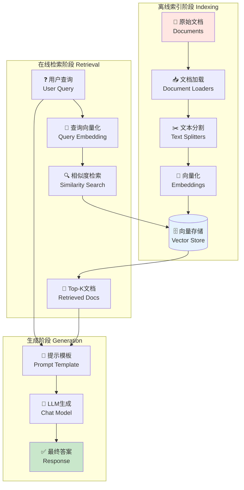

# 第四篇：RAG基础篇（LangChain生产实战）

## 📋 前置准备

### 环境配置

```bash
# 核心依赖（LangChain 1.0+）
pip install langchain>=1.0.7
pip install langchain-openai>=1.0.3
pip install langchain-core>=1.0.0
pip install langchain-community>=0.4.1
pip install langchain-text-splitters>=0.4.0

# 向量数据库
pip install langchain-chroma>=0.2.0
pip install chromadb>=0.5.0

# 可选依赖
pip install pypdf              # PDF文档支持
pip install python-dotenv      # 环境变量管理
```

### 环境变量设置

```python
# .env
OPENAI_API_KEY=sk-your-api-key

# 可选：启用LangSmith追踪
LANGSMITH_API_KEY=your-langsmith-key
LANGSMITH_TRACING=true
LANGSMITH_PROJECT=rag-tutorial
```

---

## 第 1 章：RAG架构与核心概念

#### 1.1 什么是RAG？

**RAG（Retrieval-Augmented Generation）**是一种结合检索和生成的技术，通过从外部知识库检索相关信息来增强LLM的回答能力。

##### 1.1.1 为什么需要RAG？

**LLM的两大限制**：
1. **有限的上下文窗口** - 无法一次性处理整个文档库
2. **静态知识** - 训练数据固化在某个时间点

**RAG的解决方案**：
- 在查询时动态检索相关外部知识
- 将检索到的上下文注入到LLM提示中
- 生成基于实时数据的准确回答

##### 1.1.2 RAG完整架构



##### 1.1.3 RAG工作流程

**阶段一：离线索引（Indexing）**
```python
文档 → 加载 → 分割 → 向量化 → 存储
```

**阶段二：在线检索与生成（Retrieval & Generation）**
```python
用户查询 → 向量化 → 检索相关文档 → 构建提示 → LLM生成答案
```

---

#### 1.2 LangChain RAG的优势

| 特性 | 说明 | 示例 |
|------|------|------|
| **LCEL组合** | 使用管道语法（`\|`）串联组件 | `retriever \| prompt \| llm` |
| **模块化** | 每个组件可独立替换 | 轻松切换向量数据库或LLM |
| **生产级** | 内置追踪、监控、评估 | LangSmith集成 |
| **灵活性** | 支持多种RAG模式 | Agent RAG、2-Step RAG |
| **丰富集成** | 100+ 向量库、LLM集成 | Chroma、FAISS、Pinecone等 |

---

#### 1.3 两种RAG实现模式

##### 1.3.1 RAG Agent（智能灵活）

**特点**：LLM自主决定何时检索

```python
from langchain_core.tools import tool
from langchain.agents import create_agent

@tool(response_format="content_and_artifact")
def retrieve_context(query: str):
    """检索相关文档以帮助回答问题"""
    docs = vector_store.similarity_search(query, k=2)
    serialized = "\n\n".join(
        f"来源: {doc.metadata}\n内容: {doc.page_content}"
        for doc in docs
    )
    return serialized, docs

# 创建Agent（LLM决定是否调用检索工具）
agent = create_agent(model, tools=[retrieve_context])
```

**优势与劣势**：
- ✅ **按需检索** - LLM可处理闲聊、追问，无需每次都检索
- ✅ **上下文查询** - LLM可根据对话历史构建更好的检索查询
- ✅ **多次检索** - 可执行多轮检索以获得更全面的信息
- ⚠️ **两次推理** - 需要一次生成查询，一次生成答案（延迟更高）
- ⚠️ **控制力弱** - LLM可能跳过必要的检索或执行不必要的检索

##### 1.3.2 2-Step RAG Chain（快速简洁）

**特点**：每次查询都执行检索，单次LLM调用

```python
from langchain_core.prompts import ChatPromptTemplate
from langchain_core.runnables import RunnablePassthrough
from langchain_core.output_parsers import StrOutputParser

# 格式化检索文档
def format_docs(docs):
    return "\n\n".join(doc.page_content for doc in docs)

# 构建2-Step Chain（LCEL语法）
rag_chain = (
    {"context": retriever | format_docs, "question": RunnablePassthrough()}
    | prompt
    | llm
    | StrOutputParser()
)
```

**优势与劣势**：
- ✅ **低延迟** - 单次LLM调用，响应更快
- ✅ **可预测** - 每次都执行检索，行为一致
- ✅ **易调试** - 流程固定，容易追踪和优化
- ⚠️ **灵活性低** - 无法处理不需要检索的简单查询
- ⚠️ **固定模式** - 总是检索固定数量的文档

> **选择建议**：对于大多数应用，推荐从**2-Step RAG Chain**开始，因为它简单、快速、易于调试。只有在需要动态决策时才使用RAG Agent。

---

## 第 2 章：索引流程 - 从文档到向量库

### 2.1 文档加载（Document Loaders）

##### 2.1.1 基础加载器

```python
from langchain_community.document_loaders import TextLoader, DirectoryLoader

# 加载单个文本文件
loader = TextLoader("document.txt")
docs = loader.load()

# 批量加载目录下所有文本文件
loader = DirectoryLoader(
    "./data",
    glob="**/*.txt",
    loader_cls=TextLoader
)
documents = loader.load()

print(f"✅ 加载了 {len(documents)} 个文档")
for doc in documents[:2]:
    print(f"内容预览: {doc.page_content[:100]}...")
    print(f"元数据: {doc.metadata}")
```

##### 2.1.2 常用加载器

```python
# PDF加载器
from langchain_community.document_loaders import PyPDFLoader

loader = PyPDFLoader("report.pdf")
pages = loader.load()
print(f"PDF共 {len(pages)} 页")

# 网页加载器
from langchain_community.document_loaders import WebBaseLoader

loader = WebBaseLoader(web_paths=("https://example.com",))
web_docs = loader.load()

# CSV加载器
from langchain_community.document_loaders import CSVLoader

loader = CSVLoader(file_path="data.csv")
csv_docs = loader.load()

# Markdown加载器
from langchain_community.document_loaders import UnstructuredMarkdownLoader

loader = UnstructuredMarkdownLoader("README.md")
md_docs = loader.load()
```

> **提示**：所有加载器返回的文档都包含 `page_content`（文本内容）和 `metadata`（元数据，如文件名、页码等）。

---

### 2.2 文本分割（Text Splitters）

##### 2.2.1 为什么需要分割？

**挑战**：
- LLM有上下文窗口限制
- 向量检索需要语义独立的文本块
- 块太大会降低检索精度，块太小会丢失上下文

**解决方案**：将长文档分割成适当大小的块（chunks），并保留重叠（overlap）以维持上下文。

##### 2.2.2 RecursiveCharacterTextSplitter（推荐）

```python
from langchain_text_splitters import RecursiveCharacterTextSplitter

# 创建智能分割器
text_splitter = RecursiveCharacterTextSplitter(
    chunk_size=1000,        # 每块最大字符数
    chunk_overlap=200,      # 块间重叠字符数（保持上下文）
    length_function=len,    # 计算长度的函数
    separators=["\n\n", "\n", "。", ".", " ", ""]  # 优先在段落/句子边界分割
)

# 分割文档
chunks = text_splitter.split_documents(documents)

print(f"✅ 分割成 {len(chunks)} 个块")
for i, chunk in enumerate(chunks[:3]):
    print(f"\n块 {i+1} (长度: {len(chunk.page_content)}):")
    print(chunk.page_content[:150])
```

**工作原理**：
1. 尝试用 `\n\n`（段落）分割
2. 如果块仍太大，用 `\n`（换行）分割
3. 继续用 `。`、`.`（句子）分割
4. 最后用空格和字符分割

##### 2.2.3 不同场景的分块策略

```python
# 场景1：短文本FAQ（小块）
faq_splitter = RecursiveCharacterTextSplitter(
    chunk_size=500,
    chunk_overlap=50
)

# 场景2：长文档（大块，更多上下文）
long_doc_splitter = RecursiveCharacterTextSplitter(
    chunk_size=2000,
    chunk_overlap=400
)

# 场景3：代码文档（保留代码结构）
from langchain_text_splitters import Language

code_splitter = RecursiveCharacterTextSplitter.from_language(
    language=Language.PYTHON,
    chunk_size=1000,
    chunk_overlap=100
)

# 场景4：中文文档（优化分隔符）
chinese_splitter = RecursiveCharacterTextSplitter(
    chunk_size=500,
    chunk_overlap=100,
    separators=["\n\n", "\n", "。", "！", "？", "；", ".", "!", "?", ";", " ", ""]
)
```

> **最佳实践**：
> - `chunk_overlap` 通常设置为 `chunk_size` 的 10-20%
> - 根据实际数据调整，通过评估找到最佳值
> - 中文建议块大小 500-1000 字符

---

### 2.3 向量化（Embeddings）

##### 2.3.1 OpenAI Embeddings（推荐）

```python
from langchain_openai import OpenAIEmbeddings

# 创建Embeddings模型
embeddings = OpenAIEmbeddings(
    model="text-embedding-3-large",  # 3072维，效果最好
    # model="text-embedding-3-small",  # 1536维，性价比高
)

# 向量化单个查询
query_vector = embeddings.embed_query("什么是RAG？")
print(f"查询向量维度: {len(query_vector)}")

# 批量向量化文档（更高效）
doc_texts = ["文档1", "文档2", "文档3"]
doc_vectors = embeddings.embed_documents(doc_texts)
print(f"批量向量化了 {len(doc_vectors)} 个文档")
```

##### 2.3.2 模型选择指南

| 模型 | 维度 | 性能 | 成本 | 适用场景 |
|------|------|------|------|---------|
| `text-embedding-3-large` | 3072 | 最佳 | 高 | 生产环境、高精度需求 |
| `text-embedding-3-small` | 1536 | 良好 | 低 | 开发测试、性价比优先 |
| `text-embedding-ada-002` | 1536 | 良好 | 中 | 旧版本，不推荐新项目使用 |

> **提示**：`text-embedding-3-*` 系列性能更优，价格更低，是推荐选择。

---

### 2.4 向量存储（Vector Stores）

##### 2.4.1 Chroma（本地开发推荐）

```python
from langchain_chroma import Chroma
from langchain_openai import OpenAIEmbeddings

embeddings = OpenAIEmbeddings(model="text-embedding-3-large")

# 方式1: 从文档直接创建向量库
vectorstore = Chroma.from_documents(
    documents=chunks,
    embedding=embeddings,
    persist_directory="./chroma_db"  # 持久化存储
)

# 方式2: 加载已有向量库
vectorstore = Chroma(
    persist_directory="./chroma_db",
    embedding_function=embeddings
)

# 添加文档
vectorstore.add_documents(documents=new_chunks)

# 相似度搜索
results = vectorstore.similarity_search(
    query="什么是RAG？",
    k=3  # 返回Top-3
)

for i, doc in enumerate(results, 1):
    print(f"{i}. {doc.page_content[:100]}...")
```

##### 2.4.2 InMemoryVectorStore（快速原型）

```python
from langchain_core.vectorstores import InMemoryVectorStore

# 轻量级内存向量库（无需外部依赖）
vector_store = InMemoryVectorStore(embeddings)
ids = vector_store.add_documents(documents=chunks)

# 相似度搜索（带分数）
results = vector_store.similarity_search_with_score(
    query="什么是RAG？",
    k=3
)

for doc, score in results:
    print(f"相似度: {score:.4f}")
    print(f"内容: {doc.page_content[:100]}...\n")
```

##### 2.4.3 向量数据库选择指南

| 数据库 | 类型 | 性能 | 部署难度 | 适用场景 |
|--------|------|------|---------|---------|
| **InMemoryVectorStore** | 内存 | 快 | ⭐ | 快速原型、测试 |
| **Chroma** | 嵌入式 | 中 | ⭐ | 本地开发、中小型应用 |
| **FAISS** | 库 | 高 | ⭐⭐ | 单机高性能、大规模检索 |
| **Qdrant** | 服务 | 高 | ⭐⭐⭐ | 生产环境、分布式 |
| **Pinecone** | 云服务 | 高 | ⭐ | 云原生、无需运维 |
| **Weaviate** | 服务 | 高 | ⭐⭐⭐ | 企业级、GraphRAG |

---

### 2.5 检索器（Retrievers）

##### 2.5.1 基础检索器

```python
# 方式1：相似度检索（默认）
retriever = vectorstore.as_retriever(
    search_type="similarity",
    search_kwargs={"k": 5}  # Top-5
)

# 方式2：MMR检索（增加多样性）
retriever = vectorstore.as_retriever(
    search_type="mmr",
    search_kwargs={
        "k": 5,           # 返回5个结果
        "fetch_k": 20,    # 从20个候选中选择
        "lambda_mult": 0.5  # 0=多样性, 1=相关性
    }
)

# 方式3：相似度阈值过滤
retriever = vectorstore.as_retriever(
    search_type="similarity_score_threshold",
    search_kwargs={
        "score_threshold": 0.7,  # 只返回相似度>0.7的文档
        "k": 5
    }
)

# 使用检索器
docs = retriever.invoke("什么是RAG？")
for doc in docs:
    print(doc.page_content[:100])
```

> **提示**：检索器实现了 `Runnable` 接口，可直接用于LCEL链中。

---

## 第 3 章：检索与生成 - 构建RAG链

### 3.1 标准RAG Chain（LCEL）

##### 3.1.1 完整实现

```python
from langchain_openai import ChatOpenAI, OpenAIEmbeddings
from langchain_chroma import Chroma
from langchain_core.prompts import ChatPromptTemplate
from langchain_core.runnables import RunnablePassthrough
from langchain_core.output_parsers import StrOutputParser

# 1. 创建检索器
embeddings = OpenAIEmbeddings(model="text-embedding-3-large")
vectorstore = Chroma(
    persist_directory="./chroma_db",
    embedding_function=embeddings
)
retriever = vectorstore.as_retriever(search_kwargs={"k": 3})

# 2. 创建Prompt模板
prompt = ChatPromptTemplate.from_template("""
你是一个专业的AI助手。请基于以下上下文回答问题。

上下文：
{context}

问题：{question}

要求：
1. 如果上下文中有相关信息，请详细回答
2. 如果上下文中没有相关信息，请明确说明"根据提供的文档，我无法回答这个问题"
3. 不要编造信息，只使用上下文中的内容

回答：
""")

# 3. 创建LLM
llm = ChatOpenAI(model="gpt-4o-mini", temperature=0)

# 4. 格式化函数
def format_docs(docs: list) -> str:
    """将文档列表格式化为字符串"""
    return "\n\n".join(doc.page_content for doc in docs)

# 5. 构建RAG链（LCEL语法）
rag_chain = (
    {"context": retriever | format_docs, "question": RunnablePassthrough()}
    | prompt
    | llm
    | StrOutputParser()
)

# 6. 执行查询
response = rag_chain.invoke("什么是RAG？")
print(response)
```

##### 3.1.2 LCEL语法详解

```python
# LCEL使用管道（|）操作符串联组件

# 步骤1: 并行执行检索和问题传递
{"context": retriever | format_docs, "question": RunnablePassthrough()}
# 输出: {"context": "检索到的文档", "question": "用户问题"}

# 步骤2: 将字典传递给Prompt模板
| prompt
# 输出: ChatPromptValue（格式化后的提示）

# 步骤3: LLM生成
| llm
# 输出: AIMessage（包含answer和metadata）

# 步骤4: 提取文本内容
| StrOutputParser()
# 输出: str（纯文本答案）
```

---

### 3.2 带来源的RAG Chain

##### 3.2.1 返回检索文档

```python
from langchain_core.runnables import RunnableParallel

# 构建返回来源的链
rag_chain_with_source = RunnableParallel(
    {
        "context": retriever | format_docs,
        "source_documents": retriever,  # 保留原始文档
        "question": RunnablePassthrough()
    }
).assign(
    answer=lambda x: (
        prompt
        | llm
        | StrOutputParser()
    ).invoke({"context": x["context"], "question": x["question"]})
)

# 执行查询
result = rag_chain_with_source.invoke("什么是RAG？")

print(f"回答: {result['answer']}\n")
print("📚 来源文档:")
for i, doc in enumerate(result['source_documents'], 1):
    print(f"{i}. {doc.page_content[:100]}...")
    print(f"   元数据: {doc.metadata}\n")
```

##### 3.2.2 增强格式化函数

```python
def format_docs_with_metadata(docs: list) -> str:
    """格式化文档，包含来源信息"""
    formatted = []
    for i, doc in enumerate(docs, 1):
        source = doc.metadata.get('source', '未知')
        page = doc.metadata.get('page', 'N/A')
        formatted.append(
            f"[文档{i}] (来源: {source}, 页码: {page})\n{doc.page_content}"
        )
    return "\n\n".join(formatted)

# 使用增强格式化
rag_chain = (
    {"context": retriever | format_docs_with_metadata, "question": RunnablePassthrough()}
    | prompt
    | llm
    | StrOutputParser()
)
```

---

### 3.3 流式RAG Chain

##### 3.3.1 实现流式输出

```python
# 创建支持流式的LLM
llm = ChatOpenAI(
    model="gpt-4o-mini",
    temperature=0,
    streaming=True  # 启用流式
)

# 构建流式RAG链
rag_chain_stream = (
    {"context": retriever | format_docs, "question": RunnablePassthrough()}
    | prompt
    | llm
    | StrOutputParser()
)

# 流式输出（实时打印）
print("🤖 助手: ", end="", flush=True)
for chunk in rag_chain_stream.stream("详细解释RAG的工作原理"):
    print(chunk, end="", flush=True)
print("\n")
```

##### 3.3.2 流式输出的优势

```python
import time

# 对比：非流式 vs 流式

# 非流式（用户等待完整响应）
start = time.time()
response = rag_chain.invoke("解释什么是Transformer架构？")
end = time.time()
print(f"非流式耗时: {end-start:.2f}秒")
print(response)

# 流式（用户立即看到输出）
start = time.time()
for chunk in rag_chain_stream.stream("解释什么是Transformer架构？"):
    print(chunk, end="", flush=True)
end = time.time()
print(f"\n流式耗时: {end-start:.2f}秒")
```

> **用户体验提升**：流式输出可显著改善长回答的用户体验，用户无需等待完整生成即可开始阅读。

---

## 第 4 章：生产级RAG系统

### 4.1 完整生产级实现

```python
"""
生产级RAG系统 - 完整实现
包含：错误处理、日志、监控、配置管理
"""
from typing import List, Dict, Any
from pathlib import Path
import logging

from langchain_community.document_loaders import DirectoryLoader, TextLoader
from langchain_text_splitters import RecursiveCharacterTextSplitter
from langchain_openai import OpenAIEmbeddings, ChatOpenAI
from langchain_chroma import Chroma
from langchain_core.prompts import ChatPromptTemplate
from langchain_core.runnables import RunnablePassthrough, RunnableParallel
from langchain_core.output_parsers import StrOutputParser
from langchain_core.documents import Document

# 配置日志
logging.basicConfig(level=logging.INFO)
logger = logging.getLogger(__name__)


class ProductionRAG:
    """生产级RAG系统"""

    def __init__(
        self,
        data_dir: str = "./data",
        persist_dir: str = "./chroma_db",
        embedding_model: str = "text-embedding-3-large",
        llm_model: str = "gpt-4o-mini",
        chunk_size: int = 1000,
        chunk_overlap: int = 200,
        top_k: int = 3
    ):
        self.data_dir = Path(data_dir)
        self.persist_dir = Path(persist_dir)
        self.chunk_size = chunk_size
        self.chunk_overlap = chunk_overlap
        self.top_k = top_k

        # 初始化组件
        self.embeddings = OpenAIEmbeddings(model=embedding_model)
        self.llm = ChatOpenAI(model=llm_model, temperature=0)
        self.vectorstore = None
        self.retriever = None
        self.rag_chain = None

        logger.info(f"✅ ProductionRAG初始化完成")
        logger.info(f"   - 数据目录: {self.data_dir}")
        logger.info(f"   - 向量库: {self.persist_dir}")
        logger.info(f"   - Embedding模型: {embedding_model}")
        logger.info(f"   - LLM模型: {llm_model}")

    def build_vectorstore(self, force_rebuild: bool = False) -> None:
        """构建或加载向量库"""
        if not force_rebuild and self.persist_dir.exists():
            logger.info("📂 加载现有向量库...")
            self.vectorstore = Chroma(
                persist_directory=str(self.persist_dir),
                embedding_function=self.embeddings
            )
            logger.info("✅ 向量库加载成功")
            return

        logger.info("🔨 开始构建新向量库...")

        # 1. 加载文档
        logger.info("📄 步骤1: 加载文档...")
        loader = DirectoryLoader(
            str(self.data_dir),
            glob="**/*.txt",
            loader_cls=TextLoader
        )
        documents = loader.load()
        logger.info(f"   ✅ 加载了 {len(documents)} 个文档")

        if not documents:
            raise ValueError(f"未在 {self.data_dir} 中找到任何文档")

        # 2. 分割文档
        logger.info("✂️  步骤2: 分割文档...")
        text_splitter = RecursiveCharacterTextSplitter(
            chunk_size=self.chunk_size,
            chunk_overlap=self.chunk_overlap,
            separators=["\n\n", "\n", "。", ".", " ", ""]
        )
        chunks = text_splitter.split_documents(documents)
        logger.info(f"   ✅ 创建了 {len(chunks)} 个文本块")

        # 3. 创建向量库
        logger.info("🗄️  步骤3: 创建向量库...")
        self.vectorstore = Chroma.from_documents(
            documents=chunks,
            embedding=self.embeddings,
            persist_directory=str(self.persist_dir)
        )
        logger.info("   ✅ 向量库创建完成")

    def setup_rag_chain(self) -> None:
        """设置RAG链"""
        if self.vectorstore is None:
            raise ValueError("向量库未初始化，请先调用 build_vectorstore()")

        # 创建检索器
        self.retriever = self.vectorstore.as_retriever(
            search_type="similarity",
            search_kwargs={"k": self.top_k}
        )

        # 创建Prompt模板
        prompt = ChatPromptTemplate.from_template("""
你是一个专业的AI助手。请基于以下上下文回答问题。

上下文：
{context}

问题：{question}

要求：
1. 如果上下文中有相关信息，请详细回答
2. 如果上下文中没有相关信息，请明确说明"根据提供的文档，我无法回答这个问题"
3. 不要编造信息，只使用上下文中的内容
4. 如果可以，请引用具体的来源

回答：
""")

        # 格式化函数
        def format_docs(docs: List[Document]) -> str:
            return "\n\n".join(
                f"[文档{i+1}]\n{doc.page_content}"
                for i, doc in enumerate(docs)
            )

        # 构建RAG链（带来源）
        self.rag_chain = RunnableParallel(
            {
                "context": self.retriever | format_docs,
                "source_documents": self.retriever,
                "question": RunnablePassthrough()
            }
        ).assign(
            answer=lambda x: (
                prompt
                | self.llm
                | StrOutputParser()
            ).invoke({"context": x["context"], "question": x["question"]})
        )

        logger.info("✅ RAG链设置完成")

    def query(
        self,
        question: str,
        show_sources: bool = True,
        stream: bool = False
    ) -> Dict[str, Any]:
        """执行查询"""
        if self.rag_chain is None:
            self.setup_rag_chain()

        logger.info(f"\n❓ 问题: {question}")

        if stream:
            # 流式输出
            print("🤖 助手: ", end="", flush=True)
            full_response = ""
            for chunk in self.rag_chain.stream(question):
                if isinstance(chunk, dict) and "answer" in chunk:
                    print(chunk["answer"], end="", flush=True)
                    full_response = chunk["answer"]
            print("\n")
            result = {"answer": full_response}
        else:
            # 标准输出
            result = self.rag_chain.invoke(question)
            print(f"\n💡 回答:\n{result['answer']}\n")

        if show_sources and "source_documents" in result:
            print("📚 来源文档:")
            for i, doc in enumerate(result['source_documents'], 1):
                print(f"  {i}. {doc.page_content[:100]}...")
                print(f"     元数据: {doc.metadata}")

        return result

    def batch_query(self, questions: List[str]) -> List[Dict[str, Any]]:
        """批量查询"""
        if self.rag_chain is None:
            self.setup_rag_chain()

        logger.info(f"🔄 批量查询 {len(questions)} 个问题...")
        results = self.rag_chain.batch(questions)

        for i, (q, r) in enumerate(zip(questions, results), 1):
            print(f"\n问题 {i}: {q}")
            print(f"回答: {r['answer'][:200]}...\n")

        return results


# 使用示例
if __name__ == "__main__":
    # 初始化
    rag = ProductionRAG(
        data_dir="./data",
        persist_dir="./chroma_db",
        embedding_model="text-embedding-3-large",
        llm_model="gpt-4o-mini",
        chunk_size=1000,
        chunk_overlap=200,
        top_k=3
    )

    # 构建向量库（首次运行或强制重建）
    rag.build_vectorstore(force_rebuild=False)

    # 单次查询
    result = rag.query(
        "文档的主要内容是什么？",
        show_sources=True
    )

    # 流式查询
    rag.query(
        "详细解释关键技术",
        show_sources=False,
        stream=True
    )

    # 批量查询
    questions = [
        "有哪些主要特点？",
        "如何快速上手？",
        "最佳实践是什么？"
    ]
    rag.batch_query(questions)
```

---

### 4.2 性能优化指南

##### 4.2.1 分块优化

```python
# ❌ 不佳的分块策略
bad_splitter = RecursiveCharacterTextSplitter(
    chunk_size=100,    # 太小，丢失上下文
    chunk_overlap=0    # 无重叠，可能切断语义
)

# ✅ 优化的分块策略
good_splitter = RecursiveCharacterTextSplitter(
    chunk_size=1000,   # 适中大小
    chunk_overlap=200, # 20%重叠
    separators=["\n\n", "\n", "。", ".", " ", ""]  # 优先在自然边界分割
)

# ✅ 针对中文的优化
chinese_splitter = RecursiveCharacterTextSplitter(
    chunk_size=500,
    chunk_overlap=100,
    separators=["\n\n", "\n", "。", "！", "？", "；", ".", "!", "?", ";", " ", ""]
)
```

##### 4.2.2 Embedding优化

```python
# 1. 批量处理（节省时间和成本）
batch_size = 100
for i in range(0, len(chunks), batch_size):
    batch = chunks[i:i+batch_size]
    vectorstore.add_documents(batch)

# 2. 使用合适的模型
# 开发/测试阶段
embeddings = OpenAIEmbeddings(model="text-embedding-3-small")  # 快速、便宜

# 生产环境
embeddings = OpenAIEmbeddings(model="text-embedding-3-large")  # 高质量
```

##### 4.2.3 检索优化

```python
# 1. 调整Top-K（通过评估找到最佳值）
retriever = vectorstore.as_retriever(
    search_kwargs={"k": 5}  # 实验3-10之间的值
)

# 2. 使用MMR增加多样性
retriever = vectorstore.as_retriever(
    search_type="mmr",
    search_kwargs={
        "k": 5,
        "fetch_k": 20,      # 从20个候选中选择5个
        "lambda_mult": 0.5  # 平衡相关性和多样性
    }
)

# 3. 设置相似度阈值（过滤低质量结果）
retriever = vectorstore.as_retriever(
    search_type="similarity_score_threshold",
    search_kwargs={
        "score_threshold": 0.7,  # 只返回>0.7的结果
        "k": 5
    }
)
```

##### 4.2.4 Prompt优化

```python
# ✅ 优化的Prompt模板
optimized_prompt = ChatPromptTemplate.from_template("""
你是一个专业的AI助手。请严格基于以下上下文回答问题。

上下文：
{context}

问题：{question}

回答指南：
1. **有答案时**：基于上下文给出详细、准确的回答
2. **无答案时**：明确说明"根据提供的文档，我无法回答这个问题"
3. **部分答案时**：说明哪些部分有依据，哪些部分不确定
4. **引用来源**：如果可以，标注信息来自哪个文档片段

注意事项：
- 不要编造信息
- 不要使用上下文之外的知识
- 如有不确定，明确说明

回答：
""")
```

---

### 4.3 LangSmith监控与追踪

##### 4.3.1 启用LangSmith

```python
import os

# 设置环境变量
os.environ["LANGSMITH_API_KEY"] = "your-langsmith-key"
os.environ["LANGSMITH_TRACING"] = "true"
os.environ["LANGSMITH_PROJECT"] = "rag-production"

# 或在代码中设置
import getpass

os.environ["LANGSMITH_TRACING"] = "true"
os.environ["LANGSMITH_API_KEY"] = getpass.getpass("LangSmith API Key: ")
```

##### 4.3.2 使用LangSmith

```python
# 正常使用RAG（自动追踪）
result = rag_chain.invoke("什么是RAG？")

# LangSmith Dashboard会自动记录：
# - 完整的调用trace
# - 每个组件的输入/输出
# - Token使用量
# - 延迟时间
# - 成本估算
# - 错误日志
```

#### 4.3.3 自定义追踪

```python
from langsmith import traceable

@traceable(
    run_type="chain",
    name="custom_rag_chain",
    tags=["production", "rag"]
)
def custom_rag(question: str) -> str:
    """自定义RAG函数（带追踪）"""
    return rag_chain.invoke(question)

# 调用会自动追踪
response = custom_rag("什么是RAG？")
```

---

## 第 5 章：高级RAG技术

### 5.1 元数据过滤

```python
from typing import Optional

# 添加带元数据的文档
documents_with_metadata = [
    Document(
        page_content="Python是一种高级编程语言",
        metadata={"category": "编程", "level": "入门", "language": "Python"}
    ),
    Document(
        page_content="机器学习是AI的核心技术",
        metadata={"category": "AI", "level": "高级", "language": "通用"}
    )
]

vectorstore.add_documents(documents_with_metadata)

# 创建带过滤的检索器
def create_filtered_retriever(category: Optional[str] = None):
    """创建带元数据过滤的检索器"""
    if category:
        # 只检索特定类别的文档
        retriever = vectorstore.as_retriever(
            search_kwargs={
                "k": 3,
                "filter": {"category": category}  # 元数据过滤
            }
        )
    else:
        retriever = vectorstore.as_retriever(search_kwargs={"k": 3})

    return retriever

# 使用
retriever_ai = create_filtered_retriever(category="AI")
docs = retriever_ai.invoke("什么是机器学习？")
```

---

### 5.2 多查询检索（Multi-Query Retrieval）

```python
from langchain.retrievers.multi_query import MultiQueryRetriever
from langchain_openai import ChatOpenAI

# 创建多查询检索器（自动生成多个查询角度）
llm = ChatOpenAI(model="gpt-4o-mini", temperature=0)

multi_query_retriever = MultiQueryRetriever.from_llm(
    retriever=vectorstore.as_retriever(),
    llm=llm
)

# 单个查询会被扩展为多个查询
# 例如："什么是RAG？" 可能扩展为：
# - "RAG的定义是什么？"
# - "检索增强生成如何工作？"
# - "RAG的应用场景有哪些？"

docs = multi_query_retriever.invoke("什么是RAG？")
```

---

### 5.3 上下文压缩（Contextual Compression）

```python
from langchain.retrievers import ContextualCompressionRetriever
from langchain_community.retrievers.document_compressors import LLMChainExtractor
from langchain_openai import ChatOpenAI

# 创建压缩器（提取最相关的片段）
llm = ChatOpenAI(model="gpt-4o-mini", temperature=0)
compressor = LLMChainExtractor.from_llm(llm)

# 创建压缩检索器
compression_retriever = ContextualCompressionRetriever(
    base_compressor=compressor,
    base_retriever=vectorstore.as_retriever(search_kwargs={"k": 10})
)

# 使用（会压缩检索到的文档，只保留相关片段）
compressed_docs = compression_retriever.invoke("什么是RAG？")
```

---

## 第 6 章：评估与优化

### 6.1 评估指标

##### 6.1.1 检索质量评估

```python
def evaluate_retrieval(retriever, test_cases: list) -> dict:
    """评估检索质量

    test_cases: [
        {"query": "问题", "relevant_doc_ids": ["doc1", "doc2"]},
        ...
    ]
    """
    total_precision = 0
    total_recall = 0

    for case in test_cases:
        query = case["query"]
        relevant_ids = set(case["relevant_doc_ids"])

        # 检索
        retrieved_docs = retriever.invoke(query)
        retrieved_ids = set(doc.metadata.get("id") for doc in retrieved_docs)

        # 计算指标
        relevant_retrieved = retrieved_ids & relevant_ids

        precision = len(relevant_retrieved) / len(retrieved_ids) if retrieved_ids else 0
        recall = len(relevant_retrieved) / len(relevant_ids) if relevant_ids else 0

        total_precision += precision
        total_recall += recall

    avg_precision = total_precision / len(test_cases)
    avg_recall = total_recall / len(test_cases)

    return {
        "precision": avg_precision,
        "recall": avg_recall,
        "f1": 2 * (avg_precision * avg_recall) / (avg_precision + avg_recall)
    }

# 使用
test_cases = [
    {"query": "什么是RAG？", "relevant_doc_ids": ["doc1", "doc2"]},
    {"query": "如何优化检索？", "relevant_doc_ids": ["doc3", "doc4"]}
]

metrics = evaluate_retrieval(retriever, test_cases)
print(f"Precision: {metrics['precision']:.2f}")
print(f"Recall: {metrics['recall']:.2f}")
print(f"F1: {metrics['f1']:.2f}")
```

##### 6.1.2 端到端RAG评估（使用LangSmith）

```python
from langsmith import evaluate

# 1. 准备测试数据集
test_dataset = [
    {
        "question": "什么是RAG？",
        "expected_answer": "RAG是检索增强生成技术..."
    },
    {
        "question": "如何优化检索？",
        "expected_answer": "可以通过调整chunk_size..."
    }
]

# 2. 定义评估函数
def rag_evaluator(inputs: dict, outputs: dict, reference: dict) -> dict:
    """自定义评估函数"""
    # 这里可以使用LLM作为评判
    # 或者使用BLEU、ROUGE等指标
    pass

# 3. 运行评估
results = evaluate(
    lambda x: rag_chain.invoke(x["question"]),
    data=test_dataset,
    evaluators=[rag_evaluator],
    experiment_prefix="rag-v1"
)
```

---

### 6.2 常见问题与解决方案

##### 6.2.1 检索不到相关文档

**原因**：
- 文档分块不合理
- Embedding模型不匹配
- Top-K设置过小

**解决方案**：
```python
# 1. 优化分块策略
text_splitter = RecursiveCharacterTextSplitter(
    chunk_size=1500,    # 增大块大小
    chunk_overlap=300   # 增加重叠
)

# 2. 调整Top-K
retriever = vectorstore.as_retriever(
    search_kwargs={"k": 10}  # 增加候选数量
)

# 3. 使用MMR增加多样性
retriever = vectorstore.as_retriever(
    search_type="mmr",
    search_kwargs={"k": 5, "fetch_k": 20}
)
```

##### 6.2.2 生成的答案不准确

**原因**：
- Prompt不够清晰
- LLM温度设置过高
- 检索到的上下文不相关

**解决方案**：
```python
# 1. 优化Prompt
prompt = ChatPromptTemplate.from_template("""
严格基于以下上下文回答问题。如果上下文中没有相关信息，请明确说明无法回答。

上下文：
{context}

问题：{question}

回答：
""")

# 2. 设置温度为0（确定性输出）
llm = ChatOpenAI(model="gpt-4o-mini", temperature=0)

# 3. 使用相似度阈值过滤
retriever = vectorstore.as_retriever(
    search_type="similarity_score_threshold",
    search_kwargs={"score_threshold": 0.7}
)
```

##### 6.2.3 响应延迟高

**原因**：
- 检索Top-K过大
- LLM模型过大
- 未使用流式输出

**解决方案**：
```python
# 1. 减少Top-K
retriever = vectorstore.as_retriever(
    search_kwargs={"k": 3}  # 减少检索数量
)

# 2. 使用更快的模型
llm = ChatOpenAI(model="gpt-4o-mini")  # 更快

# 3. 启用流式输出
llm = ChatOpenAI(model="gpt-4o-mini", streaming=True)

# 4. 使用2-Step RAG而非Agent RAG
# 2-Step RAG只需1次LLM调用，Agent RAG需要2次
```

---

## 全文总结

### 核心要点回顾

##### 第1章：RAG架构
- ✅ RAG解决LLM的上下文限制和知识陈旧问题
- ✅ 完整流程：索引（Load → Split → Embed → Store）→ 检索 → 生成
- ✅ 两种模式：Agent RAG（灵活）vs 2-Step RAG（快速）

##### 第2章：索引流程
- ✅ 文档加载：支持PDF、网页、CSV等多种格式
- ✅ 文本分割：RecursiveCharacterTextSplitter（推荐）
- ✅ 向量化：OpenAI Embeddings（text-embedding-3-large）
- ✅ 向量存储：Chroma（开发）、Pinecone（生产）

##### 第3章：检索与生成
- ✅ LCEL语法：使用管道（`|`）串联组件
- ✅ 标准RAG链：`retriever | prompt | llm | parser`
- ✅ 流式输出：提升用户体验

##### 第4章：生产级系统
- ✅ 完整实现：错误处理、日志、配置管理
- ✅ 性能优化：分块、Embedding、检索、Prompt
- ✅ LangSmith监控：追踪、调试、评估

##### 第5章：高级技术
- ✅ 元数据过滤：精准检索
- ✅ 多查询检索：扩展查询角度
- ✅ 上下文压缩：提取相关片段

##### 第6章：评估与优化
- ✅ 检索评估：Precision、Recall、F1
- ✅ 端到端评估：使用LangSmith
- ✅ 常见问题：检索不准、答案错误、延迟高

---

### 最佳实践清单

##### 开发阶段
- [ ] 使用InMemoryVectorStore或Chroma快速原型
- [ ] 使用text-embedding-3-small降低成本
- [ ] 设置`chunk_size=500-1000`，`chunk_overlap=100-200`
- [ ] 使用gpt-4o-mini进行测试

##### 生产阶段
- [ ] 切换到持久化向量库（Chroma、Qdrant、Pinecone）
- [ ] 使用text-embedding-3-large提升质量
- [ ] 启用LangSmith追踪和监控
- [ ] 实现流式输出改善用户体验
- [ ] 添加元数据过滤和错误处理
- [ ] 设置合理的Top-K（通常3-10）
- [ ] 使用MMR增加检索多样性

##### 优化阶段
- [ ] 评估检索质量（Precision、Recall）
- [ ] 调整分块策略（通过实验找到最佳值）
- [ ] 优化Prompt模板
- [ ] 使用上下文压缩减少Token消耗
- [ ] A/B测试不同配置

---

### 参考资源

##### 官方文档
- [LangChain Python文档](https://docs.langchain.com/oss/python/langchain/)
- [RAG教程](https://docs.langchain.com/oss/python/langchain/rag)
- [Semantic Search教程](https://docs.langchain.com/oss/python/langchain/knowledge-base)
- [LangSmith文档](https://docs.langchain.com/langsmith/)

##### API参考
- [LangChain Python API](https://python.langchain.com/api_reference/)
- [langchain-core](https://python.langchain.com/api_reference/core/)
- [langchain-openai](https://python.langchain.com/api_reference/openai/)
- [langchain-chroma](https://python.langchain.com/api_reference/chroma/)

##### 社区资源
- [LangChain GitHub](https://github.com/langchain-ai/langchain)
- [LangChain Discord](https://discord.gg/langchain)
