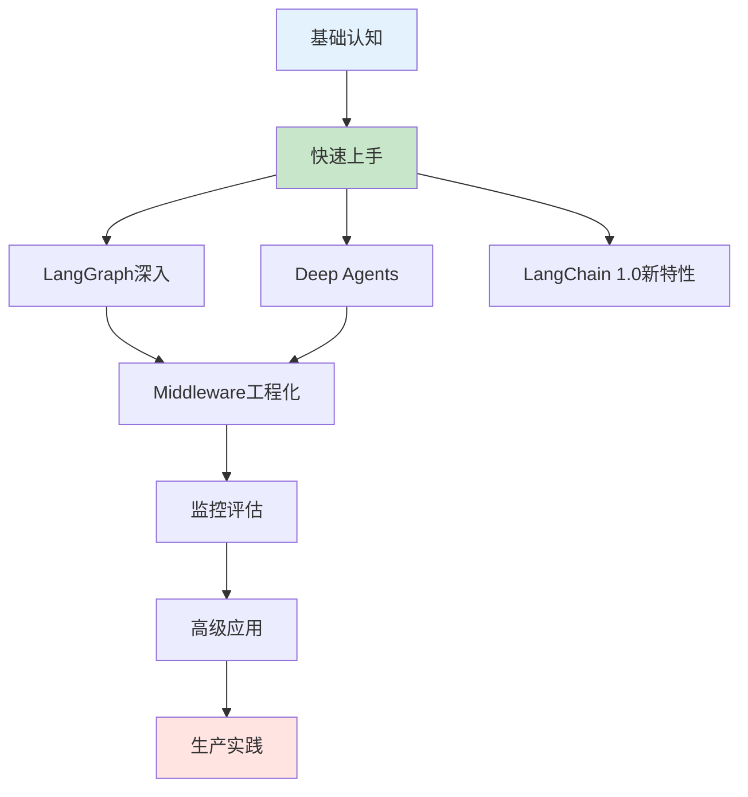

# LangChain 学习笔记完整指南

> 基于 LangChain 1.0.5 版本，覆盖从基础到生产的完整知识体系

## 📚 笔记结构

本笔记体系共 9 篇，按照循序渐进的方式组织，适合不同水平的学习者：

### 🎯 学习路径导航



---

## 📖 章节索引

### [第一篇：基础认知](第一篇%20基础认知.md)
**适合人群**：初学者、架构师
**预计时间**：2-3 小时

- **第1章：LangChain生态全景**
  - 架构层次关系
  - LangChain vs LangGraph vs Deep Agents
  - 技术选型决策树
  - 核心设计理念

- **第2章：核心抽象 - Runnable与LCEL**
  - Runnable Protocol 详解
  - LCEL 声明式语法
  - 性能优化基准
  - 实战示例

### [第二篇：快速上手实战](第二篇%20快速上手实战.md)
**适合人群**：所有开发者
**预计时间**：4-6 小时

- **第3章：Message与Tools基础**
  - 统一消息系统（HumanMessage、AIMessage、SystemMessage、ToolMessage）
  - Content Blocks 跨Provider方案
  - 工具定义三种方式对比
  - 并行工具调用机制

- **第4章：create_agent快速构建**
  - Agent工厂函数详解
  - 内置Middleware使用
  - 结构化输出管理
  - Human-in-the-Loop实现

- **第5章：RAG Agent实战**
  - 完整RAG流程（离线+在线）
  - 文档分块策略
  - 向量数据库集成（Chroma新版API）
  - 检索优化技巧

- **第6章：SQL Agent实战**
  - 数据库安全架构
  - 工具集设计
  - 人工审批流程
  - 生产级防护

### [第三篇：LangGraph深入](第三篇%20LangGraph%20深入.md)
**适合人群**：进阶开发者
**预计时间**：6-8 小时

- **第7章：LangGraph核心原理**
  - 状态机思维
  - Graph、Node、Edge概念
  - StateGraph构建

- **第8章：高级工作流设计**
  - 条件路由实现
  - 循环与递归
  - 并行执行
  - 子图嵌套

- **第9章：LangGraph Studio**
  - 可视化调试
  - 实时监控
  - 版本管理

### [第四篇：Deep Agents](第四篇%20Deep%20Agents.md)
**适合人群**：复杂任务开发者
**预计时间**：3-4 小时

- **第10章：Deep Agents架构**
  - 与create_agent的区别
  - 三大自动Middleware
  - 内置工具集
  - 适用场景分析
  - 实战案例（研究任务、代码分析、数据处理）

### [第五篇：Middleware工程化](第五篇%20Middleware%20工程化.md)
**适合人群**：架构师、高级开发者
**预计时间**：5-6 小时

- **第11章：Middleware体系与内置组件**
  - Context Engineering原理
  - 六大Hook执行链
  - 11个内置Middleware详解
  - 执行顺序规则

- **第12章：自定义Middleware开发**
  - 开发规范
  - 常见模式（日志、安全、优化、路由）
  - 测试框架
  - 高级技巧

### [第六篇：监控评估](第六篇%20监控评估.md)
**适合人群**：DevOps、QA
**预计时间**：3-4 小时

- **第13章：LangSmith Tracing与Evaluation**
  - 追踪原理与配置
  - Dataset管理
  - Evaluator类型
  - 批量测试
  - 持续优化流程

### [第七篇：高级应用](第七篇%20高级应用.md)
**适合人群**：资深开发者
**预计时间**：6-8 小时

- **第14章：多Agent协作**
  - Supervisor-Worker模式
  - Pipeline模式
  - Hierarchical模式
  - Network模式
  - 消息传递机制

- **第15章：MCP集成与多模态**
  - MCP协议详解
  - 多数据源统一访问
  - 图像处理
  - 音频处理
  - 视频分析

### [第八篇：生产实践](第八篇%20生产实践.md)
**适合人群**：架构师、运维工程师
**预计时间**：8-10 小时

- **第16章：生产实践精要**
  - RAG架构设计（五层架构）
  - Multi-Agent架构选择
  - 性能优化（延迟、吞吐、成本）
  - 防护体系（Guardrails、PII、合规）
  - 部署运维（容器化、Serverless、监控）

### [第九章：LangChain 1.0新特性](第九章%20LangChain%201.0%20新特性.md) ⭐ 新增
**适合人群**：所有开发者
**预计时间**：2-3 小时

- 版本承诺与稳定性
- MCP (Model Context Protocol) 集成
- 流式输出与JSON Mode
- 工具并行调用优化
- Content Blocks统一格式
- 性能优化特性
- LangGraph 1.0集成
- 生产部署增强
- 迁移指南

---

## 🚀 快速开始

### 环境准备

```bash
# Python 版本要求
python --version  # 需要 >= 3.10

# 安装依赖
pip install langchain>=1.0.5
pip install langchain-openai
pip install langchain-anthropic
pip install langchain-community
pip install langchain-chroma
pip install langgraph

# 设置环境变量
export OPENAI_API_KEY="sk-..."
export LANGCHAIN_API_KEY="ls-..."
export LANGCHAIN_TRACING_V2="true"
```

### 第一个示例

```python
from langchain.agents import create_agent
from langchain_openai import ChatOpenAI
from langchain.tools import tool

@tool
def greet(name: str) -> str:
    """问候工具"""
    return f"你好，{name}！"

# 创建 Agent
agent = create_agent(
    model=ChatOpenAI(model="gpt-4o-mini"),
    tools=[greet],
    system_prompt="你是友好的助手"
)

# 运行
response = agent.invoke({
    "messages": [("user", "请问候 Alice")]
})
print(response["messages"][-1].content)
```

---

## 📊 学习建议

### 初学者路线（1-2周）
1. ✅ 第一篇：理解生态和概念
2. ✅ 第二篇（第3-4章）：掌握基础用法
3. ✅ 第九章：了解最新特性
4. ✅ 第二篇（第5章）：实战RAG系统

### 进阶开发者（2-4周）
1. ✅ 完整学习第二篇
2. ✅ 第三篇：深入LangGraph
3. ✅ 第五篇：掌握Middleware
4. ✅ 第六篇：学习监控评估

### 架构师路线（持续深化）
1. ✅ 系统学习所有章节
2. ✅ 重点关注第八篇生产实践
3. ✅ 深入研究第七篇高级应用
4. ✅ 参与开源项目实战

---

## 🛠️ 实用工具

### 调试工具
- **LangSmith**: 追踪和调试
- **LangGraph Studio**: 可视化编排
- **Claude Code**: AI辅助开发

### 常用命令

```bash
# 运行测试
pytest tests/

# 启动本地服务
langchain serve

# 部署到云端
langchain deploy --name my-agent

# 查看追踪
open https://smith.langchain.com
```

---

## 📝 更新记录

查看 [更新日志](更新日志.md) 了解最新变更。

---

## 🤝 贡献指南

欢迎提交 Issue 和 PR 来完善这份笔记：
- 修正错误
- 补充示例
- 分享最佳实践
- 更新版本变化

---

## 📚 参考资源

### 官方文档
- [LangChain Python Docs](https://python.langchain.com)
- [LangGraph Docs](https://langchain-ai.github.io/langgraph/)
- [LangSmith Docs](https://docs.smith.langchain.com)

### 社区资源
- [GitHub Repo](https://github.com/langchain-ai/langchain)
- [Discord Community](https://discord.gg/langchain)
- [YouTube Channel](https://www.youtube.com/@LangChain)

### 相关项目
- [Awesome LangChain](https://github.com/kyrolabs/awesome-langchain)
- [LangChain Templates](https://github.com/langchain-ai/langchain/tree/master/templates)

---

## ⚖️ 许可证

本笔记采用 CC BY-SA 4.0 许可证。您可以自由分享和改编，但需要注明出处并以相同方式共享。

---

## 🙏 致谢

感谢 LangChain 团队和社区的贡献者们，让 AI 应用开发变得更加简单和强大。

---

**最后更新**: 2025-11-11
**LangChain 版本**: 1.0.5
**作者**: LangChain 学习社区