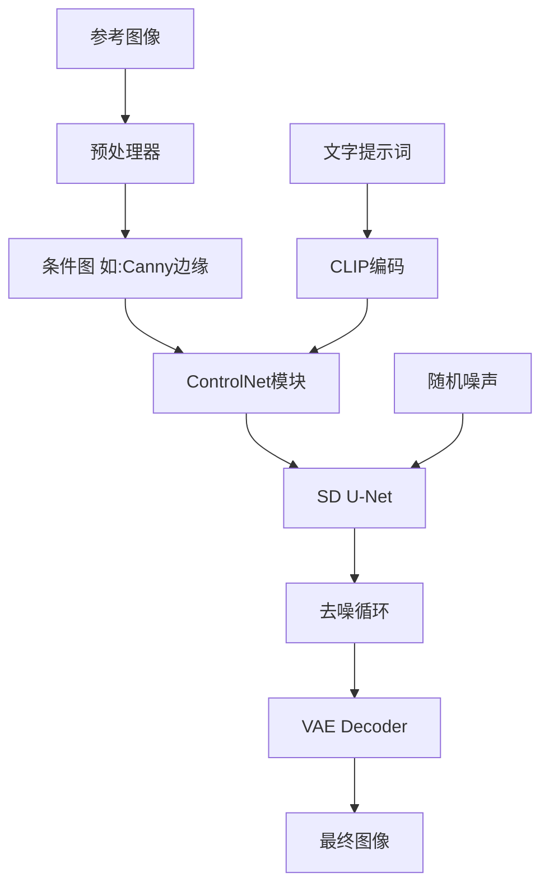

# 第13章 精准控制(一) ControlNet全系列精通

> **学习目标**: 完全掌握ControlNet的12种控制模型,实现精准可控图像生成
>
> **难度**: ⭐⭐⭐⭐
> **学习周期**: 1-2周
> **推荐度**: ⭐⭐⭐⭐⭐ (核心技能,必学!)

---

## 13.1 ControlNet革命性价值

### 13.1.1 为什么ControlNet是SD最重要的创新?

**传统SD生成的痛点**:
```
问题: 只能用文字描述,无法精准控制

场景1 - 特定姿势:
提示词: "a person doing a specific yoga pose"
结果: 姿势随机,无法复现特定动作

场景2 - 保持构图:
需求: 同一构图,换不同风格/服装
传统SD: 几乎不可能,每次生成构图都变

场景3 - 参考图风格:
需求: 模仿某张图的构图/姿态
传统SD: 只能文字描述,无法精准复现
```

**ControlNet的革命性**:
```
核心思想: 用"条件图像"精准引导生成

ControlNet = 文字提示词 + 结构化条件图像

结果:
✅ 姿势100%可控 (OpenPose)
✅ 构图100%可控 (Canny/Depth)
✅ 风格转换保持结构 (Canny/Lineart)
✅ 角色一致性 (Reference)
✅ 精准局部控制 (Seg/Tile)
```

**对比示例**:
```python
# 无ControlNet
prompt = "a fitness coach demonstrating a squat"
generate(prompt)
→ 结果: 教练姿势随机,可能站着/坐着/各种动作

# 有ControlNet (OpenPose)
reference_pose_image = "squat_pose_skeleton.png"  # 骨架图
prompt = "a fitness coach in modern gym"
generate(prompt, controlnet_openpose=reference_pose_image)
→ 结果: 教练精准复现参考图的深蹲姿势,100%可控!
```

### 13.1.2 ControlNet工作原理

**技术架构**:



**数学原理 (简化)**:

传统SD的扩散过程:
$$
x_{t-1} = \sqrt{\alpha_{t-1}} \cdot \text{pred}_{x_0} + \sqrt{1-\alpha_{t-1}} \cdot \epsilon
$$

ControlNet增强:
$$
x_{t-1} = \sqrt{\alpha_{t-1}} \cdot \text{pred}_{x_0} + \sqrt{1-\alpha_{t-1}} \cdot \epsilon + \lambda \cdot \text{ControlNet}(c)
$$

其中:
- $c$ 是条件图像 (如Canny边缘图)
- $\lambda$ 是控制强度权重
- $\text{ControlNet}(c)$ 是条件引导项

**关键要素**:
1. **预处理器 (Preprocessor)**: 将参考图转换为条件图
   - 例: 彩色照片 → Canny边缘图
2. **ControlNet模型**: 理解条件图并引导生成
3. **控制权重**: 调节条件影响强度 (0.0-2.0)

---

## 13.2 12种ControlNet模型完全解析

### 13.2.1 Canny - 边缘检测 (最常用)

**用途**: 保持边缘轮廓,改变内容填充

**原理**: 提取参考图的边缘线条,生成图像遵循这些边缘

**适用场景**:
- 保持建筑轮廓,改变建筑风格
- 保持人物轮廓,换服装/风格
- 保持产品外形,换材质/颜色

**预处理器**:
```python
from controlnet_aux import CannyDetector

canny = CannyDetector()

# 参数
canny_image = canny(
    input_image,
    low_threshold=100,   # 低阈值 (建议: 50-150)
    high_threshold=200   # 高阈值 (建议: 150-250)
)

# 阈值调节:
# 低阈值: 检测更多细节,边缘更丰富
# 高阈值: 仅检测主要轮廓,更简洁
```

**WebUI实战**:
```yaml
步骤:
1. 启用ControlNet
2. 上传参考图
3. 选择预处理器: canny
4. 调节参数:
   - Canny Low: 100
   - Canny High: 200
5. 选择模型: control_v11p_sd15_canny
6. 设置权重: 0.8-1.0 (高权重保证边缘一致)
7. 输入提示词
8. 生成

示例提示词:
"modern architectural design, glass and steel,
 futuristic style, blue sky background"
(参考图是传统建筑,生成现代风格但保持轮廓)
```

**ComfyUI节点配置**:
```json
{
  "CannyPreprocessor": {
    "image": "input_image",
    "low_threshold": 100,
    "high_threshold": 200
  },
  "ControlNetApply": {
    "conditioning": "clip_text_encode",
    "control_net": "control_canny",
    "image": "canny_output",
    "strength": 0.9
  }
}
```

**参数调优**:
| 参数 | 范围 | 效果 | 推荐值 |
|------|------|------|--------|
| Low Threshold | 50-150 | 值越低,检测越多细节 | 100 |
| High Threshold | 150-300 | 值越高,仅保留主轮廓 | 200 |
| Control Weight | 0.5-1.5 | 边缘遵循强度 | 0.8-1.0 |
| Start/End | 0-1.0 | 控制生效的去噪步骤区间 | 0.0-0.8 |

**案例: 产品换色**
```python
# 场景: 黑色Nike鞋 → 红色Nike鞋 (保持款式)

import cv2
from PIL import Image
from diffusers import StableDiffusionControlNetPipeline, ControlNetModel
from controlnet_aux import CannyDetector

# 1. 预处理
canny_detector = CannyDetector()
reference_image = Image.open("black_nike_shoe.jpg")
canny_image = canny_detector(reference_image, low_threshold=100, high_threshold=200)

# 2. 加载模型
controlnet = ControlNetModel.from_pretrained(
    "lllyasviel/control_v11p_sd15_canny"
)
pipe = StableDiffusionControlNetPipeline.from_pretrained(
    "runwayml/stable-diffusion-v1-5",
    controlnet=controlnet
)

# 3. 生成
prompt = "red Nike running shoe, product photography, white background, professional lighting"
negative = "low quality, blurry, deformed"

output = pipe(
    prompt=prompt,
    negative_prompt=negative,
    image=canny_image,
    num_inference_steps=30,
    controlnet_conditioning_scale=0.9  # 高权重保证形状一致
).images[0]

output.save("red_nike_shoe.png")
```

---

### 13.2.2 Depth - 深度图控制

**用途**: 保持空间深度关系,改变内容

**原理**: 提取场景深度信息,生成图像遵循相同的空间结构

**适用场景**:
- 室内设计: 保持房间布局,换装修风格
- 场景重建: 保持空间结构,换季节/天气
- 产品渲染: 保持摆放位置,换产品类型

**预处理器** (2种):
```python
from controlnet_aux import MidasDetector, ZoeDetector

# 方法1: Midas (经典,速度快)
midas = MidasDetector.from_pretrained("lllyasviel/Annotators")
depth_midas = midas(image)

# 方法2: Zoe (新版,精度更高)
zoe = ZoeDetector.from_pretrained("lllyasviel/Annotators")
depth_zoe = zoe(image)

# 推荐: Zoe用于重要项目,Midas用于快速测试
```

**WebUI配置**:
```yaml
预处理器: depth_midas / depth_zoe
模型: control_v11f1p_sd15_depth
权重: 0.6-0.8 (适中权重,避免过度约束)
```

**案例: 室内设计风格迁移**
```python
# 场景: 现代简约客厅 → 复古工业风客厅 (保持布局)

from diffusers import StableDiffusionControlNetPipeline, ControlNetModel
from controlnet_aux import ZoeDetector

# 预处理
zoe = ZoeDetector.from_pretrained("lllyasviel/Annotators")
reference_room = Image.open("modern_living_room.jpg")
depth_map = zoe(reference_room)

# 生成
controlnet = ControlNetModel.from_pretrained(
    "lllyasviel/control_v11f1p_sd15_depth"
)
pipe = StableDiffusionControlNetPipeline.from_pretrained(
    "runwayml/stable-diffusion-v1-5",
    controlnet=controlnet
)

prompt = """
industrial loft living room, exposed brick walls,
metal fixtures, vintage leather furniture,
Edison bulb lighting, rustic wood floors,
warm atmospheric lighting
"""

output = pipe(
    prompt=prompt,
    image=depth_map,
    num_inference_steps=40,
    controlnet_conditioning_scale=0.7  # 中等权重
).images[0]
```

**Depth vs Canny对比**:
| 维度 | Canny | Depth |
|------|-------|-------|
| 保留信息 | 边缘线条 | 空间深度 |
| 适用场景 | 外形轮廓重要 | 空间布局重要 |
| 灵活度 | 较严格 | 较宽松 |
| 典型用途 | 风格转换 | 场景重建 |

---

### 13.2.3 OpenPose - 人体姿态控制 (最强大)

**用途**: 精准控制人物姿势,100%复现动作

**原理**: 检测人体关键点 (骨架),生成图像复现相同姿势

**适用场景**:
- 健身教学: 展示标准动作姿势
- 角色设计: 同一姿势,不同角色
- 动作参考: 从真人照片提取姿势,应用到绘画

**人体关键点**:
```
OpenPose检测18/25个关键点:

头部: 鼻子、眼睛、耳朵
躯干: 颈部、肩膀、胸部、腰部
手臂: 肘部、手腕
手部: (可选) 21个手指关键点
腿部: 髋部、膝盖、脚踝
脚部: (可选) 脚趾关键点
```

**预处理器**:
```python
from controlnet_aux import OpenposeDetector

openpose = OpenposeDetector.from_pretrained("lllyasviel/Annotators")

pose_image = openpose(
    input_image,
    hand_and_face=True,  # 是否检测手部和面部细节
    resolution=512
)

# hand_and_face=True: 更精细(手指/五官)但速度慢
# hand_and_face=False: 仅身体骨架,速度快
```

**WebUI配置**:
```yaml
预处理器: openpose / openpose_full (含手部)
模型: control_v11p_sd15_openpose
权重: 0.8-1.2 (高权重确保姿势准确)

推荐参数:
- CFG Scale: 7-9 (较高,确保姿势遵循)
- Steps: 30-40
```

**案例: 健身动作教学图生成**
```python
# 需求: 生成标准深蹲姿势的教学图

from diffusers import StableDiffusionControlNetPipeline, ControlNetModel
from controlnet_aux import OpenposeDetector
from PIL import Image

# 1. 从真人照片提取姿势
reference_photo = Image.open("real_squat_photo.jpg")
openpose = OpenposeDetector.from_pretrained("lllyasviel/Annotators")
pose_skeleton = openpose(reference_photo, hand_and_face=False)

# 保存骨架图(可复用)
pose_skeleton.save("squat_pose_skeleton.png")

# 2. 基于骨架生成不同角色
controlnet = ControlNetModel.from_pretrained(
    "lllyasviel/control_v11p_sd15_openpose"
)
pipe = StableDiffusionControlNetPipeline.from_pretrained(
    "runwayml/stable-diffusion-v1-5",
    controlnet=controlnet
)

# 生成: 男性教练版
prompt_male = """
professional male fitness coach demonstrating squat,
athletic build, wearing black Nike training outfit,
modern gym background, clean and professional,
instructional photography style
"""

image_male = pipe(
    prompt=prompt_male,
    image=pose_skeleton,
    num_inference_steps=35,
    controlnet_conditioning_scale=1.0  # 满权重,姿势必须精准
).images[0]

# 生成: 女性教练版 (相同姿势!)
prompt_female = """
professional female fitness coach demonstrating squat,
athletic build, wearing sports bra and leggings,
modern gym background, motivational and inspiring,
editorial fitness photography
"""

image_female = pipe(
    prompt=prompt_female,
    image=pose_skeleton,  # 复用相同骨架
    num_inference_steps=35,
    controlnet_conditioning_scale=1.0
).images[0]

# 结果: 两张图人物不同,但深蹲姿势完全一致!
```

**多人场景**:
```python
# OpenPose支持多人检测
group_photo = Image.open("group_workout.jpg")  # 5个人健身
pose_group = openpose(group_photo)

# 生成时会保持所有人的姿势
prompt = "fitness class in modern studio, diverse group, energetic atmosphere"
output = pipe(prompt=prompt, image=pose_group, ...).images[0]
# 结果: 5个人,姿势与参考图一致
```

---

### 13.2.4 Lineart - 线稿控制

**用途**: 从线稿生成彩色图像,适合插画/漫画

**原理**: 提取或使用线稿,生成遵循线条的彩色作品

**适用场景**:
- 插画上色: 线稿 → 彩色插画
- 漫画着色: 黑白漫画 → 彩色版
- 概念草图: 手绘草图 → 精美渲染图

**预处理器** (3种):
```python
from controlnet_aux import LineartDetector, LineartAnimeDetector

# 1. lineart (通用)
lineart = LineartDetector.from_pretrained("lllyasviel/Annotators")
lineart_image = lineart(photo)

# 2. lineart_anime (动漫风格优化)
lineart_anime = LineartAnimeDetector.from_pretrained("lllyasviel/Annotators")
lineart_anime_image = lineart_anime(anime_image)

# 3. lineart_coarse (粗略线稿)
# 适合手绘草图
```

**案例: 线稿上色**
```python
# 场景: 手绘健身角色草图 → 精美彩色插画

from PIL import Image
from diffusers import StableDiffusionControlNetPipeline, ControlNetModel

# 假设已有线稿(手绘或软件绘制)
lineart_sketch = Image.open("character_lineart.png")  # 黑白线稿

controlnet = ControlNetModel.from_pretrained(
    "lllyasviel/control_v11p_sd15_lineart"
)
pipe = StableDiffusionControlNetPipeline.from_pretrained(
    "runwayml/stable-diffusion-v1-5",
    controlnet=controlnet
)

prompt = """
anime style illustration, athletic female character,
vibrant colors, dynamic pose, detailed shading,
colorful background with gym equipment,
professional digital art
"""

colored_illustration = pipe(
    prompt=prompt,
    image=lineart_sketch,
    num_inference_steps=40,
    controlnet_conditioning_scale=0.7  # 适中权重,保留艺术性
).images[0]
```

---

### 13.2.5 Scribble - 草图控制

**用途**: 从极简草图生成完整图像

**原理**: 接受粗糙涂鸦/草图,理解大致布局后生成

**适用场景**:
- 快速概念设计: 几笔草图 → 完整概念图
- 创意探索: 随意涂鸦 → 惊喜结果
- 布局控制: 简单线条指定位置

**预处理器**:
```python
from controlnet_aux import HEDdetector, PidiNetDetector

# 1. scribble_hed
hed = HEDdetector.from_pretrained("lllyasviel/Annotators")
scribble = hed(image, scribble=True)

# 2. 直接使用手绘草图(不需要预处理)
# 用画图软件随意画几笔,黑色背景白色线条
```

**示例**:
```python
# 场景: 5秒涂鸦 → 完整健身房场景

# 1. 用任意工具画草图:
#    - 几条竖线代表器材
#    - 一个圆圈代表人
#    - 几条横线代表地板

scribble_image = Image.open("quick_scribble.png")

# 2. 生成
prompt = "modern fitness gym interior, professional equipment, bright lighting"
output = pipe(
    prompt=prompt,
    image=scribble_image,
    controlnet_conditioning_scale=0.5  # 低权重,给AI更多创作空间
).images[0]

# 结果: 从粗糙草图生成专业健身房场景
```

---

### 13.2.6 Seg - 语义分割控制

**用途**: 精确控制图像各区域内容 (像PS选区填充)

**原理**: 用不同颜色标注各区域(天空/建筑/人物等),分别填充内容

**适用场景**:
- 精准场景设计: 指定每块区域放什么
- 复杂合成: 多元素精确布局
- 局部替换: 仅改变特定区域

**预处理器**:
```python
from controlnet_aux import SamDetector

# Segment Anything Model
sam = SamDetector.from_pretrained("ybelkada/segment-anything")
seg_map = sam(image)

# 或手动绘制分割图 (更精准)
# 用不同纯色标注各区域:
# 蓝色 = 天空
# 绿色 = 草地
# 红色 = 人物
# 灰色 = 建筑
```

**案例: 健身场景分区设计**
```python
# 场景: 精确控制健身房各区域

# 1. 手动绘制分割图 (用PS/Photopea)
# - 左侧 (红色): 人物区域
# - 中间 (灰色): 器材区域
# - 右侧 (蓝色): 窗户区域
# - 下方 (黑色): 地板区域
seg_map = Image.open("gym_segmentation.png")

# 2. 生成
prompt = """
LEFT (red area): muscular athlete doing bench press,
CENTER (gray area): professional gym equipment and weights,
RIGHT (blue area): large windows with city view,
BOTTOM (black area): rubber gym flooring,
photorealistic, dramatic lighting
"""

output = pipe(
    prompt=prompt,
    image=seg_map,
    controlnet_conditioning_scale=0.8
).images[0]

# 结果: 各区域内容精准控制
```

---

### 13.2.7 Normal Map - 法线贴图控制

**用途**: 保持表面细节方向,适合3D渲染风格转换

**原理**: 使用法线贴图(记录表面凹凸方向),生成保持细节的新图

**适用场景**:
- 3D资产风格转换
- 游戏美术: 保持模型细节,换材质
- 建筑: 保持结构纹理,换风格

**预处理器**:
```python
from controlnet_aux import NormalBaeDetector

normal_detector = NormalBaeDetector.from_pretrained("lllyasviel/Annotators")
normal_map = normal_detector(image)
```

**典型用途**:
```python
# 3D人物模型 → 2D插画 (保持肌肉细节)
prompt = "anime style illustration, maintaining muscle definition and surface details"
```

---

### 13.2.8 MLSD - 直线检测

**用途**: 保持直线结构,适合建筑/室内

**原理**: 检测图像中的直线(墙壁/门窗/家具边缘),生成遵循这些直线

**适用场景**:
- 建筑设计
- 室内设计
- 几何构图

**预处理器**:
```python
from controlnet_aux import MLSDdetector

mlsd = MLSDdetector.from_pretrained("lllyasviel/Annotators")
mlsd_image = mlsd(image)
```

**案例**:
```python
# 传统健身房 → 现代健身房 (保持房间结构线条)
reference = Image.open("old_gym.jpg")
mlsd_lines = mlsd(reference)

prompt = "modern minimalist gym interior, clean lines, white walls, glass partitions"
output = pipe(prompt=prompt, image=mlsd_lines, ...).images[0]
```

---

### 13.2.9 Tile - 纹理细节控制

**用途**: 图像放大/增强细节

**原理**: 以小块(tile)为单位增强细节,适合upscale

**适用场景**:
- 图像超分辨率
- 细节增强
- 模糊图片修复

**WebUI中使用**:
```yaml
场景: 512×512图片 → 2048×2048高清

步骤:
1. img2img模式
2. 上传512×512图片
3. 输出尺寸设为2048×2048
4. 启用ControlNet Tile
5. Denoising strength: 0.3-0.5 (低值保持原图)
6. Control weight: 0.8-1.0
7. 生成

结果: 清晰4倍放大,细节增强
```

---

### 13.2.10 Shuffle - 颜色保留控制

**用途**: 打乱内容但保留配色

**原理**: 提取颜色分布,生成全新内容但色调一致

**适用场景**:
- 保持品牌色
- 配色参考
- 创意探索

**示例**:
```python
# 保留Nike橙色+黑色配色,生成全新健身场景
prompt = "creative fitness scene, abstract composition"
# 结果: 完全不同场景,但颜色与参考图一致
```

---

### 13.2.11 IP-Adapter - 风格/概念参考

**用途**: 参考图像的整体风格/氛围,不限于结构

**原理**: 提取参考图的高层语义(风格/氛围/主题),应用到生成

**适用场景**:
- 风格迁移
- 氛围参考
- 概念延续

(详细讲解见第14章)

---

### 13.2.12 Reference - 参考图控制

**用途**: 综合参考图的结构+风格+色彩

**原理**: 全方位参考,生成相似但不完全相同的图

**模式**:
```
Reference Only: 仅参考风格
Reference Adain: 更强的风格迁移
Reference Attn: 结构+风格综合参考
```

---

## 13.3 多ControlNet组合技巧

### 13.3.1 为什么需要多ControlNet?

**单一ControlNet的局限**:
```
仅OpenPose: 姿势对了,但构图/背景难控制
仅Canny: 轮廓对了,但姿势/细节随机
仅Depth: 空间对了,但具体内容不可控
```

**多ControlNet组合**:
```
OpenPose + Canny:
- OpenPose控制人物姿势
- Canny控制背景轮廓
→ 人物姿势+场景构图双重精准

Depth + Lineart:
- Depth控制空间深度
- Lineart控制线条细节
→ 3D空间感+2D美术风格结合

Canny + Seg:
- Canny控制大致轮廓
- Seg控制各区域内容
→ 形状+内容分区精准控制
```

### 13.3.2 WebUI多ControlNet配置

```yaml
启用多ControlNet:
1. Settings → ControlNet → Multi ControlNet: Max models 设为3
2. 重启WebUI

使用:
ControlNet Unit 0:
  - 预处理器: openpose
  - 模型: control_openpose
  - 权重: 1.0
  - 参考图: pose_reference.png

ControlNet Unit 1:
  - 预处理器: canny
  - 模型: control_canny
  - 权重: 0.7
  - 参考图: background_reference.png

ControlNet Unit 2:
  - 预处理器: depth_zoe
  - 模型: control_depth
  - 权重: 0.5
  - 参考图: depth_reference.png

生成: 三重控制叠加
```

### 13.3.3 权重平衡技巧

```python
# 权重分配原则
WEIGHT_GUIDELINES = {
    "主要控制 (最重要)": 0.8-1.2,
    "次要控制": 0.5-0.8,
    "辅助控制": 0.3-0.5
}

# 案例: 健身教学图
ControlNet组合:
1. OpenPose (权重=1.0) - 主控: 姿势必须准确
2. Canny (权重=0.6) - 次控: 背景器材轮廓
3. Depth (权重=0.3) - 辅助: 空间深度感

# 如果权重冲突:
# 症状: 生成失败或图像扭曲
# 解决: 降低次要ControlNet权重,或移除一个
```

### 13.3.4 ComfyUI多ControlNet工作流

```python
# 伪代码展示逻辑
checkpoint = LoadCheckpoint("sd15_model.safetensors")

# Conditioning 1: OpenPose
pose_image = OpenposePreprocessor(reference_pose)
pose_control = ControlNetApply(
    conditioning=clip_encode(prompt),
    control_net=ControlNetLoader("openpose"),
    image=pose_image,
    strength=1.0
)

# Conditioning 2: Canny
canny_image = CannyPreprocessor(reference_bg, low=100, high=200)
canny_control = ControlNetApply(
    conditioning=pose_control,  # 叠加在pose之上
    control_net=ControlNetLoader("canny"),
    image=canny_image,
    strength=0.7
)

# Sampling
result = KSampler(
    model=checkpoint,
    positive=canny_control,  # 最终叠加的conditioning
    negative=clip_encode(negative_prompt),
    ...
)
```

---

## 13.4 实战项目: 健身动作标准化教学图

### 13.4.1 项目目标

```
需求: 生成10个标准健身动作的教学示意图

要求:
1. 姿势必须精准 (使用OpenPose)
2. 背景统一风格 (现代健身房)
3. 光线一致 (使用Depth控制)
4. 人物形象一致 (IP-Adapter, 第14章)

动作列表:
- 深蹲 (Squat)
- 硬拉 (Deadlift)
- 卧推 (Bench Press)
- 引体向上 (Pull-up)
- 俯卧撑 (Push-up)
- ...
```

### 13.4.2 工作流设计

```python
from diffusers import StableDiffusionControlNetPipeline, ControlNetModel, UniPCMultistepScheduler
from controlnet_aux import OpenposeDetector
from PIL import Image
import torch

class FitnessTeachingImageGenerator:
    """健身教学图生成器"""

    def __init__(self):
        # 加载ControlNet
        self.controlnet_openpose = ControlNetModel.from_pretrained(
            "lllyasviel/control_v11p_sd15_openpose"
        )

        # 加载Pipeline
        self.pipe = StableDiffusionControlNetPipeline.from_pretrained(
            "runwayml/stable-diffusion-v1-5",
            controlnet=[self.controlnet_openpose],
            torch_dtype=torch.float16,
            safety_checker=None
        ).to("cuda")

        # 优化采样器
        self.pipe.scheduler = UniPCMultistepScheduler.from_config(
            self.pipe.scheduler.config
        )

        # 加载OpenPose检测器
        self.openpose = OpenposeDetector.from_pretrained("lllyasviel/Annotators")

    def extract_pose_from_photo(self, photo_path, save_skeleton=True):
        """从真人照片提取姿势骨架"""
        photo = Image.open(photo_path)
        skeleton = self.openpose(photo, hand_and_face=False)

        if save_skeleton:
            skeleton_path = photo_path.replace(".jpg", "_skeleton.png")
            skeleton.save(skeleton_path)
            print(f"Skeleton saved: {skeleton_path}")

        return skeleton

    def generate_teaching_image(
        self,
        exercise_name,
        pose_skeleton,
        gender="male",
        style="professional"
    ):
        """生成教学图"""

        # 提示词模板
        base_prompt = f"""
        professional fitness instructor demonstrating {exercise_name},
        {{gender_desc}}, athletic build, wearing {{outfit}},
        modern gym background with equipment,
        clean and professional lighting,
        instructional photography style,
        high quality, detailed
        """

        gender_config = {
            "male": {
                "gender_desc": "muscular male coach",
                "outfit": "black Nike training t-shirt and shorts"
            },
            "female": {
                "gender_desc": "athletic female coach",
                "outfit": "sports bra and leggings"
            }
        }

        prompt = base_prompt.format(
            gender_desc=gender_config[gender]["gender_desc"],
            outfit=gender_config[gender]["outfit"]
        )

        negative_prompt = """
        low quality, blurry, distorted body, extra limbs,
        deformed, ugly, bad anatomy, bad proportions,
        watermark, signature, text
        """

        # 生成
        output = self.pipe(
            prompt=prompt,
            negative_prompt=negative_prompt,
            image=[pose_skeleton],
            num_inference_steps=35,
            guidance_scale=8.0,
            controlnet_conditioning_scale=[1.0],  # OpenPose满权重
            generator=torch.Generator("cuda").manual_seed(42)  # 固定seed保证一致性
        ).images[0]

        return output

    def batch_generate_exercises(self, exercises_config):
        """批量生成"""
        results = []

        for config in exercises_config:
            print(f"\n生成: {config['name']}...")

            # 1. 提取姿势 (如果是真人照片)
            if config.get("reference_photo"):
                skeleton = self.extract_pose_from_photo(config["reference_photo"])
            else:
                skeleton = Image.open(config["skeleton_path"])

            # 2. 生成
            output = self.generate_teaching_image(
                exercise_name=config["name"],
                pose_skeleton=skeleton,
                gender=config.get("gender", "male")
            )

            # 3. 保存
            output_path = f"output/{config['name']}_teaching.png"
            output.save(output_path)
            print(f"✓ 已保存: {output_path}")

            results.append({
                "exercise": config["name"],
                "path": output_path
            })

        return results

# 使用示例
generator = FitnessTeachingImageGenerator()

exercises = [
    {
        "name": "squat",
        "reference_photo": "references/squat_photo.jpg",
        "gender": "male"
    },
    {
        "name": "deadlift",
        "reference_photo": "references/deadlift_photo.jpg",
        "gender": "male"
    },
    {
        "name": "yoga_tree_pose",
        "reference_photo": "references/yoga_photo.jpg",
        "gender": "female"
    },
    # ... 更多动作
]

results = generator.batch_generate_exercises(exercises)

print(f"\n完成! 共生成 {len(results)} 张教学图")
```

---

## 13.5 进阶技巧

### 13.5.1 Start/End控制 (分阶段控制)

```python
# 控制ControlNet在哪些去噪步骤生效

# 案例: 前期遵循结构,后期自由发挥
ControlNet Config:
  - Control Start: 0.0    # 从0%开始
  - Control End: 0.6      # 到60%结束

效果:
- 前60%去噪步骤: 严格遵循ControlNet
- 后40%: SD自由发挥,增加细节和美化

适用:
- 希望保持大致结构,但要更艺术化的结果
- 避免过度约束导致僵硬
```

### 13.5.2 ControlNet权重曲线

```python
# 某些实现支持动态权重
# 不同去噪阶段使用不同权重

from diffusers.utils import make_image_grid

# 伪代码
def dynamic_controlnet_weight(timestep, total_steps):
    """
    动态权重: 早期高权重,后期低权重
    """
    progress = timestep / total_steps
    if progress < 0.3:
        return 1.0  # 早期满权重
    elif progress < 0.7:
        return 0.7  # 中期中等
    else:
        return 0.3  # 后期低权重,让SD发挥
```

### 13.5.3 预处理器参数精细调节

```python
# 不同场景需要不同预处理参数

# 场景1: 建筑 (需要精确线条)
canny_architecture = CannyDetector()
canny_result = canny_architecture(
    image,
    low_threshold=50,   # 低阈值,检测更多细节
    high_threshold=150
)

# 场景2: 人物 (仅需主要轮廓)
canny_portrait = CannyDetector()
canny_result = canny_portrait(
    image,
    low_threshold=150,  # 高阈值,仅主要轮廓
    high_threshold=250
)

# OpenPose分辨率
openpose_lowres = openpose(image, resolution=384)   # 快速
openpose_hires = openpose(image, resolution=768)    # 精确

# Depth检测器选择
midas_depth = MidasDetector()(image)  # 快,泛化好
zoe_depth = ZoeDetector()(image)      # 慢,精度高
```

---

## 13.6 常见问题排查

### 问题1: ControlNet不生效

```
症状: 生成图像完全忽略条件图

排查:
1. 检查权重是否过低 (< 0.3)
   → 提升到0.7-1.0

2. 检查Start/End范围
   → 确保 Start=0.0, End=0.8+

3. 检查条件图是否正确
   → 预处理器生成的图应该清晰可见结构

4. 检查模型匹配
   → Canny条件图必须用Canny模型,不能用OpenPose模型

5. CFG Scale过低
   → 提升到7-9
```

### 问题2: 生成图像扭曲/变形

```
症状: 身体扭曲,比例失调

原因:
- 多ControlNet权重冲突
- 参考图本身有问题
- 权重过高 (>1.5)

解决:
1. 降低次要ControlNet权重
2. 检查OpenPose骨架是否正常
3. 权重降到0.8-1.0区间
```

### 问题3: 细节丢失

```
症状: 生成图过于简化,缺少细节

解决:
1. 降低ControlNet权重 (给SD更多自由)
2. 提升Steps (30→50)
3. 使用Tile ControlNet增强细节
4. 调整Control End (如从1.0降到0.7)
```

---

## 13.7 总结

### 13.7.1 ControlNet模型选择速查表

| 需求 | 推荐模型 | 权重 | 难度 |
|------|---------|------|------|
| 保持姿势 | OpenPose | 1.0 | ⭐⭐ |
| 保持轮廓 | Canny | 0.8-1.0 | ⭐ |
| 保持空间结构 | Depth | 0.6-0.8 | ⭐⭐ |
| 线稿上色 | Lineart | 0.7 | ⭐ |
| 草图生成 | Scribble | 0.5 | ⭐ |
| 精准分区 | Seg | 0.8 | ⭐⭐⭐ |
| 建筑/室内 | MLSD | 0.7 | ⭐⭐ |
| 图像放大 | Tile | 0.8-1.0 | ⭐⭐ |
| 风格参考 | Reference | 0.6 | ⭐⭐⭐ |

### 13.7.2 学习路径建议

```
Week 1: 基础三大件
- Day 1-2: Canny (最简单)
- Day 3-4: OpenPose (最实用)
- Day 5-7: Depth (理解空间控制)

Week 2: 进阶应用
- Day 8-10: 多ControlNet组合
- Day 11-12: Lineart/Scribble (创意工具)
- Day 13-14: 实战项目 (完整工作流)

持续提升:
- 建立常用配置模板库
- 收集优质参考图
- 尝试不同预处理器参数
```

---

## 13.8 实战练习

### 练习1: OpenPose姿势复现
1. 找5张不同健身动作照片
2. 提取OpenPose骨架
3. 生成不同人物但姿势一致的图

### 练习2: Canny风格转换
1. 用建筑照片提取Canny边缘
2. 生成3种不同风格 (现代/古典/未来)
3. 对比边缘遵循度

### 练习3: 多ControlNet组合
1. 设计一个需要OpenPose+Canny的场景
2. 调试两者权重平衡
3. 生成满意结果

### 练习4: 完整项目
1. 制作5张教学图 (任意主题)
2. 使用至少2种ControlNet
3. 保证风格一致性

---

**下一章预告**: 第15章将深入LoRA训练,学习如何训练自己的风格/角色模型,实现完全定制化生成。

ControlNet是SD生态中最强大的工具之一,掌握它将让你的图像生成能力提升10倍以上!
