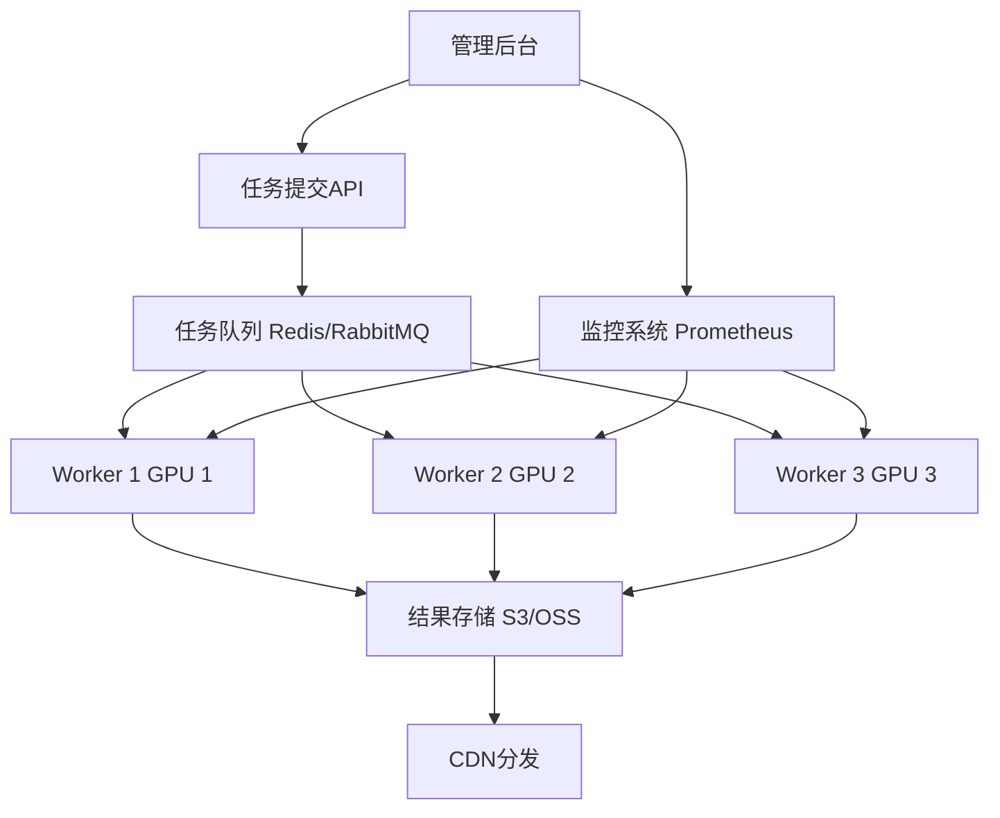

# 第33章 批量生产系统架构

> **学习目标**: 掌握AIGC批量生产系统的架构设计与实现
>
> **难度**: ⭐⭐⭐⭐
> **推荐度**: ⭐⭐⭐⭐⭐ (企业必备,规模化关键)

---

## 33.1 为什么需要批量系统?

**手工 vs 批量对比**:
```
手工生成 (WebUI一张一张点):
- 1张图: 30秒 (包括调参/下载)
- 100张图: 50分钟
- 1000张图: 8小时+ (不眠不休)
- 人工成本高,易出错,不可扩展

批量系统:
- 100张图: 10分钟 (6卡并行)
- 1000张图: 1.5小时
- 10000张图: 15小时
- 无人值守,自动重试,可扩展
```

**应用场景**:
- 电商: 日生成1000+产品图
- 游戏: 生成角色/场景资产
- 营销: 批量社交媒体配图
- 教育: 生成教学示意图库

---

## 33.2 系统架构设计

### 33.2.1 整体架构



### 33.2.2 核心组件

```python
# 1. 任务队列
from celery import Celery
from kombu import Queue

app = Celery(
    'aigc_tasks',
    broker='redis://localhost:6379/0',
    backend='redis://localhost:6379/1'
)

app.conf.task_queues = (
    Queue('sd_images', routing_key='sd.images'),
    Queue('videos', routing_key='videos'),
    Queue('audio', routing_key='audio'),
)

# 2. 任务定义
@app.task(bind=True, max_retries=3)
def generate_image_task(self, prompt, params):
    """
    图像生成任务

    参数:
        prompt: 提示词
        params: 生成参数 (model, size, cfg, steps等)
    """
    try:
        # 生成逻辑
        image = sd_pipeline.generate(
            prompt=prompt,
            **params
        )

        # 上传S3
        s3_url = upload_to_s3(image, f"images/{task_id}.png")

        return {
            "status": "success",
            "url": s3_url,
            "task_id": self.request.id
        }

    except Exception as e:
        # 重试机制
        if self.request.retries < self.max_retries:
            raise self.retry(exc=e, countdown=60)  # 60秒后重试
        else:
            return {
                "status": "failed",
                "error": str(e),
                "task_id": self.request.id
            }

# 3. Worker启动
# celery -A tasks worker --concurrency=2 --loglevel=info
```

---

## 33.3 SD批量生成系统实现

### 33.3.1 核心生成模块

```python
import torch
from diffusers import StableDiffusionPipeline, DPMSolverMultistepScheduler
from diffusers.utils import make_image_grid
import redis
import json
from pathlib import Path

class BatchImageGenerator:
    """批量图像生成器"""

    def __init__(
        self,
        model_path="runwayml/stable-diffusion-v1-5",
        device="cuda",
        redis_host="localhost"
    ):
        # 加载模型
        self.pipe = StableDiffusionPipeline.from_pretrained(
            model_path,
            torch_dtype=torch.float16,
            safety_checker=None
        ).to(device)

        # 优化
        self.pipe.scheduler = DPMSolverMultistepScheduler.from_config(
            self.pipe.scheduler.config
        )
        self.pipe.enable_xformers_memory_efficient_attention()

        # Redis连接
        self.redis = redis.Redis(host=redis_host, decode_responses=True)

    def generate_single(self, task_id, prompt, params):
        """单张生成"""
        try:
            # 更新状态
            self.redis.hset(f"task:{task_id}", "status", "processing")

            # 生成
            image = self.pipe(
                prompt=prompt,
                negative_prompt=params.get("negative_prompt", ""),
                num_inference_steps=params.get("steps", 30),
                guidance_scale=params.get("cfg", 7.0),
                width=params.get("width", 512),
                height=params.get("height", 512),
                generator=torch.Generator("cuda").manual_seed(
                    params.get("seed", -1)
                )
            ).images[0]

            # 保存
            output_path = f"output/{task_id}.png"
            image.save(output_path)

            # 更新结果
            self.redis.hset(f"task:{task_id}", mapping={
                "status": "completed",
                "output": output_path,
                "timestamp": time.time()
            })

            return output_path

        except Exception as e:
            self.redis.hset(f"task:{task_id}", mapping={
                "status": "failed",
                "error": str(e)
            })
            raise

    def batch_generate(self, task_list):
        """批量生成"""
        results = []

        for task in task_list:
            task_id = task["id"]
            prompt = task["prompt"]
            params = task.get("params", {})

            result = self.generate_single(task_id, prompt, params)
            results.append(result)

        return results

# 使用
generator = BatchImageGenerator()

tasks = [
    {
        "id": "task_001",
        "prompt": "a fitness coach in gym",
        "params": {"steps": 30, "cfg": 7.0}
    },
    {
        "id": "task_002",
        "prompt": "athlete doing squat",
        "params": {"steps": 35, "cfg": 8.0}
    },
    # ... 1000个任务
]

results = generator.batch_generate(tasks)
```

### 33.3.2 分布式Worker

```python
# worker.py
from celery import Celery
import torch

app = Celery('workers', broker='redis://localhost:6379/0')

# 每个worker独立GPU
GPU_ID = int(os.getenv("GPU_ID", 0))  # 从环境变量获取GPU ID
torch.cuda.set_device(GPU_ID)

# 加载模型 (每个worker独立)
pipe = StableDiffusionPipeline.from_pretrained(
    "sd_v1-5.safetensors",
    torch_dtype=torch.float16
).to(f"cuda:{GPU_ID}")

@app.task
def generate_image(task_id, prompt, params):
    """生成任务"""
    image = pipe(
        prompt=prompt,
        **params
    ).images[0]

    # 保存
    output_path = f"output/{task_id}.png"
    image.save(output_path)

    return {"task_id": task_id, "path": output_path}

# 启动多个worker (不同GPU)
# GPU 0: GPU_ID=0 celery -A worker worker -Q sd_images -n worker1@%h
# GPU 1: GPU_ID=1 celery -A worker worker -Q sd_images -n worker2@%h
# GPU 2: GPU_ID=2 celery -A worker worker -Q sd_images -n worker3@%h
```

### 33.3.3 任务提交API

```python
from fastapi import FastAPI, BackgroundTasks
from pydantic import BaseModel
import uuid

app = FastAPI()

class GenerationRequest(BaseModel):
    prompt: str
    negative_prompt: str = ""
    steps: int = 30
    cfg: float = 7.0
    width: int = 512
    height: int = 512
    count: int = 1  # 生成数量

@app.post("/api/generate")
async def create_generation_task(req: GenerationRequest):
    """创建生成任务"""

    task_ids = []

    for i in range(req.count):
        task_id = str(uuid.uuid4())

        # 提交到Celery队列
        generate_image.delay(
            task_id=task_id,
            prompt=req.prompt,
            params={
                "negative_prompt": req.negative_prompt,
                "num_inference_steps": req.steps,
                "guidance_scale": req.cfg,
                "width": req.width,
                "height": req.height
            }
        )

        task_ids.append(task_id)

    return {
        "status": "accepted",
        "task_ids": task_ids,
        "count": req.count
    }

@app.get("/api/task/{task_id}")
async def get_task_status(task_id: str):
    """查询任务状态"""
    task_data = redis_client.hgetall(f"task:{task_id}")

    if not task_data:
        return {"status": "not_found"}

    return task_data

@app.post("/api/batch")
async def batch_generate(tasks: List[GenerationRequest]):
    """批量提交"""
    all_task_ids = []

    for req in tasks:
        for i in range(req.count):
            task_id = str(uuid.uuid4())
            generate_image.delay(task_id, req.prompt, req.dict())
            all_task_ids.append(task_id)

    return {
        "status": "accepted",
        "total_tasks": len(all_task_ids),
        "task_ids": all_task_ids
    }

# 启动: uvicorn api:app --host 0.0.0.0 --port 8000
```

---

## 33.4 性能优化策略

### 33.4.1 GPU并行

```python
# 方案1: 多GPU并行 (推荐)
# 4张RTX 4090,每张独立worker

# worker_config.py
WORKERS = [
    {"gpu": 0, "concurrency": 2},  # GPU 0跑2个并发
    {"gpu": 1, "concurrency": 2},
    {"gpu": 2, "concurrency": 2},
    {"gpu": 3, "concurrency": 2}
]

# 启动脚本
for idx, config in enumerate(WORKERS):
    subprocess.Popen([
        "celery", "-A", "worker", "worker",
        "-Q", "sd_images",
        f"-n", f"worker{idx}@%h",
        "-c", str(config["concurrency"])
    ], env={"CUDA_VISIBLE_DEVICES": str(config["gpu"])})

# 理论吞吐量:
# 单GPU: 2张/分钟
# 4 GPU × 2并发 = 8并发
# 吞吐量: 16张/分钟 = 960张/小时
```

### 33.4.2 缓存优化

```python
# VAE Latent缓存
class CachedGenerator:
    def __init__(self):
        self.pipe = ...
        self.latent_cache = {}  # 缓存常用分辨率的latent

    def get_latent(self, width, height):
        key = f"{width}x{height}"

        if key not in self.latent_cache:
            # 生成并缓存
            latent = torch.randn(
                (1, 4, height//8, width//8),
                device="cuda",
                dtype=torch.float16
            )
            self.latent_cache[key] = latent

        return self.latent_cache[key].clone()

    def generate(self, prompt, width=512, height=512):
        latents = self.get_latent(width, height)
        # ... 使用缓存的latent生成
```

### 33.4.3 批处理

```python
# 批量处理相同参数的任务
class BatchProcessor:
    def __init__(self):
        self.pipe = ...
        self.batch_size = 4  # 根据VRAM调整

    def batch_generate(self, prompts, params):
        """
        同时生成多张 (相同参数)
        """
        images = []

        for i in range(0, len(prompts), self.batch_size):
            batch_prompts = prompts[i:i+self.batch_size]

            # 批量生成
            batch_images = self.pipe(
                prompt=batch_prompts,
                num_images_per_prompt=1,
                **params
            ).images

            images.extend(batch_images)

        return images

# 效率提升:
# 逐个生成: 4张 × 30秒 = 120秒
# 批量生成: 1批(4张) = 40秒
# 提升: 3倍
```

---

## 33.5 监控与告警

```python
# 监控指标
from prometheus_client import Counter, Histogram, Gauge
import time

# 指标定义
tasks_total = Counter('aigc_tasks_total', 'Total tasks', ['status', 'type'])
task_duration = Histogram('aigc_task_duration_seconds', 'Task duration')
gpu_utilization = Gauge('aigc_gpu_utilization', 'GPU utilization', ['gpu_id'])
queue_size = Gauge('aigc_queue_size', 'Queue size', ['queue_name'])

# Worker中埋点
@app.task
def generate_image(task_id, prompt, params):
    start_time = time.time()

    try:
        # 生成逻辑
        image = pipe(prompt, **params).images[0]

        # 记录成功
        tasks_total.labels(status='success', type='image').inc()
        task_duration.observe(time.time() - start_time)

        return {"status": "success", ...}

    except Exception as e:
        # 记录失败
        tasks_total.labels(status='failed', type='image').inc()
        raise

# Grafana仪表板
# - 实时吞吐量 (tasks/min)
# - 平均延迟
# - GPU利用率
# - 队列积压情况
# - 成功率
```

---

## 33.6 成本分析

```python
# 硬件成本
HARDWARE_COST = {
    "4× RTX 4090": 6400,  # $1600 each
    "服务器 (CPU/RAM/存储)": 3000,
    "网络设备": 500,
    "总计": 9900
}

# 运营成本 (月)
OPERATING_COST = {
    "电费 (4×450W, 24/7)": 200,  # $0.12/kWh
    "带宽 (1TB/月)": 50,
    "存储 (S3, 10TB)": 100,
    "人力 (运维)": 2000,
    "总计": 2350
}

# 产能
CAPACITY = {
    "图像/小时": 960,   # 4 GPU × 2并发 × 2张/分钟 × 60
    "图像/月": 960 * 24 * 30,  # = 691,200张
}

# 成本
monthly_cost = HARDWARE_COST["总计"] / 24 + OPERATING_COST["总计"]  # 摊销2年
# = 9900/24 + 2350 = $2762.5

cost_per_image = monthly_cost / CAPACITY["图像/月"]
# = $2762.5 / 691200 = $0.004/张

# vs API成本
DALLE3_COST = 0.04  # $/image
SDXL_REPLICATE = 0.003  # $/image

ROI_breakeven = HARDWARE_COST["总计"] / (DALLE3_COST * CAPACITY["图像/月"])
# = 9900 / (0.04 × 691200) ≈ 0.36月

print("自建系统 ROI:")
print(f"- 硬件投资: ${HARDWARE_COST['总计']}")
print(f"- 月运营成本: ${OPERATING_COST['总计']}")
print(f"- 单张成本: ${cost_per_image:.5f}")
print(f"- vs DALL-E 3: 节省 {(DALLE3_COST - cost_per_image) / DALLE3_COST * 100:.1f}%")
print(f"- 回本周期: {ROI_breakeven:.1f}月 (vs DALL-E 3定价)")
```

---

## 33.7 实战案例: 电商产品图批量系统

```python
# 需求: 每天生成5000张产品图

# 1. 数据准备
products = load_product_catalog()  # 产品目录

# 2. 提示词模板
template = """
Professional product photography,
{product_name}, {product_category},
{background_style} background,
{lighting} lighting,
commercial photography style,
high quality, detailed
"""

# 3. 批量提交
async def submit_product_batch(products):
    tasks = []

    for product in products:
        # 生成提示词
        prompt = template.format(
            product_name=product["name"],
            product_category=product["category"],
            background_style=product.get("bg_style", "white"),
            lighting=product.get("lighting", "soft studio")
        )

        # 提交任务
        task_id = str(uuid.uuid4())
        generate_image.delay(
            task_id=task_id,
            prompt=prompt,
            params={
                "width": 1024,
                "height": 1024,
                "steps": 30,
                "cfg": 7.0
            }
        )

        tasks.append({
            "product_id": product["id"],
            "task_id": task_id
        })

    return tasks

# 4. 结果收集
async def collect_results(tasks):
    """轮询任务状态并下载"""
    completed = []

    while len(completed) < len(tasks):
        for task in tasks:
            if task["task_id"] in [c["task_id"] for c in completed]:
                continue

            status = redis_client.hget(f"task:{task['task_id']}", "status")

            if status == "completed":
                output_path = redis_client.hget(f"task:{task['task_id']}", "output")

                # 上传到产品库
                s3_url = upload_product_image(
                    product_id=task["product_id"],
                    local_path=output_path
                )

                completed.append({
                    "product_id": task["product_id"],
                    "task_id": task["task_id"],
                    "url": s3_url
                })

        await asyncio.sleep(5)

    return completed

# 5. 执行
tasks = await submit_product_batch(products[:5000])
print(f"Submitted {len(tasks)} tasks")

results = await collect_results(tasks)
print(f"Completed {len(results)} images")

# 性能:
# 5000张图
# 4 GPU × 2并发 = 8并发
# 吞吐量: 16张/分钟
# 时间: 5000 / 16 ≈ 312分钟 = 5.2小时
```

---

## 33.8 总结

**批量系统核心要素**:
1. 任务队列 (Celery/Redis)
2. 分布式Worker (多GPU)
3. API接口 (FastAPI)
4. 监控告警 (Prometheus)
5. 存储分发 (S3/CDN)

**性能优化方向**:
- GPU并行 (4卡 → 8卡 → 16卡)
- 批处理 (batch_size优化)
- 缓存 (模型/latent/结果)
- 异步 (非阻塞任务提交)

**成本优势**:
- 自建系统单张成本 $0.004
- vs DALL-E 3 ($0.04) 节省90%
- vs Replicate API ($0.003) 略高但可控
- 月生成10万张以上必选自建

**适用场景**:
✅ 电商 (日均1000+产品图)
✅ 游戏 (大批量美术资产)
✅ 营销 (批量社交媒体内容)
✅ 数据集生成 (AI训练数据)

批量系统是AIGC商业化的基础设施,掌握它才能真正规模化!
