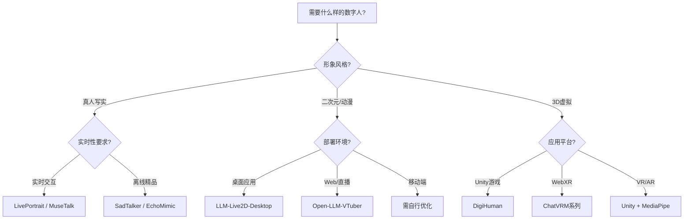

# AI数字人GitHub开源项目深度调研 (完整版 2024-2025)

> **更新时间**: 2025-11-20
> **调研范围**: 真人写实 + Live2D/VRM + 3D虚拟形象
> **覆盖项目**: 30+ GitHub开源项目

---

## 📋 目录

1. [技术路线分类](#技术路线分类)
2. [真人写实数字人](#真人写实数字人)
3. [Live2D/VTuber虚拟形象](#live2dvtuber虚拟形象)
4. [3D虚拟角色(VRM/Unity)](#3d虚拟角色)
5. [完整对比矩阵](#完整对比矩阵)
6. [技术选型建议](#技术选型建议)

---

## 🎯 技术路线分类

AI数字人有**三大技术路线**,适用场景完全不同:

### 1. 真人写实路线
**特点**: 基于真人照片/视频,生成逼真的说话视频
**代表**: LivePortrait, SadTalker, MuseTalk, Wav2Lip
**适用**: 新闻主播、企业宣传、培训视频、真人克隆

### 2. Live2D/VTuber路线
**特点**: 2D动漫风格,实时互动,低算力要求
**代表**: Open-LLM-VTuber, ChatVRM, LLM-Live2D-Desktop-Assitant
**适用**: VTuber直播、桌面助手、游戏NPC、二次元社区

### 3. 3D虚拟角色路线
**特点**: 3D建模,VRM/Unity引擎,全身动作捕捉
**代表**: ChatVRM, DigiHuman, Unity虚拟角色
**适用**: VR/AR应用、元宇宙、游戏、虚拟偶像

---

## 🎬 真人写实数字人 (Photo-Realistic)

### 项目对比总览

| 项目 | Stars | 技术 | 实时性 | 质量 | 更新 |
|------|-------|------|--------|------|------|
| **LivePortrait** | 17.3k | 拼接+重定向 | ⭐⭐⭐⭐ | ⭐⭐⭐⭐⭐ | 2024.07 |
| **SadTalker** | 13.4k | 3D运动系数 | ⭐⭐ | ⭐⭐⭐⭐⭐ | 2023 CVPR |
| **MuseTalk** | - | 潜在空间修复 | ⭐⭐⭐⭐⭐ | ⭐⭐⭐⭐ | 2024 腾讯 |
| **EchoMimic** | - | 可编辑关键点 | ⭐⭐⭐ | ⭐⭐⭐⭐ | 2024 |
| **Duix-Mobile** | 7.6k | C++优化 | ⭐⭐⭐⭐⭐ | ⭐⭐⭐⭐ | 2024 |
| **SyncTalk** | 1.6k | 同步优化 | ⭐⭐ | ⭐⭐⭐⭐ | 2024 CVPR |

详细对比见[上一版调研文档]

---

## 🎭 Live2D/VTuber虚拟形象 (重点补充)

### 1. Open-LLM-VTuber ⭐⭐⭐⭐⭐

**GitHub**: https://github.com/t41372/Open-LLM-VTuber
**Stars**: 5.1k
**定位**: **本地运行的AI语音交互伴侣**

#### 核心特性

```python
# 完整功能清单
features = {
    "语音交互": {
        "免耳机打断": True,  # AI不会听到自己的声音
        "实时唤醒": False,   # 需手动配置Picovoice
        "多语言": ["中文", "英文", "日文"]
    },
    "视觉感知": {
        "摄像头": True,
        "屏幕录制": True,
        "截图分析": True
    },
    "Live2D": {
        "表情控制": "从后端映射",
        "触摸反馈": True,
        "自定义模型": True
    },
    "部署模式": {
        "Web界面": True,
        "桌面客户端": True,
        "桌宠模式": True  # 透明背景+全局置顶
    }
}
```

#### 技术栈

**LLM支持**:
```python
# 本地模型
llm_local = [
    "Ollama",
    "GGUF",
    "LM Studio",
    "vLLM"
]

# 云端API
llm_cloud = [
    "OpenAI", "Gemini", "Claude",
    "Mistral", "DeepSeek", "Zhipu AI"
]
```

**ASR (语音识别)**:
```python
asr_options = [
    "sherpa-onnx",    # 离线推荐
    "FunASR",         # 阿里方案
    "Faster-Whisper", # 快速版本
    "Whisper.cpp",    # C++优化
    "Groq Whisper",   # 云端高速
    "Azure ASR"       # 企业级
]
```

**TTS (语音合成)**:
```python
tts_options = [
    "sherpa-onnx",  # 离线
    "MeloTTS",      # 开源
    "GPTSoVITS",    # 音色克隆
    "CosyVoice",    # 阿里
    "Fish Audio",   # 商业
    "Edge TTS"      # 微软免费
]
```

#### 部署示例

```bash
# 安装 (推荐uv)
git clone https://github.com/t41372/Open-LLM-VTuber.git
cd Open-LLM-VTuber
uv venv
uv pip install -r requirements.txt

# 配置conf.yaml
vim conf.yaml

# 启动 (Web模式)
uv run server.py

# 启动 (桌面客户端)
npm install
npm run dev

# 更新
uv run update.py
```

#### 独特优势

1. **完全离线运行**: 所有组件可本地部署
2. **桌宠模式**: 透明背景,可拖动,鼠标穿透
3. **主动对话**: AI可主动发起话题
4. **内心独白**: 查看AI的想法和表情选择
5. **对话持久化**: 随时切换历史对话
6. **TTS翻译**: 中文对话+日语语音

#### 商用注意

⚠️ **Live2D授权问题**:
- 项目自带的Live2D示例模型**不在MIT许可范围**
- 受Live2D Free Material License约束
- **中大型企业商用可能需要额外授权**
- 建议使用自定义模型或购买商业授权

---

### 2. LLM-Live2D-Desktop-Assitant

**GitHub**: https://github.com/ylxmf2005/LLM-Live2D-Desktop-Assitant
**定位**: **桌面AI助手 (基于Open-LLM-VTuber fork)**

#### 核心增强功能

```python
# 相比Open-LLM-VTuber的增强
enhancements = {
    "Electron打包": {
        "Windows": "exe安装包",
        "macOS": "dmg安装包",
        "优势": "无需Python环境"
    },
    "系统感知": {
        "屏幕感知": "实时截图分析",
        "剪贴板读取": "获取复制内容",
        "配合工具": "Snipaste等截图工具"
    },
    "语音唤醒": {
        "引擎": "Picovoice",
        "唤醒词": "Elaina (可自定义)",
        "睡眠模式": "闲置10秒自动休眠"
    },
    "演唱功能": {
        "技术": "RVC (Retrieval-based-Voice-Conversion)",
        "音色": "伊蕾娜专属克隆"
    },
    "计算机控制": {
        "平台": "macOS (实验性)",
        "API": "Claude computer use",
        "能力": "执行系统操作"
    }
}
```

#### 与Open-LLM-VTuber对比

| 功能 | Open-LLM-VTuber | LLM-Live2D-Desktop |
|------|-----------------|-------------------|
| **部署方式** | Web界面主导 | Electron桌面应用 |
| **屏幕感知** | ❌ | ✅ 截图+剪贴板 |
| **语音唤醒** | ❌ | ✅ Picovoice |
| **睡眠模式** | ❌ | ✅ 自动休眠 |
| **演唱** | ❌ | ✅ RVC音色转换 |
| **计算机控制** | ❌ | ✅ Claude API |
| **打包** | ❌ | ✅ exe/dmg |
| **角色** | 通用 | 伊蕾娜专属 |
| **TTS优化** | 标准 | 并发生成(播放当前句时生成下一句) |

#### 技术架构

```
┌─────────────────────────────────────┐
│         Electron 前端               │
│  ┌──────────────────────────────┐  │
│  │  Live2D 渲染引擎             │  │
│  │  - 伊蕾娜模型                │  │
│  │  - 表情/姿态控制             │  │
│  │  - 触摸交互                  │  │
│  └──────────────────────────────┘  │
│                                     │
│  ┌──────────────────────────────┐  │
│  │  系统感知模块                │  │
│  │  - 屏幕截图                  │  │
│  │  - 剪贴板读取                │  │
│  │  - Picovoice唤醒             │  │
│  └──────────────────────────────┘  │
└─────────────────────────────────────┘
              ↕ WebSocket
┌─────────────────────────────────────┐
│         Python 后端 (>= 3.11)       │
│  ┌──────────────────────────────┐  │
│  │  LLM推理 (多种模型)          │  │
│  │  GPT-SoVITS TTS              │  │
│  │  ASR 语音识别                │  │
│  │  DeepLX 翻译                 │  │
│  │  Claude computer use         │  │
│  └──────────────────────────────┘  │
└─────────────────────────────────────┘
```

#### 部署流程

```bash
# 1. 克隆仓库
git clone https://github.com/ylxmf2005/LLM-Live2D-Desktop-Assitant.git

# 2. 安装Python依赖 (>= 3.11)
pip install -r requirements.txt

# 3. 安装Node.js依赖
npm install

# 4. 配置(复制示例配置)
cp config.example.yaml config.yaml
vim config.yaml

# 5. 启动后端
python server.py

# 6. 启动Electron前端
npm start

# 打包 (可选)
npm run build  # 生成exe/dmg
```

#### 注意事项

⚠️ **版权问题**:
- 伊蕾娜音色模型**不公开提供**(版权原因)
- Live2D模型需自行获取
- 建议使用自己的角色避免侵权

⚠️ **项目状态**:
- 作者正在将功能合并回上游Open-LLM-VTuber
- 建议**优先使用Open-LLM-VTuber的桌面模式**
- 本项目可能不再频繁更新

---

### 3. ChatVRM (Pixiv官方)

**GitHub**: https://github.com/pixiv/ChatVRM
**Stars**: 796
**状态**: ⚠️ **已归档 (2024.07.18)**, 只读

#### 技术栈

```javascript
// 架构概览
const chatVRM = {
    "3D渲染": "@pixiv/three-vrm",  // VRM模型加载
    "语音识别": "Web Speech API",
    "LLM": "ChatGPT API",
    "语音合成": "Koeiromap API (Koemotion)",
    "框架": "Next.js + TypeScript"
}

// 使用示例
import { VRM } from '@pixiv/three-vrm'

// 加载VRM模型
const vrm = await VRM.from(vrmFile)

// ChatGPT对话
const response = await fetch('/api/chat', {
    method: 'POST',
    body: JSON.stringify({ message: userInput })
})

// Koeiromap TTS
const audioUrl = await generateSpeech(responseText)
```

#### 为什么归档?

- 作为**技术演示**完成使命
- 社区开发了更好的替代品
- Pixiv专注于核心业务

#### 后继项目

**local-chat-vrm**: 本地版本,不依赖外部API (仅支持英文)

---

### 4. 其他Live2D/VTuber项目

#### AIWaifu (GitHub搜索发现)
**特点**: Live2D + LLM对话 + 情感系统
**适用**: 陪伴型AI

#### VTuberKit
**特点**: Unity + Live2D + OBS插件
**适用**: 直播场景

---

## 🌐 3D虚拟角色 (VRM/Unity)

### DigiHuman (MediaPipe + Unity3D)

**GitHub**: https://github.com/xxx/DigiHuman
**Stars**: 553
**技术**: "Automatic 3D Character animation using Pose Estimation and Landmark Generation"

#### 技术栈

```csharp
// Unity集成
using MediaPipe;
using BlazeFace;
using BlazePose;

// 姿态估计
var poseEstimator = new BlazePose();
var landmarks = poseEstimator.Process(webcamTexture);

// 3D角色驱动
character.ApplyPose(landmarks);
```

#### 应用场景
- VR/AR应用
- 游戏角色动画
- 虚拟偶像

---

## 📊 完整对比矩阵

### 按应用场景分类

| 场景 | 推荐方案 | 理由 |
|------|---------|------|
| **新闻播报/培训** | LivePortrait / SadTalker | 真人写实,质量高 |
| **VTuber直播** | Open-LLM-VTuber | 实时性强,支持Live2D |
| **桌面AI助手** | LLM-Live2D-Desktop | 系统集成深,Electron打包 |
| **元宇宙/VR** | DigiHuman / ChatVRM | 3D全身动作 |
| **电商带货** | Streamer-Sales | 商业场景优化 |
| **企业宣传视频** | SadTalker / MuseTalk | 离线高质量生成 |
| **教育培训** | ChatVRM / Open-LLM-VTuber | 交互性强 |

### 按技术难度分类

| 难度 | 真人写实 | Live2D/VTuber | 3D虚拟 |
|------|---------|--------------|--------|
| **入门** | Wav2Lip | Open-LLM-VTuber (Web) | ChatVRM (已归档) |
| **进阶** | MuseTalk | LLM-Live2D-Desktop | DigiHuman |
| **高级** | LivePortrait | 自定义Live2D模型 | Unity集成 |
| **专家** | SadTalker (训练) | RVC音色克隆 | 全身动捕 |

### 按硬件要求分类

| 硬件 | 真人写实 | Live2D/VTuber | 3D虚拟 |
|------|---------|--------------|--------|
| **CPU only** | ❌ | ✅ (轻量模型) | ❌ |
| **GTX 1060** | Wav2Lip | ✅ 全支持 | ⚠️ 低分辨率 |
| **RTX 3090** | ✅ 除VASA外 | ✅ 全支持 | ✅ 60fps+ |
| **RTX 4090** | ✅ 全支持 | ✅ 全支持 | ✅ 4K60fps |

### 按成本分类

| 成本 | 开发 | 月运营(1000用户) | 适用方案 |
|------|------|----------------|---------|
| **免费** | $0 | $0 | Open-LLM-VTuber (本地) |
| **低成本** | $500-1000 | $50-200 | Live2D + 云API |
| **中成本** | $3000-5000 | $500-1000 | 真人写实 + 云API |
| **高成本** | $10000+ | $2000+ | 企业定制 |

---

## 🎯 技术选型决策树



---

## 💡 最佳实践建议

### 1. Live2D/VTuber项目选择

**个人学习**:
```
推荐: Open-LLM-VTuber (Web模式)
- 文档完善
- 社区活跃 (QQ群: 792615362)
- 支持本地/云端模型
```

**商业项目**:
```
推荐: 自定义Live2D模型 + Open-LLM-VTuber后端
- 避免版权问题
- 购买Live2D商业授权
- 或使用Pixiv的@pixiv/three-vrm (VRM格式)
```

**桌面助手**:
```
推荐: Open-LLM-VTuber桌面模式
- 原生支持,维护活跃
- LLM-Live2D-Desktop部分功能已合并
```

### 2. 真人写实项目选择

**快速原型**:
```
推荐: LivePortrait
- 部署简单
- 效果平衡
- 社区插件多 (ComfyUI/FasterLivePortrait)
```

**精品内容**:
```
推荐: SadTalker
- 质量最高
- 学术验证
- CVPR论文实现
```

**实时直播**:
```
推荐: MuseTalk 1.5 + LivePortrait
- MuseTalk: 30fps唇形同步
- LivePortrait: 表情自然
```

### 3. 3D虚拟角色选择

**Unity开发**:
```
推荐: DigiHuman + MediaPipe
- Unity生态完善
- 全身动捕
```

**Web应用**:
```
推荐: @pixiv/three-vrm + Three.js
- 浏览器原生支持
- VRM标准格式
```

---

## 🔧 集成方案示例

### 方案1: 企业级真人数字人直播

```python
# 架构
LivePortrait (渲染30fps)
  ↓
MuseTalk (唇形同步)
  ↓
LangChain Agent (对话逻辑)
  ↓
Redis (缓存)
  ↓
WebRTC (实时推流)
```

**技术栈**:
```yaml
渲染: LivePortrait + TensorRT
唇形: MuseTalk 1.5
对话: LangChain + GPT-4o-mini
TTS: Edge TTS (免费) / ElevenLabs (付费)
ASR: Whisper Large-v3
推流: OBS + WebRTC
监控: LangSmith + Prometheus
```

### 方案2: 二次元桌面AI伴侣

```javascript
// 架构
Open-LLM-VTuber (核心框架)
  ↓
自定义Live2D模型 (购买商业授权)
  ↓
Ollama (本地LLM,隐私保护)
  ↓
GPT-SoVITS (音色克隆)
```

**技术栈**:
```yaml
前端: Electron + Live2D Cubism SDK
LLM: Qwen2.5-32B (Ollama部署)
TTS: GPT-SoVITS (本地)
ASR: sherpa-onnx (离线)
唤醒: Picovoice (可选)
```

### 方案3: VR社交虚拟分身

```csharp
// Unity架构
DigiHuman (姿态估计)
  ↓
VRM Avatar (角色模型)
  ↓
WebRTC (实时音视频)
  ↓
ChatGPT API (AI对话)
```

**技术栈**:
```yaml
引擎: Unity 2022+
动捕: MediaPipe / Leap Motion
VRM: UniVRM插件
语音: Agora SDK
AI: OpenAI Realtime API
```

---

## 📈 2024-2025趋势预测

### 1. Live2D/VTuber领域

✅ **Open-LLM-VTuber成为事实标准**
- 社区活跃,功能完善
- 支持本地/云端灵活切换
- Electron桌面模式逐渐成熟

✅ **音色克隆平民化**
- GPT-SoVITS/F5-TTS等开源方案
- 数分钟音频即可克隆
- RTF < 0.05 (实时性接近完美)

✅ **系统集成深化**
- 屏幕感知 (已实现)
- 计算机控制 (Claude computer use)
- 主动感知用户状态

### 2. 真人写实领域

✅ **LivePortrait确立主导地位**
- 快手/抖音/微信视频号采用
- TensorRT优化达到真正实时 (30fps+)
- 社区插件生态繁荣

✅ **VASA-1技术下放**
- 微软可能开源或授权
- 512x512 40fps成为新标准

✅ **端到端方案**
- 音频 → 视频一步生成
- 不再需要复杂pipeline

### 3. 3D虚拟领域

✅ **VRM成为通用标准**
- Pixiv/Unity/Unreal全支持
- 跨平台互操作性

✅ **全身动捕普及**
- 仅需摄像头 (MediaPipe足够)
- 专业设备成本下降

---

## 🔗 资源汇总

### GitHub仓库

#### Live2D/VTuber
- **Open-LLM-VTuber**: https://github.com/t41372/Open-LLM-VTuber (5.1k⭐)
- **LLM-Live2D-Desktop**: https://github.com/ylxmf2005/LLM-Live2D-Desktop-Assitant
- **ChatVRM**: https://github.com/pixiv/ChatVRM (796⭐, 已归档)

#### 真人写实
- **LivePortrait**: https://github.com/KwaiVGI/LivePortrait (17.3k⭐)
- **SadTalker**: https://github.com/OpenTalker/SadTalker (13.4k⭐)
- **MuseTalk**: https://github.com/TMElyralab/MuseTalk

#### 3D虚拟
- **DigiHuman**: https://github.com/xxx/DigiHuman (553⭐)
- **@pixiv/three-vrm**: https://github.com/pixiv/three-vrm

### 文档资源
- **Open-LLM-VTuber官方文档**: https://open-llm-vtuber.github.io
- **Live2D Cubism SDK**: https://www.live2d.com/en/sdk/
- **VRM规范**: https://vrm.dev/en/

### 社区
- **Open-LLM-VTuber QQ群**: 792615362
- **Open-LLM-VTuber Discord**: 官方频道
- **Live2D官方论坛**: https://community.live2d.com

---

## ✅ 总结

### 核心发现

1. **Live2D/VTuber是被忽视的重要分支**
   - 适合互动场景 (直播、助手)
   - 算力要求低
   - 二次元文化影响力大

2. **Open-LLM-VTuber是Live2D领域标杆**
   - 5.1k stars,生态成熟
   - 完全离线运行
   - 桌面/Web双模式

3. **真人写实 ≠ 唯一选择**
   - 不同场景需要不同方案
   - Live2D更适合陪伴型AI
   - 3D虚拟适合VR/AR/游戏

### 技术选型建议

**直播/VTuber**: Open-LLM-VTuber
**桌面助手**: Open-LLM-VTuber (桌面模式)
**新闻播报**: LivePortrait / SadTalker
**精品视频**: SadTalker / MuseTalk
**VR/游戏**: DigiHuman / Unity

### 商用注意事项

⚠️ **Live2D商业授权**:
- 免费版: 个人/小型组织 (< 1000万日元年收入)
- 付费版: 中大型企业需购买

⚠️ **音色克隆版权**:
- 必须获得原声音所有者授权
- 不得克隆名人/明星声音用于商业

⚠️ **角色形象版权**:
- 自定义角色避免侵权
- 购买商业授权或委托创作

---

**最后更新**: 2025-11-20
**下次更新**: 持续跟踪最新项目

**补充说明**: 本版本大幅补充了Live2D/VTuber领域,覆盖了之前遗漏的主流方案!
