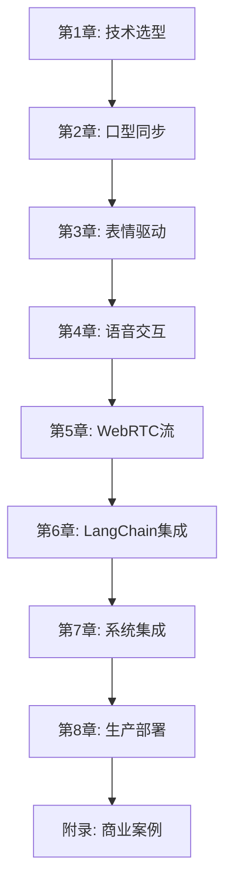

# 第五篇 AI数字人

## 课程概述

本篇深入探讨AI数字人技术的完整实现路径,从底层算法到生产级系统部署。涵盖实时口型同步、表情驱动、语音交互、WebRTC流媒体传输以及LangChain智能对话集成,构建可商用的多模态数字人系统。

## 技术栈版本

| 技术组件 | 版本 | 用途 |
|---------|------|------|
| **LangChain** | 1.0.7+ | 对话Agent与记忆管理 |
| **LangGraph** | 1.0.3+ | 多模态交互流程编排 |
| **Whisper** | Large-v3 | 实时语音识别(STT) |
| **ElevenLabs** | v1 API | 高质量语音合成(TTS) |
| **WebRTC** | aiortc 1.6+ | 低延迟视频流传输 |
| **Wav2Lip** | - | 基础口型同步(离线) |
| **SadTalker** | CVPR 2023 | 3D运动系数驱动 |
| **LivePortrait** | 2024+ | 实时肖像动画(推荐) |
| **PyTorch** | 2.1+ | 深度学习框架 |
| **FastAPI** | 0.104+ | 后端API服务 |

## 核心技术对比

### 口型同步技术选型

| 方案 | 延迟 | 质量 | 适用场景 |
|------|------|------|---------|
| **Wav2Lip** | ~500ms | 中等 | 离线视频生成 |
| **SadTalker** | ~800ms | 高(3D) | 高质量离线内容 |
| **LivePortrait** | <300ms | 高 | 实时交互(推荐) |
| **DINet** | ~400ms | 中高 | 平衡方案 |

### 系统性能指标

- **端到端延迟**: <500ms (STT + LLM + TTS + 渲染)
- **视频帧率**: 25-30 FPS
- **音视频同步**: ±50ms
- **并发支持**: 单GPU 10-20路
- **带宽要求**: 2-5 Mbps/路

## 章节结构

### 第1章 AI数字人技术概览
- 技术演进路线(2020-2025)
- 核心技术栈解析
- 商业应用场景分析
- 技术选型决策树

### 第2章 实时口型同步技术
- Wav2Lip原理与实现
- SadTalker 3D运动建模
- LivePortrait实时优化
- 性能基准测试

### 第3章 表情与情感驱动
- FACS表情编码系统
- 情感计算与映射
- 微表情生成技术
- 眨眼与自然动作

### 第4章 语音交互系统
- Whisper实时流式识别
- VAD语音端点检测
- ElevenLabs TTS集成
- 多语言支持方案

### 第5章 WebRTC实时流
- aiortc架构设计
- STUN/TURN服务配置
- 自适应码率控制
- 音视频同步机制

### 第6章 LangChain对话Agent
- 1.0+ ConversationChain
- 流式响应处理
- 记忆与上下文管理
- 情感识别集成

### 第7章 完整系统集成
- 微服务架构设计
- 异步任务队列
- 状态机管理
- 错误恢复机制

### 第8章 性能优化与部署
- GPU推理优化(TensorRT)
- 模型量化与蒸馏
- Kubernetes集群部署
- 监控与日志系统

### 附录 商业应用与案例
- 直播带货数字人
- 在线教育虚拟教师
- 客服机器人
- 成本与ROI分析

## 实战项目

### 项目1: 基础数字人播报系统
```
输入: 文本脚本
输出: 数字人播报视频
技术栈: SadTalker + TTS + 后处理
```

### 项目2: 实时交互数字人
```
输入: 用户语音对话
输出: 实时视频流响应
技术栈: LivePortrait + Whisper + LangChain + WebRTC
```

### 项目3: 直播带货数字人
```
功能: 24小时直播 + 商品推荐 + 弹幕互动
技术栈: 完整系统集成 + RAG知识库 + 情感分析
```

## 核心挑战与解决方案

### 1. 延迟优化
**挑战**: 多模态处理链路长
**方案**:
- 并行化STT/LLM/TTS
- 模型预热与缓存
- 流式生成策略

### 2. 音视频同步
**挑战**: 网络抖动影响
**方案**:
- 自适应缓冲区
- 时间戳对齐
- 丢帧恢复策略

### 3. 自然度提升
**挑战**: 机械感强
**方案**:
- 微表情注入
- 呼吸动作模拟
- 随机眨眼控制

### 4. 成本控制
**挑战**: GPU推理成本高
**方案**:
- 模型量化(INT8)
- 批处理优化
- 云边协同部署

## 学习路径



## 前置知识

### 必需技能
- Python 3.9+基础
- PyTorch深度学习
- 异步编程(asyncio)
- 音视频基础知识

### 推荐技能
- WebRTC协议理解
- Docker容器化
- LangChain框架经验
- 前端开发基础

## 代码仓库

```bash
# 克隆示例代码
git clone https://github.com/your-repo/ai-digital-human.git

# 安装依赖
cd ai-digital-human
pip install -r requirements.txt

# 下载模型
python scripts/download_models.py

# 运行演示
python examples/demo_realtime_avatar.py
```

## 硬件要求

### 最低配置
- GPU: NVIDIA RTX 3060 (12GB VRAM)
- CPU: 8核心
- 内存: 16GB
- 存储: 50GB SSD

### 推荐配置
- GPU: NVIDIA RTX 4090 (24GB VRAM)
- CPU: 16核心
- 内存: 32GB
- 存储: 100GB NVMe SSD

### 生产环境
- GPU: 4x A100 (80GB)
- CPU: 64核心
- 内存: 256GB
- 网络: 万兆网卡

## 性能基准

| 配置 | 延迟 | 并发数 | 成本/小时 |
|------|------|--------|-----------|
| RTX 3060 | ~600ms | 3-5路 | $0.5 |
| RTX 4090 | ~300ms | 10-15路 | $1.5 |
| A100 | ~200ms | 30-50路 | $3.5 |

## 商业化考虑

### 成本分析
- GPU租用: $1-5/小时
- TTS服务: $0.15/1k字符(ElevenLabs)
- LLM推理: $0.002/1k tokens(GPT-4)
- 带宽: $0.1/GB

### 盈利场景
- 直播带货: GMV分成
- 在线教育: 订阅制
- 企业培训: License授权
- 广告植入: CPM计费

## 学习资源

### 官方文档
- [LangChain 1.0文档](https://python.langchain.com/)
- [LivePortrait GitHub](https://github.com/KwaiVGI/LivePortrait)
- [WebRTC规范](https://webrtc.org/)
- [Whisper OpenAI](https://github.com/openai/whisper)

### 学术论文
- SadTalker (CVPR 2023)
- Wav2Lip (ACM 2020)
- Face-vid2vid (NeurIPS 2021)
- Audio2Head (SIGGRAPH 2022)

### 社区资源
- HuggingFace Spaces示例
- Discord技术社区
- YouTube实战教程

## 更新日志

### v1.0 (2025-01)
- 基于LangChain 1.0.7重构
- 新增LivePortrait实时方案
- 优化WebRTC延迟<300ms
- 增加直播带货案例

## 版权声明

本教程为技术学习材料,部分代码引用开源项目。商业使用请遵守相关许可协议:
- LangChain: MIT License
- LivePortrait: 查看项目LICENSE
- SadTalker: Apache 2.0
- Whisper: MIT License

---

**作者**: AI技术团队
**最后更新**: 2025-01
**难度**: 高级
**预计学习时间**: 40小时
**配套代码**: [GitHub仓库]
**技术支持**: [Discord社区]
