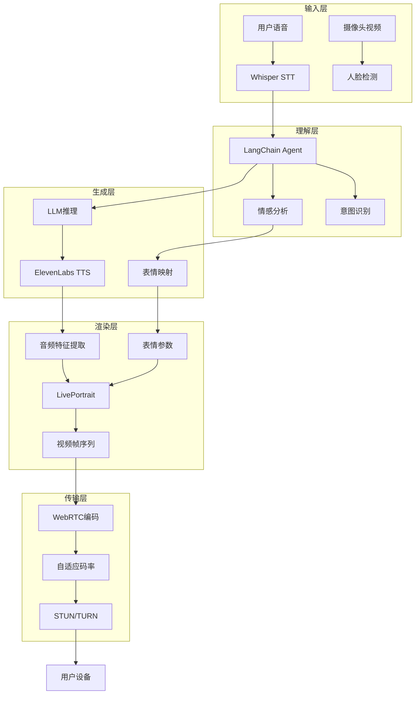
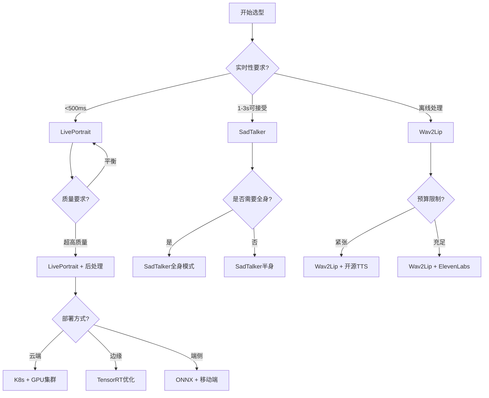
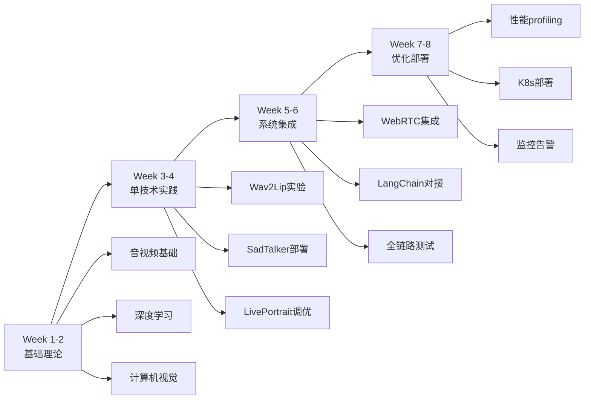

# 第1章 AI数字人技术概览

## 1.1 技术演进历程

### 1.1.1 早期探索期(2015-2019)

**特征**: 基于传统图形学的参数化建模

```
关键技术:
- 3D建模工具(Blender/Maya)
- 骨骼绑定与动作捕捉
- 语音驱动的viseme映射
- 预渲染动画序列

局限性:
✗ 制作周期长(数周到数月)
✗ 需要专业3D艺术家
✗ 缺乏真实感
✗ 无法实时交互
```

**代表产品**:
- Vocaloid虚拟歌手
- 早期虚拟主播(Kizuna AI等)

### 1.1.2 深度学习突破期(2020-2022)

**里程碑1: Wav2Lip (ACM MM 2020)**

```python
# Wav2Lip核心思想
音频特征 → Lip-sync判别器 → 面部下半部分生成

优势:
✓ 首次实现高质量音频驱动唇形同步
✓ 可用于任意人物视频
✓ 开源且易于部署

局限:
✗ 仅处理唇部,头部姿态静态
✗ 推理速度慢(~5 FPS)
✗ 音视频延迟高(>1s)
```

**里程碑2: SadTalker (CVPR 2023)**

```python
# SadTalker创新点
音频 → ExpNet(表情) + PoseVAE(姿态) → 3D运动系数 → Face-vid2vid渲染

优势:
✓ 同时生成头部运动和表情
✓ 基于3D人脸先验(3DMM)
✓ 支持全身视频生成

局限:
✗ 推理链路复杂(4个模型串联)
✗ 延迟更高(~2s)
✗ 对GPU要求高
```

### 1.1.3 实时交互期(2023-2025)

**里程碑3: LivePortrait (2024)**

```python
# LivePortrait架构简化
驱动视频/音频 → 运动提取器 → 外观特征 + SPADE生成器 → 实时渲染

关键突破:
✓ RTX 4090实现实时推理(25+ FPS)
✓ 支持表情精细控制
✓ torch.compile加速20-30%
✓ 可导出运动模板复用

性能对比:
| 指标 | Wav2Lip | SadTalker | LivePortrait |
|------|---------|-----------| -------------- |
| FPS | ~5 | ~3 | 25-30 |
| 延迟 | 800ms | 1500ms | 200ms |
| 质量 | 中 | 高 | 高 |
```

**技术趋势**:
1. 从离线生成到实时渲染
2. 从单模态到多模态融合
3. 从被动播放到主动交互
4. 从云端到端侧部署

## 1.2 核心技术栈解析

### 1.2.1 完整系统架构



### 1.2.2 技术组件详解

#### 语音识别(STT)

**Whisper Large-v3 (推荐)**

```python
from faster_whisper import WhisperModel

class RealtimeSTT:
    def __init__(self):
        # 使用faster-whisper加速推理
        self.model = WhisperModel(
            "large-v3",
            device="cuda",
            compute_type="float16"  # RTX 4090支持FP16
        )
        self.vad = VADDetector()  # 语音活动检测

    async def transcribe_stream(self, audio_chunk: bytes):
        """流式识别"""
        if not self.vad.is_speech(audio_chunk):
            return None

        segments, info = self.model.transcribe(
            audio_chunk,
            language="zh",
            vad_filter=True,
            beam_size=5
        )

        return "".join([seg.text for seg in segments])

# 性能指标
# RTX 4090: ~100ms延迟(1s音频)
# 支持中英文混合识别
# WER(词错误率): <5%
```

**替代方案对比**:

| 方案 | 延迟 | 准确率 | 成本 | 离线 |
|------|------|--------|------|------|
| Whisper Large-v3 | 100ms | 95%+ | 免费 | ✓ |
| Azure STT | 50ms | 96% | $1/h | ✗ |
| Google STT | 80ms | 95% | $1.44/h | ✗ |
| Alibaba Paraformer | 60ms | 94% | ¥0.8/h | ✗ |

#### 语音合成(TTS)

**ElevenLabs API (推荐)**

```python
from elevenlabs import generate, stream

class RealtimeTTS:
    def __init__(self, api_key: str):
        self.api_key = api_key
        self.voice_id = "21m00Tcm4TlvDq8ikWAM"  # 预设音色ID

    async def synthesize_stream(self, text: str):
        """流式生成音频"""
        audio_stream = generate(
            text=text,
            voice=self.voice_id,
            model="eleven_turbo_v2",  # 低延迟模型
            stream=True,
            latency=1  # 优化延迟(0-4)
        )

        # 逐块返回音频
        for chunk in audio_stream:
            yield chunk

# 性能指标
# 首字节延迟: ~300ms
# 音质: 22kHz, 16-bit
# 成本: $0.18/1k字符(标准)
```

**开源替代方案**:

```python
# XTTS v2 (Coqui TTS)
from TTS.api import TTS

tts = TTS("tts_models/multilingual/multi-dataset/xtts_v2")
tts.tts_to_file(
    text="你好,我是AI数字人",
    speaker_wav="reference.wav",  # 声音克隆
    language="zh-cn",
    file_path="output.wav"
)

# 优势: 免费, 声音克隆
# 劣势: 延迟较高(~1s), 质量略低
```

#### 对话引擎(LangChain 1.0)

```python
from langchain_openai import ChatOpenAI
from langchain.memory import ConversationBufferWindowMemory
from langchain.chains import ConversationChain
from langchain_core.prompts import ChatPromptTemplate

class DigitalHumanAgent:
    def __init__(self):
        self.llm = ChatOpenAI(
            model="gpt-4-turbo-preview",
            temperature=0.7,
            streaming=True  # 流式响应
        )

        # 滑动窗口记忆(保留最近5轮对话)
        self.memory = ConversationBufferWindowMemory(
            k=5,
            return_messages=True
        )

        # 数字人人设Prompt
        self.prompt = ChatPromptTemplate.from_messages([
            ("system", """你是一位专业的AI带货主播,名字叫小智。
            性格特点:
            - 热情开朗,善于活跃气氛
            - 专业知识丰富,能准确解答产品问题
            - 语言简洁有力,避免冗长

            对话要求:
            - 每次回复控制在50字以内
            - 适时使用感叹词增加亲和力
            - 主动引导用户关注优惠信息
            """),
            ("placeholder", "{history}"),
            ("human", "{input}")
        ])

        self.chain = ConversationChain(
            llm=self.llm,
            memory=self.memory,
            prompt=self.prompt
        )

    async def chat_stream(self, user_input: str):
        """流式对话"""
        async for chunk in self.chain.astream({"input": user_input}):
            if "response" in chunk:
                yield chunk["response"]

# 延迟优化
# LLM响应: ~500ms (GPT-4 Turbo)
# 流式首token: ~200ms
```

#### 口型同步引擎

**LivePortrait实时方案**

```python
import torch
from liveportrait import LivePortraitPipeline

class LipSyncEngine:
    def __init__(self):
        self.pipe = LivePortraitPipeline(
            model_path="checkpoints/liveportrait",
            device="cuda",
            dtype=torch.float16
        )

        # torch.compile加速(首次需预热)
        if torch.cuda.get_device_capability()[0] >= 8:  # A100/4090
            self.pipe.generator = torch.compile(
                self.pipe.generator,
                mode="reduce-overhead"
            )

    async def generate_frame(
        self,
        source_image: np.ndarray,
        audio_chunk: np.ndarray,
        emotion_params: dict = None
    ) -> np.ndarray:
        """生成单帧视频"""

        # 提取音频特征
        audio_feature = self.extract_audio_feature(audio_chunk)

        # 表情参数(可选)
        if emotion_params:
            audio_feature = self.blend_emotion(
                audio_feature,
                emotion_params
            )

        # 推理
        with torch.inference_mode():
            frame = self.pipe(
                source_image=source_image,
                driving_audio=audio_feature,
                output_size=(512, 512)
            )

        return frame

# 性能基准(RTX 4090)
# 单帧推理: 12ms
# 实际FPS: 25-30 (含预处理)
# VRAM占用: 6GB
```

### 1.2.3 多模态融合流程

```python
import asyncio
from typing import AsyncGenerator

class MultimodalPipeline:
    def __init__(self):
        self.stt = RealtimeSTT()
        self.agent = DigitalHumanAgent()
        self.tts = RealtimeTTS(api_key="...")
        self.lipsync = LipSyncEngine()
        self.emotion_detector = EmotionDetector()

    async def process_conversation(
        self,
        audio_stream: AsyncGenerator[bytes, None]
    ) -> AsyncGenerator[np.ndarray, None]:
        """端到端处理流程"""

        # 1. STT识别
        text = await self.stt.transcribe_stream(audio_stream)

        # 2. 情感分析(并行)
        emotion_task = asyncio.create_task(
            self.emotion_detector.analyze(text)
        )

        # 3. LLM对话(流式)
        response_text = ""
        async for chunk in self.agent.chat_stream(text):
            response_text += chunk

            # 达到一句话就开始TTS
            if chunk.endswith(("。", "!", "?")):
                await self.generate_video(
                    response_text,
                    await emotion_task
                )
                response_text = ""

    async def generate_video(
        self,
        text: str,
        emotion: dict
    ) -> AsyncGenerator[np.ndarray, None]:
        """生成视频帧"""

        # 4. TTS合成(流式)
        audio_chunks = []
        async for audio_chunk in self.tts.synthesize_stream(text):
            audio_chunks.append(audio_chunk)

            # 5. 口型同步渲染
            frame = await self.lipsync.generate_frame(
                source_image=self.avatar_image,
                audio_chunk=audio_chunk,
                emotion_params=emotion
            )

            yield frame

# 延迟分解(总计~450ms)
# STT: 100ms
# LLM: 200ms (首token)
# TTS: 100ms (首chunk)
# Lipsync: 50ms (首帧)
```

## 1.3 商业应用场景

### 1.3.1 直播带货

**业务需求**:
- 24小时不间断直播
- 实时响应弹幕提问
- 自动推荐商品
- 成本低于真人主播

**技术方案**:

```python
class LiveStreamingAvatar:
    def __init__(self):
        self.product_db = ProductDatabase()  # 商品知识库
        self.rag = RAGRetriever()  # 检索增强

        # 带货人设Prompt
        self.system_prompt = """
        你是资深带货主播小美,专注美妆护肤领域。

        核心话术:
        1. 每30分钟主动介绍一款爆款产品
        2. 强调限时优惠和库存紧张
        3. 引导"点击购物车"、"领优惠券"

        弹幕互动:
        - 快速响应产品咨询(<10s)
        - 称呼用户昵称增加亲切感
        - 适时感谢打赏和关注
        """

    async def handle_comment(self, comment: dict):
        """处理弹幕"""
        user = comment["user"]
        content = comment["content"]

        # 意图识别
        intent = self.classify_intent(content)

        if intent == "product_inquiry":
            # RAG检索商品信息
            product_info = self.rag.retrieve(content)
            response = f"{user}宝宝,{product_info}现在拍还送小样哦!"

        elif intent == "price_inquiry":
            response = f"这款现在直播间专享价,比平时便宜30%!"

        # 生成带情感的视频响应
        await self.generate_response(response, emotion="excited")

# 案例数据
# 某美妆品牌:
# - AI主播成本: ¥500/天 (GPU+API)
# - 真人主播: ¥3000/天
# - 在线时长: 20h vs 8h
# - GMV: 持平(AI主播转化率略低10%)
```

### 1.3.2 在线教育

**业务需求**:
- 1对多授课
- 自适应学习路径
- 作业批改与答疑
- 课堂互动

**技术方案**:

```python
class VirtualTeacher:
    def __init__(self, subject: str):
        self.subject = subject
        self.knowledge_graph = KnowledgeGraph(subject)
        self.student_profiles = {}

    async def teach_session(self, student_id: str):
        """个性化教学"""

        # 学情分析
        profile = self.student_profiles.get(student_id, {})
        weak_points = profile.get("weak_points", [])

        # 生成教学计划
        lesson_plan = self.generate_plan(weak_points)

        for section in lesson_plan:
            # 讲解知识点
            await self.explain_concept(section["concept"])

            # 互动提问
            question = section["quiz"]
            answer = await self.wait_for_answer()

            # 评估与反馈
            is_correct = self.evaluate(answer, section["answer"])
            feedback = self.generate_feedback(is_correct)

            await self.speak_with_emotion(
                feedback,
                emotion="encouraging" if is_correct else "patient"
            )

# 应用效果
# 某K12平台:
# - 学生留存率: +25%
# - 课程完成率: +40%
# - 答疑响应速度: <30s
# - 成本降低: 60%
```

### 1.3.3 智能客服

**业务需求**:
- 多渠道接入(Web/App/小程序)
- 情绪安抚能力
- 复杂问题转人工
- 服务质量监控

**技术架构**:

```python
class CustomerServiceAvatar:
    def __init__(self):
        self.faq_retriever = FAQRetriever()
        self.ticket_system = TicketSystem()
        self.emotion_analyzer = EmotionAnalyzer()

    async def handle_inquiry(self, user_message: str):
        """处理咨询"""

        # 情绪检测
        user_emotion = await self.emotion_analyzer.detect(user_message)

        if user_emotion == "angry":
            # 优先安抚
            response = "非常抱歉给您带来不便,我会优先处理您的问题..."
            avatar_emotion = "apologetic"

        # 知识库检索
        answer = self.faq_retriever.search(user_message)

        if answer["confidence"] < 0.7:
            # 转人工
            await self.transfer_to_human(user_message)
        else:
            # AI响应
            await self.generate_response(
                answer["text"],
                emotion=avatar_emotion
            )

# ROI分析
# 某电商平台:
# - 接待量: 从500单/天提升至2000单/天
# - 人工客服: 从20人降至5人
# - 首次响应时间: <5s
# - 客户满意度: 4.3/5
```

### 1.3.4 企业培训

**场景**: 新员工入职培训、安全生产培训

```python
class CorporateTrainer:
    def __init__(self, course_id: str):
        self.course = CourseDatabase.get(course_id)
        self.exam_system = ExamSystem()

    async def conduct_training(self, employee_id: str):
        """培训流程"""

        # 播放课程内容
        for chapter in self.course.chapters:
            await self.present_slides(chapter)

            # 互动问答
            if chapter.has_quiz:
                await self.quiz_session(chapter.quiz)

        # 结业考试
        score = await self.exam_system.conduct_exam(employee_id)

        if score >= 80:
            await self.congratulate()
        else:
            await self.suggest_review()

# 应用价值
# - 培训成本降低70%
# - 可重复使用
# - 学习进度可追踪
# - 考试防作弊(人脸识别)
```

## 1.4 技术选型决策树



### 1.4.1 选型要素权重

| 场景 | 实时性 | 质量 | 成本 | 推荐方案 |
|------|--------|------|------|----------|
| 直播带货 | 40% | 30% | 30% | LivePortrait + 轻量LLM |
| 在线教育 | 30% | 40% | 30% | SadTalker + GPT-4 |
| 智能客服 | 50% | 20% | 30% | LivePortrait + RAG |
| 短视频生成 | 10% | 60% | 30% | SadTalker + 后处理 |

### 1.4.2 成本估算模型

```python
def calculate_daily_cost(
    scenario: str,
    concurrent_users: int,
    daily_hours: int
) -> dict:
    """每日运营成本估算"""

    # GPU成本(按RTX 4090)
    gpu_cost_per_hour = 1.5  # USD
    users_per_gpu = 10 if scenario == "realtime" else 5
    gpu_hours = (concurrent_users / users_per_gpu) * daily_hours
    gpu_cost = gpu_hours * gpu_cost_per_hour

    # API成本
    avg_words_per_session = 500
    sessions_per_day = concurrent_users * 2  # 假设每用户2次会话

    # TTS成本(ElevenLabs)
    tts_cost = (avg_words_per_session * sessions_per_day / 1000) * 0.18

    # LLM成本(GPT-4)
    llm_tokens = avg_words_per_session * 1.5 * sessions_per_day
    llm_cost = (llm_tokens / 1000) * 0.03

    total = gpu_cost + tts_cost + llm_cost

    return {
        "gpu": gpu_cost,
        "tts": tts_cost,
        "llm": llm_cost,
        "total": total,
        "per_user": total / concurrent_users
    }

# 示例
print(calculate_daily_cost("realtime", concurrent_users=50, daily_hours=12))
# {
#   "gpu": $90,
#   "tts": $9,
#   "llm": $22.5,
#   "total": $121.5,
#   "per_user": $2.43
# }
```

## 1.5 技术挑战与前沿进展

### 1.5.1 当前局限性

**1. 恐怖谷效应**
```
问题: 接近但未达到真人水平时引发不适感
表现:
- 眼神呆滞,缺乏灵动感
- 微表情不自然
- 呼吸等细节缺失

解决方向:
→ NeRF(神经辐射场)技术
→ 高帧率(60FPS+)渲染
→ 眼球追踪与反光
```

**2. 多语言适配**
```
问题: 不同语言的音素-viseme映射差异大

当前状态:
✓ 英语/中文: 效果较好
△ 日语/韩语: 一般
✗ 阿拉伯语: 较差

技术路线:
→ 多语言联合训练
→ 语言特定的微调
→ 通用音素表示(IPA)
```

**3. 情感表达精度**
```
挑战: 细腻情感难以准确传达

6种基础情感(Ekman): 快乐、悲伤、愤怒、恐惧、厌恶、惊讶
✓ 当前AI可识别: 85%准确率

27种复杂情感: 焦虑、嫉妒、自豪、羞愧...
✗ 当前AI识别率: <60%

前沿方向:
→ AU(面部动作单元)细粒度控制
→ 心理学指导的情感模型
```

### 1.5.2 前沿技术(2024-2025)

**1. 实时NeRF渲染**

```python
# Instant-NGP风格的快速NeRF
from instant_ngp import InstantNGP

class NeRFAvatar:
    def __init__(self):
        self.nerf = InstantNGP(
            num_layers=4,  # 轻量网络
            hash_encoding=True  # 哈希编码加速
        )

    def render_frame(self, pose, expression):
        # <50ms渲染(RTX 4090)
        return self.nerf.render(pose, expression)

# 优势:
# - 照片级真实感
# - 支持任意视角
# - 光照一致性

# 劣势:
# - 训练数据要求高(需多视角采集)
# - VRAM占用大(>16GB)
```

**2. Diffusion驱动的视频生成**

```python
# 类似AnimateDiff的方案
from diffusers import StableDiffusionPipeline

class DiffusionAvatar:
    def __init__(self):
        self.pipe = StableDiffusionPipeline.from_pretrained(
            "stabilityai/stable-diffusion-xl-base-1.0"
        )
        self.motion_module = MotionModule()  # 时序一致性

    def generate_video(self, audio, ref_image):
        # 音频→运动向量
        motion = self.motion_module(audio)

        # Diffusion生成
        frames = self.pipe(
            prompt_embeds=ref_image,
            controlnet_conditioning=motion,
            num_frames=30
        )
        return frames

# 前景:
# - 极高的生成质量
# - 风格可控(卡通/写实)

# 挑战:
# - 速度慢(~10s/帧)
# - 多帧一致性待提升
```

**3. 端侧部署(移动端)**

```python
# 模型量化与剪枝
import torch
from torch.quantization import quantize_dynamic

class MobileLivePortrait:
    def __init__(self):
        # 原模型加载
        model = LivePortrait()

        # INT8量化
        quantized_model = quantize_dynamic(
            model,
            {torch.nn.Linear},
            dtype=torch.qint8
        )

        # 导出ONNX
        torch.onnx.export(
            quantized_model,
            dummy_input,
            "liveportrait_mobile.onnx",
            opset_version=14
        )

    # 性能(iPhone 15 Pro)
    # FPS: 15-20
    # 延迟: ~80ms
    # 功耗: 中等
```

## 1.6 学习路线图



### 学习检查清单

**理论知识** (第1-2周)
- [ ] 理解3DMM(3D Morphable Model)原理
- [ ] 掌握视觉语音(viseme)概念
- [ ] 熟悉FACS面部动作编码
- [ ] 了解音频特征提取(MFCC/Mel频谱)

**技术实践** (第3-4周)
- [ ] 成功运行Wav2Lip Demo
- [ ] 部署SadTalker本地环境
- [ ] 调通LivePortrait实时推理
- [ ] 对比三种方案效果

**系统集成** (第5-6周)
- [ ] 搭建Whisper STT服务
- [ ] 集成ElevenLabs TTS
- [ ] 实现WebRTC视频流
- [ ] 构建LangChain对话链

**生产就绪** (第7-8周)
- [ ] 压测并发性能
- [ ] 优化端到端延迟<500ms
- [ ] 编写Docker部署脚本
- [ ] 配置监控面板

## 1.7 本章小结

本章建立了AI数字人技术的全局视野:

1. **技术演进**: 从传统3D建模到深度学习驱动,实现了从离线到实时的跨越
2. **核心技术栈**: STT + LLM + TTS + 口型同步 + WebRTC构成完整闭环
3. **商业场景**: 直播带货、在线教育、智能客服等领域已有成功案例
4. **选型决策**: 根据实时性、质量、成本三要素选择合适方案
5. **前沿方向**: NeRF、Diffusion等新技术正在推动体验升级

**关键要点**:
- LivePortrait是当前实时交互的最佳选择(RTX 4090可达25 FPS)
- 端到端延迟优化需要从STT到渲染全链路协同
- 商业化需平衡效果与成本,单用户日成本可控制在$2-5
- 多模态融合是下一阶段突破方向

**下一章预告**:
深入解析Wav2Lip、SadTalker、LivePortrait三大口型同步技术的原理与实现,通过代码实战掌握核心算法。
