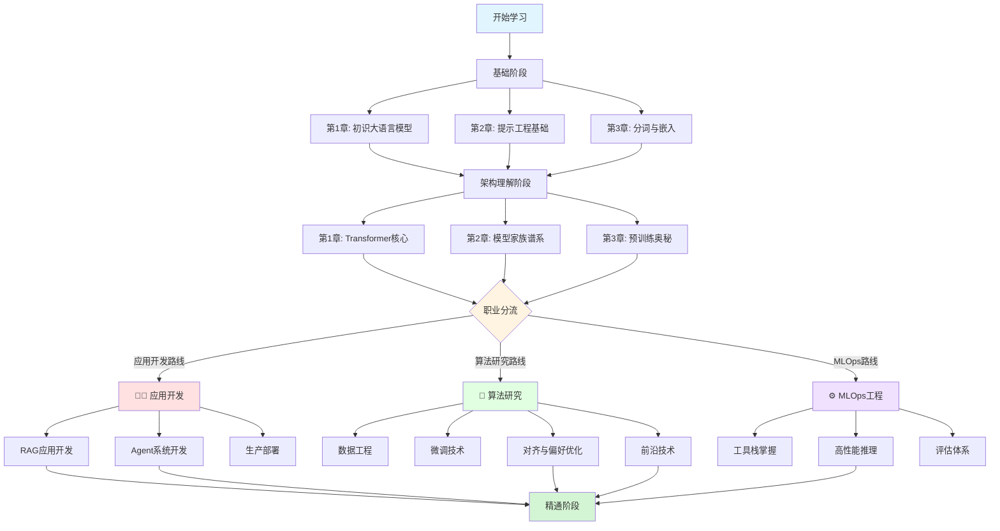

# 大模型技能树路线图 (LLM Skill Tree & Learning Paths)

> 从入门到精通，根据职业目标选择最优学习路径。

---

## 技能树总览 (Skill Tree Overview)



---

## 三大职业路线详解 (Career Paths)

### 👨‍💻 应用开发路线 (Application Developer Path)

**职业目标**：基于 LLM 构建应用（聊天机器人、RAG 系统、AI Agent）

**核心能力**：
- 熟练使用 LLM API（OpenAI、Claude、国产大模型）
- 掌握 Prompt Engineering 与工具调用（Function Calling）
- 构建 RAG 知识库与向量检索系统
- 设计 Multi-Agent 协作架构
- 部署生产级 LLM 服务

**学习路线图**：


**详细章节路径**：

| 阶段 | 章节 | 学习重点 | 时间投入 |
|:---:|:---|:---|:---:|
| **1. 入门** | [第一部分 Ch1-3](第一部分：大语言模型基础/第1章_初识大语言模型.md) | LLM 基础概念、Prompt 技巧、Token 机制 | 1周 |
| **2. 核心** | [第四部分 Ch1](第四部分：大模型应用开发/第1章_语义理解应用：文本分类与聚类.md) | 文本分类与语义理解 | 3天 |
| | [第四部分 Ch2](第四部分：大模型应用开发/第2章_检索增强生成（RAG）原理.md) | RAG 架构与向量检索 | 1周 |
| | [第四部分 Ch3](第四部分：大模型应用开发/第3章_智能体（Agent）核心机制.md) | Agent 设计模式（ReAct、MCP） | 1周 |
| **3. 部署** | [第六部分 Ch2](第六部分：生产部署与评估/第2章_vLLM高性能推理.md) | vLLM 高性能推理 | 3天 |
| | [第六部分 Ch3](第六部分：生产部署与评估/第3章_生产部署最佳实践.md) | 生产环境架构设计 | 5天 |
| **4. 工具** | [第五部分 Ch1](第五部分：工程实战工具栈/第1章_Hugging_Face生态全景.md) | Hugging Face 生态 | 3天 |
| **5. 进阶** | [第四部分 Ch4](第四部分：大模型应用开发/第4章_多模态大模型原理.md) | 多模态应用（图像理解） | 5天 |
| | [第七部分 Ch3](第七部分：高级技术专题/第3章_推理时计算增强.md) | System 2 推理增强 | 3天 |

**关键技术栈**：
```bash
# 核心依赖
pip install openai anthropic          # LLM API
pip install langchain langgraph        # Agent 框架
pip install chromadb faiss-cpu         # 向量数据库
pip install sentence-transformers     # Embedding
```

**项目实战建议**：
1. 构建一个垂直领域知识问答机器人（RAG）
2. 开发一个支持工具调用的 AI Agent（如代码生成助手）
3. 实现一个流式推理的聊天应用（WebSocket）

---

### 🧪 算法研究路线 (Research & Model Engineering Path)

**职业目标**：微调模型、优化性能、探索前沿算法

**核心能力**：
- 深入理解 Transformer 架构与注意力机制
- 掌握 LoRA/QLoRA 等参数高效微调技术
- 熟练使用 RLHF/DPO 进行模型对齐
- 处理大规模训练数据（去重、清洗、质量评估）
- 跟踪前沿论文（推理模型、MoE、长上下文）

**学习路线图**：


**详细章节路径**：

| 阶段 | 章节 | 学习重点 | 时间投入 |
|:---:|:---|:---|:---:|
| **1. 原理** | [第二部分 Ch1](第二部分：Transformer架构揭秘/第1章_Transformer核心揭秘.md) | Attention 机制数学推导 | 1周 |
| | [第二部分 Ch2](第二部分：Transformer架构揭秘/第2章_模型家族谱系：从编码器到解码器.md) | BERT/GPT/T5 对比分析 | 3天 |
| | [第二部分 Ch3](第二部分：Transformer架构揭秘/第3章_预训练的奥秘：从数据到智能.md) | Scaling Laws 与预训练 | 5天 |
| **2. 数据** | [第三部分 Ch1](第三部分：数据工程与定制化/第1章_数据工程基础.md) | MinHash 去重、数据清洗 | 1周 |
| **3. 微调** | [第三部分 Ch2](第三部分：数据工程与定制化/第2章_微调你的专属模型.md) | LoRA/QLoRA 实战 | 1周 |
| | [第三部分 Ch3](第三部分：数据工程与定制化/第3章_与人类对齐：偏好优化.md) | RLHF/DPO 完整流程 | 2周 |
| | [第三部分 Ch4](第三部分：数据工程与定制化/第4章_创建更优的嵌入模型.md) | Contrastive Learning | 5天 |
| **4. 工具** | [第五部分 Ch2](第五部分：工程实战工具栈/第2章_LLaMA-Factory微调工厂.md) | LLaMA-Factory 高效微调 | 3天 |
| | [第五部分 Ch3](第五部分：工程实战工具栈/第3章_TRL与强化学习实战.md) | TRL PPO/DPO 代码实现 | 1周 |
| | [第五部分 Ch4](第五部分：工程实战工具栈/第4章_DeepSpeed分布式训练.md) | ZeRO 分布式训练 | 1周 |
| **5. 前沿** | [第七部分 Ch1](第七部分：高级技术专题/第1章_长上下文技术.md) | RoPE、FlashAttention | 5天 |
| | [第七部分 Ch2](第七部分：高级技术专题/第2章_新型架构探索.md) | MoE、Mamba 架构 | 1周 |
| | [第七部分 Ch4](第七部分：高级技术专题/第4章_推理模型专题.md) | DeepSeek-R1 技术解密 | 1周 |
| | [第七部分 Ch5](第七部分：高级技术专题/第5章_模型安全与可解释性.md) | SAE、机械可解释性 | 1周 |

**关键技术栈**：
```bash
# 训练框架
pip install transformers peft bitsandbytes
pip install trl deepspeed accelerate

# 数据处理
pip install datasets datasketch
pip install polars apache-beam

# 评估工具
pip install lm-eval vllm
```

**论文必读清单**：
1. Attention Is All You Need (Transformer)
2. LoRA: Low-Rank Adaptation of Large Language Models
3. DPO: Direct Preference Optimization
4. Mixtral of Experts (MoE)
5. DeepSeek-R1 Technical Report

---

### ⚙️ MLOps 工程路线 (MLOps & Infrastructure Path)

**职业目标**：模型部署、服务运维、性能优化、成本控制

**核心能力**：
- 掌握模型量化与压缩技术（GPTQ、AWQ）
- 熟练使用 vLLM/TensorRT-LLM 等推理引擎
- 构建高可用 LLM 服务架构（负载均衡、流量控制）
- 显存优化与吞吐量调优
- 模型评估与 A/B Testing

**学习路线图**：


**详细章节路径**：

| 阶段 | 章节 | 学习重点 | 时间投入 |
|:---:|:---|:---|:---:|
| **1. 基础** | [第一部分 Ch1-3](第一部分：大语言模型基础/第1章_初识大语言模型.md) | LLM 基本原理 | 1周 |
| **2. 工具** | [第五部分 Ch1](第五部分：工程实战工具栈/第1章_Hugging_Face生态全景.md) | Transformers 库深度使用 | 5天 |
| | [第五部分 Ch4](第五部分：工程实战工具栈/第4章_DeepSpeed分布式训练.md) | 分布式训练基础 | 1周 |
| | [第五部分 Ch5](第五部分：工程实战工具栈/第5章_端到端LLM项目实战.md) | 完整项目生命周期 | 1周 |
| **3. 压缩** | [第六部分 Ch1](第六部分：生产部署与评估/第1章_模型压缩与推理加速.md) | 量化技术（INT4/INT8） | 1周 |
| **4. 推理** | [第六部分 Ch2](第六部分：生产部署与评估/第2章_vLLM高性能推理.md) | vLLM PagedAttention | 1周 |
| | [第六部分 Ch3](第六部分：生产部署与评估/第3章_生产部署最佳实践.md) | 架构设计与容错 | 1周 |
| **5. 评估** | [第六部分 Ch4](第六部分：生产部署与评估/第4章_模型评估体系.md) | Benchmark 与自动化评估 | 5天 |
| **6. 优化** | [第七部分 Ch1](第七部分：高级技术专题/第1章_长上下文技术.md) | KV Cache 优化 | 5天 |
| | [第七部分 Ch2](第七部分：高级技术专题/第2章_新型架构探索.md) | MoE 推理优化 | 5天 |

**关键技术栈**：
```bash
# 推理引擎
pip install vllm tensorrt-llm

# 量化工具
pip install auto-gptq autoawq

# 监控工具
pip install prometheus-client ray[serve]

# 部署框架
docker, kubernetes, nginx
```

**实战项目建议**：
1. 搭建一个支持百万级 QPS 的 LLM 推理集群
2. 实现模型热更新与 A/B Testing 系统
3. 构建 LLM 性能监控大盘（延迟、吞吐、显存）

---

## 快速导航 (Quick Navigation)

### 按部分浏览 (Browse by Section)

#### 第一部分：大语言模型基础
- [第1章：初识大语言模型](第一部分：大语言模型基础/第1章_初识大语言模型.md)
- [第2章：与模型对话：提示工程基础](第一部分：大语言模型基础/第2章_与模型对话：提示工程基础.md)
- [第3章：语言的基石：分词与嵌入](第一部分：大语言模型基础/第3章_语言的基石：分词与嵌入.md)

#### 第二部分：Transformer 架构揭秘
- [第1章：Transformer 核心揭秘](第二部分：Transformer架构揭秘/第1章_Transformer核心揭秘.md)
- [第2章：模型家族谱系：从编码器到解码器](第二部分：Transformer架构揭秘/第2章_模型家族谱系：从编码器到解码器.md)
- [第3章：预训练的奥秘：从数据到智能](第二部分：Transformer架构揭秘/第3章_预训练的奥秘：从数据到智能.md)

#### 第三部分：数据工程与定制化
- [第1章：数据工程基础](第三部分：数据工程与定制化/第1章_数据工程基础.md)
- [第2章：微调你的专属模型](第三部分：数据工程与定制化/第2章_微调你的专属模型.md)
- [第3章：与人类对齐：偏好优化](第三部分：数据工程与定制化/第3章_与人类对齐：偏好优化.md)
- [第4章：创建更优的嵌入模型](第三部分：数据工程与定制化/第4章_创建更优的嵌入模型.md)

#### 第四部分：大模型应用开发
- [第1章：语义理解应用：文本分类与聚类](第四部分：大模型应用开发/第1章_语义理解应用：文本分类与聚类.md)
- [第2章：检索增强生成（RAG）原理](第四部分：大模型应用开发/第2章_检索增强生成（RAG）原理.md)
- [第3章：智能体（Agent）核心机制](第四部分：大模型应用开发/第3章_智能体（Agent）核心机制.md)
- [第4章：多模态大模型原理](第四部分：大模型应用开发/第4章_多模态大模型原理.md)

#### 第五部分：工程实战工具栈
- [第1章：Hugging Face 生态全景](第五部分：工程实战工具栈/第1章_Hugging_Face生态全景.md)
- [第2章：LLaMA-Factory 微调工厂](第五部分：工程实战工具栈/第2章_LLaMA-Factory微调工厂.md)
- [第3章：TRL 与强化学习实战](第五部分：工程实战工具栈/第3章_TRL与强化学习实战.md)
- [第4章：DeepSpeed 分布式训练](第五部分：工程实战工具栈/第4章_DeepSpeed分布式训练.md)
- [第5章：端到端 LLM 项目实战](第五部分：工程实战工具栈/第5章_端到端LLM项目实战.md)

#### 第六部分：生产部署与评估
- [第1章：模型压缩与推理加速](第六部分：生产部署与评估/第1章_模型压缩与推理加速.md)
- [第2章：vLLM 高性能推理](第六部分：生产部署与评估/第2章_vLLM高性能推理.md)
- [第3章：生产部署最佳实践](第六部分：生产部署与评估/第3章_生产部署最佳实践.md)
- [第4章：模型评估体系](第六部分：生产部署与评估/第4章_模型评估体系.md)

#### 第七部分：高级技术专题
- [第1章：长上下文技术](第七部分：高级技术专题/第1章_长上下文技术.md)
- [第2章：新型架构探索](第七部分：高级技术专题/第2章_新型架构探索.md)
- [第3章：推理时计算增强](第七部分：高级技术专题/第3章_推理时计算增强.md)
- [第4章：推理模型专题](第七部分：高级技术专题/第4章_推理模型专题.md)
- [第5章：模型安全与可解释性](第七部分：高级技术专题/第5章_模型安全与可解释性.md)
- [第6章：大规模预训练数据工程](第七部分：高级技术专题/第6章_大规模预训练数据工程.md)

---

## 学习建议 (Study Tips)

### 时间规划 (Time Commitment)

| 路线 | 核心阶段 | 进阶阶段 | 总计 |
|:---:|:---:|:---:|:---:|
| 应用开发路线 | 4-6周 | 2-3周 | **6-9周** |
| 算法研究路线 | 6-8周 | 4-6周 | **10-14周** |
| MLOps 工程路线 | 5-7周 | 2-3周 | **7-10周** |

### 学习策略 (Strategy)

1. **理论 + 实践结合**
   - 每学完一章，必须完成代码实战
   - 推荐使用 Google Colab（免费 GPU）

2. **循序渐进**
   - 不要跳过第一部分基础章节
   - 先掌握工具使用，再深入原理

3. **项目驱动**
   - 以实际项目需求为导向
   - 推荐先做一个简单的 RAG 问答系统

4. **社区互动**
   - 关注 Hugging Face、LangChain 官方文档
   - 加入 Discord/Slack 技术社区

### 常见误区 (Common Pitfalls)

- 不要一上来就训练大模型（成本极高）
- 不要忽视数据质量（Garbage In, Garbage Out）
- 不要盲目追求最新模型（稳定性 > 性能）
- 不要忽视 Prompt Engineering（80% 问题可通过优化 Prompt 解决）

---

## 技术栈对比 (Tech Stack Comparison)

| 能力域 | 应用开发路线 | 算法研究路线 | MLOps 工程路线 |
|:---|:---:|:---:|:---:|
| **Python 编程** | ⭐⭐⭐ | ⭐⭐⭐⭐ | ⭐⭐⭐⭐ |
| **数学基础** | ⭐⭐ | ⭐⭐⭐⭐⭐ | ⭐⭐⭐ |
| **深度学习框架** | ⭐⭐ | ⭐⭐⭐⭐⭐ | ⭐⭐⭐⭐ |
| **分布式系统** | ⭐ | ⭐⭐⭐ | ⭐⭐⭐⭐⭐ |
| **云计算/容器化** | ⭐⭐ | ⭐⭐ | ⭐⭐⭐⭐⭐ |
| **前端开发** | ⭐⭐⭐ | ⭐ | ⭐⭐ |

---

## 进阶路径 (Advanced Paths)

### 从应用开发到算法研究
1. 深入学习 [第二部分：Transformer 架构](第二部分：Transformer架构揭秘/第1章_Transformer核心揭秘.md)
2. 掌握 [第三部分：微调与对齐](第三部分：数据工程与定制化/第2章_微调你的专属模型.md)
3. 研究 [第七部分：推理模型](第七部分：高级技术专题/第4章_推理模型专题.md)

### 从 MLOps 到算法研究
1. 学习 [第二部分：预训练原理](第二部分：Transformer架构揭秘/第3章_预训练的奥秘：从数据到智能.md)
2. 掌握 [第七部分：新型架构](第七部分：高级技术专题/第2章_新型架构探索.md)
3. 研究 [第七部分：大规模数据工程](第七部分：高级技术专题/第6章_大规模预训练数据工程.md)

---

## 推荐资源 (Recommended Resources)

### 官方文档
- [Hugging Face Docs](https://huggingface.co/docs)
- [LangChain Docs](https://python.langchain.com/)
- [vLLM Docs](https://docs.vllm.ai/)

### 论文阅读
- [Papers with Code - NLP](https://paperswithcode.com/area/natural-language-processing)
- [Hugging Face Daily Papers](https://huggingface.co/papers)

### 开源项目
- [LLaMA-Factory](https://github.com/hiyouga/LLaMA-Factory)
- [vLLM](https://github.com/vllm-project/vllm)
- [LangGraph](https://github.com/langchain-ai/langgraph)

---

> **最后更新**：2026-01-25
> **作者**：Claude Code
> **反馈**：如有问题或建议，欢迎提交 Issue！
