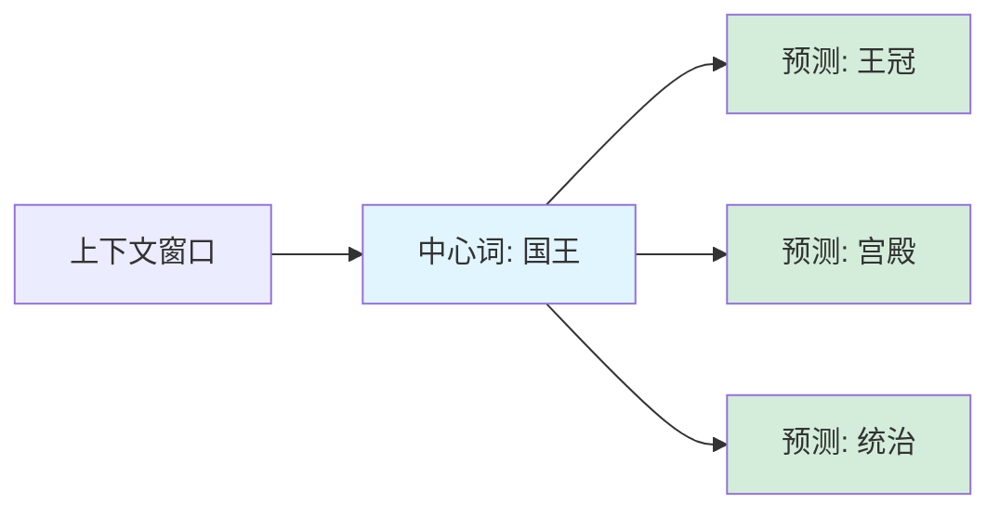
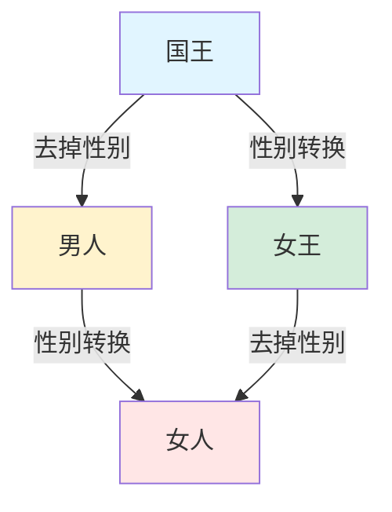
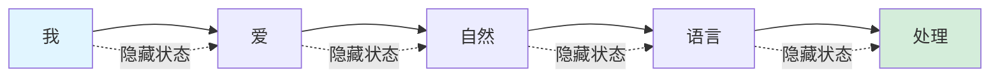
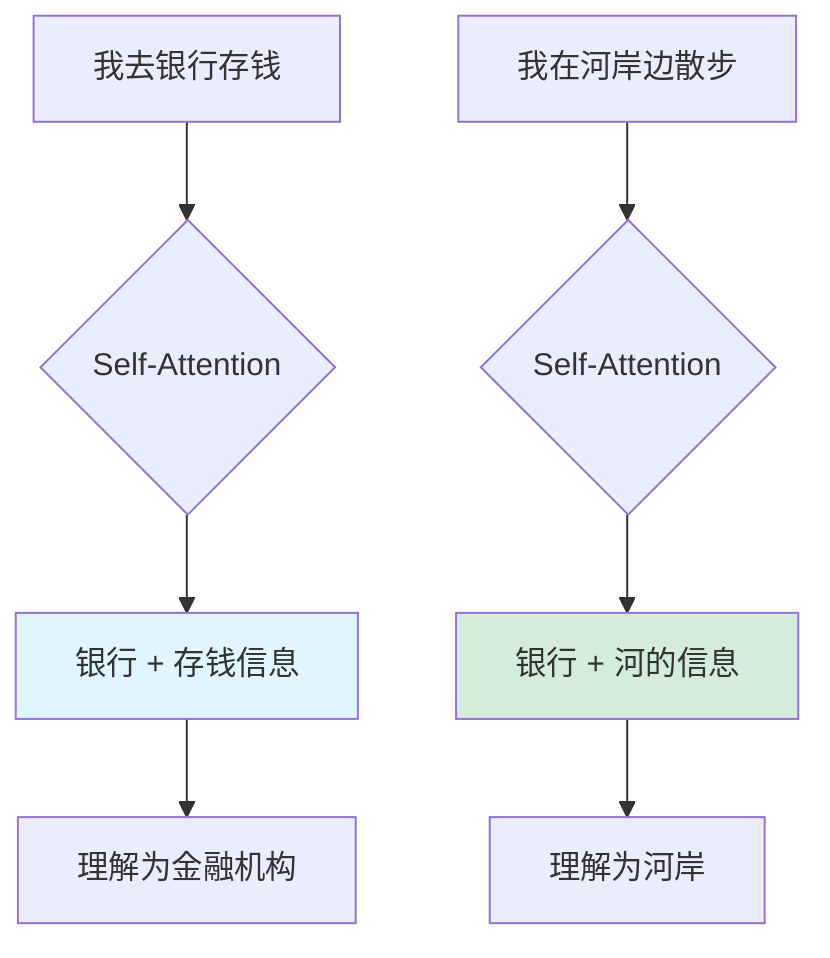
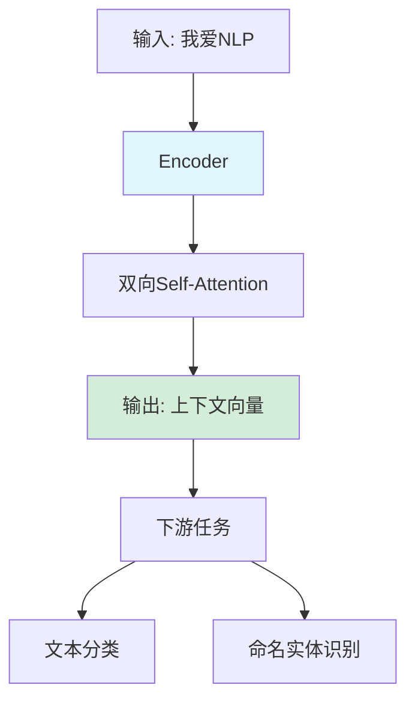
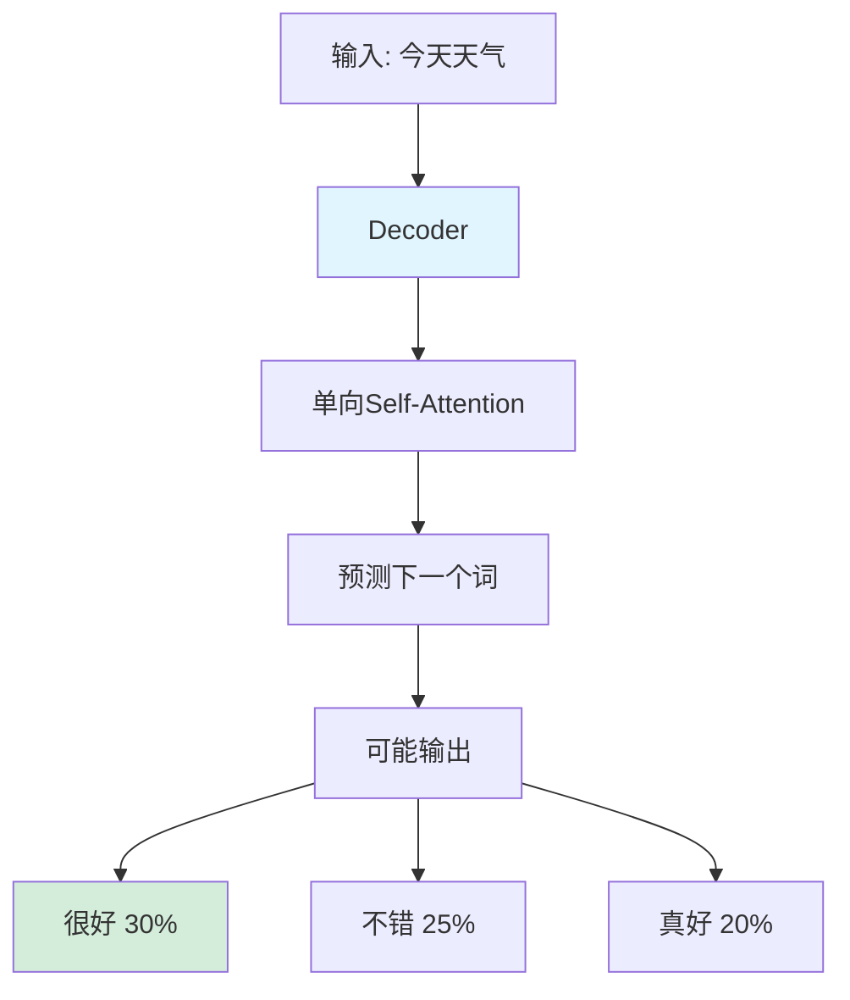
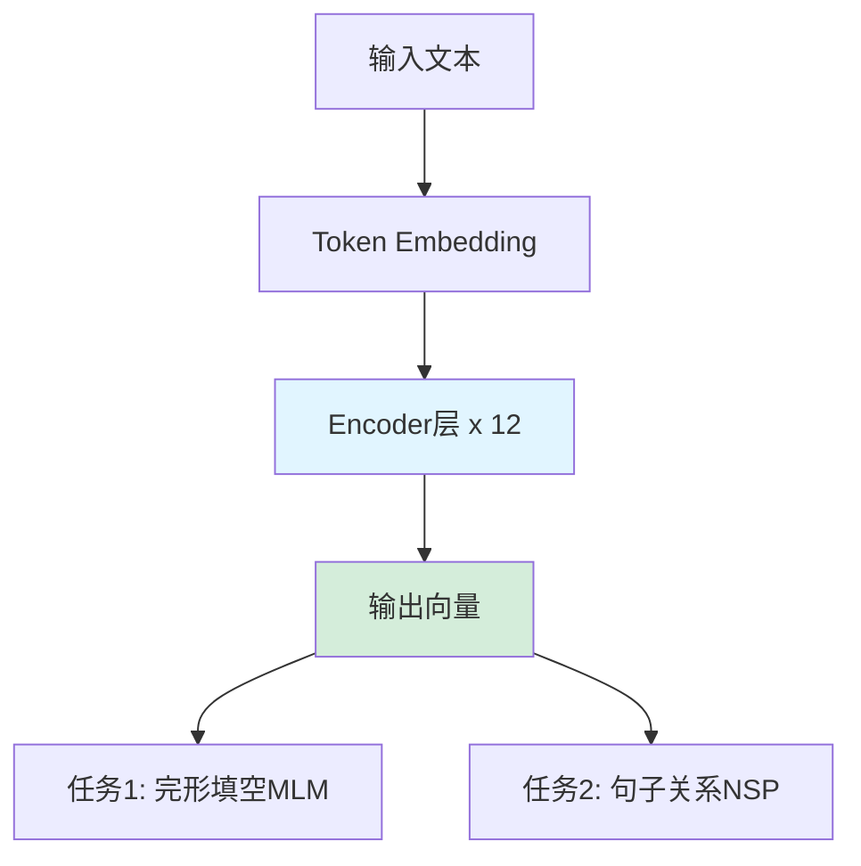
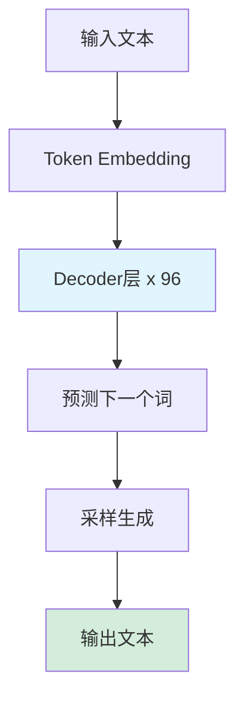
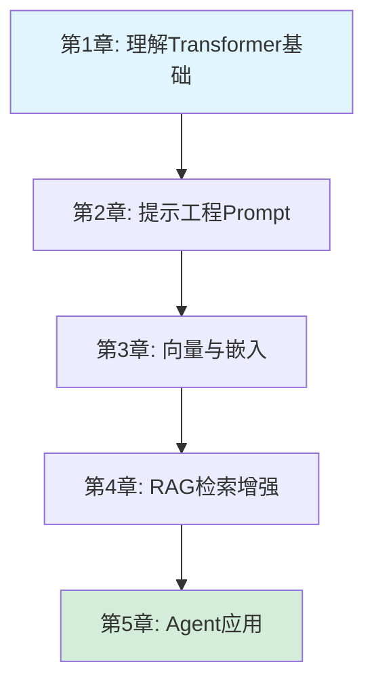
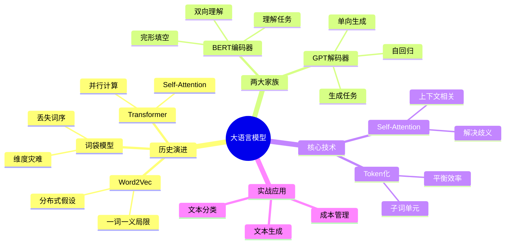

# 第1章：初识大语言模型

> "The best way to predict the future is to invent it."
> — **Alan Kay**, 计算机科学家

**本章承诺**：带你穿越NLP发展史，理解为什么我们需要大语言模型，以及它们如何从"词袋"进化到"大脑"。

---

## 目录
- [引言：穿越NLP发展史](#引言穿越nlp发展史)
- [一、一段简史：从"词袋"到"大脑"](#一一段简史从词袋到大脑)
  - [词袋模型的局限](#词袋模型的局限)
  - [为什么需要更好的表示](#为什么需要更好的表示)
- [二、词嵌入：让计算机理解"国王-男人=女王"](#二词嵌入让计算机理解国王-男人女王)
  - [分布式假设：物以类聚，词以群分](#分布式假设物以类聚词以群分)
  - [Word2Vec：神奇的词向量](#word2vec神奇的词向量)
  - [词嵌入的局限性](#词嵌入的局限性)
- [三、Transformer革命：从"读死书"到"举一反三"](#三transformer革命从读死书到举一反三)
  - [RNN的困境：梯度消失](#rnn的困境梯度消失)
  - [Self-Attention：理解上下文的艺术](#self-attention理解上下文的艺术)
  - [Encoder vs Decoder：两种思维方式](#encoder-vs-decoder两种思维方式)
- [四、认识两大模型家族](#四认识两大模型家族)
  - [BERT：双向理解的大师](#bert双向理解的大师)
  - [GPT：生成式的魔法师](#gpt生成式的魔法师)
  - [两者的区别与适用场景](#两者的区别与适用场景)
- [五、动手实践：与大模型对话](#五动手实践与大模型对话)
  - [实战一：文本生成（流式输出）](#实战一文本生成流式输出)
  - [实战二：文本分类（情感分析）](#实战二文本分类情感分析)
  - [实战三：Token计数与成本估算](#实战三token计数与成本估算)
- [六、新手问答](#六新手问答)
- [七、本章小结](#七本章小结)

---

## 引言：穿越NLP发展史

想象一下，你是一个从未接触过语言的外星人，突然被投放到地球。你看到人类用奇怪的符号（文字）交流，发出各种声音（语言）。你的任务是：**理解并使用这些符号和声音**。

这就是自然语言处理（NLP）面临的核心挑战：**如何让计算机理解人类语言**？

在过去的几十年里，人类尝试了各种方法：
- **1950-1990年代**：基于规则的方法（专家系统）
- **1990-2010年代**：统计方法（词袋模型、n-gram）
- **2013-2017年**：词嵌入时代（Word2Vec、GloVe）
- **2017-2020年**：Transformer革命（BERT、GPT）
- **2020年至今**：大语言模型时代（GPT-3/4、Claude、ChatGPT）

让我们一起回到起点，看看这段激动人心的演化历程。

---

## 一、一段简史：从"词袋"到"大脑"

### 词袋模型的局限

在深度学习出现之前，NLP领域最常用的方法是**词袋模型**（Bag of Words, BoW）。

**核心思想**：把文本看作一个"词的袋子"，只关心词出现的频率，不关心词的顺序。

#### 举个例子

```python
句子1: "我爱自然语言处理"
句子2: "自然语言处理爱我"

# 词袋表示（词频统计）
句子1: {"我": 1, "爱": 1, "自然": 1, "语言": 1, "处理": 1}
句子2: {"自然": 1, "语言": 1, "处理": 1, "爱": 1, "我": 1}

# 结果：两个句子完全相同！❌
```

**问题显而易见**：
1. **丢失了词序信息**："我爱你" vs "你爱我" 完全不同
2. **无法捕捉语义**："国王" 和 "女王" 的关系无法表示
3. **维度灾难**：词表有10万个词，每个句子都是10万维的稀疏向量

---

### 为什么需要更好的表示

**问题**：如何让计算机理解"国王"和"女王"的关系？

在词袋模型中：
```python
"国王" → [0, 0, 0, ..., 1, ..., 0]  # 第34567个位置是1
"女王" → [0, 0, 0, ..., 1, ..., 0]  # 第78901个位置是1

# 这两个向量完全没有关系！
```

**理想的表示**：

```python
"国王" → [0.8, 0.2, 0.9, ...]  # 密集向量
"女王" → [0.7, 0.3, 0.9, ...]  # 相似的向量

# 可以计算相似度：
similarity("国王", "女王") = 0.85  # 很相似！
```

这就是**词嵌入**要解决的问题。

---

## 二、词嵌入：让计算机理解"国王-男人=女王"

### 分布式假设：物以类聚，词以群分

词嵌入的理论基础是**分布式假设**（Distributional Hypothesis）：

> "You shall know a word by the company it keeps."
> "一个词的含义由它的上下文决定。"
> — **J.R. Firth**, 语言学家（1957）

**直觉理解**：
- "国王"经常和"王冠、宫殿、统治"一起出现
- "女王"经常和"王冠、宫殿、统治"一起出现
- "猫"经常和"喵喵、爪子、宠物"一起出现

**结论**：上下文相似的词，语义也相似。

---

### Word2Vec：神奇的词向量

**Word2Vec**（2013年，Google）是词嵌入时代的里程碑。

#### 核心思想

**训练目标**：给定一个词，预测它的上下文词（或反过来）。

两种训练方式：
1. **Skip-gram**：用中心词预测上下文
2. **CBOW**：用上下文预测中心词

#### Skip-gram 图示



#### 训练过程示例

```python
# 训练语料
句子: "国王坐在华丽的王座上"

# 窗口大小=2，中心词="国王"
上下文: ["坐在", "华丽"]

# 训练目标
输入: "国王"的向量
输出: 预测"坐在"和"华丽"的概率要高

# 经过数百万次训练后
"国王"的向量 → [0.25, 0.78, -0.45, 0.12, ...]
"女王"的向量 → [0.27, 0.75, -0.43, 0.15, ...]
# 两个向量非常相似！
```

---

#### 神奇的类比能力

经过训练后，Word2Vec能学到惊人的语义关系：

```python
# 向量运算
"国王" - "男人" + "女人" ≈ "女王"

# 实际数值（简化版）
king = [0.8, 0.2, 0.9, 0.1]
man = [0.5, 0.1, 0.2, 0.1]
woman = [0.5, 0.1, 0.2, 0.8]

king - man + woman = [0.8, 0.2, 0.9, 0.8]
# 最接近的词就是 "queen"！

# 更多例子
"巴黎" - "法国" + "德国" ≈ "柏林"
"走" - "走了" + "去" ≈ "去了"
```

**为什么会这样？**

因为模型从语料中学到了：
- "国王"和"女王"的关系 = "男人"和"女人"的关系
- 这些关系都编码在向量空间的几何结构中



---

### 词嵌入的局限性

尽管Word2Vec非常强大，但它有一个致命缺陷：**一词一义**。

#### 问题示例

```python
句子1: "我去银行存钱"
句子2: "我在河岸边散步"

# Word2Vec中，"银行"只有一个向量
"银行" → [0.3, 0.5, -0.2, ...]

# 问题：
# - 句子1中的"银行"是金融机构
# - 句子2中的"银行"是河岸（英文都是"bank"）
# - 但它们的向量表示完全相同！
```

**根本原因**：Word2Vec是**静态嵌入**，每个词只有一个固定的向量，无法根据上下文动态调整。

**我们需要什么？**
- **上下文相关的表示**：同一个词在不同句子中有不同的向量
- **这就是Transformer要解决的问题**

---

## 三、Transformer革命：从"读死书"到"举一反三"

### RNN的困境：梯度消失

在Transformer之前，NLP主要使用**循环神经网络**（RNN）处理序列数据。

#### RNN的工作方式



**问题**：处理长句子时，早期的信息会逐渐"消失"。

```python
句子: "我昨天去超市买了很多东西，包括牛奶、面包、鸡蛋，
      然后我回家把它们放进冰箱，之后我发现【】忘记带了。"

# RNN处理到【】时：
# - "我"、"昨天"、"超市"的信息已经模糊
# - 很难准确填空
```

**这就是著名的"梯度消失"问题**。

---

### Self-Attention：理解上下文的艺术

**Transformer的核心创新**：Self-Attention（自注意力机制）。

#### 直觉理解

```python
句子: "我去银行存钱"

# Self-Attention会计算每个词之间的关联度
"银行" 关注:
  - "存钱" → 高权重（0.8）
  - "我" → 中等权重（0.3）
  - "去" → 低权重（0.1）

# 结果："银行"的向量会融合"存钱"的信息
# → 模型理解这里是"金融机构"

---

句子: "我在河岸边散步"

# Self-Attention会重新计算
"银行" 关注:
  - "河" → 高权重（0.7）
  - "散步" → 中等权重（0.4）
  - "在" → 低权重（0.2）

# 结果："银行"的向量会融合"河"的信息
# → 模型理解这里是"河岸"
```

**可视化**：



---

#### Self-Attention的优势

**对比RNN**：

| 维度 | RNN | Transformer |
|------|-----|-------------|
| **处理长文本** | ❌ 梯度消失 | ✅ 直接关联任意位置 |
| **并行计算** | ❌ 必须顺序处理 | ✅ 可以并行 |
| **训练速度** | 慢 | 快（10倍以上） |
| **长距离依赖** | 弱 | 强 |

**关键公式**（简化版）：

```python
# 给定查询词 Q（如"银行"）
# 和所有键 K（句子中的其他词）

# 1. 计算注意力分数
scores = Q · K  # 点积

# 2. 归一化为概率
attention_weights = softmax(scores)

# 3. 加权求和值 V
output = attention_weights · V

# 结果：output 是融合了上下文的新向量
```

---

### Encoder vs Decoder：两种思维方式

Transformer有两种架构：

#### 1. Encoder（编码器）

**目标**：理解输入文本的含义



**特点**：
- **双向注意力**：每个词可以看到前后所有词
- **擅长理解**：适合分类、提取任务

---

#### 2. Decoder（解码器）

**目标**：根据已有信息生成下一个词



**特点**：
- **单向注意力**（因果注意力）：只能看到当前词之前的内容
- **擅长生成**：适合续写、翻译、对话

---

**为什么不能双向？**

```python
# 假设使用双向注意力生成文本
输入: "今天天气"
任务: 预测下一个词

# 如果能看到未来：
模型看到: "今天天气【很好】，我们去..."
# 答案已经泄露了！这是作弊！

# 单向注意力（遮挡未来）：
模型只看到: "今天天气【？】"
# 必须根据"今天天气"推理下一个词
```

---

## 四、认识两大模型家族

### BERT：双向理解的大师

**BERT** (Bidirectional Encoder Representations from Transformers, 2018)

#### 架构



#### 预训练任务

**1. 完形填空（Masked Language Modeling, MLM）**

```python
原句: "我爱自然语言处理"
遮挡: "我爱[MASK]语言处理"

# BERT任务：预测[MASK]是什么
模型预测:
  - "自然" → 85%  ✅
  - "人工" → 10%
  - "编程" → 3%
```

**2. 句子关系判断（Next Sentence Prediction, NSP）**

```python
句子A: "今天天气很好"
句子B: "我们去公园吧"
标签: 相关 ✅

句子A: "今天天气很好"
句子B: "量子力学很复杂"
标签: 不相关 ❌
```

#### 适用场景

```python
# 文本分类
输入: "这部电影太棒了！"
BERT: [情感分析] → 正面 ✅

# 命名实体识别
输入: "乔布斯创立了苹果公司"
BERT: [实体提取] → "乔布斯"(人名), "苹果公司"(组织)

# 问答系统
输入: "问题: 谁发明了电灯？上下文: 爱迪生在1879年发明了电灯。"
BERT: [答案提取] → "爱迪生"
```

---

### GPT：生成式的魔法师

**GPT** (Generative Pre-trained Transformer, 2018-2023)

#### 架构



#### 预训练任务

**自回归语言模型**（Autoregressive Language Modeling）

```python
输入: "我爱自然语言"
任务: 预测下一个词

# GPT学习：
P("处理" | "我爱自然语言") = 0.65  # 高概率
P("规律" | "我爱自然语言") = 0.10
P("科学" | "我爱自然语言") = 0.08
```

#### 演化历程

| 模型 | 年份 | 参数量 | 核心能力 |
|------|------|--------|---------|
| GPT-1 | 2018 | 117M | 基础文本生成 |
| GPT-2 | 2019 | 1.5B | 零样本学习 |
| GPT-3 | 2020 | 175B | 上下文学习（ICL） |
| GPT-3.5 | 2022 | 175B | 指令跟随（ChatGPT） |
| GPT-4 | 2023 | ~1.8T | 多模态、推理增强 |

---

### 两者的区别与适用场景

**对比表**：

| 维度 | BERT (Encoder) | GPT (Decoder) |
|------|---------------|--------------|
| **注意力方向** | 双向 | 单向（因果） |
| **训练目标** | 完形填空 + 句子关系 | 预测下一个词 |
| **擅长任务** | 理解、分类、提取 | 生成、对话、续写 |
| **典型应用** | 搜索、问答、NER | ChatGPT、代码生成 |
| **参数量** | <1B | >100B |
| **涌现能力** | 弱 | 强（思维链、工具调用） |

**为什么GPT胜出？**

1. **生成任务更通用**：续写可以变成翻译、摘要、问答
2. **扩展性更好**：Decoder架构更适合扩展到超大规模
3. **涌现能力**：参数量超过100B后，出现思维链推理、工具调用等"魔法"

---

## 五、动手实践：与大模型对话

现在，让我们用**DeepSeek**（国产大模型）实际体验大模型的能力。

### 实战一：文本生成（流式输出）

**为什么需要流式输出？**

```python
# 非流式：用户等待10秒
response = client.chat.completions.create(
    messages=[{"role": "user", "content": "写一篇500字文章"}]
)
print(response.choices[0].message.content)
# 10秒后一次性显示全部 ⏳

# 流式：像ChatGPT一样逐字显示
# 用户体验更好 ✅
```

---

#### 代码实现

```python
from openai import OpenAI

# 配置DeepSeek API
client = OpenAI(
    api_key="sk-your-api-key",  # 替换为你的API密钥
    base_url="https://api.deepseek.com"
)

# 流式生成
stream = client.chat.completions.create(
    model="deepseek-chat",
    messages=[
        {"role": "user", "content": "给我讲一个关于Transformer的故事"}
    ],
    stream=True,  # 启用流式输出
    temperature=0.7
)

print("AI回复：", end="", flush=True)

# 逐块接收内容
for chunk in stream:
    if chunk.choices[0].delta.content:
        print(chunk.choices[0].delta.content, end="", flush=True)

print()  # 换行
```

**运行效果**：

```text
AI回复：从前，有一个神经网络叫RNN，它每天辛苦地处理文本...（逐字显示）
```

---

#### 高级：带打字机效果

```python
import time

def typewriter_effect(text, delay=0.03):
    """模拟打字机效果"""
    for char in text:
        print(char, end="", flush=True)
        time.sleep(delay)

# 流式 + 打字机
stream = client.chat.completions.create(
    model="deepseek-chat",
    messages=[{"role": "user", "content": "解释Self-Attention"}],
    stream=True
)

for chunk in stream:
    if chunk.choices[0].delta.content:
        typewriter_effect(chunk.choices[0].delta.content)
```

---

### 实战二：文本分类（情感分析）

**任务**：判断电影评论是正面还是负面。

#### 方法1：零样本分类

```python
def sentiment_analysis(text):
    """情感分析"""
    messages = [
        {
            "role": "system",
            "content": "你是一个情感分析专家。分析文本情感，只回答'正面'或'负面'。"
        },
        {
            "role": "user",
            "content": f"分析以下评论的情感：\n{text}"
        }
    ]

    response = client.chat.completions.create(
        model="deepseek-chat",
        messages=messages,
        temperature=0  # 确定性输出
    )

    return response.choices[0].message.content

# 测试
reviews = [
    "这部电影太棒了！演员演技精湛，剧情引人入胜。",
    "浪费时间，剧情拖沓，演技尴尬。",
    "还可以，有些地方不错，但整体一般。"
]

for review in reviews:
    sentiment = sentiment_analysis(review)
    print(f"评论: {review}")
    print(f"情感: {sentiment}\n")
```

**输出**：

```text
评论: 这部电影太棒了！演员演技精湛，剧情引人入胜。
情感: 正面

评论: 浪费时间,剧情拖沓，演技尴尬。
情感: 负面

评论: 还可以，有些地方不错，但整体一般。
情感: 中性
```

---

#### 方法2：少样本学习（Few-shot）

```python
def few_shot_sentiment(text):
    """少样本情感分析"""
    messages = [
        {
            "role": "system",
            "content": "你是情感分析专家。"
        },
        {
            "role": "user",
            "content": """示例：
评论: "太好看了！强烈推荐。"
情感: 正面

评论: "无聊透顶，不建议观看。"
情感: 负面

评论: "画面精美，但剧情一般。"
情感: 中性

---

现在分析以下评论：
评论: "{}"
情感:""".format(text)
        }
    ]

    response = client.chat.completions.create(
        model="deepseek-chat",
        messages=messages,
        temperature=0
    )

    return response.choices[0].message.content

# 测试
result = few_shot_sentiment("特效炸裂，但故事太弱了。")
print(result)  # 输出: 中性
```

---

### 实战三：Token计数与成本估算

**为什么关心Token数？**
1. **计费单位**：API按Token收费
2. **上下文限制**：模型有最大Token窗口（如128K）
3. **速度影响**：Token越多，推理越慢

---

#### Token计数

```python
import tiktoken

# 加载Tokenizer
encoding = tiktoken.get_encoding("cl100k_base")

# 计算Token数
text = "Transformer彻底改变了NLP领域"
tokens = encoding.encode(text)

print(f"文本: {text}")
print(f"Token IDs: {tokens}")
print(f"Token数: {len(tokens)}")

# 输出:
# Token IDs: [65387, 55040, 104762, 57095, 95885, 51343]
# Token数: 6
```

---

#### 成本估算

```python
def estimate_cost(messages, model="deepseek-chat"):
    """估算对话成本"""
    encoding = tiktoken.get_encoding("cl100k_base")

    # 计算输入Token
    input_tokens = 0
    for msg in messages:
        input_tokens += len(encoding.encode(msg["content"]))

    # 假设输出200 tokens
    output_tokens = 200

    # DeepSeek定价（2025年1月）
    input_price = 0.001 / 1000   # ¥0.001每1K tokens
    output_price = 0.002 / 1000  # ¥0.002每1K tokens

    cost = input_tokens * input_price + output_tokens * output_price

    print(f"输入Token: {input_tokens}")
    print(f"预计输出Token: {output_tokens}")
    print(f"预计成本: ¥{cost:.6f}")

    return cost

# 示例
messages = [
    {"role": "system", "content": "你是Python专家。"},
    {"role": "user", "content": "如何实现快速排序？"}
]

estimate_cost(messages)

# 输出:
# 输入Token: 18
# 预计输出Token: 200
# 预计成本: ¥0.000418
```

---

#### 上下文窗口管理

```python
def trim_messages(messages, max_tokens=4000):
    """裁剪消息历史以适应上下文窗口"""
    encoding = tiktoken.get_encoding("cl100k_base")

    # 保留system消息
    system_msg = messages[0] if messages[0]["role"] == "system" else None
    chat_history = messages[1:] if system_msg else messages

    total_tokens = 0
    trimmed_history = []

    # 从最新消息往前计算
    for msg in reversed(chat_history):
        msg_tokens = len(encoding.encode(msg["content"]))
        if total_tokens + msg_tokens > max_tokens:
            break
        trimmed_history.insert(0, msg)
        total_tokens += msg_tokens

    # 重新组合
    result = [system_msg] + trimmed_history if system_msg else trimmed_history

    print(f"原始消息数: {len(messages)}")
    print(f"裁剪后消息数: {len(result)}")
    print(f"总Token数: {total_tokens}")

    return result
```

---

## 六、新手问答

### Q1: BERT和GPT到底有什么区别？

**简单记忆法**：

```text
BERT = 完形填空高手（双向理解）
GPT = 作文写作能手（单向生成）
```

**深入对比**：

| 维度 | BERT | GPT |
|------|------|-----|
| **训练方式** | 遮挡词，预测被遮挡的 | 根据前文，预测下一个词 |
| **注意力** | 双向（能看到前后文） | 单向（只能看到前文） |
| **擅长** | 理解、分类 | 生成、对话 |
| **典型应用** | 搜索引擎、问答系统 | ChatGPT、代码生成 |

**为什么GPT更火？**
- 生成任务包含了理解任务（续写→翻译、摘要）
- 扩展到超大规模后，涌现了推理能力

---

### Q2: 为什么Transformer比RNN好？

**核心差异**：

```python
# RNN：顺序处理（串行）
输入: "我 爱 自然 语言 处理"
处理: 我 → 爱 → 自然 → 语言 → 处理
      ↓    ↓     ↓      ↓      ↓
      h1 → h2 → h3 → h4 → h5

# 问题：
# 1. 处理到h5时，h1的信息已经模糊（梯度消失）
# 2. 必须顺序处理，无法并行

---

# Transformer：并行处理
输入: "我 爱 自然 语言 处理"
处理: 所有词同时进入 → Self-Attention
      ↓
      每个词都能直接看到其他所有词

# 优势：
# 1. 没有梯度消失（直接连接）
# 2. 可以并行计算（速度快10倍）
```

---

### Q3: 什么是"涌现能力"？

**定义**：模型规模达到某个临界点后，突然出现的新能力。

**案例**：

```python
# 参数量 < 10B
模型: "1 + 1 = ?"
输出: "2"  # 只是记忆

模型: "小明有5个苹果，给了小红2个，还剩几个？"
输出: "3个苹果"  # 错误或不稳定

---

# 参数量 > 100B (如GPT-3)
模型: "1 + 1 = ?"
输出: "2"

模型: "小明有5个苹果，给了小红2个，还剩几个？"
输出: "让我逐步思考：
       初始：5个
       给出：2个
       剩余：5 - 2 = 3个
       答案：还剩3个苹果。"  # 涌现了思维链推理！
```

**涌现能力包括**：
- 思维链推理（Chain-of-Thought）
- 上下文学习（In-Context Learning）
- 工具调用（Function Calling）

---

### Q4: 为什么需要这么大的模型？

**Scaling Law**（缩放定律）：

```text
模型性能 ∝ 参数量^0.73 × 训练数据量^0.28
```

**数据说明**：

| 模型 | 参数量 | 能力 |
|------|--------|------|
| GPT-2 | 1.5B | 基础续写 |
| GPT-3 | 175B | 零样本学习 |
| GPT-4 | ~1.8T | 复杂推理 |

**类比**：
- 小模型 = 小学生：只能做简单题
- 大模型 = 博士：能处理复杂推理

**但也有代价**：

- 训练成本：GPT-3训练费用 ~$5,000,000
- 推理速度：70B模型比7B慢10倍
- 部署成本：需要高端GPU

---

### Q5: 我应该学BERT还是GPT？

**建议**：

```text
2025年建议：优先学GPT系列
```

**原因**：
1. **应用更广**：ChatGPT、Claude、文心一言都是GPT架构
2. **更易上手**：只需调用API，无需训练模型
3. **生态更好**：有LangChain、LlamaIndex等丰富工具链

**学习路径**：


---

## 七、本章小结

### 核心收获

1. **NLP演化史**：
   - 词袋模型 → 只看词频，丢失语序
   - Word2Vec → 学会语义，但一词一义
   - Transformer → 上下文相关，动态表示

2. **Transformer核心**：
   - Self-Attention → 理解上下文
   - Encoder → 双向理解（BERT）
   - Decoder → 单向生成（GPT）

3. **两大家族**：
   - BERT = 理解大师（分类、提取）
   - GPT = 生成魔法师（对话、续写）

4. **实战能力**：
   - 流式输出 → 提升用户体验
   - 情感分析 → 零样本/少样本学习
   - Token管理 → 控制成本

---

### 思维导图



---

### 下一章预告

在**第2章《与模型对话：提示工程基础》**中，我们将深入探讨：

1. **零样本 vs 少样本学习**：如何让模型"举一反三"
2. **思维链（Chain-of-Thought）**：为什么"逐步思考"能提升准确率
3. **提示词工程**：如何设计高质量Prompt
4. **温度与采样策略**：精确控制模型输出

**核心问题**：
> "如何让LLM从'能用'到'好用'？"

