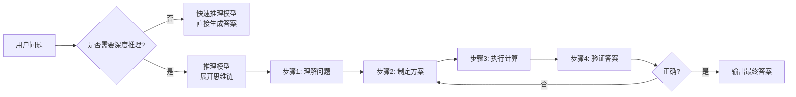
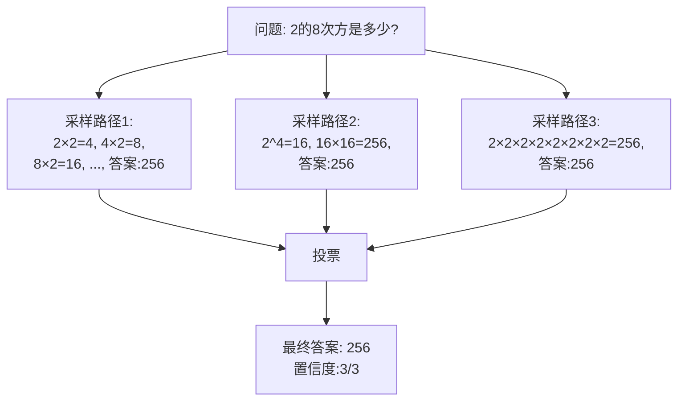
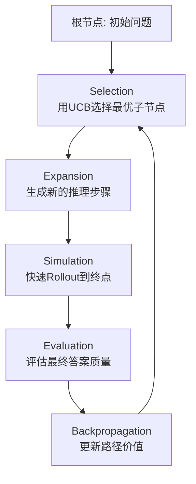
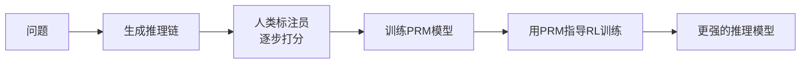
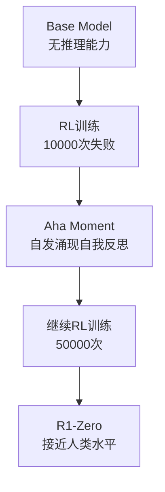
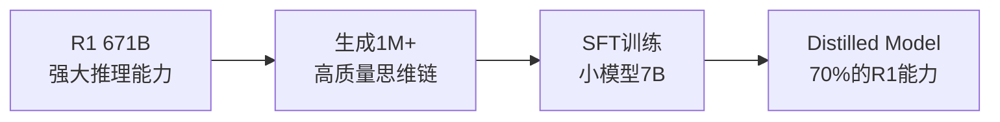
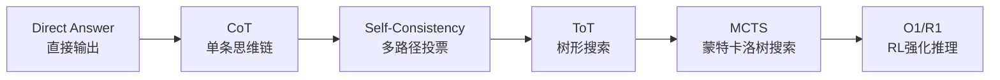

# 第4章：推理模型专题 (Reasoning Models: O1 & DeepSeek-R1)

> 2024-2025年最火的赛道。从 OpenAI 的闭源 o1 到 DeepSeek 的开源 R1，大模型终于学会了"慢思考"。本章深入探讨推理模型的理论基础、核心技术与实战应用。

---

## 目录
- [一、推理模型的理论基础](#一推理模型的理论基础)
- [二、OpenAI o1 的技术猜想](#二openai-o1-的技术猜想)
- [三、DeepSeek-R1 的技术解密](#三deepseek-r1-的技术解密)
- [四、推理时计算增强实战](#四推理时计算增强实战)
- [五、验证器 (Verifier) 训练](#五验证器-verifier-训练)
- [本章小结](#本章小结)

---

## 一、推理模型的理论基础

### 1. 什么是推理模型?

推理模型(Reasoning Model)是指能够进行**多步骤逻辑推理**的大语言模型。与传统的"快速响应"模式不同,推理模型会：

1. **展开思维链** - 将复杂问题分解为多个子问题
2. **自我验证** - 检查中间步骤的正确性
3. **回溯修正** - 发现错误时重新推理

这种能力在数学、代码、逻辑推理等任务上至关重要。

#### 快速推理 vs 深度推理

| 特性 | 快速推理 (Fast Thinking) | 深度推理 (Slow Thinking) |
|------|------------------------|------------------------|
| **响应时间** | 秒级 | 分钟级 |
| **思考步骤** | 1-3步 | 10-100+步 |
| **适用场景** | 闲聊、翻译、摘要 | 数学、编程、逻辑推理 |
| **代表模型** | GPT-4、Claude-3 | O1、R1 |
| **成本** | 低 | 高(10-50倍) |



### 2. Chain-of-Thought (CoT) 的数学原理

CoT 的核心思想是:**让模型输出中间推理步骤,而不是直接给出答案**。

#### 2.1 传统生成 vs CoT生成

**传统方式(Direct Answer)**:
```
Q: Roger有5个网球。他又买了2罐网球,每罐3个球。他现在有多少个网球?
A: 11个
```

**CoT方式**:
```
Q: Roger有5个网球。他又买了2罐网球,每罐3个球。他现在有多少个网球?
A: 让我一步步思考:
1. Roger最初有5个球
2. 他买了2罐,每罐3个,所以是 2×3=6个球
3. 总共: 5+6=11个球
答案: 11个
```

#### 2.2 为什么CoT有效? 概率视角

设问题为 $q$,答案为 $a$,中间步骤为 $z$。

**传统模型**: 直接建模 $P(a|q)$

**CoT模型**: 建模 $P(a, z|q) = P(z|q) \cdot P(a|z, q)$

通过边际化:
$$
P(a|q) = \sum_z P(z|q) \cdot P(a|z, q)
$$

**关键洞察**: 即使单个路径 $P(z|q)$ 不准确,通过采样多条路径并投票(Self-Consistency),可以提高最终答案的准确率!

#### 2.3 Self-Consistency: CoT的增强版

算法流程:
1. 对同一问题,采样 $N$ 条不同的推理链 $\{z_1, z_2, ..., z_N\}$
2. 提取每条链的最终答案 $\{a_1, a_2, ..., a_N\}$
3. 通过多数投票选出最终答案: $a^* = \arg\max_a \sum_{i=1}^N \mathbb{1}[a_i = a]$



---

## 二、推理时计算增强 (Test-Time Compute)

### 1. 推理时计算：新的 Scaling Law

#### 从训练时到推理时的范式转变

**传统范式**：性能 ∝ 训练时计算（模型参数、数据量、训练FLOPs）。

**新范式**：性能 = f(模型参数, 训练数据, **推理时计算**)。

**核心洞察**：
*   在推理时"多思考几步"，性价比远高于暴力增大模型。
*   **小模型 + 长思考 ≈ 大模型 + 短思考**。

#### 2. 数学基础：搜索算法

推理过程可以建模为**状态空间搜索**：
*   **状态 $s_t$**：当前推理链。
*   **动作 $a_t$**：生成下一步。
*   **目标**：找到通往正确答案的路径。

| 算法 | 策略 | 计算开销 | 适用场景 |
| :--- | :--- | :--- | :--- |
| **Greedy** | 每步选最佳 | 1x | 简单问题 |
| **Beam Search** | 保留 Top-K 路径 | Kx | 中等复杂度 |
| **Best-of-N** | 采样 N 次取最佳 | Nx | 不确定性高 |
| **MCTS** | 蒙特卡洛树搜索 | 10-100x | 复杂推理 (AlphaGo 范式) |

---

## 三、高级推理算法实战

### 1. Tree-of-Thoughts (ToT)

**原理**：让模型在思维树上进行 DFS/BFS 搜索，允许回溯（Backtracking）。

**代码实现 (24点游戏求解器)**：

```python
class ToTSolver:
    """Tree-of-Thoughts 求解器"""
    def __init__(self, model):
        self.model = model

    def generate_thoughts(self, state, k=3):
        """生成 k 个后续步骤"""
        prompt = f"当前状态：{state}\n请给出{k}个可能的下一步："
        return self.model.generate(prompt, n=k)

    def evaluate_state(self, state):
        """评估状态价值 (0-1)"""
        prompt = f"评估以下状态解决问题的可能性(0-10分)：{state}"
        score = self.model.generate(prompt)
        return float(score) / 10

    def bfs_solve(self, initial_state):
        frontier = [(initial_state, 0)] # (状态, 分数)

        while frontier:
            # 1. 扩展 (Expansion)
            current_state, _ = frontier.pop(0)
            thoughts = self.generate_thoughts(current_state)

            # 2. 评估 (Evaluation)
            candidates = []
            for thought in thoughts:
                score = self.evaluate_state(thought)
                if score > 0.8: # 剪枝
                    candidates.append((thought, score))

            frontier.extend(candidates)

            # 3. 检查结束条件
            for cand, score in candidates:
                if self.is_solved(cand):
                    return cand
        return "无解"
```

### 2. Best-of-N (Rejection Sampling)

**原理**：单纯地"大力出奇迹"。生成 N 个答案，然后用**验证器 (Verifier)** 挑最好的。

*   **N=1**: 18.1% (MATH数据集)
*   **N=10**: 31.5%
*   **N=100**: 42.3%

**关键**：你需要一个好的验证器（Reward Model 或 代码执行器）。

### 3. MCTS (蒙特卡洛树搜索)

这是 AlphaGo 的核心，也是未来推理引擎的终极形态。

#### MCTS 四步循环

1.  **Selection (选择)**: 选择最有潜力的节点（利用 UCB 公式平衡探索与利用）。
2.  **Expansion (扩展)**: 生成下一个 Token 或 步骤。
3.  **Simulation (模拟)**: 快速模拟（Rollout）到底，看最终结果。
4.  **Backpropagation (反向传播)**: 将结果价值反向传播，更新路径权重。



#### UCB (Upper Confidence Bound) 公式

MCTS 的核心是平衡**探索 (Exploration)** 与**利用 (Exploitation)**:

$$
\text{UCB}(s, a) = Q(s, a) + c \sqrt{\frac{\ln N(s)}{N(s, a)}}
$$

其中:
- $Q(s, a)$: 动作 $a$ 的平均奖励 (利用项)
- $N(s)$: 父节点访问次数
- $N(s, a)$: 该动作被选择的次数
- $c$: 探索常数 (通常取 $\sqrt{2}$)

---

## 四、OpenAI O1：闭源先锋

### 1. 核心架构推测

OpenAI 从未公开 o1 的细节，但社区反推其核心机制为：**隐式思维链 (Hidden CoT)**。

*   **训练目标**：不仅要 Answer 正确，还要 Reasoning Chain 正确。
*   **RLHF 变体**：使用 **Process Reward Model (PRM)** 对思维链的每一步进行打分。

### 2. PRM vs ORM: 两种奖励模型对比

| 特性 | **ORM (Outcome Reward Model)** | **PRM (Process Reward Model)** |
|------|-------------------------------|-------------------------------|
| **评估对象** | 只看最终答案 | 评估每个推理步骤 |
| **训练信号** | 稀疏 (只在最后给奖励) | 密集 (每步都有反馈) |
| **优点** | 训练简单,标注成本低 | 能捕捉推理错误,泛化性更好 |
| **缺点** | 无法识别"歪打正着" | 标注成本高 (需要逐步标注) |
| **适用场景** | 简单任务 (翻译、摘要) | 复杂推理 (数学、代码) |

#### PRM 的训练流程



**关键数据集**: OpenAI 在论文 *Let's Verify Step by Step* 中公开了 PRM800K 数据集,包含 800K 个逐步标注的数学推理链。

### 3. O1 的效果与代价

*   **数学能力**：在 AIME (高中数学奥赛) 上，GPT-4o 正确率 13%，o1 飙升至 83%。
*   **代价**：推理速度慢 10-50 倍，Token 成本高昂。

---

## 五、DeepSeek-R1：开源界的"盗火者"

DeepSeek-R1 的发布证明了：**纯强化学习 (Pure RL) 可以自发涌现出推理能力**。

### 1. R1-Zero：从零开始的奇迹

完全不使用人类标注的 SFT 数据，直接给模型一堆数学题，让它自己试错。

*   **Aha Moment (顿悟时刻)**：模型在数万次失败后，突然学会了"自我反思" (Self-Reflection) —— *"等等，我刚才的思路好像不对，让我重新算一下"*。
*   这种"自言自语"的能力不是人类教的，是为了拿到 RL 奖励而自发进化出来的。



### 2. 核心算法：GRPO (Group Relative Policy Optimization)

这可能是 R1 最重要的技术贡献。相比传统的 PPO，GRPO 更简单、更高效。

#### GRPO 原理

1.  对同一个问题 $q$，让模型采样 $G$ 个不同的输出 $\{o_1, o_2, ..., o_G\}$。
2.  计算每个输出的奖励 $\{r_1, r_2, ..., r_G\}$（例如答案对不对）。
3.  计算**组内优势 (Group Advantage)**：
    $$
    A_i = \frac{r_i - \text{mean}(r)}{\text{std}(r)}
    $$
4.  **关键点**：不需要 Value Model (Critic)，直接用组平均值作为 Baseline！这节省了 50% 的显存。

#### PyTorch 实现思路

```python
def grpo_loss(policy, questions, group_size=4):
    # 1. 采样一组输出
    outputs = policy.generate(questions, n=group_size)

    # 2. 计算奖励 (Oracle验证)
    rewards = [verify(q, o) for q, o in zip(questions, outputs)]

    # 3. 计算优势 (Advantage)
    mean_r = torch.mean(rewards)
    std_r = torch.std(rewards)
    advantages = (rewards - mean_r) / (std_r + 1e-8)

    # 4. Policy Gradient 更新
    # 只强化那些比平均水平好的输出 (Advantage > 0)
    loss = -log_prob(outputs) * advantages
    return loss
```

#### GRPO vs PPO 对比

| 特性 | PPO | GRPO |
|------|-----|------|
| **需要Critic** | 是 (Value Model) | 否 |
| **显存占用** | 2x模型参数 | 1x模型参数 |
| **训练稳定性** | 中等 (需要调整多个超参数) | 高 (只有一个温度参数) |
| **收敛速度** | 较慢 | 较快 |
| **适用场景** | 通用RL | 有明确验证器的任务 |

### 3. "蒸馏" (Distillation)：R1 给小模型的礼物

DeepSeek 证明了：**推理能力可以被蒸馏**。

*   用 R1 (671B) 生成数百万条高质量的思维链数据。
*   用这些数据去 SFT 一个小模型 (如 Qwen-7B)。
*   结果：小模型也能拥有强大的数学推理能力，且不需要昂贵的 RL 训练。



---

## 六、复现 R1 的完整路线图

如果你想训练自己的推理模型：

### 阶段1: 冷启动 (Cold Start)

**目标**: 让模型学会"说话方式"（思维链的格式规范）

```python
# 准备少量高质量SFT数据 (1K-10K条)
sft_data = [
    {
        "question": "计算 15 × 23",
        "reasoning": "让我一步步计算:\n1. 15 × 20 = 300\n2. 15 × 3 = 45\n3. 300 + 45 = 345",
        "answer": "345"
    },
    # ... 更多示例
]

# 使用标准SFT训练
model = train_sft(base_model, sft_data, epochs=3)
```

### 阶段2: 推理增强 (RL)

**目标**: 使用 GRPO 算法，在数学/代码数据集上进行大规模强化学习

```python
# 准备数学题数据集 (MATH, GSM8K, etc.)
math_problems = load_dataset("math_problems")

# GRPO训练循环
for epoch in range(100):
    for batch in math_problems:
        # 1. 采样多个输出
        outputs = model.generate(batch, n=8, temperature=0.8)

        # 2. 用验证器评分
        rewards = [verify_answer(q, o) for q, o in zip(batch, outputs)]

        # 3. 计算GRPO损失并更新
        loss = grpo_loss(model, outputs, rewards)
        loss.backward()
        optimizer.step()
```

### 阶段3: 拒绝采样 (Rejection Sampling)

**目标**: 在推理阶段，生成多个答案，保留经过验证器通过的那一个

```python
def inference_with_rejection_sampling(question, n=64):
    # 生成 N 个候选答案
    candidates = model.generate(question, n=n, temperature=0.7)

    # 用验证器筛选
    verified = [c for c in candidates if verify(question, c)]

    # 返回第一个通过验证的答案
    return verified[0] if verified else candidates[0]
```

---

## 七、实战案例：构建数学推理系统

### 完整代码示例

```python
import torch
from transformers import AutoModelForCausalLM, AutoTokenizer

class MathReasoningSystem:
    def __init__(self, model_name="deepseek-ai/deepseek-math-7b"):
        self.model = AutoModelForCausalLM.from_pretrained(model_name)
        self.tokenizer = AutoTokenizer.from_pretrained(model_name)

    def solve_with_cot(self, problem):
        """使用 Chain-of-Thought 解题"""
        prompt = f"""请一步步解决以下数学问题:

问题: {problem}

解答: 让我仔细思考:"""

        inputs = self.tokenizer(prompt, return_tensors="pt")
        outputs = self.model.generate(
            **inputs,
            max_length=512,
            temperature=0.7,
            do_sample=True
        )

        return self.tokenizer.decode(outputs[0])

    def solve_with_self_consistency(self, problem, n=5):
        """使用 Self-Consistency 提高准确率"""
        answers = []

        # 采样 N 次
        for _ in range(n):
            solution = self.solve_with_cot(problem)
            answer = self.extract_answer(solution)
            answers.append(answer)

        # 多数投票
        from collections import Counter
        return Counter(answers).most_common(1)[0][0]

    def extract_answer(self, solution):
        """从解答中提取最终答案"""
        # 简化实现: 提取最后一个数字
        import re
        numbers = re.findall(r'\d+', solution)
        return numbers[-1] if numbers else None

# 使用示例
system = MathReasoningSystem()
problem = "如果一个班级有 25 名学生,老师要把他们分成 5 组,每组多少人?"

# 方法1: 单次CoT
answer1 = system.solve_with_cot(problem)
print("CoT答案:", answer1)

# 方法2: Self-Consistency
answer2 = system.solve_with_self_consistency(problem, n=5)
print("Self-Consistency答案:", answer2)
```

---

## 八、关键技术对比总结

### 推理技术演进路线



### 各技术适用场景

| 技术 | 计算成本 | 准确率提升 | 适用场景 | 是否需要训练 |
|------|---------|-----------|---------|-------------|
| **CoT** | 1x | +5-10% | 所有推理任务 | 否 (Prompt即可) |
| **Self-Consistency** | 5-10x | +10-20% | 不确定性高的任务 | 否 |
| **ToT** | 10-20x | +15-25% | 需要规划的任务 | 否 |
| **Best-of-N** | Nx | +20-30% | 有验证器的任务 | 否 |
| **MCTS** | 50-100x | +25-35% | 复杂博弈/规划 | 需要Value Model |
| **O1/R1** | 10-50x | +40-60% | 数学、代码、逻辑 | 需要大规模RL训练 |

---

## 九、未来展望与研究方向

### 1. 开放问题

*   **可解释性**: 思维链是否真的反映模型内部推理过程?
*   **效率优化**: 如何在保持准确率的同时降低推理成本?
*   **泛化能力**: 数学推理能力能否迁移到其他领域?

### 2. 前沿研究方向

1.  **混合推理系统**: 结合符号推理与神经网络
2.  **自适应推理**: 根据问题难度动态调整推理深度
3.  **多模态推理**: 将推理能力扩展到图像、视频等模态

### 3. 工程实践建议

**选择合适的技术栈**:

```python
# 简单任务 (闲聊、翻译)
if task_complexity == "low":
    use_direct_generation()

# 中等任务 (简单数学、代码)
elif task_complexity == "medium":
    use_cot_prompting()
    # 如果准确率不够, 加上 self_consistency()

# 复杂任务 (奥赛数学、复杂规划)
else:
    if has_verifier:
        use_best_of_n(n=64)
    else:
        use_tree_of_thoughts()

    # 终极方案: 训练自己的推理模型
    if budget_is_large:
        train_reasoning_model_with_rl()
```

---

## 十、参考资源

### 论文

1.  **Chain-of-Thought**:
    *   *Chain-of-Thought Prompting Elicits Reasoning in Large Language Models* (Wei et al., 2022)
    *   *Self-Consistency Improves Chain of Thought Reasoning* (Wang et al., 2023)

2.  **Process Reward Models**:
    *   *Let's Verify Step by Step* (Lightman et al., 2023) - OpenAI PRM论文

3.  **DeepSeek-R1**:
    *   *DeepSeek-R1: Incentivizing Reasoning Capability in LLMs via Reinforcement Learning* (DeepSeek, 2025)

4.  **Test-Time Compute**:
    *   *Scaling LLM Test-Time Compute Optimally can be More Effective than Scaling Model Parameters* (Snell et al., 2024)

### 开源项目

*   **DeepSeek-R1**: https://github.com/deepseek-ai/DeepSeek-R1
*   **Tree-of-Thoughts**: https://github.com/princeton-nlp/tree-of-thought-llm
*   **OpenAI PRM800K**: https://github.com/openai/prm800k

### 实用工具

*   **推理模型API**: OpenAI o1, DeepSeek-R1
*   **本地部署**: vLLM, TensorRT-LLM (支持推理优化)
*   **评估工具**: MATH dataset, GSM8K, AIME

---

## 本章总结

推理模型代表了大模型发展的新方向:**从快速直觉到慢速逻辑**。

**核心要点**:

1.  **理论基础**: CoT 通过边际化中间步骤提高准确率
2.  **算法进化**: Direct → CoT → Self-Consistency → ToT → MCTS → RL
3.  **两大流派**: OpenAI O1 (闭源 + PRM) vs DeepSeek-R1 (开源 + GRPO)
4.  **关键技术**: Process Reward Model, GRPO, Rejection Sampling
5.  **工程实践**: 根据任务复杂度选择合适的推理策略

**最重要的洞察**: 推理能力不是玄学,而是可以通过**强化学习 + 验证器**系统化地训练出来的。DeepSeek-R1 的成功证明了,即使是中小团队,也能在推理模型这条赛道上做出世界级的工作。

DeepMind 的研究表明:**推理预算 (Compute Budget)** 是继参数量、数据量之后的第三个 Scaling 维度。通过 ToT/MCTS/RL，我们让 LLM 从 "基于检索的直觉" 进化为 "基于搜索的逻辑"。

---

**下一章预告**: 我们将深入探讨多模态大模型,学习如何让模型"看懂"图像和视频。
