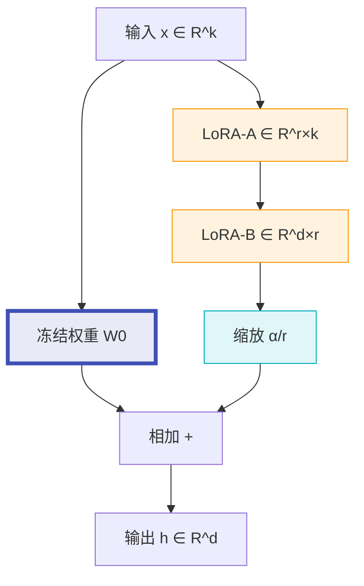
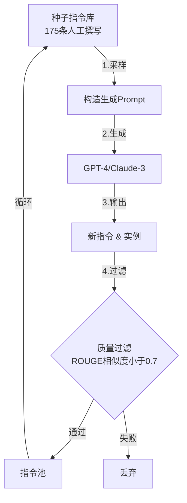
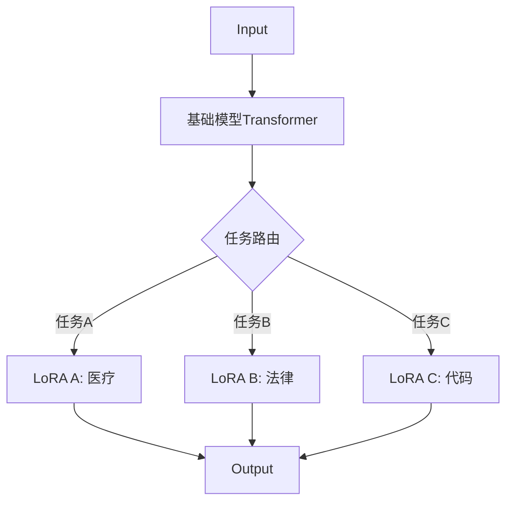
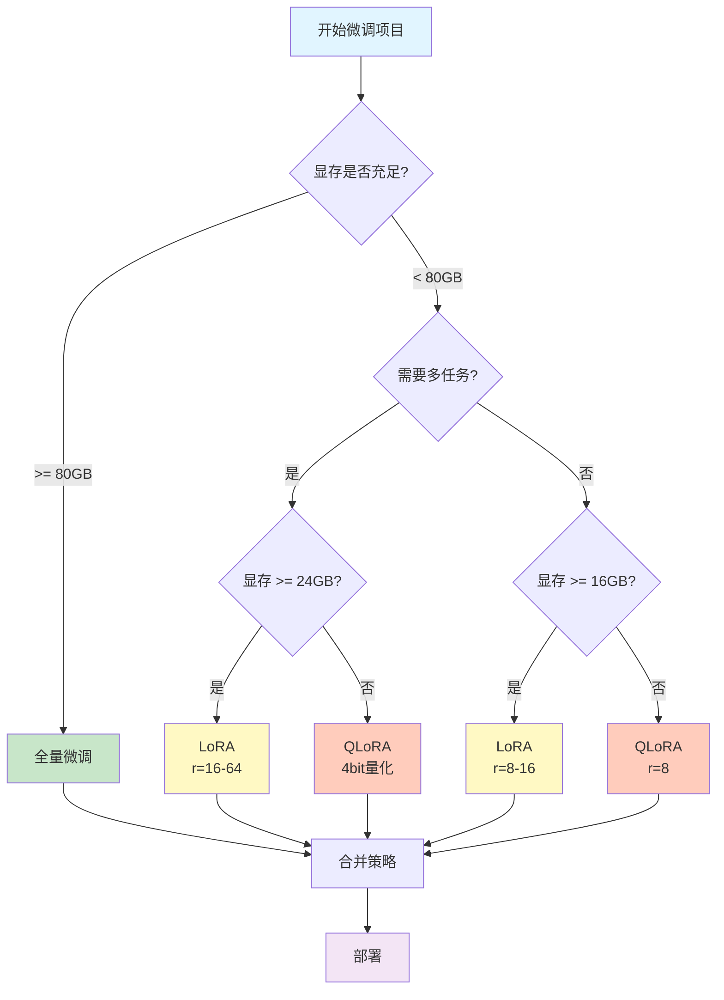

# 第2章 微调你的专属模型：从原理到实战的完全指南

> "微调不是魔法，而是精准的外科手术 —— 在冻结的知识海洋中，只激活你需要的那几个神经元。”

## 目录

- [引言：为什么需要微调？](#引言为什么需要微调)
- [一、微调的本质：Loss函数视角](#一微调的本质loss函数视角)
  - [1.1 预训练 vs 微调：目标函数的差异](#11-预训练-vs-微调目标函数的差异)
  - [1.2 SFT Loss 图解：Token级掩码表](#12-sft-loss-图解token级掩码表)
- [二、显存账单：为什么全量微调这么贵？](#二显存账单为什么全量微调这么贵)
  - [2.1 显存占用的四大开销](#21-显存占用的四大开销)
  - [2.2 AdamW的12字节秘密](#22-adamw的12字节秘密)
  - [2.3 全量微调 vs PEFT 显存对比](#23-全量微调-vs-peft-显存对比)
- [三、LoRA核心：低秩适配的数学本质](#三lora核心低秩适配的数学本质)
  - [3.1 核心公式：秩分解](#31-核心公式秩分解)
  - [3.2 LoRA架构图](#32-lora架构图)
  - [3.3 深度问答：为什么不能全0初始化？](#33-深度问答为什么不能全0初始化)
  - [3.4 PyTorch原生实现：LoRALinear](#34-pytorch原生实现loralinear)
- [四、LoRA家族演进：从QLoRA到GaLore](#四lora家族演进从qlora到galore)
  - [4.1 QLoRA：量化的艺术](#41-qlora量化的艺术)
    - [4.1.1 NF4量化原理](#411-nf4量化原理)
  - [4.2 DoRA：方向与幅度的解耦](#42-dora方向与幅度的解耦)
    - [4.2.1 DoRA完整实现](#421-dora完整实现)
  - [4.3 GaLore：梯度低秩投影](#43-galore梯度低秩投影)
    - [4.3.1 原理推导](#431-原理推导)
    - [4.3.2 算法流程](#432-算法流程)
  - [4.4 LoRA+：非对称学习率](#44-lora非对称学习率)
  - [4.5 其他变种简介](#45-其他变种简介)
    - [AdaLoRA：自适应秩分配](#adalora自适应秩分配)
    - [VeRA：极致参数效率](#vera极致参数效率)
- [五、微调深度理解](#五微调深度理解)
  - [5.1 指令数据构建的艺术](#51-指令数据构建的艺术)
    - [(1) 指令数据的黄金标准](#1-指令数据的黄金标准)
    - [(2) Self-Instruct: 用GPT-4生成训练数据](#2-self-instruct-用gpt-4生成训练数据)
    - [(3) 数据增强技术](#3-数据增强技术)
  - [5.2 灾难性遗忘 (Catastrophic Forgetting)](#52-灾难性遗忘-catastrophic-forgetting)
    - [缓解策略1: 混合训练数据](#缓解策略1-混合训练数据)
    - [缓解策略2: Elastic Weight Consolidation (EWC)](#缓解策略2-elastic-weight-consolidation-ewc)
  - [5.3 多任务微调 (Multi-task Fine-tuning)](#53-多任务微调-multi-task-fine-tuning)
    - [(1) 任务标识符 (Task Prefix)](#1-任务标识符-task-prefix)
    - [(2) 任务特定适配器](#2-任务特定适配器)
  - [5.4 持续学习 (Continual Learning)](#54-持续学习-continual-learning)
    - [(1) 渐进式LoRA (Progressive LoRA)](#1-渐进式lora-progressive-lora)
    - [(2) 知识蒸馏 (Knowledge Distillation)](#2-知识蒸馏-knowledge-distillation)
    - [(3) 完整持续学习流程](#3-完整持续学习流程)
- [六、工程实战：用TRL库微调模型](#六工程实战用trl库微调模型)
  - [6.1 完整训练流程](#61-完整训练流程)
  - [6.2 关键技术详解](#62-关键技术详解)
    - [6.2.1 Chat Template的正确使用](#621-chat-template的正确使用)
    - [6.2.2 Padding避坑指南](#622-padding避坑指南)
    - [6.2.3 NEFTune：嵌入层加噪技巧](#623-neftune嵌入层加噪技巧)
  - [6.3 推理与部署](#63-推理与部署)
- [七、模型合并技术](#七模型合并技术)
  - [7.1 线性插值合并 (Weight Averaging)](#71-线性插值合并-weight-averaging)
  - [7.2 SLERP: 球面线性插值](#72-slerp-球面线性插值)
  - [7.3 TIES: 修剪、选举与合并](#73-ties-修剪选举与合并)
  - [7.4 DARE: 丢弃与重缩放](#74-dare-丢弃与重缩放)
  - [7.5 Task Arithmetic: 任务算术](#75-task-arithmetic-任务算术)
  - [7.6 合并方法对比与选择](#76-合并方法对比与选择)
- [八、总结：微调知识地图](#八总结微调知识地图)
  - [8.1 核心公式速查表](#81-核心公式速查表)
  - [8.2 方法选择决策树](#82-方法选择决策树)
  - [8.3 实战建议清单](#83-实战建议清单)
    - [8.3.1 数据准备](#831-数据准备)
    - [8.3.2 超参数调优](#832-超参数调优)
    - [8.3.3 显存优化](#833-显存优化)
    - [8.3.4 训练技巧](#834-训练技巧)
    - [8.3.5 推理优化](#835-推理优化)
  - [8.4 常见问题排查](#84-常见问题排查)
  - [8.5 进阶资源](#85-进阶资源)
- [💡 新手问答：从困惑到理解](#-新手问答从困惑到理解)
- [结语：微调的艺术与科学](#结语微调的艺术与科学)

## 引言：为什么需要微调？

想象一下，你拥有一位博学的教授（预训练模型），他知晓天文地理，但对你公司的业务一无所知。微调（Fine-tuning）就像是给他补习专业课程，让他在保留通用知识的同时，掌握你的领域专长。

**本章学习路径**：


---

## 一、微调的本质：Loss函数视角

### 1.1 预训练 vs 微调：目标函数的差异

| 阶段 | 目标函数 | 学习内容 | 数据规模 |
|------|---------|---------|---------|
| **预训练** | $\mathcal{L}_{\text{pretrain}} = -\sum_{t=1}^{T} \log P(x_t \mid x_{<t})$ | 通用语言模式 | TB级 |
| **微调** | $\mathcal{L}_{\text{SFT}} = -\sum_{t \in \text{answer}} \log P(x_t \mid x_{<t})$ | 特定任务格式 | GB级 |

**关键差异**：微调只计算**答案部分**的损失，这通过 **Token级掩码（Mask）** 实现。

### 1.2 SFT Loss 图解：Token级掩码表

假设我们要微调一个医疗问答模型，输入序列是：

```
[BOS] 用户: 头痛怎么办? [SEP] 助手: 建议多休息，必要时就医。[EOS]
```

**Token级Loss计算表**：

| Position | Token | 计算Loss？ | 原因 |
|----------|-------|-----------|------|
| 0 | `[BOS]` | ❌ | 起始符 |
| 1 | `用户` | ❌ | 指令部分 |
| 2 | `:` | ❌ | 指令部分 |
| 3 | `头痛` | ❌ | 指令部分 |
| 4 | `怎么办` | ❌ | 指令部分 |
| 5 | `?` | ❌ | 指令部分 |
| 6 | `[SEP]` | ❌ | 分隔符 |
| 7 | `助手` | ❌ | 答案前缀 |
| 8 | `:` | ❌ | 答案前缀 |
| 9 | `建议` | ✅ | **答案内容** |
| 10 | `多` | ✅ | **答案内容** |
| 11 | `休息` | ✅ | **答案内容** |
| 12 | `，` | ✅ | **答案内容** |
| 13 | `必要时` | ✅ | **答案内容** |
| 14 | `就医` | ✅ | **答案内容** |
| 15 | `。` | ✅ | **答案内容** |
| 16 | `[EOS]` | ✅ | **答案内容** |

**代码实现**（PyTorch）：

```python
import torch

def compute_sft_loss(logits, labels, attention_mask):
    """
    Args:
        logits: [batch, seq_len, vocab_size]
        labels: [batch, seq_len]  # -100 表示忽略该位置
        attention_mask: [batch, seq_len]
    """
    # 只计算labels != -100的位置
    loss_fct = torch.nn.CrossEntropyLoss(ignore_index=-100)
    shift_logits = logits[..., :-1, :].contiguous()
    shift_labels = labels[..., 1:].contiguous()

    loss = loss_fct(
        shift_logits.view(-1, shift_logits.size(-1)),
        shift_labels.view(-1)
    )
    return loss

# 实际使用：构造labels
def create_sft_labels(input_ids, answer_start_idx):
    """只在答案部分计算loss"""
    labels = input_ids.clone()
    labels[:, :answer_start_idx] = -100  # 掩码指令部分
    return labels
```

**可视化损失计算**：

```
指令部分（掩码）         答案部分（计算Loss）
┌──────────────┐        ┌──────────────┐
│ 用户: 头痛... │ -100   │ 建议多休息... │ Loss
└──────────────┘        └──────────────┘
      ↓                        ↓
  不反向传播                 更新梯度
```

---

## 二、显存账单：为什么全量微调这么贵？

### 2.1 显存占用的四大开销

假设模型参数量为 $\Phi$（单位：十亿参数）：

| 项目 | 每参数开销 | 7B模型占用 | 公式 |
|------|-----------|-----------|------|
| **模型参数** | 2 bytes (FP16) | 14 GB | $2\Phi$ |
| **梯度** | 2 bytes | 14 GB | $2\Phi$ |
| **优化器状态** | 8 bytes | 56 GB | $8\Phi$ |
| **激活值** | 可变 | ~10 GB | 取决于batch size |
| **总计** | - | **~94 GB** | $12\Phi + \text{激活}$ |

### 2.2 AdamW的12字节秘密

**AdamW优化器**需要存储：

```python
# 伪代码：AdamW状态
for param in model.parameters():
    optimizer_state = {
        'm': torch.zeros_like(param),      # 一阶矩（均值） - 4 bytes (FP32)
        'v': torch.zeros_like(param),      # 二阶矩（方差） - 4 bytes (FP32)
        'grad': torch.zeros_like(param)    # 梯度缓存 - 4 bytes (FP32)
    }
    # 总计：4 + 4 + 4 = 12 bytes/参数
```

**为什么是FP32而不是FP16？**
- 优化器需要累积微小更新（如 $10^{-5}$）
- FP16精度不足会导致**数值下溢**（vanishing updates）

### 2.3 全量微调 vs PEFT 显存对比

以 **Llama-3-8B** 为例（8B参数）：

| 方法 | 可训练参数 | 优化器状态 | 总显存 | A100(80GB)可行性 |
|------|-----------|-----------|--------|-----------------|
| **全量微调** | 8B (100%) | 8B × 12 = 96 GB | ~120 GB | ❌ 需要2卡 |
| **LoRA** (r=16) | 21M (0.26%) | 21M × 12 = 252 MB | ~30 GB | ✅ 单卡 |
| **QLoRA** (4bit) | 21M (0.26%) | 21M × 12 = 252 MB | ~12 GB | ✅ 单卡 |

**计算公式**：
```python
# LoRA可训练参数量
def lora_params(model_dim, rank, num_layers):
    params_per_layer = 2 * model_dim * rank  # W_A + W_B
    return params_per_layer * num_layers

# Llama-3-8B: 4096维度, 32层, rank=16
lora_params(4096, 16, 32) = 8,388,608 ≈ 8M (仅Attention层)
```

---

## 三、LoRA核心：低秩适配的数学本质

### 3.1 核心公式：秩分解

**原始想法**：直接更新权重矩阵 $W \in \mathbb{R}^{d \times k}$
$$W' = W + \Delta W$$

**LoRA创新**：将 $\Delta W$ 分解为两个低秩矩阵
$$\Delta W = BA$$
其中：
- $B \in \mathbb{R}^{d \times r}$（Down-projection）
- $A \in \mathbb{R}^{r \times k}$（Up-projection）
- $r \ll \min(d, k)$（秩远小于原维度）

**前向传播**：
$$h = W_0 x + \Delta W x = W_0 x + BAx$$

### 3.2 LoRA架构图



**数学表达**：
$$h = W_0 x + \frac{\alpha}{r} BAx$$
其中 $\alpha$ 是缩放因子（通常设为 $r$，使初始化时 $\Delta W \approx 0$）。

### 3.3 深度问答：为什么不能全0初始化？

**问题**：如果 $B = 0$ 和 $A = 0$，会发生什么？

**答案**：**梯度死锁（Gradient Lockout）**

**推导过程**：

1. 假设初始化 $B = 0, A = 0$
2. 前向传播：$\Delta W = BA = 0$
3. 计算梯度：
   $$\frac{\partial \mathcal{L}}{\partial B} = \frac{\partial \mathcal{L}}{\partial (\Delta W)} \cdot A^T = \frac{\partial \mathcal{L}}{\partial (\Delta W)} \cdot 0 = 0$$
   $$\frac{\partial \mathcal{L}}{\partial A} = B^T \cdot \frac{\partial \mathcal{L}}{\partial (\Delta W)} = 0 \cdot \frac{\partial \mathcal{L}}{\partial (\Delta W)} = 0$$
4. **梯度恒为0** → **参数永远不更新**

**正确初始化策略**：
- $A \sim \mathcal{N}(0, \sigma^2)$：高斯初始化
- $B = 0$：零初始化（确保初始时 $\Delta W = 0$）

这样可以保证：
- 初始状态：$\Delta W = B \cdot A = 0 \cdot A = 0$（不改变预训练权重）
- 有效梯度：$\frac{\partial \mathcal{L}}{\partial B} = \frac{\partial \mathcal{L}}{\partial (\Delta W)} \cdot A^T \neq 0$

### 3.4 PyTorch原生实现：LoRALinear

```python
import torch
import torch.nn as nn
import math

class LoRALinear(nn.Module):
    """LoRA线性层：完整PyTorch原生实现"""

    def __init__(
        self,
        in_features: int,
        out_features: int,
        rank: int = 8,
        alpha: float = 16,
        dropout: float = 0.0,
        bias: bool = True
    ):
        super().__init__()

        # 冻结的预训练权重
        self.linear = nn.Linear(in_features, out_features, bias=bias)
        self.linear.weight.requires_grad = False
        if bias:
            self.linear.bias.requires_grad = False

        # LoRA参数
        self.rank = rank
        self.alpha = alpha
        self.scaling = alpha / rank

        # 低秩矩阵
        self.lora_A = nn.Parameter(torch.zeros(rank, in_features))
        self.lora_B = nn.Parameter(torch.zeros(out_features, rank))

        # Dropout（可选）
        self.dropout = nn.Dropout(dropout) if dropout > 0 else nn.Identity()

        # 初始化
        self.reset_parameters()

    def reset_parameters(self):
        """Kaiming初始化A，零初始化B"""
        nn.init.kaiming_uniform_(self.lora_A, a=math.sqrt(5))
        nn.init.zeros_(self.lora_B)

    def forward(self, x: torch.Tensor) -> torch.Tensor:
        """
        前向传播: h = W0*x + (α/r)*B*A*x

        Args:
            x: [batch, seq_len, in_features]
        Returns:
            h: [batch, seq_len, out_features]
        """
        # 基础输出（冻结）
        result = self.linear(x)

        # LoRA增量
        lora_out = self.dropout(x) @ self.lora_A.T  # [*, rank]
        lora_out = lora_out @ self.lora_B.T         # [*, out_features]
        lora_out = lora_out * self.scaling

        return result + lora_out

    def merge_weights(self):
        """合并LoRA权重到主权重（推理优化）"""
        if self.rank > 0:
            delta_w = self.lora_B @ self.lora_A * self.scaling
            self.linear.weight.data += delta_w
            # 清空LoRA参数以节省显存
            self.lora_A.data.zero_()
            self.lora_B.data.zero_()

    def get_lora_state_dict(self):
        """只保存LoRA参数"""
        return {
            'lora_A': self.lora_A,
            'lora_B': self.lora_B
        }

# 使用示例
layer = LoRALinear(in_features=4096, out_features=4096, rank=16, alpha=32)

# 统计参数量
frozen_params = sum(p.numel() for p in layer.linear.parameters())
trainable_params = sum(p.numel() for p in [layer.lora_A, layer.lora_B])

print(f"冻结参数: {frozen_params:,} ({frozen_params * 2 / 1e9:.2f} GB)")
print(f"可训练参数: {trainable_params:,} ({trainable_params * 2 / 1e9:.4f} GB)")
print(f"参数比例: {trainable_params / frozen_params * 100:.2f}%")

# 输出：
# 冻结参数: 16,777,216 (0.03 GB)
# 可训练参数: 131,072 (0.0003 GB)
# 参数比例: 0.78%
```

**关键设计要点**：

1. **权重冻结**：`requires_grad = False`
2. **缩放因子**：$\alpha/r$ 平衡学习率
3. **初始化策略**：确保 $\Delta W_0 = 0$
4. **推理优化**：`merge_weights()` 避免推理开销

---

## 四、LoRA家族演进：从QLoRA到GaLore

### 4.1 QLoRA：量化的艺术

**核心思想**：基础模型用4bit存储，LoRA适配器用FP16训练。

#### 4.1.1 NF4量化原理

**普通INT4量化**：均匀分割 $[-1, 1]$ 为16个区间
**NF4（Normal Float 4）**：根据**正态分布**的分位数选择量化点

```python
# NF4量化点（从标准正态分布的分位数推导）
NF4_QUANTILES = torch.tensor([
    -1.0000, -0.6962, -0.5251, -0.3949,
    -0.2844, -0.1848, -0.0911,  0.0000,
     0.0796,  0.1609,  0.2461,  0.3379,
     0.4407,  0.5626,  0.7230,  1.0000
])

def quantize_nf4(tensor):
    """NF4量化"""
    # 标准化到[-1, 1]
    absmax = tensor.abs().max()
    normalized = tensor / (absmax + 1e-8)

    # 查找最近的量化点
    distances = (normalized.unsqueeze(-1) - NF4_QUANTILES).abs()
    indices = distances.argmin(dim=-1)

    # 量化值（4bit索引）
    quantized = NF4_QUANTILES[indices]

    # 反量化
    dequantized = quantized * absmax
    return dequantized, indices, absmax
```

**QLoRA显存计算**：

$$\text{显存} = \underbrace{0.5 \Phi}_{\text{4bit模型}} + \underbrace{2 \Phi_{\text{LoRA}}}_{\text{FP16适配器}} + \underbrace{12 \Phi_{\text{LoRA}}}_{\text{优化器状态}}$$

对于Llama-3-8B + LoRA(r=16)：
- 基础模型：$8B \times 0.5 = 4GB$
- LoRA参数：$21M \times 2 = 42MB$
- 优化器：$21M \times 12 = 252MB$
- **总计：~5GB**（可在消费级GPU运行）

### 4.2 DoRA：方向与幅度的解耦

**核心公式**：
$$W' = W_0 + \Delta W = m \frac{V + \Delta V}{\|V + \Delta V\|}$$

其中：
- $m = \|W_0\|$：权重的**幅度**（Magnitude）
- $V = W_0 / m$：权重的**方向**（Direction）
- $\Delta V = BA$：LoRA更新方向

**架构对比**：

| 方法 | 更新方式 | 公式 | 参数量 |
|------|---------|------|--------|
| **LoRA** | 加法 | $W' = W_0 + BA$ | $2dr$ |
| **DoRA** | 方向+幅度 | $W' = m \frac{W_0 + BA}{\|W_0 + BA\|}$ | $2dr + d$ |

#### 4.2.1 DoRA完整实现

```python
import torch
import torch.nn as nn
import torch.nn.functional as F
import math

class DoRALinear(nn.Module):
    """DoRA: Direction + Magnitude分解"""

    def __init__(
        self,
        in_features: int,
        out_features: int,
        rank: int = 8,
        alpha: float = 16,
        dropout: float = 0.0
    ):
        super().__init__()

        # 冻结的预训练权重
        self.linear = nn.Linear(in_features, out_features, bias=False)
        self.linear.weight.requires_grad = False

        # LoRA参数
        self.rank = rank
        self.alpha = alpha
        self.scaling = alpha / rank

        self.lora_A = nn.Parameter(torch.zeros(rank, in_features))
        self.lora_B = nn.Parameter(torch.zeros(out_features, rank))

        # DoRA特有：幅度向量
        self.magnitude = nn.Parameter(torch.ones(out_features, 1))

        self.dropout = nn.Dropout(dropout) if dropout > 0 else nn.Identity()

        # 初始化
        self.reset_parameters()

    def reset_parameters(self):
        """初始化策略"""
        nn.init.kaiming_uniform_(self.lora_A, a=math.sqrt(5))
        nn.init.zeros_(self.lora_B)

        # 幅度初始化为W0的Row Norm
        with torch.no_grad():
            weight_norm = self.linear.weight.norm(p=2, dim=1, keepdim=True)
            self.magnitude.copy_(weight_norm)

    def forward(self, x: torch.Tensor) -> torch.Tensor:
        """
        前向传播: h = m * (V + ΔV) / ||V + ΔV||

        Args:
            x: [batch, seq_len, in_features]
        Returns:
            h: [batch, seq_len, out_features]
        """
        # 计算方向更新
        lora_out = self.dropout(x) @ self.lora_A.T
        lora_out = lora_out @ self.lora_B.T
        lora_out = lora_out * self.scaling

        # 组合权重
        combined_weight = self.linear.weight + (self.lora_B @ self.lora_A)

        # 标准化方向
        weight_norm = combined_weight.norm(p=2, dim=1, keepdim=True)
        normalized_weight = combined_weight / (weight_norm + 1e-8)

        # 应用幅度
        final_weight = self.magnitude * normalized_weight

        # 计算输出
        return F.linear(x, final_weight)

    def extra_repr(self) -> str:
        return f'in_features={self.linear.in_features}, out_features={self.linear.out_features}, rank={self.rank}'

# 性能对比测试
def benchmark_dora_vs_lora():
    torch.manual_seed(42)
    x = torch.randn(32, 128, 4096)  # [batch, seq, dim]

    lora = LoRALinear(4096, 4096, rank=16)
    dora = DoRALinear(4096, 4096, rank=16)

    # 前向传播时间
    import time

    start = time.time()
    _ = lora(x)
    lora_time = time.time() - start

    start = time.time()
    _ = dora(x)
    dora_time = time.time() - start

    print(f"LoRA时间: {lora_time:.4f}s")
    print(f"DoRA时间: {dora_time:.4f}s")
    print(f"DoRA额外开销: {(dora_time - lora_time) / lora_time * 100:.1f}%")
```

**DoRA的优势**：
1. **更稳定的训练**：幅度和方向独立更新
2. **更好的泛化**：类似Weight Normalization的正则化效果
3. **代价**：前向传播多一次归一化操作（~10%开销）

### 4.3 GaLore：梯度低秩投影

**核心思想**：不是低秩分解权重，而是**低秩投影梯度**。

#### 4.3.1 原理推导

标准梯度下降：
$$W_{t+1} = W_t - \eta \nabla_W \mathcal{L}$$

GaLore投影：
$$W_{t+1} = W_t - \eta P_r(\nabla_W \mathcal{L})$$

其中 $P_r(\cdot)$ 是秩-$r$ 投影算子：

$$P_r(G) = U_r U_r^T G \quad \text{（左投影）}$$
$$P_r(G) = G V_r V_r^T \quad \text{（右投影）}$$

$U_r, V_r$ 是 $G$ 的前 $r$ 个奇异向量（SVD分解）。

#### 4.3.2 算法流程

```python
import torch
from torch.optim.optimizer import Optimizer

class GaLoreAdamW(Optimizer):
    """GaLore优化器：梯度低秩投影"""

    def __init__(
        self,
        params,
        lr: float = 1e-3,
        rank: int = 128,
        update_proj_gap: int = 200,  # 每200步更新投影矩阵
        scale: float = 1.0,
        proj_type: str = "std"  # "std", "reverse", "right", "left"
    ):
        defaults = dict(lr=lr, rank=rank, update_proj_gap=update_proj_gap,
                       scale=scale, proj_type=proj_type)
        super().__init__(params, defaults)

    @torch.no_grad()
    def step(self):
        for group in self.param_groups:
            for p in group['params']:
                if p.grad is None:
                    continue

                grad = p.grad
                state = self.state[p]

                # 初始化状态
                if len(state) == 0:
                    state['step'] = 0
                    state['exp_avg'] = torch.zeros_like(grad)
                    state['exp_avg_sq'] = torch.zeros_like(grad)
                    state['projector'] = None

                state['step'] += 1

                # 更新投影矩阵
                if state['step'] % group['update_proj_gap'] == 1:
                    state['projector'] = self._get_projector(
                        grad, group['rank'], group['proj_type']
                    )

                # 投影梯度
                if state['projector'] is not None:
                    grad_proj = self._project(grad, state['projector'])
                else:
                    grad_proj = grad

                # AdamW更新
                exp_avg, exp_avg_sq = state['exp_avg'], state['exp_avg_sq']
                beta1, beta2 = 0.9, 0.999

                exp_avg.mul_(beta1).add_(grad_proj, alpha=1 - beta1)
                exp_avg_sq.mul_(beta2).addcmul_(grad_proj, grad_proj, value=1 - beta2)

                denom = exp_avg_sq.sqrt().add_(1e-8)
                step_size = group['lr'] * group['scale']

                p.add_(exp_avg / denom, alpha=-step_size)

    def _get_projector(self, grad, rank, proj_type):
        """计算SVD投影矩阵"""
        matrix = grad if grad.dim() == 2 else grad.flatten(1)

        # SVD分解（只取前r个奇异向量）
        U, S, Vt = torch.linalg.svd(matrix, full_matrices=False)
        U_r = U[:, :rank]
        Vt_r = Vt[:rank, :]

        if proj_type == "left":
            return U_r
        elif proj_type == "right":
            return Vt_r
        else:  # "std"
            return (U_r, Vt_r)

    def _project(self, grad, projector):
        """应用投影"""
        if isinstance(projector, tuple):
            U_r, Vt_r = projector
            # 双边投影: U_r @ U_r^T @ G @ Vt_r^T @ Vt_r
            return U_r @ (U_r.T @ grad @ Vt_r.T) @ Vt_r
        else:
            # 单边投影
            return projector @ (projector.T @ grad)

# 使用示例
model = MyTransformer()
optimizer = GaLoreAdamW(model.parameters(), lr=1e-3, rank=128)

for batch in dataloader:
    loss = model(batch)
    loss.backward()
    optimizer.step()
    optimizer.zero_grad()
```

**GaLore的优势**：
- **全参数更新**：不像LoRA只更新部分层
- **显存效率**：优化器状态只存储低秩投影（$r \ll d$）
- **适用场景**：从头预训练小模型（如1B参数）

**显存对比**（以Llama-1B为例）：

| 方法 | 优化器状态 | 梯度存储 | 总显存 |
|------|-----------|---------|--------|
| **AdamW** | 1B × 12 = 12GB | 1B × 2 = 2GB | 14GB |
| **GaLore (r=128)** | 128M × 12 = 1.5GB | 128M × 2 = 256MB | ~2GB |

### 4.4 LoRA+：非对称学习率

**核心观察**：LoRA中 $A$ 和 $B$ 的作用不对称
- $A$：输入投影（类似特征提取）
- $B$：输出投影（类似分类器）

**改进策略**：使用不同学习率
$$\eta_B = \lambda \cdot \eta_A \quad (\lambda > 1)$$

通常设置 $\lambda = 16$。

```python
# LoRA+参数组设置
optimizer = torch.optim.AdamW([
    {'params': [p for n, p in model.named_parameters() if 'lora_A' in n],
     'lr': 1e-4},
    {'params': [p for n, p in model.named_parameters() if 'lora_B' in n],
     'lr': 1e-3},  # 10x更大
])
```

### 4.5 其他变种简介

#### AdaLoRA：自适应秩分配
- **思想**：根据重要性动态调整每层的秩
- **方法**：通过奇异值大小剪枝不重要的秩
- **适用**：参数预算有限且层间差异大的场景

#### VeRA：极致参数效率
- **思想**：共享随机投影矩阵，只训练缩放向量
- **公式**：$\Delta W = b \cdot d^T$（$b, d$ 是向量）
- **参数量**：仅 $2d$（比LoRA少100倍）

---

## 五、微调深度理解

微调不仅是跑通代码，更是对数据分布的重塑。本章我们将深入探讨数据构建、遗忘问题以及多任务学习的内在机制。

### 5.1 指令数据构建的艺术

> "Garbage In, Garbage Out." 在微调阶段，数据质量的重要性远超数量。

#### (1) 指令数据的黄金标准

高质量的SFT数据应具备以下特征：
1. **多样性 (Diversity)**：覆盖各种任务类型（写作、推理、编码、翻译）。
2. **复杂性 (Complexity)**：指令应包含多步约束（如"请用Python写一个排序算法，并解释时间复杂度，输出格式为Markdown"）。
3. **正确性 (Correctness)**：答案必须客观准确，无幻觉。

#### (2) Self-Instruct: 用GPT-4生成训练数据

当缺乏标注数据时，利用强模型（Teacher）生成数据是标准做法。

**Self-Instruct 流程图**：



**Evol-Instruct (WizardLM)**：
仅仅生成相似指令是不够的，我们需要**进化**指令难度：
- **深度进化**：增加约束条件、增加推理步骤。
- **广度进化**：转换话题、增加罕见概念。

#### (3) 数据增强技术

如果你只有少量数据（如100条），可以使用以下技术扩充：

| 方法 | 描述 | 示例 |
|------|------|------|
| **Back-Translation** | 中文 $\to$ 英文 $\to$ 中文 | "我喜欢AI" $\to$ "I like AI" $\to$ "我对人工智能很感兴趣" |
| **Rewrite** | 让模型改写语气/风格 | "帮我请假" $\to$ "请帮我以此理由撰写一份正式的请假邮件..." |
| **CoT Expansion** | 将直接回答扩展为思维链 | 问："3+5=?" <br> 答："3+5=8" $\to$ "首先计算个位...结果是8" |

### 5.2 灾难性遗忘 (Catastrophic Forgetting)

微调就像给模型"洗脑"。如果微调数据分布与预训练分布差异过大，模型会迅速忘记原有的通用能力（如推理、常识）。

#### 缓解策略1: 混合训练数据

最简单有效的方法：在微调数据中混入 **1%-5% 的通用预训练数据**（如Wiki、Books）。

- **优点**：操作简单，效果显著。
- **缺点**：增加了训练成本。

#### 缓解策略2: Elastic Weight Consolidation (EWC)

EWC（弹性权重巩固）的核心思想是：**保护重要参数，允许不重要参数大幅更新**。

**数学原理**：
在Loss中加入正则项，惩罚对旧任务重要参数的改变：

$$ \mathcal{L} = \mathcal{L}_{\text{new}}(\theta) + \frac{\lambda}{2} \sum_{i} F_i (\theta_i - \theta_{i, \text{old}})^2 $$

其中：
- $F_i$ 是 **Fisher信息矩阵** 的对角线元素，代表参数 $\theta_i$ 对旧任务的重要性。
- $\theta_{i, \text{old}}$ 是旧任务训练后的参数值。
- $\lambda$ 是正则化强度的超参数。

**PyTorch实现核心逻辑**：

```python
def ewc_loss(model, fisher_matrix, old_params, lambda_ewc=0.4):
    loss = 0
    for name, param in model.named_parameters():
        if name in fisher_matrix:
            # Fisher值越大，惩罚越重
            _loss = fisher_matrix[name] * (param - old_params[name]) ** 2
            loss += _loss.sum()
    return lambda_ewc * loss
```

### 5.3 多任务微调 (Multi-task Fine-tuning)

与其让模型专精一件事，不如让它成为"多面手"。MFT（Multi-task Fine-tuning）能显著提升模型的泛化能力。

#### (1) 任务标识符 (Task Prefix)

显式告诉模型当前是什么任务。

- **输入格式**：
  - `[Translation] Hello world -> ?`
  - `[Coding] Write a quick sort -> ?`
  - `[Summarization] Alice is a girl... -> ?`

#### (2) 任务特定适配器

不同任务使用独立的LoRA模块，共享基础模型。



### 5.4 持续学习 (Continual Learning)

世界在变，知识在更新。我们需要模型能够持续学习新知识，而不是重新训练。

#### (1) 渐进式LoRA (Progressive LoRA)

当有新任务到来时：
1. **冻结** 基础模型和旧任务的 LoRA。
2. **初始化** 一个新的 LoRA 模块学习新任务。
3. 推理时，根据任务选择激活哪个 LoRA，或者将它们合并。

#### (2) 知识蒸馏 (Knowledge Distillation)

用旧模型（Teacher）指导新模型（Student），迫使新模型在学习新数据时，输出分布尽量接近旧模型。

$$ \mathcal{L} = \alpha \mathcal{L}_{\text{SFT}} + (1-\alpha) \mathcal{L}_{\text{KD}}(P_{\text{student}}, P_{\text{teacher}}) $$

#### (3) 完整持续学习流程

1. **阶段 1**：在通用语料上预训练。
2. **阶段 2**：在多任务指令集上SFT（MFT）。
3. **阶段 3**：定期收集新数据，使用 Replay（数据回放）或 LoRA 增量更新。

---

## 六、工程实战：用TRL库微调模型

### 6.1 完整训练流程

```python
from transformers import AutoModelForCausalLM, AutoTokenizer
from trl import SFTTrainer, SFTConfig, DataCollatorForCompletionOnlyLM
from peft import LoraConfig, get_peft_model
from datasets import load_dataset
import torch

# ========== 1. 加载模型和Tokenizer ==========
model_name = "meta-llama/Llama-3.2-3B-Instruct"
tokenizer = AutoTokenizer.from_pretrained(model_name)
model = AutoModelForCausalLM.from_pretrained(
    model_name,
    torch_dtype=torch.bfloat16,
    device_map="auto"
)

# ========== 2. 配置LoRA ==========
lora_config = LoraConfig(
    r=16,                            # 秩
    lora_alpha=32,                   # 缩放因子（通常是r的2倍）
    target_modules=[                 # 目标层
        "q_proj", "k_proj", "v_proj", "o_proj",  # Attention
        "gate_proj", "up_proj", "down_proj"      # FFN
    ],
    lora_dropout=0.05,
    bias="none",                     # 不训练bias
    task_type="CAUSAL_LM"
)

model = get_peft_model(model, lora_config)
model.print_trainable_parameters()
# 输出：trainable params: 20,971,520 || all params: 3,213,978,624 || trainable%: 0.65%

# ========== 3. 数据处理 ==========
dataset = load_dataset("tatsu-lab/alpaca", split="train[:1000]")

# 关键：设置padding方向
tokenizer.padding_side = "right"  # SFT必须用right padding！
tokenizer.pad_token = tokenizer.eos_token

# 应用聊天模板
def format_chat(example):
    messages = [
        {"role": "user", "content": example["instruction"]},
        {"role": "assistant", "content": example["output"]}
    ]
    return {"text": tokenizer.apply_chat_template(
        messages,
        tokenize=False,
        add_generation_prompt=False
    )}

dataset = dataset.map(format_chat)

# ========== 4. 数据Collator（关键：只计算答案Loss）==========
# 自动识别response_template，只在助手回复部分计算loss
response_template = "<|start_header_id|>assistant<|end_header_id|>"
collator = DataCollatorForCompletionOnlyLM(
    response_template=response_template,
    tokenizer=tokenizer,
    mlm=False
)

# ========== 5. 训练配置 ==========
training_args = SFTConfig(
    output_dir="./llama3-lora-sft",

    # 基础设置
    num_train_epochs=3,
    per_device_train_batch_size=4,
    gradient_accumulation_steps=4,      # 等效batch size = 16

    # 优化器
    optim="adamw_torch",
    learning_rate=2e-4,
    weight_decay=0.01,
    warmup_ratio=0.03,

    # 学习率调度
    lr_scheduler_type="cosine",

    # 显存优化
    gradient_checkpointing=True,
    bf16=True,                          # 使用BF16混合精度

    # 日志
    logging_steps=10,
    save_strategy="epoch",

    # NEFTune（噪声注入技巧）
    neftune_noise_alpha=5,              # 在嵌入层加噪声

    # 其他
    max_seq_length=512,
    dataset_text_field="text",          # 数据集中的文本字段
)

# ========== 6. 开始训练 ==========
trainer = SFTTrainer(
    model=model,
    args=training_args,
    train_dataset=dataset,
    tokenizer=tokenizer,
    data_collator=collator,
)

trainer.train()

# ========== 7. 保存模型 ==========
trainer.save_model("./final_lora_model")
```

### 6.2 关键技术详解

#### 6.2.1 Chat Template的正确使用

```python
# Llama-3的聊天格式
"""
<|begin_of_text|><|start_header_id|>system<|end_header_id|>

You are a helpful assistant.<|eot_id|><|start_header_id|>user<|end_header_id|>

用户问题<|eot_id|><|start_header_id|>assistant<|end_header_id|>

助手回答<|eot_id|>
"""

# 自动应用模板
messages = [
    {"role": "system", "content": "You are a helpful assistant."},
    {"role": "user", "content": "什么是量子纠缠？"},
    {"role": "assistant", "content": "量子纠缠是..."}
]

formatted = tokenizer.apply_chat_template(
    messages,
    tokenize=False,           # 返回字符串而非token ids
    add_generation_prompt=False  # 训练时不加生成提示符
)
```

#### 6.2.2 Padding避坑指南

**错误示范**：使用 `padding_side="left"`

```python
# ❌ 错误：left padding会破坏因果注意力
tokenizer.padding_side = "left"

# 示例数据
texts = ["短句", "这是一个很长很长的句子"]
tokens = tokenizer(texts, padding=True)

# 结果：
# [PAD][PAD][PAD] 短 句
# 这 是 一 个 很 长 ...

# 问题：模型会在PAD位置计算loss！
```

**正确做法**：使用 `padding_side="right"`

```python
# ✅ 正确：right padding保持因果结构
tokenizer.padding_side = "right"

# 结果：
# 短 句 [PAD][PAD][PAD]
# 这 是 一 个 很 长 ...

# 只在真实token上计算loss
```

**原理**：
- Left padding：破坏序列的因果顺序（模型会"看到未来"）
- Right padding：保持因果结构，PAD在末尾可通过attention mask忽略

#### 6.2.3 NEFTune：嵌入层加噪技巧

**原理**：在训练时给输入嵌入添加随机噪声，提升泛化能力。

$$e'_i = e_i + \mathcal{N}(0, \alpha^2 / \sqrt{Ld})$$

其中：
- $e_i$：原始嵌入
- $L$：序列长度
- $d$：嵌入维度
- $\alpha$：噪声强度（通常5-15）

**实现**：

```python
class NEFTuneEmbedding(nn.Module):
    """NEFTune嵌入层包装器"""

    def __init__(self, embedding_layer, alpha=5):
        super().__init__()
        self.embedding = embedding_layer
        self.alpha = alpha

    def forward(self, input_ids):
        embeddings = self.embedding(input_ids)

        if self.training:
            # 计算噪声标准差
            seq_len, emb_dim = embeddings.shape[1], embeddings.shape[2]
            noise_std = self.alpha / (seq_len * emb_dim) ** 0.5

            # 添加噪声
            noise = torch.randn_like(embeddings) * noise_std
            embeddings = embeddings + noise

        return embeddings

# TRL自动支持（在SFTConfig中设置）
training_args = SFTConfig(
    neftune_noise_alpha=5,  # 自动应用NEFTune
    ...
)
```

**效果**：
- 提升1-3个点的下游任务性能
- 防止过拟合小数据集
- 几乎无额外计算开销

### 6.3 推理与部署

```python
from peft import PeftModel

# ========== 方法1：保持LoRA分离（灵活） ==========
base_model = AutoModelForCausalLM.from_pretrained("meta-llama/Llama-3.2-3B")
model = PeftModel.from_pretrained(base_model, "./final_lora_model")

# 推理
inputs = tokenizer("用户问题", return_tensors="pt")
outputs = model.generate(**inputs, max_new_tokens=100)

# ========== 方法2：合并权重（快速） ==========
# 合并LoRA到基础模型
merged_model = model.merge_and_unload()

# 保存合并后的模型
merged_model.save_pretrained("./merged_model")
tokenizer.save_pretrained("./merged_model")

# 之后可以当作普通模型加载
model = AutoModelForCausalLM.from_pretrained("./merged_model")
```

---

## 七、模型合并技术

> "The whole is greater than the sum of its parts." —— 亚里士多德

当我们有多个微调好的模型（例如一个懂医学，一个懂法律），如何将它们的能力合二为一，而不需要重新训练？这就是模型合并（Model Merging）的魔力。

### 7.1 线性插值合并 (Weight Averaging)

最朴素的方法：直接对权重求平均。

$$ W_{\text{merged}} = \alpha W_A + (1-\alpha) W_B $$

- **适用场景**：两个模型微调自同一个基座，且微调轨迹相似（例如同一个Epoch的不同Checkpoint）。
- **局限性**：在高维空间中，简单平均可能会导致权重落入"Loss盆地"之间的壁垒，导致性能下降。

### 7.2 SLERP: 球面线性插值

**Spherical Linear Interpolation (SLERP)** 解决了线性插值导致的"幅度塌缩"问题。它将权重看作高维球面上的一点，沿着大圆弧进行插值。

**核心公式**：

$$ \text{SLERP}(v_1, v_2, t) = \frac{\sin((1-t)\Omega)}{\sin \Omega} v_1 + \frac{\sin(t\Omega)}{\sin \Omega} v_2 $$

其中 $\Omega$ 是向量 $v_1$ 和 $v_2$ 之间的夹角。

**代码实现**：

```python
import torch
import numpy as np

def slerp(t, v0, v1, dot_threshold=0.9995):
    """
    球面线性插值
    Args:
        t: 插值系数 [0, 1]
        v0, v1: 两个形状相同的张量
    """
    # 归一化
    v0_norm = v0 / torch.norm(v0)
    v1_norm = v1 / torch.norm(v1)

    # 计算夹角余弦
    dot = torch.sum(v0_norm * v1_norm)

    # 如果两个向量几乎平行，直接线性插值
    if torch.abs(dot) > dot_threshold:
        return (1 - t) * v0 + t * v1

    # 计算夹角
    theta_0 = torch.acos(dot)
    sin_theta_0 = torch.sin(theta_0)

    theta_t = theta_0 * t
    sin_theta_t = torch.sin(theta_t)

    s0 = torch.sin(theta_0 - theta_t) / sin_theta_0
    s1 = sin_theta_t / sin_theta_0

    return s0 * v0 + s1 * v1
```

### 7.3 TIES: 修剪、选举与合并 (Trim, Elect, Sign & Merge)

**解决冲突的神器**。当两个模型修改同一个参数时，如果一个要变大，一个要变小，通过平均会抵消变成0。TIES 拒绝这种"平庸的妥协"。

**算法三步走**：

1. **Trim（修剪）**：只保留变化最大的 Top-K% 参数，重置其余微小变化（视为噪声）。
   - $$\hat{\tau}_t = \text{TopK}(|\tau_t|, 20\%)$$
2. **Elect（选举）**：对每个参数位置，统计各个模型的更新符号（+1 或 -1）。由于符号和总和决定主导方向。
   - $$\text{sign}_{\text{final}} = \text{sign}(\sum \hat{\tau}_t)$$
3. **Merge（合并）**：只计算方向一致的更新的平均值。

### 7.4 DARE: 丢弃与重缩放 (Drop and Rescale)

**DARE** 发现了一个惊人的现象：微调后的 Delta 参数中，有很多是冗余的。

**核心操作**：
1. **Drop**：随机丢弃 $p\%$（例如90%）的 Delta 参数（置为0）。
2. **Rescale**：为了保持期望不变，将剩余参数放大 $1/(1-p)$ 倍。

$$ W_{\text{DARE}} = W_{\text{base}} + \frac{1}{1-p} \cdot \text{Mask}(W_{\text{fine-tuned}} - W_{\text{base}}) $$

**优势**：极大地减少了参数冲突概率，能够合并多达 10+ 个模型而不发生性能崩溃。

### 7.5 Task Arithmetic: 任务算术

将模型的能力视为向量，进行算术运算。

- **公式**：$\tau_{\text{task}} = W_{\text{task}} - W_{\text{base}}$
- **类比**：Word2Vec 中的 `King - Man + Woman = Queen`
- **操作**：
  $$ W_{\text{new}} = W_{\text{base}} + \lambda_1 \tau_{\text{math}} + \lambda_2 \tau_{\text{code}} - \lambda_3 \tau_{\text{toxic}} $$

  通过减去 "Toxic Vector"，甚至可以消除模型的有害性！

### 7.6 合并方法对比与选择

| 方法 | 适用场景 | 计算成本 | 推荐指数 |
|------|---------|---------|---------|
| **Linear** | 同源微调，差异小 | ⭐ | ⭐⭐ |
| **SLERP** | 两个模型融合，追求平滑 | ⭐⭐ | ⭐⭐⭐⭐ |
| **TIES** | 解决强烈冲突 | ⭐⭐⭐ | ⭐⭐⭐⭐⭐ |
| **DARE** | 合并大量模型 (>3个) | ⭐⭐⭐ | ⭐⭐⭐⭐⭐ |
| **Task Arithmetic** | 操控特定能力（增/删） | ⭐⭐ | ⭐⭐⭐⭐ |

---

## 八、总结：微调知识地图

### 8.1 核心公式速查表

| 概念 | 公式 | 含义 |
|------|------|------|
| **SFT Loss** | $\mathcal{L} = -\sum_{t \in \text{answer}} \log P(x_t \mid x_{<t})$ | 只在答案部分计算 |
| **LoRA** | $h = W_0 x + \frac{\alpha}{r} BAx$ | 低秩增量 |
| **DoRA** | $W' = m \frac{W_0 + BA}{\|W_0 + BA\|}$ | 方向+幅度 |
| **GaLore** | $W_{t+1} = W_t - \eta P_r(\nabla_W)$ | 梯度投影 |
| **显存占用** | $\text{Memory} = 2\Phi + 12\Phi_{\text{trainable}}$ | AdamW开销 |

### 8.2 方法选择决策树



### 8.3 实战建议清单

#### 8.3.1 数据准备
- [x] 使用 `tokenizer.apply_chat_template` 格式化对话
- [ ] 设置 `padding_side="right"`
- [ ] 用 `DataCollatorForCompletionOnlyLM` 掩码指令
- [ ] 检查数据长度分布，设置合理的 `max_seq_length`

#### 8.3.2 超参数调优
- [ ] **学习率**：LoRA用 `2e-4`，全量用 `5e-6`
- [ ] **秩**：从 `r=8` 开始，不够再加到 `16/32`
- [ ] **Alpha**：通常设为 `2*r`
- [ ] **Warmup**：3-5% 的训练步数
- [ ] **Batch size**：用梯度累积达到有效batch 16-32

#### 8.3.3 显存优化
- [ ] 启用 `gradient_checkpointing=True`（省30-40%显存）
- [ ] 使用 `bf16=True`（推荐）或 `fp16=True`
- [ ] 尝试 `torch.compile(model)` 加速（PyTorch 2.0+）
- [ ] QLoRA场景开启 `bnb_4bit_compute_dtype=torch.bfloat16`

#### 8.3.4 训练技巧
- [ ] 启用 `neftune_noise_alpha=5` 提升泛化
- [ ] 每个epoch后在验证集评估，防止过拟合
- [ ] 保存多个checkpoint，对比选最优
- [ ] 用 `wandb` 或 `tensorboard` 监控训练曲线

#### 8.3.5 推理优化
- [ ] 训练后调用 `model.merge_and_unload()` 合并权重
- [ ] 使用 `vLLM` 或 `TGI` 部署高并发服务
- [ ] 考虑进一步量化（INT8/INT4）降低推理成本

### 8.4 常见问题排查

| 问题 | 可能原因 | 解决方案 |
|------|---------|---------|
| **Loss不下降** | 学习率过大/过小 | 尝试 `1e-4` 到 `5e-4` 之间 |
| **过拟合严重** | 数据量太小 | 增加dropout、减小秩r、用NEFTune |
| **显存溢出** | Batch size太大 | 减小batch size，增加梯度累积步数 |
| **训练很慢** | 序列太长 | 截断到512/1024，开启Flash Attention |
| **推理结果差** | 只训练了Attention | 增加FFN层到`target_modules` |

### 8.5 进阶资源

**论文必读**：
1. **LoRA**: [LoRA: Low-Rank Adaptation of Large Language Models](https://arxiv.org/abs/2106.09685)
2. **QLoRA**: [QLoRA: Efficient Finetuning of Quantized LLMs](https://arxiv.org/abs/2305.14314)
3. **DoRA**: [DoRA: Weight-Decomposed Low-Rank Adaptation](https://arxiv.org/abs/2402.09353)
4. **GaLore**: [GaLore: Memory-Efficient LLM Training by Gradient Low-Rank Projection](https://arxiv.org/abs/2403.03507)

**开源工具**：
- **Hugging Face TRL**: https://github.com/huggingface/trl
- **Axolotl**: https://github.com/OpenAccess-AI-Collective/axolotl
- **LLaMA-Factory**: https://github.com/hiyouga/LLaMA-Factory

**数据集**：
- **Alpaca**: 指令跟随基础数据
- **Dolly-15k**: 开源商用友好
- **OpenOrca**: 高质量合成数据
- **UltraChat**: 多轮对话数据

---

## 💡 新手问答：从困惑到理解

**Q1: 微调需要多少数据？是越多越好吗？**
A: **绝对不是**。对于SFT，数据质量远比数量重要。
- **Rule of Thumb**：几百条高质量（人工精修）指令 > 几万条低质量合成指令。
- LIMA论文证明：仅用 **1000条** 精选数据，微调效果就能匹敌用50000条数据的模型。

**Q2: 我的显只有24GB（3090/4090），能微调多大的模型？**
A: 使用 **QLoRA (4bit)** 技术：
- **7B/8B模型**：只需 ~6-8GB 显存，单卡轻松跑。
- **13B/14B模型**：只需 ~12-14GB 显存，单卡可跑。
- **30B-70B模型**：配合 **CPU Offload** 或多卡，也可以尝试，但速度较慢。

**Q3: 微调后，模型好像变"笨"了，以前认识的人现在不认识了？**
A: 这是 **灾难性遗忘 (Catastrophic Forgetting)**。

- **原因**：模型过度拟合了特定领域的指令分布。
- **解法**：在微调数据中混入 **1% - 5%** 的通用数据（如Wiki、GSM8K数学题），或者使用 LoRA（因为它保留了原始权重）。

**Q4: Loss一直在下降，但模型回答全是乱码或重复，为什么？**
A: 这通常是 **Padding方向** 或 **EOS Token** 的问题。

- 检查 `tokenizer.padding_side="right"`（SFT必须右对齐）。
- 检查训练数据末尾是否手动加了 `<|eot_id|>` 或 `</s>`，否则模型不知道何时停止，会一直复读。

**Q5: 什么时候该用 RLHF (DPO/PPO)？**
A: SFT 只能教会模型 **"怎么说话"**（格式、语气），RLHF 才能教会模型 **"说什么话"**（价值观、偏好）。

- 如果你只是想让模型按特定JSON格式输出，SFT足矣。
- 如果你想让模型更安全、更诚实、或者在开放域对话中更有趣，需要 RLHF。

---

## 结语：微调的艺术与科学

微调不是简单的"调参数"，而是在**保留通用知识**和**学习专业技能**之间的精妙平衡。LoRA及其家族方法告诉我们：**有时候，改变一小部分，就能产生巨大的影响**。

记住三个关键原则：
1. **精准的损失计算**：只在需要学习的部分计算Loss
2. **高效的参数更新**：用低秩分解减少可训练参数
3. **稳定的训练过程**：正确的初始化和超参数设置

现在，拿起你的数据集，开始微调你的第一个专属模型吧！

---

**本章检查清单**：
- [x] 理解SFT的Token级掩码机制
- [x] 掌握显存占用的12字节计算
- [x] 实现LoRA/DoRA的PyTorch代码
- [x] 了解QLoRA/GaLore的原理
- [x] 用TRL库完成完整训练流程
- [x] 学会模型合并与部署技巧

**下一章预告**：《第3章 强化学习人类反馈（RLHF）：让模型学会"讨好"用户》—— 我们将探索如何通过PPO/DPO算法，让模型输出更符合人类偏好。