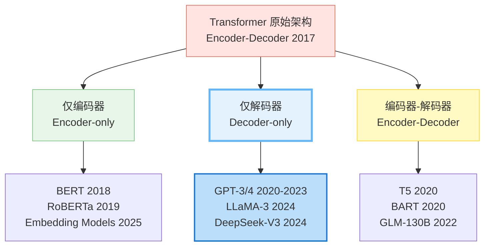
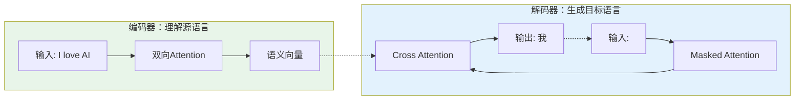
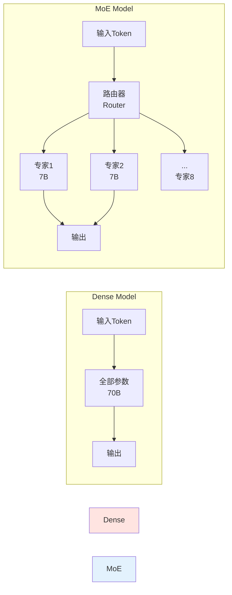

# 第2章：模型家族谱系：从编码器到解码器 (Model Architectures)

> "The best way to predict the future is to invent it." - Alan Kay
>
> 本章将带你理解Transformer的三大架构分支，掌握每种架构的设计哲学、技术细节和当前的主流选择，助你在实际应用中做出明智的架构选型。

---

## 目录

- [一、共同的祖先：编码器-解码器架构](#一共同的祖先编码器-解码器架构)
  - [1.1 原始Transformer的双塔设计](#11-原始transformer的双塔设计)
  - [1.2 编码器-解码器的工作流程](#12-编码器-解码器的工作流程)
  - [1.3 T5：现代编码器-解码器的代表](#13-t5现代编码器-解码器的代表)
- [二、分裂与演化：为何不都用编码器-解码器？](#二分裂与演化为何不都用编码器-解码器)
  - [2.1 计算效率考量](#21-计算效率考量)
  - [2.2 任务特性适配](#22-任务特性适配)
- [三、仅编码器架构：双向的理解专家](#三仅编码器架构双向的理解专家)
  - [3.1 BERT的革命性设计](#31-bert的革命性设计)
  - [3.2 掩码语言模型 (MLM)](#32-掩码语言模型-mlm)
  - [3.3 为什么BERT不能生成文本？](#33-为什么bert不能生成文本)
  - [3.4 实战：BERT文本分类](#34-实战bert文本分类)
- [四、仅解码器架构：生成的王者](#四仅解码器架构生成的王者)
  - [4.1 GPT的单向设计哲学](#41-gpt的单向设计哲学)
  - [4.2 因果注意力机制 (Causal Mask)](#42-因果注意力机制-causal-mask)
  - [4.3 当前视角：Decoder-only的全面胜利](#43-当前视角decoder-only的全面胜利)
  - [4.4 实战：GPT文本生成](#44-实战gpt文本生成)
- [五、架构选型指南](#五架构选型指南)
  - [5.1 三大架构对比表](#51-三大架构对比表)
  - [5.2 决策树：我该用哪个？](#52-决策树我该用哪个)
  - [5.3 黄金组合：Encoder做索引，Decoder做生成](#53-黄金组合encoder做索引decoder做生成)
- [六、深度问答](#六深度问答)

---

**本章概览**

在第1章中，我们深入学习了Transformer的核心机制。但你是否好奇：**为什么BERT擅长理解文本，而GPT擅长生成文本？为什么现在的新模型（如DeepSeek-V3, LLaMA-3）几乎全都是Decoder-only架构？**

这一切的答案，藏在Transformer的**三大架构分支**中：



**难度级别**：⭐⭐（进阶）- 需要理解第1章的Transformer基础

---

## 一、共同的祖先：编码器-解码器架构

### 🎯 深度解析：Encoder与Decoder命名的历史真相

**核心困惑**：为什么GPT被称为"Decoder-only"，明明它没有"解码"任何输入源？

#### 命名的历史遗留

这是一个**Seq2Seq时代的命名惯性**。让我们追溯历史：

**2014-2017：Seq2Seq的黄金时代**

在Transformer出现之前，机器翻译的主流范式是**序列到序列（Sequence-to-Sequence）**模型，由两个RNN组成：

```
源语言: "I love AI"
    ↓
【Encoder RNN】
    ↓
固定长度的上下文向量 (Context Vector)
    ↓
【Decoder RNN】
    ↓
目标语言: "我爱AI"
```

在这个语境下，命名非常直观：

- **Encoder（编码器）**：将可变长度的**源序列**压缩成固定长度的向量
- **Decoder（解码器）**：将固定向量**展开**成可变长度的**目标序列**

关键：Decoder的输入**不是**目标序列本身，而是来自Encoder的编码结果。

#### Transformer继承了命名，但改变了本质

**2017：Transformer论文**

当Vaswani等人提出Transformer时，他们保持了这套命名：

- **Encoder**：双向注意力，处理源序列（如英文句子）
- **Decoder**：带Causal Mask的自注意力 + Cross-Attention，生成目标序列（如中文句子）

但注意**关键变化**：Transformer的Decoder现在有**两个注意力机制**：

1. **Masked Self-Attention**：对目标序列自己进行因果注意力
2. **Cross-Attention**：从Encoder获取源序列信息

#### 命名的崩塌：BERT和GPT时代

**2018：BERT（Encoder-only）**

BERT砍掉了Decoder，只保留了Encoder的双向注意力。这个命名还算合理——它确实是在"编码"输入。

**2018：GPT（Decoder-only）**

GPT砍掉了Encoder和Cross-Attention，只保留了Decoder的**Masked Self-Attention**。

**这里就出现了命名混乱**：

- GPT没有"源序列"和"目标序列"的区分
- 它的输入和输出是**同一个序列**（自回归生成）
- 它没有任何"解码"操作（没有从压缩向量还原信息）

**那为什么还叫Decoder-only？**

因为它使用的是**Transformer原始论文中Decoder部分的Self-Attention机制**（Causal Mask）。

#### 正确理解：Decoder = Masked Encoder

**本质揭秘**：

从技术实现看，GPT的"Decoder"就是**加了Causal Mask的Encoder**。

| 特性                  | BERT (Encoder)    | GPT (Decoder)       | 本质区别       |
| --------------------- | ----------------- | ------------------- | -------------- |
| **Self-Attention**    | 双向（Full Mask） | 单向（Causal Mask） | 注意力掩码不同 |
| **Position Encoding** | ✅                 | ✅                   | 相同           |
| **FFN**               | ✅                 | ✅                   | 相同           |
| **LayerNorm**         | ✅                 | ✅                   | 相同           |
| **Cross-Attention**   | ❌                 | ❌ (在GPT中被移除)   | 都没有         |

**代码验证**：

```python
import torch
import torch.nn as nn

def create_attention_mask(seq_len, is_encoder=True):
    """创建注意力掩码"""
    if is_encoder:
        # Encoder: 全1矩阵（双向）
        mask = torch.ones(seq_len, seq_len)
    else:
        # Decoder: 下三角矩阵（因果）
        mask = torch.tril(torch.ones(seq_len, seq_len))
    return mask

# 对比Encoder和Decoder的唯一区别
encoder_mask = create_attention_mask(5, is_encoder=True)
decoder_mask = create_attention_mask(5, is_encoder=False)

print("Encoder Mask (BERT):")
print(encoder_mask.int())
print("\nDecoder Mask (GPT):")
print(decoder_mask.int())
```

**输出**：

```
Encoder Mask (BERT):
tensor([[1, 1, 1, 1, 1],  ← 每个token可以看到所有token
        [1, 1, 1, 1, 1],
        [1, 1, 1, 1, 1],
        [1, 1, 1, 1, 1],
        [1, 1, 1, 1, 1]])

Decoder Mask (GPT):
tensor([[1, 0, 0, 0, 0],  ← 每个token只能看到左边
        [1, 1, 0, 0, 0],
        [1, 1, 1, 0, 0],
        [1, 1, 1, 1, 0],
        [1, 1, 1, 1, 1]])
```

**结论**：GPT的"Decoder"就是**Masked Encoder**。

#### 为什么不重新命名？

**三个原因**：

1. **历史惯性**：学术界已经习惯了这套术语
2. **论文引用链**：保持命名一致性，方便追溯
3. **功能区分**：虽然本质相同，但"Encoder-only"和"Decoder-only"的名字确实暗示了它们的**训练目标**不同：
   - Encoder（BERT）：预测被Mask的token（双向上下文）
   - Decoder（GPT）：预测下一个token（单向因果）

#### 更准确的命名方案

如果重新命名，学术界可能会这样称呼：

| 现在的名字          | 更准确的名字                    | 核心特征   |
| ------------------- | ------------------------------- | ---------- |
| **Encoder-only**    | **Bidirectional Transformer**   | 双向注意力 |
| **Decoder-only**    | **Causal Transformer**          | 因果注意力 |
| **Encoder-Decoder** | **Cross-Attention Transformer** | 交叉注意力 |

但这些新名字已经错过了历史时机。

#### 面试标准回答

**Q: 为什么GPT叫Decoder-only，它明明没有Encoder？**

**A**: 这是Seq2Seq时代的命名遗留。在原始Transformer中，Decoder使用Causal Mask的Self-Attention + Cross-Attention。GPT移除了Cross-Attention，只保留了Causal Self-Attention，因此被称为"Decoder-only"。从技术本质上讲，GPT的"Decoder"就是**加了Causal Mask的Encoder**，两者的唯一区别是注意力掩码的形状（全1矩阵 vs 下三角矩阵）。

#### 关键洞察

**记住一句话**：

> **Decoder-only ≠ 解码器，而是 Masked Encoder = 因果注意力的Transformer**

这个命名更多是历史传承，而非技术本质。

---

### 1.1 原始Transformer的双塔设计

2017年，论文《Attention is All You Need》提出的Transformer，采用的是**编码器-解码器（Encoder-Decoder）**结构，最初是为了解决机器翻译任务：



**核心设计理念**：

- **编码器（Encoder）**：使用**双向注意力**，同时看到整个输入句子，提取深层语义。
- **解码器（Decoder）**：使用**因果注意力**（只看左边），自回归地生成目标句子。
- **交叉注意力（Cross-Attention）**：连接两座塔的桥梁，让解码器在生成每个字时都能"回头看"编码器的信息。

### 1.2 编码器-解码器的工作流程

以翻译 "I love AI" -> "我爱AI" 为例：

1. **编码阶段**：Encoder 读入完整句子 "I love AI"，将其转化为一系列高维向量（Memory）。
2. **解码阶段 - Step 1**：Decoder 接收 `<start>`，此时通过 **Cross-Attention** 查询 Memory，重点关注 "I"，输出 "我"。
3. **解码阶段 - Step 2**：Decoder 接收 `<start> 我`，关注 "love"，输出 "爱"。
4. **解码阶段 - Step 3**：Decoder 接收 `<start> 我 爱`，关注 "AI"，输出 "AI"。

### 1.3 T5：现代编码器-解码器的代表

Google 在 2020 年提出的 **T5 (Text-to-Text Transfer Transformer)** 将这种架构推向了极致。它提出一个核心观点：**所有NLP任务都可以视为文本到文本的转换**。

- **翻译**：`translate English to German: That is good.` -> `Das ist gut.`
- **分类**：`cola sentence: The course is jumping well.` -> `not acceptable`
- **摘要**：`summarize: state authorities dispatched emergency crews...` -> `six people hospitalized...`

T5 证明了 Encoder-Decoder 架构在多任务统一上的强大能力，特别是对于输入输出都需要理解的任务（如翻译、摘要）。

---

## 二、分裂与演化：为何不都用编码器-解码器？

既然 Encoder-Decoder 全能，为什么后来分化出了 BERT 和 GPT？

### 2.1 计算效率考量

Encoder-Decoder 需要维护两套参数（编码器和解码器），且推理时需要两个模块协同工作。

- 对于**分类任务**（如情感分析），只需要输出一个标签，用 Decoder 是杀鸡用牛刀。
- 对于**生成任务**（如写小说），输入就是上文，不需要单独的 Encoder 去编码一个"源文本"，直接用 Decoder 自回归即可。

### 2.2 任务特性适配

- **理解密集型**：情感分析、实体识别、文本匹配。需要**双向**上下文（既看左也看右）。👉 **Encoder-only (BERT)**
- **生成密集型**：创意写作、代码补全、对话。需要**自回归**生成（只能看左，不能剧透）。👉 **Decoder-only (GPT)**

---

## 三、仅编码器架构：双向的理解专家

### 3.1 BERT的革命性设计

**BERT (Bidirectional Encoder Representations from Transformers)** 砍掉了 Transformer 的解码器，只保留编码器。

**核心武器：双向注意力 (Bidirectional Attention)**
GPT 只能从左到右看（为了生成），这导致它在理解语境时有缺陷。例如：

> "I went to the **bank** to deposit money."
> "I went to the **bank** of the river."

BERT 能同时看到 "bank" 左右的词（"deposit money" 或 "river"），从而精准判断 "bank" 是"银行"还是"河岸"。

### 3.2 掩码语言模型 (MLM)

为了训练双向模型，BERT 发明了 **MLM (Masked Language Modeling)** 任务，类似"完形填空"：

> 原句：The cat sat on the mat.
>
> 输入：The cat [MASK] on the mat.
>
> 目标：预测 [MASK] 是 "sat"。

**代码实战：BERT 做完形填空**

```python
from transformers import pipeline

fill_mask = pipeline("fill-mask", model="bert-base-uncased")
result = fill_mask("Paris is the [MASK] of France.")

print(result)
# 输出: [{'score': 0.99, 'token_str': 'capital', ...}]
```

### 3.3 为什么BERT不能生成文本？

这是一个常见的面试题：**BERT 既然理解能力这么强，为什么不能用来写文章？**

1. **预训练目标不同**：BERT 训练的是"填空"能力，不是"预测下一个词"的能力。它习惯了看到完整的上下文。
2. **双向注意力的泄露**：在生成时，如果使用双向注意力，生成第 $t$ 个词时会看到第 $t+1$ 个词的信息（这在训练时是存在的，但在真实生成时通过 Mask 可以在技术上屏蔽，但模型并未适应这种单向语境）。
3. **独立性假设**：BERT 预测 [MASK] 时假设各个 [MASK] 是独立的（在非自回归变体中），而文本生成强依赖词与词的顺序关联。

### 3.4 实战：BERT文本分类

BERT 最擅长的是将变长的文本压缩成一个定长的向量（通常取 `[CLS]` token 的向量），用于分类。

```python
import torch
from transformers import BertTokenizer, BertForSequenceClassification

# 1. 加载模型
model_name = "bert-base-uncased"
tokenizer = BertTokenizer.from_pretrained(model_name)
model = BertForSequenceClassification.from_pretrained(model_name, num_labels=2)

# 2. 准备输入
text = "This movie is absolutely fantastic!"
inputs = tokenizer(text, return_tensors="pt")

# 3. 前向传播
with torch.no_grad():
    outputs = model(**inputs)
    logits = outputs.logits
    prediction = torch.argmax(logits, dim=-1)

print(f"预测类别: {prediction.item()}")
```

---

## 四、仅解码器架构：生成的王者

### 4.1 GPT的单向设计哲学

**GPT (Generative Pre-trained Transformer)** 砍掉了 Transformer 的编码器，只保留解码器。

它的哲学非常简单粗暴：**预测下一个词 (Next Token Prediction)**。
不需要复杂的 Mask 策略，不需要区分源文本和目标文本，就是把整个互联网的文本读一遍，尝试预测每一个词的下一个词是什么。

$$ P(\text{text}) = \prod_{i=1}^{n} P(w_i | w_1, ..., w_{i-1}) $$

### 4.2 因果注意力机制 (Causal Mask)

GPT 的核心在于**Causal Mask（因果掩码）**，保证预测 $w_i$ 时只能看到 $w_1$ 到 $w_{i-1}$，绝不能看到后面。

**Causal Mask 的形状与实现**：
它是一个下三角矩阵（上三角部分被处理为负无穷大，Softmax 后变为 0）。

```python
import torch
import matplotlib.pyplot as plt

def create_causal_mask(size):
    # 创建一个全1矩阵
    mask = torch.ones(size, size)
    # 提取下三角，上三角置0
    mask = torch.tril(mask)
    return mask

# 示例：长度为5的序列
# 行i表示第i个token，列j表示它关注的token
mask = create_causal_mask(5)
print(mask)
"""
输出:
tensor([[1., 0., 0., 0., 0.],  # 第1个词只能看自己
        [1., 1., 0., 0., 0.],  # 第2个词看前2个
        [1., 1., 1., 0., 0.],
        [1., 1., 1., 1., 0.],
        [1., 1., 1., 1., 1.]]) # 第5个词看全部
"""
```

### 4.3 当前视角：Decoder-only的全面胜利

在 2018-2020 年，BERT 和 GPT 各领风骚。但在当前，**Decoder-only 架构已经统治了通用大模型领域**。

**主流模型清单 (SOTA)**：

- **OpenAI GPT-4/o1**：Decoder-only
- **Meta LLaMA 3**：Decoder-only
- **DeepSeek-V3/R1**：Decoder-only (配合 MoE)
- **Anthropic Claude 3.5**：Decoder-only

**胜出原因**：

1. **Scaling Law (扩展定律)**：研究发现，在极大规模参数下，Causal Decoder 的训练效率最高，最容易扩展。BERT 的 MLM 任务每个样本只能学习 15% 的 token（被 mask 的那些），而 GPT 的 Next Token Prediction 每个样本的所有 token 都能产生 loss，**数据利用率更高**。
2. **In-Context Learning (上下文学习)**：这是 GPT-3 发现的涌现能力。Decoder-only 架构天然符合人类"说话"的顺序，给它几个示例（Few-shot），它就能依葫芦画瓢地生成后续内容。这种通用性通过 Prompt 实现了无需微调即可处理多种任务。
3. **推理优化的成熟**：KV Cache 等技术让 Decoder-only 的生成速度大幅提升，工业界围绕这一架构建立的生态（vLLM, TensorRT-LLM）最为完善。

> **注意**：DeepSeek-V3 虽然引入了 MLA (Multi-head Latent Attention) 等改进，DeepSeek-R1 引入了强化学习训练推理能力，但它们的骨架依然是 **Decoder-only Transformer**。这一点至关重要。

### 4.5 Dense vs Sparse：MoE架构的崛起

在 Decoder-only 架构的主流之下，近年出现了一个重要的分支创新：**混合专家 (Mixture of Experts, MoE)** 架构。

#### 什么是MoE？

传统Transformer是**密集模型（Dense Model）**：每个token都经过所有参数的计算。而MoE是**稀疏模型（Sparse Model）**：模型拥有大量参数，但每个token只激活其中一小部分。



**核心原理**：

- **路由机制（Gating）**：对于每个token，通过一个小型路由网络决定激活哪几个专家。
- **稀疏激活**：通常只激活Top-K个专家（如K=2，即8个专家中选2个）。
- **专家专业化**：不同专家自然地学习到不同领域的知识（如代码、数学、语言等）。

#### Dense vs Sparse 对比

| 特性           | Dense Model (LLaMA 3) | Sparse MoE (DeepSeek-V3)     |
| -------------- | --------------------- | ---------------------------- |
| **总参数量**   | 70B                   | 671B                         |
| **激活参数量** | 70B (100%)            | 37B (5.5%)                   |
| **推理成本**   | 高（所有参数参与）    | 中等（相当于37B Dense）      |
| **训练成本**   | 中等                  | 高（需要Expert Parallelism） |
| **性能**       | 优秀                  | 卓越（超越GPT-4）            |
| **显存占用**   | 140GB (FP16)          | 1.3TB (需要分布式)           |

**代码示例：MoE的路由逻辑**

```python
import torch
import torch.nn as nn
import torch.nn.functional as F

class MoELayer(nn.Module):
    """混合专家层"""

    def __init__(self, num_experts: int = 8, expert_dim: int = 4096,
                 top_k: int = 2):
        super().__init__()
        self.num_experts = num_experts
        self.top_k = top_k

        # 路由器：为每个token选择专家
        self.gate = nn.Linear(expert_dim, num_experts)

        # 专家网络（简化为单层FFN）
        self.experts = nn.ModuleList([
            nn.Sequential(
                nn.Linear(expert_dim, expert_dim * 4),
                nn.GELU(),
                nn.Linear(expert_dim * 4, expert_dim)
            )
            for _ in range(num_experts)
        ])

    def forward(self, x: torch.Tensor) -> torch.Tensor:
        """
        x: (batch_size, seq_len, expert_dim)
        """
        batch_size, seq_len, dim = x.shape

        # 1. 路由决策：为每个token选择Top-K专家
        gate_logits = self.gate(x)  # (B, L, num_experts)
        gate_probs = F.softmax(gate_logits, dim=-1)

        # 选择Top-K专家
        top_k_probs, top_k_indices = torch.topk(gate_probs, self.top_k, dim=-1)
        top_k_probs = F.softmax(top_k_probs, dim=-1)  # 重新归一化

        # 2. 稀疏激活：只计算被选中的专家
        output = torch.zeros_like(x)

        for i in range(self.top_k):
            expert_idx = top_k_indices[..., i]  # (B, L)
            expert_weight = top_k_probs[..., i].unsqueeze(-1)  # (B, L, 1)

            # 批量处理：将同一专家的token收集在一起
            for expert_id in range(self.num_experts):
                mask = (expert_idx == expert_id)
                if mask.any():
                    expert_input = x[mask]
                    expert_output = self.experts[expert_id](expert_input)
                    output[mask] += expert_output * expert_weight[mask]

        return output

# 使用示例
moe_layer = MoELayer(num_experts=8, expert_dim=4096, top_k=2)
x = torch.randn(2, 10, 4096)  # (batch=2, seq_len=10, dim=4096)
output = moe_layer(x)

print(f"输入形状: {x.shape}")
print(f"输出形状: {output.shape}")
print(f"激活参数比例: {2/8:.1%} (Top-2 / 8 experts)")
```

**MoE的训练挑战与解决方案**：

1. **负载均衡问题**：所有token都选择同一个专家，导致其他专家"失业"。

   - **解决**：添加Load Balancing Loss，惩罚不均衡的专家选择。

   ```python
   def load_balancing_loss(gate_logits, num_experts):
       """
       确保每个专家被平均使用
       """
       # 计算每个专家被选择的频率
       expert_counts = F.softmax(gate_logits, dim=-1).sum(dim=[0, 1])
       target_counts = gate_logits.size(0) * gate_logits.size(1) / num_experts
   
       # L2损失
       return ((expert_counts - target_counts) ** 2).mean()
   ```

2. **通信开销**：专家分布在不同GPU上，需要频繁通信。

   - **解决**：Expert Parallelism（专家并行）+ All-to-All通信优化。

3. **推理部署**：显存占用大（需要加载所有专家）。

   - **解决**：量化压缩（INT8/INT4）+ 专家卸载到CPU/磁盘。

**实际案例**：

| 模型             | 总参数 | 激活参数 | 专家数 | Top-K | 性能亮点                     |
| ---------------- | ------ | -------- | ------ | ----- | ---------------------------- |
| **Mixtral 8x7B** | 46.7B  | 13B      | 8      | 2     | 接近LLaMA-70B性能，推理快5倍 |
| **DeepSeek-V3**  | 671B   | 37B      | 256    | 8     | 超越GPT-4，训练成本仅$5.5M   |
| **Qwen2.5-MoE**  | 14.3B  | 2.7B     | 60     | 8     | 2.7B激活达到7B Dense性能     |

**为什么MoE近年爆发？**

1. **成本优势**：训练671B MoE的成本 < 训练175B Dense。
2. **推理效率**：激活参数少，推理速度快。
3. **容量优势**：更多参数意味着更大的知识容量。
4. **分布式训练成熟**：DeepSpeed、Megatron等框架原生支持MoE。

> **深入学习**：MoE的完整训练策略、路由机制设计、专家并行实现详见 [Part 7 第2章：新型架构探索]。

### 4.6 超越Transformer：SSM与Mamba的挑战

虽然Transformer统治了当前的LLM领域，但研究者们一直在探索**非Transformer架构**，试图解决Transformer的固有缺陷：

**Transformer的痛点**：

- **二次方复杂度**：注意力机制的计算量是 $O(n^2)$，处理长文本（如100K tokens）时非常慢。
- **KV Cache膨胀**：生成长文本时，KV Cache占用的显存随序列长度线性增长。

#### 状态空间模型（SSM）：线性时间的挑战者

**核心思想**：用状态空间方程替代注意力机制，将序列建模问题转化为线性系统。

$$
\begin{cases}
h_t = A h_{t-1} + B x_t \\
y_t = C h_t + D x_t
\end{cases}
$$

其中：

- $h_t$：隐状态（类似RNN）
- $A, B, C, D$：可学习的状态转移矩阵
- 关键：可以通过卷积形式高效实现，复杂度为 $O(n \log n)$

**Mamba (2023)**：最成功的SSM架构

Mamba通过**选择性SSM（Selective SSM）**解决了传统SSM无法处理长距离依赖的问题：

```python
# Mamba的核心思想（概念代码，非实际实现）
class MambaBlock(nn.Module):
    """
    Mamba块：选择性状态空间模型
    """
    def __init__(self, d_model, d_state=16):
        super().__init__()
        self.d_model = d_model
        self.d_state = d_state

        # 选择性参数：根据输入动态调整SSM参数
        self.input_proj = nn.Linear(d_model, d_state * 3)

        # 状态转移矩阵（可学习）
        self.A = nn.Parameter(torch.randn(d_state, d_state))
        self.B = nn.Parameter(torch.randn(d_state, d_model))
        self.C = nn.Parameter(torch.randn(d_model, d_state))

    def forward(self, x):
        """
        x: (batch, seq_len, d_model)
        """
        B, L, D = x.shape

        # 选择性机制：根据输入调整SSM参数
        ssm_params = self.input_proj(x)  # (B, L, d_state*3)
        delta, B_sel, C_sel = ssm_params.chunk(3, dim=-1)

        # 状态空间递归（简化版）
        h = torch.zeros(B, self.d_state)
        outputs = []

        for t in range(L):
            # 选择性更新状态
            h = torch.sigmoid(delta[:, t]) * (self.A @ h) + B_sel[:, t] * x[:, t]
            y = C_sel[:, t] @ h
            outputs.append(y)

        return torch.stack(outputs, dim=1)
```

**Transformer vs SSM vs Mamba 对比**

| 特性           | Transformer   | 传统SSM (S4)  | Mamba         |
| -------------- | ------------- | ------------- | ------------- |
| **时间复杂度** | $O(n^2)$      | $O(n \log n)$ | $O(n)$        |
| **长文本处理** | 慢（>8K困难） | 中等          | 快（支持1M+） |
| **并行训练**   | 优秀          | 中等          | 优秀          |
| **上下文学习** | 强            | 弱            | 中等          |
| **生态成熟度** | 极高          | 低            | 低            |

**Mamba的实际表现**：

```python
# 性能对比（来自Mamba论文，2024）
benchmark_results = {
    "模型": ["Transformer-7B", "Mamba-7B"],
    "训练速度": ["1x", "3x"],  # Mamba快3倍
    "推理吞吐量（8K seq）": ["1x", "5x"],  # 长序列推理Mamba快5倍
    "显存占用（100K seq）": ["OOM", "正常"],  # Transformer爆显存
    "语言建模PPL": [10.5, 10.8],  # 性能接近
}
```

**为什么Mamba当前还未取代Transformer？**

1. **In-Context Learning弱**：Mamba在Few-shot学习上不如Transformer，这是LLM的核心能力。
2. **生态不足**：缺少成熟的工具链（如vLLM、TensorRT-LLM对Mamba的支持有限）。
3. **训练稳定性**：大规模训练时，Mamba的稳定性不如Transformer。
4. **投资惯性**：工业界已在Transformer上投入数十亿美元，迁移成本高。

**未来展望**：

- **混合架构**：Transformer（处理短上下文）+ Mamba（处理长上下文），取长补短。
- **多模态优势**：Mamba在视频、音频等长序列模态上可能更有优势。

> **深入学习**：SSM的数学原理、Mamba的完整实现、混合架构设计详见 [Part 7 第2章：新型架构探索]。

**本节小结**：

当前的架构格局：

- **主流**：Decoder-only Transformer（GPT、LLaMA系列）
- **前沿**：MoE稀疏架构（DeepSeek-V3、Mixtral）
- **挑战者**：SSM/Mamba（线性复杂度，长上下文优势）
- **特定领域**：Encoder-only（Embedding）、Encoder-Decoder（多模态）

选择建议：

- **通用LLM**：Decoder-only Transformer（生态最成熟）
- **超大规模**：MoE架构（成本效率高）
- **超长上下文**：混合架构（Transformer + Mamba）
- **嵌入任务**：Encoder-only（BERT变体）

### 4.4 实战：GPT文本生成

使用 `AutoModelForCausalLM` 进行生成。

```python
from transformers import GPT2LMHeadModel, GPT2Tokenizer

model_name = "gpt2"
tokenizer = GPT2Tokenizer.from_pretrained(model_name)
model = GPT2LMHeadModel.from_pretrained(model_name)

prompt = "The future of AI is"
inputs = tokenizer(prompt, return_tensors="pt")

# 生成配置
output = model.generate(
    **inputs,
    max_length=50,
    temperature=0.7,    # 控制随机性：越低越保守，越高越奔放
    top_p=0.9,          # 核采样：保留累积概率90%的词
    do_sample=True      # 启用采样，否则是贪婪搜索
)

print(tokenizer.decode(output[0], skip_special_tokens=True))
# 可能的输出: "The future of AI is bright. With transformers leading the way..."
```

---

## 五、架构选型指南

在实际构建应用时，我们该如何选择？

### 5.1 三大架构对比表

| 特性         | Encoder-only (BERT类)                | Decoder-only (GPT类)            | Encoder-Decoder (T5类)         |
| :----------- | :----------------------------------- | :------------------------------ | :----------------------------- |
| **可见范围** | 双向 (Bi-directional)                | 单向 (Uni-directional)          | 混合 (Mixed)                   |
| **擅长任务** | 文本分类、命名实体识别、**语义嵌入** | **文本生成**、对话、逻辑推理    | 翻译、摘要 (逐渐被Decoder替代) |
| **代表模型** | BERT, RoBERTa, **BGE-M3**            | GPT-4, LLaMA 3, **DeepSeek-V3** | T5, UL2                        |
| **缺点**     | 很难生成长文本                       | 只能看左边，嵌入质量略逊        | 结构复杂，推理慢               |

### 5.2 决策树：我该用哪个？

1. **如果你要把文本变成向量 (Embedding)** -> **Encoder-only**
   - 场景：RAG 中的知识库索引、语义搜索、聚类。
   - 选型：`bge-m3`, `nomic-embed-text`, `text-embedding-3-small` (OpenAI 虽然是闭源，但内部通常也是基于双向注意力优化的)。

2. **如果你要生成文本、回答问题、写代码** -> **Decoder-only**
   - 场景：聊天机器人、写作助手、Agent。
   - 选型：`DeepSeek-V3`, `Claude 3.5`, `Llama 3`, `GPT-4`。

3. **如果你要处理极其不对称的转换** -> **Encoder-Decoder** (较少见)
   - 场景：语音转文字 (Whisper)、复杂的机器翻译（尽管 GPT 也能做，但专用模型有时更精准）。

### 5.3 黄金组合：Encoder做索引，Decoder做生成

在最流行的 **RAG (Retrieval-Augmented Generation)** 架构中，我们通常结合使用两者：

1. 用 **Encoder** 模型（如 BERT 变体）将百万文档转化为向量库。
2. 用户提问时，先检索出相关文档。
3. 用 **Decoder** 模型（如 GPT-4）阅读检索到的文档并回答用户问题。

这是目前企业级应用的标准范式。

---

## 六、深度问答

**Q1: 既然 Decoder-only 是主流，BERT 是不是被淘汰了？**
A: **没有**。在 Embedding 领域（将文本转化为向量），Encoder-only 架构依然是绝对王者。因为理解一句话的语义，必须同时看到前后文。目前最强的开源 Embedding 模型（如 BGE, E5 等）本质上都是 BERT 的现代变体。

**Q2: T5 这种 Encoder-Decoder 还有人用吗？**
A: 在多模态领域（如音频转文本 Whisper、图像生成 Imagen）依然广泛使用。但在纯文本生成领域，确实正在被 Decoder-only 取代，因为后者在 Scaling 上更具优势。

**Q3: DeepSeek-R1 / o1 是什么架构？**
A: 它们的基础架构依然是 **Decoder-only Transformer**。它们的"推理能力"主要来自**后训练阶段 (Post-training)** 的强化学习（RL）策略，而不是改变了 Transformer 的底层积木。这些内容将在 [Part 7 第4章] 详细拆解。

**Q4: 我只做很简单的文本分类，该用什么？**
A: 如果数据量少且算力受限，微调一个 `DistilBERT` (6层 BERT) 依然是最佳选择，速度快、效果好、成本低。如果不想微调，直接用 LLM (GPT) 做 Few-shot 也可以，但成本较高。

---

> **下一章预告**：知道了架构，这些模型是如何"炼"出来的？MLM 和 Next Token Prediction 到底是如何让模型产生智能的？下一章《预训练的奥秘》将揭晓。
