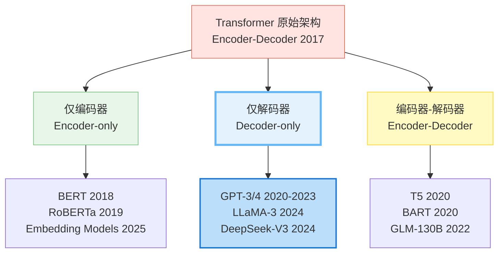
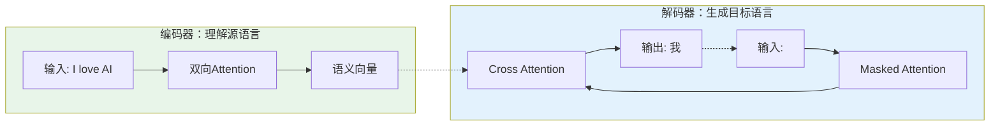
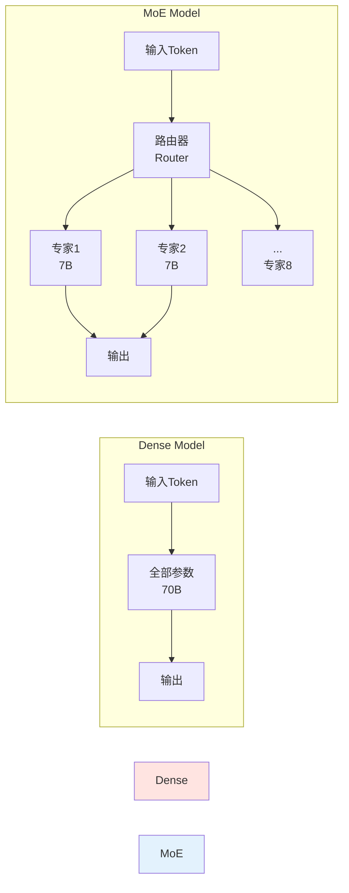

# 第2章：模型家族谱系：从编码器到解码器 (Model Architectures)

> "The best way to predict the future is to invent it." - Alan Kay
>
> 本章将带你理解Transformer的三大架构分支，掌握每种架构的设计哲学、技术细节和2025年的主流选择，助你在实际应用中做出明智的架构选型。

---

## 目录
- [一、共同的祖先：编码器-解码器架构](#一共同的祖先编码器-解码器架构)
  - [1.1 原始Transformer的双塔设计](#11-原始transformer的双塔设计)
  - [1.2 编码器-解码器的工作流程](#12-编码器-解码器的工作流程)
  - [1.3 T5：现代编码器-解码器的代表](#13-t5现代编码器-解码器的代表)
- [二、分裂与演化：为何不都用编码器-解码器？](#二分裂与演化为何不都用编码器-解码器)
  - [2.1 计算效率考量](#21-计算效率考量)
  - [2.2 任务特性适配](#22-任务特性适配)
- [三、仅编码器架构：双向的理解专家](#三仅编码器架构双向的理解专家)
  - [3.1 BERT的革命性设计](#31-bert的革命性设计)
  - [3.2 掩码语言模型 (MLM)](#32-掩码语言模型-mlm)
  - [3.3 为什么BERT不能生成文本？](#33-为什么bert不能生成文本)
  - [3.4 实战：BERT文本分类](#34-实战bert文本分类)
- [四、仅解码器架构：生成的王者](#四仅解码器架构生成的王者)
  - [4.1 GPT的单向设计哲学](#41-gpt的单向设计哲学)
  - [4.2 因果注意力机制 (Causal Mask)](#42-因果注意力机制-causal-mask)
  - [4.3 2025年视角：Decoder-only的全面胜利](#43-2025年视角decoder-only的全面胜利)
  - [4.4 实战：GPT文本生成](#44-实战gpt文本生成)
- [五、2025年前沿：超越标准Transformer](#五2025年前沿超越标准transformer)
  - [5.1 MoE：稀疏激活的魔法](#51-moe稀疏激活的魔法)
  - [5.2 SSM/Mamba：线性复杂度的挑战者](#52-ssmmamba线性复杂度的挑战者)
- [六、架构选型指南](#六架构选型指南)
  - [6.1 三大架构对比表](#61-三大架构对比表)
  - [6.2 决策树：我该用哪个？](#62-决策树我该用哪个)
  - [6.3 黄金组合：Encoder做索引，Decoder做生成](#63-黄金组合encoder做索引decoder做生成)
- [七、深度问答](#七深度问答)

---

**本章概览**

第1章中，我们拆解了Transformer的所有零部件：自注意力、多头机制、位置编码、前馈网络。但当你打开真实的模型库时，会发现一个困惑：**为什么BERT不能生成文本？为什么GPT处理长文本这么慢？为什么2025年的新模型几乎都叫"Decoder-only"？**

答案藏在一个历史分叉点：2017年Transformer诞生后，它沿着三条不同的路径演化，最终形成了今天的**三大架构谱系**：



**难度级别**：⭐⭐（进阶）- 需要理解第1章的Transformer基础

---

## 一、共同的祖先：编码器-解码器架构

在开始之前，先解决一个困扰无数人的问题：**为什么GPT叫"Decoder-only"，它明明没有在"解码"什么东西？**

这是一个历史遗留的命名问题。简单来说：

**Seq2Seq时代（2014-2017）**：机器翻译用Encoder把源语言压缩成向量，Decoder把向量展开成目标语言。这里"Decoder"确实在"解码"。

**Transformer时代（2017）**：保留了这套命名，但Decoder多了Causal Mask + Cross-Attention。

**BERT/GPT时代（2018）**：
- BERT砍掉Decoder，只留Encoder（双向注意力）
- GPT砍掉Encoder和Cross-Attention，只留Decoder的Causal Self-Attention

**核心真相**：从技术实现看，GPT的"Decoder"就是**加了Causal Mask的Encoder**。两者的唯一区别是注意力掩码的形状：

```python
# Encoder (BERT): 全1矩阵（双向）
[[1, 1, 1, 1, 1],
 [1, 1, 1, 1, 1],
 [1, 1, 1, 1, 1]]

# Decoder (GPT): 下三角矩阵（因果）
[[1, 0, 0, 0, 0],
 [1, 1, 0, 0, 0],
 [1, 1, 1, 0, 0]]
```

**记住一句话**：**Decoder-only ≠ 解码器，它只是"用因果掩码的Transformer"**。命名是历史传承，不是技术本质。

> 面试时如果被问到，就说：这是Seq2Seq时代的命名惯性，GPT保留了Causal Mask机制，所以被称为Decoder-only。本质上它和Encoder只差一个注意力掩码的形状。

---

### 1.1 原始Transformer的双塔设计

2017年，论文《Attention is All You Need》提出的Transformer，采用的是**编码器-解码器（Encoder-Decoder）**结构，最初是为了解决机器翻译任务：



**核心设计理念**：
- **编码器（Encoder）**：使用**双向注意力**，同时看到整个输入句子，提取深层语义。
- **解码器（Decoder）**：使用**因果注意力**（只看左边），自回归地生成目标句子。
- **交叉注意力（Cross-Attention）**：连接两座塔的桥梁，让解码器在生成每个字时都能"回头看"编码器的信息。

### 1.2 编码器-解码器的工作流程

以翻译 "I love AI" -> "我爱AI" 为例：

1. **编码阶段**：Encoder 读入完整句子 "I love AI"，将其转化为一系列高维向量（Memory）。
2. **解码阶段 - Step 1**：Decoder 接收 `<start>`，此时通过 **Cross-Attention** 查询 Memory，重点关注 "I"，输出 "我"。
3. **解码阶段 - Step 2**：Decoder 接收 `<start> 我`，关注 "love"，输出 "爱"。
4. **解码阶段 - Step 3**：Decoder 接收 `<start> 我 爱`，关注 "AI"，输出 "AI"。

### 1.3 T5：现代编码器-解码器的代表

Google 在 2020 年提出的 **T5 (Text-to-Text Transfer Transformer)** 将这种架构推向了极致。它提出一个核心观点：**所有NLP任务都可以视为文本到文本的转换**。

- **翻译**：`translate English to German: That is good.` -> `Das ist gut.`
- **分类**：`cola sentence: The course is jumping well.` -> `not acceptable`
- **摘要**：`summarize: state authorities dispatched emergency crews...` -> `six people hospitalized...`

T5 证明了 Encoder-Decoder 架构在多任务统一上的强大能力，特别是对于输入输出都需要理解的任务（如翻译、摘要）。

---

## 二、分裂与演化：为何不都用编码器-解码器？

既然原始Transformer能做翻译这种复杂任务，为什么2018年之后分裂成了BERT和GPT两条路线？

**答案一：任务需求不同**

翻译需要"理解源文本 + 生成目标文本"，所以用Encoder-Decoder。但现实中：
- **分类任务**（情感分析、实体识别）：只需要理解输入，输出一个标签。用Decoder生成是杀鸡用牛刀。
- **生成任务**（写文章、代码补全）：输入就是上文，不需要单独的"源文本"编码器，直接Decoder自回归即可。

**答案二：计算效率**

Encoder-Decoder维护两套参数，推理时需要协同工作。对于只需要理解或只需要生成的任务，砍掉一半架构，效率翻倍。

**任务与架构的对应关系**：
- **理解密集型**（文本分类、实体识别、语义检索）→ 需要双向看上下文 → **Encoder-only (BERT)**
- **生成密集型**（写作、对话、代码）→ 需要自回归生成 → **Decoder-only (GPT)**
- **转换型**（翻译、摘要、语音转文本）→ 输入输出不对称 → **Encoder-Decoder (T5/Whisper)**

---

## 三、仅编码器架构：双向的理解专家

### 3.1 BERT的核心设计

**BERT (Bidirectional Encoder Representations from Transformers)** 在2018年横空出世，砍掉了Transformer的Decoder，只保留Encoder。

**核心武器：双向注意力**

理解这个句子：
> "I went to the **bank** to deposit money."

如果只从左到右看（像GPT），处理"bank"时只知道"I went to the"，不知道后面是"deposit money"还是"of the river"。BERT的双向注意力让每个词既能看左边，也能看右边，从而精准理解"bank"是"银行"还是"河岸"。

这就是为什么BERT在理解任务（分类、实体识别、问答）上碾压当时的GPT-1。

### 3.2 掩码语言模型 (MLM)

为了训练双向模型，BERT 发明了 **MLM (Masked Language Modeling)** 任务，类似"完形填空"：

> 原句：The cat sat on the mat.
>
> 输入：The cat [MASK] on the mat.
>
> 目标：预测 [MASK] 是 "sat"。

**代码实战：BERT 做完形填空**

```python
from transformers import pipeline

fill_mask = pipeline("fill-mask", model="bert-base-uncased")
result = fill_mask("Paris is the [MASK] of France.")

print(result)
# 输出: [{'score': 0.99, 'token_str': 'capital', ...}]
```

### 3.3 为什么BERT不能生成文本？

这是一个高频面试题：**BERT理解能力这么强，为什么不能用来写文章？**

**技术原因**：
1. **训练目标不匹配**：BERT学的是"完形填空"（看到完整句子，填中间的空），不是"续写"（只看前文，预测下一个词）。
2. **双向注意力作弊**：生成文本时，第t个词不能看到第t+1个词（否则是作弊）。但BERT从未训练过这种"只看左边"的场景，强行用会崩溃。
3. **独立性假设**：BERT预测多个[MASK]时，假设它们相互独立。但写文章时，每个词强依赖前面的词（比如主语是"he"，后面不能突然变成"她"）。

**直观理解**：BERT像个"阅读理解专家"，给它一篇完整文章，它能回答问题。但让它"写"文章，它从未训练过这种能力。

### 3.4 实战：BERT文本分类

BERT 最擅长的是将变长的文本压缩成一个定长的向量（通常取 `[CLS]` token 的向量），用于分类。

```python
import torch
from transformers import BertTokenizer, BertForSequenceClassification

# 1. 加载模型
model_name = "bert-base-uncased"
tokenizer = BertTokenizer.from_pretrained(model_name)
model = BertForSequenceClassification.from_pretrained(model_name, num_labels=2)

# 2. 准备输入
text = "This movie is absolutely fantastic!"
inputs = tokenizer(text, return_tensors="pt")

# 3. 前向传播
with torch.no_grad():
    outputs = model(**inputs)
    logits = outputs.logits
    prediction = torch.argmax(logits, dim=-1)

print(f"预测类别: {prediction.item()}")
```

---

## 四、仅解码器架构：生成的王者

### 4.1 GPT的设计哲学

**GPT (Generative Pre-trained Transformer)** 选择了完全相反的路线：砍掉Encoder，只留Decoder。

它的训练目标极其简单：**预测下一个词**。

给定前文"The cat sat on the"，预测下一个词是"mat"的概率。把整个互联网的文本按这个目标训练一遍，模型就学会了语言的统计规律。

数学上，就是最大化这个概率：
$$ P(\text{text}) = \prod_{i=1}^{n} P(w_i | w_1, ..., w_{i-1}) $$

没有复杂的Mask策略，没有源文本/目标文本的区分，就是纯粹的自回归生成。

### 4.2 因果注意力机制 (Causal Mask)

GPT如何确保"不作弊"（不偷看后面的词）？答案是**Causal Mask（因果掩码）**。

它是一个下三角矩阵：预测第i个词时，只能看到第1到第i-1个词，后面的词全部遮住。

```python
import torch
import matplotlib.pyplot as plt

def create_causal_mask(size):
    # 创建一个全1矩阵
    mask = torch.ones(size, size)
    # 提取下三角，上三角置0
    mask = torch.tril(mask)
    return mask

# 示例：长度为5的序列
# 行i表示第i个token，列j表示它关注的token
mask = create_causal_mask(5)
print(mask)
"""
输出:
tensor([[1., 0., 0., 0., 0.],  # 第1个词只能看自己
        [1., 1., 0., 0., 0.],  # 第2个词看前2个
        [1., 1., 1., 0., 0.],
        [1., 1., 1., 1., 0.],
        [1., 1., 1., 1., 1.]]) # 第5个词看全部
"""
```

### 4.3 2025年视角：Decoder-only的全面胜利

2018-2020年，BERT和GPT还在各自的领域争雄。但到2025年，**Decoder-only架构已经统治了通用大模型领域**。

**主流模型清单（2025）**：
- OpenAI GPT-4/o1：Decoder-only
- Meta LLaMA 3：Decoder-only
- DeepSeek-V3/R1：Decoder-only（+ MoE）
- Anthropic Claude 3.5：Decoder-only

**为什么Decoder-only赢了？**

**1. Scaling Law的实战验证**

训练大模型时，数据利用率至关重要：
- BERT的MLM：随机遮住15%的词，只从这15%学习。每个样本利用率只有15%。
- GPT的Next Token：每个token都预测下一个，所有token都产生loss。样本利用率接近100%。

同样的训练数据，GPT学得更充分。

**2. In-Context Learning的涌现**

GPT-3发现的关键能力：给模型几个示例（Few-shot），它就能模仿着完成新任务，无需微调。这种能力在Decoder-only架构上表现最强，因为它天然符合"根据上文推断下文"的模式。

**3. 工程生态的成熟**

工业界围绕Decoder-only建立了完整的优化生态：
- KV Cache：加速生成
- vLLM/TensorRT-LLM：推理框架
- RLHF/DPO：对齐训练

这些技术让Decoder-only既强又快。

> **注意**：DeepSeek-V3的MLA、DeepSeek-R1的强化学习，都是在**Decoder-only Transformer**骨架上的改进，不是架构革命。

---

### 4.4 实战：GPT文本生成

使用 `AutoModelForCausalLM` 进行生成。

```python
from transformers import GPT2LMHeadModel, GPT2Tokenizer

model_name = "gpt2"
tokenizer = GPT2Tokenizer.from_pretrained(model_name)
model = GPT2LMHeadModel.from_pretrained(model_name)

prompt = "The future of AI is"
inputs = tokenizer(prompt, return_tensors="pt")

# 生成配置
output = model.generate(
    **inputs,
    max_length=50,
    temperature=0.7,    # 控制随机性：越低越保守，越高越奔放
    top_p=0.9,          # 核采样：保留累积概率90%的词
    do_sample=True      # 启用采样，否则是贪婪搜索
)

print(tokenizer.decode(output[0], skip_special_tokens=True))
# 可能的输出: "The future of AI is bright. With transformers leading the way..."
```

---

## 五、2025年前沿：超越标准Transformer

Decoder-only已经成为主流，但这不意味着故事结束。2024-2025年，两个重要方向正在挑战标准Transformer的地位：**MoE稀疏架构**（用更少的计算达到更强的性能）和**SSM线性架构**（突破二次方复杂度的瓶颈）。

### 5.1 MoE：稀疏激活的魔法

**核心问题**：传统Transformer是**密集模型**，每个token都要经过所有参数计算。70B参数的模型，处理每个token都要用满70B。能否让模型"按需激活"？

**MoE的答案**：把FFN层拆成多个"专家"（Expert），每个token只激活Top-K个专家。671B参数的DeepSeek-V3，每个token实际只用37B（5.5%）。



**工作原理**：
1. **路由器（Router）**：一个小型网络，为每个token选择最合适的K个专家
2. **稀疏激活**：只计算被选中的专家，其他专家不参与前向传播
3. **专家自然分化**：训练后，不同专家会自发学习不同领域（代码、数学、语言等）

**Dense vs MoE 对比**

| 特性 | Dense Model (LLaMA 3) | Sparse MoE (DeepSeek-V3) |
|------|----------------------|-------------------------|
| **总参数量** | 70B | 671B |
| **激活参数量** | 70B (100%) | 37B (5.5%) |
| **推理成本** | 高（所有参数参与） | 中等（相当于37B Dense） |
| **训练成本** | 中等 | 高（需要Expert Parallelism） |
| **性能** | 优秀 | 卓越（超越GPT-4） |
| **显存占用** | 140GB (FP16) | 1.3TB (需要分布式) |

**代码示例：MoE的路由逻辑**

```python
import torch
import torch.nn as nn
import torch.nn.functional as F

class MoELayer(nn.Module):
    """混合专家层"""

    def __init__(self, num_experts: int = 8, expert_dim: int = 4096,
                 top_k: int = 2):
        super().__init__()
        self.num_experts = num_experts
        self.top_k = top_k

        # 路由器：为每个token选择专家
        self.gate = nn.Linear(expert_dim, num_experts)

        # 专家网络（简化为单层FFN）
        self.experts = nn.ModuleList([
            nn.Sequential(
                nn.Linear(expert_dim, expert_dim * 4),
                nn.GELU(),
                nn.Linear(expert_dim * 4, expert_dim)
            )
            for _ in range(num_experts)
        ])

    def forward(self, x: torch.Tensor) -> torch.Tensor:
        """
        x: (batch_size, seq_len, expert_dim)
        """
        batch_size, seq_len, dim = x.shape

        # 1. 路由决策：为每个token选择Top-K专家
        gate_logits = self.gate(x)  # (B, L, num_experts)
        gate_probs = F.softmax(gate_logits, dim=-1)

        # 选择Top-K专家
        top_k_probs, top_k_indices = torch.topk(gate_probs, self.top_k, dim=-1)
        top_k_probs = F.softmax(top_k_probs, dim=-1)  # 重新归一化

        # 2. 稀疏激活：只计算被选中的专家
        output = torch.zeros_like(x)

        for i in range(self.top_k):
            expert_idx = top_k_indices[..., i]  # (B, L)
            expert_weight = top_k_probs[..., i].unsqueeze(-1)  # (B, L, 1)

            # 批量处理：将同一专家的token收集在一起
            for expert_id in range(self.num_experts):
                mask = (expert_idx == expert_id)
                if mask.any():
                    expert_input = x[mask]
                    expert_output = self.experts[expert_id](expert_input)
                    output[mask] += expert_output * expert_weight[mask]

        return output

# 使用示例
moe_layer = MoELayer(num_experts=8, expert_dim=4096, top_k=2)
x = torch.randn(2, 10, 4096)  # (batch=2, seq_len=10, dim=4096)
output = moe_layer(x)

print(f"输入形状: {x.shape}")
print(f"输出形状: {output.shape}")
print(f"激活参数比例: {2/8:.1%} (Top-2 / 8 experts)")
```

**MoE的训练挑战与解决方案**：

1. **负载均衡问题**：所有token都选择同一个专家，导致其他专家"失业"。
   - **解决**：添加Load Balancing Loss，惩罚不均衡的专家选择。
   ```python
   def load_balancing_loss(gate_logits, num_experts):
       """
       确保每个专家被平均使用
       """
       # 计算每个专家被选择的频率
       expert_counts = F.softmax(gate_logits, dim=-1).sum(dim=[0, 1])
       target_counts = gate_logits.size(0) * gate_logits.size(1) / num_experts
   
       # L2损失
       return ((expert_counts - target_counts) ** 2).mean()
   ```

2. **通信开销**：专家分布在不同GPU上，需要频繁通信。
   - **解决**：Expert Parallelism（专家并行）+ All-to-All通信优化。

3. **推理部署**：显存占用大（需要加载所有专家）。
   
   - **解决**：量化压缩（INT8/INT4）+ 专家卸载到CPU/磁盘。

**实际案例**：

| 模型 | 总参数 | 激活参数 | 专家数 | Top-K | 性能亮点 |
|------|--------|---------|-------|-------|---------|
| **Mixtral 8x7B** | 46.7B | 13B | 8 | 2 | 接近LLaMA-70B性能，推理快5倍 |
| **DeepSeek-V3** | 671B | 37B | 256 | 8 | 超越GPT-4，训练成本仅$5.5M |
| **Qwen2.5-MoE** | 14.3B | 2.7B | 60 | 8 | 2.7B激活达到7B Dense性能 |

**为什么MoE在2025年爆发？**

1. **成本革命**：训练671B MoE（DeepSeek-V3）的成本是$5.5M，而训练175B Dense模型需要数千万美元。
2. **推理效率**：虽然参数多，但激活少，推理速度接近37B Dense模型。
3. **知识容量**：更多参数能存储更多知识，性能天花板更高。
4. **工具成熟**：DeepSpeed、Megatron等框架已原生支持MoE的Expert Parallelism。

> **深入学习**：MoE的完整训练策略、路由机制设计、专家并行实现详见 [Part 7 第2章：新型架构探索]。

### 5.2 SSM/Mamba：线性复杂度的挑战者

Transformer有个绕不开的痛点：**注意力的二次方复杂度**。处理100K tokens时，计算量是1K tokens的10000倍。这导致：
- 长文本推理慢（KV Cache随序列长度线性增长）
- 视频、音频等长序列模态难以处理

**SSM（状态空间模型）的野心**：用线性复杂度 $O(n)$ 替代二次方 $O(n^2)$。

**核心思想**：借鉴控制论的状态空间方程，用固定大小的隐状态传递信息，而不是让每个token都看所有token。

$$
\begin{cases}
h_t = A h_{t-1} + B x_t \\
y_t = C h_t + D x_t
\end{cases}
$$

其中：
- $h_t$：隐状态（类似RNN）
- $A, B, C, D$：可学习的状态转移矩阵
- 关键：可以通过卷积形式高效实现，复杂度为 $O(n \log n)$

**Mamba的突破（2023）**：传统SSM的问题是无法根据内容调整注意力强度。Mamba引入**选择性机制**，让模型根据输入动态调整状态更新的权重。

**Transformer vs SSM vs Mamba 对比**

| 特性 | Transformer | 传统SSM (S4) | Mamba |
|------|------------|------------|-------|
| **时间复杂度** | $O(n^2)$ | $O(n \log n)$ | $O(n)$ |
| **长文本处理** | 慢（>8K困难） | 中等 | 快（支持1M+） |
| **并行训练** | 优秀 | 中等 | 优秀 |
| **上下文学习** | 强 | 弱 | 中等 |
| **生态成熟度** | 极高 | 低 | 低 |

**Mamba的实际表现**：

```python
# 性能对比（来自Mamba论文，2024）
benchmark_results = {
    "模型": ["Transformer-7B", "Mamba-7B"],
    "训练速度": ["1x", "3x"],  # Mamba快3倍
    "推理吞吐量（8K seq）": ["1x", "5x"],  # 长序列推理Mamba快5倍
    "显存占用（100K seq）": ["OOM", "正常"],  # Transformer爆显存
    "语言建模PPL": [10.5, 10.8],  # 性能接近
}
```

**为什么Mamba在2025年还未取代Transformer？**

1. **In-Context Learning弱**：这是当前LLM的核心能力，Mamba在Few-shot任务上明显弱于Transformer。
2. **生态差距**：vLLM、TensorRT-LLM等成熟推理框架对Mamba支持有限。
3. **大规模训练经验不足**：Transformer已被验证可稳定训练到万亿参数，Mamba还在探索中。
4. **投资惯性**：工业界在Transformer上的积累太深，迁移成本太高。

**未来可能的方向**：
- **混合架构**：Transformer处理短上下文（ICL强），Mamba处理长上下文（效率高）。
- **多模态场景**：视频、音频等天然长序列任务，Mamba可能更有优势。

> **深入学习**：SSM的数学原理、Mamba的完整实现、混合架构设计详见 [Part 7 第2章：新型架构探索]。

**本节小结**：

2025年的架构格局：
- **主流**：Decoder-only Transformer（GPT、LLaMA系列）
- **前沿**：MoE稀疏架构（DeepSeek-V3、Mixtral）
- **挑战者**：SSM/Mamba（线性复杂度，长上下文优势）
- **特定领域**：Encoder-only（Embedding）、Encoder-Decoder（多模态）

选择建议：
- **通用LLM**：Decoder-only Transformer（生态最成熟）
- **超大规模**：MoE架构（成本效率高）
- **超长上下文**：混合架构（Transformer + Mamba）
- **嵌入任务**：Encoder-only（BERT变体）

---

## 六、架构选型指南

在2025年实际构建应用时，面对这么多选择，该如何决策？这里给出一个实用的选型框架。

### 6.1 三大架构对比表

| 特性 | Encoder-only (BERT类) | Decoder-only (GPT类) | Encoder-Decoder (T5类) |
| :--- | :--- | :--- | :--- |
| **可见范围** | 双向 (Bi-directional) | 单向 (Uni-directional) | 混合 (Mixed) |
| **擅长任务** | 文本分类、命名实体识别、**语义嵌入** | **文本生成**、对话、逻辑推理 | 翻译、摘要 (逐渐被Decoder替代) |
| **代表模型** | BERT, RoBERTa, **BGE-M3** | GPT-4, LLaMA 3, **DeepSeek-V3** | T5, UL2 |
| **缺点** | 很难生成长文本 | 只能看左边，嵌入质量略逊 | 结构复杂，推理慢 |

### 6.2 决策树：我该用哪个？

**场景1：文本转向量（Embedding）**
→ 用**Encoder-only**
- 典型任务：RAG知识库索引、语义搜索、文本聚类、相似度计算
- 推荐模型：`bge-m3`（中文优秀）、`nomic-embed-text`（英文强）、`text-embedding-3-small`（OpenAI闭源但效果好）

**场景2：文本生成、对话、推理**
→ 用**Decoder-only**
- 典型任务：聊天机器人、写作助手、代码生成、Agent
- 推荐模型：`DeepSeek-V3`（开源最强）、`Claude 3.5`（推理能力强）、`LLaMA 3`（社区生态好）、`GPT-4`（综合最强）

**场景3：输入输出结构差异大的转换**
→ 用**Encoder-Decoder**（较少见）
- 典型任务：语音转文字、图像描述生成、机器翻译（专用模型）
- 推荐模型：`Whisper`（语音）、`T5`（多任务）

**特殊需求**：
- **超大规模+成本敏感** → MoE架构（DeepSeek-V3、Mixtral）
- **超长上下文（>100K）** → 考虑Mamba或混合架构

### 6.3 黄金组合：Encoder做索引，Decoder做生成

在最流行的 **RAG (Retrieval-Augmented Generation)** 架构中，我们通常结合使用两者：

1. 用 **Encoder** 模型（如 BERT 变体）将百万文档转化为向量库。
2. 用户提问时，先检索出相关文档。
3. 用 **Decoder** 模型（如 GPT-4）阅读检索到的文档并回答用户问题。

这是目前企业级应用的标准范式。

---

## 七、深度问答

**Q1: Decoder-only成为主流，BERT是不是被淘汰了？**

A: **没有**。BERT在Embedding领域（文本→向量）依然无可替代。原因很简单：理解一句话的语义，必须同时看前后文。目前最强的Embedding模型（BGE、E5、text-embedding-3）本质上都是BERT的现代变体。

Decoder-only在生成和对话上赢了，但在语义理解的纯粹性上，Encoder-only的双向注意力依然是最优解。

**Q2: T5这种Encoder-Decoder还有人用吗？**

A: 在**多模态领域**依然广泛使用：
- **Whisper**（语音转文字）：Encoder处理音频，Decoder生成文本
- **Imagen/DALL-E**（图像生成）：Encoder理解文本，Decoder生成图像

但在**纯文本领域**，Encoder-Decoder正在被Decoder-only取代，因为后者在大规模训练时更高效。

**Q3: DeepSeek-R1 / o1的推理能力来自架构创新吗？**

A: 不是。它们的基础架构依然是**Decoder-only Transformer**。"推理能力"主要来自：
1. **后训练阶段的强化学习**（RL）：让模型学会"思考再回答"
2. **思维链训练**（CoT）：训练数据中包含推理过程

这是训练策略的创新，不是架构革命。详见[Part 7 第4章]。

**Q4: 我只做简单的文本分类，该用什么？**

A: 看资源和需求：
- **有GPU，可以微调**：用`DistilBERT`（6层BERT），速度快、效果好、成本低。
- **没GPU，只能调API**：用LLM（GPT-4o-mini）做Few-shot，省去训练麻烦，但推理成本高。
- **数据少（<1000样本）**：直接用LLM的Few-shot或Zero-shot，微调容易过拟合。

---

> **下一章预告**：知道了架构，这些模型是如何"炼"出来的？MLM 和 Next Token Prediction 到底是如何让模型产生智能的？下一章《预训练的奥秘》将揭晓。
