# 第4章：LLaMA-Factory微调工厂

> 一站式微调平台，让LLM定制化触手可及。

---

## 本章导读

在前面的章节中，我们学习了如何**训练**大模型（DeepSpeed）和如何**推理**大模型（vLLM）。但在实际项目中，我们往往需要在通用模型基础上进行**微调**，使其适应特定任务和领域。

传统微调流程复杂繁琐：
- 数据需要手动转换为特定格式
- 配置文件需要深入理解Transformers库
- 不同PEFT方法需要分别编写代码
- 超参数调优需要反复试验
- 缺乏可视化界面，调试困难

**LLaMA-Factory**应运而生，作为一个**开箱即用的LLM微调工具箱**，极大简化了微调流程：

| 特性 | 传统微调 | LLaMA-Factory |
|------|---------|---------------|
| **上手难度** | 需深入理解代码 | Web UI零代码 |
| **数据准备** | 手动转换格式 | 内置100+数据集 |
| **PEFT方法** | 分别实现 | 一键切换LoRA/QLoRA等 |
| **超参调优** | 手写脚本 | 可视化调整 |
| **模型支持** | 需适配 | 支持100+主流模型 |
| **部署导出** | 手动合并 | 一键导出 |

### 本章你将学到：

1. **LLaMA-Factory全景**
   - 核心特性与架构
   - 支持的模型和方法
   - 安装与快速上手

2. **Web UI零代码微调**
   - LLaMA Board界面操作
   - 数据集管理
   - 训练监控与可视化

3. **命令行高级微调**
   - 配置文件详解
   - 多种PEFT方法（LoRA/QLoRA/DoRA/AdaLoRA）
   - 全量微调 vs. 参数高效微调

4. **数据工程**
   - 数据格式规范
   - 自定义数据集
   - 数据增强技巧

5. **生产实战**
   - 模型合并与导出
   - 量化与压缩
   - vLLM部署集成

### 前置知识

- 微调基础概念（第四部分第1章）
- Hugging Face Transformers库（第六部分第1章）
- 基础的Python和命令行操作

### 学习路径

```mermaid
graph LR
    A[安装LLaMA-Factory] --> B[Web UI快速体验]
    B --> C[数据准备]
    C --> D[选择PEFT方法]
    D --> E[开始微调]
    E --> F[模型评估]
    F --> G[导出部署]
```



让我们开始探索这个强大的微调工厂！

---

## 第一节：LLaMA-Factory全景

> 了解LLaMA-Factory的核心能力与生态。

### 一、核心特性

#### 1. 特性概览

```python
from dataclasses import dataclass
from typing import List, Dict

@dataclass
class LLaMAFactoryFeatures:
    """LLaMA-Factory核心特性"""
    
    @staticmethod
    def display_features():
        """展示核心特性"""
        print("=== LLaMA-Factory核心特性 ===\n")
        
        features = {
            "模型支持": {
                "描述": "支持100+主流开源LLM",
                "示例": [
                    "LLaMA/LLaMA-2/LLaMA-3 系列",
                    "Qwen/Qwen2 系列",
                    "Mistral/Mixtral 系列",
                    "Baichuan/ChatGLM 系列",
                    "Phi/Gemma 系列"
                ],
                "亮点": "自动适配，无需修改代码"
            },
            "微调方法": {
                "描述": "支持全量与参数高效微调",
                "示例": [
                    "Full Fine-tuning（全量微调）",
                    "LoRA（低秩适应）",
                    "QLoRA（量化LoRA）",
                    "DoRA（权重分解LoRA）",
                    "AdaLoRA（自适应秩分配）",
                    "LoRA+（改进初始化）"
                ],
                "亮点": "一键切换，配置简单"
            },
            "训练场景": {
                "描述": "覆盖多种训练范式",
                "示例": [
                    "Supervised Fine-Tuning（监督微调）",
                    "Reward Modeling（奖励建模）",
                    "PPO/DPO/ORPO（偏好对齐）",
                    "Pre-training（预训练）"
                ],
                "亮点": "RLHF全流程支持"
            },
            "数据集": {
                "描述": "内置100+高质量数据集",
                "示例": [
                    "Alpaca/ShareGPT（指令微调）",
                    "BELLE/COIG（中文指令）",
                    "HH-RLHF（偏好数据）",
                    "自定义数据集（轻松集成）"
                ],
                "亮点": "即开即用，格式统一"
            },
            "易用性": {
                "描述": "降低使用门槛",
                "示例": [
                    "Web UI（LLaMA Board）零代码",
                    "命令行（一行启动）",
                    "Python API（灵活控制）",
                    "配置文件（YAML/JSON）"
                ],
                "亮点": "多种使用方式，灵活选择"
            },
            "高级功能": {
                "描述": "生产级特性",
                "示例": [
                    "FlashAttention-2加速",
                    "Unsloth优化（2倍加速）",
                    "DeepSpeed集成（分布式）",
                    "模型量化（GPTQ/AWQ）",
                    "模型合并（Merge LoRA）"
                ],
                "亮点": "性能与易用性兼顾"
            }
        }
        
        for category, info in features.items():
            print(f"## {category}")
            print(f"描述: {info['描述']}")
            print(f"亮点: {info['亮点']}")
            print("\n支持:")
            for item in info['示例']:
                print(f"  ✓ {item}")
            print()

LLaMAFactoryFeatures.display_features()
```

---

#### 2. 架构设计

```python
from dataclasses import dataclass

@dataclass
class LLaMAFactoryArchitecture:
    """LLaMA-Factory架构"""
    
    @staticmethod
    def explain():
        """解释架构"""
        print("=== LLaMA-Factory架构 ===\n")
        
        print("""
┌─────────────────────────────────────────────────┐
│              用户界面层                          │
│  ┌──────────┐  ┌──────────┐  ┌──────────┐      │
│  │ Web UI   │  │ CLI      │  │ Python API│      │
│  │(LLaMA    │  │(llamafac-│  │(llamafac  │      │
│  │ Board)   │  │ tory-cli)│  │ .train()) │      │
│  └──────────┘  └──────────┘  └──────────┘      │
└─────────────────────────────────────────────────┘
                      ↓
┌─────────────────────────────────────────────────┐
│              配置管理层                          │
│  - 数据集配置 (dataset_info.json)               │
│  - 模型配置 (model args)                        │
│  - 训练配置 (training args)                     │
│  - PEFT配置 (peft args)                         │
└─────────────────────────────────────────────────┘
                      ↓
┌─────────────────────────────────────────────────┐
│              数据处理层                          │
│  - 数据加载器 (DataLoader)                      │
│  - 模板引擎 (Template)                          │
│  - 预处理器 (Preprocessor)                      │
│  - 数据整理器 (DataCollator)                    │
└─────────────────────────────────────────────────┘
                      ↓
┌─────────────────────────────────────────────────┐
│              训练执行层                          │
│  - Trainer（基于Transformers Trainer）         │
│  - PEFT模块（LoRA/QLoRA等）                     │
│  - 优化器（AdamW/AdaFactor）                    │
│  - 学习率调度器                                 │
└─────────────────────────────────────────────────┘
                      ↓
┌─────────────────────────────────────────────────┐
│              模型与加速层                        │
│  - HuggingFace Transformers                     │
│  - PEFT库                                       │
│  - FlashAttention-2                             │
│  - DeepSpeed / Accelerate                       │
│  - Unsloth                                      │
└─────────────────────────────────────────────────┘
        """)
        
        print("核心设计原则:")
        print("  1. 模块化: 每层职责清晰，易于扩展")
        print("  2. 配置驱动: 通过配置文件控制行为")
        print("  3. 开箱即用: 内置常用数据集和模板")
        print("  4. 兼容性: 基于Transformers，生态兼容")

LLaMAFactoryArchitecture.explain()
```

---

### 二、安装与环境配置

#### 1. 快速安装

```bash
# 方式1：pip安装（推荐）
pip install llamafactory

# 方式2：从源码安装（开发者）
git clone https://github.com/hiyouga/LLaMA-Factory.git
cd LLaMA-Factory
pip install -e .

# 安装可选依赖
pip install llamafactory[torch,metrics]  # 基础
pip install llamafactory[bitsandbytes]   # 量化支持
pip install llamafactory[vllm]           # vLLM推理
pip install llamafactory[deepspeed]      # DeepSpeed加速
pip install llamafactory[all]            # 全部依赖
```

---

#### 2. 环境检查

```python
"""
环境检查脚本
检查LLaMA-Factory运行所需的依赖
"""

import subprocess
import sys
from typing import List, Tuple

def check_package(package_name: str, import_name: str = None) -> Tuple[bool, str]:
    """检查Python包"""
    import_name = import_name or package_name
    try:
        __import__(import_name)
        version = subprocess.check_output(
            [sys.executable, "-m", "pip", "show", package_name],
            stderr=subprocess.DEVNULL
        ).decode()
        
        for line in version.split('\n'):
            if line.startswith('Version:'):
                return True, line.split(':')[1].strip()
        return True, "unknown"
    except:
        return False, None

def check_cuda() -> Tuple[bool, str]:
    """检查CUDA"""
    try:
        import torch
        if torch.cuda.is_available():
            return True, torch.version.cuda
        else:
            return False, "CUDA不可用"
    except:
        return False, "torch未安装"

def check_environment():
    """完整环境检查"""
    print("=== LLaMA-Factory环境检查 ===\n")
    
    # 核心依赖
    print("核心依赖:")
    core_packages = [
        ("transformers", "transformers"),
        ("datasets", "datasets"),
        ("peft", "peft"),
        ("accelerate", "accelerate"),
    ]
    
    for package, import_name in core_packages:
        installed, version = check_package(package, import_name)
        status = f"✓ {version}" if installed else "✗ 未安装"
        print(f"  {package}: {status}")
    
    print()
    
    # 可选依赖
    print("可选依赖:")
    optional_packages = [
        ("deepspeed", "deepspeed"),
        ("bitsandbytes", "bitsandbytes"),
        ("flash-attn", "flash_attn"),
        ("vllm", "vllm"),
    ]
    
    for package, import_name in optional_packages:
        installed, version = check_package(package, import_name)
        status = f"✓ {version}" if installed else "○ 未安装（可选）"
        print(f"  {package}: {status}")
    
    print()
    
    # CUDA检查
    print("GPU环境:")
    cuda_available, cuda_version = check_cuda()
    if cuda_available:
        import torch
        print(f"  ✓ CUDA: {cuda_version}")
        print(f"  ✓ GPU数量: {torch.cuda.device_count()}")
        for i in range(torch.cuda.device_count()):
            print(f"    - GPU {i}: {torch.cuda.get_device_name(i)}")
    else:
        print(f"  ✗ CUDA: {cuda_version}")
        print("  ⚠️  建议: 安装GPU版本的PyTorch以获得最佳性能")
    
    print()
    
    # LLaMA-Factory
    print("LLaMA-Factory:")
    installed, version = check_package("llamafactory", "llamafactory")
    if installed:
        print(f"  ✓ 版本: {version}")
        print(f"  ✓ 安装成功!")
    else:
        print(f"  ✗ 未安装")
        print(f"  提示: pip install llamafactory")

# 运行检查
check_environment()
```

**输出示例：**
```
=== LLaMA-Factory环境检查 ===

核心依赖:
  transformers: ✓ 4.36.2
  datasets: ✓ 2.16.1
  peft: ✓ 0.7.1
  accelerate: ✓ 0.25.0

可选依赖:
  deepspeed: ✓ 0.12.6
  bitsandbytes: ✓ 0.41.3
  flash-attn: ✓ 2.5.0
  vllm: ○ 未安装（可选）

GPU环境:
  ✓ CUDA: 12.1
  ✓ GPU数量: 1
    - GPU 0: NVIDIA A100-SXM4-80GB

LLaMA-Factory:
  ✓ 版本: 0.4.0
  ✓ 安装成功!
```

---

### 三、快速上手

#### 1. 一行命令微调

```bash
# 使用内置数据集微调Llama-2-7B
llamafactory-cli train \
  --model_name_or_path meta-llama/Llama-2-7b-hf \
  --dataset alpaca_en \
  --template default \
  --finetuning_type lora \
  --output_dir output/llama2-7b-alpaca-lora \
  --per_device_train_batch_size 4 \
  --gradient_accumulation_steps 4 \
  --lr_scheduler_type cosine \
  --logging_steps 10 \
  --save_steps 1000 \
  --learning_rate 5e-5 \
  --num_train_epochs 3 \
  --fp16
```

---

#### 2. Python API使用

```python
"""
LLaMA-Factory Python API示例
"""

from llamafactory.train import train_model
from llamafactory.data import DataArguments
from llamafactory.model import ModelArguments
from llamafactory.train import TrainingArguments
from llamafactory.hparams import FinetuningArguments

def train_with_python_api():
    """使用Python API训练"""
    
    # 模型参数
    model_args = ModelArguments(
        model_name_or_path="meta-llama/Llama-2-7b-hf",
        trust_remote_code=True,
    )
    
    # 数据参数
    data_args = DataArguments(
        dataset="alpaca_en",  # 使用内置数据集
        template="default",
        cutoff_len=1024,
    )
    
    # 训练参数
    training_args = TrainingArguments(
        output_dir="output/llama2-7b-alpaca-lora",
        per_device_train_batch_size=4,
        gradient_accumulation_steps=4,
        learning_rate=5e-5,
        num_train_epochs=3,
        lr_scheduler_type="cosine",
        logging_steps=10,
        save_steps=1000,
        fp16=True,
    )
    
    # 微调参数
    finetuning_args = FinetuningArguments(
        finetuning_type="lora",  # LoRA微调
        lora_rank=8,
        lora_alpha=16,
        lora_dropout=0.05,
        lora_target="all",  # 对所有linear层应用LoRA
    )
    
    # 开始训练
    print("🚀 开始训练...")
    train_model(
        model_args=model_args,
        data_args=data_args,
        training_args=training_args,
        finetuning_args=finetuning_args
    )
    
    print("✅ 训练完成!")

# 演示（实际运行需要GPU和数据）
def demonstrate_api():
    """演示API结构"""
    print("=== LLaMA-Factory Python API ===\n")
    
    print("1. 模型参数 (ModelArguments):")
    print("   - model_name_or_path: 模型路径")
    print("   - quantization_bit: 量化位数（4/8）")
    print("   - adapter_name_or_path: LoRA适配器路径")
    print()
    
    print("2. 数据参数 (DataArguments):")
    print("   - dataset: 数据集名称")
    print("   - template: 对话模板")
    print("   - cutoff_len: 最大序列长度")
    print()
    
    print("3. 训练参数 (TrainingArguments):")
    print("   - output_dir: 输出目录")
    print("   - learning_rate: 学习率")
    print("   - num_train_epochs: 训练轮数")
    print()
    
    print("4. 微调参数 (FinetuningArguments):")
    print("   - finetuning_type: lora/freeze/full")
    print("   - lora_rank: LoRA秩")
    print("   - lora_target: 目标模块")

demonstrate_api()
```

---

#### 3. 支持的模型列表

```python
from dataclasses import dataclass
from typing import List, Dict

@dataclass
class SupportedModels:
    """支持的模型列表"""
    
    @staticmethod
    def display_models():
        """展示支持的模型"""
        print("=== LLaMA-Factory支持的模型 ===\n")
        
        models = {
            "LLaMA系列": [
                "LLaMA (7B/13B/33B/65B)",
                "LLaMA-2 (7B/13B/70B)",
                "LLaMA-3 (8B/70B)",
                "Code Llama",
                "Vicuna",
                "Alpaca",
            ],
            "中文模型": [
                "Qwen/Qwen2 (0.5B-72B)",
                "Baichuan/Baichuan2 (7B/13B)",
                "ChatGLM2/ChatGLM3 (6B)",
                "InternLM/InternLM2 (7B/20B)",
                "Yi (6B/34B)",
            ],
            "Mistral系列": [
                "Mistral (7B)",
                "Mixtral (8x7B, 8x22B)",
                "Zephyr",
            ],
            "小参数模型": [
                "Phi-2/Phi-3 (2.7B-14B)",
                "Gemma (2B/7B)",
                "TinyLlama (1.1B)",
                "StableLM",
            ],
            "多模态": [
                "LLaVA (7B/13B)",
                "Qwen-VL",
            ]
        }
        
        total_count = 0
        for category, model_list in models.items():
            print(f"## {category}")
            for model in model_list:
                print(f"  ✓ {model}")
                total_count += 1
            print()
        
        print(f"总计支持: {total_count}+ 模型")

SupportedModels.display_models()
```

---

## 第二节：Web UI零代码微调

> 通过LLaMA Board可视化界面，零代码完成微调全流程。

### 一、启动LLaMA Board

#### 1. 启动服务

```bash
# 启动Web UI
llamafactory-cli webui

# 或指定端口和host
llamafactory-cli webui --host 0.0.0.0 --port 7860

# Docker启动（推荐生产环境）
docker run -it --gpus all \
  -v ~/.cache/huggingface:/root/.cache/huggingface \
  -p 7860:7860 \
  hiyouga/llama-factory:latest \
  llamafactory-cli webui
```

访问 `http://localhost:7860` 即可打开界面。

---

#### 2. 界面布局

```python
from dataclasses import dataclass

@dataclass
class LLaMABoardUI:
    """LLaMA Board UI布局"""
    
    @staticmethod
    def explain_layout():
        """解释界面布局"""
        print("=== LLaMA Board界面布局 ===\n")
        
        print("""
┌────────────────────────────────────────────────────┐
│  LLaMA Board - LLaMA-Factory Web UI               │
├────────────────────────────────────────────────────┤
│  [Train] [Evaluate] [Chat] [Export]  ← 顶部Tab    │
├────────────────────────────────────────────────────┤
│                                                    │
│  【Train Tab - 训练界面】                          │
│                                                    │
│  ┌─ Model Settings ──────────────────────┐       │
│  │ Model Name: [meta-llama/Llama-2-7b-hf]│       │
│  │ Finetuning Type: [LoRA ▼]             │       │
│  │ Quantization: [4-bit ▼]                │       │
│  └────────────────────────────────────────┘       │
│                                                    │
│  ┌─ Dataset Settings ─────────────────────┐       │
│  │ Dataset: [alpaca_en ▼]                 │       │
│  │ Template: [default ▼]                  │       │
│  │ Max Length: [1024]                     │       │
│  └────────────────────────────────────────┘       │
│                                                    │
│  ┌─ Training Settings ────────────────────┐       │
│  │ Learning Rate: [5e-5]                  │       │
│  │ Epochs: [3]                            │       │
│  │ Batch Size: [4]                        │       │
│  │ LoRA Rank: [8]                         │       │
│  │ LoRA Alpha: [16]                       │       │
│  └────────────────────────────────────────┘       │
│                                                    │
│  [▶ Start Training]  [⏹ Stop]                    │
│                                                    │
│  ┌─ Training Log ─────────────────────────┐       │
│  │ Step 10: loss=2.456                    │       │
│  │ Step 20: loss=2.123                    │       │
│  │ ...                                     │       │
│  └────────────────────────────────────────┘       │
│                                                    │
│  ┌─ Loss Curve ───────────────────────────┐       │
│  │    📊 (实时loss曲线图)                 │       │
│  └────────────────────────────────────────┘       │
└────────────────────────────────────────────────────┘
        """)
        
        print("主要Tab功能:")
        print("  1. Train: 模型训练")
        print("  2. Evaluate: 模型评估")
        print("  3. Chat: 对话测试")
        print("  4. Export: 模型导出")

LLaMABoardUI.explain_layout()
```

---

### 二、完整微调流程

#### 1. 步骤1：选择模型

```python
from dataclasses import dataclass
from typing import List

@dataclass
class ModelSelectionGuide:
    """模型选择指南"""
    
    @staticmethod
    def display_guide():
        """显示选择指南"""
        print("=== 模型选择指南 ===\n")
        
        print("在LLaMA Board中选择模型：")
        print()
        print("1. 本地模型:")
        print("   路径: /path/to/local/model")
        print("   示例: /home/user/models/llama-2-7b-hf")
        print()
        print("2. HuggingFace模型:")
        print("   格式: organization/model-name")
        print("   示例: meta-llama/Llama-2-7b-hf")
        print("   注意: 首次使用会自动下载")
        print()
        print("3. 量化选项:")
        print("""
┌──────────────┬──────────┬─────────┬────────────┐
│   选项       │ 内存占用  │ 精度    │  适用场景  │
├──────────────┼──────────┼─────────┼────────────┤
│ None (FP16)  │   高     │  最高   │  大显存GPU │
│ 8-bit        │   中     │  高     │  中等GPU   │
│ 4-bit        │   低     │  中     │  小显存GPU │
└──────────────┴──────────┴─────────┴────────────┘
        """)
        
        print("推荐配置:")
        scenarios = [
            ("RTX 3090 (24GB)", "Llama-2-7B", "4-bit"),
            ("RTX 4090 (24GB)", "Llama-2-13B", "4-bit"),
            ("A100 (40GB)", "Llama-2-13B", "8-bit 或 FP16"),
            ("A100 (80GB)", "Llama-2-70B", "4-bit + LoRA"),
        ]
        
        for gpu, model, quant in scenarios:
            print(f"  {gpu}: {model} + {quant}")

ModelSelectionGuide.display_guide()
```

---

#### 2. 步骤2：配置数据集

```python
@dataclass
class DatasetConfiguration:
    """数据集配置"""
    
    @staticmethod
    def display_builtin_datasets():
        """显示内置数据集"""
        print("=== 内置数据集 ===\n")
        
        datasets = {
            "通用指令": [
                ("alpaca_en", "52K英文指令", "通用"),
                ("alpaca_zh", "52K中文指令", "通用"),
                ("sharegpt", "90K多轮对话", "对话"),
            ],
            "中文优化": [
                ("belle_2m", "200万中文指令", "通用"),
                ("belle_school_math", "数学题", "数学"),
                ("firefly", "115万中文指令", "通用"),
            ],
            "代码": [
                ("code_alpaca", "20K代码指令", "编程"),
                ("codeup", "代码题目", "算法"),
            ],
            "偏好对齐": [
                ("hh_rlhf_en", "人类偏好数据", "RLHF"),
                ("ultrafeedback", "反馈数据", "DPO"),
            ]
        }
        
        print("常用数据集列表:\n")
        for category, dataset_list in datasets.items():
            print(f"## {category}")
            for name, desc, task in dataset_list:
                print(f"  - {name}: {desc} ({task})")
            print()
        
        print("使用方法:")
        print("  1. 在Web UI的Dataset下拉菜单中选择")
        print("  2. 或在命令行中指定: --dataset alpaca_en")
    
    @staticmethod
    def explain_template():
        """解释模板"""
        print("\n=== 对话模板 ===\n")
        
        print("模板作用: 将原始数据转换为模型期望的格式")
        print()
        print("常用模板:")
        templates = [
            ("default", "通用格式", "适用大部分模型"),
            ("alpaca", "Alpaca格式", "Below is an instruction..."),
            ("vicuna", "Vicuna格式", "USER: ... ASSISTANT:"),
            ("llama2", "Llama-2格式", "[INST] ... [/INST]"),
            ("chatml", "ChatML格式", "<|im_start|>user\\n..."),
            ("qwen", "通义千问格式", "<|im_start|>user\\n..."),
        ]
        
        for name, desc, example in templates:
            print(f"  - {name}: {desc}")
            print(f"    示例: {example}")
            print()
        
        print("选择建议:")
        print("  - 使用官方模板（如Llama-2用llama2）效果最好")
        print("  - 不确定时选择default")

DatasetConfiguration.display_builtin_datasets()
DatasetConfiguration.explain_template()
```

---


#### 3. 步骤3：调整超参数

```python
from dataclasses import dataclass
from typing import Dict

@dataclass
class HyperparameterTuning:
    """超参数调优"""
    
    @staticmethod
    def display_important_params():
        """展示重要参数"""
        print("=== 关键超参数 ===\n")
        
        params = {
            "学习率 (Learning Rate)": {
                "范围": "1e-5 到 5e-5",
                "默认": "5e-5",
                "说明": "LoRA通常用较大学习率",
                "调优建议": [
                    "全量微调: 1e-5 ~ 2e-5",
                    "LoRA微调: 1e-4 ~ 5e-4",
                    "QLoRA微调: 2e-4 ~ 1e-3",
                    "模型越大，学习率越小"
                ]
            },
            "LoRA秩 (LoRA Rank)": {
                "范围": "4 到 64",
                "默认": "8",
                "说明": "秩越大，表达能力越强，但内存占用增加",
                "调优建议": [
                    "简单任务: r=4 或 r=8",
                    "复杂任务: r=16 或 r=32",
                    "领域适配: r=64",
                    "通常 r=8 已足够"
                ]
            },
            "LoRA Alpha": {
                "范围": "8 到 32",
                "默认": "16",
                "说明": "缩放因子，通常设为rank的2倍",
                "调优建议": [
                    "alpha = 2 × rank（常用）",
                    "更激进: alpha = 4 × rank"
                ]
            },
            "批大小 (Batch Size)": {
                "范围": "1 到 128",
                "默认": "4",
                "说明": "受GPU显存限制",
                "调优建议": [
                    "显存充足: 尽量增大",
                    "显存不足: 减小batch_size，增加gradient_accumulation_steps",
                    "有效batch = batch_size × gradient_accumulation_steps × num_gpus"
                ]
            },
            "训练轮数 (Epochs)": {
                "范围": "1 到 10",
                "默认": "3",
                "说明": "数据集规模决定",
                "调优建议": [
                    "大数据集(>10K): 1-3 epochs",
                    "中数据集(1K-10K): 3-5 epochs",
                    "小数据集(<1K): 5-10 epochs",
                    "避免过拟合: 监控验证loss"
                ]
            }
        }
        
        for param_name, info in params.items():
            print(f"## {param_name}")
            print(f"范围: {info['范围']}")
            print(f"默认: {info['默认']}")
            print(f"说明: {info['说明']}")
            print("\n调优建议:")
            for tip in info['调优建议']:
                print(f"  • {tip}")
            print()
    
    @staticmethod
    def recommend_config(task_type: str, data_size: int, gpu_memory: int):
        """推荐配置"""
        print(f"\n=== 配置推荐 ===\n")
        print(f"任务类型: {task_type}")
        print(f"数据规模: {data_size:,}条")
        print(f"GPU显存: {gpu_memory}GB")
        print()
        
        # 基础配置
        if gpu_memory >= 40:
            batch_size = 8
            quant = "None (FP16)"
        elif gpu_memory >= 24:
            batch_size = 4
            quant = "4-bit"
        else:
            batch_size = 1
            quant = "4-bit"
        
        # 学习率
        if task_type == "指令微调":
            lr = "5e-5"
            epochs = 3 if data_size > 10000 else 5
        elif task_type == "领域适配":
            lr = "1e-4"
            epochs = 5
        else:
            lr = "5e-5"
            epochs = 3
        
        # LoRA配置
        if data_size < 1000:
            lora_rank = 4
        elif data_size < 10000:
            lora_rank = 8
        else:
            lora_rank = 16
        
        print("推荐配置:")
        print(f"  量化: {quant}")
        print(f"  Batch Size: {batch_size}")
        print(f"  Gradient Accumulation: {16 // batch_size}")
        print(f"  Learning Rate: {lr}")
        print(f"  Epochs: {epochs}")
        print(f"  LoRA Rank: {lora_rank}")
        print(f"  LoRA Alpha: {lora_rank * 2}")

tuner = HyperparameterTuning()
tuner.display_important_params()
tuner.recommend_config(task_type="指令微调", data_size=50000, gpu_memory=24)
```

---

#### 4. 步骤4：开始训练

```python
from dataclasses import dataclass
from typing import List

@dataclass
class TrainingProcess:
    """训练过程"""
    
    @staticmethod
    def explain_training_flow():
        """解释训练流程"""
        print("=== 训练流程 ===\n")
        
        print("点击「Start Training」后发生什么：\n")
        
        steps = [
            ("1. 环境检查", [
                "检查GPU可用性",
                "检查依赖包版本",
                "检查磁盘空间"
            ]),
            ("2. 模型加载", [
                "下载模型（如果不存在）",
                "应用量化（如果启用）",
                "加载LoRA适配器（如果继续训练）",
                "冻结基座参数（LoRA模式）"
            ]),
            ("3. 数据准备", [
                "加载数据集",
                "应用对话模板",
                "Tokenization",
                "构建DataLoader"
            ]),
            ("4. 训练循环", [
                "前向传播",
                "计算loss",
                "反向传播",
                "更新参数（仅LoRA参数）",
                "记录metrics"
            ]),
            ("5. 保存检查点", [
                "每save_steps保存一次",
                "保存LoRA权重",
                "保存训练状态（optimizer、lr_scheduler）",
                "生成adapter_config.json"
            ])
        ]
        
        for step, substeps in steps:
            print(f"{step}")
            for substep in substeps:
                print(f"  → {substep}")
            print()
    
    @staticmethod
    def monitor_training():
        """监控训练"""
        print("=== 训练监控 ===\n")
        
        print("实时监控指标:\n")
        
        metrics = [
            ("Loss", "训练损失", "应持续下降", "如果不降，检查学习率"),
            ("Learning Rate", "学习率", "根据scheduler变化", "warmup后逐渐衰减"),
            ("GPU Memory", "显存占用", "应稳定在阈值内", "超出会OOM"),
            ("Tokens/s", "训练速度", "越高越好", "FlashAttention可提升2-4倍"),
            ("ETA", "预计剩余时间", "参考值", "根据当前速度估算")
        ]
        
        for metric, desc, expected, note in metrics:
            print(f"  • {metric}: {desc}")
            print(f"    期望: {expected}")
            print(f"    备注: {note}")
            print()
        
        print("Loss曲线分析:")
        print("""
正常曲线:
  Loss
   │ ╲
   │  ╲___
   │      ‾‾‾___
   │           ‾‾‾___
   └─────────────────── Steps

过拟合:
  Loss
   │ ╲     ╱ ← 验证loss上升
   │  ╲___╱
   │  ╱
   │ ╱ ← 训练loss继续下降
   └─────────────────── Steps
   
欠拟合:
  Loss
   │ ╲
   │  ╲___  ← loss下降缓慢
   │      ‾‾‾‾‾‾‾‾‾‾‾
   └─────────────────── Steps
        """)

process = TrainingProcess()
process.explain_training_flow()
process.monitor_training()
```

---

### 三、Chat测试与Export导出

#### 1. Chat测试

```python
@dataclass
class ChatTesting:
    """对话测试"""
    
    @staticmethod
    def explain_chat_tab():
        """解释Chat Tab"""
        print("=== Chat Tab使用 ===\n")
        
        print("功能: 在训练过程中或训练后测试模型效果\n")
        
        print("步骤:")
        print("  1. 加载模型:")
        print("     - Base Model: 基座模型路径")
        print("     - Adapter Path: LoRA适配器路径")
        print("     - 自动合并adapter到base model")
        print()
        print("  2. 配置生成参数:")
        print("     - Temperature: 温度（0-2，越高越随机）")
        print("     - Top-p: 核采样阈值")
        print("     - Max Length: 最大生成长度")
        print()
        print("  3. 对话测试:")
        print("     - 输入问题")
        print("     - 查看模型回复")
        print("     - 支持多轮对话")
        print()
        
        print("示例对话:")
        print("""
┌─────────────────────────────────────────┐
│ User: 什么是机器学习？              │
├─────────────────────────────────────────┤
│ Assistant: 机器学习是人工智能的一个  │
│ 分支，它使计算机能够在没有明确编程  │
│ 的情况下从数据中学习和改进。通过算  │
│ 法和统计模型，机器学习系统可以识别  │
│ 模式、做出预测和决策。              │
└─────────────────────────────────────────┘

┌─────────────────────────────────────────┐
│ User: 给我举个例子                  │
├─────────────────────────────────────────┤
│ Assistant: 一个常见的例子是垃圾邮件 │
│ 过滤器。通过学习大量标记为"垃圾"和│
│ "正常"的邮件样本，机器学习模型能够│
│ 自动识别新邮件是否为垃圾邮件...    │
└─────────────────────────────────────────┘
        """)
        
        print("评估要点:")
        print("  ✓ 回答是否准确")
        print("  ✓ 语言是否流畅")
        print("  ✓ 是否遵循指令")
        print("  ✓ 是否包含幻觉")
        print("  ✓ 多轮对话的连贯性")

ChatTesting.explain_chat_tab()
```

---

#### 2. 模型导出

```python
@dataclass
class ModelExport:
    """模型导出"""
    
    @staticmethod
    def explain_export_options():
        """解释导出选项"""
        print("=== 模型导出 ===\n")
        
        print("Export Tab提供3种导出方式:\n")
        
        options = [
            {
                "名称": "1. 仅导出LoRA适配器",
                "描述": "只保存LoRA权重（adapter_model.bin）",
                "大小": "~10-100MB",
                "用途": "继续训练、版本管理",
                "优点": "体积小，灵活",
                "缺点": "推理时需要base model + adapter"
            },
            {
                "名称": "2. 合并LoRA到base model",
                "描述": "将LoRA权重合并到基座模型",
                "大小": "与base model相同（如7B模型 ~14GB）",
                "用途": "独立部署",
                "优点": "无需adapter，推理更快",
                "缺点": "体积大"
            },
            {
                "名称": "3. 导出量化模型",
                "描述": "合并后量化为GPTQ/AWQ",
                "大小": "压缩75%（如7B模型 ~3.5GB）",
                "用途": "生产部署",
                "优点": "体积小，推理快",
                "缺点": "需要额外量化时间"
            }
        ]
        
        for option in options:
            print(f"{option['名称']}")
            print(f"  描述: {option['描述']}")
            print(f"  大小: {option['大小']}")
            print(f"  用途: {option['用途']}")
            print(f"  优点: {option['优点']}")
            print(f"  缺点: {option['缺点']}")
            print()
    
    @staticmethod
    def demonstrate_export_commands():
        """演示导出命令"""
        print("=== 导出命令示例 ===\n")
        
        print("1. 合并LoRA（命令行）:")
        print("""
llamafactory-cli export \\
  --model_name_or_path meta-llama/Llama-2-7b-hf \\
  --adapter_name_or_path output/llama2-7b-alpaca-lora \\
  --template default \\
  --finetuning_type lora \\
  --export_dir output/llama2-7b-alpaca-merged \\
  --export_size 2
        """)
        
        print("\n2. 量化导出（GPTQ）:")
        print("""
llamafactory-cli export \\
  --model_name_or_path meta-llama/Llama-2-7b-hf \\
  --adapter_name_or_path output/llama2-7b-alpaca-lora \\
  --template default \\
  --finetuning_type lora \\
  --export_dir output/llama2-7b-alpaca-gptq \\
  --export_quantization_bit 4 \\
  --export_quantization_dataset alpaca
        """)
        
        print("\n3. 导出后的目录结构:")
        print("""
output/llama2-7b-alpaca-merged/
├── config.json                 # 模型配置
├── generation_config.json      # 生成配置
├── tokenizer.json              # 分词器
├── tokenizer_config.json
├── special_tokens_map.json
├── pytorch_model.bin           # 模型权重（或.safetensors）
└── adapter_config.json         # （如果未完全合并）
        """)

exporter = ModelExport()
exporter.explain_export_options()
exporter.demonstrate_export_commands()
```

---

## 第三节：命令行高级微调

> 掌握配置文件和命令行参数，实现更灵活的微调。

### 一、配置文件详解

#### 1. YAML配置文件

```yaml
# config/llama2_lora_sft.yaml
# Llama-2 LoRA微调完整配置

### Model arguments
model_name_or_path: meta-llama/Llama-2-7b-hf
quantization_bit: 4                    # 4-bit量化
use_unsloth: true                      # 启用Unsloth加速

### Data arguments
dataset: alpaca_en,sharegpt            # 多数据集
template: llama2                       # Llama-2模板
cutoff_len: 2048                       # 最大序列长度
preprocessing_num_workers: 8           # 预处理并行数

### Training arguments
output_dir: output/llama2-7b-lora
overwrite_output_dir: true

do_train: true
per_device_train_batch_size: 2
gradient_accumulation_steps: 8         # 有效batch=2×8=16
learning_rate: 5.0e-5
num_train_epochs: 3.0

lr_scheduler_type: cosine
warmup_ratio: 0.1                      # 10% warmup

fp16: true                             # 混合精度
ddp_timeout: 180000000                 # DDP超时

logging_steps: 5
save_steps: 500
save_total_limit: 3                    # 最多保留3个checkpoint

### LoRA arguments
finetuning_type: lora
lora_rank: 8
lora_alpha: 16
lora_dropout: 0.05
lora_target: all                       # 对所有linear层应用LoRA

### Generation arguments (for evaluation)
do_predict: true
predict_with_generate: true
max_new_tokens: 512
temperature: 0.7
top_p: 0.9
```

使用配置文件训练：

```bash
llamafactory-cli train config/llama2_lora_sft.yaml
```

---

#### 2. 多种PEFT方法配置

```python
from dataclasses import dataclass
from typing import Dict

@dataclass
class PEFTMethodsConfig:
    """PEFT方法配置"""
    
    @staticmethod
    def display_methods():
        """展示各种PEFT方法配置"""
        print("=== PEFT方法配置 ===\n")
        
        methods = {
            "LoRA (标准)": {
                "config": """
finetuning_type: lora
lora_rank: 8
lora_alpha: 16
lora_dropout: 0.05
lora_target: all
                """,
                "特点": "最常用，效果稳定",
                "内存": "~25% base model",
                "速度": "1x"
            },
            "QLoRA (量化LoRA)": {
                "config": """
finetuning_type: lora
quantization_bit: 4        # 4-bit量化
lora_rank: 64              # 可用更大的rank
lora_alpha: 128
lora_dropout: 0.05
lora_target: all
                """,
                "特点": "显存占用极低",
                "内存": "~10% base model",
                "速度": "0.8x（量化开销）"
            },
            "DoRA (权重分解LoRA)": {
                "config": """
finetuning_type: lora
use_dora: true             # 启用DoRA
lora_rank: 8
lora_alpha: 16
lora_target: all
                """,
                "特点": "分解magnitude和direction",
                "内存": "~30% base model",
                "速度": "0.9x"
            },
            "AdaLoRA (自适应秩)": {
                "config": """
finetuning_type: adalora
adalora_target_r: 8        # 目标平均秩
adalora_init_r: 12         # 初始秩
adalora_tinit: 200         # warmup steps
adalora_tfinal: 1000       # 最终收敛步数
adalora_delta_t: 10        # 更新间隔
lora_alpha: 32
                """,
                "特点": "自动调整每层的秩",
                "内存": "~28% base model",
                "速度": "0.85x（额外计算）"
            },
            "LoRA+ (改进初始化)": {
                "config": """
finetuning_type: lora
use_rslora: true           # 启用RSLoRA初始化
loraplus_lr_ratio: 16      # B矩阵学习率倍数
lora_rank: 8
lora_alpha: 16
                """,
                "特点": "收敛更快，效果更好",
                "内存": "~25% base model",
                "速度": "1x"
            },
            "全量微调": {
                "config": """
finetuning_type: full
pure_bf16: true            # 使用BF16
deepspeed: config/ds_z3_config.json  # DeepSpeed ZeRO-3
                """,
                "特点": "最高精度，需大显存",
                "内存": "100% base model + optimizer",
                "速度": "0.5x（更新所有参数）"
            }
        }
        
        for method, info in methods.items():
            print(f"## {method}")
            print(f"特点: {info['特点']}")
            print(f"内存占用: {info['内存']}")
            print(f"训练速度: {info['速度']}")
            print("\n配置:")
            print(info['config'])
            print()
    
    @staticmethod
    def compare_methods():
        """对比不同方法"""
        print("=== PEFT方法对比 ===\n")
        
        print("""
┌────────────┬──────────┬──────────┬──────────┬──────────┐
│   方法     │ 内存占用  │ 训练速度  │ 效果     │  推荐场景│
├────────────┼──────────┼──────────┼──────────┼──────────┤
│ Full FT    │  最高    │   慢     │  最好    │ 大规模数据│
│ LoRA       │  低      │   快     │  好      │ 通用场景 │
│ QLoRA      │  最低    │   中     │  好      │ 小显存GPU│
│ DoRA       │  中      │   中     │  更好    │ 复杂任务 │
│ AdaLoRA    │  中      │   较慢   │  好      │ 参数效率 │
│ LoRA+      │  低      │   快     │  更好    │ 快速收敛 │
└────────────┴──────────┴──────────┴──────────┴──────────┘
        """)

PEFTMethodsConfig.display_methods()
PEFTMethodsConfig.compare_methods()
```

---

### 二、数据工程

#### 1. 数据格式规范

```python
from dataclasses import dataclass
from typing import List, Dict
import json

@dataclass
class DataFormat:
    """数据格式规范"""
    
    @staticmethod
    def explain_formats():
        """解释各种数据格式"""
        print("=== LLaMA-Factory支持的数据格式 ===\n")
        
        print("1. Alpaca格式（单轮指令）:")
        print("""
{
  "instruction": "解释什么是机器学习",
  "input": "",                           # 可选的额外输入
  "output": "机器学习是人工智能的一个分支..."
}
        """)
        
        print("\n2. ShareGPT格式（多轮对话）:")
        print("""
{
  "conversations": [
    {
      "from": "human",
      "value": "你好"
    },
    {
      "from": "gpt",
      "value": "你好！有什么我可以帮助你的吗？"
    },
    {
      "from": "human",
      "value": "什么是Python？"
    },
    {
      "from": "gpt",
      "value": "Python是一种高级编程语言..."
    }
  ]
}
        """)
        
        print("\n3. OpenAI格式:")
        print("""
{
  "messages": [
    {"role": "system", "content": "You are a helpful assistant."},
    {"role": "user", "content": "What is AI?"},
    {"role": "assistant", "content": "AI stands for..."}
  ]
}
        """)
        
        print("\n4. 偏好对齐格式（DPO/ORPO）:")
        print("""
{
  "instruction": "写一首关于春天的诗",
  "input": "",
  "output": [
    "春风拂面暖...",                    # chosen (好的回答)
    "春天到了。"                        # rejected (差的回答)
  ]
}
        """)
    
    @staticmethod
    def create_custom_dataset():
        """创建自定义数据集示例"""
        print("\n=== 创建自定义数据集 ===\n")
        
        print("步骤1: 准备数据文件（JSON格式）")
        
        # 示例数据
        dataset = [
            {
                "instruction": "将以下句子翻译成英文",
                "input": "我喜欢编程",
                "output": "I like programming."
            },
            {
                "instruction": "解释以下概念",
                "input": "深度学习",
                "output": "深度学习是机器学习的一个子集，使用多层神经网络..."
            },
            {
                "instruction": "写一个Python函数",
                "input": "计算斐波那契数列",
                "output": "def fibonacci(n):\n    if n <= 1:\n        return n\n    return fibonacci(n-1) + fibonacci(n-2)"
            }
        ]
        
        # 保存到文件
        output_file = "data/my_dataset.json"
        print(f"\n保存到: {output_file}")
        print(f"示例数据:\n{json.dumps(dataset[0], ensure_ascii=False, indent=2)}")
        
        print("\n步骤2: 注册数据集到dataset_info.json")
        dataset_info = {
            "my_dataset": {
                "file_name": "my_dataset.json",
                "formatting": "alpaca",
                "columns": {
                    "prompt": "instruction",
                    "query": "input",
                    "response": "output"
                }
            }
        }
        
        print(f"\n在dataset_info.json中添加:\n{json.dumps(dataset_info, ensure_ascii=False, indent=2)}")
        
        print("\n步骤3: 使用数据集")
        print("""
llamafactory-cli train \\
  --dataset my_dataset \\
  --template default \\
  ...
        """)

formatter = DataFormat()
formatter.explain_formats()
formatter.create_custom_dataset()
```

---

#### 2. 数据质量优化

```python
@dataclass
class DataQuality:
    """数据质量优化"""
    
    @staticmethod
    def display_best_practices():
        """展示最佳实践"""
        print("=== 数据质量最佳实践 ===\n")
        
        practices = [
            {
                "原则": "1. 数据清洗",
                "要点": [
                    "移除重复样本",
                    "过滤低质量回答（太短、无意义）",
                    "统一格式（标点、空格）",
                    "移除个人隐私信息"
                ],
                "代码示例": """
# 过滤短回答
filtered_data = [
    item for item in data 
    if len(item['output']) > 20
]

# 移除重复
seen = set()
unique_data = []
for item in data:
    key = item['instruction'] + item['output']
    if key not in seen:
        seen.add(key)
        unique_data.append(item)
                """
            },
            {
                "原则": "2. 数据平衡",
                "要点": [
                    "不同类型任务比例均衡",
                    "难度分布合理",
                    "长度分布合理（避免全是短/长文本）"
                ],
                "代码示例": """
from collections import Counter

# 统计任务类型分布
task_types = [classify_task(item) for item in data]
type_counts = Counter(task_types)

# 平衡采样
balanced_data = []
target_per_type = 1000
for task_type in type_counts:
    samples = [item for item in data if classify_task(item) == task_type]
    balanced_data.extend(samples[:target_per_type])
                """
            },
            {
                "原则": "3. 数据增强",
                "要点": [
                    "同义改写（保持语义）",
                    "Back Translation",
                    "Few-shot示例变换",
                    "LLM生成更多样本"
                ],
                "代码示例": """
# 使用LLM生成更多样本
from openai import OpenAI
client = OpenAI()

def augment_data(item):
    prompt = f\"\"\"
请生成3个类似的指令微调样本：
原始样本:
- 指令: {item['instruction']}
- 输入: {item['input']}
- 输出: {item['output']}

生成格式: JSON列表
    \"\"\"
    
    response = client.chat.completions.create(
        model="gpt-4",
        messages=[{"role": "user", "content": prompt}]
    )
    
    return json.loads(response.choices[0].message.content)
                """
            },
            {
                "原则": "4. 数据验证",
                "要点": [
                    "人工抽样检查",
                    "自动化质量评分",
                    "A/B测试不同数据集"
                ],
                "代码示例": """
# 自动质量评分
def quality_score(item):
    score = 0
    
    # 长度检查
    if 20 < len(item['output']) < 500:
        score += 1
    
    # 语言流畅度（简化版）
    if '。' in item['output'] or '！' in item['output']:
        score += 1
    
    # 相关性（instruction和output的相似度）
    # ... (使用embedding计算)
    
    return score

# 过滤低质量样本
high_quality_data = [
    item for item in data 
    if quality_score(item) >= 2
]
                """
            }
        ]
        
        for practice in practices:
            print(f"{practice['原则']}")
            print("\n要点:")
            for point in practice['要点']:
                print(f"  • {point}")
            print(f"\n代码示例:")
            print(practice['代码示例'])
            print()

DataQuality.display_best_practices()
```

---


## 第四节：生产实战

> 从微调到部署，打通全流程。

### 一、模型合并与导出

#### 1. LoRA权重合并

```python
from dataclasses import dataclass
import torch

@dataclass
class LoRAMerger:
    """LoRA合并器"""
    
    @staticmethod
    def explain_merge_process():
        """解释合并过程"""
        print("=== LoRA权重合并原理 ===\n")
        
        print("LoRA的数学形式:")
        print("""
原始权重矩阵: W ∈ R^(d×k)

LoRA分解:
  ΔW = B @ A
  其中 B ∈ R^(d×r), A ∈ R^(r×k), r << min(d, k)

微调后的权重:
  W' = W + α/r × ΔW
  
合并过程:
  W_merged = W_pretrained + α/r × (B @ A)
        """)
        
        print("代码实现（简化版）:")
        print("""
import torch
from peft import PeftModel

# 1. 加载基座模型
base_model = AutoModelForCausalLM.from_pretrained(
    "meta-llama/Llama-2-7b-hf"
)

# 2. 加载LoRA适配器
model = PeftModel.from_pretrained(
    base_model,
    "output/llama2-7b-alpaca-lora"
)

# 3. 合并权重
model = model.merge_and_unload()

# 4. 保存合并后的模型
model.save_pretrained("output/llama2-7b-alpaca-merged")
tokenizer.save_pretrained("output/llama2-7b-alpaca-merged")
        """)
        
        print("\n合并的好处:")
        print("  ✓ 推理时无需加载adapter，速度更快")
        print("  ✓ 可以直接用标准HF Transformers加载")
        print("  ✓ 兼容各种推理框架（vLLM, TGI等）")
        
        print("\n注意事项:")
        print("  ⚠️  合并后模型体积 = 基座模型大小")
        print("  ⚠️  无法再单独更新LoRA权重")
        print("  ⚠️  建议保留原始LoRA权重备份")

LoRAMerger.explain_merge_process()
```

---

#### 2. 量化压缩

```python
@dataclass
class ModelQuantization:
    """模型量化"""
    
    @staticmethod
    def explain_quantization():
        """解释量化方法"""
        print("\n=== 模型量化 ===\n")
        
        print("支持的量化方法:\n")
        
        methods = [
            {
                "方法": "GPTQ",
                "精度": "4-bit",
                "压缩比": "75%",
                "推理框架": "AutoGPTQ, vLLM, TGI",
                "特点": "需要校准数据，精度损失小",
                "命令": """
llamafactory-cli export \\
  --model_name_or_path meta-llama/Llama-2-7b-hf \\
  --adapter_name_or_path output/llama2-7b-alpaca-lora \\
  --template default \\
  --finetuning_type lora \\
  --export_dir output/llama2-7b-alpaca-gptq \\
  --export_quantization_bit 4 \\
  --export_quantization_dataset alpaca \\
  --export_quantization_method gptq
                """
            },
            {
                "方法": "AWQ",
                "精度": "4-bit",
                "压缩比": "75%",
                "推理框架": "vLLM, TGI",
                "特点": "Activation-aware，精度更高",
                "命令": """
llamafactory-cli export \\
  --model_name_or_path meta-llama/Llama-2-7b-hf \\
  --adapter_name_or_path output/llama2-7b-alpaca-lora \\
  --template default \\
  --finetuning_type lora \\
  --export_dir output/llama2-7b-alpaca-awq \\
  --export_quantization_bit 4 \\
  --export_quantization_method awq
                """
            },
            {
                "方法": "BitsAndBytes (动态量化)",
                "精度": "4/8-bit",
                "压缩比": "50-75%",
                "推理框架": "HF Transformers",
                "特点": "无需离线量化，动态加载",
                "命令": """
# 推理时动态量化
from transformers import AutoModelForCausalLM, BitsAndBytesConfig

model = AutoModelForCausalLM.from_pretrained(
    "output/llama2-7b-alpaca-merged",
    quantization_config=BitsAndBytesConfig(
        load_in_4bit=True,
        bnb_4bit_compute_dtype=torch.float16
    )
)
                """
            }
        ]
        
        for method in methods:
            print(f"## {method['方法']}")
            print(f"精度: {method['精度']}")
            print(f"压缩比: {method['压缩比']}")
            print(f"推理框架: {method['推理框架']}")
            print(f"特点: {method['特点']}")
            print(f"\n使用方法:\n{method['命令']}")
            print()
    
    @staticmethod
    def compare_quantization():
        """对比量化方法"""
        print("=== 量化方法对比 ===\n")
        
        print("""
┌──────────┬───────┬─────────┬──────────┬──────────┐
│  方法    │ 精度  │ 压缩比  │ 精度损失 │  推理速度│
├──────────┼───────┼─────────┼──────────┼──────────┤
│ FP16     │ 16bit │   -     │    0%    │   1x     │
│ INT8     │ 8bit  │  50%    │  <1%     │  1.5x    │
│ GPTQ     │ 4bit  │  75%    │  ~1%     │  2-3x    │
│ AWQ      │ 4bit  │  75%    │  <1%     │  2-3x    │
│ BnB 4bit │ 4bit  │  75%    │  ~1.5%   │  2x      │
└──────────┴───────┴─────────┴──────────┴──────────┘

选择建议:
  • 追求精度: FP16 或 INT8
  • 平衡精度和速度: AWQ (推荐)
  • 显存受限: GPTQ 或 AWQ
  • 快速实验: BitsAndBytes (动态量化)
        """)

quantizer = ModelQuantization()
quantizer.explain_quantization()
quantizer.compare_quantization()
```

---

### 二、vLLM部署集成

#### 1. 部署微调模型

```python
@dataclass
class VLLMDeployment:
    """vLLM部署"""
    
    @staticmethod
    def deploy_finetuned_model():
        """部署微调模型"""
        print("=== 使用vLLM部署微调模型 ===\n")
        
        print("方案1: 部署合并后的模型（推荐）\n")
        print("""
# 步骤1: 合并LoRA
llamafactory-cli export \\
  --model_name_or_path meta-llama/Llama-2-7b-hf \\
  --adapter_name_or_path output/llama2-7b-alpaca-lora \\
  --template default \\
  --finetuning_type lora \\
  --export_dir output/llama2-7b-alpaca-merged

# 步骤2: 使用vLLM部署
python -m vllm.entrypoints.openai.api_server \\
  --model output/llama2-7b-alpaca-merged \\
  --host 0.0.0.0 \\
  --port 8000 \\
  --gpu-memory-utilization 0.9
        """)
        
        print("\n方案2: 直接加载LoRA适配器（实验性）\n")
        print("""
# vLLM原生不支持LoRA，需要先合并
# 或使用支持LoRA的推理框架（如TGI）

# Text Generation Inference (TGI)
docker run --gpus all \\
  -p 8080:80 \\
  -v $(pwd)/output:/data \\
  ghcr.io/huggingface/text-generation-inference:latest \\
  --model-id /data/llama2-7b-alpaca-merged \\
  --max-input-length 2048 \\
  --max-total-tokens 4096
        """)
        
        print("\n方案3: 量化模型部署（节省显存）\n")
        print("""
# 步骤1: 量化
llamafactory-cli export \\
  --model_name_or_path meta-llama/Llama-2-7b-hf \\
  --adapter_name_or_path output/llama2-7b-alpaca-lora \\
  --template default \\
  --finetuning_type lora \\
  --export_dir output/llama2-7b-alpaca-awq \\
  --export_quantization_bit 4 \\
  --export_quantization_method awq

# 步骤2: vLLM部署量化模型
python -m vllm.entrypoints.openai.api_server \\
  --model output/llama2-7b-alpaca-awq \\
  --quantization awq \\
  --gpu-memory-utilization 0.9
        """)
    
    @staticmethod
    def test_deployed_model():
        """测试部署的模型"""
        print("\n=== 测试部署的模型 ===\n")
        
        print("Python客户端:")
        print("""
import openai

openai.api_key = "EMPTY"
openai.api_base = "http://localhost:8000/v1"

response = openai.ChatCompletion.create(
    model="llama2-7b-alpaca-merged",
    messages=[
        {"role": "user", "content": "什么是机器学习？"}
    ],
    temperature=0.7,
    max_tokens=512
)

print(response.choices[0].message.content)
        """)
        
        print("\ncURL测试:")
        print("""
curl http://localhost:8000/v1/chat/completions \\
  -H "Content-Type: application/json" \\
  -d '{
    "model": "llama2-7b-alpaca-merged",
    "messages": [
      {"role": "user", "content": "写一个Python快速排序"}
    ],
    "temperature": 0.7,
    "max_tokens": 512
  }'
        """)

deployment = VLLMDeployment()
deployment.deploy_finetuned_model()
deployment.test_deployed_model()
```

---

### 三、生产部署最佳实践

#### 1. 完整部署流程

```python
@dataclass
class ProductionPipeline:
    """生产部署流程"""
    
    @staticmethod
    def display_pipeline():
        """展示完整流程"""
        print("=== 生产部署完整流程 ===\n")
        
        pipeline = [
            {
                "阶段": "1. 数据准备",
                "任务": [
                    "收集高质量数据",
                    "数据清洗和去重",
                    "格式转换（Alpaca/ShareGPT）",
                    "划分训练集/验证集"
                ],
                "产出": "data/train.json, data/val.json"
            },
            {
                "阶段": "2. 模型微调",
                "任务": [
                    "选择基座模型和PEFT方法",
                    "配置超参数",
                    "启动训练（Web UI或CLI）",
                    "监控loss曲线"
                ],
                "产出": "output/model-lora/adapter_model.bin"
            },
            {
                "阶段": "3. 模型评估",
                "任务": [
                    "在验证集上评估",
                    "人工测试对话质量",
                    "对比baseline模型",
                    "A/B测试"
                ],
                "产出": "评估报告"
            },
            {
                "阶段": "4. 模型导出",
                "任务": [
                    "合并LoRA到base model",
                    "量化（GPTQ/AWQ）",
                    "验证导出模型",
                    "上传到HuggingFace Hub"
                ],
                "产出": "output/model-merged, output/model-awq"
            },
            {
                "阶段": "5. 部署上线",
                "任务": [
                    "使用vLLM启动推理服务",
                    "配置负载均衡",
                    "启用监控（Prometheus）",
                    "设置告警"
                ],
                "产出": "生产API服务"
            },
            {
                "阶段": "6. 持续优化",
                "任务": [
                    "收集用户反馈",
                    "标注badcase",
                    "增量微调",
                    "迭代更新"
                ],
                "产出": "v2, v3, ..."
            }
        ]
        
        for stage in pipeline:
            print(f"{stage['阶段']}")
            for task in stage['任务']:
                print(f"  □ {task}")
            print(f"  → 产出: {stage['产出']}")
            print()

ProductionPipeline.display_pipeline()
```

---

#### 2. 部署检查清单

```python
@dataclass
class DeploymentChecklist:
    """部署检查清单"""
    
    @staticmethod
    def display_checklist():
        """显示检查清单"""
        print("=== 部署检查清单 ===\n")
        
        checklist = {
            "模型质量": [
                "□ 在验证集上达到目标指标",
                "□ 人工测试通过（至少50个样本）",
                "□ 无明显幻觉或错误",
                "□ 对比baseline有提升"
            ],
            "技术准备": [
                "□ 模型已正确合并和导出",
                "□ 推理服务可正常启动",
                "□ API接口测试通过",
                "□ 负载测试完成（QPS、延迟）"
            ],
            "监控告警": [
                "□ Prometheus metrics配置完成",
                "□ Grafana dashboard创建",
                "□ 告警规则设置（高延迟、高错误率）",
                "□ 日志收集配置"
            ],
            "安全合规": [
                "□ API认证启用",
                "□ Rate limiting配置",
                "□ 敏感信息过滤",
                "□ 用户协议和免责声明"
            ],
            "运维准备": [
                "□ 部署文档编写",
                "□ 回滚方案准备",
                "□ On-call轮值安排",
                "□ 事故响应流程"
            ]
        }
        
        for category, items in checklist.items():
            print(f"## {category}")
            for item in items:
                print(f"  {item}")
            print()

DeploymentChecklist.display_checklist()
```

---

## 本章小结

> LLaMA-Factory让LLM微调触手可及，从数据到部署全流程打通。

### 一、核心知识回顾

```python
print("=== LLaMA-Factory核心要点 ===\n")

print("1. 核心特性:")
print("   ✓ 支持100+主流模型（LLaMA/Qwen/Mistral等）")
print("   ✓ 多种PEFT方法（LoRA/QLoRA/DoRA/AdaLoRA）")
print("   ✓ Web UI零代码 + 命令行高级控制")
print("   ✓ 内置100+数据集，开箱即用")
print()

print("2. 使用方式:")
print("   • Web UI（LLaMA Board）: 适合快速实验")
print("   • 命令行: 适合批量训练")
print("   • Python API: 适合集成到pipeline")
print()

print("3. PEFT方法选择:")
print("""
┌────────────┬──────────┬──────────┬────────────┐
│   方法     │ 内存占用  │   效果   │  推荐场景  │
├────────────┼──────────┼──────────┼────────────┤
│ LoRA       │   低     │   好     │  通用首选  │
│ QLoRA      │   最低   │   好     │  小显存GPU │
│ LoRA+      │   低     │   更好   │  快速收敛  │
│ DoRA       │   中     │   更好   │  复杂任务  │
│ Full FT    │   最高   │   最好   │  大规模数据│
└────────────┴──────────┴──────────┴────────────┘
""")

print("4. 关键超参数:")
print("   • Learning Rate: 1e-4 ~ 5e-4 (LoRA)")
print("   • LoRA Rank: 8 (通用), 16-32 (复杂)")
print("   • Batch Size: 尽量大，受显存限制")
print("   • Epochs: 3 (大数据), 5-10 (小数据)")
print()

print("5. 数据工程:")
print("   • 格式: Alpaca（单轮）/ ShareGPT（多轮）")
print("   • 质量: 去重、清洗、平衡")
print("   • 规模: 至少1K高质量样本")
print()

print("6. 部署流程:")
print("   微调 → 评估 → 合并LoRA → 量化 → vLLM部署")
```

---

### 二、快速参考

```python
from dataclasses import dataclass

@dataclass
class QuickReference:
    """快速参考"""
    
    @staticmethod
    def display():
        """显示快速参考"""
        print("\n=== 快速参考 ===\n")
        
        print("常用命令:")
        print("""
# 启动Web UI
llamafactory-cli webui

# 训练（使用配置文件）
llamafactory-cli train config.yaml

# 训练（命令行参数）
llamafactory-cli train \\
  --model_name_or_path meta-llama/Llama-2-7b-hf \\
  --dataset alpaca_en \\
  --finetuning_type lora \\
  --output_dir output/llama2-lora \\
  --per_device_train_batch_size 4 \\
  --learning_rate 5e-5 \\
  --num_train_epochs 3

# 导出模型
llamafactory-cli export \\
  --model_name_or_path meta-llama/Llama-2-7b-hf \\
  --adapter_name_or_path output/llama2-lora \\
  --export_dir output/llama2-merged

# 对话测试
llamafactory-cli chat \\
  --model_name_or_path output/llama2-merged \\
  --template default
        """)
        
        print("\n目录结构:")
        print("""
LLaMA-Factory/
├── data/                          # 数据目录
│   ├── dataset_info.json          # 数据集注册
│   ├── alpaca_en.json             # 示例数据
│   └── my_dataset.json            # 自定义数据
├── config/                        # 配置文件
│   ├── llama2_lora_sft.yaml       # 训练配置
│   └── ds_z3_config.json          # DeepSpeed配置
├── output/                        # 输出目录
│   ├── model-lora/                # LoRA权重
│   │   ├── adapter_model.bin
│   │   └── adapter_config.json
│   └── model-merged/              # 合并后模型
│       ├── pytorch_model.bin
│       └── config.json
└── saves/                         # 检查点（训练中）
        """)

QuickReference.display()
```

---

### 实战练习

#### 练习1：基础微调 ⭐⭐

**任务**：使用LLaMA-Factory微调Llama-2-7B

要求：
1. 使用alpaca_en数据集
2. LoRA微调（r=8, alpha=16）
3. 训练3个epoch
4. 导出合并后的模型

<details>
<summary>💡 参考答案</summary>

```bash
# 方法1: Web UI
llamafactory-cli webui
# 在界面中选择:
# - Model: meta-llama/Llama-2-7b-hf
# - Dataset: alpaca_en
# - Finetuning Type: lora
# - LoRA Rank: 8, Alpha: 16
# - Epochs: 3
# 点击 Start Training

# 方法2: 命令行
llamafactory-cli train \\
  --model_name_or_path meta-llama/Llama-2-7b-hf \\
  --dataset alpaca_en \\
  --template default \\
  --finetuning_type lora \\
  --lora_rank 8 \\
  --lora_alpha 16 \\
  --output_dir output/llama2-alpaca-lora \\
  --per_device_train_batch_size 4 \\
  --gradient_accumulation_steps 4 \\
  --learning_rate 5e-5 \\
  --num_train_epochs 3 \\
  --fp16

# 导出
llamafactory-cli export \\
  --model_name_or_path meta-llama/Llama-2-7b-hf \\
  --adapter_name_or_path output/llama2-alpaca-lora \\
  --template default \\
  --finetuning_type lora \\
  --export_dir output/llama2-alpaca-merged
```
</details>

---

#### 练习2：自定义数据集 ⭐⭐⭐

**任务**：创建自己的数据集并微调

要求：
1. 准备至少100条数据（Alpaca格式）
2. 注册到dataset_info.json
3. 使用自定义数据集微调
4. 在Chat Tab测试效果

<details>
<summary>💡 参考答案</summary>

```python
# 1. 准备数据（data/my_dataset.json）
import json

data = [
    {
        "instruction": "解释以下编程概念",
        "input": "闭包",
        "output": "闭包是指函数能够访问其词法作用域之外的变量..."
    },
    # ... 更多数据
]

with open("data/my_dataset.json", "w") as f:
    json.dump(data, f, ensure_ascii=False, indent=2)

# 2. 注册数据集（在dataset_info.json中添加）
{
  "my_dataset": {
    "file_name": "my_dataset.json",
    "formatting": "alpaca"
  }
}

# 3. 训练
llamafactory-cli train \\
  --model_name_or_path meta-llama/Llama-2-7b-hf \\
  --dataset my_dataset \\
  --template default \\
  --finetuning_type lora \\
  --output_dir output/my-model-lora \\
  --num_train_epochs 5  # 小数据集多训练
```
</details>

---

#### 练习3：多数据集混合微调 ⭐⭐⭐⭐

**任务**：使用多个数据集联合微调

要求：
1. 混合alpaca_en、belle_school_math、code_alpaca
2. QLoRA微调（4-bit量化）
3. 评估在各数据集上的表现

<details>
<summary>💡 参考答案</summary>

```yaml
# config/multi_dataset.yaml
model_name_or_path: meta-llama/Llama-2-13b-hf
quantization_bit: 4                    # 4-bit量化

dataset: alpaca_en,belle_school_math,code_alpaca  # 多数据集
template: default
cutoff_len: 2048

finetuning_type: lora
lora_rank: 64                          # QLoRA可用更大rank
lora_alpha: 128
lora_target: all

output_dir: output/llama2-13b-multi-qlora
per_device_train_batch_size: 1
gradient_accumulation_steps: 16
learning_rate: 2e-4                    # QLoRA学习率略高
num_train_epochs: 3

# 启动训练
llamafactory-cli train config/multi_dataset.yaml

# 分别评估
llamafactory-cli eval \\
  --model_name_or_path meta-llama/Llama-2-13b-hf \\
  --adapter_name_or_path output/llama2-13b-multi-qlora \\
  --dataset alpaca_en \\
  --template default

# 重复评估其他数据集
```
</details>

---

#### 练习4：生产部署完整流程（综合） ⭐⭐⭐⭐⭐

**任务**：完整的微调到部署流程

要求：
1. 微调模型
2. 评估质量
3. 量化为AWQ
4. vLLM部署
5. 性能测试

<details>
<summary>💡 参考答案</summary>

```bash
# 步骤1: 微调
llamafactory-cli train \\
  --model_name_or_path meta-llama/Llama-2-7b-hf \\
  --dataset alpaca_zh \\
  --template default \\
  --finetuning_type lora \\
  --output_dir output/llama2-zh-lora \\
  --num_train_epochs 3

# 步骤2: 评估（人工测试）
llamafactory-cli chat \\
  --model_name_or_path meta-llama/Llama-2-7b-hf \\
  --adapter_name_or_path output/llama2-zh-lora \\
  --template default

# 步骤3: 量化
llamafactory-cli export \\
  --model_name_or_path meta-llama/Llama-2-7b-hf \\
  --adapter_name_or_path output/llama2-zh-lora \\
  --template default \\
  --finetuning_type lora \\
  --export_dir output/llama2-zh-awq \\
  --export_quantization_bit 4 \\
  --export_quantization_method awq

# 步骤4: vLLM部署
python -m vllm.entrypoints.openai.api_server \\
  --model output/llama2-zh-awq \\
  --quantization awq \\
  --host 0.0.0.0 \\
  --port 8000 \\
  --gpu-memory-utilization 0.9

# 步骤5: 性能测试
# 安装测试工具
pip install locust

# 编写测试脚本（locustfile.py）
from locust import HttpUser, task

class ChatUser(HttpUser):
    @task
    def chat(self):
        self.client.post("/v1/chat/completions", json={
            "model": "llama2-zh-awq",
            "messages": [{"role": "user", "content": "你好"}],
            "max_tokens": 100
        })

# 运行压测
locust -f locustfile.py --host http://localhost:8000
```
</details>

---

### 下一章预告

在下一章《强化学习基础与LLM应用》中，我们将学习：

- **MDP与策略梯度**：强化学习的数学基础
- **PPO算法详解**：RLHF的核心算法
- **Reward Modeling**：训练奖励模型
- **RLHF完整流程**：从SFT到PPO实战

从监督微调到强化学习，你将掌握对齐LLM的完整技术栈！

---

**恭喜你完成第4章！** 🎉

你已经掌握了LLaMA-Factory这个强大的微调工具箱，从Web UI零代码到命令行高级控制，从数据准备到生产部署，全流程打通。

记住：**微调的本质是让通用模型适应特定任务**，LLaMA-Factory通过开箱即用的设计，让这一过程变得前所未有的简单。

