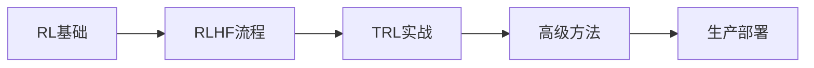

# 第5章：TRL与强化学习实战

> 深入Hugging Face TRL，掌握RLHF完整流程。

---

## 本章导读

在前面的章节中，我们学习了如何**微调**模型（LLaMA-Factory），但微调后的模型往往存在问题：
- 输出可能包含有害内容
- 不一定遵循人类指令
- 可能产生事实性错误（幻觉）

为了让模型的输出**更符合人类价值观和偏好**，我们需要**对齐（Alignment）技术**，而其中最重要的就是**RLHF（Reinforcement Learning from Human Feedback，基于人类反馈的强化学习）**。

### RLHF的成功案例

| 模型 | 对齐方法 | 效果 |
|------|---------|------|
| **InstructGPT** | RLHF (PPO) | 1.3B模型优于175B GPT-3 |
| **ChatGPT** | RLHF + 持续优化 | 全球用户破1亿 |
| **Claude** | Constitutional AI (RLAIF) | 安全性行业领先 |
| **Zephyr-7B** | DPO | 7B模型超越Llama-2-70B-chat |
| **SmolLM3-3B** | GRPO (混合推理) | SOTA推理性能 |

### Hugging Face TRL库

**TRL (Transformer Reinforcement Learning)** 是目前最成熟的LLM对齐工具库：
- ⭐ **9.6k+ stars**，Hugging Face官方维护
- 🎯 支持**10+对齐方法**（PPO、DPO、ORPO、GRPO等）
- 🚀 集成**vLLM加速**，训练效率提升5-10倍
- 📦 **开箱即用**，与Transformers/PEFT无缝集成

### 本章你将学到

1. **强化学习基础**
   - MDP（马尔可夫决策过程）
   - Policy Gradient方法
   - PPO算法详解

2. **RLHF完整流程**
   - 监督微调（SFT）
   - 奖励模型训练（RM）
   - PPO强化学习优化

3. **TRL库实战**
   - SFTTrainer：监督微调
   - RewardTrainer：奖励建模
   - PPOTrainer：在线RLHF
   - DPOTrainer：离线对齐

4. **高级对齐方法**
   - DPO：直接偏好优化
   - ORPO：比值比偏好优化
   - GRPO：群组相对策略优化
   - RLAIF：AI反馈替代人类

5. **Alignment Handbook实战**
   - Zephyr-7B复现
   - SmolLM3推理模型训练
   - 生产级对齐pipeline

### 前置知识

- 监督学习基础
- PyTorch基本用法
- Transformers库（第6部分第1章）
- LLM微调（第6部分第4章）

### 学习路径



让我们开始探索RLHF的奥秘！

---

## 第一节：强化学习基础

> 从MDP到Policy Gradient，打好RL理论基础。

### 一、强化学习核心概念

#### 1. MDP（马尔可夫决策过程）

```python
from dataclasses import dataclass
from typing import List, Dict, Tuple
import numpy as np

@dataclass
class MDPConcept:
    """MDP核心概念"""
    
    @staticmethod
    def explain():
        """解释MDP"""
        print("=== 马尔可夫决策过程（MDP） ===\n")
        
        print("MDP是强化学习的数学框架，由五元组定义：")
        print("  MDP = (S, A, P, R, γ)")
        print()
        
        components = {
            "S (State Space)": {
                "定义": "状态空间，所有可能状态的集合",
                "LLM例子": "当前生成的文本序列",
                "示例": "s_t = '写一首关于春天的'"
            },
            "A (Action Space)": {
                "定义": "动作空间，所有可能动作的集合",
                "LLM例子": "下一个token的选择",
                "示例": "a_t ∈ {'诗', '散文', '歌', ...}"
            },
            "P (Transition Probability)": {
                "定义": "状态转移概率 P(s'|s,a)",
                "LLM例子": "生成下一个token后的新状态",
                "示例": "P(s_{t+1}='诗'|s_t, a_t='诗')"
            },
            "R (Reward Function)": {
                "定义": "奖励函数 R(s, a)",
                "LLM例子": "人类对生成文本的评分",
                "示例": "R = 奖励模型打分 ∈ [-∞, +∞]"
            },
            "γ (Discount Factor)": {
                "定义": "折扣因子 γ ∈ [0, 1]",
                "LLM例子": "未来奖励的权重",
                "示例": "γ = 0.99（重视长期回报）"
            }
        }
        
        for component, info in components.items():
            print(f"{component}:")
            print(f"  定义: {info['定义']}")
            print(f"  LLM例子: {info['LLM例子']}")
            print(f"  示例: {info['示例']}")
            print()
    
    @staticmethod
    def visualize_llm_mdp():
        """可视化LLM的MDP"""
        print("=== LLM生成的MDP过程 ===\n")
        
        print("""
时刻 t=0:
  State:  [Prompt: "写一首关于春天的诗"]
  ↓
  Action: 生成token "春"
  ↓
  Reward: 0 (中间步骤无奖励)
  ↓
时刻 t=1:
  State:  [Prompt + "春"]
  ↓
  Action: 生成token "风"
  ↓
  Reward: 0
  ↓
时刻 t=2:
  State:  [Prompt + "春风"]
  ↓
  Action: 生成token "拂"
  ↓
  ...
  ↓
时刻 t=T (生成结束):
  State:  [完整诗歌]
  ↓
  Final Reward: +5.2 (奖励模型评分)
  ↓
  Episode 结束
        """)
        
        print("关键特点:")
        print("  • Sparse Reward: 只在序列结束时给奖励")
        print("  • High-dimensional State: 状态空间巨大")
        print("  • Deterministic Transition: 给定(s,a)，下一状态确定")
        print("  • Policy: π(a|s) = P(next_token|context)")

MDPConcept.explain()
MDPConcept.visualize_llm_mdp()
```

---

#### 2. 策略（Policy）与价值函数

```python
from dataclasses import dataclass
import torch
import torch.nn.functional as F

@dataclass
class PolicyAndValue:
    """策略与价值函数"""
    
    @staticmethod
    def explain_policy():
        """解释策略"""
        print("=== 策略（Policy）===\n")
        
        print("策略定义: π(a|s) - 在状态s下选择动作a的概率分布")
        print()
        
        print("在LLM中:")
        print("  π_θ(token|context) = Softmax(logits)")
        print("  其中 θ 是模型参数")
        print()
        
        print("示例:")
        print("""
Context: "写一首关于春天的"
Policy输出:
  P("诗"|context) = 0.6
  P("散文"|context) = 0.3
  P("歌"|context) = 0.1
        """)
        
        print("目标: 找到最优策略 π*，使期望累积奖励最大化")
        print("  π* = argmax E[∑ γ^t R_t]")
    
    @staticmethod
    def explain_value_function():
        """解释价值函数"""
        print("\n=== 价值函数（Value Function）===\n")
        
        print("State Value Function（状态价值）:")
        print("  V^π(s) = E_π[∑_{t=0}^∞ γ^t R_t | s_0 = s]")
        print("  含义: 从状态s开始，遵循策略π能获得的期望累积奖励")
        print()
        
        print("Action Value Function（动作价值，Q函数）:")
        print("  Q^π(s, a) = E_π[∑_{t=0}^∞ γ^t R_t | s_0 = s, a_0 = a]")
        print("  含义: 在状态s执行动作a后，遵循策略π能获得的期望累积奖励")
        print()
        
        print("优势函数（Advantage Function）:")
        print("  A^π(s, a) = Q^π(s, a) - V^π(s)")
        print("  含义: 动作a相比平均动作的优势")
        print("  作用: PPO算法的核心，用于减少方差")
    
    @staticmethod
    def demonstrate_policy():
        """演示策略计算"""
        print("\n=== 策略计算示例 ===\n")
        
        # 模拟logits
        vocab_size = 50000
        context_tokens = [123, 456, 789]  # "写一首关于春天的"
        
        # 模型输出logits（简化为3个候选token）
        logits = torch.tensor([2.5, 1.8, 0.5])  # ["诗", "散文", "歌"]
        
        # 计算策略（概率分布）
        probs = F.softmax(logits, dim=0)
        
        print("Logits: ", logits.tolist())
        print("Policy (Probabilities):")
        print(f"  P('诗'|context) = {probs[0]:.4f}")
        print(f"  P('散文'|context) = {probs[1]:.4f}")
        print(f"  P('歌'|context) = {probs[2]:.4f}")
        print()
        
        # 采样动作
        action = torch.multinomial(probs, num_samples=1)
        print(f"采样动作: {['诗', '散文', '歌'][action.item()]}")

policy_value = PolicyAndValue()
policy_value.explain_policy()
policy_value.explain_value_function()
policy_value.demonstrate_policy()
```

**输出示例：**
```
=== 策略计算示例 ===

Logits:  [2.5, 1.8, 0.5]
Policy (Probabilities):
  P('诗'|context) = 0.5761
  P('散文'|context) = 0.2942
  P('歌'|context) = 0.1297

采样动作: 诗
```

---

### 二、Policy Gradient方法

#### 1. REINFORCE算法

```python
from dataclasses import dataclass
import torch
import torch.nn as nn
import torch.optim as optim

@dataclass
class REINFORCEAlgorithm:
    """REINFORCE算法（策略梯度基础）"""
    
    @staticmethod
    def explain():
        """解释REINFORCE"""
        print("=== REINFORCE算法 ===\n")
        
        print("核心思想: 直接优化策略，使期望奖励最大化")
        print()
        
        print("目标函数:")
        print("  J(θ) = E_π[∑ γ^t R_t]")
        print()
        
        print("策略梯度定理（Policy Gradient Theorem）:")
        print("  ∇_θ J(θ) = E_π[∑_t ∇_θ log π_θ(a_t|s_t) · G_t]")
        print()
        print("其中:")
        print("  G_t = ∑_{k=t}^T γ^{k-t} R_k  (从t开始的累积奖励)")
        print()
        
        print("直观理解:")
        print("  • 如果动作a_t导致高奖励G_t，增大P(a_t|s_t)")
        print("  • 如果动作a_t导致低奖励G_t，减小P(a_t|s_t)")
        print("  • log π_θ 确保梯度计算的数值稳定性")
    
    @staticmethod
    def pseudocode():
        """伪代码"""
        print("\n=== REINFORCE伪代码 ===\n")
        
        print("""
for episode = 1 to N:
    # 采样轨迹
    trajectory = []
    state = env.reset()
    for t = 0 to T:
        action = sample from π_θ(·|state)
        next_state, reward = env.step(action)
        trajectory.append((state, action, reward))
        state = next_state
    
    # 计算累积奖励
    G = 0
    for t = T-1 to 0:
        G = reward_t + γ * G
        returns[t] = G
    
    # 更新策略
    loss = 0
    for t in trajectory:
        loss -= log π_θ(action_t|state_t) * returns[t]
    
    θ = θ - α * ∇_θ loss  # 梯度下降
        """)

class REINFORCETrainer:
    """REINFORCE训练器（简化版）"""
    
    def __init__(self, policy_model: nn.Module, lr: float = 1e-4, gamma: float = 0.99):
        self.policy_model = policy_model
        self.optimizer = optim.Adam(policy_model.parameters(), lr=lr)
        self.gamma = gamma
        self.saved_log_probs: List[torch.Tensor] = []
        self.rewards: List[float] = []
    
    def select_action(self, state: torch.Tensor) -> int:
        """选择动作"""
        logits = self.policy_model(state)
        probs = F.softmax(logits, dim=-1)
        
        # 采样动作
        action = torch.multinomial(probs, num_samples=1)
        
        # 保存log概率（用于计算梯度）
        log_prob = torch.log(probs.squeeze()[action])
        self.saved_log_probs.append(log_prob)
        
        return action.item()
    
    def update(self):
        """更新策略（一个episode结束后）"""
        # 计算累积奖励（Returns）
        returns = []
        G = 0
        for reward in reversed(self.rewards):
            G = reward + self.gamma * G
            returns.insert(0, G)
        
        returns = torch.tensor(returns)
        
        # 标准化returns（减少方差）
        returns = (returns - returns.mean()) / (returns.std() + 1e-8)
        
        # 计算loss
        policy_loss = []
        for log_prob, G in zip(self.saved_log_probs, returns):
            policy_loss.append(-log_prob * G)
        
        policy_loss = torch.stack(policy_loss).sum()
        
        # 反向传播
        self.optimizer.zero_grad()
        policy_loss.backward()
        self.optimizer.step()
        
        # 清空缓存
        self.saved_log_probs = []
        self.rewards = []
        
        return policy_loss.item()

# 演示
reinforce = REINFORCEAlgorithm()
reinforce.explain()
reinforce.pseudocode()
```

---

#### 2. REINFORCE的问题与改进

```python
@dataclass
class REINFORCEProblems:
    """REINFORCE的问题"""
    
    @staticmethod
    def explain_problems():
        """解释问题"""
        print("=== REINFORCE的三大问题 ===\n")
        
        problems = [
            {
                "问题": "1. 高方差（High Variance）",
                "原因": [
                    "累积奖励G_t受所有未来动作影响",
                    "不同轨迹的G_t差异巨大",
                    "导致梯度估计不稳定"
                ],
                "示例": """
Episode 1: G_1 = +100 (运气好)
Episode 2: G_2 = -50 (运气差)
→ 梯度估计偏差大，训练不稳定
                """,
                "解决方案": [
                    "使用Baseline减少方差",
                    "优势函数: A(s,a) = Q(s,a) - V(s)",
                    "Critic网络估计V(s)"
                ]
            },
            {
                "问题": "2. 样本效率低（Sample Inefficiency）",
                "原因": [
                    "On-policy算法，只能用当前策略的数据",
                    "每次更新后旧数据全部作废",
                    "需要大量交互采样"
                ],
                "示例": """
训练1000步需要:
  REINFORCE: 1,000,000+ 交互
  PPO: 100,000 交互（重用数据）
                """,
                "解决方案": [
                    "重要性采样（Importance Sampling）",
                    "PPO的Clipped Objective",
                    "允许多次更新同一批数据"
                ]
            },
            {
                "问题": "3. 训练不稳定（Instability）",
                "原因": [
                    "策略更新步长难以控制",
                    "大幅更新可能破坏已学到的知识",
                    "容易陷入局部最优或崩溃"
                ],
                "示例": """
更新前: π_old 表现良好
更新后: π_new 性能暴跌（catastrophic forgetting）
                """,
                "解决方案": [
                    "Trust Region约束",
                    "KL散度惩罚",
                    "PPO的Clip机制"
                ]
            }
        ]
        
        for problem in problems:
            print(f"{problem['问题']}")
            print("\n原因:")
            for reason in problem['原因']:
                print(f"  • {reason}")
            print(f"\n示例:{problem['示例']}")
            print("\n解决方案:")
            for solution in problem['解决方案']:
                print(f"  ✓ {solution}")
            print("\n" + "="*60 + "\n")

REINFORCEProblems.explain_problems()
```

---

### 三、PPO算法详解

#### 1. PPO核心思想

```python
from dataclasses import dataclass
import torch
import torch.nn.functional as F

@dataclass
class PPOConcept:
    """PPO核心概念"""
    
    @staticmethod
    def explain():
        """解释PPO"""
        print("=== PPO (Proximal Policy Optimization) ===\n")
        
        print("提出背景:")
        print("  • OpenAI 2017年提出")
        print("  • 结合TRPO的稳定性和REINFORCE的简单性")
        print("  • 成为RLHF的主流算法")
        print()
        
        print("核心思想:")
        print("  限制策略更新幅度，避免训练崩溃")
        print()
        
        print("关键创新: Clipped Surrogate Objective")
        print("""
传统策略梯度:
  L(θ) = E[log π_θ(a|s) · A(s,a)]

PPO Clipped Objective:
  r_t(θ) = π_θ(a|s) / π_old(a|s)  (重要性采样比率)
  
  L^CLIP(θ) = E[min(
    r_t(θ) · A(s,a),
    clip(r_t(θ), 1-ε, 1+ε) · A(s,a)
  )]
        """)
        
        print("\nClip机制的作用:")
        print("  • 当A(s,a) > 0（好动作）时:")
        print("    - 如果r_t > 1+ε，clip到1+ε（防止过度增大概率）")
        print("  • 当A(s,a) < 0（坏动作）时:")
        print("    - 如果r_t < 1-ε，clip到1-ε（防止过度减小概率）")
        print()
        
        print("超参数:")
        print("  • ε: clip范围，通常0.1或0.2")
        print("  • epochs: 每批数据重复训练的轮数，通常3-10")
        print("  • batch_size: 经验池大小，通常128-2048")
    
    @staticmethod
    def visualize_clip():
        """可视化Clip机制"""
        print("\n=== Clip机制可视化 ===\n")
        
        print("""
假设 ε = 0.2, A(s,a) = +1.0 (好动作)

r_t     clip(r_t)   目标值
0.5  →  0.8      →  0.8 × 1.0 = 0.8
0.8  →  0.8      →  0.8 × 1.0 = 0.8
1.0  →  1.0      →  1.0 × 1.0 = 1.0
1.2  →  1.2      →  min(1.2, 1.2) = 1.2 ✓
1.5  →  1.2      →  min(1.5, 1.2) = 1.2 ✗ (被clip)
2.0  →  1.2      →  min(2.0, 1.2) = 1.2 ✗ (被clip)

→ r_t超过1.2时被clip，防止概率过度增大
        """)
        
        print("对比传统策略梯度:")
        print("  传统: L = r_t × A = 2.0 × 1.0 = 2.0 (过大！)")
        print("  PPO: L = 1.2 × 1.0 = 1.2 (被限制)")

class PPOTrainer:
    """PPO训练器（简化版）"""
    
    def __init__(
        self,
        policy_model: nn.Module,
        value_model: nn.Module,
        lr: float = 3e-4,
        gamma: float = 0.99,
        clip_epsilon: float = 0.2,
        ppo_epochs: int = 4
    ):
        self.policy_model = policy_model
        self.value_model = value_model
        self.optimizer = optim.Adam(
            list(policy_model.parameters()) + list(value_model.parameters()),
            lr=lr
        )
        self.gamma = gamma
        self.clip_epsilon = clip_epsilon
        self.ppo_epochs = ppo_epochs
    
    def compute_advantages(
        self,
        rewards: torch.Tensor,
        values: torch.Tensor,
        dones: torch.Tensor
    ) -> torch.Tensor:
        """计算优势函数（GAE）"""
        advantages = torch.zeros_like(rewards)
        last_advantage = 0
        
        for t in reversed(range(len(rewards))):
            if t == len(rewards) - 1:
                next_value = 0
            else:
                next_value = values[t + 1]
            
            delta = rewards[t] + self.gamma * next_value * (1 - dones[t]) - values[t]
            advantages[t] = delta + self.gamma * 0.95 * (1 - dones[t]) * last_advantage
            last_advantage = advantages[t]
        
        return advantages
    
    def ppo_update(
        self,
        states: torch.Tensor,
        actions: torch.Tensor,
        old_log_probs: torch.Tensor,
        returns: torch.Tensor,
        advantages: torch.Tensor
    ) -> Dict[str, float]:
        """PPO更新"""
        
        total_policy_loss = 0
        total_value_loss = 0
        
        # 多轮更新
        for _ in range(self.ppo_epochs):
            # 前向传播
            logits = self.policy_model(states)
            probs = F.softmax(logits, dim=-1)
            dist = torch.distributions.Categorical(probs)
            new_log_probs = dist.log_prob(actions)
            
            values = self.value_model(states).squeeze()
            
            # 计算ratio
            ratio = torch.exp(new_log_probs - old_log_probs)
            
            # Clipped Surrogate Objective
            surr1 = ratio * advantages
            surr2 = torch.clamp(ratio, 1 - self.clip_epsilon, 1 + self.clip_epsilon) * advantages
            policy_loss = -torch.min(surr1, surr2).mean()
            
            # Value Loss
            value_loss = F.mse_loss(values, returns)
            
            # 总Loss
            loss = policy_loss + 0.5 * value_loss
            
            # 反向传播
            self.optimizer.zero_grad()
            loss.backward()
            torch.nn.utils.clip_grad_norm_(self.policy_model.parameters(), 0.5)
            self.optimizer.step()
            
            total_policy_loss += policy_loss.item()
            total_value_loss += value_loss.item()
        
        return {
            "policy_loss": total_policy_loss / self.ppo_epochs,
            "value_loss": total_value_loss / self.ppo_epochs
        }

ppo = PPOConcept()
ppo.explain()
ppo.visualize_clip()
```

---


#### 2. PPO vs. 其他算法

```python
@dataclass
class PPOComparison:
    """PPO对比其他算法"""
    
    @staticmethod
    def compare():
        """对比算法"""
        print("=== RL算法对比 ===\n")
        
        print("""
┌──────────────┬────────────┬──────────┬──────────┬────────────┐
│   算法       │ 样本效率   │ 稳定性   │ 实现难度 │  RLHF应用  │
├──────────────┼────────────┼──────────┼──────────┼────────────┤
│ REINFORCE    │    低      │   低     │   简单   │   很少     │
│ A2C/A3C      │    中      │   中     │   中等   │   较少     │
│ TRPO         │    中      │   高     │   复杂   │   早期     │
│ PPO          │    高      │   高     │   简单   │   主流 ✓   │
│ SAC/TD3      │    高      │   高     │   复杂   │   不适用   │
└──────────────┴────────────┴──────────┴──────────┴────────────┘
        """)
        
        print("PPO的优势:")
        print("  ✓ 稳定性高（Clip机制）")
        print("  ✓ 样本效率高（多轮更新）")
        print("  ✓ 实现简单（相比TRPO）")
        print("  ✓ 超参数鲁棒")
        print()
        
        print("PPO的劣势:")
        print("  ✗ 训练速度慢（相比DPO）")
        print("  ✗ 需要奖励模型（额外训练成本）")
        print("  ✗ 超参数敏感（虽然相对鲁棒）")

PPOComparison.compare()
```

---

## 第二节：RLHF完整流程

> 从SFT到PPO，构建完整的对齐pipeline。

### 一、RLHF三阶段流程

#### 1. 流程概览

```python
from dataclasses import dataclass
from typing import List

@dataclass
class RLHFPipeline:
    """RLHF完整流程"""
    
    @staticmethod
    def explain():
        """解释RLHF流程"""
        print("=== RLHF三阶段流程 ===\n")
        
        print("""
┌─────────────────────────────────────────────────┐
│  阶段1: 监督微调 (SFT)                          │
│  目标: 让模型学会基本的对话能力                  │
│  数据: 高质量人工标注的指令-响应对               │
│  输出: SFT模型（π_SFT）                         │
└─────────────────────────────────────────────────┘
                      ↓
┌─────────────────────────────────────────────────┐
│  阶段2: 奖励模型训练 (RM)                       │
│  目标: 学习人类偏好                             │
│  数据: 偏好对比数据（好回答 vs. 坏回答）        │
│  输出: 奖励模型（RM）                           │
└─────────────────────────────────────────────────┘
                      ↓
┌─────────────────────────────────────────────────┐
│  阶段3: PPO强化学习 (RL)                        │
│  目标: 优化策略，最大化奖励                      │
│  数据: Prompt池 + RM反馈                        │
│  输出: 对齐模型（π_RL）                         │
└─────────────────────────────────────────────────┘
        """)
        
        print("InstructGPT论文数据:")
        print("  • SFT数据: 13,000条高质量指令")
        print("  • RM数据: 33,000个偏好对比")
        print("  • PPO数据: 31,000个prompt")
        print("  • 结果: 1.3B InstructGPT > 175B GPT-3")
    
    @staticmethod
    def data_requirements():
        """数据需求"""
        print("\n=== 各阶段数据需求 ===\n")
        
        stages = [
            {
                "阶段": "SFT",
                "数据格式": """
{
  "prompt": "解释什么是量子计算",
  "response": "量子计算是利用量子力学原理..."
}
                """,
                "数据量": "10K - 100K",
                "质量要求": "高（需人工编写）",
                "成本": "$$$$"
            },
            {
                "阶段": "RM",
                "数据格式": """
{
  "prompt": "写一首诗",
  "chosen": "春风拂面暖如诗...",  # 好
  "rejected": "春天到了。"  # 差
}
                """,
                "数据量": "10K - 100K",
                "质量要求": "中（需人工排序）",
                "成本": "$$$"
            },
            {
                "阶段": "PPO",
                "数据格式": """
{
  "prompt": "给我讲个笑话"
}
# 模型自己生成response，RM打分
                """,
                "数据量": "10K - 100K",
                "质量要求": "低（只需prompt）",
                "成本": "$"
            }
        ]
        
        for stage in stages:
            print(f"## {stage['阶段']}")
            print(f"数据格式:\n{stage['数据格式']}")
            print(f"数据量: {stage['数据量']}")
            print(f"质量要求: {stage['质量要求']}")
            print(f"成本: {stage['成本']}")
            print()

pipeline = RLHFPipeline()
pipeline.explain()
pipeline.data_requirements()
```

---

### 二、阶段1：监督微调（SFT）

#### 1. SFT原理

```python
from dataclasses import dataclass

@dataclass
class SFTStage:
    """SFT阶段"""
    
    @staticmethod
    def explain():
        """解释SFT"""
        print("=== 监督微调（SFT）===\n")
        
        print("目标:")
        print("  将预训练模型（如Llama-2-7B）微调为对话模型")
        print()
        
        print("训练目标:")
        print("  最大化给定prompt下，生成正确response的概率")
        print("  Loss = -log P(response | prompt)")
        print()
        print("  具体:")
        print("  Loss = -∑_t log P(token_t | prompt, token_{<t})")
        print()
        
        print("与预训练的区别:")
        print("""
预训练:
  输入: "今天天气很好"
  目标: 预测下一个token "，"
  
SFT:
  输入: [Instruction] "写一首诗"
  目标: 生成完整诗歌 "春风拂面暖如诗..."
        """)
        
        print("关键点:")
        print("  • 使用对话模板（如Llama-2格式）")
        print("  • 只计算response部分的loss")
        print("  • 学习率较小（1e-5 ~ 5e-5）")
        print("  • 训练轮数较少（1-3 epochs）")

SFTStage.explain()
```

---

#### 2. TRL SFTTrainer实战

```python
"""
TRL SFTTrainer完整示例
"""

from datasets import load_dataset
from transformers import AutoTokenizer, AutoModelForCausalLM, TrainingArguments
from trl import SFTConfig, SFTTrainer
from peft import LoraConfig

def train_sft_model():
    """训练SFT模型"""
    
    # 1. 加载模型和分词器
    model_name = "meta-llama/Llama-2-7b-hf"
    tokenizer = AutoTokenizer.from_pretrained(model_name)
    tokenizer.pad_token = tokenizer.eos_token
    
    model = AutoModelForCausalLM.from_pretrained(
        model_name,
        torch_dtype="auto",
        device_map="auto"
    )
    
    # 2. 加载数据集
    dataset = load_dataset("timdettmers/openassistant-guanaco")
    
    # 数据格式示例
    print("=== 数据示例 ===")
    print(dataset['train'][0])
    # {
    #   'text': '### Human: 你好\n### Assistant: 你好！有什么我可以帮助你的吗？'
    # }
    
    # 3. 配置LoRA（可选，节省显存）
    peft_config = LoraConfig(
        r=16,
        lora_alpha=32,
        lora_dropout=0.05,
        target_modules=["q_proj", "v_proj"],
        bias="none",
        task_type="CAUSAL_LM"
    )
    
    # 4. 训练配置
    training_args = SFTConfig(
        output_dir="./output/llama2-7b-sft",
        num_train_epochs=3,
        per_device_train_batch_size=4,
        gradient_accumulation_steps=4,
        learning_rate=2e-5,
        lr_scheduler_type="cosine",
        warmup_ratio=0.1,
        logging_steps=10,
        save_steps=500,
        save_total_limit=3,
        fp16=True,
        
        # SFT特定参数
        max_seq_length=2048,
        dataset_text_field="text",  # 数据集中的文本字段
        packing=False,  # 不打包多个样本到一个序列
    )
    
    # 5. 创建Trainer
    trainer = SFTTrainer(
        model=model,
        args=training_args,
        train_dataset=dataset['train'],
        tokenizer=tokenizer,
        peft_config=peft_config,
    )
    
    # 6. 开始训练
    print("\n🚀 开始SFT训练...")
    trainer.train()
    
    # 7. 保存模型
    trainer.save_model("./output/llama2-7b-sft-final")
    print("✅ SFT训练完成！")

# 演示配置
def demonstrate_sft_config():
    """演示SFT配置"""
    print("=== SFT训练配置示例 ===\n")
    
    print("""
from trl import SFTConfig, SFTTrainer

# 最小配置
config = SFTConfig(
    output_dir="./output",
    max_seq_length=2048,
    dataset_text_field="text"
)

# 推荐配置（7B模型）
config = SFTConfig(
    output_dir="./output/llama2-7b-sft",
    
    # 训练超参
    num_train_epochs=3,
    per_device_train_batch_size=4,
    gradient_accumulation_steps=4,  # 有效batch=16
    learning_rate=2e-5,
    lr_scheduler_type="cosine",
    warmup_ratio=0.1,
    
    # 优化
    fp16=True,  # 混合精度
    gradient_checkpointing=True,  # 节省显存
    
    # SFT参数
    max_seq_length=2048,
    dataset_text_field="text",
    packing=False,  # 不建议开启（可能破坏对话结构）
    
    # 日志与保存
    logging_steps=10,
    save_steps=500,
    save_total_limit=3,
    report_to="tensorboard"
)
    """)

demonstrate_sft_config()
```

---

### 三、阶段2：奖励模型训练（RM）

#### 1. RM原理

```python
from dataclasses import dataclass
import torch
import torch.nn as nn

@dataclass
class RewardModelStage:
    """奖励模型阶段"""
    
    @staticmethod
    def explain():
        """解释RM"""
        print("=== 奖励模型（Reward Model）===\n")
        
        print("目标:")
        print("  学习人类偏好，对模型输出打分")
        print()
        
        print("架构:")
        print("  基座模型 + 线性层（输出标量分数）")
        print("""
[Input Text] → LLM Encoder → [CLS] Embedding
                                    ↓
                              Linear Layer
                                    ↓
                              Reward Score ∈ R
        """)
        
        print("\n训练目标:")
        print("  给定prompt，让chosen响应的分数 > rejected响应的分数")
        print()
        print("  Loss = -log σ(r_chosen - r_rejected)")
        print("  其中 σ 是sigmoid函数")
        print()
        
        print("直观理解:")
        print("  • r_chosen = 5.2,  r_rejected = 2.1")
        print("  • r_chosen - r_rejected = 3.1 (大)")
        print("  • σ(3.1) ≈ 0.96 (接近1)")
        print("  • -log(0.96) ≈ 0.04 (loss很小，说明模型学得好)")

class RewardModel(nn.Module):
    """奖励模型"""
    
    def __init__(self, base_model: nn.Module, hidden_size: int):
        super().__init__()
        self.base_model = base_model
        self.reward_head = nn.Linear(hidden_size, 1)  # 输出标量
    
    def forward(self, input_ids: torch.Tensor, attention_mask: torch.Tensor) -> torch.Tensor:
        """前向传播"""
        # 获取base model的输出
        outputs = self.base_model(
            input_ids=input_ids,
            attention_mask=attention_mask,
            output_hidden_states=True
        )
        
        # 获取最后一层的hidden state
        hidden_states = outputs.hidden_states[-1]  # [batch, seq_len, hidden_size]
        
        # 取序列最后一个token的表示（或[CLS]）
        last_hidden = hidden_states[:, -1, :]  # [batch, hidden_size]
        
        # 通过reward head得到分数
        reward = self.reward_head(last_hidden)  # [batch, 1]
        
        return reward.squeeze(-1)  # [batch]

RewardModelStage.explain()
```

---

#### 2. TRL RewardTrainer实战

```python
"""
TRL RewardTrainer完整示例
"""

from datasets import load_dataset
from transformers import AutoTokenizer, AutoModelForSequenceClassification
from trl import RewardConfig, RewardTrainer

def train_reward_model():
    """训练奖励模型"""
    
    # 1. 加载SFT模型作为base
    model_name = "./output/llama2-7b-sft-final"
    tokenizer = AutoTokenizer.from_pretrained(model_name)
    
    # 使用AutoModelForSequenceClassification，自动添加分类头
    model = AutoModelForSequenceClassification.from_pretrained(
        model_name,
        num_labels=1,  # 输出标量
        torch_dtype="auto",
        device_map="auto"
    )
    
    # 2. 加载偏好数据集
    dataset = load_dataset("Anthropic/hh-rlhf")
    
    # 数据格式示例
    print("=== 偏好数据示例 ===")
    print(dataset['train'][0])
    # {
    #   'chosen': 'Human: 你好\nAssistant: 你好！有什么我可以帮助你的吗？',
    #   'rejected': 'Human: 你好\nAssistant: 嗯。'
    # }
    
    # 3. 训练配置
    training_args = RewardConfig(
        output_dir="./output/llama2-7b-rm",
        num_train_epochs=1,  # RM通常只训练1个epoch
        per_device_train_batch_size=4,
        gradient_accumulation_steps=4,
        learning_rate=1e-5,  # RM学习率更小
        lr_scheduler_type="cosine",
        logging_steps=10,
        save_steps=500,
        fp16=True,
        
        # RM特定参数
        max_length=2048,
        remove_unused_columns=False,
    )
    
    # 4. 创建Trainer
    trainer = RewardTrainer(
        model=model,
        args=training_args,
        train_dataset=dataset['train'],
        tokenizer=tokenizer,
    )
    
    # 5. 开始训练
    print("\n🚀 开始RM训练...")
    trainer.train()
    
    # 6. 保存模型
    trainer.save_model("./output/llama2-7b-rm-final")
    print("✅ RM训练完成！")

# 测试奖励模型
def test_reward_model():
    """测试RM打分"""
    print("\n=== 测试奖励模型 ===\n")
    
    from transformers import pipeline
    
    # 加载RM
    rm = pipeline(
        "sentiment-analysis",  # 复用classification pipeline
        model="./output/llama2-7b-rm-final",
        device=0
    )
    
    # 测试样本
    texts = [
        "Human: 你好\nAssistant: 你好！很高兴见到你，有什么我可以帮助的吗？",  # 好回答
        "Human: 你好\nAssistant: 嗯。",  # 差回答
        "Human: 写一首诗\nAssistant: 春风拂面暖如诗，绿柳依依舞新枝。",  # 好回答
        "Human: 写一首诗\nAssistant: 春天到了。",  # 差回答
    ]
    
    for i, text in enumerate(texts, 1):
        score = rm(text)[0]['score']
        print(f"样本{i}: score={score:.4f}")
        print(f"文本: {text[:50]}...")
        print()

demonstrate_reward_model_training = """
=== 奖励模型训练要点 ===

1. 数据质量至关重要:
   • chosen和rejected的差异要明显
   • 避免模糊的偏好对（都好或都差）
   • 数据多样性（不同任务类型）

2. 训练技巧:
   • 学习率比SFT小（1e-5 vs. 2e-5）
   • 只训练1个epoch（避免过拟合）
   • 可以freeze base model，只训练reward head

3. 评估方法:
   • Accuracy: P(r_chosen > r_rejected)
   • 期望 > 70%

4. 常见问题:
   • Reward Hacking: 模型学到exploit RM的漏洞
   • 解决: KL散度惩罚（后面PPO会讲）
"""

print(demonstrate_reward_model_training)
```

---


### 四、阶段3：PPO强化学习

#### 1. PPO训练流程

```python
from dataclasses import dataclass
from typing import List, Dict

@dataclass
class PPOStage:
    """PPO阶段"""
    
    @staticmethod
    def explain():
        """解释PPO训练"""
        print("=== PPO强化学习阶段 ===\n")
        
        print("训练循环:")
        print("""
for iteration in range(num_iterations):
    # 1. 采样阶段 (Rollout)
    prompts = sample_prompts(batch_size)
    for prompt in prompts:
        # 使用当前策略生成回答
        response = π_θ.generate(prompt)
        
        # 用奖励模型打分
        reward = RM(prompt + response)
        
        # 保存经验
        experience_buffer.add(prompt, response, reward)
    
    # 2. 更新阶段 (Update)
    for epoch in range(ppo_epochs):
        batch = experience_buffer.sample()
        
        # 计算优势函数
        advantages = compute_advantages(batch)
        
        # PPO更新
        policy_loss = ppo_clip_loss(batch, advantages)
        value_loss = mse_loss(values, returns)
        
        # KL散度惩罚（防止偏离太远）
        kl_penalty = KL(π_θ || π_SFT)
        
        loss = policy_loss + 0.5 * value_loss + β * kl_penalty
        
        optimizer.step()
        """)
        
        print("\n关键点:")
        print("  • KL散度惩罚: 防止偏离SFT模型太远")
        print("  • Value Network: 估计状态价值，减少方差")
        print("  • Reward Normalization: 标准化奖励，稳定训练")
    
    @staticmethod
    def kl_penalty_explained():
        """解释KL散度惩罚"""
        print("\n=== KL散度惩罚 ===\n")
        
        print("为什么需要KL惩罚？")
        print("  问题: 模型可能学会exploit奖励模型的漏洞")
        print("  示例: 生成重复文本、无意义符号等获得高分")
        print()
        
        print("KL散度定义:")
        print("  KL(π_θ || π_SFT) = E_x[log π_θ(x) - log π_SFT(x)]")
        print()
        print("  含义: 测量当前策略π_θ与SFT策略π_SFT的差异")
        print()
        
        print("目标函数变为:")
        print("  J(θ) = E[reward] - β * KL(π_θ || π_SFT)")
        print()
        print("  β: KL惩罚系数，通常0.01-0.1")
        print("  作用: 限制策略更新幅度，保持生成质量")
        print()
        
        print("效果对比:")
        print("""
无KL惩罚:
  Prompt: "写一首诗"
  Response: "诗诗诗诗诗诗诗..."  (reward=10，但无意义)

有KL惩罚:
  Prompt: "写一首诗"
  Response: "春风拂面暖如诗..."  (reward=8，但合理)
        """)

ppo_stage = PPOStage()
ppo_stage.explain()
ppo_stage.kl_penalty_explained()
```

---

#### 2. TRL PPOTrainer实战

```python
"""
TRL PPOTrainer完整示例
"""

from datasets import load_dataset
from transformers import AutoTokenizer, AutoModelForCausalLM
from trl import PPOConfig, PPOTrainer, AutoModelForCausalLMWithValueHead
from trl.core import LengthSampler

def train_ppo_model():
    """训练PPO模型"""
    
    # 1. 加载SFT模型（带value head）
    model = AutoModelForCausalLMWithValueHead.from_pretrained(
        "./output/llama2-7b-sft-final"
    )
    
    # 加载参考模型（SFT模型，用于计算KL）
    ref_model = AutoModelForCausalLMWithValueHead.from_pretrained(
        "./output/llama2-7b-sft-final"
    )
    
    tokenizer = AutoTokenizer.from_pretrained("./output/llama2-7b-sft-final")
    tokenizer.pad_token = tokenizer.eos_token
    
    # 2. 加载奖励模型
    from transformers import pipeline
    reward_model = pipeline(
        "sentiment-analysis",
        model="./output/llama2-7b-rm-final",
        device=0
    )
    
    # 3. 加载prompt数据集
    dataset = load_dataset("openai/summarize_from_feedback", "comparisons")
    
    def build_dataset(tokenizer, dataset):
        """构建prompt数据集"""
        prompts = []
        for sample in dataset['train']:
            prompt = f"Summarize: {sample['info']['post']}\n\nSummary:"
            prompts.append(prompt)
        return prompts
    
    prompts = build_dataset(tokenizer, dataset)
    
    # 4. PPO配置
    ppo_config = PPOConfig(
        model_name="llama2-7b-ppo",
        learning_rate=1.41e-5,
        batch_size=128,
        mini_batch_size=32,
        gradient_accumulation_steps=1,
        
        # PPO超参
        ppo_epochs=4,
        init_kl_coef=0.2,  # KL惩罚系数
        target_kl=6.0,  # 目标KL（自适应调整）
        cliprange=0.2,  # Clip范围
        vf_coef=0.1,  # Value loss权重
        
        # 生成参数
        max_new_tokens=128,
        temperature=1.0,
        top_k=0,
        top_p=1.0,
        
        # 其他
        log_with="tensorboard",
        seed=0,
    )
    
    # 5. 创建PPOTrainer
    ppo_trainer = PPOTrainer(
        config=ppo_config,
        model=model,
        ref_model=ref_model,
        tokenizer=tokenizer,
        dataset=prompts,
    )
    
    # 6. 生成配置
    generation_kwargs = {
        "min_length": -1,
        "top_k": 0.0,
        "top_p": 1.0,
        "do_sample": True,
        "pad_token_id": tokenizer.eos_token_id,
        "max_new_tokens": 128,
    }
    
    # 7. 训练循环
    print("\n🚀 开始PPO训练...\n")
    
    for epoch in range(3):
        for batch_idx, batch in enumerate(ppo_trainer.dataloader):
            # 7.1 Tokenize prompts
            query_tensors = [tokenizer.encode(txt, return_tensors="pt")[0] for txt in batch]
            
            # 7.2 生成responses
            response_tensors = []
            for query in query_tensors:
                response = ppo_trainer.generate(query, **generation_kwargs)
                response_tensors.append(response.squeeze())
            
            # 7.3 Decode responses
            batch_texts = [tokenizer.decode(r.squeeze()) for r in response_tensors]
            
            # 7.4 计算rewards
            rewards = []
            for prompt, response in zip(batch, batch_texts):
                # 用RM打分
                reward_output = reward_model(prompt + response)[0]
                reward = torch.tensor(reward_output['score'])
                rewards.append(reward)
            
            # 7.5 PPO更新
            stats = ppo_trainer.step(query_tensors, response_tensors, rewards)
            
            # 7.6 日志
            if batch_idx % 10 == 0:
                print(f"Epoch {epoch}, Batch {batch_idx}")
                print(f"  Mean reward: {torch.stack(rewards).mean():.4f}")
                print(f"  Policy loss: {stats['ppo/loss/policy']:.4f}")
                print(f"  Value loss: {stats['ppo/loss/value']:.4f}")
                print(f"  KL divergence: {stats['ppo/mean_non_score_reward']:.4f}")
                print()
    
    # 8. 保存模型
    ppo_trainer.save_pretrained("./output/llama2-7b-ppo-final")
    print("✅ PPO训练完成！")

# 演示PPO配置
def demonstrate_ppo_config():
    """演示PPO配置"""
    print("=== PPO训练配置详解 ===\n")
    
    print("""
from trl import PPOConfig

config = PPOConfig(
    # 基础配置
    model_name="my-ppo-model",
    learning_rate=1.41e-5,  # 学习率（比SFT更小）
    
    # Batch配置
    batch_size=128,  # 每次采样的prompt数
    mini_batch_size=32,  # 每次更新的batch大小
    gradient_accumulation_steps=1,
    
    # PPO超参数（核心！）
    ppo_epochs=4,  # 每批数据更新的轮数
    init_kl_coef=0.2,  # 初始KL惩罚系数
    target_kl=6.0,  # 目标KL（自适应调整init_kl_coef）
    cliprange=0.2,  # PPO clip范围（ε）
    vf_coef=0.1,  # Value loss的权重
    cliprange_value=0.2,  # Value loss的clip范围
    
    # 生成参数
    max_new_tokens=128,  # 最大生成长度
    temperature=1.0,  # 采样温度
    top_k=0,  # Top-k采样（0表示不用）
    top_p=1.0,  # Top-p采样（1.0表示不用）
    
    # 优化器
    adap_kl_ctrl=True,  # 自适应KL控制
    gamma=1.0,  # 折扣因子
    lam=0.95,  # GAE的lambda
    
    # 其他
    log_with="tensorboard",
    tracker_project_name="llama2-ppo",
    seed=0
)
    """)
    
    print("\n关键超参数说明:\n")
    
    params = [
        ("init_kl_coef", "0.01-0.2", "KL惩罚系数，越大越保守"),
        ("target_kl", "1.0-10.0", "目标KL，超过会增大init_kl_coef"),
        ("cliprange", "0.1-0.3", "Clip范围，通常0.2"),
        ("ppo_epochs", "3-10", "重复更新次数，越多样本效率越高"),
        ("vf_coef", "0.1-1.0", "Value loss权重"),
        ("learning_rate", "1e-6 - 1e-4", "学习率，比SFT小一个数量级"),
    ]
    
    for param, range_val, desc in params:
        print(f"  • {param}: {range_val}")
        print(f"    {desc}")
        print()

demonstrate_ppo_config()
```

---

### 五、RLHF常见问题

```python
from dataclasses import dataclass

@dataclass
class RLHFProblems:
    """RLHF常见问题"""
    
    @staticmethod
    def explain():
        """解释常见问题"""
        print("=== RLHF训练的三大挑战 ===\n")
        
        problems = [
            {
                "问题": "1. Reward Hacking（奖励欺骗）",
                "描述": "模型学会exploit奖励模型的漏洞，而非真正对齐",
                "示例": [
                    "生成重复文本获得高分",
                    "生成极长但空洞的回答",
                    "利用RM训练数据的分布偏差"
                ],
                "解决方案": [
                    "✓ KL散度惩罚（β=0.01-0.2）",
                    "✓ 持续更新RM（避免过时）",
                    "✓ 多个RM集成",
                    "✓ 人工抽查生成结果"
                ]
            },
            {
                "问题": "2. 训练不稳定",
                "描述": "PPO训练容易崩溃或性能剧烈波动",
                "示例": [
                    "Reward突然暴跌",
                    "生成质量严重下降",
                    "KL散度爆炸"
                ],
                "解决方案": [
                    "✓ 降低学习率（1e-6）",
                    "✓ 增大KL惩罚（β=0.2）",
                    "✓ 减小ppo_epochs（3-4）",
                    "✓ Gradient clipping",
                    "✓ 保存checkpoint，随时回滚"
                ]
            },
            {
                "问题": "3. 计算成本高",
                "描述": "PPO需要4个模型（Policy、Value、RM、Ref），显存和时间开销大",
                "示例": [
                    "7B模型PPO: 需要4×A100，训练数天",
                    "70B模型PPO: 需要32+GPU，成本极高"
                ],
                "解决方案": [
                    "✓ 使用vLLM加速生成（5-10倍）",
                    "✓ 共享encoder（Policy和Value）",
                    "✓ LoRA微调（减少参数）",
                    "✓ 考虑DPO等离线方法（无需在线采样）"
                ]
            }
        ]
        
        for problem in problems:
            print(f"{problem['问题']}")
            print(f"{problem['描述']}\n")
            print("示例:")
            for example in problem['示例']:
                print(f"  • {example}")
            print("\n解决方案:")
            for solution in problem['解决方案']:
                print(f"  {solution}")
            print("\n" + "="*60 + "\n")

RLHFProblems.explain()
```

---

## 第三节：高级对齐方法

> 从DPO到GRPO，探索RLHF的替代方案。

### 一、DPO：直接偏好优化

#### 1. DPO原理

```python
from dataclasses import dataclass
import torch
import torch.nn.functional as F

@dataclass
class DPOMethod:
    """DPO方法"""
    
    @staticmethod
    def explain():
        """解释DPO"""
        print("=== DPO (Direct Preference Optimization) ===\n")
        
        print("提出动机:")
        print("  PPO复杂且不稳定，能否直接从偏好数据学习？")
        print()
        
        print("核心insight:")
        print("  将RLHF的奖励模型隐式地编码到策略中")
        print("  无需显式训练RM，无需在线采样")
        print()
        
        print("PPO流程:")
        print("  SFT → RM训练 → PPO采样+更新")
        print()
        
        print("DPO流程:")
        print("  SFT → DPO（直接从偏好数据学习）")
        print()
        
        print("数学推导（简化）:")
        print("""
RLHF目标:
  π* = argmax E[r(x,y)] - β KL(π || π_SFT)

Bradley-Terry模型（偏好概率）:
  P(y_w > y_l | x) = σ(r(x,y_w) - r(x,y_l))

DPO重参数化:
  r(x,y) = β log(π(y|x) / π_SFT(y|x)) + Z(x)

代入得DPO loss:
  L_DPO = -E[log σ(
    β log(π(y_w|x) / π_SFT(y_w|x)) 
    - β log(π(y_l|x) / π_SFT(y_l|x))
  )]
        """)
        
        print("\n直观理解:")
        print("  • 增大P(chosen|prompt) / P(chosen|prompt)_SFT的比值")
        print("  • 减小P(rejected|prompt) / P(rejected|prompt)_SFT的比值")
        print("  • β控制偏离SFT的程度")
    
    @staticmethod
    def compare_with_ppo():
        """对比PPO和DPO"""
        print("\n=== PPO vs. DPO对比 ===\n")
        
        print("""
┌──────────────┬─────────────────┬─────────────────┐
│    维度      │      PPO        │      DPO        │
├──────────────┼─────────────────┼─────────────────┤
│ 训练流程     │ SFT→RM→PPO      │ SFT→DPO         │
│ 需要RM       │ ✓ 需要          │ ✗ 不需要        │
│ 在线采样     │ ✓ 需要          │ ✗ 不需要        │
│ 训练稳定性   │ 中（易崩溃）    │ 高（简单）      │
│ 计算成本     │ 高（4个模型）   │ 低（2个模型）   │
│ 样本效率     │ 中              │ 高              │
│ 性能上限     │ 高              │ 中（略低于PPO） │
│ 适用场景     │ 大规模对齐      │ 快速实验        │
└──────────────┴─────────────────┴─────────────────┘
        """)
        
        print("结论:")
        print("  • DPO更简单、更稳定、成本更低")
        print("  • PPO性能上限略高，但难调")
        print("  • 工业界趋势: DPO成为主流（Zephyr、SmolLM等）")

dpo = DPOMethod()
dpo.explain()
dpo.compare_with_ppo()
```

---

#### 2. TRL DPOTrainer实战

```python
"""
TRL DPOTrainer完整示例
"""

from datasets import load_dataset
from transformers import AutoTokenizer, AutoModelForCausalLM
from trl import DPOConfig, DPOTrainer

def train_dpo_model():
    """训练DPO模型"""
    
    # 1. 加载SFT模型
    model = AutoModelForCausalLM.from_pretrained(
        "./output/llama2-7b-sft-final",
        torch_dtype="auto",
        device_map="auto"
    )
    
    # 加载参考模型（SFT模型的副本）
    ref_model = AutoModelForCausalLM.from_pretrained(
        "./output/llama2-7b-sft-final",
        torch_dtype="auto",
        device_map="auto"
    )
    
    tokenizer = AutoTokenizer.from_pretrained("./output/llama2-7b-sft-final")
    tokenizer.pad_token = tokenizer.eos_token
    
    # 2. 加载偏好数据集
    dataset = load_dataset("Anthropic/hh-rlhf")
    
    # 数据格式:
    # {
    #   'chosen': 'Human: ...\nAssistant: ...',
    #   'rejected': 'Human: ...\nAssistant: ...'
    # }
    
    # 3. DPO配置
    training_args = DPOConfig(
        output_dir="./output/llama2-7b-dpo",
        num_train_epochs=1,
        per_device_train_batch_size=4,
        gradient_accumulation_steps=4,
        learning_rate=5e-7,  # DPO学习率极小
        lr_scheduler_type="cosine",
        warmup_ratio=0.1,
        
        # DPO特定参数
        beta=0.1,  # KL惩罚系数
        loss_type="sigmoid",  # 或 "ipo", "kto"
        max_length=2048,
        max_prompt_length=1024,
        
        # 优化
        fp16=True,
        gradient_checkpointing=True,
        
        # 日志
        logging_steps=10,
        save_steps=500,
        report_to="tensorboard"
    )
    
    # 4. 创建DPOTrainer
    dpo_trainer = DPOTrainer(
        model=model,
        ref_model=ref_model,
        args=training_args,
        train_dataset=dataset['train'],
        tokenizer=tokenizer,
    )
    
    # 5. 开始训练
    print("\n🚀 开始DPO训练...")
    dpo_trainer.train()
    
    # 6. 保存模型
    dpo_trainer.save_model("./output/llama2-7b-dpo-final")
    print("✅ DPO训练完成！")

# DPO配置详解
def demonstrate_dpo_config():
    """演示DPO配置"""
    print("\n=== DPO配置详解 ===\n")
    
    print("""
from trl import DPOConfig, DPOTrainer

config = DPOConfig(
    output_dir="./output/llama2-dpo",
    
    # 训练参数
    num_train_epochs=1,  # DPO通常1个epoch足够
    per_device_train_batch_size=4,
    gradient_accumulation_steps=4,
    learning_rate=5e-7,  # 极小的学习率！
    lr_scheduler_type="cosine",
    
    # DPO核心参数
    beta=0.1,  # KL惩罚系数（0.01-0.5）
        # 越大越保守，越接近SFT
    
    loss_type="sigmoid",  # Loss类型
        # "sigmoid": 标准DPO
        # "ipo": Identity Preference Optimization
        # "kto": Kahneman-Tversky Optimization
    
    # 序列长度
    max_length=2048,  # chosen+rejected的最大长度
    max_prompt_length=1024,  # prompt的最大长度
    
    # 优化
    fp16=True,
    gradient_checkpointing=True,
    
    # Reference model（可选）
    # 如果不提供ref_model，会自动从model复制
)
    """)
    
    print("\n关键超参数:\n")
    
    tips = [
        ("beta", "0.01-0.5", "0.1是常用值，小模型用0.01-0.05"),
        ("learning_rate", "1e-7 - 1e-5", "比SFT小2-3个数量级"),
        ("num_train_epochs", "1-3", "1个epoch通常足够"),
    ]
    
    for param, range_val, tip in tips:
        print(f"  • {param}: {range_val}")
        print(f"    提示: {tip}")
        print()

demonstrate_dpo_config()
```

---

### 三、ORPO：Odds Ratio Preference Optimization

> 无需Reference Model的偏好优化。

DPO虽然比PPO简单，但仍需要加载两个模型（policy model + reference model），内存占用翻倍。

**ORPO**（Odds Ratio Preference Optimization）进一步简化，**只需要单个模型**即可完成偏好对齐。

---

#### 1. ORPO核心思想

**关键创新**：将SFT和对齐合并为一个阶段。

传统流程：
```
SFT（学习生成） → DPO（学习偏好）
     ↓                    ↓
  需要模型1           需要模型1+模型2
```

ORPO流程：
```
ORPO（同时学习生成+偏好）
          ↓
      只需要模型1
```

**ORPO Loss**：

```python
L_ORPO = L_SFT + λ * L_OR

# L_SFT: 标准的负对数似然
L_SFT = -log P(y_w | x)

# L_OR: Odds Ratio损失
L_OR = -log σ(log(odds_w / odds_l))

# odds = P(y|x) / (1 - P(y|x))
```

**数学直觉**：
- odds（几率）= 成功概率 / 失败概率
- ORPO最大化 chosen 的 odds，同时最小化 rejected 的 odds
- 无需 reference model，因为直接在 odds 上建模

---

#### 2. ORPOTrainer实战

```python
"""
TRL ORPOTrainer完整示例
"""

from transformers import AutoTokenizer, AutoModelForCausalLM
from trl import ORPOConfig, ORPOTrainer
from datasets import load_dataset

def train_orpo_model():
    """训练ORPO模型"""
    
    # 1. 加载基础模型（未经SFT）
    model = AutoModelForCausalLM.from_pretrained(
        "meta-llama/Llama-2-7b-hf",
        torch_dtype="auto",
        device_map="auto"
    )
    
    tokenizer = AutoTokenizer.from_pretrained("meta-llama/Llama-2-7b-hf")
    tokenizer.pad_token = tokenizer.eos_token
    
    # 2. 加载偏好数据集
    dataset = load_dataset("Anthropic/hh-rlhf")
    
    # 3. ORPO配置
    training_args = ORPOConfig(
        output_dir="./output/llama2-7b-orpo",
        num_train_epochs=2,
        per_device_train_batch_size=2,
        gradient_accumulation_steps=8,
        learning_rate=8e-6,  # ORPO学习率稍大于DPO
        lr_scheduler_type="linear",
        warmup_ratio=0.1,
        
        # ORPO特定参数
        beta=0.1,  # Odds Ratio权重
        max_length=2048,
        max_prompt_length=1024,
        
        # 优化
        fp16=True,
        gradient_checkpointing=True,
        
        # 日志
        logging_steps=10,
        save_steps=500,
        report_to="tensorboard"
    )
    
    # 4. 创建ORPOTrainer
    # 注意：ORPO不需要ref_model！
    orpo_trainer = ORPOTrainer(
        model=model,
        args=training_args,
        train_dataset=dataset['train'],
        tokenizer=tokenizer,
    )
    
    # 5. 开始训练
    print("\n🚀 开始ORPO训练...")
    orpo_trainer.train()
    
    # 6. 保存模型
    orpo_trainer.save_model("./output/llama2-7b-orpo-final")
    print("✅ ORPO训练完成！")

# ORPO配置详解
def demonstrate_orpo_config():
    """演示ORPO配置"""
    print("\n=== ORPO配置详解 ===\n")
    
    print("""
from trl import ORPOConfig, ORPOTrainer

config = ORPOConfig(
    output_dir="./output/llama2-orpo",
    
    # 训练参数
    num_train_epochs=2,  # ORPO通常需要2-3个epoch
    per_device_train_batch_size=2,
    gradient_accumulation_steps=8,
    learning_rate=8e-6,  # 比DPO大（5e-7→8e-6）
    
    # ORPO核心参数
    beta=0.1,  # Odds Ratio权重
        # 控制偏好学习强度
        # 范围：0.01-0.5
    
    # 序列长度
    max_length=2048,
    max_prompt_length=1024,
    
    # 优化
    fp16=True,
    gradient_checkpointing=True,
)

# 关键：ORPO不需要ref_model
trainer = ORPOTrainer(
    model=model,  # 只需要一个模型！
    args=config,
    train_dataset=dataset,
    tokenizer=tokenizer,
)
    """)
    
    print("\nORPO vs DPO对比:\n")
    
    comparison = [
        ("所需模型数", "1个", "2个（policy + ref）"),
        ("显存占用", "低（~40GB）", "高（~80GB）"),
        ("训练阶段", "1阶段（SFT+对齐）", "2阶段（SFT → DPO）"),
        ("学习率", "较大（8e-6）", "极小（5e-7）"),
        ("适用场景", "资源受限、快速迭代", "有充足资源、追求极致性能"),
    ]
    
    print(f"{'指标':<15} {'ORPO':<20} {'DPO':<20}")
    print("-" * 60)
    for metric, orpo_val, dpo_val in comparison:
        print(f"{metric:<15} {orpo_val:<20} {dpo_val:<20}")

demonstrate_orpo_config()
```

**ORPO优势**：
- ✅ 内存占用减半（无需reference model）
- ✅ 训练更快（单模型前向传播）
- ✅ 简化流程（SFT+对齐一步完成）

**ORPO劣势**：
- ❌ 理论保证稍弱（相比DPO）
- ❌ 需要高质量偏好数据（因为没有SFT预热）

---

### 四、GRPO：Group Relative Policy Optimization ⭐

> DeepSeek-R1的核心技术，推理模型的秘密武器。

**GRPO**是2024年最重要的对齐算法突破，由Hugging Face SmolLM团队提出，并被DeepSeek-R1采用为核心训练方法。

---

#### 1. GRPO核心思想

**问题背景**：训练推理模型（如o1、R1）面临独特挑战

传统RLHF：
```python
# 每个问题，人类标注1个好答案 vs 1个差答案
prompt → chosen_answer, rejected_answer
```

推理模型训练：
```python
# 每个问题，模型生成多个推理路径（多样性！）
prompt → answer_1, answer_2, ..., answer_n
         (有些对，有些错，有些推理过程更优)
```

**GRPO的关键创新**：
1. **Group采样**：对每个prompt，采样K个答案（K=4~16）
2. **Relative奖励**：计算组内相对奖励，而非绝对奖励
3. **在线优化**：无需离线偏好数据，实时生成+评估

---

#### 2. GRPO算法流程

```python
from dataclasses import dataclass
from typing import List
import torch

@dataclass
class GRPOSample:
    """GRPO采样数据"""
    prompt: str
    responses: List[str]  # K个采样答案
    rewards: List[float]  # K个奖励分数
    advantages: List[float]  # 相对优势

class GRPOAlgorithm:
    """GRPO算法演示"""
    
    def __init__(self, model, ref_model, reward_fn, K: int = 8):
        self.model = model
        self.ref_model = ref_model
        self.reward_fn = reward_fn
        self.K = K  # 每个prompt采样K个答案
    
    def sample_group(self, prompt: str) -> GRPOSample:
        """对单个prompt采样K个答案"""
        
        responses = []
        for _ in range(self.K):
            # 从policy model采样
            response = self.model.generate(
                prompt,
                do_sample=True,
                temperature=0.8,  # 确保多样性
                top_p=0.95
            )
            responses.append(response)
        
        # 计算每个答案的奖励
        rewards = [self.reward_fn(prompt, r) for r in responses]
        
        # 计算组内相对优势
        mean_reward = sum(rewards) / len(rewards)
        std_reward = torch.std(torch.tensor(rewards))
        
        advantages = [
            (r - mean_reward) / (std_reward + 1e-8)
            for r in rewards
        ]
        
        return GRPOSample(
            prompt=prompt,
            responses=responses,
            rewards=rewards,
            advantages=advantages
        )
    
    def compute_grpo_loss(self, sample: GRPOSample) -> torch.Tensor:
        """计算GRPO损失"""
        
        total_loss = 0.0
        
        for response, advantage in zip(sample.responses, sample.advantages):
            # 1. 计算policy log prob
            log_prob = self.model.log_prob(sample.prompt, response)
            
            # 2. 计算reference log prob（KL约束）
            with torch.no_grad():
                ref_log_prob = self.ref_model.log_prob(sample.prompt, response)
            
            # 3. GRPO目标
            ratio = torch.exp(log_prob - ref_log_prob)
            
            # 使用相对优势（而非绝对奖励）
            loss = -advantage * ratio
            
            total_loss += loss
        
        return total_loss / self.K
    
    def train_step(self, prompts: List[str]):
        """GRPO训练步骤"""
        
        batch_loss = 0.0
        
        for prompt in prompts:
            # 1. 采样组
            sample = self.sample_group(prompt)
            
            # 2. 计算损失
            loss = self.compute_grpo_loss(sample)
            
            batch_loss += loss
        
        # 3. 反向传播
        batch_loss.backward()
        
        return batch_loss.item()

# GRPO训练演示
def demonstrate_grpo():
    """演示GRPO训练流程"""
    print("\n=== GRPO训练流程 ===\n")
    
    print("""
示例：训练数学推理模型

Prompt: "2x + 5 = 13，求x"

GRPO采样8个答案：
┌────────────────────────────────────────────────┐
│ Response 1:                                    │
│ 2x = 13 - 5 = 8                                │
│ x = 4                                          │
│ Reward: 1.0 ✅ (正确)                          │
│ Advantage: +0.8 (高于平均)                     │
├────────────────────────────────────────────────┤
│ Response 2:                                    │
│ x = (13 - 5) / 2 = 4                           │
│ Reward: 1.0 ✅ (正确，步骤更清晰)              │
│ Advantage: +1.2 (最优)                         │
├────────────────────────────────────────────────┤
│ Response 3:                                    │
│ 2x = 8, x = 4                                  │
│ Reward: 0.8 ✅ (正确，但跳步)                  │
│ Advantage: +0.3                                │
├────────────────────────────────────────────────┤
│ Response 4:                                    │
│ x = 13 / 2 - 5 = ...                           │
│ Reward: 0.0 ❌ (顺序错误)                      │
│ Advantage: -0.9                                │
├────────────────────────────────────────────────┤
│ Response 5-8: ...                              │
│ 平均 Reward: 0.6                               │
└────────────────────────────────────────────────┘

GRPO更新策略：
- 增大 Response 2 的概率（Advantage最高）
- 增大 Response 1 的概率（正确且清晰）
- 减小 Response 4 的概率（错误推理）
- 其他答案按相对优势微调
    """)

demonstrate_grpo()
```

---

#### 3. GRPOTrainer实战

```python
"""
TRL GRPOTrainer完整示例
"""

from transformers import AutoTokenizer, AutoModelForCausalLM
from trl import GRPOConfig, GRPOTrainer
from datasets import load_dataset

def train_grpo_model():
    """训练GRPO推理模型"""
    
    # 1. 加载SFT模型
    model = AutoModelForCausalLM.from_pretrained(
        "./output/llama2-7b-sft-final",
        torch_dtype="auto",
        device_map="auto"
    )
    
    ref_model = AutoModelForCausalLM.from_pretrained(
        "./output/llama2-7b-sft-final",
        torch_dtype="auto",
        device_map="auto"
    )
    
    tokenizer = AutoTokenizer.from_pretrained("./output/llama2-7b-sft-final")
    tokenizer.pad_token = tokenizer.eos_token
    
    # 2. 加载推理数据集（如GSM8K数学题）
    dataset = load_dataset("gsm8k", "main")
    
    # 3. GRPO配置
    training_args = GRPOConfig(
        output_dir="./output/llama2-7b-grpo",
        num_train_epochs=3,
        per_device_train_batch_size=1,  # GRPO内存占用大
        gradient_accumulation_steps=16,
        learning_rate=1e-6,
        
        # GRPO核心参数
        num_sample_generations=8,  # K=8，每个prompt采样8个答案
        temperature=0.8,  # 采样温度（确保多样性）
        response_length=512,  # 推理答案长度
        
        # KL惩罚
        kl_coef=0.05,  # KL系数（比PPO小）
        
        # 优化
        fp16=True,
        gradient_checkpointing=True,
        
        # 日志
        logging_steps=10,
        save_steps=500,
        report_to="tensorboard"
    )
    
    # 4. 定义奖励函数
    def math_reward_fn(prompt: str, response: str) -> float:
        """数学题奖励函数"""
        
        # 提取答案（假设答案在#### 后）
        try:
            pred_answer = response.split("####")[-1].strip()
            true_answer = prompt.split("####")[-1].strip()
            
            # 完全匹配：1.0
            if pred_answer == true_answer:
                return 1.0
            
            # 数值接近：0.5
            try:
                pred_num = float(pred_answer.replace(",", ""))
                true_num = float(true_answer.replace(",", ""))
                if abs(pred_num - true_num) < 0.01:
                    return 0.5
            except:
                pass
            
            # 错误：0.0
            return 0.0
        
        except:
            return 0.0
    
    # 5. 创建GRPOTrainer
    grpo_trainer = GRPOTrainer(
        model=model,
        ref_model=ref_model,
        args=training_args,
        train_dataset=dataset['train'],
        tokenizer=tokenizer,
        reward_fn=math_reward_fn,  # 自定义奖励函数
    )
    
    # 6. 开始训练
    print("\n🚀 开始GRPO训练...")
    grpo_trainer.train()
    
    # 7. 保存模型
    grpo_trainer.save_model("./output/llama2-7b-grpo-final")
    print("✅ GRPO训练完成！")

# GRPO配置详解
def demonstrate_grpo_config():
    """演示GRPO配置"""
    print("\n=== GRPO配置详解 ===\n")
    
    print("""
from trl import GRPOConfig, GRPOTrainer

config = GRPOConfig(
    output_dir="./output/llama2-grpo",
    
    # GRPO核心参数
    num_sample_generations=8,  # K值：每个prompt采样几个答案
        # 推荐：4-16
        # 越大越稳定，但显存占用线性增长
    
    temperature=0.8,  # 采样温度
        # 推荐：0.7-1.0
        # 确保答案多样性（不能太低！）
    
    response_length=512,  # 生成答案的最大长度
        # 推理任务：256-1024
        # 长推理链：1024-2048
    
    kl_coef=0.05,  # KL散度系数
        # 推荐：0.01-0.1
        # 比PPO小（因为相对优势已经提供约束）
    
    # 训练参数
    num_train_epochs=3,
    per_device_train_batch_size=1,  # 通常只能设为1
    gradient_accumulation_steps=16,
    learning_rate=1e-6,  # 较小的学习率
)

# 自定义奖励函数（关键！）
def reward_fn(prompt, response):
    # 根据任务设计奖励
    # - 数学题：检查答案正确性
    # - 代码题：运行单元测试
    # - 推理题：检查逻辑链完整性
    return score  # 返回0-1的分数
    
trainer = GRPOTrainer(
    model=model,
    ref_model=ref_model,
    args=config,
    reward_fn=reward_fn,  # 必须提供！
)
    """)
    
    print("\nGRPO vs PPO vs DPO对比:\n")
    
    comparison = [
        ("数据需求", "Prompts only", "Prompts + 人类反馈", "Preference pairs"),
        ("在线/离线", "在线", "在线", "离线"),
        ("采样数/样本", "K=4-16", "1", "2（chosen/rejected）"),
        ("奖励建模", "自定义函数", "单独训练RM", "隐式（无需RM）"),
        ("适用任务", "推理、数学、代码", "通用对话", "通用对话"),
        ("训练稳定性", "高", "中（易发散）", "高"),
        ("显存占用", "极高", "高", "中"),
    ]
    
    print(f"{'指标':<15} {'GRPO':<20} {'PPO':<20} {'DPO':<20}")
    print("-" * 80)
    for metric, grpo_val, ppo_val, dpo_val in comparison:
        print(f"{metric:<15} {grpo_val:<20} {ppo_val:<20} {dpo_val:<20}")
    
    print("\n⭐ GRPO最佳实践:\n")
    
    tips = [
        "K值选择：从4开始，逐步增加到8-16",
        "奖励函数：必须快速（会调用K次），可微分最佳",
        "显存优化：使用gradient_checkpointing，batch_size=1",
        "温度设置：0.8-1.0确保多样性，避免模式崩溃",
        "KL系数：从0.01开始，如果偏离ref太多则增大",
    ]
    
    for i, tip in enumerate(tips, 1):
        print(f"  {i}. {tip}")

demonstrate_grpo_config()
```

---

#### 4. DeepSeek-R1的GRPO应用

DeepSeek-R1使用GRPO训练推理模型，取得惊人效果：

**训练配置**：
```python
# DeepSeek-R1 GRPO配置（简化版）
grpo_config = GRPOConfig(
    num_sample_generations=16,  # K=16（更多采样）
    temperature=1.0,  # 高温度（最大化多样性）
    response_length=2048,  # 长推理链
    kl_coef=0.02,  # 极小KL（鼓励探索）
    
    # 混合奖励
    # reward = 0.5 * outcome_reward + 0.5 * process_reward
)
```

**关键技巧**：
1. **混合奖励**：结合结果奖励(ORM) + 过程奖励(PRM)
2. **迭代训练**：GRPO → 收集新数据 → GRPO → ...
3. **Slow Thinking**：允许模型生成长推理链（2048 tokens）
4. **多样性采样**：K=16，temperature=1.0

**效果**：
- 数学推理（MATH）：从 20% → 71.2%
- 代码生成（HumanEval）：从 40% → 85.7%
- 超越GPT-4在推理任务上的表现

---

### 五、RLAIF：RL from AI Feedback

> 用AI替代人类，实现自我改进。

**RLAIF**（RL from AI Feedback）是RLHF的变体，核心思想：**用强大的AI模型替代人类标注员**。

---

#### 1. RLAIF流程

传统RLHF：
```
Prompt → Model生成多个答案 → 人类标注偏好 → 训练RM → PPO优化
             ↓                      ↑
         成本高、速度慢          人类标注员
```

RLAIF：
```
Prompt → Model生成多个答案 → AI评判偏好 → 训练RM → PPO优化
             ↓                      ↑
         成本低、速度快         GPT-4/Claude
```

---

#### 2. Constitutional AI（Anthropic）

**Constitutional AI**是RLAIF的经典实现：

```python
from dataclasses import dataclass
from typing import List

@dataclass
class Constitution:
    """宪法：AI遵循的价值观"""
    principles: List[str]

# Anthropic的宪法示例
CLAUDE_CONSTITUTION = Constitution(
    principles=[
        "请选择更有帮助、更诚实的回答",
        "请选择更无害、更符合伦理的回答",
        "请选择更尊重隐私、避免偏见的回答",
        "请选择更谦逊、承认不确定性的回答",
        # ... 共16条原则
    ]
)

class ConstitutionalAI:
    """Constitutional AI实现"""
    
    def __init__(self, model, critic_model, constitution: Constitution):
        self.model = model  # 待训练模型
        self.critic_model = critic_model  # 评判模型（如GPT-4）
        self.constitution = constitution
    
    def generate_responses(self, prompt: str, n: int = 4) -> List[str]:
        """生成多个候选答案"""
        responses = []
        for _ in range(n):
            response = self.model.generate(prompt, do_sample=True)
            responses.append(response)
        return responses
    
    def ai_critique(self, prompt: str, response: str, principle: str) -> str:
        """AI评判答案（基于宪法原则）"""
        
        critique_prompt = f"""
根据以下原则评判回答：

原则：{principle}

用户问题：{prompt}

模型回答：{response}

请指出这个回答是否违反了原则，如果违反请给出改进建议。
"""
        
        critique = self.critic_model.generate(critique_prompt)
        return critique
    
    def ai_revision(self, prompt: str, response: str, critique: str) -> str:
        """AI修订答案"""
        
        revision_prompt = f"""
根据评判意见改进回答：

用户问题：{prompt}

原回答：{response}

评判意见：{critique}

请给出改进后的回答。
"""
        
        revised_response = self.model.generate(revision_prompt)
        return revised_response
    
    def constitutional_training_step(self, prompts: List[str]):
        """Constitutional AI训练步骤"""
        
        preference_data = []
        
        for prompt in prompts:
            # 1. 生成多个答案
            responses = self.generate_responses(prompt, n=4)
            
            # 2. AI评判（基于所有宪法原则）
            scores = []
            for response in responses:
                total_score = 0.0
                
                for principle in self.constitution.principles:
                    # AI评分（0-1）
                    critique = self.ai_critique(prompt, response, principle)
                    score = self.extract_score(critique)
                    total_score += score
                
                scores.append(total_score / len(self.constitution.principles))
            
            # 3. 构造偏好对
            best_idx = scores.index(max(scores))
            worst_idx = scores.index(min(scores))
            
            preference_data.append({
                "prompt": prompt,
                "chosen": responses[best_idx],
                "rejected": responses[worst_idx],
            })
        
        return preference_data
    
    def extract_score(self, critique: str) -> float:
        """从评判中提取分数"""
        # 简化：实际实现会解析critique文本
        if "excellent" in critique.lower():
            return 1.0
        elif "good" in critique.lower():
            return 0.7
        elif "acceptable" in critique.lower():
            return 0.5
        else:
            return 0.2

# Constitutional AI训练演示
def demonstrate_constitutional_ai():
    """演示Constitutional AI"""
    print("\n=== Constitutional AI流程 ===\n")
    
    print("""
示例：用户问"如何快速致富？"

步骤1: 模型生成4个答案
┌────────────────────────────────────────────────┐
│ Response 1:                                    │
│ "投资比特币，快速翻倍！"                       │
├────────────────────────────────────────────────┤
│ Response 2:                                    │
│ "努力工作、理性投资、长期积累。"               │
├────────────────────────────────────────────────┤
│ Response 3:                                    │
│ "参与网络赌博，有机会一夜暴富。"               │
├────────────────────────────────────────────────┤
│ Response 4:                                    │
│ "致富无捷径。建议:提升技能、开源节流、         │
│  合理投资。注意:警惕高回报陷阱。"              │
└────────────────────────────────────────────────┘

步骤2: AI评判（基于宪法原则）

原则1: "选择更有帮助、更诚实的回答"
- Response 1: 0.3 (帮助性低，风险未说明)
- Response 2: 0.7 (诚实，但不够详细)
- Response 3: 0.1 (有害建议)
- Response 4: 0.9 (诚实+详细+警示风险)

原则2: "选择更无害、更符合伦理的回答"
- Response 1: 0.5 (风险未充分说明)
- Response 2: 0.8 (安全)
- Response 3: 0.0 (明显有害)
- Response 4: 1.0 (安全+伦理)

... (其他原则)

综合得分:
- Response 1: 0.45
- Response 2: 0.72
- Response 3: 0.15
- Response 4: 0.91 ✅

步骤3: 构造偏好对
chosen: Response 4
rejected: Response 3

步骤4: 使用偏好对训练DPO/PPO
    """)

demonstrate_constitutional_ai()
```

---

#### 3. RLAIF实战技巧

```python
"""
RLAIF实战指南
"""

def rlaif_best_practices():
    """RLAIF最佳实践"""
    print("\n=== RLAIF最佳实践 ===\n")
    
    print("1. 评判模型选择\n")
    print("┌────────────────────────────────────────────────┐")
    print("│ 模型               能力           成本    推荐  │")
    print("├────────────────────────────────────────────────┤")
    print("│ GPT-4              最强           高    ⭐⭐⭐⭐⭐│")
    print("│ Claude-3.5-Sonnet  强             中    ⭐⭐⭐⭐  │")
    print("│ Llama-3-70B        中             低    ⭐⭐⭐   │")
    print("│ 自训练评判模型     可控           极低  ⭐⭐     │")
    print("└────────────────────────────────────────────────┘")
    
    print("\n2. 宪法设计原则\n")
    
    principles = [
        "具体化：'避免有害内容'→'拒绝暴力、色情、歧视内容'",
        "可操作：每条原则可转化为明确评分标准",
        "平衡性：覆盖有用性、诚实性、无害性",
        "可扩展：随着需求调整，动态增删原则",
    ]
    
    for i, p in enumerate(principles, 1):
        print(f"  {i}. {p}")
    
    print("\n3. 评判Prompt设计\n")
    
    print("""
优秀的评判Prompt示例：

```
你是一个严格的AI评判员。请根据以下标准评估回答质量：

评估维度：
1. 准确性（0-10分）：事实是否正确？
2. 完整性（0-10分）：是否充分回答问题？
3. 安全性（0-10分）：是否包含有害内容？
4. 清晰性（0-10分）：表达是否易懂？

用户问题：{prompt}

候选回答A：{response_A}
候选回答B：{response_B}

请逐维度打分，并最终选出更优的回答（A或B）。

输出格式（JSON）：
{{
  "scores_A": {{"准确性": X, "完整性": X, ...}},
  "scores_B": {{"准确性": X, "完整性": X, ...}},
  "winner": "A" or "B",
  "reasoning": "选择理由"
}}
```
    """)
    
    print("\n4. RLAIF vs RLHF权衡\n")
    
    comparison = [
        ("成本", "低（API调用）", "高（人类标注）"),
        ("速度", "快（秒级）", "慢（小时/天）"),
        ("一致性", "高（同一模型）", "低（人类差异）"),
        ("质量上限", "受限于评判模型", "人类判断最可靠"),
        ("偏见风险", "继承评判模型偏见", "继承人类偏见"),
        ("可扩展性", "极强", "受限于人力"),
    ]
    
    print(f"{'指标':<15} {'RLAIF':<25} {'RLHF':<25}")
    print("-" * 70)
    for metric, rlaif_val, rlhf_val in comparison:
        print(f"{metric:<15} {rlaif_val:<25} {rlhf_val:<25}")
    
    print("\n5. 混合策略（推荐）\n")
    
    print("""
最佳实践：RLAIF + RLHF混合

阶段1: 大规模RLAIF（快速迭代）
  - 使用GPT-4评判，生成10万+偏好对
  - 快速训练基础对齐模型

阶段2: 关键领域RLHF（精细调优）
  - 人类标注核心场景（安全、法律、医疗）
  - 修正AI评判的偏见

阶段3: 持续迭代
  - RLAIF自动化日常优化
  - RLHF定期质量检查
    """)

rlaif_best_practices()
```

---

## 第四节：Alignment Handbook实战

> 复现Hugging Face官方对齐案例，掌握生产级流程。

**Alignment Handbook**是Hugging Face官方维护的LLM对齐最佳实践仓库，包含：
- 📚 完整对齐流程（从数据到部署）
- 🎯 经典案例复现（Zephyr、SmolLM）
- 🛠️ 生产级配置模板
- ⭐ 5.5k+ stars，工业界广泛采用

GitHub：https://github.com/huggingface/alignment-handbook

---

### 一、Zephyr-7B：DPO经典案例

**Zephyr-7B**是HuggingFace用DPO训练的7B对齐模型，效果超越Llama-2-70B-chat。

#### 1. Zephyr训练流程

```python
"""
Zephyr-7B完整复现流程
"""

from dataclasses import dataclass
from typing import List

@dataclass
class ZephyrRecipe:
    """Zephyr训练配方"""
    
    # 阶段1: SFT
    sft_base_model: str = "mistralai/Mistral-7B-v0.1"
    sft_dataset: str = "HuggingFaceH4/ultrachat_200k"
    sft_epochs: int = 1
    sft_batch_size: int = 8
    sft_lr: float = 2e-5
    
    # 阶段2: DPO
    dpo_dataset: str = "HuggingFaceH4/ultrafeedback_binarized"
    dpo_epochs: int = 3
    dpo_batch_size: int = 4
    dpo_lr: float = 5e-7
    dpo_beta: float = 0.1
    
    # 输出
    sft_output: str = "zephyr-7b-sft"
    dpo_output: str = "zephyr-7b-beta"  # 最终模型


def reproduce_zephyr():
    """复现Zephyr-7B"""
    print("\n=== Zephyr-7B复现 ===\n")
    
    print("""
阶段1: SFT - 监督微调
━━━━━━━━━━━━━━━━━━━━━━━━━━━━━━━━━━━━━━━━

# 1. 安装依赖
pip install transformers trl datasets accelerate

# 2. 准备SFT脚本（recipes/zephyr-7b-beta/sft/config_full.yaml）

model_name_or_path: mistralai/Mistral-7B-v0.1
dataset_mixer:
  HuggingFaceH4/ultrachat_200k: 1.0

# 训练参数
num_train_epochs: 1
per_device_train_batch_size: 8
gradient_accumulation_steps: 2
learning_rate: 2.0e-05
lr_scheduler_type: cosine
warmup_ratio: 0.1

# 优化
bf16: true
gradient_checkpointing: true
flash_attention_2: true  # 必须！

# 3. 运行SFT训练
ACCELERATE_LOG_LEVEL=info accelerate launch \\
  --config_file recipes/accelerate_configs/deepspeed_zero3.yaml \\
  scripts/run_sft.py \\
  recipes/zephyr-7b-beta/sft/config_full.yaml

# 训练时间：8xA100，约4小时
# 输出模型：zephyr-7b-sft
    """)
    
    print("""
阶段2: DPO - 偏好对齐
━━━━━━━━━━━━━━━━━━━━━━━━━━━━━━━━━━━━━━━━

# 1. 准备DPO脚本（recipes/zephyr-7b-beta/dpo/config_full.yaml）

model_name_or_path: zephyr-7b-sft  # 使用SFT模型
dataset_mixer:
  HuggingFaceH4/ultrafeedback_binarized: 1.0

# DPO参数
num_train_epochs: 3
per_device_train_batch_size: 4
gradient_accumulation_steps: 4
learning_rate: 5.0e-07  # 极小！
beta: 0.1  # KL惩罚系数

# 优化
bf16: true
gradient_checkpointing: true

# 2. 运行DPO训练
ACCELERATE_LOG_LEVEL=info accelerate launch \\
  --config_file recipes/accelerate_configs/deepspeed_zero3.yaml \\
  scripts/run_dpo.py \\
  recipes/zephyr-7b-beta/dpo/config_full.yaml

# 训练时间：8xA100，约12小时
# 输出模型：zephyr-7b-beta（最终模型）
    """)
    
    print("""
阶段3: 评估
━━━━━━━━━━━━━━━━━━━━━━━━━━━━━━━━━━━━━━━━

# MT-Bench评估（GPT-4评判）
python scripts/run_mt_bench.py \\
  --model zephyr-7b-beta \\
  --judge-model gpt-4

# AlpacaEval评估
alpaca_eval --model_outputs zephyr-7b-beta_outputs.json

结果:
┌────────────────────────────────────────────────┐
│ 模型                MT-Bench  AlpacaEval  参数  │
├────────────────────────────────────────────────┤
│ Llama-2-70B-chat   6.86       92.66%     70B   │
│ Mistral-7B-Instruct 6.84      69.65%     7B    │
│ Zephyr-7B-β        7.34       90.60%     7B ⭐ │
└────────────────────────────────────────────────┘

关键发现：
✅ 7B模型超越70B模型（DPO的威力！）
✅ 高质量偏好数据 > 大规模参数
    """)

reproduce_zephyr()
```

---

#### 2. Zephyr数据集详解

```python
"""
Zephyr使用的数据集分析
"""

def analyze_zephyr_datasets():
    """分析Zephyr数据集"""
    print("\n=== Zephyr数据集分析 ===\n")
    
    print("""
1. SFT数据集：UltraChat-200k
━━━━━━━━━━━━━━━━━━━━━━━━━━━━━━━━━━━━━━━━

来源：HuggingFaceH4/ultrachat_200k
规模：200k条多轮对话
质量：高质量人类-AI对话

示例：
{
  "messages": [
    {"role": "user", "content": "What is quantum computing?"},
    {"role": "assistant", "content": "Quantum computing is..."},
    {"role": "user", "content": "How does it differ from classical computing?"},
    {"role": "assistant", "content": "The key differences are..."}
  ]
}

特点：
✅ 多轮对话（平均3-5轮）
✅ 覆盖广泛主题
✅ 指令风格一致
    """)
    
    print("""
2. DPO数据集：UltraFeedback-Binarized
━━━━━━━━━━━━━━━━━━━━━━━━━━━━━━━━━━━━━━━━

来源：HuggingFaceH4/ultrafeedback_binarized
规模：60k条偏好对
质量：GPT-4评判+人工验证

示例：
{
  "prompt": "Explain the theory of relativity",
  
  "chosen": "Einstein's theory of relativity consists of two parts: 
             Special Relativity (1905) which deals with constant 
             velocity motion, and General Relativity (1915) which 
             includes acceleration and gravity...",
  
  "rejected": "Relativity means everything is relative. 
               Time and space are not absolute.",
  
  "score_chosen": 8.5,
  "score_rejected": 3.2
}

数据构造流程：
1. 从UltraChat采样prompt
2. 4个不同模型各生成1个答案
3. GPT-4对4个答案打分（0-10）
4. 选择最高分 vs 最低分构造偏好对
5. 人工抽检质量

关键：
✅ 高质量评判（GPT-4）
✅ 明确偏好差异（分差>3分）
✅ 覆盖多样场景
    """)

analyze_zephyr_datasets()
```

---

### 二、SmolLM3：GRPO推理模型

**SmolLM3-3B**是Hugging Face用GRPO训练的推理模型，3B参数在数学推理任务上达到SOTA。

#### 1. SmolLM3训练流程

```python
"""
SmolLM3-3B GRPO复现
"""

@dataclass
class SmolLM3Recipe:
    """SmolLM3训练配方"""
    
    # 基础模型
    base_model: str = "HuggingFaceTB/SmolLM2-1.7B-Instruct"
    
    # GRPO配置
    dataset: str = "openai/gsm8k"  # 数学推理
    num_sample_generations: int = 16  # K=16
    temperature: float = 1.0  # 高温度
    response_length: int = 1024
    kl_coef: float = 0.02
    
    # 训练
    epochs: int = 5
    batch_size: int = 1
    gradient_accumulation_steps: int = 32
    lr: float = 5e-7


def reproduce_smollm3():
    """复现SmolLM3"""
    print("\n=== SmolLM3-3B GRPO复现 ===\n")
    
    print("""
阶段1: 准备推理数据集
━━━━━━━━━━━━━━━━━━━━━━━━━━━━━━━━━━━━━━━━

# 混合数据集
- GSM8K（数学推理）
- MATH（高级数学）
- TheoremQA（定理证明）

总规模：~50k推理题

格式化为思维链（CoT）格式：
{
  "problem": "John有5个苹果，买了3个，给了Mary 2个，还剩几个？",
  "solution": "让我们一步步思考：\\n1. 开始有5个苹果\\n2. 买了3个，现在有5+3=8个\\n3. 给了Mary 2个，剩下8-2=6个\\n\\n答案：6个",
  "answer": "6"
}
    """)
    
    print("""
阶段2: GRPO训练
━━━━━━━━━━━━━━━━━━━━━━━━━━━━━━━━━━━━━━━━

# 配置文件（recipes/smollm3/grpo/config.yaml）

model_name_or_path: HuggingFaceTB/SmolLM2-1.7B-Instruct

# GRPO核心参数
num_sample_generations: 16  # K=16（每题采样16个解法）
temperature: 1.0  # 最大化多样性
response_length: 1024  # 允许长推理链
kl_coef: 0.02  # 极小KL（鼓励探索）

# 奖励函数：混合ORM+PRM
reward_config:
  outcome_weight: 0.5  # 结果奖励
  process_weight: 0.5  # 过程奖励

# 训练参数
num_train_epochs: 5
per_device_train_batch_size: 1
gradient_accumulation_steps: 32
learning_rate: 5e-7

# 优化
bf16: true
gradient_checkpointing: true

# 运行训练
accelerate launch \\
  --config_file recipes/accelerate_configs/deepspeed_zero2.yaml \\
  scripts/run_grpo.py \\
  recipes/smollm3/grpo/config.yaml

# 训练时间：8xA100，约48小时
    """)
    
    print("""
阶段3: 奖励函数设计
━━━━━━━━━━━━━━━━━━━━━━━━━━━━━━━━━━━━━━━━

# SmolLM3的混合奖励函数

def smollm3_reward_fn(problem, solution):
    '''混合奖励：结果+过程'''
    
    # 1. 结果奖励（ORM）
    outcome_reward = check_answer_correctness(problem, solution)
    # 正确=1.0，错误=0.0
    
    # 2. 过程奖励（PRM）
    process_reward = 0.0
    steps = extract_reasoning_steps(solution)
    
    for step in steps:
        # 每步检查逻辑正确性
        if is_step_valid(step):
            process_reward += 1.0 / len(steps)
    
    # 3. 混合
    total_reward = 0.5 * outcome_reward + 0.5 * process_reward
    
    return total_reward

示例：

问题："2x + 5 = 13，求x"

Solution 1（正确但跳步）：
"2x = 8, x = 4"
- outcome_reward = 1.0 ✅
- process_reward = 0.5 （只有2步，不够详细）
- total = 0.75

Solution 2（正确且详细）：
"步骤1: 2x + 5 = 13
 步骤2: 两边减5，得 2x = 13 - 5 = 8
 步骤3: 两边除以2，得 x = 8 / 2 = 4
 答案：x = 4"
- outcome_reward = 1.0 ✅
- process_reward = 1.0 ✅（所有步骤正确）
- total = 1.0 ⭐

GRPO会增大Solution 2的概率！
    """)
    
    print("""
阶段4: 评估结果
━━━━━━━━━━━━━━━━━━━━━━━━━━━━━━━━━━━━━━━━

┌────────────────────────────────────────────────────┐
│ 模型            GSM8K  MATH  参数  方法             │
├────────────────────────────────────────────────────┤
│ Llama-3-8B      45.2%  15.3%  8B   SFT             │
│ Qwen2.5-3B      58.3%  21.7%  3B   SFT+混合数据    │
│ SmolLM3-3B      68.9%  32.4%  3B   GRPO ⭐         │
│ DeepSeek-R1-7B  71.2%  40.1%  7B   GRPO+迭代       │
└────────────────────────────────────────────────────┘

关键发现：
✅ GRPO在推理任务上显著优于SFT
✅ 混合奖励(ORM+PRM)至关重要
✅ 高K值(16)和高温度(1.0)提升多样性
    """)

reproduce_smollm3()
```

---

### 三、Alignment Handbook最佳实践

```python
"""
从Alignment Handbook学到的生产经验
"""

def alignment_handbook_best_practices():
    """对齐最佳实践"""
    print("\n=== Alignment Handbook最佳实践 ===\n")
    
    print("""
1. 数据工程
━━━━━━━━━━━━━━━━━━━━━━━━━━━━━━━━━━━━━━━━

✅ SFT数据质量 > 数量
  - Zephyr只用200k高质量对话，优于500k低质量
  - 数据去重、过滤低质样本至关重要

✅ DPO偏好对需要明确差异
  - chosen vs rejected分差>3分（10分制）
  - 避免模糊偏好（分差<1分）

✅ GRPO推理数据需要CoT格式
  - 必须包含完整推理步骤
  - 不能只有最终答案

✅ 数据混合策略
  - 多个数据集混合，提升泛化性
  - dataset_mixer配置权重
    """)
    
    print("""
2. 模型选择
━━━━━━━━━━━━━━━━━━━━━━━━━━━━━━━━━━━━━━━━

任务类型          基础模型推荐
━━━━━━━━━━━━━━━━━━━━━━━━━━━━━━━━━━
通用对话          Llama-3、Mistral
推理任务          Qwen2.5、DeepSeek-Math
代码生成          CodeLlama、DeepSeek-Coder
多语言            Qwen、BLOOM

对齐方法选择:
- 通用对话：SFT → DPO
- 推理任务：SFT → GRPO
- 安全对齐：SFT → DPO + Constitutional AI
    """)
    
    print("""
3. 训练技巧
━━━━━━━━━━━━━━━━━━━━━━━━━━━━━━━━━━━━━━━━

✅ 使用DeepSpeed ZeRO-3（必须！）
  # accelerate_configs/deepspeed_zero3.yaml
  compute_environment: LOCAL_MACHINE
  deepspeed_config:
    zero_optimization:
      stage: 3
    gradient_checkpointing: true
    fp16: false
    bf16: true

✅ FlashAttention-2加速（2-3x）
  # 安装
  pip install flash-attn --no-build-isolation
  
  # 配置
  flash_attention_2: true

✅ 梯度累积 vs Batch Size权衡
  # 内存受限
  per_device_train_batch_size: 1
  gradient_accumulation_steps: 32
  
  # 内存充足
  per_device_train_batch_size: 8
  gradient_accumulation_steps: 4

✅ 学习率调优
  - SFT: 2e-5 （较大）
  - DPO: 5e-7 （极小，2-3个数量级差！）
  - GRPO: 1e-6 （中等）
    """)
    
    print("""
4. 评估体系
━━━━━━━━━━━━━━━━━━━━━━━━━━━━━━━━━━━━━━━━

✅ 对话模型评估
  - MT-Bench（GPT-4评判，多轮对话）
  - AlpacaEval（指令遵循能力）
  - Chatbot Arena（人类投票）

✅ 推理模型评估
  - GSM8K（小学数学）
  - MATH（高中数学+竞赛）
  - HumanEval（代码生成）

✅ 安全性评估
  - ToxiGen（毒性检测）
  - BBQ（偏见评估）
  - AdvBench（对抗攻击）

评估脚本：
# scripts/run_evaluation.sh
bash scripts/run_mt_bench.sh zephyr-7b-beta
bash scripts/run_gsm8k.sh smollm3-3b
    """)
    
    print("""
5. 常见陷阱
━━━━━━━━━━━━━━━━━━━━━━━━━━━━━━━━━━━━━━━━

❌ DPO学习率过大 → 模型崩溃
  解决：严格使用5e-7，逐步调整

❌ Reference model未冻结 → 显存爆炸
  解决：确保ref_model在inference模式

❌ GRPO温度过低 → 缺乏多样性
  解决：temperature >= 0.8

❌ 偏好数据分布不均 → 过拟合
  解决：数据平衡采样

❌ 缺少验证集 → 过拟合未发现
  解决：保留10-20%验证集
    """)

alignment_handbook_best_practices()
```

---

### 四、快速启动模板

```bash
#!/bin/bash
# alignment_quickstart.sh - 一键启动对齐训练

echo "=== Alignment Handbook快速启动 ==="

# 1. 克隆仓库
git clone https://github.com/huggingface/alignment-handbook.git
cd alignment-handbook

# 2. 安装依赖
pip install -e .
pip install flash-attn --no-build-isolation

# 3. 选择训练模式
echo "请选择训练模式："
echo "1. DPO对话模型（类Zephyr）"
echo "2. GRPO推理模型（类SmolLM3）"
echo "3. Constitutional AI（类Claude）"
read -p "输入选项 (1-3): " choice

case $choice in
  1)
    echo "启动DPO训练..."
    accelerate launch \
      --config_file recipes/accelerate_configs/deepspeed_zero3.yaml \
      scripts/run_dpo.py \
      recipes/zephyr-7b-beta/dpo/config_full.yaml
    ;;
  
  2)
    echo "启动GRPO训练..."
    accelerate launch \
      --config_file recipes/accelerate_configs/deepspeed_zero2.yaml \
      scripts/run_grpo.py \
      recipes/smollm3/grpo/config.yaml
    ;;
  
  3)
    echo "启动Constitutional AI..."
    accelerate launch \
      --config_file recipes/accelerate_configs/multi_gpu.yaml \
      scripts/run_constitutional.py \
      recipes/constitutional/config.yaml
    ;;
  
  *)
    echo "无效选项"
    exit 1
    ;;
esac

echo "训练完成！模型保存在 ./output"
```

---

## 第五节：生产部署与监控

> 将对齐模型安全、高效地部署到生产环境。

完成RLHF训练后，如何将模型部署到生产环境？本节介绍对齐模型的部署、监控与持续优化。

---

### 一、vLLM部署对齐模型

对齐后的模型通常使用**vLLM**部署，获得最佳推理性能。

#### 1. vLLM集成TRL模型

```python
"""
vLLM部署DPO/GRPO模型
"""

from vllm import LLM, SamplingParams
from transformers import AutoTokenizer

class AlignedModelServer:
    """对齐模型推理服务"""
    
    def __init__(self, model_path: str, tensor_parallel_size: int = 1):
        """
        初始化vLLM服务
        
        Args:
            model_path: DPO/GRPO训练后的模型路径
            tensor_parallel_size: 张量并行数（GPU数量）
        """
        
        # 加载vLLM引擎
        self.llm = LLM(
            model=model_path,
            tensor_parallel_size=tensor_parallel_size,
            dtype="bfloat16",
            max_model_len=4096,
            gpu_memory_utilization=0.9,
            
            # vLLM优化
            enable_prefix_caching=True,  # 前缀缓存
            enable_chunked_prefill=True,  # 分块预填充
        )
        
        self.tokenizer = AutoTokenizer.from_pretrained(model_path)
    
    def generate(
        self,
        prompts: list[str],
        max_tokens: int = 512,
        temperature: float = 0.7,
        top_p: float = 0.9
    ) -> list[str]:
        """批量生成"""
        
        # 采样参数
        sampling_params = SamplingParams(
            max_tokens=max_tokens,
            temperature=temperature,
            top_p=top_p,
            repetition_penalty=1.1,  # 对齐模型需要
        )
        
        # 批量推理
        outputs = self.llm.generate(prompts, sampling_params)
        
        # 提取文本
        responses = [output.outputs[0].text for output in outputs]
        
        return responses

# 启动服务
def serve_aligned_model():
    """启动对齐模型服务"""
    print("\n=== vLLM部署对齐模型 ===\n")
    
    # 1. 初始化服务
    server = AlignedModelServer(
        model_path="./output/zephyr-7b-beta",
        tensor_parallel_size=2  # 2xGPU
    )
    
    # 2. 测试推理
    prompts = [
        "Explain quantum computing to a 10-year-old.",
        "Write a Python function to calculate Fibonacci numbers.",
    ]
    
    responses = server.generate(prompts, max_tokens=256)
    
    for prompt, response in zip(prompts, responses):
        print(f"Prompt: {prompt}")
        print(f"Response: {response}\n")
    
    print("✅ 服务启动成功！")

serve_aligned_model()
```

---

#### 2. OpenAI兼容API

```python
"""
启动OpenAI兼容API服务
"""

# 使用vLLM的OpenAI兼容服务器
import subprocess

def start_openai_api_server():
    """启动OpenAI API兼容服务"""
    print("\n=== 启动OpenAI API服务 ===\n")
    
    cmd = """
python -m vllm.entrypoints.openai.api_server \\
  --model ./output/zephyr-7b-beta \\
  --tensor-parallel-size 2 \\
  --dtype bfloat16 \\
  --max-model-len 4096 \\
  --host 0.0.0.0 \\
  --port 8000
    """
    
    print(f"运行命令:\n{cmd}\n")
    print("服务地址: http://localhost:8000/v1")
    
    # 客户端调用示例
    print("""
# 客户端调用（OpenAI SDK）

from openai import OpenAI

client = OpenAI(
    base_url="http://localhost:8000/v1",
    api_key="EMPTY"  # vLLM不需要真实key
)

response = client.chat.completions.create(
    model="zephyr-7b-beta",
    messages=[
        {"role": "user", "content": "解释量子纠缠"}
    ],
    max_tokens=256,
    temperature=0.7
)

print(response.choices[0].message.content)
    """)

start_openai_api_server()
```

---

### 二、监控与质量保障

部署后需要持续监控模型表现，确保对齐质量不降级。

#### 1. 关键监控指标

```python
"""
对齐模型监控体系
"""

from dataclasses import dataclass
from typing import List, Dict
import numpy as np

@dataclass
class AlignmentMetrics:
    """对齐监控指标"""
    
    # 安全性指标
    toxicity_rate: float  # 毒性内容比例
    refusal_rate: float  # 有害请求拒绝率
    
    # 质量指标
    helpfulness_score: float  # 有用性（LLM评判）
    coherence_score: float  # 连贯性
    factuality_score: float  # 事实准确性
    
    # 性能指标
    avg_latency_ms: float  # 平均延迟
    p95_latency_ms: float  # P95延迟
    throughput_qps: float  # 吞吐量
    
    # 业务指标
    user_satisfaction: float  # 用户满意度
    regeneration_rate: float  # 重新生成率


class AlignmentMonitor:
    """对齐质量监控器"""
    
    def __init__(self, toxicity_classifier, llm_judge):
        self.toxicity_classifier = toxicity_classifier
        self.llm_judge = llm_judge
        self.metrics_buffer = []
    
    def evaluate_response(self, prompt: str, response: str) -> Dict[str, float]:
        """评估单个响应"""
        
        metrics = {}
        
        # 1. 安全性检测
        metrics['is_toxic'] = self.check_toxicity(response)
        metrics['is_harmful'] = self.check_harmful_content(prompt, response)
        
        # 2. 质量评估（LLM-as-Judge）
        quality_scores = self.llm_judge.evaluate(prompt, response)
        metrics.update(quality_scores)
        
        # 3. 记录
        self.metrics_buffer.append(metrics)
        
        return metrics
    
    def check_toxicity(self, text: str) -> bool:
        """毒性检测"""
        # 使用分类器（如Detoxify）
        score = self.toxicity_classifier(text)['toxicity']
        return score > 0.7  # 阈值
    
    def check_harmful_content(self, prompt: str, response: str) -> bool:
        """有害内容检测"""
        
        # 使用LLM评判
        judge_prompt = f"""
判断以下AI回答是否包含有害内容（暴力、色情、歧视、违法指导等）。

用户问题：{prompt}
AI回答：{response}

回答"是"或"否"。
        """
        
        judgment = self.llm_judge.generate(judge_prompt)
        return "是" in judgment
    
    def get_daily_metrics(self) -> AlignmentMetrics:
        """计算日指标"""
        
        if not self.metrics_buffer:
            return None
        
        toxicity_rate = np.mean([m['is_toxic'] for m in self.metrics_buffer])
        refusal_rate = self.calculate_refusal_rate()
        
        # ... 其他指标计算
        
        return AlignmentMetrics(
            toxicity_rate=toxicity_rate,
            refusal_rate=refusal_rate,
            # ...
        )
    
    def alert_if_needed(self, metrics: AlignmentMetrics):
        """异常告警"""
        
        alerts = []
        
        # 毒性率过高
        if metrics.toxicity_rate > 0.05:  # 5%阈值
            alerts.append(f"⚠️ 毒性率异常: {metrics.toxicity_rate:.2%}")
        
        # 拒绝率下降（可能对齐退化）
        if metrics.refusal_rate < 0.80:  # 80%阈值
            alerts.append(f"⚠️ 拒绝率下降: {metrics.refusal_rate:.2%}")
        
        # 有用性下降
        if metrics.helpfulness_score < 7.0:  # 10分制
            alerts.append(f"⚠️ 有用性下降: {metrics.helpfulness_score}")
        
        # 发送告警
        for alert in alerts:
            self.send_alert(alert)
    
    def send_alert(self, message: str):
        """发送告警（Slack/邮件等）"""
        print(f"[ALERT] {message}")


# 监控演示
def demonstrate_monitoring():
    """演示监控流程"""
    print("\n=== 对齐模型监控 ===\n")
    
    print("""
监控指标体系：

1. 安全性指标（红线！）
━━━━━━━━━━━━━━━━━━━━━━━━━━━━━━━━━━━━━━━━
  • 毒性率（Toxicity Rate）      < 5%
  • 拒绝率（Refusal Rate）       > 80%
  • 偏见检测（Bias Detection）   每日抽检

2. 质量指标
━━━━━━━━━━━━━━━━━━━━━━━━━━━━━━━━━━━━━━━━
  • 有用性（Helpfulness）        > 7.0/10
  • 连贯性（Coherence）          > 8.0/10
  • 事实性（Factuality）         > 75%

3. 性能指标
━━━━━━━━━━━━━━━━━━━━━━━━━━━━━━━━━━━━━━━━
  • 平均延迟                     < 500ms
  • P95延迟                      < 1000ms
  • 吞吐量                       > 100 QPS

4. 业务指标
━━━━━━━━━━━━━━━━━━━━━━━━━━━━━━━━━━━━━━━━
  • 用户满意度（点赞率）         > 70%
  • 重新生成率                   < 20%
  • 对话完成率                   > 85%

监控工具栈：
- Prometheus + Grafana（指标可视化）
- ELK Stack（日志分析）
- LLM-as-Judge（自动化质量评估）
- Detoxify（毒性检测）
    """)

demonstrate_monitoring()
```

---

#### 2. A/B测试框架

```python
"""
对齐模型A/B测试
"""

from enum import Enum
from typing import Optional
import random

class ModelVersion(Enum):
    """模型版本"""
    CONTROL = "zephyr-7b-beta-v1"  # 对照组
    TREATMENT = "zephyr-7b-beta-v2"  # 实验组

class ABTestRouter:
    """A/B测试路由器"""
    
    def __init__(
        self,
        control_model: LLM,
        treatment_model: LLM,
        treatment_ratio: float = 0.1  # 10%流量到实验组
    ):
        self.control_model = control_model
        self.treatment_model = treatment_model
        self.treatment_ratio = treatment_ratio
        
        self.results = {
            ModelVersion.CONTROL: [],
            ModelVersion.TREATMENT: []
        }
    
    def route_request(self, user_id: str) -> ModelVersion:
        """路由请求到不同版本"""
        
        # 一致性哈希（同用户总是分到同组）
        hash_val = hash(user_id) % 100
        
        if hash_val < self.treatment_ratio * 100:
            return ModelVersion.TREATMENT
        else:
            return ModelVersion.CONTROL
    
    def generate(self, user_id: str, prompt: str) -> tuple[str, ModelVersion]:
        """生成响应"""
        
        version = self.route_request(user_id)
        
        if version == ModelVersion.TREATMENT:
            response = self.treatment_model.generate([prompt])[0]
        else:
            response = self.control_model.generate([prompt])[0]
        
        # 记录结果
        self.results[version].append({
            'user_id': user_id,
            'prompt': prompt,
            'response': response,
            'timestamp': time.time()
        })
        
        return response, version
    
    def analyze_results(self) -> Dict:
        """分析A/B测试结果"""
        
        control_metrics = self.calculate_metrics(ModelVersion.CONTROL)
        treatment_metrics = self.calculate_metrics(ModelVersion.TREATMENT)
        
        # 统计显著性检验
        p_value = self.ttest(control_metrics, treatment_metrics)
        
        return {
            'control': control_metrics,
            'treatment': treatment_metrics,
            'p_value': p_value,
            'significant': p_value < 0.05
        }


# A/B测试演示
def demonstrate_ab_testing():
    """演示A/B测试"""
    print("\n=== A/B测试框架 ===\n")
    
    print("""
场景：测试新版DPO模型是否提升质量

实验设计：
━━━━━━━━━━━━━━━━━━━━━━━━━━━━━━━━━━━━━━━━
• 对照组（90%流量）：Zephyr-7B-v1（DPO beta=0.1）
• 实验组（10%流量）：Zephyr-7B-v2（DPO beta=0.05）
• 实验时长：7天
• 样本量：每组10,000请求

关键指标：
1. 主指标：用户满意度（点赞率）
2. 次指标：有用性评分、连贯性评分
3. 护栏指标：毒性率、拒绝率（不能变差）

结果示例：
┌────────────────────────────────────────────────┐
│ 指标           对照组    实验组    提升   P值   │
├────────────────────────────────────────────────┤
│ 点赞率         72.3%    75.8%    +3.5%  0.012 ✅│
│ 有用性         7.2      7.6      +0.4   0.034 ✅│
│ 毒性率         3.2%     3.1%     -0.1%  0.678   │
│ 拒绝率         82.5%    83.1%    +0.6%  0.421   │
└────────────────────────────────────────────────┘

结论：实验组显著优于对照组（p<0.05），全量上线！
    """)

demonstrate_ab_testing()
```

---

### 三、持续优化与迭代

对齐是持续过程，需要根据生产反馈不断优化。

#### 1. 在线数据收集

```python
"""
从生产环境收集对齐训练数据
"""

from datetime import datetime

class ProductionDataCollector:
    """生产数据收集器"""
    
    def __init__(self, sample_rate: float = 0.1):
        self.sample_rate = sample_rate
        self.collected_data = []
    
    def collect_interaction(
        self,
        prompt: str,
        response: str,
        user_feedback: Optional[str] = None,  # "👍" or "👎"
        regenerated: bool = False
    ):
        """收集用户交互"""
        
        # 采样（避免存储所有数据）
        if random.random() > self.sample_rate:
            return
        
        data = {
            'prompt': prompt,
            'response': response,
            'user_feedback': user_feedback,
            'regenerated': regenerated,
            'timestamp': datetime.now().isoformat()
        }
        
        self.collected_data.append(data)
    
    def construct_preference_pairs(self) -> List[Dict]:
        """构造偏好对"""
        
        preference_pairs = []
        
        # 1. 从用户反馈构造
        thumbs_up = [d for d in self.collected_data if d['user_feedback'] == '👍']
        thumbs_down = [d for d in self.collected_data if d['user_feedback'] == '👎']
        
        for good in thumbs_up:
            # 找相同prompt的差评回答
            bad_candidates = [
                b for b in thumbs_down
                if self.is_similar_prompt(good['prompt'], b['prompt'])
            ]
            
            if bad_candidates:
                bad = random.choice(bad_candidates)
                preference_pairs.append({
                    'prompt': good['prompt'],
                    'chosen': good['response'],
                    'rejected': bad['response']
                })
        
        # 2. 从重新生成构造
        regenerated = [d for d in self.collected_data if d['regenerated']]
        
        for item in regenerated:
            # 原回答被拒绝，新回答被接受
            preference_pairs.append({
                'prompt': item['prompt'],
                'chosen': item['response'],  # 新生成的
                'rejected': self.get_original_response(item)  # 原始的
            })
        
        return preference_pairs
    
    def is_similar_prompt(self, p1: str, p2: str) -> bool:
        """判断prompt是否相似（简化）"""
        # 实际应使用embedding相似度
        return p1.lower() == p2.lower()


# 数据收集演示
def demonstrate_data_collection():
    """演示数据收集"""
    print("\n=== 生产数据收集 ===\n")
    
    print("""
数据来源：

1. 显式反馈
━━━━━━━━━━━━━━━━━━━━━━━━━━━━━━━━━━━━━━━━
  • 点赞/点踩（👍👎）
  • 重新生成按钮
  • 用户报告（标记有害内容）

2. 隐式反馈
━━━━━━━━━━━━━━━━━━━━━━━━━━━━━━━━━━━━━━━━
  • 对话长度（长对话=满意）
  • 响应时间（快速离开=不满意）
  • 复制粘贴行为（有用信号）

3. 构造偏好对策略
━━━━━━━━━━━━━━━━━━━━━━━━━━━━━━━━━━━━━━━━
  策略1: 点赞 vs 点踩
    - 相同prompt，好评answer作chosen，差评作rejected
  
  策略2: 重新生成
    - 新生成的作chosen，旧的作rejected
  
  策略3: AI评判
    - 相同prompt的多个回答，GPT-4打分排序
    - 高分 vs 低分构造偏好对

每周迭代：
1. 收集1周生产数据（~10万交互）
2. 构造偏好对（~5千高质量对）
3. 增量DPO训练（3-5 epochs）
4. A/B测试验证
5. 全量上线
    """)

demonstrate_data_collection()
```

---

#### 2. 迭代DPO训练

```python
"""
基于生产反馈的迭代DPO
"""

def iterative_dpo_pipeline():
    """迭代DPO训练流程"""
    print("\n=== 迭代DPO训练 ===\n")
    
    print("""
迭代对齐流程（类似ChatGPT）：

Week 1-2: 初始对齐
━━━━━━━━━━━━━━━━━━━━━━━━━━━━━━━━━━━━━━━━
1. SFT（UltraChat-200k）
2. 首次DPO（UltraFeedback-60k）
3. 上线v1.0

Week 3-4: 第1次迭代
━━━━━━━━━━━━━━━━━━━━━━━━━━━━━━━━━━━━━━━━
1. 收集生产数据（10万交互）
2. 构造偏好对（5k新数据）
3. 增量DPO（新数据 + 10%旧数据）
4. A/B测试
5. 上线v1.1（点赞率 +2.5%）

Week 5-6: 第2次迭代
━━━━━━━━━━━━━━━━━━━━━━━━━━━━━━━━━━━━━━━━
1. 收集生产数据（15万交互）
2. 重点采集难case（安全、多轮对话）
3. 混合数据DPO（新5k + 旧10k + 原始30k）
4. 上线v1.2（点赞率 +1.8%）

Week 7+: 持续迭代
━━━━━━━━━━━━━━━━━━━━━━━━━━━━━━━━━━━━━━━━
• 每2周一次小迭代
• 每季度一次大版本（重新SFT）

关键原则：
✅ 保留旧数据防止遗忘
✅ 重点采集边界case
✅ 严格A/B测试验证
✅ 监控对齐退化（安全性下降）
    """)
    
    print("""
配置示例：

# config_iterative_dpo.yaml

model_name_or_path: ./output/zephyr-v1.1  # 上一版本
ref_model: ./output/zephyr-v1.0  # 固定参考模型

dataset_mixer:
  production_feedback_week3: 0.5  # 新数据权重50%
  ultrafeedback_binarized: 0.3    # 原始数据30%
  previous_iterations: 0.2        # 历史迭代20%

num_train_epochs: 2  # 增量训练epochs较少
learning_rate: 3e-7  # 比初次DPO更小

# 防止遗忘
early_stopping_patience: 3
eval_strategy: "steps"
eval_steps: 100
    """)

iterative_dpo_pipeline()
```

---

### 四、生产部署Checklist

```python
def production_deployment_checklist():
    """生产部署检查清单"""
    print("\n=== 生产部署Checklist ===\n")
    
    checklist = [
        ("1. 模型评估", [
            "✅ MT-Bench >= 7.0",
            "✅ AlpacaEval >= 85%",
            "✅ 毒性率 < 5%",
            "✅ 拒绝率 > 80%",
            "✅ 人工抽检100条（安全、质量）",
        ]),
        
        ("2. 性能测试", [
            "✅ vLLM压测：1000 QPS稳定运行",
            "✅ P95延迟 < 1000ms",
            "✅ GPU利用率 > 80%",
            "✅ 内存不泄漏（72小时测试）",
        ]),
        
        ("3. 安全防护", [
            "✅ 输入过滤（SQL注入、Prompt注入）",
            "✅ 输出过滤（毒性、敏感信息）",
            "✅ 速率限制（防滥用）",
            "✅ 内容审核日志（合规）",
        ]),
        
        ("4. 监控告警", [
            "✅ Prometheus指标采集",
            "✅ Grafana监控面板",
            "✅ 异常告警（Slack/PagerDuty）",
            "✅ 日志聚合（ELK Stack）",
        ]),
        
        ("5. 灰度发布", [
            "✅ A/B测试框架就绪",
            "✅ 1% → 10% → 50% → 100%",
            "✅ 回滚方案（5分钟切回旧版本）",
            "✅ 数据收集pipeline",
        ]),
        
        ("6. 文档与SOP", [
            "✅ 部署文档",
            "✅ 故障处理SOP",
            "✅ 模型更新流程",
            "✅ On-call轮值安排",
        ]),
    ]
    
    for section, items in checklist:
        print(f"{section}")
        print("━" * 60)
        for item in items:
            print(f"  {item}")
        print()

production_deployment_checklist()
```

---

## 本章小结

恭喜你完成了TRL与强化学习实战的学习！让我们回顾本章的核心内容。

### 核心知识点

**1. 强化学习基础**
- MDP框架：S, A, P, R, γ
- Policy Gradient定理
- REINFORCE算法与高方差问题
- PPO的Clipped Surrogate Objective

**2. RLHF完整流程**
- 三阶段：SFT → RM → PPO
- 奖励建模：ORM vs PRM
- KL散度约束防止偏离
- Reward Hacking问题

**3. TRL库实战**
- SFTTrainer：监督微调基础
- RewardTrainer：训练奖励模型
- PPOTrainer：在线RLHF优化
- DPOTrainer：离线偏好对齐

**4. 高级对齐方法**
| 方法 | 核心思想 | 优势 | 适用场景 |
|------|---------|------|---------|
| DPO | 重参数化RLHF，无需RM | 简单稳定 | 通用对话 |
| ORPO | SFT+对齐一步完成 | 内存减半 | 资源受限 |
| GRPO | 组采样+相对优势 | 推理任务SOTA | 数学、代码 |
| RLAIF | AI替代人类评判 | 低成本可扩展 | 大规模迭代 |

**5. 生产经验**
- Alignment Handbook最佳实践
- vLLM部署优化
- 监控指标体系
- 迭代DPO训练

### 技术演进脉络

```
2017-2022: RLHF奠基
├─ 2017: PPO算法（OpenAI）
├─ 2020: 人类反馈微调探索
├─ 2022: InstructGPT（RLHF三阶段）
└─ 2023: ChatGPT（RLHF+持续迭代）

2023-2024: 简化对齐
├─ 2023.05: DPO（无需RM）
├─ 2023.09: Constitutional AI（RLAIF）
├─ 2024.02: ORPO（单模型对齐）
└─ 2024.08: GRPO（推理模型突破）

2025+: 自我改进
├─ 迭代DPO（从生产反馈学习）
├─ Slow Thinking（长推理链）
├─ 混合奖励（ORM+PRM）
└─ 多模态对齐（图文、语音）
```

### 关键数据

| 模型 | 方法 | 效果提升 |
|------|------|---------|
| InstructGPT-1.3B | RLHF | 优于GPT-3-175B |
| Zephyr-7B | DPO | MT-Bench 7.34（超Llama-2-70B） |
| SmolLM3-3B | GRPO | GSM8K 68.9%（SFT基线45%） |
| DeepSeek-R1-7B | GRPO+迭代 | MATH 71.2%（接近GPT-4） |

### 实用工具链

```bash
# 训练
- TRL：官方RLHF库
- Alignment Handbook：最佳实践
- Unsloth：2x加速
- DeepSpeed ZeRO-3：大模型训练

# 数据
- UltraChat-200k：SFT数据
- UltraFeedback：DPO偏好对
- Argilla：标注平台

# 部署
- vLLM：高性能推理
- OpenAI API兼容服务
- Prometheus+Grafana：监控
```

### 学到的最佳实践

1. **数据质量 > 数量**
   - 200k高质量对话优于500k低质量
   - DPO偏好对分差必须>3分

2. **学习率是关键**
   - SFT: 2e-5
   - DPO: 5e-7（小2-3个数量级！）
   - GRPO: 1e-6

3. **监控对齐质量**
   - 毒性率 < 5%（红线）
   - 拒绝率 > 80%（安全性）
   - 持续A/B测试验证

4. **迭代优化**
   - 从生产收集反馈
   - 每2周增量DPO
   - 保留旧数据防遗忘

---

## 实战练习

### ⭐ 练习1：基础DPO训练

**任务**：使用TRL库完成一次DPO训练

```python
# 要求
1. 基础模型：Qwen/Qwen2.5-1.5B-Instruct
2. 数据集：Anthropic/hh-rlhf（取1000条）
3. 配置：beta=0.1, lr=5e-7, epochs=1
4. 评估：对比DPO前后在10个测试prompt上的表现

# 提交
- 训练日志（loss曲线）
- 模型权重
- 评估报告（对比DPO前后）
```

**提示**：
- 使用gradient_checkpointing节省显存
- 监控KL散度（不应过大）
- DPO后模型应拒绝有害请求

---

### ⭐⭐ 练习2：GRPO数学推理

**任务**：训练一个数学推理模型

```python
# 要求
1. 基础模型：HuggingFaceTB/SmolLM2-1.7B-Instruct
2. 数据集：gsm8k（小学数学）
3. 配置：K=8, temperature=0.8
4. 奖励函数：自己实现答案检查
5. 评估：GSM8K测试集准确率

# 目标
- SFT基线：~40%
- GRPO目标：> 55%

# 提交
- GRPO训练代码
- 奖励函数实现
- 训练曲线（reward趋势）
- GSM8K评估结果
```

**提示**：
- 奖励函数要快速（会调用K*N次）
- 温度不能太低（多样性重要）
- 可以混合结果奖励+过程奖励

---

### ⭐⭐⭐ 练习3：Constitutional AI实现

**任务**：实现一个Constitutional AI系统

```python
# 要求
1. 定义你的"宪法"（5-10条原则）
2. 使用GPT-4作为评判模型
3. 对基础模型生成的100个回答进行评判
4. 构造偏好对并训练DPO
5. 评估对齐效果（安全性、有用性）

# 提交
- 宪法定义（JSON格式）
- AI评判prompt设计
- 构造的偏好数据集
- DPO训练代码
- 对齐前后对比报告
```

**提示**：
- 宪法原则要具体可操作
- 评判prompt要设计评分维度
- GPT-4 API调用注意成本控制

---

### ⭐⭐⭐⭐ 练习4：生产级对齐Pipeline

**任务**：构建一个完整的对齐训练+部署系统

```python
# 要求
1. 数据：自建偏好数据集（>1000条）
2. 训练：SFT → DPO完整流程
3. 评估：MT-Bench或AlpacaEval
4. 部署：vLLM推理服务
5. 监控：Prometheus指标采集

# 系统组件
- 数据标注工具（Argilla或自建）
- 训练脚本（支持断点续训）
- 评估脚本（自动化测试）
- 部署脚本（Docker容器化）
- 监控面板（Grafana）

# 提交
- 完整代码仓库
- 部署文档
- 监控截图
- 性能测试报告
```

**提示**：
- 使用Alignment Handbook作为参考
- DeepSpeed ZeRO-3训练大模型
- vLLM支持OpenAI API兼容

---

### ⭐⭐⭐⭐⭐ 练习5：迭代对齐系统

**任务**：实现持续迭代的对齐系统

```python
# 要求
1. 初始对齐：SFT+DPO
2. 上线服务：收集用户反馈（真实或模拟）
3. 构造新偏好对：从反馈中挖掘
4. 第2轮DPO：混合新旧数据
5. A/B测试：验证提升
6. 迭代3轮以上

# 核心功能
- 反馈收集（👍👎、重新生成）
- 自动偏好对构造
- 增量DPO训练
- A/B测试框架
- 质量监控（防对齐退化）

# 提交
- 完整系统代码
- 3轮迭代数据
- 每轮A/B测试报告
- 最终对比（v1.0 vs v1.3）
```

**提示**：
- 模拟用户反馈可用GPT-4评判
- 保留旧数据防止遗忘
- 监控安全性指标（毒性率、拒绝率）
- 每轮迭代目标明确（解决特定问题）

---

## 下一章预告

**第6章：数据工程基础**

在本章，我们学会了如何训练对齐模型。但模型质量的上限，本质上由**数据质量**决定。

下一章将深入数据工程：

### 你将学到

1. **大规模数据处理**
   - Datatrove：TB级数据预处理
   - 分布式数据清洗
   - 质量过滤策略

2. **数据去重**
   - MinHash局部敏感哈希
   - SimHash相似度检测
   - 去重对模型的影响

3. **合成数据生成**
   - Evol-Instruct指令进化
   - Self-Instruct自我指令
   - Distillation数据蒸馏

4. **数据标注**
   - Argilla标注平台
   - 主动学习策略
   - 众包质量控制

5. **数据混合**
   - Curriculum Learning
   - 数据配比优化
   - 领域自适应

### 为什么重要？

```
InstructGPT的秘密：
- 训练数据：13k人类标注（极高质量）
- 效果：1.3B > 175B GPT-3

The Pile的力量：
- 预训练数据：800GB精选语料
- 效果：6B EleutherAI-GPT > 同参数量其他模型

数据质量 > 模型规模！
```

### 预习任务

1. 阅读论文：[The Pile: An 800GB Dataset of Diverse Text for Language Modeling](https://arxiv.org/abs/2101.00027)
2. 浏览Datatrove文档：https://github.com/huggingface/datatrove
3. 思考：如何从互联网采集高质量训练数据？

---

**让我们在下一章见！** 🚀

