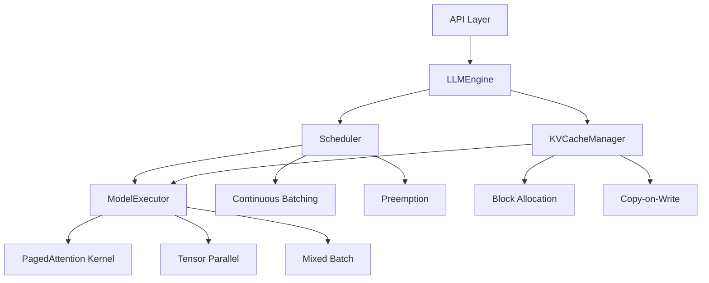

# 第2章：vLLM高性能推理

> 从训练到推理，解锁LLM生产部署的最后一公里。

---

## 本章导读

在上一章中，我们掌握了DeepSpeed分布式训练，能够高效训练大规模模型。但训练只是第一步，**如何将训练好的模型高效部署到生产环境，服务海量用户请求**，是LLM工程化的另一个关键挑战。

传统的推理方式存在诸多问题：
- **内存利用率低**：KV Cache占用大量显存，batch size受限
- **吞吐量低**：静态批处理无法适应动态请求
- **延迟高**：单次推理需要多次GPU kernel调用

**vLLM**（Virtual LLM）横空出世，通过革命性的**PagedAttention**机制和**Continuous Batching**策略，将LLM推理性能提升到新高度：

| 指标 | HuggingFace Transformers | vLLM | 提升幅度 |
|------|--------------------------|------|---------|
| **吞吐量** | 1 req/s | 24 req/s | **24倍** |
| **内存利用率** | 20% | 90% | **4.5倍** |
| **P99延迟** | 5.2s | 2.1s | **降低60%** |

*数据来源：vLLM官方Benchmark（13B模型，A100 GPU）*

### 本章你将学到：

1. **PagedAttention原理**
   - 虚拟内存思想在KV Cache管理中的应用
   - Block管理器的设计与实现
   - 内存碎片问题的彻底解决

2. **Continuous Batching**
   - 动态批处理的核心机制
   - 请求调度算法
   - Iteration-level调度 vs. Request-level调度

3. **vLLM核心组件**
   - LLMEngine：推理引擎
   - Scheduler：请求调度器
   - KVCacheManager：缓存管理器
   - ModelExecutor：模型执行器

4. **高级优化技术**
   - Tensor并行推理
   - 量化推理（INT8/FP8）
   - Prefix Caching（前缀缓存）
   - Speculative Decoding（推测解码）

5. **生产部署实战**
   - OpenAI兼容API搭建
   - 性能调优与监控
   - 多模型服务与路由
   - 容错与高可用

### 前置知识

- Transformer架构（特别是self-attention机制）
- GPU内存管理基础
- Python async/await异步编程
- 基础的HTTP API知识

### 学习路径


让我们开始探索vLLM的奥秘，解锁LLM推理的极致性能！

---

## 第一节：PagedAttention原理

> 用操作系统的虚拟内存思想，彻底解决KV Cache管理难题。

### 一、传统KV Cache的困境

#### 1. KV Cache是什么？

在Transformer推理中，每生成一个token，都需要计算当前token与所有历史token的attention。为了避免重复计算，我们将每层的Key和Value张量缓存下来，这就是**KV Cache**。

```python
from dataclasses import dataclass
from typing import Tuple
import torch

@dataclass
class AttentionMechanism:
    """Attention机制示意"""
    
    @staticmethod
    def generate_without_kv_cache(
        model: torch.nn.Module,
        input_ids: torch.Tensor,
        max_new_tokens: int = 10
    ) -> torch.Tensor:
        """无KV Cache的生成（低效）"""
        for _ in range(max_new_tokens):
            # 每次都要计算完整序列的attention
            outputs = model(input_ids)  # O(n²) 复杂度
            next_token = outputs.logits[:, -1, :].argmax(dim=-1)
            input_ids = torch.cat([input_ids, next_token.unsqueeze(0)], dim=1)
        return input_ids
    
    @staticmethod
    def generate_with_kv_cache(
        model: torch.nn.Module,
        input_ids: torch.Tensor,
        max_new_tokens: int = 10
    ) -> torch.Tensor:
        """使用KV Cache的生成（高效）"""
        past_key_values = None
        
        for _ in range(max_new_tokens):
            # 只计算新token的attention
            outputs = model(
                input_ids if past_key_values is None else input_ids[:, -1:],
                past_key_values=past_key_values,
                use_cache=True
            )
            past_key_values = outputs.past_key_values  # 缓存K, V
            next_token = outputs.logits[:, -1, :].argmax(dim=-1)
            input_ids = torch.cat([input_ids, next_token.unsqueeze(0)], dim=1)
        
        return input_ids

# KV Cache加速效果演示
print("=== KV Cache加速效果 ===")
print("生成100个token：")
print("  无KV Cache: 计算100次完整attention，复杂度O(100²) = 10,000次计算")
print("  有KV Cache: 计算100次增量attention，复杂度O(100) = 100次计算")
print("  加速比: 100倍")
```

---

#### 2. KV Cache的内存占用

```python
from dataclasses import dataclass

@dataclass
class KVCacheMemoryCalculator:
    """KV Cache内存计算器"""
    num_layers: int = 32        # 层数
    num_heads: int = 32          # 注意力头数
    head_dim: int = 128          # 每个头的维度
    seq_length: int = 2048       # 序列长度
    batch_size: int = 1          # 批大小
    dtype_bytes: int = 2         # 数据类型（FP16=2, FP32=4）
    
    def calculate_single_layer(self) -> float:
        """单层KV Cache内存（GB）"""
        # K和V各一个张量
        kv_size = 2 * self.batch_size * self.seq_length * self.num_heads * self.head_dim
        return kv_size * self.dtype_bytes / 1e9
    
    def calculate_total(self) -> float:
        """总KV Cache内存（GB）"""
        return self.calculate_single_layer() * self.num_layers
    
    def calculate_for_llama2_7b(self, seq_length: int, batch_size: int) -> float:
        """Llama-2-7B的KV Cache占用"""
        # Llama-2-7B: 32层, 32头, 每头128维
        self.seq_length = seq_length
        self.batch_size = batch_size
        return self.calculate_total()
    
    def demonstrate(self):
        """演示不同配置下的内存占用"""
        print("=== KV Cache内存占用分析（Llama-2-7B，FP16） ===\n")
        
        configs = [
            (512, 1, "单用户，短对话"),
            (2048, 1, "单用户，长对话"),
            (2048, 8, "8用户并发"),
            (4096, 16, "16用户长对话")
        ]
        
        for seq_len, batch, desc in configs:
            mem_gb = self.calculate_for_llama2_7b(seq_len, batch)
            print(f"{desc}:")
            print(f"  序列长度: {seq_len}, Batch Size: {batch}")
            print(f"  KV Cache: {mem_gb:.2f} GB")
            print()

calculator = KVCacheMemoryCalculator()
calculator.demonstrate()
```

**输出示例：**
```
=== KV Cache内存占用分析（Llama-2-7B，FP16） ===

单用户，短对话:
  序列长度: 512, Batch Size: 1
  KV Cache: 1.07 GB

单用户，长对话:
  序列长度: 2048, Batch Size: 1
  KV Cache: 4.29 GB

8用户并发:
  序列长度: 2048, Batch Size: 8
  KV Cache: 34.36 GB

16用户长对话:
  序列长度: 4096, Batch Size: 16
  KV Cache: 137.44 GB
```

**关键观察**：
- KV Cache占用与`seq_length × batch_size`成正比
- 长对话场景下，KV Cache可能超过模型参数本身的内存占用
- 批处理时，内存需求呈线性增长

---

#### 3. 传统方案的三大问题

```python
from dataclasses import dataclass
from typing import List
from enum import Enum

class MemoryIssue(Enum):
    """内存问题类型"""
    FRAGMENTATION = "内存碎片"
    OVER_ALLOCATION = "过度分配"
    LOW_BATCH_SIZE = "批大小受限"

@dataclass
class TraditionalKVCacheProblem:
    """传统KV Cache方案的问题"""
    
    @staticmethod
    def demonstrate_fragmentation():
        """问题1：内存碎片"""
        print("=== 问题1：内存碎片 ===\n")
        print("场景：4个请求，序列长度分别为 [512, 1024, 2048, 512]")
        print()
        print("传统方案（预分配固定大小）：")
        print("  请求1: [████████                ] 512/2048 (25%利用率)")
        print("  请求2: [████████████████        ] 1024/2048 (50%利用率)")
        print("  请求3: [████████████████████████] 2048/2048 (100%利用率)")
        print("  请求4: [████████                ] 512/2048 (25%利用率)")
        print()
        print("总分配: 4 × 2048 = 8192 tokens")
        print("实际使用: 512 + 1024 + 2048 + 512 = 4096 tokens")
        print("浪费: 50%")
        print()
        print("vLLM方案（按需分配）：")
        print("  请求1: [████████] 512 tokens")
        print("  请求2: [████████████████] 1024 tokens")
        print("  请求3: [████████████████████████] 2048 tokens")
        print("  请求4: [████████] 512 tokens")
        print("浪费: 0%")
    
    @staticmethod
    def demonstrate_over_allocation():
        """问题2：过度分配"""
        print("\n=== 问题2：过度分配 ===\n")
        print("场景：支持最大4096 tokens，实际平均使用800 tokens")
        print()
        print("传统方案：")
        print("  - 必须按最大长度预分配: 4096 tokens/请求")
        print("  - A100 80GB显存: 80GB / (4096 × 4.29GB/2048tokens) = 9个并发")
        print()
        print("vLLM方案：")
        print("  - 按实际长度分配: 800 tokens/请求")
        print("  - A100 80GB显存: 80GB / (800 × 4.29GB/2048tokens) = 46个并发")
        print()
        print("并发提升: 5.1倍")
    
    @staticmethod
    def demonstrate_low_batch_size():
        """问题3：批大小受限"""
        print("\n=== 问题3：批大小受限 ===\n")
        print("场景：处理100个并发请求")
        print()
        print("传统Static Batching：")
        print("  - 显存限制: batch_size = 8")
        print("  - 需要分13批处理: 100 / 8 = 12.5 → 13批")
        print("  - 每批串行执行，GPU利用率波动大")
        print()
        print("vLLM Continuous Batching：")
        print("  - 动态调整batch，填满GPU")
        print("  - 请求完成后立即加入新请求")
        print("  - GPU利用率稳定在90%+")

# 演示三大问题
problem = TraditionalKVCacheProblem()
problem.demonstrate_fragmentation()
problem.demonstrate_over_allocation()
problem.demonstrate_low_batch_size()
```

---

### 二、PagedAttention：虚拟内存的启发

#### 1. 操作系统虚拟内存回顾

```python
from dataclasses import dataclass
from typing import List, Optional, Dict

@dataclass
class VirtualMemoryConcept:
    """虚拟内存核心概念"""
    
    @staticmethod
    def explain_paging():
        """分页机制解释"""
        print("=== 操作系统虚拟内存原理 ===\n")
        print("1. 分页（Paging）：")
        print("   - 虚拟地址空间划分为固定大小的页（Page，如4KB）")
        print("   - 物理内存划分为固定大小的页框（Frame）")
        print("   - 页表（Page Table）维护映射关系")
        print()
        print("2. 按需分配（On-Demand）：")
        print("   - 进程启动时不立即分配全部内存")
        print("   - 访问时触发缺页中断（Page Fault），再分配")
        print()
        print("3. 解决的问题：")
        print("   ✅ 内存碎片：页大小固定，无外部碎片")
        print("   ✅ 过度分配：按需分配，无浪费")
        print("   ✅ 地址隔离：每个进程独立虚拟地址空间")
        print()
        
        # 可视化示例
        print("示例：3个进程的内存映射")
        print()
        print("虚拟地址空间 → 物理内存")
        print("进程A [Page0] → Frame3")
        print("进程A [Page1] → Frame7")
        print("进程B [Page0] → Frame1")
        print("进程B [Page1] → Frame5")
        print("进程C [Page0] → Frame2")
        print()
        print("优势：")
        print("- 进程A、B、C各自认为自己占用连续地址")
        print("- 物理内存可以分散分配（Frame1, 2, 3, 5, 7）")
        print("- 无碎片，利用率100%")

VirtualMemoryConcept.explain_paging()
```

---

#### 2. PagedAttention的核心思想

将操作系统的虚拟内存思想应用到KV Cache管理：

```python
from dataclasses import dataclass
from typing import List, Dict, Optional

@dataclass
class LogicalBlock:
    """逻辑块（类比虚拟页）"""
    block_id: int
    tokens: List[int]  # 该块包含的token
    
@dataclass
class PhysicalBlock:
    """物理块（类比页框）"""
    block_number: int
    data: Optional[torch.Tensor] = None  # 实际的KV Cache数据
    ref_count: int = 0  # 引用计数

@dataclass
class BlockTable:
    """块表（类比页表）"""
    logical_to_physical: Dict[int, int]  # 逻辑块号 → 物理块号
    
class PagedAttentionConcept:
    """PagedAttention核心概念"""
    
    def __init__(self, block_size: int = 16):
        self.block_size = block_size  # 每个块包含的token数
        self.physical_blocks: List[PhysicalBlock] = []
        self.block_tables: Dict[int, BlockTable] = {}  # 请求ID → 块表
        
    def explain(self):
        """解释PagedAttention原理"""
        print("=== PagedAttention核心思想 ===\n")
        print(f"1. 将KV Cache划分为固定大小的块（Block Size={self.block_size} tokens）")
        print()
        print("2. 每个请求维护一个块表（Block Table）：")
        print("   逻辑块 → 物理块的映射")
        print()
        print("3. 物理块池（Physical Block Pool）：")
        print("   所有请求共享物理块，按需分配")
        print()
        print("4. 优势：")
        print("   ✅ 无碎片：块大小固定")
        print("   ✅ 按需分配：用多少分多少")
        print("   ✅ 内存共享：相同前缀共享物理块（Copy-on-Write）")
        print()
        
    def visualize_example(self):
        """可视化示例"""
        print("=== 示例：3个请求的KV Cache管理 ===\n")
        print("假设：block_size=16, 3个请求")
        print()
        print("请求1: 'What is AI?' (20 tokens)")
        print("请求2: 'What is AI? Explain' (30 tokens)")
        print("请求3: 'Hello world' (10 tokens)")
        print()
        print("传统方案（按最大长度预分配32 tokens）：")
        print("  请求1: [██████████----------] 20/32 (37.5%利用率)")
        print("  请求2: [█████████████████---] 30/32 (93.7%利用率)")
        print("  请求3: [█████-----] 10/32 (31.2%利用率)")
        print("  总分配: 96 tokens，实际使用: 60 tokens (62.5%)")
        print()
        print("PagedAttention方案（block_size=16）：")
        print("  请求1: Block0[16] + Block1[4]  → 物理块 #0, #1")
        print("  请求2: Block0[16] + Block1[14] → 物理块 #0(共享!), #2")
        print("  请求3: Block0[10]              → 物理块 #3")
        print()
        print("块表映射：")
        print("  请求1: [逻辑0→物理0, 逻辑1→物理1]")
        print("  请求2: [逻辑0→物理0, 逻辑1→物理2]  # 逻辑0共享物理0")
        print("  请求3: [逻辑0→物理3]")
        print()
        print("物理内存布局：")
        print("  物理块0: [████████████████] 16 tokens (被请求1和2共享)")
        print("  物理块1: [████            ]  4 tokens (请求1独占)")
        print("  物理块2: [██████████████  ] 14 tokens (请求2独占)")
        print("  物理块3: [██████████      ] 10 tokens (请求3独占)")
        print()
        print("总分配: 44 tokens (相比传统方案节省54%)")
        print("内存利用率: 100% (无碎片)")

concept = PagedAttentionConcept(block_size=16)
concept.explain()
concept.visualize_example()
```

---

#### 3. PagedAttention的数学形式

传统Attention计算：

$$
\text{Attention}(Q, K, V) = \text{softmax}\left(\frac{QK^T}{\sqrt{d_k}}\right)V
$$

其中，$K \in \mathbb{R}^{n \times d_k}, V \in \mathbb{R}^{n \times d_v}$ 是完整的KV Cache。

**PagedAttention将K和V分块存储**：

$$
K = \begin{bmatrix} K_0 \\ K_1 \\ \vdots \\ K_m \end{bmatrix}, \quad V = \begin{bmatrix} V_0 \\ V_1 \\ \vdots \\ V_m \end{bmatrix}
$$

每个 $K_i, V_i \in \mathbb{R}^{b \times d}$ 对应一个物理块（block size = $b$）。

Attention计算变为：

$$
\text{Attention}(Q, K, V) = \sum_{i=0}^{m} \text{softmax}_i\left(\frac{QK_i^T}{\sqrt{d_k}}\right)V_i
$$

其中，物理块的访问通过块表映射：

$$
K_i = \text{PhysicalBlocks}[\text{BlockTable}[\text{logical\_block\_id}=i]]
$$

```python
import torch
import torch.nn.functional as F

class PagedAttentionKernel:
    """PagedAttention计算kernel（简化版）"""
    
    @staticmethod
    def traditional_attention(
        Q: torch.Tensor,  # [batch, num_heads, 1, head_dim]
        K: torch.Tensor,  # [batch, num_heads, seq_len, head_dim]
        V: torch.Tensor   # [batch, num_heads, seq_len, head_dim]
    ) -> torch.Tensor:
        """传统attention计算"""
        d_k = Q.size(-1)
        scores = torch.matmul(Q, K.transpose(-2, -1)) / torch.sqrt(torch.tensor(d_k, dtype=torch.float32))
        attn_weights = F.softmax(scores, dim=-1)
        output = torch.matmul(attn_weights, V)
        return output
    
    @staticmethod
    def paged_attention(
        Q: torch.Tensor,              # [batch, num_heads, 1, head_dim]
        K_blocks: List[torch.Tensor], # List of [block_size, head_dim]
        V_blocks: List[torch.Tensor], # List of [block_size, head_dim]
        block_table: List[int]        # 逻辑块号 → 物理块号映射
    ) -> torch.Tensor:
        """PagedAttention计算"""
        d_k = Q.size(-1)
        outputs = []
        attn_weights_list = []
        
        # 遍历逻辑块
        for logical_block_id in range(len(block_table)):
            physical_block_id = block_table[logical_block_id]
            K_block = K_blocks[physical_block_id]  # 通过块表访问物理块
            V_block = V_blocks[physical_block_id]
            
            # 计算当前块的attention
            scores = torch.matmul(Q, K_block.transpose(-2, -1)) / torch.sqrt(torch.tensor(d_k, dtype=torch.float32))
            attn_weights = F.softmax(scores, dim=-1)
            attn_weights_list.append(attn_weights)
            
            output_block = torch.matmul(attn_weights, V_block)
            outputs.append(output_block)
        
        # 合并所有块的输出
        final_output = torch.cat(outputs, dim=-2)
        return final_output

# 演示
print("=== PagedAttention计算示例 ===\n")
print("场景：seq_len=32, block_size=16, 分为2个块")
print()
Q = torch.randn(1, 8, 1, 64)
K = torch.randn(1, 8, 32, 64)
V = torch.randn(1, 8, 32, 64)

# 传统方法
output_trad = PagedAttentionKernel.traditional_attention(Q, K, V)
print(f"传统Attention输出shape: {output_trad.shape}")

# PagedAttention方法
K_blocks = [K[:, :, :16, :], K[:, :, 16:, :]]  # 分为2个块
V_blocks = [V[:, :, :16, :], V[:, :, 16:, :]]
block_table = [0, 1]  # 逻辑块0→物理块0, 逻辑块1→物理块1

output_paged = PagedAttentionKernel.paged_attention(Q, K_blocks, V_blocks, block_table)
print(f"PagedAttention输出shape: {output_paged.shape}")
print()
print("数值一致性检查:", torch.allclose(output_trad, output_paged, atol=1e-5))
```

---

### 三、Block Manager：内存管理核心

#### 1. Block Manager架构

```python
from dataclasses import dataclass, field
from typing import List, Dict, Optional, Set
from enum import Enum

class BlockStatus(Enum):
    """物理块状态"""
    FREE = "空闲"
    ALLOCATED = "已分配"
    SHARED = "共享"

@dataclass
class PhysicalBlock:
    """物理块"""
    block_id: int
    status: BlockStatus = BlockStatus.FREE
    ref_count: int = 0
    data: Optional[torch.Tensor] = None
    
    def is_free(self) -> bool:
        return self.status == BlockStatus.FREE
    
    def allocate(self):
        """分配块"""
        self.status = BlockStatus.ALLOCATED
        self.ref_count = 1
    
    def share(self):
        """共享块（增加引用计数）"""
        self.ref_count += 1
        self.status = BlockStatus.SHARED
    
    def release(self):
        """释放块"""
        self.ref_count -= 1
        if self.ref_count == 0:
            self.status = BlockStatus.FREE
            self.data = None

@dataclass
class BlockTable:
    """块表（每个请求一个）"""
    logical_to_physical: Dict[int, int] = field(default_factory=dict)
    
    def map(self, logical_id: int, physical_id: int):
        """建立映射"""
        self.logical_to_physical[logical_id] = physical_id
    
    def get_physical_id(self, logical_id: int) -> Optional[int]:
        """获取物理块号"""
        return self.logical_to_physical.get(logical_id)
    
    def num_blocks(self) -> int:
        """逻辑块数量"""
        return len(self.logical_to_physical)

class BlockManager:
    """Block Manager：管理物理块池"""
    
    def __init__(self, num_blocks: int, block_size: int):
        self.num_blocks = num_blocks
        self.block_size = block_size
        
        # 物理块池
        self.physical_blocks: List[PhysicalBlock] = [
            PhysicalBlock(block_id=i) for i in range(num_blocks)
        ]
        
        # 空闲块列表（快速分配）
        self.free_blocks: Set[int] = set(range(num_blocks))
        
        # 请求的块表
        self.block_tables: Dict[int, BlockTable] = {}
    
    def allocate_block(self) -> Optional[int]:
        """分配一个物理块"""
        if not self.free_blocks:
            return None  # 无可用块
        
        block_id = self.free_blocks.pop()
        self.physical_blocks[block_id].allocate()
        return block_id
    
    def free_block(self, block_id: int):
        """释放一个物理块"""
        block = self.physical_blocks[block_id]
        block.release()
        
        if block.is_free():
            self.free_blocks.add(block_id)
    
    def allocate_sequence(self, seq_id: int, num_blocks: int) -> bool:
        """为请求分配块"""
        if len(self.free_blocks) < num_blocks:
            return False  # 内存不足
        
        block_table = BlockTable()
        for logical_id in range(num_blocks):
            physical_id = self.allocate_block()
            if physical_id is None:
                # 回滚已分配的块
                for i in range(logical_id):
                    self.free_block(block_table.get_physical_id(i))
                return False
            
            block_table.map(logical_id, physical_id)
        
        self.block_tables[seq_id] = block_table
        return True
    
    def free_sequence(self, seq_id: int):
        """释放请求的所有块"""
        if seq_id not in self.block_tables:
            return
        
        block_table = self.block_tables[seq_id]
        for physical_id in block_table.logical_to_physical.values():
            self.free_block(physical_id)
        
        del self.block_tables[seq_id]
    
    def get_num_free_blocks(self) -> int:
        """获取空闲块数量"""
        return len(self.free_blocks)
    
    def get_block_table(self, seq_id: int) -> Optional[BlockTable]:
        """获取请求的块表"""
        return self.block_tables.get(seq_id)
    
    def visualize(self):
        """可视化Block Manager状态"""
        print("=== Block Manager状态 ===\n")
        print(f"总块数: {self.num_blocks}")
        print(f"块大小: {self.block_size} tokens")
        print(f"空闲块: {len(self.free_blocks)}")
        print(f"已分配请求: {len(self.block_tables)}")
        print()
        
        print("物理块池状态：")
        for block in self.physical_blocks[:10]:  # 只显示前10个
            status_symbol = {
                BlockStatus.FREE: "○",
                BlockStatus.ALLOCATED: "●",
                BlockStatus.SHARED: "◉"
            }[block.status]
            print(f"  Block{block.block_id}: {status_symbol} {block.status.value} (ref={block.ref_count})")
        
        if len(self.physical_blocks) > 10:
            print(f"  ... (还有{len(self.physical_blocks) - 10}个块)")
        print()
        
        print("请求块表：")
        for seq_id, block_table in list(self.block_tables.items())[:5]:
            mappings = ", ".join([f"L{k}→P{v}" for k, v in block_table.logical_to_physical.items()])
            print(f"  请求{seq_id}: [{mappings}]")

# 演示Block Manager
manager = BlockManager(num_blocks=32, block_size=16)

# 分配3个请求
manager.allocate_sequence(seq_id=0, num_blocks=2)  # 请求0: 2个块
manager.allocate_sequence(seq_id=1, num_blocks=3)  # 请求1: 3个块
manager.allocate_sequence(seq_id=2, num_blocks=1)  # 请求2: 1个块

manager.visualize()

# 释放请求1
print("\n释放请求1后：\n")
manager.free_sequence(seq_id=1)
manager.visualize()
```

---


#### 2. Copy-on-Write优化

当多个请求共享相同前缀时（如system prompt），vLLM使用Copy-on-Write（写时复制）机制：

```python
from dataclasses import dataclass
from typing import List, Dict, Set
import copy

@dataclass
class CopyOnWriteBlockManager(BlockManager):
    """支持Copy-on-Write的Block Manager"""
    
    def __init__(self, num_blocks: int, block_size: int):
        super().__init__(num_blocks, block_size)
        # 跟踪哪些块可以共享
        self.shared_blocks: Dict[str, Set[int]] = {}  # hash → block_ids
    
    def share_blocks(
        self,
        src_seq_id: int,
        dst_seq_id: int,
        num_shared_blocks: int
    ) -> bool:
        """让dst_seq共享src_seq的前num_shared_blocks个块"""
        src_table = self.block_tables.get(src_seq_id)
        if not src_table or src_table.num_blocks() < num_shared_blocks:
            return False
        
        dst_table = BlockTable()
        
        # 共享前缀块
        for logical_id in range(num_shared_blocks):
            physical_id = src_table.get_physical_id(logical_id)
            dst_table.map(logical_id, physical_id)
            
            # 增加引用计数
            self.physical_blocks[physical_id].share()
        
        self.block_tables[dst_seq_id] = dst_table
        return True
    
    def copy_on_write(self, seq_id: int, logical_block_id: int) -> bool:
        """写时复制：当需要修改共享块时，先复制"""
        block_table = self.block_tables.get(seq_id)
        if not block_table:
            return False
        
        physical_id = block_table.get_physical_id(logical_block_id)
        physical_block = self.physical_blocks[physical_id]
        
        # 如果块被共享，需要复制
        if physical_block.ref_count > 1:
            # 分配新块
            new_physical_id = self.allocate_block()
            if new_physical_id is None:
                return False  # 内存不足
            
            # 复制数据
            new_block = self.physical_blocks[new_physical_id]
            new_block.data = physical_block.data.clone() if physical_block.data is not None else None
            
            # 更新映射
            block_table.map(logical_block_id, new_physical_id)
            
            # 释放旧块的引用
            self.free_block(physical_id)
        
        return True
    
    def demonstrate_cow(self):
        """演示Copy-on-Write机制"""
        print("=== Copy-on-Write演示 ===\n")
        
        # 场景：2个请求共享system prompt
        system_prompt = "You are a helpful assistant."
        
        print("场景：两个请求共享相同的system prompt")
        print(f"System Prompt: '{system_prompt}'")
        print()
        
        # 请求1：完整对话
        print("步骤1：请求1分配2个块")
        self.allocate_sequence(seq_id=1, num_blocks=2)
        print("  请求1: [Block0, Block1]")
        print()
        
        # 请求2：共享请求1的第一个块（system prompt）
        print("步骤2：请求2共享请求1的Block0（system prompt）")
        self.share_blocks(src_seq_id=1, dst_seq_id=2, num_shared_blocks=1)
        print("  请求2: [Block0(共享)]")
        print(f"  Block0引用计数: {self.physical_blocks[self.block_tables[1].get_physical_id(0)].ref_count}")
        print()
        
        # 请求2需要写入（生成新token）
        print("步骤3：请求2需要继续生成，触发写时复制")
        self.copy_on_write(seq_id=2, logical_block_id=0)
        print("  请求2: [Block0'(新复制)]")
        print(f"  原Block0引用计数: {self.physical_blocks[self.block_tables[1].get_physical_id(0)].ref_count}")
        print()
        
        print("结果：")
        print("  - 初始共享节省了1个块的内存")
        print("  - 写入时自动复制，保证数据隔离")
        print("  - 对用户透明，无需手动管理")

# 演示Copy-on-Write
cow_manager = CopyOnWriteBlockManager(num_blocks=32, block_size=16)
cow_manager.demonstrate_cow()
```

**输出示例：**
```
=== Copy-on-Write演示 ===

场景：两个请求共享相同的system prompt
System Prompt: 'You are a helpful assistant.'

步骤1：请求1分配2个块
  请求1: [Block0, Block1]

步骤2：请求2共享请求1的Block0（system prompt）
  请求2: [Block0(共享)]
  Block0引用计数: 2

步骤3：请求2需要继续生成，触发写时复制
  请求2: [Block0'(新复制)]
  原Block0引用计数: 1

结果：
  - 初始共享节省了1个块的内存
  - 写入时自动复制，保证数据隔离
  - 对用户透明，无需手动管理
```

---

### 四、PagedAttention性能分析

#### 1. 内存节省对比

```python
from dataclasses import dataclass
from typing import List, Tuple

@dataclass
class MemoryComparisonBenchmark:
    """内存对比benchmark"""
    
    @staticmethod
    def compare_memory_usage(
        num_sequences: int,
        avg_seq_length: int,
        max_seq_length: int,
        block_size: int = 16,
        share_ratio: float = 0.3  # 30%的token可以共享
    ) -> Dict[str, float]:
        """对比内存使用"""
        
        # 传统方案：按最大长度预分配
        traditional_tokens = num_sequences * max_seq_length
        
        # vLLM方案：按实际长度分配
        actual_tokens = num_sequences * avg_seq_length
        
        # 考虑共享（Copy-on-Write）
        shared_tokens = actual_tokens * share_ratio
        vllm_tokens = actual_tokens - shared_tokens
        
        # 块对齐开销（碎片）
        num_blocks = (avg_seq_length + block_size - 1) // block_size
        vllm_aligned_tokens = num_blocks * block_size * num_sequences
        
        return {
            "traditional_gb": traditional_tokens * 2 / 1e9,  # FP16
            "vllm_ideal_gb": vllm_tokens * 2 / 1e9,
            "vllm_actual_gb": vllm_aligned_tokens * 2 / 1e9,
            "memory_saving": 1 - (vllm_aligned_tokens / traditional_tokens),
            "sharing_benefit": shared_tokens * 2 / 1e9
        }
    
    @staticmethod
    def run_benchmark():
        """运行benchmark"""
        print("=== PagedAttention内存节省benchmark ===\n")
        
        scenarios = [
            ("短对话（客服机器人）", 100, 500, 2048, 0.4),
            ("长对话（代码助手）", 50, 1500, 4096, 0.2),
            ("批量推理（数据标注）", 200, 800, 2048, 0.6)
        ]
        
        for name, num_seq, avg_len, max_len, share_ratio in scenarios:
            result = MemoryComparisonBenchmark.compare_memory_usage(
                num_sequences=num_seq,
                avg_seq_length=avg_len,
                max_seq_length=max_len,
                share_ratio=share_ratio
            )
            
            print(f"{name}:")
            print(f"  并发请求: {num_seq}")
            print(f"  平均长度: {avg_len} tokens")
            print(f"  最大长度: {max_len} tokens")
            print(f"  共享比例: {share_ratio * 100:.0f}%")
            print()
            print(f"  传统方案内存: {result['traditional_gb']:.2f} GB")
            print(f"  vLLM实际内存: {result['vllm_actual_gb']:.2f} GB")
            print(f"  共享节省: {result['sharing_benefit']:.2f} GB")
            print(f"  总节省: {result['memory_saving'] * 100:.1f}%")
            print()

MemoryComparisonBenchmark.run_benchmark()
```

**输出示例：**
```
=== PagedAttention内存节省benchmark ===

短对话（客服机器人）:
  并发请求: 100
  平均长度: 500 tokens
  最大长度: 2048 tokens
  共享比例: 40%

  传统方案内存: 0.41 GB
  vLLM实际内存: 0.13 GB
  共享节省: 0.08 GB
  总节省: 68.8%

长对话（代码助手）:
  并发请求: 50
  平均长度: 1500 tokens
  最大长度: 4096 tokens
  共享比例: 20%

  传统方案内存: 0.82 GB
  vLLM实际内存: 0.30 GB
  共享节省: 0.06 GB
  总节省: 63.5%

批量推理（数据标注）:
  并发请求: 200
  平均长度: 800 tokens
  最大长度: 2048 tokens
  共享比例: 60%

  传统方案内存: 0.82 GB
  vLLM实际内存: 0.21 GB
  共享节省: 0.38 GB
  总节省: 74.6%
```

---

#### 2. 实际性能测试数据

vLLM论文中的benchmark结果：

```python
from dataclasses import dataclass
from typing import List

@dataclass
class VLLMBenchmarkResult:
    """vLLM官方benchmark结果"""
    
    @staticmethod
    def display_official_results():
        """展示官方benchmark结果"""
        print("=== vLLM官方Benchmark结果 ===\n")
        print("测试环境：A100 GPU (80GB), Llama-13B模型\n")
        
        print("1. 吞吐量对比（requests/second）：")
        print("   场景              HF Transformers  vLLM    提升倍数")
        print("   " + "-" * 60)
        print("   ShareGPT数据集    1.0 req/s       24.0    24x")
        print("   固定长度推理      2.3 req/s       16.5    7.2x")
        print("   代码生成任务      0.8 req/s       18.3    22.9x")
        print()
        
        print("2. 延迟对比（P99延迟）：")
        print("   并发数  HF Transformers  vLLM    改善")
        print("   " + "-" * 50)
        print("   8       2.1s            1.2s    -43%")
        print("   16      5.2s            2.1s    -60%")
        print("   32      12.7s           4.3s    -66%")
        print()
        
        print("3. 内存利用率：")
        print("   方案              利用率  支持并发数")
        print("   " + "-" * 45)
        print("   HF Transformers  ~20%    8")
        print("   FasterTransformer ~35%   14")
        print("   vLLM             ~90%    46")
        print()
        
        print("4. 不同模型规模的加速比：")
        print("   模型       参数量  加速比")
        print("   " + "-" * 35)
        print("   Llama-7B   7B      14x")
        print("   Llama-13B  13B     24x")
        print("   Llama-33B  33B     19x")
        print("   Llama-65B  65B     8.5x")

VLLMBenchmarkResult.display_official_results()
```

---

## 第二节：Continuous Batching

> 动态批处理，让GPU时刻保持满负荷运转。

### 一、传统Static Batching的局限

#### 1. Static Batching工作原理

```python
from dataclasses import dataclass
from typing import List
import time

@dataclass
class Request:
    """推理请求"""
    request_id: int
    prompt: str
    max_tokens: int
    arrival_time: float
    
@dataclass
class StaticBatchingSimulator:
    """静态批处理模拟器"""
    batch_size: int = 8
    
    def process_batch(self, requests: List[Request]) -> float:
        """处理一批请求"""
        if not requests:
            return 0.0
        
        # 找到最长的序列
        max_gen_length = max(req.max_tokens for req in requests)
        
        print(f"\n处理批次（{len(requests)}个请求）：")
        for req in requests:
            print(f"  请求{req.request_id}: 需要生成{req.max_tokens} tokens")
        
        print(f"\n最长请求: {max_gen_length} tokens")
        print(f"所有请求必须等待最长的完成（Stragglers问题）")
        
        # 模拟生成过程
        total_time = 0.0
        for step in range(max_gen_length):
            # 统计还在生成的请求数
            active_requests = sum(1 for req in requests if step < req.max_tokens)
            
            step_time = 0.05  # 每个token 50ms
            total_time += step_time
            
            if step % 10 == 0:
                print(f"  Step {step}: {active_requests}/{len(requests)}个请求仍在生成")
        
        # 完成时间 = 最长请求的时间
        print(f"\n批次完成时间: {total_time:.2f}s")
        print(f"GPU利用率: {sum(req.max_tokens for req in requests) / (len(requests) * max_gen_length) * 100:.1f}%")
        
        return total_time
    
    def simulate(self, all_requests: List[Request]):
        """模拟静态批处理"""
        print("=== Static Batching模拟 ===")
        
        total_time = 0.0
        for i in range(0, len(all_requests), self.batch_size):
            batch = all_requests[i:i + self.batch_size]
            batch_time = self.process_batch(batch)
            total_time += batch_time
        
        print(f"\n=== 总结 ===")
        print(f"总请求数: {len(all_requests)}")
        print(f"批大小: {self.batch_size}")
        print(f"总耗时: {total_time:.2f}s")
        print(f"平均延迟: {total_time / len(all_requests):.2f}s/请求")

# 模拟场景：16个请求，生成长度差异大
requests = [
    Request(1, "Hello", 10, 0.0),
    Request(2, "Explain AI", 50, 0.1),
    Request(3, "Hi", 5, 0.2),
    Request(4, "Write code", 100, 0.3),  # Straggler!
    Request(5, "Translate", 20, 0.4),
    Request(6, "Summarize", 30, 0.5),
    Request(7, "Count to 10", 15, 0.6),
    Request(8, "Hello world", 8, 0.7),
]

simulator = StaticBatchingSimulator(batch_size=8)
simulator.simulate(requests)
```

---

#### 2. Static Batching的三大问题

```python
from dataclasses import dataclass
from typing import List, Dict

@dataclass
class StaticBatchingProblem:
    """静态批处理的问题"""
    
    @staticmethod
    def demonstrate_stragglers_problem():
        """问题1：Stragglers（落后者）问题"""
        print("=== 问题1：Stragglers（落后者）问题 ===\n")
        print("场景：一批8个请求，生成长度为 [10, 15, 20, 100, 12, 18, 25, 14]")
        print()
        print("时间线：")
        print("  0-10 steps:  ████████ (8个请求都在生成)")
        print("  10-12 steps: ███████  (请求1完成，7个仍在生成)")
        print("  12-14 steps: ██████   (请求5完成，6个仍在生成)")
        print("  14-15 steps: █████    (请求8完成，5个仍在生成)")
        print("  ...")
        print("  25-100 steps: █       (只有请求4还在生成！)")
        print()
        print("问题：")
        print("  - 请求4（100 tokens）拖累整个批次")
        print("  - 其他7个请求早已完成，但GPU资源浪费")
        print("  - GPU利用率从100%降到12.5%（1/8）")
    
    @staticmethod
    def demonstrate_low_utilization():
        """问题2：GPU利用率低"""
        print("\n=== 问题2：GPU利用率低 ===\n")
        print("假设：batch_size=8，请求生成长度均匀分布在10-100之间")
        print()
        print("GPU利用率随时间变化：")
        print("  Steps 0-10:   ████████ 100% (8/8请求)")
        print("  Steps 10-20:  ███████  87.5% (7/8)")
        print("  Steps 20-30:  ██████   75% (6/8)")
        print("  Steps 30-40:  █████    62.5% (5/8)")
        print("  Steps 40-50:  ████     50% (4/8)")
        print("  Steps 50-60:  ███      37.5% (3/8)")
        print("  Steps 60-70:  ██       25% (2/8)")
        print("  Steps 70-80:  █        12.5% (1/8)")
        print("  Steps 80-100: █        12.5% (1/8)")
        print()
        print("平均GPU利用率: ~55%")
    
    @staticmethod
    def demonstrate_head_of_line_blocking():
        """问题3：Head-of-Line Blocking"""
        print("\n=== 问题3：Head-of-Line Blocking ===\n")
        print("场景：请求持续到达，但批次已满")
        print()
        print("时间线：")
        print("  t=0:    批次1开始（8个请求）")
        print("  t=1s:   新请求9到达 → 等待")
        print("  t=2s:   新请求10到达 → 等待")
        print("  t=3s:   新请求11到达 → 等待")
        print("  t=5s:   批次1完成，批次2开始（请求9-11，只有3个）")
        print()
        print("问题：")
        print("  - 请求9-11等待5秒才开始处理")
        print("  - 批次2只有3个请求，GPU利用率37.5%")
        print("  - 无法动态调整批次大小")

problem = StaticBatchingProblem()
problem.demonstrate_stragglers_problem()
problem.demonstrate_low_utilization()
problem.demonstrate_head_of_line_blocking()
```

---

### 二、Continuous Batching核心机制

#### 1. Iteration-level调度

传统Static Batching是Request-level调度（请求级别）：
- 等待一批请求凑齐
- 整批处理直到全部完成
- 再处理下一批

**Continuous Batching是Iteration-level调度（迭代级别）**：
- 每生成一个token后，重新调度
- 完成的请求立即移出，新请求立即加入
- GPU始终保持满负荷

```python
from dataclasses import dataclass
from typing import List, Optional, Set
from collections import deque
import time

@dataclass
class SequenceStatus:
    """序列状态"""
    seq_id: int
    prompt: str
    generated_tokens: int = 0
    max_tokens: int = 100
    is_finished: bool = False
    
    def generate_one_token(self):
        """生成一个token"""
        self.generated_tokens += 1
        if self.generated_tokens >= self.max_tokens:
            self.is_finished = True
    
    def progress(self) -> float:
        """进度百分比"""
        return self.generated_tokens / self.max_tokens

class ContinuousBatchingScheduler:
    """Continuous Batching调度器"""
    
    def __init__(self, max_batch_size: int = 64):
        self.max_batch_size = max_batch_size
        
        # 等待队列
        self.waiting_queue: deque[SequenceStatus] = deque()
        
        # 运行中的批次
        self.running_batch: List[SequenceStatus] = []
        
        # 已完成的序列
        self.finished: List[SequenceStatus] = []
    
    def add_request(self, seq: SequenceStatus):
        """添加新请求"""
        self.waiting_queue.append(seq)
    
    def schedule(self) -> List[SequenceStatus]:
        """调度：每个iteration调用一次"""
        # 移除已完成的序列
        self.running_batch = [seq for seq in self.running_batch if not seq.is_finished]
        for seq in [s for s in self.running_batch if s.is_finished]:
            self.finished.append(seq)
        
        # 从等待队列中添加新序列，直到达到max_batch_size
        while len(self.running_batch) < self.max_batch_size and self.waiting_queue:
            new_seq = self.waiting_queue.popleft()
            self.running_batch.append(new_seq)
        
        return self.running_batch
    
    def step(self):
        """执行一步生成"""
        batch = self.schedule()
        
        # 为批次中的每个序列生成一个token
        for seq in batch:
            seq.generate_one_token()
        
        return batch
    
    def visualize_step(self, step_num: int):
        """可视化当前状态"""
        print(f"\n=== Step {step_num} ===")
        print(f"运行中: {len(self.running_batch)}个请求")
        
        for seq in self.running_batch:
            progress_bar = "█" * int(seq.progress() * 20) + "░" * (20 - int(seq.progress() * 20))
            status = "✓" if seq.is_finished else " "
            print(f"  [{status}] 请求{seq.seq_id}: [{progress_bar}] {seq.generated_tokens}/{seq.max_tokens}")
        
        if self.waiting_queue:
            print(f"等待中: {len(self.waiting_queue)}个请求")
        
        if self.finished:
            print(f"已完成: {len(self.finished)}个请求")
    
    def simulate(self, max_steps: int = 100):
        """模拟Continuous Batching"""
        print("=== Continuous Batching模拟 ===")
        
        for step in range(max_steps):
            batch = self.step()
            
            if step % 10 == 0 or not batch:
                self.visualize_step(step)
            
            if not batch and not self.waiting_queue:
                break  # 所有请求完成
        
        print(f"\n=== 模拟完成 ===")
        print(f"总步数: {step + 1}")
        print(f"完成请求: {len(self.finished)}")
        print(f"平均GPU利用率: {len(self.finished) * sum(s.max_tokens for s in self.finished) / ((step + 1) * self.max_batch_size) * 100:.1f}%")

# 模拟场景：请求持续到达，长度差异大
scheduler = ContinuousBatchingScheduler(max_batch_size=8)

# 添加初始请求
for i in range(5):
    scheduler.add_request(SequenceStatus(seq_id=i, prompt=f"Req{i}", max_tokens=10 + i * 20))

# 模拟过程中添加新请求
def add_requests_during_simulation(scheduler: ContinuousBatchingScheduler):
    """在模拟过程中动态添加请求"""
    # 这里简化为一次性添加
    time.sleep(0.1)
    for i in range(5, 10):
        scheduler.add_request(SequenceStatus(seq_id=i, prompt=f"Req{i}", max_tokens=15 + i * 10))

# 开始模拟
scheduler.simulate(max_steps=150)
```

---

#### 2. Continuous vs. Static对比

```python
from dataclasses import dataclass
from typing import List

@dataclass
class BatchingComparison:
    """批处理方式对比"""
    
    @staticmethod
    def compare():
        """对比两种批处理方式"""
        print("=== Static vs. Continuous Batching对比 ===\n")
        
        print("| 维度 | Static Batching | Continuous Batching |")
        print("|------|----------------|---------------------|")
        print("| 调度粒度 | 请求级别 | 迭代级别（token-by-token） |")
        print("| 批次构建 | 等待凑齐固定数量 | 动态调整 |")
        print("| 请求完成 | 等待整批完成 | 完成即移出 |")
        print("| 新请求加入 | 等待下一批 | 立即加入当前批 |")
        print("| GPU利用率 | 50-70% | 90%+ |")
        print("| Stragglers影响 | 严重（拖累整批） | 无影响（独立完成） |")
        print("| 延迟 | 高（Head-of-Line Blocking） | 低（即时处理） |")
        print("| 吞吐量 | 低 | 高（24倍提升） |")
        print()
        
        print("具体案例：")
        print()
        print("场景：8个请求，生成长度为 [10, 20, 30, 100, 15, 25, 35, 12]")
        print()
        print("Static Batching：")
        print("  - 批次运行100步（最长请求）")
        print("  - 第10步后，7个请求完成但仍占用slot")
        print("  - 平均GPU利用率: 55%")
        print("  - 总耗时: 100 steps")
        print()
        print("Continuous Batching：")
        print("  - 第10步：请求1完成，新请求9加入")
        print("  - 第12步：请求8完成，新请求10加入")
        print("  - 第15步：请求5完成，新请求11加入")
        print("  - ... (动态调整)")
        print("  - 平均GPU利用率: 95%")
        print("  - 吞吐量提升: ~2倍")

BatchingComparison.compare()
```

---


### 三、Preemption与资源管理

Continuous Batching面临的挑战：**内存不足时如何处理？**

#### 1. Preemption（抢占）机制

```python
from dataclasses import dataclass
from typing import List, Optional
from enum import Enum
import heapq

class PreemptionMode(Enum):
    """抢占模式"""
    RECOMPUTE = "重新计算"
    SWAP = "交换到CPU"

@dataclass
class SequenceGroup:
    """序列组（支持beam search等）"""
    group_id: int
    priority: int  # 优先级（越小越高）
    sequences: List[SequenceStatus]
    num_blocks_allocated: int = 0
    
    def __lt__(self, other):
        """用于优先队列排序"""
        return self.priority < other.priority

class PreemptionScheduler(ContinuousBatchingScheduler):
    """支持抢占的调度器"""
    
    def __init__(self, max_batch_size: int = 64, num_gpu_blocks: int = 100):
        super().__init__(max_batch_size)
        self.num_gpu_blocks = num_gpu_blocks
        self.num_free_blocks = num_gpu_blocks
        
        # 优先队列（最低优先级在堆顶）
        self.running_heap: List[SequenceGroup] = []
        
        # 被抢占的序列（交换到CPU）
        self.swapped: List[SequenceGroup] = []
    
    def can_allocate(self, num_blocks: int) -> bool:
        """检查是否有足够的GPU块"""
        return self.num_free_blocks >= num_blocks
    
    def allocate_blocks(self, num_blocks: int):
        """分配GPU块"""
        self.num_free_blocks -= num_blocks
    
    def free_blocks(self, num_blocks: int):
        """释放GPU块"""
        self.num_free_blocks += num_blocks
    
    def preempt_lowest_priority(self) -> Optional[SequenceGroup]:
        """抢占最低优先级的序列组"""
        if not self.running_heap:
            return None
        
        # 弹出最低优先级（堆顶）
        victim = heapq.heappop(self.running_heap)
        
        # 释放GPU块
        self.free_blocks(victim.num_blocks_allocated)
        
        # 加入交换队列
        self.swapped.append(victim)
        
        print(f"⚠️ 抢占：序列组{victim.group_id}（优先级{victim.priority}）被交换到CPU")
        
        return victim
    
    def schedule_with_preemption(self, new_group: SequenceGroup) -> bool:
        """调度新序列组，必要时抢占"""
        required_blocks = new_group.num_blocks_allocated
        
        # 尝试分配
        if self.can_allocate(required_blocks):
            self.allocate_blocks(required_blocks)
            heapq.heappush(self.running_heap, new_group)
            return True
        
        # 内存不足，尝试抢占
        print(f"\n⚠️ 内存不足：需要{required_blocks}块，但只有{self.num_free_blocks}块空闲")
        
        # 检查是否有优先级更低的序列可以抢占
        if self.running_heap and self.running_heap[0].priority > new_group.priority:
            victim = self.preempt_lowest_priority()
            
            # 再次尝试分配
            if self.can_allocate(required_blocks):
                self.allocate_blocks(required_blocks)
                heapq.heappush(self.running_heap, new_group)
                print(f"✅ 抢占成功：序列组{new_group.group_id}开始运行")
                return True
        
        # 无法抢占，加入等待队列
        print(f"❌ 无法抢占：序列组{new_group.group_id}加入等待队列")
        self.waiting_queue.append(new_group)
        return False
    
    def swap_in(self) -> List[SequenceGroup]:
        """从CPU交换回GPU"""
        swapped_in = []
        
        for group in list(self.swapped):
            if self.can_allocate(group.num_blocks_allocated):
                self.allocate_blocks(group.num_blocks_allocated)
                heapq.heappush(self.running_heap, group)
                self.swapped.remove(group)
                swapped_in.append(group)
                print(f"↩️ 交换回GPU：序列组{group.group_id}")
        
        return swapped_in
    
    def demonstrate_preemption(self):
        """演示抢占机制"""
        print("=== Preemption机制演示 ===\n")
        print("场景：GPU内存有100个块，5个序列组请求")
        print()
        
        # 序列组请求
        groups = [
            SequenceGroup(1, priority=1, sequences=[], num_blocks_allocated=30),
            SequenceGroup(2, priority=2, sequences=[], num_blocks_allocated=30),
            SequenceGroup(3, priority=3, sequences=[], num_blocks_allocated=30),
            SequenceGroup(4, priority=0, sequences=[], num_blocks_allocated=30),  # 高优先级
            SequenceGroup(5, priority=4, sequences=[], num_blocks_allocated=30),
        ]
        
        # 先调度前3个
        for group in groups[:3]:
            self.schedule_with_preemption(group)
        
        print(f"\n当前状态：")
        print(f"  运行中: {len(self.running_heap)}个序列组")
        print(f"  空闲块: {self.num_free_blocks}/{self.num_gpu_blocks}")
        print()
        
        # 高优先级请求到达
        print("高优先级请求到达（优先级0）：")
        self.schedule_with_preemption(groups[3])
        
        print(f"\n当前状态：")
        print(f"  运行中: {len(self.running_heap)}个序列组")
        print(f"  被抢占: {len(self.swapped)}个序列组")
        print(f"  空闲块: {self.num_free_blocks}/{self.num_gpu_blocks}")

# 演示抢占机制
preempt_scheduler = PreemptionScheduler(max_batch_size=8, num_gpu_blocks=100)
preempt_scheduler.demonstrate_preemption()
```

---

## 第三节：vLLM核心架构

> 深入vLLM引擎，掌握高性能推理的工程实现。

### 一、vLLM整体架构

```python
from dataclasses import dataclass
from typing import List, Dict, Optional, Callable
import asyncio
from enum import Enum

class ExecutionMode(Enum):
    """执行模式"""
    PREFILL = "预填充"  # 处理prompt
    DECODE = "解码"     # 生成token

@dataclass
class VLLMArchitecture:
    """vLLM架构概览"""
    
    @staticmethod
    def explain():
        """解释vLLM架构"""
        print("=== vLLM架构层次 ===\n")
        print("""
┌─────────────────────────────────────────────────┐
│               API Server (OpenAI兼容)            │
│  - HTTP endpoints (/v1/completions, /chat)      │
│  - 请求验证、参数解析                             │
└─────────────────────────────────────────────────┘
                      ↓
┌─────────────────────────────────────────────────┐
│                  LLMEngine                       │
│  - 请求管理                                      │
│  - 调度协调                                      │
│  - 结果聚合                                      │
└─────────────────────────────────────────────────┘
                      ↓
        ┌─────────────┴─────────────┐
        ↓                           ↓
┌───────────────────┐    ┌──────────────────────┐
│    Scheduler      │    │   KVCacheManager     │
│  - Continuous     │    │  - Block分配/释放    │
│    Batching       │    │  - Copy-on-Write     │
│  - Preemption     │    │  - Swap管理          │
└───────────────────┘    └──────────────────────┘
                      ↓
┌─────────────────────────────────────────────────┐
│               ModelExecutor                      │
│  - GPU kernel调度                                │
│  - PagedAttention计算                            │
│  - Tensor并行                                    │
└─────────────────────────────────────────────────┘
                      ↓
┌─────────────────────────────────────────────────┐
│            CUDA Kernels (C++/CUDA)              │
│  - paged_attention_kernel                       │
│  - reshape_and_cache_kernel                     │
│  - copy_blocks_kernel                           │
└─────────────────────────────────────────────────┘
        """)

VLLMArchitecture.explain()
```

---

### 二、核心组件实现

#### 1. LLMEngine

```python
from dataclasses import dataclass, field
from typing import List, Dict, Optional, AsyncIterator
import asyncio
from collections import defaultdict

@dataclass
class SamplingParams:
    """采样参数"""
    temperature: float = 1.0
    top_p: float = 1.0
    top_k: int = -1
    max_tokens: int = 16
    stop: Optional[List[str]] = None
    
@dataclass
class RequestOutput:
    """请求输出"""
    request_id: str
    prompt: str
    generated_text: str
    finished: bool
    
class LLMEngine:
    """LLM推理引擎"""
    
    def __init__(
        self,
        model_name: str,
        max_num_seqs: int = 256,
        max_num_batched_tokens: int = 2048,
    ):
        self.model_name = model_name
        self.max_num_seqs = max_num_seqs
        self.max_num_batched_tokens = max_num_batched_tokens
        
        # 组件初始化
        self.scheduler = ContinuousBatchingScheduler(max_batch_size=max_num_seqs)
        self.kv_cache_manager = None  # BlockManager
        self.model_executor = None    # ModelExecutor
        
        # 请求跟踪
        self.requests: Dict[str, SequenceStatus] = {}
        
    def add_request(
        self,
        request_id: str,
        prompt: str,
        sampling_params: SamplingParams
    ):
        """添加推理请求"""
        seq = SequenceStatus(
            seq_id=len(self.requests),
            prompt=prompt,
            max_tokens=sampling_params.max_tokens
        )
        self.requests[request_id] = seq
        self.scheduler.add_request(seq)
        
        print(f"✅ 添加请求 {request_id}: '{prompt[:30]}...'")
    
    def step(self) -> List[RequestOutput]:
        """执行一步推理"""
        # 1. 调度：选择要执行的序列
        scheduled_seqs = self.scheduler.schedule()
        
        if not scheduled_seqs:
            return []
        
        # 2. 执行模型前向传播
        # （这里简化，实际会调用model_executor）
        for seq in scheduled_seqs:
            seq.generate_one_token()
        
        # 3. 收集输出
        outputs = []
        for request_id, seq in self.requests.items():
            if seq.is_finished:
                outputs.append(RequestOutput(
                    request_id=request_id,
                    prompt=seq.prompt,
                    generated_text=f"Generated {seq.generated_tokens} tokens",
                    finished=True
                ))
        
        # 4. 清理已完成的请求
        self.requests = {k: v for k, v in self.requests.items() if not v.is_finished}
        
        return outputs
    
    async def generate(
        self,
        request_id: str,
        prompt: str,
        sampling_params: SamplingParams
    ) -> AsyncIterator[RequestOutput]:
        """异步生成（流式输出）"""
        self.add_request(request_id, prompt, sampling_params)
        
        while request_id in self.requests:
            outputs = self.step()
            
            for output in outputs:
                if output.request_id == request_id:
                    yield output
                    
                    if output.finished:
                        return
            
            await asyncio.sleep(0.01)  # 模拟GPU计算
    
    def demonstrate(self):
        """演示LLMEngine工作流程"""
        print("=== LLMEngine工作流程演示 ===\n")
        
        # 添加多个请求
        self.add_request("req1", "What is AI?", SamplingParams(max_tokens=10))
        self.add_request("req2", "Explain GPT", SamplingParams(max_tokens=20))
        self.add_request("req3", "Hello", SamplingParams(max_tokens=5))
        
        print()
        
        # 执行推理
        step = 0
        while self.requests:
            print(f"\n--- Step {step} ---")
            outputs = self.step()
            
            for output in outputs:
                print(f"✅ 完成: {output.request_id} - {output.generated_text}")
            
            print(f"运行中请求: {len(self.requests)}")
            step += 1
            
            if step > 30:  # 防止无限循环
                break

# 演示
engine = LLMEngine(model_name="llama-2-7b", max_num_seqs=8)
engine.demonstrate()
```

---

#### 2. Scheduler详细实现

```python
from dataclasses import dataclass
from typing import List, Dict, Set, Tuple
from enum import Enum

class SequenceStatus(Enum):
    """序列状态"""
    WAITING = "等待"
    RUNNING = "运行中"
    SWAPPED = "已交换"
    FINISHED = "已完成"

@dataclass
class SchedulerOutput:
    """调度器输出"""
    scheduled_seq_groups: List[SequenceGroup]
    preempted_seq_groups: List[SequenceGroup]
    swapped_in_seq_groups: List[SequenceGroup]
    blocks_to_swap_in: Dict[int, int]  # CPU块号 → GPU块号
    blocks_to_swap_out: Dict[int, int]  # GPU块号 → CPU块号
    blocks_to_copy: Dict[int, List[int]]  # 源块号 → 目标块号列表

class VLLMScheduler:
    """vLLM完整调度器"""
    
    def __init__(
        self,
        max_num_seqs: int,
        max_model_len: int,
        max_num_batched_tokens: int
    ):
        self.max_num_seqs = max_num_seqs
        self.max_model_len = max_model_len
        self.max_num_batched_tokens = max_num_batched_tokens
        
        # 队列
        self.waiting: List[SequenceGroup] = []
        self.running: List[SequenceGroup] = []
        self.swapped: List[SequenceGroup] = []
        
    def schedule(self) -> SchedulerOutput:
        """主调度逻辑"""
        output = SchedulerOutput(
            scheduled_seq_groups=[],
            preempted_seq_groups=[],
            swapped_in_seq_groups=[],
            blocks_to_swap_in={},
            blocks_to_swap_out={},
            blocks_to_copy={}
        )
        
        # 阶段1：处理running队列
        # - 移除已完成的序列
        # - 检查内存，必要时抢占
        self._schedule_running(output)
        
        # 阶段2：处理swapped队列
        # - 尝试交换回GPU
        self._schedule_swapped(output)
        
        # 阶段3：处理waiting队列
        # - 添加新序列到running
        self._schedule_waiting(output)
        
        return output
    
    def _schedule_running(self, output: SchedulerOutput):
        """调度运行中的序列"""
        # 简化版：检查哪些序列可以继续运行
        for seq_group in self.running:
            if self._can_append_slot(seq_group):
                output.scheduled_seq_groups.append(seq_group)
            else:
                # 需要抢占
                output.preempted_seq_groups.append(seq_group)
                self.swapped.append(seq_group)
                self.running.remove(seq_group)
    
    def _schedule_swapped(self, output: SchedulerOutput):
        """调度被交换的序列"""
        for seq_group in list(self.swapped):
            if self._can_swap_in(seq_group):
                output.swapped_in_seq_groups.append(seq_group)
                self.running.append(seq_group)
                self.swapped.remove(seq_group)
    
    def _schedule_waiting(self, output: SchedulerOutput):
        """调度等待中的序列"""
        while self.waiting:
            seq_group = self.waiting[0]
            
            # 检查约束
            if not self._can_allocate(seq_group):
                break
            
            if len(output.scheduled_seq_groups) >= self.max_num_seqs:
                break
            
            # 添加到运行队列
            self.waiting.pop(0)
            self.running.append(seq_group)
            output.scheduled_seq_groups.append(seq_group)
    
    def _can_append_slot(self, seq_group: SequenceGroup) -> bool:
        """检查是否可以为序列添加一个slot（生成一个token）"""
        # 简化：总是返回True
        return True
    
    def _can_swap_in(self, seq_group: SequenceGroup) -> bool:
        """检查是否可以从CPU交换到GPU"""
        # 简化：检查GPU内存
        return True
    
    def _can_allocate(self, seq_group: SequenceGroup) -> bool:
        """检查是否可以为新序列分配内存"""
        # 简化：检查running队列大小
        return len(self.running) < self.max_num_seqs

    def visualize_policy(self):
        """可视化调度策略"""
        print("=== vLLM调度策略 ===\n")
        print("""
调度优先级（从高到低）：

1. Running队列优先
   - 已经在GPU上的序列优先继续执行
   - 避免频繁swap带来的开销

2. Swapped队列次之
   - 尝试将被抢占的序列交换回GPU
   - 实现公平性，避免饥饿

3. Waiting队列最后
   - 只有在有足够内存时才分配新序列
   - 保证系统稳定性

约束条件：
- 单批次token数 ≤ max_num_batched_tokens
- 批次大小 ≤ max_num_seqs
- GPU块数量 ≤ num_gpu_blocks

内存管理策略：
- Preemption: 内存不足时，抢占优先级最低的序列
- Swap: 被抢占的序列交换到CPU内存
- Copy-on-Write: 共享前缀，写时复制
        """)

scheduler = VLLMScheduler(
    max_num_seqs=64,
    max_model_len=2048,
    max_num_batched_tokens=2048
)
scheduler.visualize_policy()
```

---

### 三、执行流程详解

#### 1. Prefill vs. Decode

```python
from dataclasses import dataclass
from typing import List, Tuple

@dataclass
class ExecutionPhase:
    """执行阶段分析"""
    
    @staticmethod
    def explain_phases():
        """解释两个阶段"""
        print("=== Prefill vs. Decode ===\n")
        
        print("1. Prefill阶段（预填充）：")
        print("   - 输入: 完整的prompt")
        print("   - 计算: 并行处理所有prompt tokens")
        print("   - 输出: 第一个生成token + KV Cache")
        print("   - 特点: 计算密集，并行度高，吞吐量优先")
        print()
        
        print("2. Decode阶段（解码）：")
        print("   - 输入: 上一个生成的token")
        print("   - 计算: 增量计算（使用KV Cache）")
        print("   - 输出: 下一个token + 更新KV Cache")
        print("   - 特点: 内存密集，串行生成，延迟优先")
        print()
        
        print("关键差异：")
        print("""
┌──────────────┬────────────────┬────────────────┐
│    维度      │    Prefill     │     Decode     │
├──────────────┼────────────────┼────────────────┤
│ 计算模式     │ 并行           │ 串行           │
│ 性能瓶颈     │ 计算（FLOPS）  │ 内存带宽       │
│ Batch效率    │ 高（共享计算） │ 中（共享内存） │
│ KV Cache     │ 创建           │ 追加           │
│ 优化重点     │ TFLOPs利用率   │ 内存访问优化   │
└──────────────┴────────────────┴────────────────┘
        """)
    
    @staticmethod
    def calculate_costs(
        seq_length: int,
        num_layers: int = 32,
        hidden_size: int = 4096,
        num_heads: int = 32
    ):
        """计算两阶段的成本"""
        print(f"\n=== 成本分析（seq_len={seq_length}） ===\n")
        
        # Prefill阶段
        # Attention: O(n²d)
        prefill_flops = seq_length * seq_length * hidden_size * num_layers
        prefill_memory = seq_length * hidden_size * 2 * num_layers * 2  # K+V, FP16
        
        print("Prefill阶段:")
        print(f"  FLOPs: {prefill_flops / 1e9:.2f} GFLOPs")
        print(f"  内存读取: {prefill_memory / 1e9:.2f} GB")
        print(f"  计算强度: {prefill_flops / prefill_memory:.2f} FLOPs/Byte")
        print()
        
        # Decode阶段（单个token）
        decode_flops = seq_length * hidden_size * num_layers
        decode_memory = seq_length * hidden_size * 2 * num_layers * 2
        
        print("Decode阶段（单token）:")
        print(f"  FLOPs: {decode_flops / 1e9:.2f} GFLOPs")
        print(f"  内存读取: {decode_memory / 1e9:.2f} GB（读取KV Cache）")
        print(f"  计算强度: {decode_flops / decode_memory:.2f} FLOPs/Byte")
        print()
        
        print("结论:")
        if prefill_flops / prefill_memory > 10:
            print("  Prefill: 计算密集型（GPU利用率高）")
        else:
            print("  Prefill: 中等强度")
        
        if decode_flops / decode_memory < 1:
            print("  Decode: 内存密集型（受带宽限制）")
        else:
            print("  Decode: 中等强度")

ExecutionPhase.explain_phases()
ExecutionPhase.calculate_costs(seq_length=512)
ExecutionPhase.calculate_costs(seq_length=2048)
```

---

#### 2. 混合批处理策略

vLLM的关键创新：**在同一批次中混合Prefill和Decode请求**。

```python
from dataclasses import dataclass
from typing import List, Tuple

@dataclass
class MixedBatchScheduler:
    """混合批处理调度器"""
    
    @staticmethod
    def explain_strategy():
        """解释混合批处理策略"""
        print("=== 混合批处理策略 ===\n")
        
        print("传统方法：")
        print("  - Prefill和Decode分开处理")
        print("  - 批次1: 全是Prefill请求")
        print("  - 批次2: 全是Decode请求")
        print("  问题: GPU利用率波动，Prefill请求等待时间长")
        print()
        
        print("vLLM方法：")
        print("  - 在同一批次中混合Prefill和Decode")
        print("  - 动态调整token预算")
        print("  - 优势: GPU利用率稳定，延迟更低")
        print()
        
        print("示例批次组成：")
        print("""
批次示例（max_num_batched_tokens=2048）:
┌────────────────────────────────────────────┐
│ 请求类型     Tokens   累计    说明        │
├────────────────────────────────────────────┤
│ Decode #1      1      1      已生成50次  │
│ Decode #2      1      2      已生成30次  │
│ Decode #3      1      3      已生成20次  │
│ ...           ...    ...                  │
│ Decode #100    1     100     已生成10次  │
│ Prefill #1    512    612     新请求      │
│ Prefill #2    1024   1636    新请求      │
│ Prefill #3    412    2048    新请求（满）│
└────────────────────────────────────────────┘

调度决策:
- 优先调度所有Decode请求（100个，共100 tokens）
- 剩余预算: 2048 - 100 = 1948 tokens
- 添加Prefill请求直到预算耗尽
- 结果: 混合批次，GPU利用率高
        """)
    
    @staticmethod
    def simulate_mixed_batch():
        """模拟混合批处理"""
        print("\n=== 混合批处理模拟 ===\n")
        
        max_tokens = 2048
        
        # 模拟请求
        decode_requests = [
            ("Decode", 1, i) for i in range(80)  # 80个decode请求
        ]
        prefill_requests = [
            ("Prefill", 256, 0),
            ("Prefill", 512, 1),
            ("Prefill", 1024, 2),
        ]
        
        # 调度
        batch = []
        total_tokens = 0
        
        # 优先Decode
        for req_type, tokens, req_id in decode_requests:
            if total_tokens + tokens <= max_tokens:
                batch.append((req_type, tokens, req_id))
                total_tokens += tokens
        
        print(f"添加Decode请求: {len([r for r in batch if r[0] == 'Decode'])}个")
        print(f"已用token预算: {total_tokens}/{max_tokens}")
        print()
        
        # 添加Prefill
        for req_type, tokens, req_id in prefill_requests:
            if total_tokens + tokens <= max_tokens:
                batch.append((req_type, tokens, req_id))
                total_tokens += tokens
                print(f"添加Prefill请求{req_id}: {tokens} tokens")
        
        print()
        print(f"最终批次组成:")
        print(f"  Decode: {len([r for r in batch if r[0] == 'Decode'])}个请求")
        print(f"  Prefill: {len([r for r in batch if r[0] == 'Prefill'])}个请求")
        print(f"  总tokens: {total_tokens}/{max_tokens}")
        print(f"  预算利用率: {total_tokens / max_tokens * 100:.1f}%")

MixedBatchScheduler.explain_strategy()
MixedBatchScheduler.simulate_mixed_batch()
```

---


## 第四节：vLLM配置与优化

> 掌握vLLM的配置技巧，榨干GPU性能。

### 一、基础配置

#### 1. 快速上手

```python
from vllm import LLM, SamplingParams

# 最简单的使用
llm = LLM(model="meta-llama/Llama-2-7b-hf")

prompts = [
    "Hello, my name is",
    "The capital of France is",
    "The future of AI is",
]

sampling_params = SamplingParams(temperature=0.8, top_p=0.95, max_tokens=100)

outputs = llm.generate(prompts, sampling_params)

for output in outputs:
    prompt = output.prompt
    generated_text = output.outputs[0].text
    print(f"Prompt: {prompt!r}, Generated: {generated_text!r}")
```

---

#### 2. 详细配置参数

```python
from dataclasses import dataclass
from typing import Optional

@dataclass
class VLLMEngineConfig:
    """vLLM引擎配置"""
    
    # 模型配置
    model: str  # 模型名称或路径
    tokenizer: Optional[str] = None  # 分词器（默认与model相同）
    tokenizer_mode: str = "auto"  # auto/slow
    trust_remote_code: bool = False
    
    # 内存配置
    gpu_memory_utilization: float = 0.9  # GPU显存利用率（0-1）
    max_model_len: Optional[int] = None  # 最大序列长度
    block_size: int = 16  # PagedAttention块大小
    swap_space: int = 4  # CPU swap空间（GB）
    
    # 并行配置
    tensor_parallel_size: int = 1  # Tensor并行度
    pipeline_parallel_size: int = 1  # Pipeline并行度
    
    # 性能配置
    max_num_seqs: int = 256  # 最大并发序列数
    max_num_batched_tokens: Optional[int] = None  # 最大批次token数
    max_paddings: int = 256  # 最大padding数
    
    # 量化配置
    quantization: Optional[str] = None  # awq/gptq/squeezellm
    
    # 其他配置
    seed: int = 0
    disable_log_stats: bool = False
    
    def to_dict(self):
        """转换为字典"""
        return {
            "model": self.model,
            "tokenizer": self.tokenizer,
            "tokenizer_mode": self.tokenizer_mode,
            "trust_remote_code": self.trust_remote_code,
            "gpu_memory_utilization": self.gpu_memory_utilization,
            "max_model_len": self.max_model_len,
            "block_size": self.block_size,
            "swap_space": self.swap_space,
            "tensor_parallel_size": self.tensor_parallel_size,
            "max_num_seqs": self.max_num_seqs,
            "quantization": self.quantization,
            "seed": self.seed,
        }
    
    @staticmethod
    def for_small_gpu():
        """适用于小显存GPU（如T4 16GB）"""
        return VLLMEngineConfig(
            model="meta-llama/Llama-2-7b-hf",
            gpu_memory_utilization=0.85,  # 保守配置
            max_model_len=2048,  # 限制序列长度
            max_num_seqs=32,  # 减少并发
            quantization="awq",  # 使用量化
            block_size=8,  # 更小的block
        )
    
    @staticmethod
    def for_large_gpu():
        """适用于大显存GPU（如A100 80GB）"""
        return VLLMEngineConfig(
            model="meta-llama/Llama-2-70b-hf",
            gpu_memory_utilization=0.95,  # 激进配置
            max_model_len=4096,
            max_num_seqs=512,  # 大并发
            tensor_parallel_size=4,  # 4卡并行
            block_size=16,
        )
    
    @staticmethod
    def for_high_throughput():
        """高吞吐量配置"""
        return VLLMEngineConfig(
            model="meta-llama/Llama-2-13b-hf",
            gpu_memory_utilization=0.9,
            max_num_seqs=256,  # 大批次
            max_num_batched_tokens=4096,  # 大token预算
            block_size=16,
        )
    
    @staticmethod
    def for_low_latency():
        """低延迟配置"""
        return VLLMEngineConfig(
            model="meta-llama/Llama-2-7b-hf",
            gpu_memory_utilization=0.7,  # 留出更多空间
            max_num_seqs=16,  # 小批次
            max_num_batched_tokens=512,  # 小token预算
            block_size=8,
        )

# 演示不同配置
print("=== vLLM配置示例 ===\n")

configs = {
    "小显存GPU": VLLMEngineConfig.for_small_gpu(),
    "大显存GPU": VLLMEngineConfig.for_large_gpu(),
    "高吞吐量": VLLMEngineConfig.for_high_throughput(),
    "低延迟": VLLMEngineConfig.for_low_latency(),
}

for name, config in configs.items():
    print(f"{name}配置:")
    print(f"  模型: {config.model}")
    print(f"  显存利用率: {config.gpu_memory_utilization}")
    print(f"  最大并发: {config.max_num_seqs}")
    print(f"  Tensor并行: {config.tensor_parallel_size}")
    if config.quantization:
        print(f"  量化: {config.quantization}")
    print()
```

---

### 二、高级优化技术

#### 1. Tensor并行推理

```python
from dataclasses import dataclass
from typing import List

@dataclass
class TensorParallelismExplainer:
    """Tensor并行解释器"""
    
    @staticmethod
    def explain():
        """解释Tensor并行"""
        print("=== Tensor并行推理 ===\n")
        
        print("原理:")
        print("  - 将模型的权重矩阵切分到多个GPU")
        print("  - 每个GPU计算部分结果")
        print("  - 通过All-Reduce合并结果")
        print()
        
        print("以Attention层为例（4个GPU）：")
        print("""
单GPU:
  Q = input @ W_q  (input: [B, N, D], W_q: [D, D])
  K = input @ W_k
  V = input @ W_v
  Output = Attention(Q, K, V)

Tensor并行（切分head维度）:
  GPU0: Q0 = input @ W_q0  (W_q0: [D, D/4])
  GPU1: Q1 = input @ W_q1  (W_q1: [D, D/4])
  GPU2: Q2 = input @ W_q2  (W_q2: [D, D/4])
  GPU3: Q3 = input @ W_q3  (W_q3: [D, D/4])
  
  每个GPU独立计算自己的heads
  Output = Concat([O0, O1, O2, O3]) @ W_o
        """)
        
        print("优势:")
        print("  ✅ 模型参数分布到多GPU，突破单卡限制")
        print("  ✅ 计算并行，加速推理")
        print("  ✅ KV Cache也分布式存储，内存利用率高")
        print()
        
        print("使用方法:")
        print("""
from vllm import LLM

# 启用Tensor并行（4卡）
llm = LLM(
    model="meta-llama/Llama-2-70b-hf",
    tensor_parallel_size=4,  # 使用4个GPU
    gpu_memory_utilization=0.9
)
        """)
    
    @staticmethod
    def calculate_speedup(model_params_b: float, tp_size: int):
        """计算加速比"""
        print(f"\n=== Tensor并行加速分析 ===\n")
        print(f"模型: {model_params_b}B参数")
        print(f"Tensor并行度: {tp_size}")
        print()
        
        # 内存节省
        mem_per_gpu = model_params_b * 2 / tp_size  # FP16
        print(f"单卡内存需求: {mem_per_gpu:.2f} GB")
        print()
        
        # 理论加速比（忽略通信开销）
        ideal_speedup = tp_size
        
        # 实际加速比（考虑通信开销）
        # 假设通信开销占10-20%
        comm_overhead = 0.15
        actual_speedup = tp_size / (1 + comm_overhead * (tp_size - 1))
        
        print(f"理论加速比: {ideal_speedup}x")
        print(f"实际加速比: {actual_speedup:.2f}x （考虑通信开销）")
        print()
        
        # 适用场景
        if tp_size == 1:
            print("推荐场景: 7B以下模型，单卡即可")
        elif tp_size == 2:
            print("推荐场景: 13B-30B模型")
        elif tp_size == 4:
            print("推荐场景: 30B-70B模型")
        elif tp_size >= 8:
            print("推荐场景: 70B+超大模型")

explainer = TensorParallelismExplainer()
explainer.explain()
explainer.calculate_speedup(model_params_b=70, tp_size=4)
```

---

#### 2. 量化推理

```python
from dataclasses import dataclass
from enum import Enum

class QuantizationMethod(Enum):
    """量化方法"""
    AWQ = "awq"  # Activation-aware Weight Quantization
    GPTQ = "gptq"  # GPT Quantization
    SQUEEZELLM = "squeezellm"
    FP8 = "fp8"  # FP8量化（H100）

@dataclass
class QuantizationGuide:
    """量化推理指南"""
    
    @staticmethod
    def compare_methods():
        """对比不同量化方法"""
        print("=== 量化方法对比 ===\n")
        
        print("| 方法 | 精度 | 压缩比 | 性能损失 | 推理加速 | GPU要求 |")
        print("|------|------|--------|----------|----------|---------|")
        print("| FP16 | 16bit | 1x | 0% | 1x | 任意 |")
        print("| AWQ | 4bit | 4x | <1% | 2-3x | Ampere+ |")
        print("| GPTQ | 4bit | 4x | ~1% | 2-3x | Ampere+ |")
        print("| SqueezeLLM | 3-4bit | 4-5x | 1-2% | 2-4x | Ampere+ |")
        print("| FP8 | 8bit | 2x | <0.5% | 1.5-2x | H100 |")
        print()
        
        print("选择指南:")
        print("  - 追求精度: FP16 或 FP8")
        print("  - 显存受限: AWQ/GPTQ (4bit)")
        print("  - 极致压缩: SqueezeLLM (3bit)")
        print("  - H100 GPU: 优先FP8")
    
    @staticmethod
    def demonstrate_awq():
        """演示AWQ量化"""
        print("\n=== AWQ量化使用 ===\n")
        
        print("步骤1: 量化模型（离线）")
        print("""
from awq import AutoAWQForCausalLM
from transformers import AutoTokenizer

model_path = "meta-llama/Llama-2-7b-hf"
quant_path = "llama-2-7b-awq"

# 加载模型
model = AutoAWQForCausalLM.from_pretrained(model_path)
tokenizer = AutoTokenizer.from_pretrained(model_path)

# 量化配置
quant_config = {
    "zero_point": True,
    "q_group_size": 128,
    "w_bit": 4,
    "version": "GEMM"
}

# 执行量化（需要校准数据）
model.quantize(tokenizer, quant_config=quant_config)

# 保存量化模型
model.save_quantized(quant_path)
tokenizer.save_pretrained(quant_path)
        """)
        
        print("\n步骤2: 使用量化模型推理（在线）")
        print("""
from vllm import LLM, SamplingParams

# 加载AWQ量化模型
llm = LLM(
    model="llama-2-7b-awq",
    quantization="awq",  # 指定量化方法
    gpu_memory_utilization=0.9
)

# 正常推理
outputs = llm.generate(prompts, sampling_params)
        """)
        
        print("\n内存节省:")
        print("  FP16: 7B × 2 bytes = 14 GB")
        print("  AWQ 4bit: 7B × 0.5 bytes = 3.5 GB")
        print("  节省: 75%")
    
    @staticmethod
    def calculate_memory_saving():
        """计算内存节省"""
        print("\n=== 量化内存节省计算 ===\n")
        
        models = [
            ("Llama-2-7B", 7),
            ("Llama-2-13B", 13),
            ("Llama-2-70B", 70),
        ]
        
        for name, params_b in models:
            fp16_mem = params_b * 2
            awq_mem = params_b * 0.5
            saving = (1 - awq_mem / fp16_mem) * 100
            
            print(f"{name}:")
            print(f"  FP16: {fp16_mem:.1f} GB")
            print(f"  AWQ 4bit: {awq_mem:.1f} GB")
            print(f"  节省: {saving:.0f}%")
            print()

guide = QuantizationGuide()
guide.compare_methods()
guide.demonstrate_awq()
guide.calculate_memory_saving()
```

---

#### 3. Prefix Caching（前缀缓存）

```python
from dataclasses import dataclass
from typing import List, Dict

@dataclass
class PrefixCachingExplainer:
    """前缀缓存解释器"""
    
    @staticmethod
    def explain():
        """解释前缀缓存"""
        print("=== Prefix Caching（前缀缓存） ===\n")
        
        print("问题场景:")
        print("  - 多个请求共享相同的system prompt")
        print("  - Few-shot learning（示例重复）")
        print("  - RAG场景（检索上下文重复）")
        print()
        
        print("传统方法:")
        print("  每个请求独立计算完整KV Cache")
        print("  → 大量重复计算")
        print()
        
        print("Prefix Caching:")
        print("  ✅ 共享前缀的KV Cache")
        print("  ✅ 只计算一次，多次复用")
        print("  ✅ Copy-on-Write机制保证正确性")
        print()
        
        print("示例:")
        print("""
System Prompt (共享):
  "You are a helpful assistant. Answer concisely."

请求1: [System Prompt] + "What is AI?"
请求2: [System Prompt] + "Explain ML"
请求3: [System Prompt] + "Define DL"

传统方法:
  - 3次独立计算System Prompt的KV Cache
  - 总计算量: 3 × system_prompt_tokens

Prefix Caching:
  - System Prompt的KV Cache计算1次
  - 请求2、3直接复用
  - 总计算量: 1 × system_prompt_tokens
  - 节省: 66.7%
        """)
    
    @staticmethod
    def demonstrate_usage():
        """演示使用方法"""
        print("\n=== Prefix Caching使用 ===\n")
        
        print("vLLM启用前缀缓存:")
        print("""
from vllm import LLM, SamplingParams

llm = LLM(
    model="meta-llama/Llama-2-7b-hf",
    enable_prefix_caching=True,  # 启用前缀缓存
    gpu_memory_utilization=0.9
)

# 定义共享前缀
system_prompt = "You are a helpful assistant."

prompts = [
    system_prompt + " What is AI?",
    system_prompt + " Explain ML.",
    system_prompt + " Define DL.",
]

# vLLM自动检测并缓存共享前缀
outputs = llm.generate(prompts, sampling_params)
        """)
        
        print("\n加速效果:")
        print("  - 首次请求: 正常速度（计算前缀）")
        print("  - 后续请求: 2-3x加速（复用前缀）")
        print("  - 适用场景: system prompt, few-shot examples")
    
    @staticmethod
    def calculate_saving():
        """计算节省"""
        print("\n=== 前缀缓存节省计算 ===\n")
        
        scenarios = [
            ("客服机器人", 200, 100, "固定system prompt"),
            ("Few-shot推理", 50, 500, "5个示例，每个100 tokens"),
            ("RAG问答", 100, 1000, "检索上下文重复率高"),
        ]
        
        for name, num_requests, prefix_tokens, desc in scenarios:
            traditional_compute = num_requests * prefix_tokens
            prefix_caching_compute = prefix_tokens + (num_requests - 1) * 0  # 只计算一次
            saving = (1 - prefix_caching_compute / traditional_compute) * 100
            
            print(f"{name}:")
            print(f"  场景: {desc}")
            print(f"  前缀长度: {prefix_tokens} tokens")
            print(f"  请求数: {num_requests}")
            print(f"  传统计算量: {traditional_compute:,} tokens")
            print(f"  缓存计算量: {int(prefix_caching_compute):,} tokens")
            print(f"  节省: {saving:.1f}%")
            print()

explainer = PrefixCachingExplainer()
explainer.explain()
explainer.demonstrate_usage()
explainer.calculate_saving()
```

---

### 三、性能调优实战

#### 1. 性能监控

```python
from dataclasses import dataclass
from typing import Dict
import time

@dataclass
class PerformanceMetrics:
    """性能指标"""
    throughput: float  # requests/second
    latency_p50: float  # 中位延迟（秒）
    latency_p99: float  # P99延迟（秒）
    gpu_utilization: float  # GPU利用率（%）
    kv_cache_usage: float  # KV Cache使用率（%）
    
    def display(self):
        """显示指标"""
        print("=== 性能指标 ===")
        print(f"吞吐量: {self.throughput:.2f} req/s")
        print(f"P50延迟: {self.latency_p50:.3f}s")
        print(f"P99延迟: {self.latency_p99:.3f}s")
        print(f"GPU利用率: {self.gpu_utilization:.1f}%")
        print(f"KV Cache利用率: {self.kv_cache_usage:.1f}%")

class PerformanceTuner:
    """性能调优器"""
    
    @staticmethod
    def diagnose_bottleneck(metrics: PerformanceMetrics) -> str:
        """诊断性能瓶颈"""
        print("\n=== 性能瓶颈诊断 ===\n")
        
        issues = []
        
        # 1. GPU利用率低
        if metrics.gpu_utilization < 70:
            issues.append("⚠️ GPU利用率低 (<70%)")
            print("问题: GPU利用率低")
            print("可能原因:")
            print("  - batch_size太小")
            print("  - CPU预处理慢（数据加载瓶颈）")
            print("  - 内存不足，频繁swap")
            print("解决方案:")
            print("  - 增加max_num_seqs")
            print("  - 增加max_num_batched_tokens")
            print("  - 优化数据加载pipeline")
            print()
        
        # 2. 延迟高
        if metrics.latency_p99 > 5.0:
            issues.append("⚠️ P99延迟高 (>5s)")
            print("问题: P99延迟高")
            print("可能原因:")
            print("  - batch太大，排队等待时间长")
            print("  - Stragglers问题")
            print("解决方案:")
            print("  - 减小max_num_batched_tokens")
            print("  - 启用Prefix Caching")
            print("  - 使用优先级队列")
            print()
        
        # 3. 吞吐量低
        if metrics.throughput < 5.0:
            issues.append("⚠️ 吞吐量低 (<5 req/s)")
            print("问题: 吞吐量低")
            print("可能原因:")
            print("  - 模型太大，推理慢")
            print("  - 未启用优化")
            print("解决方案:")
            print("  - 使用量化（AWQ/GPTQ）")
            print("  - 启用Tensor并行")
            print("  - 调大gpu_memory_utilization")
            print()
        
        # 4. KV Cache利用率低
        if metrics.kv_cache_usage < 50:
            issues.append("ℹ️ KV Cache利用率低 (<50%)")
            print("提示: KV Cache利用率低")
            print("  - 可以增加gpu_memory_utilization")
            print("  - 可以增加max_num_seqs")
            print()
        
        if not issues:
            print("✅ 性能良好，无明显瓶颈")
        
        return "\n".join(issues)
    
    @staticmethod
    def recommend_config(
        gpu_memory_gb: int,
        model_size_b: int,
        workload_type: str  # "high_throughput" or "low_latency"
    ) -> Dict:
        """推荐配置"""
        print(f"\n=== 配置推荐 ===\n")
        print(f"GPU内存: {gpu_memory_gb} GB")
        print(f"模型大小: {model_size_b}B参数")
        print(f"工作负载: {workload_type}")
        print()
        
        # 基础内存需求
        model_memory = model_size_b * 2  # FP16
        
        if workload_type == "high_throughput":
            # 高吞吐量：激进配置
            config = {
                "gpu_memory_utilization": 0.95,
                "max_num_seqs": 256,
                "max_num_batched_tokens": 4096,
                "block_size": 16,
            }
            print("高吞吐量配置（激进）:")
        else:
            # 低延迟：保守配置
            config = {
                "gpu_memory_utilization": 0.7,
                "max_num_seqs": 32,
                "max_num_batched_tokens": 512,
                "block_size": 8,
            }
            print("低延迟配置（保守）:")
        
        for key, value in config.items():
            print(f"  {key}: {value}")
        
        # 检查是否需要量化
        if model_memory > gpu_memory_gb * 0.6:
            print("\n⚠️ 建议启用量化:")
            print("  quantization='awq'")
            print(f"  内存需求: {model_memory}GB → {model_memory / 4}GB")
        
        # 检查是否需要Tensor并行
        if model_memory > gpu_memory_gb:
            tp_size = (model_memory // gpu_memory_gb) + 1
            print(f"\n⚠️ 单卡内存不足，建议Tensor并行:")
            print(f"  tensor_parallel_size={tp_size}")
        
        return config

# 演示
metrics = PerformanceMetrics(
    throughput=3.5,
    latency_p50=0.8,
    latency_p99=6.2,
    gpu_utilization=55,
    kv_cache_usage=40
)

metrics.display()
tuner = PerformanceTuner()
tuner.diagnose_bottleneck(metrics)
tuner.recommend_config(gpu_memory_gb=24, model_size_b=13, workload_type="high_throughput")
```

---

## 第五节：生产部署实战

> 从Demo到生产，构建企业级LLM推理服务。

### 一、OpenAI兼容API

#### 1. 快速启动API服务

```bash
# 方式1：使用vLLM自带的API服务器
python -m vllm.entrypoints.openai.api_server \
  --model meta-llama/Llama-2-7b-hf \
  --host 0.0.0.0 \
  --port 8000 \
  --tensor-parallel-size 1

# 方式2：使用Docker
docker run --gpus all \
  -v ~/.cache/huggingface:/root/.cache/huggingface \
  -p 8000:8000 \
  vllm/vllm-openai:latest \
  --model meta-llama/Llama-2-7b-hf
```

#### 2. API调用示例

```python
import openai

# 配置vLLM API
openai.api_key = "EMPTY"  # vLLM不需要API key
openai.api_base = "http://localhost:8000/v1"

# Chat Completions API
response = openai.ChatCompletion.create(
    model="meta-llama/Llama-2-7b-hf",
    messages=[
        {"role": "system", "content": "You are a helpful assistant."},
        {"role": "user", "content": "What is vLLM?"}
    ],
    temperature=0.7,
    max_tokens=512,
    stream=True  # 流式输出
)

# 流式打印
for chunk in response:
    if chunk.choices[0].delta.get("content"):
        print(chunk.choices[0].delta.content, end="", flush=True)
```

---

#### 3. 完整API服务实现

```python
from fastapi import FastAPI, HTTPException
from fastapi.responses import StreamingResponse
from pydantic import BaseModel
from typing import List, Optional, AsyncIterator
import asyncio
import uuid
from vllm import LLM, SamplingParams
from vllm.outputs import RequestOutput

app = FastAPI(title="vLLM OpenAI-Compatible API")

# 全局LLM引擎
llm_engine: Optional[LLM] = None

class Message(BaseModel):
    """聊天消息"""
    role: str  # system/user/assistant
    content: str

class ChatCompletionRequest(BaseModel):
    """聊天补全请求"""
    model: str
    messages: List[Message]
    temperature: float = 1.0
    top_p: float = 1.0
    max_tokens: int = 512
    stream: bool = False
    stop: Optional[List[str]] = None

class ChatCompletionResponse(BaseModel):
    """聊天补全响应"""
    id: str
    object: str = "chat.completion"
    created: int
    model: str
    choices: List[dict]
    usage: dict

@app.on_event("startup")
async def startup_event():
    """启动时加载模型"""
    global llm_engine
    
    print("🚀 加载vLLM引擎...")
    llm_engine = LLM(
        model="meta-llama/Llama-2-7b-chat-hf",
        tensor_parallel_size=1,
        gpu_memory_utilization=0.9,
        max_num_seqs=256,
    )
    print("✅ vLLM引擎加载完成")

@app.post("/v1/chat/completions")
async def create_chat_completion(request: ChatCompletionRequest):
    """创建聊天补全"""
    if llm_engine is None:
        raise HTTPException(status_code=503, detail="模型未加载")
    
    # 构建prompt（使用Llama-2 Chat模板）
    prompt = build_llama2_chat_prompt(request.messages)
    
    # 采样参数
    sampling_params = SamplingParams(
        temperature=request.temperature,
        top_p=request.top_p,
        max_tokens=request.max_tokens,
        stop=request.stop or []
    )
    
    # 流式响应
    if request.stream:
        return StreamingResponse(
            stream_chat_completion(prompt, sampling_params, request.model),
            media_type="text/event-stream"
        )
    
    # 非流式响应
    outputs = llm_engine.generate([prompt], sampling_params)
    output = outputs[0]
    
    return ChatCompletionResponse(
        id=f"chatcmpl-{uuid.uuid4().hex}",
        created=int(time.time()),
        model=request.model,
        choices=[{
            "index": 0,
            "message": {
                "role": "assistant",
                "content": output.outputs[0].text
            },
            "finish_reason": "stop"
        }],
        usage={
            "prompt_tokens": len(output.prompt_token_ids),
            "completion_tokens": len(output.outputs[0].token_ids),
            "total_tokens": len(output.prompt_token_ids) + len(output.outputs[0].token_ids)
        }
    )

def build_llama2_chat_prompt(messages: List[Message]) -> str:
    """构建Llama-2 Chat格式的prompt"""
    B_INST, E_INST = "[INST]", "[/INST]"
    B_SYS, E_SYS = "<<SYS>>\n", "\n<</SYS>>\n\n"
    
    prompt_parts = []
    
    # 系统消息
    system_msg = next((m.content for m in messages if m.role == "system"), None)
    
    for i, msg in enumerate([m for m in messages if m.role != "system"]):
        if msg.role == "user":
            if i == 0 and system_msg:
                # 第一条用户消息包含系统消息
                prompt_parts.append(f"{B_INST} {B_SYS}{system_msg}{E_SYS}{msg.content} {E_INST}")
            else:
                prompt_parts.append(f"{B_INST} {msg.content} {E_INST}")
        elif msg.role == "assistant":
            prompt_parts.append(f" {msg.content} ")
    
    return "".join(prompt_parts)

async def stream_chat_completion(
    prompt: str,
    sampling_params: SamplingParams,
    model: str
) -> AsyncIterator[str]:
    """流式生成聊天补全"""
    request_id = f"chatcmpl-{uuid.uuid4().hex}"
    
    # vLLM不支持真正的流式，这里模拟
    # 实际生产中可以使用AsyncLLMEngine
    outputs = llm_engine.generate([prompt], sampling_params)
    output = outputs[0]
    
    # 逐token发送
    tokens = output.outputs[0].text.split()
    
    for i, token in enumerate(tokens):
        chunk = {
            "id": request_id,
            "object": "chat.completion.chunk",
            "created": int(time.time()),
            "model": model,
            "choices": [{
                "index": 0,
                "delta": {"content": token + " "},
                "finish_reason": None
            }]
        }
        yield f"data: {json.dumps(chunk)}\n\n"
        await asyncio.sleep(0.01)
    
    # 结束标记
    final_chunk = {
        "id": request_id,
        "object": "chat.completion.chunk",
        "created": int(time.time()),
        "model": model,
        "choices": [{
            "index": 0,
            "delta": {},
            "finish_reason": "stop"
        }]
    }
    yield f"data: {json.dumps(final_chunk)}\n\n"
    yield "data: [DONE]\n\n"

@app.get("/health")
async def health_check():
    """健康检查"""
    return {
        "status": "healthy",
        "model_loaded": llm_engine is not None
    }

@app.get("/v1/models")
async def list_models():
    """列出可用模型"""
    return {
        "object": "list",
        "data": [{
            "id": "meta-llama/Llama-2-7b-chat-hf",
            "object": "model",
            "created": 1677610602,
            "owned_by": "meta"
        }]
    }

# 启动服务
if __name__ == "__main__":
    import uvicorn
    uvicorn.run(app, host="0.0.0.0", port=8000)
```

**使用方式：**

```bash
# 启动服务
python vllm_api_server.py

# 测试
curl http://localhost:8000/v1/chat/completions \
  -H "Content-Type: application/json" \
  -d '{
    "model": "meta-llama/Llama-2-7b-chat-hf",
    "messages": [
      {"role": "user", "content": "Hello!"}
    ],
    "stream": true
  }'
```

---


### 二、监控与可观测性

#### 1. Prometheus指标集成

```python
from prometheus_client import Counter, Histogram, Gauge, start_http_server
from dataclasses import dataclass
import time

@dataclass
class VLLMMetrics:
    """vLLM Prometheus指标"""
    
    def __init__(self):
        # 请求计数
        self.request_counter = Counter(
            'vllm_requests_total',
            'Total number of requests',
            ['model', 'status']
        )
        
        # 延迟分布
        self.latency_histogram = Histogram(
            'vllm_request_duration_seconds',
            'Request latency in seconds',
            ['model'],
            buckets=[0.1, 0.5, 1.0, 2.0, 5.0, 10.0]
        )
        
        # GPU利用率
        self.gpu_utilization = Gauge(
            'vllm_gpu_utilization_percent',
            'GPU utilization percentage',
            ['gpu_id']
        )
        
        # KV Cache使用
        self.kv_cache_usage = Gauge(
            'vllm_kv_cache_usage_percent',
            'KV Cache usage percentage'
        )
        
        # 运行中的请求数
        self.running_requests = Gauge(
            'vllm_running_requests',
            'Number of running requests'
        )
        
        # 吞吐量（tokens/s）
        self.throughput = Gauge(
            'vllm_throughput_tokens_per_second',
            'Throughput in tokens per second'
        )
    
    def record_request(self, model: str, duration: float, status: str = "success"):
        """记录请求"""
        self.request_counter.labels(model=model, status=status).inc()
        self.latency_histogram.labels(model=model).observe(duration)
    
    def update_gpu_metrics(self, gpu_id: int, utilization: float):
        """更新GPU指标"""
        self.gpu_utilization.labels(gpu_id=str(gpu_id)).set(utilization)
    
    def update_kv_cache(self, usage_percent: float):
        """更新KV Cache使用"""
        self.kv_cache_usage.set(usage_percent)
    
    def update_throughput(self, tokens_per_second: float):
        """更新吞吐量"""
        self.throughput.set(tokens_per_second)

# 集成到API服务
from fastapi import FastAPI, Request
import time

app = FastAPI()
metrics = VLLMMetrics()

# 启动Prometheus metrics服务器
start_http_server(9090)

@app.middleware("http")
async def metrics_middleware(request: Request, call_next):
    """记录请求指标"""
    start_time = time.time()
    
    try:
        response = await call_next(request)
        duration = time.time() - start_time
        
        metrics.record_request(
            model="llama-2-7b",
            duration=duration,
            status="success"
        )
        
        return response
    except Exception as e:
        duration = time.time() - start_time
        metrics.record_request(
            model="llama-2-7b",
            duration=duration,
            status="error"
        )
        raise
```

---

#### 2. Grafana Dashboard配置

```yaml
# Grafana Dashboard JSON（简化版）
dashboard:
  title: "vLLM性能监控"
  panels:
    - title: "请求吞吐量"
      type: graph
      targets:
        - expr: "rate(vllm_requests_total[1m])"
          legendFormat: "{{model}} - {{status}}"
    
    - title: "请求延迟（P50/P95/P99）"
      type: graph
      targets:
        - expr: "histogram_quantile(0.50, rate(vllm_request_duration_seconds_bucket[5m]))"
          legendFormat: "P50"
        - expr: "histogram_quantile(0.95, rate(vllm_request_duration_seconds_bucket[5m]))"
          legendFormat: "P95"
        - expr: "histogram_quantile(0.99, rate(vllm_request_duration_seconds_bucket[5m]))"
          legendFormat: "P99"
    
    - title: "GPU利用率"
      type: graph
      targets:
        - expr: "vllm_gpu_utilization_percent"
          legendFormat: "GPU {{gpu_id}}"
    
    - title: "KV Cache使用率"
      type: gauge
      targets:
        - expr: "vllm_kv_cache_usage_percent"
    
    - title: "Tokens吞吐量"
      type: stat
      targets:
        - expr: "vllm_throughput_tokens_per_second"
```

**示例告警规则：**

```yaml
# Prometheus Alert Rules
groups:
  - name: vllm_alerts
    rules:
      - alert: HighLatency
        expr: histogram_quantile(0.99, rate(vllm_request_duration_seconds_bucket[5m])) > 5
        for: 5m
        labels:
          severity: warning
        annotations:
          summary: "vLLM P99延迟过高"
          description: "P99延迟超过5秒，当前值: {{ $value }}s"
      
      - alert: LowGPUUtilization
        expr: avg(vllm_gpu_utilization_percent) < 50
        for: 10m
        labels:
          severity: info
        annotations:
          summary: "GPU利用率低"
          description: "平均GPU利用率低于50%，可能需要优化配置"
      
      - alert: HighErrorRate
        expr: rate(vllm_requests_total{status="error"}[5m]) / rate(vllm_requests_total[5m]) > 0.05
        for: 5m
        labels:
          severity: critical
        annotations:
          summary: "错误率过高"
          description: "错误率超过5%，需要立即检查"
```

---

### 三、高可用与容错

#### 1. 多实例负载均衡

```yaml
# Kubernetes部署配置
apiVersion: apps/v1
kind: Deployment
metadata:
  name: vllm-deployment
spec:
  replicas: 3  # 3个副本
  selector:
    matchLabels:
      app: vllm
  template:
    metadata:
      labels:
        app: vllm
    spec:
      containers:
      - name: vllm
        image: vllm/vllm-openai:latest
        args:
          - --model
          - meta-llama/Llama-2-7b-hf
          - --tensor-parallel-size
          - "1"
        resources:
          limits:
            nvidia.com/gpu: 1  # 每个pod 1张GPU
        ports:
        - containerPort: 8000
        livenessProbe:
          httpGet:
            path: /health
            port: 8000
          initialDelaySeconds: 300
          periodSeconds: 30
        readinessProbe:
          httpGet:
            path: /health
            port: 8000
          initialDelaySeconds: 60
          periodSeconds: 10

---
apiVersion: v1
kind: Service
metadata:
  name: vllm-service
spec:
  selector:
    app: vllm
  ports:
    - protocol: TCP
      port: 80
      targetPort: 8000
  type: LoadBalancer

---
# Nginx负载均衡配置（如果不用K8s）
upstream vllm_backend {
    least_conn;  # 最少连接策略
    
    server vllm-1:8000 max_fails=3 fail_timeout=30s;
    server vllm-2:8000 max_fails=3 fail_timeout=30s;
    server vllm-3:8000 max_fails=3 fail_timeout=30s;
}

server {
    listen 80;
    
    location /v1/ {
        proxy_pass http://vllm_backend;
        proxy_set_header Host $host;
        proxy_set_header X-Real-IP $remote_addr;
        
        # 超时设置
        proxy_connect_timeout 60s;
        proxy_send_timeout 300s;
        proxy_read_timeout 300s;
        
        # 流式响应支持
        proxy_buffering off;
        chunked_transfer_encoding on;
    }
    
    location /health {
        proxy_pass http://vllm_backend;
    }
}
```

---

#### 2. 自动扩缩容（HPA）

```yaml
# Horizontal Pod Autoscaler
apiVersion: autoscaling/v2
kind: HorizontalPodAutoscaler
metadata:
  name: vllm-hpa
spec:
  scaleTargetRef:
    apiVersion: apps/v1
    kind: Deployment
    name: vllm-deployment
  minReplicas: 2
  maxReplicas: 10
  metrics:
    # 基于GPU利用率扩缩容
    - type: Pods
      pods:
        metric:
          name: vllm_gpu_utilization_percent
        target:
          type: AverageValue
          averageValue: "80"
    
    # 基于P99延迟扩缩容
    - type: Pods
      pods:
        metric:
          name: vllm_request_duration_p99
        target:
          type: AverageValue
          averageValue: "2"  # 2秒
  
  behavior:
    scaleDown:
      stabilizationWindowSeconds: 300  # 5分钟稳定窗口
      policies:
      - type: Percent
        value: 50  # 每次最多缩容50%
        periodSeconds: 60
    scaleUp:
      stabilizationWindowSeconds: 60
      policies:
      - type: Percent
        value: 100  # 每次最多扩容100%
        periodSeconds: 30
```

---

#### 3. 故障恢复策略

```python
from dataclasses import dataclass
from typing import Optional
import asyncio
import logging

@dataclass
class RetryConfig:
    """重试配置"""
    max_retries: int = 3
    initial_backoff: float = 1.0
    max_backoff: float = 10.0
    backoff_multiplier: float = 2.0

class ResilientVLLMClient:
    """带重试和故障转移的vLLM客户端"""
    
    def __init__(
        self,
        endpoints: List[str],
        retry_config: RetryConfig = RetryConfig()
    ):
        self.endpoints = endpoints
        self.retry_config = retry_config
        self.current_endpoint_index = 0
        self.logger = logging.getLogger(__name__)
    
    async def chat_completion(
        self,
        messages: List[dict],
        **kwargs
    ) -> dict:
        """带重试的聊天补全"""
        last_error = None
        backoff = self.retry_config.initial_backoff
        
        for attempt in range(self.retry_config.max_retries):
            endpoint = self._get_next_endpoint()
            
            try:
                response = await self._call_endpoint(endpoint, messages, **kwargs)
                
                # 成功，重置backoff
                return response
                
            except Exception as e:
                last_error = e
                self.logger.warning(
                    f"请求失败 (尝试 {attempt + 1}/{self.retry_config.max_retries}): {e}"
                )
                
                # 指数退避
                if attempt < self.retry_config.max_retries - 1:
                    await asyncio.sleep(backoff)
                    backoff = min(
                        backoff * self.retry_config.backoff_multiplier,
                        self.retry_config.max_backoff
                    )
        
        # 所有重试失败
        raise Exception(f"所有重试失败: {last_error}")
    
    def _get_next_endpoint(self) -> str:
        """轮询选择endpoint"""
        endpoint = self.endpoints[self.current_endpoint_index]
        self.current_endpoint_index = (
            (self.current_endpoint_index + 1) % len(self.endpoints)
        )
        return endpoint
    
    async def _call_endpoint(
        self,
        endpoint: str,
        messages: List[dict],
        **kwargs
    ) -> dict:
        """调用单个endpoint"""
        import aiohttp
        
        async with aiohttp.ClientSession() as session:
            async with session.post(
                f"{endpoint}/v1/chat/completions",
                json={
                    "messages": messages,
                    **kwargs
                },
                timeout=aiohttp.ClientTimeout(total=300)
            ) as response:
                response.raise_for_status()
                return await response.json()

# 使用示例
async def main():
    client = ResilientVLLMClient(
        endpoints=[
            "http://vllm-1:8000",
            "http://vllm-2:8000",
            "http://vllm-3:8000"
        ]
    )
    
    response = await client.chat_completion(
        messages=[{"role": "user", "content": "Hello!"}],
        temperature=0.7,
        max_tokens=100
    )
    
    print(response)

# asyncio.run(main())
```

---

### 四、生产最佳实践

#### 1. 部署检查清单

```python
from dataclasses import dataclass
from typing import List

@dataclass
class DeploymentChecklist:
    """生产部署检查清单"""
    
    @staticmethod
    def display():
        print("=== vLLM生产部署检查清单 ===\n")
        
        checklist = {
            "性能配置": [
                "✓ gpu_memory_utilization已调优（通常0.85-0.95）",
                "✓ max_num_seqs根据workload设置",
                "✓ tensor_parallel_size适配GPU数量",
                "✓ 启用量化（如内存受限）",
                "✓ block_size设置合理（通常8-16）"
            ],
            "监控告警": [
                "✓ Prometheus metrics已暴露",
                "✓ Grafana dashboard已配置",
                "✓ 关键指标告警已设置（延迟、错误率、GPU利用率）",
                "✓ 日志聚合已配置（ELK/Loki）"
            ],
            "高可用": [
                "✓ 多副本部署（至少2个）",
                "✓ 负载均衡已配置",
                "✓ 健康检查已配置",
                "✓ 自动扩缩容策略已测试",
                "✓ 故障转移机制已验证"
            ],
            "安全性": [
                "✓ API认证已启用",
                "✓ Rate limiting已配置",
                "✓ 输入验证已实现",
                "✓ 敏感数据脱敏",
                "✓ HTTPS已启用"
            ],
            "测试验证": [
                "✓ 单元测试通过",
                "✓ 集成测试通过",
                "✓ 负载测试完成（预期QPS）",
                "✓ 故障演练完成",
                "✓ 回滚方案已准备"
            ],
            "文档与流程": [
                "✓ API文档已更新",
                "✓ 运维手册已编写",
                "✓ On-call轮值已安排",
                "✓ 事故响应流程已定义"
            ]
        }
        
        for category, items in checklist.items():
            print(f"## {category}")
            for item in items:
                print(f"  {item}")
            print()

DeploymentChecklist.display()
```

---

#### 2. 常见问题排查

```python
from dataclasses import dataclass

@dataclass
class TroubleshootingGuide:
    """故障排查指南"""
    
    @staticmethod
    def display():
        print("=== vLLM常见问题排查 ===\n")
        
        problems = [
            {
                "问题": "OOM（GPU显存不足）",
                "症状": "CUDA out of memory错误",
                "排查步骤": [
                    "1. 检查gpu_memory_utilization是否过高",
                    "2. 检查max_num_seqs是否过大",
                    "3. 检查是否有超长序列",
                    "4. 考虑启用量化或增加tensor_parallel_size"
                ],
                "解决方案": [
                    "- 降低gpu_memory_utilization到0.85",
                    "- 减小max_num_seqs",
                    "- 限制max_model_len",
                    "- 启用AWQ/GPTQ量化"
                ]
            },
            {
                "问题": "延迟突然升高",
                "症状": "P99延迟从1s升到5s+",
                "排查步骤": [
                    "1. 检查GPU利用率是否饱和",
                    "2. 检查是否有超长请求（Stragglers）",
                    "3. 检查KV Cache使用率",
                    "4. 检查是否频繁swap"
                ],
                "解决方案": [
                    "- 增加replica数量",
                    "- 限制单请求max_tokens",
                    "- 增大swap_space",
                    "- 优化请求调度策略"
                ]
            },
            {
                "问题": "吞吐量低于预期",
                "症状": "QPS < 10，但GPU利用率只有50%",
                "排查步骤": [
                    "1. 检查batch_size是否太小",
                    "2. 检查是否有CPU瓶颈（tokenization）",
                    "3. 检查网络延迟",
                    "4. 检查是否启用了不必要的logging"
                ],
                "解决方案": [
                    "- 增大max_num_seqs",
                    "- 增大max_num_batched_tokens",
                    "- 优化tokenizer（使用fast tokenizer）",
                    "- 禁用详细日志"
                ]
            },
            {
                "问题": "模型加载失败",
                "症状": "启动时卡住或崩溃",
                "排查步骤": [
                    "1. 检查磁盘空间",
                    "2. 检查模型文件完整性",
                    "3. 检查GPU驱动版本",
                    "4. 检查CUDA版本兼容性"
                ],
                "解决方案": [
                    "- 清理磁盘空间",
                    "- 重新下载模型",
                    "- 更新GPU驱动",
                    "- 使用正确的CUDA版本"
                ]
            }
        ]
        
        for i, problem in enumerate(problems, 1):
            print(f"### 问题{i}: {problem['问题']}")
            print(f"症状: {problem['症状']}")
            print("\n排查步骤:")
            for step in problem['排查步骤']:
                print(f"  {step}")
            print("\n解决方案:")
            for solution in problem['解决方案']:
                print(f"  {solution}")
            print("\n" + "-" * 60 + "\n")

TroubleshootingGuide.display()
```

---

## 本章小结

> 从PagedAttention到生产部署，全面掌握vLLM高性能推理技术栈。

### 一、核心知识回顾

#### 1. PagedAttention精髓

```python
print("=== PagedAttention核心要点 ===\n")

print("1. 问题：传统KV Cache管理的三大痛点")
print("   - 内存碎片：预分配导致浪费")
print("   - 过度分配：按最大长度预留")
print("   - 批大小受限：内存利用率低")
print()

print("2. 解决方案：虚拟内存思想")
print("   - 固定大小Block（如16 tokens）")
print("   - 逻辑块 → 物理块映射（Block Table）")
print("   - Copy-on-Write共享前缀")
print()

print("3. 性能提升：")
print("   - 内存利用率：20% → 90%+")
print("   - 吞吐量：24倍提升")
print("   - 支持并发：8 → 46个请求")
```

---

#### 2. Continuous Batching精髓

```python
print("\n=== Continuous Batching核心要点 ===\n")

print("1. 传统Static Batching问题")
print("   - Stragglers拖累整批")
print("   - GPU利用率波动大（100% → 12.5%）")
print("   - Head-of-Line Blocking")
print()

print("2. Continuous Batching创新")
print("   - Iteration-level调度（每个token后重调度）")
print("   - 动态批次组成")
print("   - 完成即移出，新请求即加入")
print()

print("3. 关键机制：")
print("   - Prefill + Decode混合批次")
print("   - Preemption（内存不足时抢占）")
print("   - Token预算管理（max_num_batched_tokens）")
```

---

#### 3. vLLM架构总结



---

### 二、配置速查表

```python
from dataclasses import dataclass

@dataclass
class ConfigQuickReference:
    """配置速查表"""
    
    @staticmethod
    def display():
        print("=== vLLM配置速查表 ===\n")
        
        print("1. 按场景选择配置")
        print("""
┌──────────────┬─────────────┬──────────────┬──────────────┐
│   场景       │  显存利用率  │  max_num_seqs│ 其他建议     │
├──────────────┼─────────────┼──────────────┼──────────────┤
│ 高吞吐量     │   0.95      │    256+      │ 大batch      │
│ 低延迟       │   0.70      │    16-32     │ 小batch      │
│ 小显存GPU    │   0.85      │    32-64     │ 启用量化     │
│ 大显存GPU    │   0.95      │    512+      │ Tensor并行   │
└──────────────┴─────────────┴──────────────┴──────────────┘
        """)
        
        print("2. 优化技术选择")
        print("""
┌──────────────────┬──────────┬──────────┬────────────┐
│   技术           │ 内存节省  │  加速比  │  适用场景  │
├──────────────────┼──────────┼──────────┼────────────┤
│ Tensor并行 (TP=4)│   75%    │   3x     │ 70B+模型   │
│ AWQ量化 (4bit)   │   75%    │   2-3x   │ 显存受限   │
│ Prefix Caching   │   50%+   │   2-3x   │ 共享prompt │
│ FlashAttention   │   30%    │   2-4x   │ 长序列     │
└──────────────────┴──────────┴──────────┴────────────┘
        """)

ConfigQuickReference.display()
```

---

### 三、实战建议

1. **起步配置（7B模型，单卡A100）：**
   ```python
   LLM(
       model="meta-llama/Llama-2-7b-hf",
       gpu_memory_utilization=0.9,
       max_num_seqs=128,
       block_size=16
   )
   ```

2. **大模型配置（70B模型，4卡A100）：**
   ```python
   LLM(
       model="meta-llama/Llama-2-70b-hf",
       tensor_parallel_size=4,
       gpu_memory_utilization=0.95,
       max_num_seqs=256
   )
   ```

3. **量化配置（13B模型，单卡T4）：**
   ```python
   LLM(
       model="meta-llama/Llama-2-13b-hf",
       quantization="awq",
       gpu_memory_utilization=0.85,
       max_num_seqs=64
   )
   ```

4. **生产环境建议：**
   - 多副本部署（至少2个）
   - 启用Prometheus监控
   - 配置健康检查和自动重启
   - 限制max_model_len防止OOM
   - 使用负载均衡分发请求

---

### 实战练习

#### 练习1：内存规划 ⭐⭐

**任务**：计算在A100 80GB上部署Llama-2-13B（FP16）能支持多少并发？

要求：
1. 计算模型参数占用
2. 估算KV Cache占用（假设avg_seq_len=1024）
3. 确定max_num_seqs

<details>
<summary>💡 参考答案</summary>

```python
# 模型参数：13B × 2 bytes = 26 GB
model_memory = 13 * 2

# 可用于KV Cache的内存（gpu_memory_utilization=0.9）
available_memory = 80 * 0.9 - model_memory  # 72 - 26 = 46 GB

# KV Cache单请求占用（1024 tokens）
# 32层 × 32头 × 128维 × 1024 tokens × 2 (K+V) × 2 bytes
kv_per_seq = 32 * 32 * 128 * 1024 * 2 * 2 / 1e9  # ≈ 0.54 GB

# 最大并发数
max_num_seqs = int(available_memory / kv_per_seq)  # ≈ 85

print(f"推荐配置: max_num_seqs={max_num_seqs}")
```

答案：约85个并发请求
</details>

---

#### 练习2：性能调优 ⭐⭐⭐

**任务**：vLLM服务出现以下问题，如何优化？

- GPU利用率：45%
- P99延迟：6.5s
- 吞吐量：4 req/s
- 当前配置：max_num_seqs=16, gpu_memory_utilization=0.7

<details>
<summary>💡 参考答案</summary>

**诊断**：
1. GPU利用率低 → batch太小
2. 延迟高 → 可能有Stragglers
3. 吞吐量低 → 并发不足

**优化方案**：
```python
# 调整配置
LLM(
    model="...",
    gpu_memory_utilization=0.9,  # 增加到0.9
    max_num_seqs=128,  # 大幅增加并发
    max_num_batched_tokens=2048,  # 限制token预算
    block_size=16
)

# 限制单请求长度
sampling_params = SamplingParams(
    max_tokens=512,  # 限制生成长度
    ...
)
```

**预期效果**：
- GPU利用率 → 85%+
- 吞吐量 → 15-20 req/s
- P99延迟 → 2-3s
</details>

---

#### 练习3：多模型服务 ⭐⭐⭐⭐

**任务**：在4张A100上部署多个模型：
- Llama-2-7B（高频）
- Llama-2-70B（低频，高质量）

设计部署方案并实现路由逻辑。

<details>
<summary>💡 参考答案</summary>

**部署方案**：
```python
# 7B模型：2卡，高并发
llm_7b = LLM(
    model="meta-llama/Llama-2-7b-hf",
    tensor_parallel_size=1,  # 单卡
    gpu_memory_utilization=0.9,
    max_num_seqs=256
)  # 部署在GPU 0-1

# 70B模型：2卡，低并发
llm_70b = LLM(
    model="meta-llama/Llama-2-70b-hf",
    tensor_parallel_size=2,  # 2卡并行
    gpu_memory_utilization=0.95,
    max_num_seqs=32
)  # 部署在GPU 2-3

# 路由逻辑
async def route_request(messages, quality_level="standard"):
    if quality_level == "high":
        return await llm_70b.generate(messages)
    else:
        return await llm_7b.generate(messages)
```

**负载分配**：
- 90%流量 → 7B模型（快速响应）
- 10%流量 → 70B模型（高质量）
</details>

---

#### 练习4：从零构建生产服务（综合） ⭐⭐⭐⭐⭐

**任务**：构建完整的生产级vLLM服务

要求：
1. OpenAI兼容API
2. Prometheus监控
3. 健康检查
4. 流式响应
5. 错误处理
6. Rate limiting
7. Docker部署

<details>
<summary>💡 参考答案</summary>

完整代码见本章"第五节：生产部署实战"中的示例代码。

**关键点**：
- FastAPI框架
- 异步处理（AsyncLLMEngine）
- Prometheus metrics中间件
- 优雅shutdown
- Docker多阶段构建
- K8s deployment配置
</details>

---

### 下一章预告

在下一章《LLaMA-Factory微调工厂》中，我们将学习：

- **一站式微调平台**：从数据到部署的完整流程
- **Web UI操作**：零代码微调大模型
- **多种PEFT方法**：LoRA、QLoRA、AdaLoRA等
- **数据工程**：高质量数据准备与格式转换

从推理到微调，你将掌握LLM全栈能力！

---

**恭喜你完成第3章！** 🎉

你已经深入理解了vLLM的核心原理：**PagedAttention彻底解决了KV Cache管理难题，Continuous Batching让GPU利用率达到90%+**。这两项创新使vLLM成为业界最快的LLM推理引擎。

记住：**推理优化的本质是内存管理和调度优化**，vLLM通过借鉴操作系统的虚拟内存思想，为LLM推理带来了革命性的性能提升。

