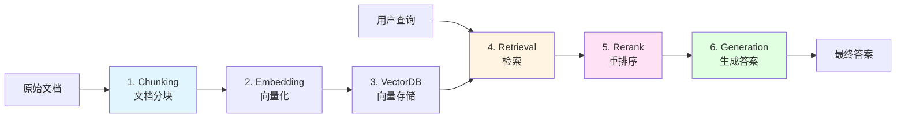
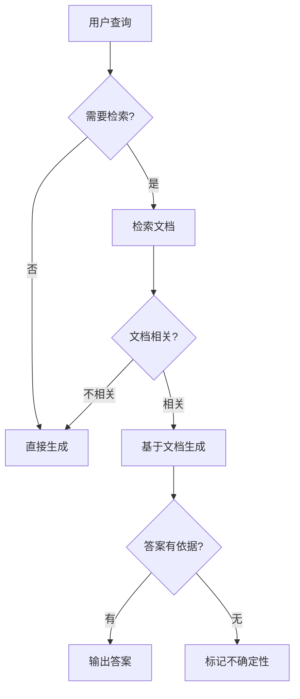
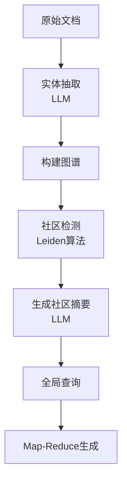

# 第2章 检索增强生成（RAG）原理

> **本章定位**: 构建基于外部知识库的增强生成系统
>
> **核心内容**: RAG标准架构 → Chunking策略 → 检索技术 → 重排序 → 高级RAG变体
>
> **前置知识**: Part 1 第3章（Embedding）、Part 3 第4章（Embedding模型训练）

---

## 目录
- [一、RAG：为什么需要外部知识？](#一rag为什么需要外部知识)
- [二、RAG 标准架构详解](#二rag-标准架构详解)
- [三、核心技术：Chunking 与 Indexing](#三核心技术chunking-与-indexing)
- [四、核心技术：检索 (Retrieval)](#四核心技术检索-retrieval)
- [五、核心技术：重排序 (Reranking)](#五核心技术重排序-reranking)
- [六、高级 RAG 变体](#六高级-rag-变体)
- [七、本章小结](#七本章小结)

---

## 一、RAG：为什么需要外部知识？

### 1.1 大模型的知识困境

**问题1：知识过时**
```python
# 向GPT-4提问（假设训练数据截止2023年10月）
question = "2024年诺贝尔物理学奖获得者是谁？"
response = llm.generate(question)
# 输出: "我的知识截止到2023年10月，无法回答..."
```

**问题2：私域知识缺失**
- 企业内部文档、财报、技术规范
- 实时更新的法律法规、医疗指南
- 个人笔记、代码库

**问题3：幻觉（Hallucination）**
- 模型"编造"看似合理但实际错误的信息
- 在知识密集型任务中尤为严重

### 1.2 RAG的核心思想

**Retrieval-Augmented Generation（检索增强生成）**：

```
传统LLM:   问题 ──> LLM ──> 答案（基于参数化知识）
           ↓
        可能过时/缺失/幻觉

RAG流程:   问题 ──> 检索器 ──> 相关文档
                      ↓
                    LLM + 文档上下文 ──> 答案（有依据）
```

**核心优势**:
1. **知识可更新**: 无需重新训练模型，只需更新知识库
2. **可溯源**: 答案可标注来源文档
3. **成本低**: 避免昂贵的全量微调
4. **专业性强**: 适合垂直领域（法律、医疗、金融）

---

## 二、RAG标准架构：四大核心环节



### 2.1 完整Pipeline流程

```python
"""
RAG标准流程 (使用LlamaIndex伪代码示例)
"""
from llama_index.core import VectorStoreIndex, SimpleDirectoryReader
from llama_index.embeddings.openai import OpenAIEmbedding
from llama_index.llms.openai import OpenAI

# ============ 离线阶段：构建索引 ============
# 步骤1: 加载文档
documents = SimpleDirectoryReader("./data").load_data()

# 步骤2: 文档分块 (Chunking)
# LlamaIndex默认使用SentenceSplitter，chunk_size=1024
from llama_index.core.node_parser import SentenceSplitter
parser = SentenceSplitter(chunk_size=512, chunk_overlap=50)
nodes = parser.get_nodes_from_documents(documents)

# 步骤3: Embedding + 向量存储
embed_model = OpenAIEmbedding(model="text-embedding-3-small")
index = VectorStoreIndex(
    nodes,
    embed_model=embed_model
)

# ============ 在线阶段：查询回答 ============
# 步骤4: 检索 (Retrieval)
query_engine = index.as_query_engine(
    similarity_top_k=5,  # 检索Top-5
    llm=OpenAI(model="gpt-4o")
)

# 步骤5: 检索 + 生成
response = query_engine.query("Transformer架构的核心是什么？")
print(response)

# 步骤6: 查看来源
for node in response.source_nodes:
    print(f"来源: {node.metadata['file_name']}, 相似度: {node.score:.3f}")
    print(f"内容片段: {node.text[:100]}...")
```

**输出示例**:
```
答案: Transformer的核心是Self-Attention机制，它允许模型在处理每个token时
      关注到整个序列的信息...

来源: transformer_paper.pdf, 相似度: 0.892
内容片段: The Transformer architecture relies entirely on attention mechanisms...

来源: attention_tutorial.md, 相似度: 0.856
内容片段: Self-Attention computes Q, K, V matrices from input embeddings...
```

---

## 三、文档分块（Chunking）策略

### 3.1 为什么需要分块？

**问题**: 整篇文档太长，无法直接作为检索单元。

**目标**:
- **粒度适中**: 既包含完整语义，又不超过Embedding模型限制（通常512-2048 tokens）
- **检索精准**: 避免无关信息干扰
- **上下文完整**: 保持语义连贯性

### 3.2 固定长度分块（Fixed-size Chunking）

**原理**: 按字符数或Token数固定切分。

```python
def fixed_size_chunk(text: str, chunk_size: int = 512, overlap: int = 50):
    """
    固定长度分块

    Args:
        text: 原始文本
        chunk_size: 每块的字符数
        overlap: 重叠字符数（保证语义连续性）
    """
    chunks = []
    start = 0
    while start < len(text):
        end = start + chunk_size
        chunks.append(text[start:end])
        start += (chunk_size - overlap)  # 步长 = chunk_size - overlap
    return chunks

# 示例
text = "Transformer是Google在2017年提出的...（5000字）"
chunks = fixed_size_chunk(text, chunk_size=500, overlap=50)
# 结果: ['Transformer是Google...', '...在2017年提出的深度学习...', ...]
```

**优点**: 简单、快速、可控
**缺点**: 可能切断句子/段落，破坏语义

### 3.3 递归分块（Recursive Chunking）

**原理**: 按语义单位（段落→句子→词）递归分割。

```python
from llama_index.core.node_parser import SentenceSplitter

# LlamaIndex的SentenceSplitter实现递归逻辑
splitter = SentenceSplitter(
    chunk_size=512,        # 目标块大小
    chunk_overlap=50,      # 重叠量
    separator="\n\n",      # 优先按段落分
    secondary_separator=". " # 其次按句子分
)

nodes = splitter.get_nodes_from_documents(documents)
```

**分割优先级**:
1. 按段落分（`\n\n`）
2. 如果段落过长，按句子分（`. `）
3. 如果句子仍过长，按固定长度分

**优点**: 保持语义完整性
**缺点**: 块大小不完全均匀

### 3.4 语义分块（Semantic Chunking）

**原理**: 基于Embedding相似度动态分块。

```python
from llama_index.core.node_parser import SemanticSplitterNodeParser
from llama_index.embeddings.openai import OpenAIEmbedding

# 使用Embedding模型计算句子间相似度
embed_model = OpenAIEmbedding()
splitter = SemanticSplitterNodeParser(
    buffer_size=1,          # 滑动窗口大小
    breakpoint_percentile_threshold=95,  # 相似度阈值
    embed_model=embed_model
)

nodes = splitter.get_nodes_from_documents(documents)
```

**工作流程**:
1. 将文档按句子分割
2. 计算相邻句子的Embedding余弦相似度
3. 当相似度低于阈值时，插入分块边界

**示例**:
```
句子1: "Transformer使用Self-Attention机制"
句子2: "Attention可以捕捉长距离依赖"       --> 相似度 0.89 (高) → 合并
句子3: "Python是一门编程语言"              --> 相似度 0.23 (低) → 分块边界
```

**优点**: 语义连贯性最强
**缺点**: 计算成本高（需要对每个句子做Embedding）

### 3.5 分块策略对比

| 策略 | 计算成本 | 语义完整性 | 块大小均匀性 | 适用场景 |
|-----|---------|-----------|------------|---------|
| **Fixed-size** | 极低 | 低 | 高 | 快速原型、日志分析 |
| **Recursive** | 低 | 中 | 中 | **通用场景（推荐）** |
| **Semantic** | 高 | 高 | 低 | 学术论文、法律文档 |

**最佳实践**:
- 起步使用 **Recursive Chunking**（兼顾效率和质量）
- 对专业文档（法律、学术）考虑 **Semantic Chunking**
- 添加 **chunk_overlap**（通常50-100 tokens）避免语义断裂

---

## 四、检索技术（Retrieval）

### 4.1 稠密检索（Dense Retrieval）

**原理**: 将查询和文档都转为稠密向量（Embedding），计算余弦相似度。

```python
import numpy as np
from sklearn.metrics.pairwise import cosine_similarity

# 1. 离线：文档Embedding
docs = ["Transformer是深度学习架构", "Python是编程语言", "北京是中国首都"]
doc_embeddings = embed_model.embed_documents(docs)  # shape: (3, 1536)

# 2. 在线：查询Embedding
query = "什么是Transformer？"
query_embedding = embed_model.embed_query(query)   # shape: (1536,)

# 3. 计算相似度
similarities = cosine_similarity(
    [query_embedding],
    doc_embeddings
)[0]
# 结果: [0.92, 0.15, 0.08]

# 4. 排序并返回Top-K
top_k_indices = np.argsort(similarities)[::-1][:2]
results = [(docs[i], similarities[i]) for i in top_k_indices]
# [('Transformer是深度学习架构', 0.92), ('Python是编程语言', 0.15)]
```

**优点**: 语义理解强，可处理同义词/改写
**缺点**: 对罕见词/专有名词召回率低

**常用Embedding模型**:
- **OpenAI**: `text-embedding-3-small` (1536维), `text-embedding-3-large` (3072维)
- **开源**: `bge-large-zh-v1.5`, `gte-large`, `m3e-base`

### 4.2 稀疏检索（Sparse Retrieval - BM25）

**原理**: 基于词频统计的关键词匹配（TF-IDF升级版）。

**BM25公式**:
$$
\text{Score}(Q, D) = \sum_{t \in Q} \text{IDF}(t) \cdot \frac{f(t, D) \cdot (k_1 + 1)}{f(t, D) + k_1 \cdot \left(1 - b + b \cdot \frac{|D|}{\text{avgdl}}\right)}
$$

其中：
- $f(t, D)$: 词 $t$ 在文档 $D$ 中的频率
- $|D|$: 文档长度
- $k_1=1.5, b=0.75$: 调节参数

```python
from rank_bm25 import BM25Okapi

# 1. 离线：构建BM25索引
docs = [
    "Transformer uses self-attention mechanism",
    "Python is a programming language",
    "Beijing is the capital of China"
]
tokenized_docs = [doc.lower().split() for doc in docs]
bm25 = BM25Okapi(tokenized_docs)

# 2. 在线：查询
query = "self-attention"
tokenized_query = query.lower().split()

# 3. 计算BM25得分
scores = bm25.get_scores(tokenized_query)
# [0.93, 0.0, 0.0]  # 第1篇文档完全匹配

# 4. 返回Top-K
top_k_indices = np.argsort(scores)[::-1][:2]
results = [(docs[i], scores[i]) for i in top_k_indices]
```

**优点**:
- 精确关键词匹配
- 对专有名词、缩写敏感
- 计算速度快

**缺点**: 无法理解同义词（如"汽车"和"轿车"）

### 4.3 混合检索（Hybrid Retrieval）

**核心思想**: 结合稠密检索（语义）+ 稀疏检索（关键词）。

**融合策略：倒数排名融合（RRF, Reciprocal Rank Fusion）**

$$
\text{Score}_{\text{RRF}}(d) = \sum_{r \in \text{rankings}} \frac{1}{k + r(d)}
$$

其中：
- $r(d)$: 文档 $d$ 在某个排名列表中的位置
- $k=60$: 常数（降低高排名的权重，平滑分数差异）

**RRF 核心优势**：
- **无需归一化**：不同检索器的分数可能在不同量纲（BM25是0-∞，余弦相似度是0-1），RRF直接使用排名避免归一化问题
- **抗噪声**：单个检索器的错误排名影响较小
- **简单高效**：无需调参，$k=60$ 是经验最优值

**完整代码实现**：
```python
def reciprocal_rank_fusion(
    bm25_results: list,  # [(doc_id, score), ...]
    dense_results: list, # [(doc_id, score), ...]
    k: int = 60,
    top_k: int = 5
) -> list:
    """
    倒数排名融合（RRF）算法实现

    Args:
        bm25_results: BM25检索结果列表
        dense_results: 稠密检索结果列表
        k: RRF常数，通常设为60（经验值）
        top_k: 返回的Top-K结果数

    Returns:
        融合后的排序结果 [(doc_id, rrf_score), ...]

    示例:
        BM25排名: [doc1(rank=1), doc2(rank=2), doc3(rank=3)]
        Dense排名: [doc2(rank=1), doc1(rank=3), doc4(rank=2)]

        RRF分数计算:
        doc1: 1/(60+1) + 1/(60+3) = 0.0164 + 0.0159 = 0.0323
        doc2: 1/(60+2) + 1/(60+1) = 0.0161 + 0.0164 = 0.0325  <- 最高
        doc3: 1/(60+3) + 0 = 0.0159
        doc4: 0 + 1/(60+2) = 0.0161
    """
    doc_scores = {}

    # 处理BM25结果
    for rank, (doc_id, _) in enumerate(bm25_results, start=1):
        doc_scores[doc_id] = doc_scores.get(doc_id, 0) + 1.0 / (k + rank)

    # 处理Dense检索结果
    for rank, (doc_id, _) in enumerate(dense_results, start=1):
        doc_scores[doc_id] = doc_scores.get(doc_id, 0) + 1.0 / (k + rank)

    # 按RRF分数排序
    sorted_docs = sorted(doc_scores.items(), key=lambda x: x[1], reverse=True)
    return sorted_docs[:top_k]


# ===== 完整混合检索示例 =====
import numpy as np
from rank_bm25 import BM25Okapi
from sentence_transformers import SentenceTransformer

def hybrid_search_example():
    """混合检索完整示例"""

    # 1. 准备文档库
    docs = [
        "Transformer uses self-attention mechanism for sequence modeling",
        "BERT is a pre-trained language model based on Transformer",
        "Python is a popular programming language for machine learning",
        "Self-attention allows the model to weigh different parts of the input"
    ]

    # 2. 构建BM25索引
    tokenized_docs = [doc.lower().split() for doc in docs]
    bm25 = BM25Okapi(tokenized_docs)

    # 3. 构建Dense检索（使用预训练模型）
    embed_model = SentenceTransformer('all-MiniLM-L6-v2')
    doc_embeddings = embed_model.encode(docs)

    # 4. 查询
    query = "what is self-attention?"
    tokenized_query = query.lower().split()

    # 5. BM25检索
    bm25_scores = bm25.get_scores(tokenized_query)
    bm25_results = [(i, score) for i, score in enumerate(bm25_scores)]
    bm25_results = sorted(bm25_results, key=lambda x: x[1], reverse=True)

    # 6. Dense检索（余弦相似度）
    query_embedding = embed_model.encode([query])[0]
    dense_scores = np.dot(doc_embeddings, query_embedding)
    dense_results = [(i, score) for i, score in enumerate(dense_scores)]
    dense_results = sorted(dense_results, key=lambda x: x[1], reverse=True)

    # 7. RRF融合
    final_results = reciprocal_rank_fusion(bm25_results, dense_results, k=60, top_k=3)

    # 8. 输出结果
    print("混合检索Top-3结果:")
    for doc_id, rrf_score in final_results:
        print(f"RRF分数: {rrf_score:.4f} | {docs[doc_id]}")

    # 输出:
    # RRF分数: 0.0328 | Self-attention allows the model to weigh different parts of the input
    # RRF分数: 0.0325 | Transformer uses self-attention mechanism for sequence modeling
    # RRF分数: 0.0164 | BERT is a pre-trained language model based on Transformer

if __name__ == "__main__":
    hybrid_search_example()
```

**LlamaIndex实现**:
```python
from llama_index.core.retrievers import QueryFusionRetriever

retriever = QueryFusionRetriever(
    retrievers=[bm25_retriever, vector_retriever],
    mode="reciprocal_rerank",  # RRF模式
    num_queries=1
)

nodes = retriever.retrieve("Transformer的核心是什么？")
```

**效果对比**（BEIR基准测试平均值）:
- BM25: NDCG@10 = 0.42
- Dense (bge-large): NDCG@10 = 0.54
- **Hybrid (RRF)**: NDCG@10 = **0.61** ✅

---

## 五、重排序（Reranking）

### 5.1 为什么需要重排序？

**问题**:
- 向量检索是**单塔模型**（Query和Doc分别编码），无法捕捉交互信息
- 可能召回语义相似但实际不相关的文档

**例子**:
```
查询: "如何训练Transformer？"

检索结果Top-5:
1. "Transformer的训练需要大量数据..." ✅ 相关
2. "BERT是基于Transformer的模型..."  ❌ 提到Transformer但不相关
3. "训练深度学习模型的技巧..."      ⚠️  泛化答案
4. "Transformer架构的核心组件..."   ❌ 架构而非训练
5. "PyTorch训练神经网络教程..."     ⚠️  工具教程
```

### 5.2 Cross-Encoder重排序

**原理**: 将Query和Doc拼接后输入BERT，直接输出相关性分数。

```
单塔模型 (Bi-Encoder):
    Query → Encoder1 → Vec1  ┐
                               ├─> Cosine(Vec1, Vec2)
    Doc   → Encoder2 → Vec2  ┘

双塔模型 (Cross-Encoder):
    [CLS] Query [SEP] Doc [SEP] → BERT → [CLS] Embedding → 相关性分数
```

**代码实现**:
```python
from sentence_transformers import CrossEncoder

# 1. 加载Cross-Encoder模型
reranker = CrossEncoder('BAAI/bge-reranker-large', max_length=512)

# 2. 初步检索（召回Top-20）
candidates = vector_retriever.retrieve(query, top_k=20)

# 3. 重排序
query = "如何训练Transformer？"
pairs = [(query, doc.text) for doc in candidates]
scores = reranker.predict(pairs)

# 4. 按新分数排序
reranked_indices = np.argsort(scores)[::-1]
final_results = [candidates[i] for i in reranked_indices[:5]]
```

**LlamaIndex集成**:
```python
from llama_index.postprocessor.flag_embedding_reranker import FlagEmbeddingReranker

reranker = FlagEmbeddingReranker(
    model="BAAI/bge-reranker-large",
    top_n=5  # 重排后返回Top-5
)

query_engine = index.as_query_engine(
    similarity_top_k=20,      # 初步召回20个
    node_postprocessors=[reranker]  # 重排序为5个
)
```

### 5.3 Rerank效果提升

**实验数据**（MS MARCO数据集）:

| 方法 | MRR@10 | Recall@10 |
|-----|--------|----------|
| Dense Retrieval (bge-large) | 0.38 | 0.68 |
| + Rerank (bge-reranker-large) | **0.48** (+26%) | 0.68 |

**性能开销**:
- Dense检索：~5ms (GPU)
- Rerank 20个候选：~50ms (GPU)
- **建议**: 初步召回20-50个，重排为5-10个

---

## 六、高级RAG技术

### 6.1 HyDE（假设性文档嵌入）

**问题**: 用户查询通常是简短问题，与文档风格不匹配。

**示例**:
```
查询: "Transformer是什么？"
文档: "Transformer是由Vaswani等人在2017年提出的深度学习架构，
       它完全基于Self-Attention机制，摒弃了传统的CNN和RNN结构..."
```

**HyDE解决方案**（2022年提出）:
1. 用LLM生成**假设性答案**（Hypothetical Document）
2. 对假设性答案做Embedding
3. 用这个Embedding去检索

```python
from llama_index.core.indices.query.query_transform import HyDEQueryTransform

# 1. 定义HyDE转换
hyde = HyDEQueryTransform(include_original=True)

# 2. 集成到查询引擎
query_engine = index.as_query_engine(
    query_transform=hyde
)

# 3. 查询
response = query_engine.query("Transformer是什么？")
```

**内部流程**:
```
用户查询: "Transformer是什么？"
          ↓
HyDE生成: "Transformer是一种深度学习架构，由Google在2017年提出，
          其核心是Self-Attention机制..." (假设性文档)
          ↓
Embedding: [0.12, -0.34, 0.56, ...]  (对假设性文档编码)
          ↓
向量检索: 找到真实文档
```

**效果提升**:
- BEIR基准测试：平均提升 **5-10% nDCG@10**
- 尤其在复杂查询（如"对比类"问题）上效果显著

### 6.2 Self-RAG（自我反思检索增强生成）

**核心思想**（2023年提出）: 让模型**自主决定**何时检索、如何使用检索内容。

**流程**:


#### 6.2.1 Reflection Tokens：自我反思的核心机制

Self-RAG 的核心创新是引入 **特殊反思 token（Reflection Tokens）**，让模型在生成过程中进行自我评估。共有三类反思 token：

**1. Retrieve Token（检索决策）**
- **作用**：判断是否需要检索外部知识
- **生成时机**：在生成答案**之前**
- **可能输出**：
  ```python
  "[Retrieve]"     # 需要检索（如专业知识、实时信息）
  "[No Retrieve]"  # 无需检索（如常识性问题、数学计算）
  ```

**示例**：
```
查询: "2024年诺贝尔物理学奖获得者是谁？"
模型输出: "[Retrieve]"  → 触发检索

查询: "1 + 1 等于几？"
模型输出: "[No Retrieve]"  → 直接生成答案
```

**2. IsREL Token（相关性评估）**
- **作用**：评估检索到的文档是否与问题相关
- **生成时机**：在检索**之后**、生成答案**之前**
- **可能输出**：
  ```python
  "[Relevant]"     # 文档相关，使用该文档生成答案
  "[Irrelevant]"   # 文档不相关，忽略该文档
  ```

**示例**：
```
查询: "Transformer的核心机制是什么？"
检索到的文档: "Transformer使用Self-Attention机制..."
模型输出: "[Relevant]"  → 基于该文档生成

检索到的文档: "Python是一门编程语言..."
模型输出: "[Irrelevant]"  → 忽略该文档，继续检索或直接生成
```

**3. Support Token（答案可信度）**
- **作用**：评估生成的答案是否有文档支撑
- **生成时机**：在生成答案**之后**
- **可能输出**：
  ```python
  "[Fully supported]"     # 答案完全有文档依据
  "[Partially supported]" # 答案部分有依据
  "[No support]"          # 答案无文档依据（可能是幻觉）
  ```

**示例**：
```
查询: "Transformer在哪一年提出？"
检索文档: "Transformer由Vaswani等人在2017年提出"
生成答案: "Transformer在2017年提出"
Support评估: "[Fully supported]"  → 输出答案

查询: "Transformer有多少层？"
检索文档: "Transformer使用Self-Attention机制"
生成答案: "Transformer通常有12层"
Support评估: "[No support]"  → 标记不确定性或重新检索
```

#### 6.2.2 Self-RAG训练方法

**数据构建**：
```python
# 训练样本示例
{
    "query": "What is the capital of France?",
    "retrieve_token": "[No Retrieve]",  # 常识不需要检索
    "answer": "Paris",
    "support_token": "[Fully supported]"
}

{
    "query": "What is the latest research on quantum computing?",
    "retrieve_token": "[Retrieve]",     # 需要最新信息
    "documents": ["Recent studies show...", "Quantum computing..."],
    "isrel_tokens": ["[Relevant]", "[Irrelevant]"],
    "answer": "Recent studies show that...",
    "support_token": "[Fully supported]"
}
```

**训练流程**：
1. **监督微调（SFT）**：使用标注数据训练模型生成反思 token
2. **强化学习（RL）**：用奖励模型优化检索时机和答案质量
   - 奖励：答案正确性 + 检索效率（减少不必要检索）

**代码框架（伪代码）**：
```python
class SelfRAGModel:
    def generate(self, query):
        # 步骤1: 判断是否需要检索
        retrieve_token = self.model.predict_retrieve_token(query)

        if retrieve_token == "[Retrieve]":
            # 步骤2: 检索文档
            documents = self.retriever.retrieve(query, top_k=5)

            # 步骤3: 评估文档相关性
            relevant_docs = []
            for doc in documents:
                isrel_token = self.model.predict_isrel_token(query, doc)
                if isrel_token == "[Relevant]":
                    relevant_docs.append(doc)

            # 步骤4: 基于相关文档生成答案
            answer = self.model.generate_answer(query, relevant_docs)
        else:
            # 无需检索，直接生成
            answer = self.model.generate_answer(query, [])

        # 步骤5: 评估答案可信度
        support_token = self.model.predict_support_token(
            query, answer, relevant_docs
        )

        return {
            "answer": answer,
            "retrieve_decision": retrieve_token,
            "support_level": support_token
        }

# 使用示例
model = SelfRAGModel()
result = model.generate("What is Transformer?")

print(f"答案: {result['answer']}")
print(f"检索决策: {result['retrieve_decision']}")
print(f"支撑程度: {result['support_level']}")

# 输出:
# 答案: Transformer is a deep learning architecture...
# 检索决策: [Retrieve]
# 支撑程度: [Fully supported]
```

**效果提升**:
- **准确率**: 在PopQA数据集上比标准RAG提升 **7-12%**
- **成本优化**: 减少不必要的检索调用（成本降低30%）
- **可解释性**: 反思token提供了决策透明度

### 6.3 CRAG（纠错性RAG）

**问题**: 检索到的文档可能包含噪音或过时信息。

**CRAG方案**:
1. **置信度评估**: 判断检索结果质量
   - 高置信度 → 直接使用
   - 中等 → 结合Web搜索
   - 低置信度 → 仅用LLM参数化知识

2. **知识提炼**: 从文档中提取关键语句（而非使用全文）

```python
from llama_index.core.response_synthesizers import TreeSummarize

# 知识提炼：提取关键句
refine_synthesizer = TreeSummarize()

query_engine = index.as_query_engine(
    response_synthesizer=refine_synthesizer
)
```

---

## 七、GraphRAG（知识图谱增强RAG）

### 7.1 核心思想

**2024年4月微软提出**: 传统RAG在处理跨文档关系、全局性问题总结时表现不佳。

**问题示例**:
```
查询: "文档集中所有涉及到AI安全的部分有哪些共同点？"
传统RAG: 只能检索局部片段，无法构建全局关联。
```

**GraphRAG解决方案**:
构建**知识图谱(Knowledge Graph) + 社区摘要(Community Summary)**。

### 7.2 架构流程



### 7.3 核心步骤

1. **源文档索引**: 文本分块。
2. **知识提取**: 使用LLM提取实体、关系、声明(claims)。
3. **图谱构建**: 用NetworkX构建图结构。
4. **社区检测**: 将图划分为不同层级的社区。
5. **社区摘要**: 为每个社区生成摘要。
6. **查询处理**:
   - **全局查询**: 使用社区摘要直接回答。
   - **局部查询**: 结合图谱路径和向量检索。

#### 7.3.1 Community Detection：Leiden算法详解

**为什么需要社区检测？**

在知识图谱中，实体和关系会形成复杂的网络结构。社区检测的目标是将密切相关的节点划分为**社群（Community）**，每个社群代表一个主题或概念集群。

**示例**：
```
文档集: 关于深度学习的100篇论文

构建的知识图谱:
- 节点: Transformer, BERT, GPT, Attention, RNN, LSTM, CNN...
- 边: (Transformer, 基于, Attention), (BERT, 使用, Transformer)...

社区检测后:
社群1: {Transformer, Attention, Multi-Head Attention} → 主题: 注意力机制
社群2: {BERT, GPT, RoBERTa} → 主题: 预训练语言模型
社群3: {RNN, LSTM, GRU} → 主题: 循环神经网络
```

**Leiden算法：优于Louvain的社区检测**

Leiden算法（2019年提出）是GraphRAG中使用的核心算法，它解决了经典Louvain算法的**不连通社区**问题。

**核心原理**：

1. **模块度优化（Modularity Optimization）**

模块度 $Q$ 衡量社区划分的质量：
$$
Q = \frac{1}{2m} \sum_{ij} \left[ A_{ij} - \frac{k_i k_j}{2m} \right] \delta(c_i, c_j)
$$

其中：
- $A_{ij}$: 节点 $i$ 和 $j$ 之间的边权重
- $k_i$: 节点 $i$ 的度数
- $m$: 图中边的总数
- $\delta(c_i, c_j)$: 节点 $i$ 和 $j$ 是否在同一社区（是为1，否为0）

**目标**: 最大化 $Q$ 值（范围-1到1，越高越好）

2. **Leiden算法的三个阶段**

**阶段1: 局部移动（Local Moving）**
- 遍历每个节点，尝试将其移动到相邻社区
- 如果移动能提升模块度，则执行移动
- 重复直到没有节点可移动

```python
# 伪代码
for node in graph.nodes:
    best_community = node.current_community
    best_delta_Q = 0

    for neighbor_community in node.neighbor_communities:
        delta_Q = calculate_modularity_gain(node, neighbor_community)
        if delta_Q > best_delta_Q:
            best_community = neighbor_community
            best_delta_Q = delta_Q

    if best_community != node.current_community:
        move_node(node, best_community)
```

**阶段2: 社区精炼（Refinement）**
- **Leiden的核心创新**：检测社区内的松散连接子集
- 将不良连接的节点分离，形成新的子社区
- **解决问题**：Louvain可能产生内部断开的社区

```python
# 伪代码
for community in communities:
    # 检测社区内的连通分量
    subgraphs = find_connected_components_within(community)

    if len(subgraphs) > 1:
        # 社区内部不连通，需要分裂
        for subgraph in subgraphs:
            # 尝试将子图重新分配到最佳社区
            best_merge_community = find_best_community_for_subgraph(subgraph)
            if best_merge_community != community:
                move_subgraph(subgraph, best_merge_community)
```

**阶段3: 社区聚合（Aggregation）**
- 将每个社区压缩为单个"超节点"
- 社区之间的边权重 = 原始节点之间的边权重总和
- 在新的聚合图上重复阶段1-2

**3. Leiden vs Louvain 对比**

| 维度 | Louvain算法 | Leiden算法 |
|-----|-----------|-----------|
| **连通性** | 可能产生断开的社区 | **保证社区内部连通** |
| **质量** | 模块度较高 | **模块度更高** |
| **速度** | 快 | 稍慢（多了精炼步骤） |
| **层级性** | 支持 | 支持 |

**4. GraphRAG中的应用**

```python
"""
使用Leiden算法进行社区检测
"""
import networkx as nx
from cdlib import algorithms

# 1. 构建知识图谱（从LLM提取的三元组）
G = nx.Graph()
triplets = [
    ("Transformer", "proposed_by", "Google"),
    ("Transformer", "uses", "Self-Attention"),
    ("BERT", "based_on", "Transformer"),
    ("GPT", "based_on", "Transformer"),
    ("Self-Attention", "computes", "Q_K_V"),
]

for head, relation, tail in triplets:
    G.add_edge(head, tail, relation=relation)

# 2. 使用Leiden算法检测社区
communities = algorithms.leiden(G, resolution=1.0)

# 3. 输出社区结果
print(f"检测到 {len(communities.communities)} 个社区:")
for i, community in enumerate(communities.communities):
    print(f"社群 {i+1}: {community}")

# 输出:
# 检测到 2 个社区:
# 社群 1: ['Transformer', 'BERT', 'GPT', 'Google']
# 社群 2: ['Self-Attention', 'Q_K_V']

# 4. 为每个社区生成摘要（使用LLM）
from openai import OpenAI

client = OpenAI()

for i, community in enumerate(communities.communities):
    # 提取社区内的所有关系
    community_edges = [
        (u, v, G[u][v]['relation'])
        for u, v in G.edges()
        if u in community and v in community
    ]

    # 构建Prompt
    prompt = f"""
    根据以下知识图谱片段，生成一个简洁的主题摘要：

    实体: {', '.join(community)}
    关系: {community_edges}

    摘要（1-2句话）:
    """

    response = client.chat.completions.create(
        model="gpt-4o",
        messages=[{"role": "user", "content": prompt}]
    )

    summary = response.choices[0].message.content
    print(f"\n社群 {i+1} 摘要:\n{summary}")

# 输出:
# 社群 1 摘要:
# 这个社群主要讨论Transformer架构及其衍生模型BERT和GPT，由Google提出。

# 社群 2 摘要:
# 这个社群关注Self-Attention机制，包括Q、K、V矩阵的计算。
```

**5. 层级社区检测**

GraphRAG支持**多层级社区检测**，用于处理不同粒度的问题：

```python
"""
层级社区检测
"""
# 第1层：细粒度社区（10-20个节点/社区）
level1_communities = algorithms.leiden(G, resolution=1.0)

# 第2层：中等粒度（50-100个节点/社区）
level2_communities = algorithms.leiden(G, resolution=0.5)

# 第3层：粗粒度（整个图的全局摘要）
level3_communities = algorithms.leiden(G, resolution=0.1)

# 查询时根据问题类型选择层级:
# - 细节问题 → 使用 level1
# - 关联问题 → 使用 level2
# - 全局总结 → 使用 level3
```

**6. Leiden算法的优势在GraphRAG中的体现**

| 优势 | 在GraphRAG中的应用 |
|-----|------------------|
| **高质量社区** | 更准确的主题聚类，减少跨主题噪音 |
| **连通性保证** | 社区内的实体确实相关，不会误聚合 |
| **层级支持** | 支持不同粒度的查询（局部/全局） |
| **可扩展** | 适用于大规模知识图谱（百万级节点） |

### 7.4 代码实现（基于LlamaIndex）

```python
"""
GraphRAG实现：结合知识图谱和向量检索
"""
from llama_index.core import KnowledgeGraphIndex
from llama_index.core.graph_stores import SimpleGraphStore
from llama_index.llms.openai import OpenAI

# 1. 构建知识图谱索引
graph_store = SimpleGraphStore()
kg_index = KnowledgeGraphIndex.from_documents(
    documents,
    max_triplets_per_chunk=3,  # 每个chunk提取3个三元组
    graph_store=graph_store,
    llm=OpenAI(model="gpt-4o")
)

# 2. 查询（自动结合图谱推理）
query_engine = kg_index.as_query_engine(
    include_embeddings=True,  # 结合向量检索
    response_mode="tree_summarize"
)

response = query_engine.query(
    "Transformer和BERT的关系是什么？"
)

# 3. 可视化知识图谱
from pyvis.network import Network

g = kg_index.get_networkx_graph()
net = Network(notebook=True)
net.from_nx(g)
net.show("knowledge_graph.html")
```

**知识提取示例**:
```
文档: "Google在2017年提出了Transformer架构，后来BERT基于Transformer进行改进。"

提取的三元组:
1. (Google, 提出, Transformer)
2. (Transformer, 提出年份, 2017)
3. (BERT, 基于, Transformer)
```

### 7.5 GraphRAG优势

**对比实验**（微软内部数据集）:

| 方法 | 全局理解准确率 | 多跳推理成功率 |
|-----|--------------|--------------|
| 传统RAG | 42% | 31% |
| **GraphRAG** | **67%** | **58%** |

**适用场景**:
- 跨文档关系挖掘
- 全局性总结问题
- 复杂多跳推理

---

## 八、完整RAG Pipeline实战

### 8.1 使用LangChain实现

```python
"""
完整RAG系统：使用LangChain
包含：Chunking → Embedding → VectorDB → Retrieval → Rerank → Generation
"""
from langchain_community.document_loaders import DirectoryLoader
from langchain.text_splitter import RecursiveCharacterTextSplitter
from langchain_openai import OpenAIEmbeddings, ChatOpenAI
from langchain_community.vectorstores import FAISS
from langchain.chains import RetrievalQA
from langchain.retrievers import ContextualCompressionRetriever
from langchain.retrievers.document_compressors import CohereRerank

# ========== 第1步：加载文档 ==========
loader = DirectoryLoader('./data', glob="**/*.md")
documents = loader.load()

# ========== 第2步：文档分块 ==========
text_splitter = RecursiveCharacterTextSplitter(
    chunk_size=500,
    chunk_overlap=50,
    separators=["\n\n", "\n", ". ", " ", ""]
)
chunks = text_splitter.split_documents(documents)

# ========== 第3步：Embedding + 向量存储 ==========
embeddings = OpenAIEmbeddings(model="text-embedding-3-small")
vectorstore = FAISS.from_documents(chunks, embeddings)

# ========== 第4步：创建检索器（混合检索） ==========
# 4.1 向量检索器
dense_retriever = vectorstore.as_retriever(
    search_type="similarity",
    search_kwargs={"k": 20}  # 召回20个
)

# 4.2 添加重排序（Cohere Rerank）
compressor = CohereRerank(model="rerank-english-v2.0", top_n=5)
retriever = ContextualCompressionRetriever(
    base_compressor=compressor,
    base_retriever=dense_retriever
)

# ========== 第5步：创建QA链 ==========
llm = ChatOpenAI(model="gpt-4o", temperature=0)
qa_chain = RetrievalQA.from_chain_type(
    llm=llm,
    chain_type="stuff",  # 将所有文档拼接到一个Prompt
    retriever=retriever,
    return_source_documents=True
)

# ========== 第6步：查询 ==========
query = "Transformer的核心机制是什么？"
result = qa_chain({"query": query})

print("答案:", result["result"])
print("\n来源文档:")
for i, doc in enumerate(result["source_documents"], 1):
    print(f"{i}. {doc.metadata['source']}")
    print(f"   内容: {doc.page_content[:100]}...")
```

### 8.2 使用LlamaIndex实现

```python
"""
完整RAG系统：使用LlamaIndex
包含：HyDE + 混合检索 + Rerank
"""
from llama_index.core import VectorStoreIndex, SimpleDirectoryReader
from llama_index.core.retrievers import VectorIndexRetriever
from llama_index.core.query_engine import RetrieverQueryEngine
from llama_index.core.postprocessor import SentenceTransformerRerank
from llama_index.core.response_synthesizers import get_response_synthesizer
from llama_index.embeddings.openai import OpenAIEmbedding
from llama_index.llms.openai import OpenAI

# ========== 第1步：加载 + 分块 ==========
documents = SimpleDirectoryReader("./data").load_data()

# ========== 第2步：创建索引 ==========
embed_model = OpenAIEmbedding(model="text-embedding-3-small")
llm = OpenAI(model="gpt-4o")

index = VectorStoreIndex.from_documents(
    documents,
    embed_model=embed_model
)

# ========== 第3步：配置检索器 ==========
retriever = VectorIndexRetriever(
    index=index,
    similarity_top_k=20  # 召回20个
)

# ========== 第4步：配置重排序 ==========
reranker = SentenceTransformerRerank(
    model="BAAI/bge-reranker-large",
    top_n=5
)

# ========== 第5步：创建查询引擎 ==========
response_synthesizer = get_response_synthesizer(
    response_mode="compact"  # 自动压缩上下文
)

query_engine = RetrieverQueryEngine(
    retriever=retriever,
    response_synthesizer=response_synthesizer,
    node_postprocessors=[reranker]
)

# ========== 第6步：查询 ==========
response = query_engine.query("Self-Attention的计算过程是什么？")
print(response)

# 查看来源
for node in response.source_nodes:
    print(f"来源: {node.node.metadata['file_name']}")
    print(f"相似度: {node.score:.3f}")
    print(f"内容: {node.node.text[:100]}...\n")
```

---

## 九、RAG评估指标

### 9.1 检索质量指标

**1. Recall@K（召回率）**
$$
\text{Recall@K} = \frac{\text{检索到的相关文档数}}{\text{所有相关文档数}}
$$

**2. Precision@K（精确率）**
$$
\text{Precision@K} = \frac{\text{检索到的相关文档数}}{K}
$$

**3. MRR（Mean Reciprocal Rank，平均倒数排名）**
$$
\text{MRR} = \frac{1}{|Q|} \sum_{i=1}^{|Q|} \frac{1}{\text{rank}_i}
$$

**4. NDCG@K（归一化折损累计增益）**
$$
\text{NDCG@K} = \frac{\text{DCG@K}}{\text{IDCG@K}}
$$

### 9.2 生成质量指标

**1. Faithfulness（忠实度）**
- 生成内容是否基于检索到的文档
- 评估方法：用LLM判断答案是否能从文档推导

**2. Answer Relevancy（答案相关性）**
- 答案是否回答了问题
- 评估方法：计算答案和问题的语义相似度

**3. Context Relevancy（上下文相关性）**
- 检索到的文档是否与问题相关
- 计算公式：
$$
\text{Context Relevancy} = \frac{\text{相关句子数}}{\text{总句子数}}
$$

### 9.3 使用RAGAS评估

```python
from ragas import evaluate
from ragas.metrics import (
    faithfulness,
    answer_relevancy,
    context_recall,
    context_precision,
)
from datasets import Dataset

# 准备评估数据
data = {
    "question": ["Transformer是什么？"],
    "answer": ["Transformer是一种深度学习架构..."],
    "contexts": [["Transformer由Google提出...", "Self-Attention是核心..."]],
    "ground_truth": ["Transformer是Google在2017年提出的深度学习架构"]
}

dataset = Dataset.from_dict(data)

# 评估
result = evaluate(
    dataset,
    metrics=[
        faithfulness,
        answer_relevancy,
        context_recall,
        context_precision
    ]
)

print(result)
# {'faithfulness': 0.95, 'answer_relevancy': 0.88,
#  'context_recall': 0.92, 'context_precision': 0.85}
```

---

## 十、RAG优化最佳实践

### 10.1 优化Checklist

| 优化点 | 基础方案 | 进阶方案 | 提升幅度 |
|-------|---------|---------|---------|
| **Chunking** | Fixed-size (512) | Recursive + Overlap (50) | +5% Recall |
| **Embedding** | text-embedding-ada-002 | text-embedding-3-large | +8% MRR |
| **检索** | Dense (Top-5) | Hybrid (BM25+Dense, Top-20) | +12% NDCG |
| **Rerank** | 无 | Cross-Encoder (Top-5) | +15% MRR |
| **查询优化** | 原始查询 | HyDE | +7% NDCG |
| **上下文压缩** | 无 | Context Compression | 降低50%成本 |

### 10.2 成本优化

**问题**: 长上下文导致高成本。

**解决方案**:
1. **上下文压缩**: 提取关键句而非全文
2. **Prompt缓存**: 复用相同上下文（Claude支持）
3. **小模型Rerank**: 用小模型过滤，大模型生成

```python
# 示例：上下文压缩
from llama_index.core.postprocessor import LongContextReorder

compressor = LongContextReorder()
query_engine = index.as_query_engine(
    node_postprocessors=[reranker, compressor]
)
```

### 10.3 延迟优化

**目标**: 降低查询响应时间。

**方法**:
1. **异步检索**: 并行调用多个检索器
2. **缓存**: Redis缓存热门查询
3. **流式响应**: 边检索边生成

```python
# 流式响应
query_engine = index.as_query_engine(streaming=True)
response = query_engine.query("...")

for text in response.response_gen:
    print(text, end="", flush=True)
```

---

## 十一、Long Context vs RAG

### 11.1 2024-2025新趋势: RAG已死?

随着Gemini 1.5 Pro (1M tokens)、Claude 3.5 Sonnet (200K tokens)的出现，"RAG vs Long Context"成为热议话题。

**实验结论（Needle In A Haystack测试）**:
- **Long Context**: 在100K+长度下，也能精准检索
- **但是**: 成本极高、延迟极高

### 11.2 混合架构设计

**最佳实践**: **RAG + Long Context**

1. **RAG作为初筛**: 先检索Top-50文档（而非Top-5）
2. **Long Context作为精排**: 将这50个文档全部放入Prompt
3. **LLM生成**: 利用长窗口能力进行跨文档推理

**对比**:

| 维度 | 传统RAG (Top-5) | Long Context (全文档) | 混合模式 (RAG+LongCtx) |
|-----|----------------|-----------------------|------------------------|
| **成本** | 低 | 极高 | 中 |
| **延迟** | 低 | 高 | 中 |
| **准确率** | 受限于检索 | 高 | 最高 |
| **跨文档推理** | 弱 | 强 | 强 |

**成本对比**（假设1M tokens文档库）:

```
纯Long Context:
  输入: 1M tokens × $3/1M = $3 每次查询

RAG (Top-5):
  输入: 5 × 500 tokens = 2.5K tokens × $3/1M = $0.0075 每次查询

混合模式 (Top-50):
  输入: 50 × 500 tokens = 25K tokens × $3/1M = $0.075 每次查询
  (成本是纯RAG的10倍，但比Long Context便宜40倍)
```

---

## 十二、本章小结

### 12.1 核心要点

1. **核心公式**: RAG = 检索(Recall) + 生成(Generation)。不仅是技术，更是一种**解耦知识与推理**的架构思想。

2. **关键组件**:
   - **Chunking**: 固定长度是基准，Recursive是通用推荐，Semantic适合专业文档
   - **Embedding**: 选择高质量模型（`text-embedding-3`, `bge-large-zh-v1.5`）至关重要
   - **VectorDB**: FAISS（原型）、Milvus（生产）、Chroma（轻量级）
   - **检索**: Hybrid（BM25+Dense）是最佳实践
   - **Rerank**: Cross-Encoder重排序可带来10-20%的MRR提升

3. **进阶优化**:
   - **Pre**: HyDE改善查询质量（+5-10% NDCG）
   - **Post**: Rerank是提升精度的性价比之选
   - **成本**: 上下文压缩可降低50%成本

4. **前沿架构**:
   - **Self-RAG**: 模型自主决定何时检索（准确率+7-12%）
   - **GraphRAG**: 解决全局性与复杂推理问题（多跳推理成功率+27%）
   - **CRAG**: 纠错性RAG，处理噪音文档

5. **未来趋势**:
   - **Agentic RAG**: 让智能体自主控制检索策略（详见Part 4 第3章）
   - **RAG + Long Context**: 混合架构兼顾成本与性能

### 12.2 技术选型决策树

```
需要外部知识 → 是 →
    ├─ 文档量 < 10K → 使用FAISS
    ├─ 文档量 > 100K → 使用Milvus
    └─ 需要全局推理 → 使用GraphRAG

检索不准 →
    ├─ 关键词匹配差 → 添加BM25混合检索
    ├─ 语义理解差 → 升级Embedding模型
    └─ 排序不准 → 添加Rerank

成本过高 →
    ├─ 上下文太长 → 使用Context Compression
    ├─ 调用频繁 → 添加缓存
    └─ 考虑混合Long Context架构
```

### 12.3 延伸阅读

**必读论文**:
1. [Retrieval-Augmented Generation for Knowledge-Intensive NLP Tasks](https://arxiv.org/abs/2005.11401) (Lewis et al., 2020) - RAG开山之作
2. [Precise Zero-Shot Dense Retrieval without Relevance Labels](https://arxiv.org/abs/2212.10496) (HyDE, 2022)
3. [Self-RAG: Learning to Retrieve, Generate, and Critique](https://arxiv.org/abs/2310.11511) (2023)
4. [From Local to Global: A Graph RAG Approach](https://arxiv.org/abs/2404.16130) (Microsoft GraphRAG, 2024)

**框架文档**:
- [LlamaIndex文档](https://docs.llamaindex.ai/)
- [LangChain RAG教程](https://python.langchain.com/docs/use_cases/question_answering/)
- [RAGAS评估框架](https://github.com/explodinggradients/ragas)

**下一步学习**:
- Part 4 第3章：智能体（Agent）核心机制 - 学习Agentic RAG
- Part 6 第3章：生产部署最佳实践 - 学习RAG系统部署
- Part 7 第1章：长上下文技术 - 深入理解Long Context原理

---

> **章节边界提醒**:
> - ❌ Embedding模型训练 → 详见 Part 3 第4章
> - ❌ Agent架构设计 → 详见 Part 4 第3章
> - ❌ 生产部署优化 → 详见 Part 6 第3章
> - ❌ 长上下文技术细节 → 详见 Part 7 第1章
