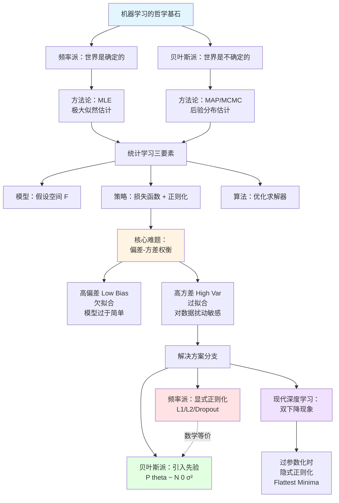

# 第01章：机器学习概览

> "All models are wrong, but some are useful." —— George Box
>
> **重要提示**：本章不仅是概念的堆砌，更是**世界观**的建立。
>
> 我们将深入探讨**频率派与贝叶斯派**的百年纠葛，这不仅仅是数学流派之争，更是我们认知世界的两种底层逻辑。此外，我们还将突破传统的教科书，带你领略现代深度学习中颠覆性的**"双下降" (Double Descent)** 现象，看看传统理论在过参数化时代是如何被挑战的。

---

## 目录

- [一、世界观的碰撞：频率派 vs 贝叶斯派](#一世界观的碰撞频率派-vs-贝叶斯派)
  - [1.1 频率派 (The Frequentist View)](#11-频率派-the-frequentist-view)
  - [1.2 贝叶斯派 (The Bayesian View)](#12-贝叶斯派-the-bayesian-view)
  - [1.3 核心案例推导：抛硬币的哲学](#13-核心案例推导抛硬币的哲学)
- [二、统计学习三要素：解构算法的万能公式](#二统计学习三要素解构算法的万能公式)
  - [2.1 模型 (Model)](#21-模型-model)
  - [2.2 策略 (Strategy)](#22-策略-strategy)
  - [2.3 数学证明：为什么正则化等价于先验？](#23-数学证明为什么正则化等价于先验)
  - [2.4 算法 (Algorithm)](#24-算法-algorithm)
- [三、核心难题：偏差-方差权衡 (Bias-Variance Tradeoff)](#三核心难题偏差-方差权衡-bias-variance-tradeoff)
- [四、实战演练：亲眼目睹过拟合与正则化](#四实战演练亲眼目睹过拟合与正则化)
- [五、拓展深入：当传统理论失效——双下降现象](#五拓展深入当传统理论失效双下降现象)
- [六、本章小结](#六本章小结)

---

## 一、世界观的碰撞：频率派 vs 贝叶斯派

统计机器学习领域长期存在着两个对立统一的流派。理解这个对立，对后续理解正则化（Regularization）和概率图模型（PGM）至关重要。

### 1.1 频率派 (The Frequentist View)

*   **核心信仰**：**世界是确定的**。参数 $\theta$ 是一个**未知但固定的常量** (Unknown Constant)。虽然我们不知道它具体是多少，但它真真切切地在那里，不增不减。
*   **方法论**：**极大似然估计 (MLE)**。
    $$ \hat{\theta}_{MLE} = \arg\max_{\theta} P(X|\theta) $$
    > **直觉**：既然 $\theta$ 是固定的，那就找一个 $\theta$，使得"观测到当前数据 $X$"这一事件发生的概率最大。

    但是，MLE 的这个公式在绝大多数情况下**并没有解析解**（除了少数简单模型如高斯分布的均值估计）。因此，我们必须借助**数值优化方法**（如梯度下降）来迭代求解。这就引出了频率派的核心技术路线：

*   **演进路线**：频率派将机器学习视为一个**优化问题 (Optimization)**。
    $$ \mathcal{L}(\theta) \rightarrow \nabla_\theta \mathcal{L} \rightarrow \theta_{t+1} = \theta_t - \eta g $$
    *   **代表算法**：线性回归、逻辑回归、SVM、神经网络 (BackProp)。

### 1.2 贝叶斯派 (The Bayesian View)

*   **核心信仰**：**世界是不确定的**。参数 $\theta$ 本身是一个**随机变量** (Random Variable)，它服从某个分布。数据 $X$ 反而是固定的证据 (Evidence)。
*   **方法论**：**贝叶斯定理 (Bayes' Theorem)**。
    $$ P(\theta|X) = \frac{P(X|\theta)P(\theta)}{P(X)} $$
    *   $P(\theta|X)$：**后验 (Posterior)** —— 看了数据修正后的信念。
    *   $P(X|\theta)$：**似然 (Likelihood)** —— 数据所呈现的样子。
    *   $P(\theta)$：**先验 (Prior)** —— 看数据之前的主观信念（这很重要！）。
*   **最大后验估计 (MAP)**：如果我们被迫给出一个具体的数值，而不是分布：
    $$ \hat{\theta}_{MAP} = \arg\max_{\theta} P(\theta|X) = \arg\max_{\theta} \underbrace{\log P(X|\theta)}_{\text{Likelihood}} + \underbrace{\log P(\theta)}_{\text{Prior}} $$
    > **洞见**：$\hat{\theta}_{MLE}$ 其实就是 $P(\theta)$ 为均匀分布时的 $\hat{\theta}_{MAP}$！MLE 是 MAP 的特例。
    > **正则化本质**：L2 正则化其实等价于引入了 **高斯先验** 的 MAP；L1 正则化等价于 **拉普拉斯先验**。
*   **演进路线**：贝叶斯派将机器学习视为一个**积分问题 (Integration)**。
    $$ P(x_{new}|X) = \int P(x_{new}|\theta) P(\theta|X) d\theta $$
    *   **代表算法**：朴素贝叶斯、LDA主题模型、高斯过程、变分自动编码器 (VAE)。

---

> **从抽象到具体：让公式活起来**
>
> 到这里，频率派和贝叶斯派的公式都已摆在眼前。但老实说，光看公式很难真正理解两者的差异——什么是"先验被淹没"？什么是"正则化等价于先验"？这些话术听起来玄乎，却缺少实感。
>
> 接下来，让我们用**抛硬币**这个最简单的案例，亲手推导一遍 MLE 和 MAP。你会看到：MLE 如何因数据稀疏而过拟合，贝叶斯先验如何通过"伪计数"优雅地约束参数空间，以及当数据量趋于无穷时，先验如何自动退场。这个推导将成为我们理解正则化、主题模型、变分推断等高级技术的基石。

### 1.3 核心案例推导：抛硬币的哲学

> **为什么要推导这个？**
>
> 抛硬币虽然简单，但它是理解 MLE 与 MAP 差异的最佳载体。通过这个推导，你会明白：
> - MLE 在数据少时为何容易过拟合
> - 贝叶斯先验如何在数学上"约束"参数空间
> - 为什么 Beta 分布是二项分布的共轭先验
> - 当数据量 $N \to \infty$ 时，先验如何被"淹没"

#### 1.3.1 问题设定

假设有一枚硬币，正面朝上的概率为 $\theta$（未知）。我们抛了 $N$ 次，观测到：
- $H$ 次正面 (Heads)
- $T$ 次反面 (Tails)，其中 $N = H + T$

**目标**：估计参数 $\theta$。

---

#### 1.3.2 频率派：极大似然估计 (MLE)

**Step 1：写出似然函数**

每次抛硬币是独立的伯努利试验，因此观测到数据 $D = \{H, T\}$ 的概率为：

$$
P(D|\theta) = \theta^H (1-\theta)^T
$$

**Step 2：对数似然函数**

为了求导方便，取对数：

$$
\log P(D|\theta) = H \log \theta + T \log(1-\theta)
$$

**Step 3：求导并令其为零**

$$
\frac{\partial}{\partial \theta} \log P(D|\theta) = \frac{H}{\theta} - \frac{T}{1-\theta} = 0
$$

解得：

$$
\boxed{\hat{\theta}_{MLE} = \frac{H}{H+T} = \frac{H}{N}}
$$

**直觉**：MLE 就是频率派的"经验频率"。

---

#### 1.3.3 MLE 的致命缺陷

> **思考**：如果我们只抛了 5 次硬币，全是正面（$H=5, T=0$），MLE 会给出 $\hat{\theta}_{MLE} = 1$。这意味着这枚硬币 100% 会正面朝上，这合理吗？

这就是 **过拟合 (Overfitting)** 的典型表现：MLE 完全依赖当前数据，没有任何"常识"约束。当数据量很少时，估计结果极其不稳定。

---

#### 1.3.4 贝叶斯派：最大后验估计 (MAP)

**Step 1：引入先验分布**

贝叶斯派认为 $\theta$ 本身是随机变量，应该有一个先验分布 $P(\theta)$。

但问题来了：先验分布有无数种选择（高斯、均匀、指数...），我们该选哪一个？答案是：**选择共轭先验 (Conjugate Prior)**。

> **为什么选择共轭先验？**
>
> 共轭先验有一个神奇的性质：**先验和后验属于同一分布族**。这意味着：
> - 如果先验是 Beta 分布，那么看了数据后，后验仍然是 Beta 分布（只是参数更新了）
> - 这极大简化了计算，避免了复杂的积分运算
>
> 对于抛硬币问题（二项分布似然），共轭先验恰好是 **Beta 分布**。这不是巧合，而是数学上的精心设计。

因此我们选择 **Beta 分布** 作为先验：

$$
P(\theta) = \text{Beta}(\alpha, \beta) = \frac{\theta^{\alpha-1} (1-\theta)^{\beta-1}}{B(\alpha, \beta)}
$$

其中 $B(\alpha, \beta)$ 是归一化常数（Beta 函数）。

**Step 2：写出后验分布**

根据贝叶斯定理：

$$
\begin{aligned}
P(\theta|D) &\propto P(D|\theta) P(\theta) \\
&= \theta^H (1-\theta)^T \cdot \theta^{\alpha-1} (1-\theta)^{\beta-1} \\
&= \theta^{H+\alpha-1} (1-\theta)^{T+\beta-1}
\end{aligned}
$$

这正好是 $\text{Beta}(H+\alpha, T+\beta)$！验证了共轭性。

**Step 3：求 MAP 估计**

MAP 就是找后验分布的最大值点。对 $\log P(\theta|D)$ 求导：

$$
\begin{aligned}
\log P(\theta|D) &= (H+\alpha-1) \log \theta + (T+\beta-1) \log(1-\theta) + \text{const}
\end{aligned}
$$

求导并令其为零：

$$
\begin{aligned}
\frac{\partial}{\partial \theta} \log P(\theta|D) &= \frac{H+\alpha-1}{\theta} - \frac{T+\beta-1}{1-\theta} = 0
\end{aligned}
$$

解得：

$$
\boxed{\hat{\theta}_{MAP} = \frac{H + \alpha - 1}{H + T + \alpha + \beta - 2}}
$$

---

#### 1.3.5 深度直觉：先验就是"伪计数"

观察 MAP 的公式，可以改写为：

$$
\hat{\theta}_{MAP} = \frac{H + (\alpha - 1)}{N + (\alpha + \beta - 2)}
$$

> **核心洞见**：
> - $(\alpha - 1)$ 相当于"伪正面"次数
> - $(\beta - 1)$ 相当于"伪反面"次数
> - 总的"伪观测"次数为 $(\alpha + \beta - 2)$

**举例**：
- 如果我们设 $\alpha = 2, \beta = 2$（均匀先验的一种形式），相当于在看数据之前，假设已经观测到了 1 次正面和 1 次反面。
- 现在我们抛 5 次硬币，全是正面（$H=5, T=0$）：
  $$
  \hat{\theta}_{MAP} = \frac{5 + 1}{5 + 0 + 2} = \frac{6}{7} \approx 0.857
  $$
  比 MLE 的 1.0 更加保守合理！

---

#### 1.3.6 当数据量很大时：先验被"淹没"

观察公式：

$$
\hat{\theta}_{MAP} = \frac{H + (\alpha - 1)}{N + (\alpha + \beta - 2)}
$$

当 $N \to \infty$ 时：

$$
\hat{\theta}_{MAP} \approx \frac{H}{N} = \hat{\theta}_{MLE}
$$

> **哲学启示**：
> - 当数据很少时，先验起主导作用（防止过拟合）
> - 当数据很多时，数据本身说话，先验的影响趋于零
> - 这正是贝叶斯方法的优雅之处：**让数据和先验在不同阶段各司其职**

---

#### 1.3.7 可视化对比

假设真实 $\theta = 0.7$，我们观测 $N$ 次抛硬币，对比 MLE 和 MAP 的表现：

| $N$ | 观测结果 ($H$) | $\hat{\theta}_{MLE}$ | $\hat{\theta}_{MAP}$ (Beta(2,2)) |
|-----|---------------|---------------------|----------------------------------|
| 5   | 5             | 1.000               | 0.857                            |
| 10  | 7             | 0.700               | 0.667                            |
| 100 | 70            | 0.700               | 0.698                            |
| 1000| 700           | 0.700               | 0.699                            |

可以看到：
- 当 $N=5$ 时，MLE 严重过拟合（估计为 1.0），而 MAP 更稳健（0.857）
- 当 $N \geq 100$ 时，两者几乎一致

---

#### 1.3.8 扩展：完全贝叶斯推断

MAP 仍然是给出一个点估计。完全的贝叶斯推断是保留整个后验分布：

$$
P(\theta|D) = \text{Beta}(H+\alpha, T+\beta)
$$

当我们预测下一次抛硬币的结果时，不是用某个固定的 $\hat{\theta}$，而是对所有可能的 $\theta$ 积分：

$$
P(\text{下次是正面}|D) = \int_0^1 \theta \cdot P(\theta|D) d\theta = \frac{H+\alpha}{N+\alpha+\beta}
$$

> **与 MAP 的区别**：
> - MAP 是取分布的最大值点（Mode）
> - 完全贝叶斯是取分布的期望（Mean）
> - 对于 Beta 分布，Mean = $\frac{\alpha}{\alpha+\beta}$，而 Mode = $\frac{\alpha-1}{\alpha+\beta-2}$（当 $\alpha, \beta > 1$ 时）

---

**小结**：通过抛硬币这个简单案例，我们完成了一次完整的数学推导之旅。我们看到了 MLE 如何因数据稀疏而过拟合，贝叶斯先验如何通过"伪计数"优雅地约束参数空间，以及当数据充足时先验如何自动退场。这个推导将成为我们理解正则化、主题模型、变分推断等高级技术的基石。

---

## 二、统计学习三要素：解构算法的万能公式

在《统计学习方法》中提出了著名的公式，这套方法论可以解构任何算法：

$$ \text{方法} = \text{模型} + \text{策略} + \text{算法} $$

### 2.1 模型 (Model)
我们要学习的**假设空间 (Hypothesis Space)** $\mathcal{F}$。
*   **线性模型**：$f(x) = w^T x + b$
*   **树模型**：非线性的 if-else 规则集合
*   **神经网络**：多层非线性复合函数

### 2.2 策略 (Strategy)
评价模型好坏的标准，即**损失函数 (Loss Function)**。
*   **平方损失 (L2)**：$(y - f(x))^2$ —— 线性回归。
*   **交叉熵 (Cross Entropy)**：$-\sum y \log p$ —— 逻辑回归/分类。
*   **Hinge Loss**：$[1 - y f(x)]_+$ —— SVM 的灵魂。

**结构风险最小化 (SRM)**：
$$ \min_{f \in \mathcal{F}} \underbrace{\frac{1}{N} \sum_{i=1}^N L(y_i, f(x_i))}_{\text{经验风险 (拟合程度)}} + \underbrace{\lambda J(f)}_{\text{正则化 (模型复杂度)}} $$

---

> **从工程技巧到数学本质**
>
> 我们在 2.2 节看到了正则化项 $\lambda J(f)$ 的作用——它能防止过拟合，这是工程实践中的共识。但如果你追问："正则化为什么有效？它背后的数学原理是什么？"，很多教材会戛然而止。
>
> 接下来，让我们从**贝叶斯视角**重新审视正则化。我们将通过严格的数学推导证明一个惊人的结论：**频率派的 L2 正则化，在数学上完全等价于贝叶斯派的高斯先验**。这不是一个模糊的类比，而是一个精确的等式。当你理解了这个等价性，你会发现频率派和贝叶斯派不过是同一枚硬币的两面——一个显式地惩罚复杂度，一个隐式地编码信念。

### 2.3 数学证明：为什么正则化等价于先验？

> **核心问题**：
>
> 在 1.2 节我们提到"L2 正则化等价于高斯先验"，但这个说法凭什么成立？这一小节将通过严格的数学推导，揭示正则化与贝叶斯先验在数学上的等价性。这是机器学习面试中的经典题，也是打通频率派与贝叶斯派的关键桥梁。

#### 2.3.1 问题设定：线性回归模型

假设我们有一个线性回归模型：

$$
y = w^T x + \epsilon
$$

其中：
- $w \in \mathbb{R}^d$ 是待估计的权重向量
- $\epsilon \sim \mathcal{N}(0, \sigma^2)$ 是高斯噪声
- 训练数据：$\mathcal{D} = \{(x_i, y_i)\}_{i=1}^N$

---

#### 2.3.2 频率派视角：L2 正则化

频率派通过**结构风险最小化**来对抗过拟合：

$$
\hat{w}_{Ridge} = \arg\min_{w} \underbrace{\frac{1}{2N} \sum_{i=1}^N (y_i - w^T x_i)^2}_{\text{MSE Loss}} + \underbrace{\frac{\lambda}{2} \|w\|^2}_{\text{L2 Regularization}}
$$

> **直觉**：
> - 第一项让模型拟合数据
> - 第二项惩罚权重的大小，防止过拟合
> - $\lambda$ 控制正则化强度

---

#### 2.3.3 贝叶斯派视角：从先验到 MAP

**Step 1：写出似然函数**

因为噪声 $\epsilon \sim \mathcal{N}(0, \sigma^2)$，所以：

$$
y_i | x_i, w \sim \mathcal{N}(w^T x_i, \sigma^2)
$$

对于所有 $N$ 个样本，似然函数为：

$$
\begin{aligned}
P(\mathcal{D}|w) &= \prod_{i=1}^N \frac{1}{\sqrt{2\pi\sigma^2}} \exp\left(-\frac{(y_i - w^T x_i)^2}{2\sigma^2}\right)
\end{aligned}
$$

取对数似然：

$$
\begin{aligned}
\log P(\mathcal{D}|w) &= -\frac{1}{2\sigma^2} \sum_{i=1}^N (y_i - w^T x_i)^2 - \frac{N}{2} \log(2\pi\sigma^2)
\end{aligned}
$$

---

**Step 2：引入高斯先验**

贝叶斯派认为权重 $w$ 本身应该服从某个先验分布。我们选择**零均值高斯先验**：

$$
P(w) = \mathcal{N}(0, \tau^2 I) = \left(\frac{1}{\sqrt{2\pi\tau^2}}\right)^d \exp\left(-\frac{\|w\|^2}{2\tau^2}\right)
$$

> **为什么选择零均值？**
> - 体现了奥卡姆剃刀原则：在没有证据时，倾向于认为权重应该接近零（简单模型）
> - $\tau^2$ 控制先验的"强度"：$\tau^2$ 越小，越强烈地认为 $w$ 应该接近零

取对数先验：

$$
\begin{aligned}
\log P(w) &= -\frac{\|w\|^2}{2\tau^2} - \frac{d}{2} \log(2\pi\tau^2)
\end{aligned}
$$

---

**Step 3：写出后验分布**

根据贝叶斯定理：

$$
P(w|\mathcal{D}) \propto P(\mathcal{D}|w) P(w)
$$

取对数：

$$
\begin{aligned}
\log P(w|\mathcal{D}) &= \log P(\mathcal{D}|w) + \log P(w) + \text{const}
\end{aligned}
$$

代入前面的结果：

$$
\begin{aligned}
\log P(w|\mathcal{D}) &= -\frac{1}{2\sigma^2} \sum_{i=1}^N (y_i - w^T x_i)^2 - \frac{\|w\|^2}{2\tau^2} + \text{const}
\end{aligned}
$$

---

**Step 4：MAP 估计 = 最大化后验**

MAP 就是找让后验概率最大的 $w$：

$$
\begin{aligned}
\hat{w}_{MAP} &= \arg\max_{w} \log P(w|\mathcal{D})
\end{aligned}
$$

等价于：

$$
\begin{aligned}
\hat{w}_{MAP} &= \arg\max_{w} \left[ -\frac{1}{2\sigma^2} \sum_{i=1}^N (y_i - w^T x_i)^2 - \frac{\|w\|^2}{2\tau^2} \right]
\end{aligned}
$$

**去掉负号，转为最小化**：

$$
\begin{aligned}
\hat{w}_{MAP} &= \arg\min_{w} \left[ \frac{1}{2\sigma^2} \sum_{i=1}^N (y_i - w^T x_i)^2 + \frac{\|w\|^2}{2\tau^2} \right]
\end{aligned}
$$

---

#### 2.3.4 神奇的等价性

提取公共因子 $\frac{1}{2\sigma^2}$：

$$
\begin{aligned}
\hat{w}_{MAP} &= \arg\min_{w} \left[ \frac{1}{N} \sum_{i=1}^N (y_i - w^T x_i)^2 + \frac{\sigma^2}{N\tau^2} \|w\|^2 \right]
\end{aligned}
$$

定义正则化系数：

$$
\begin{aligned}
\lambda &= \frac{\sigma^2}{N\tau^2}
\end{aligned}
$$

最终得到：

$$
\boxed{\hat{w}_{MAP} = \arg\min_{w} \left[ \frac{1}{N} \sum_{i=1}^N (y_i - w^T x_i)^2 + \lambda \|w\|^2 \right] = \hat{w}_{Ridge}}
$$

---

#### 2.3.5 深度解读

> **惊人的结论**：
>
> **贝叶斯的 MAP 估计 在数学上完全等价于 频率派的 L2 正则化！**

这个等价性揭示了：

1. **正则化系数 $\lambda$ 的含义**：
   $$
   \lambda = \frac{\sigma^2}{N\tau^2} = \frac{\text{噪声方差}}{\text{样本量} \times \text{先验方差}}
   $$
   - 噪声 $\sigma^2$ 越大，$\lambda$ 越大（数据不可靠，更依赖先验）
   - 样本量 $N$ 越大，$\lambda$ 越小（数据充足，先验被淹没）
   - 先验 $\tau^2$ 越小，$\lambda$ 越大（先验越强，正则化越强）

2. **频率派与贝叶斯派的统一**：
   - 频率派：显式地惩罚 $\|w\|^2$，称为"正则化"
   - 贝叶斯派：隐式地通过先验 $P(w) \sim \mathcal{N}(0, \tau^2)$ 约束 $w$
   - 两者在数学上完全一致，只是哲学叙述不同

3. **为什么是高斯先验？**
   - L2 正则化 $\|w\|^2$ 对应高斯先验 $\mathcal{N}(0, \tau^2)$
   - L1 正则化 $\|w\|_1$ 对应拉普拉斯先验 $\text{Laplace}(0, b)$
   - 正则化的形式决定了先验的类型

---

#### 2.3.6 扩展：L1 正则化与拉普拉斯先验

类似地，如果我们选择**拉普拉斯先验**：

$$
P(w) = \prod_{j=1}^d \frac{1}{2b} \exp\left(-\frac{|w_j|}{b}\right) \propto \exp\left(-\frac{\|w\|_1}{b}\right)
$$

则对应的 MAP 估计为：

$$
\begin{aligned}
\hat{w}_{MAP} &= \arg\min_{w} \left[ \frac{1}{2\sigma^2} \sum_{i=1}^N (y_i - w^T x_i)^2 + \frac{\|w\|_1}{b} \right]
\end{aligned}
$$

这正是 **Lasso 回归**（L1 正则化）！

> **对比总结**：
> - **Ridge (L2)** $\leftrightarrow$ 高斯先验 $\mathcal{N}(0, \tau^2)$ —— 权重倾向于小但非零
> - **Lasso (L1)** $\leftrightarrow$ 拉普拉斯先验 —— 权重倾向于稀疏（很多为零）

---

#### 2.3.7 可视化对比

让我们用一张图理解这个等价性：

```
频率派的优化问题                     贝叶斯派的概率推断
┌────────────────────┐              ┌────────────────────┐
│                    │              │                    │
│  min MSE + λ‖w‖²  │              │  max P(w|D)        │
│                    │              │                    │
└─────────┬──────────┘              └─────────┬──────────┘
          │                                   │
          │                                   │
          │          等价变换                 │
          └───────────────────────────────────┘
                         │
                         ▼
          ┌──────────────────────────┐
          │  min MSE + λ‖w‖²         │
          │  = min -log P(D|w) - log P(w) │
          └──────────────────────────┘
```

---

**小结**：通过这个推导，我们证明了"约束与信念本是同一枚硬币的两面"。频率派的正则化是显式地惩罚复杂度，贝叶斯派的先验是隐式地编码信念，但它们在数学上殊途同归。这个洞见是理解 SVM、神经网络中的 Weight Decay、以及变分推断等高级技术的基石。当你在调参 $\lambda$ 时，本质上就是在调整"先验的强度" $\tau^2$；当你在设计正则化项时，本质上就是在选择先验分布的形式。

### 2.4 算法 (Algorithm)
求解最优解的具体计算步骤。
*   **解析解**：直接公式算出来（如 OLS）。
*   **数值优化**：梯度下降 (SGD)、牛顿法、拟牛顿法 (BFGS)、坐标下降 (SMO)。

---

## 三、核心难题：偏差-方差权衡 (Bias-Variance Tradeoff)

为什么模型越复杂越容易过拟合？让我们从数学期望的角度把它拆解开。

### 3.1 误差分解公式推导
假设真实数据生成机制为 $y = f(x) + \epsilon$，其中噪声 $E[\epsilon]=0, Var(\epsilon)=\sigma_\epsilon^2$。
我们训练出的模型为 $\hat{f}(x)$。在测试样本上的**期望泛化误差**可以完美分解为：
$$
\begin{aligned}
E[(y - \hat{f})^2] &= \text{Bias}^2[\hat{f}] + \text{Var}[\hat{f}] + \text{Noise}
\end{aligned}
$$


> **为什么要展开这个推导？**
>
> 这个分解不是显而易见的。很多教材直接给出结论，但这个展开过程蕴含了深刻的数学技巧：配方法、期望的线性性、以及独立性假设。理解这个推导，你会明白为什么"偏差"和"方差"是两个正交的概念，为什么它们可以完美分离。

---

**给定条件**：
- 真实模型：$y = f(x) + \epsilon$
- 噪声：$E[\epsilon] = 0, \ \text{Var}(\epsilon) = \sigma_\epsilon^2$
- 训练集：$\mathcal{D}$（随机抽样）
- 学习到的模型：$\hat{f}(x; \mathcal{D})$（依赖于训练集）

**目标**：计算在固定测试点 $x$ 处的期望泛化误差（对所有可能的训练集和噪声求期望）。

---

**Step 1：写出期望泛化误差**

$$
\begin{aligned}
E_{\mathcal{D}, \epsilon}[(y - \hat{f})^2]
\end{aligned}
$$

为简化记号，后续我们将 $\hat{f}(x; \mathcal{D})$ 简写为 $\hat{f}$，$f(x)$ 简写为 $f$。

---

**Step 2：代入真实模型 $y = f + \epsilon$**

$$
\begin{aligned}
E[(y - \hat{f})^2] &= E[(f + \epsilon - \hat{f})^2] \\
&= E[(f - \hat{f} + \epsilon)^2]
\end{aligned}
$$

---

**Step 3：展开平方项**

$$
\begin{aligned}
E[(f - \hat{f} + \epsilon)^2] &= E[(f - \hat{f})^2 + 2(f - \hat{f})\epsilon + \epsilon^2]
\end{aligned}
$$

利用期望的线性性：

$$
\begin{aligned}
&= E[(f - \hat{f})^2] + 2E[(f - \hat{f})\epsilon] + E[\epsilon^2]
\end{aligned}
$$

---

**Step 4：处理交叉项**

**关键观察**：$\hat{f}$ 只依赖于训练集 $\mathcal{D}$，而 $\epsilon$ 是测试样本的噪声，两者**独立**。

因此：

$$
\begin{aligned}
E[(f - \hat{f})\epsilon] &= E_{\mathcal{D}}[f - \hat{f}] \cdot E_{\epsilon}[\epsilon] \\
&= E_{\mathcal{D}}[f - \hat{f}] \cdot 0 \\
&= 0
\end{aligned}
$$

同时，由于 $E[\epsilon] = 0$，根据方差定义：

$$
\begin{aligned}
E[\epsilon^2] &= \text{Var}(\epsilon) + (E[\epsilon])^2 \\
&= \sigma_\epsilon^2 + 0 \\
&= \sigma_\epsilon^2
\end{aligned}
$$

代入得：

$$
\begin{aligned}
E[(y - \hat{f})^2] &= E[(f - \hat{f})^2] + \sigma_\epsilon^2
\end{aligned}
$$

---

**Step 5：分解第一项 $E[(f - \hat{f})^2]$**

这是关键的一步！我们使用**配方法**，引入 $E[\hat{f}]$（模型的期望预测）：

$$
\begin{aligned}
E[(f - \hat{f})^2] &= E\left[(f - E[\hat{f}] + E[\hat{f}] - \hat{f})^2\right] \\
&= E\left[\underbrace{(f - E[\hat{f}])}_{\text{偏差项}} + \underbrace{(E[\hat{f}] - \hat{f})}_{\text{方差项}}\right)^2]
\end{aligned}
$$

展开平方：

$$
\begin{aligned}
&= E[(f - E[\hat{f}])^2] + E[(E[\hat{f}] - \hat{f})^2] + 2E[(f - E[\hat{f}])(E[\hat{f}] - \hat{f})]
\end{aligned}
$$

---

**Step 6：处理三项**

**第一项**：

$$
\begin{aligned}
E[(f - E[\hat{f}])^2] &= (f - E[\hat{f}])^2 \quad \text{（$f$ 和 $E[\hat{f}]$ 都是常数）} \\
&= \text{Bias}^2[\hat{f}]
\end{aligned}
$$

**第二项**：

$$
\begin{aligned}
E[(E[\hat{f}] - \hat{f})^2] &= E[(\hat{f} - E[\hat{f}])^2] \\
&= \text{Var}[\hat{f}]
\end{aligned}
$$

**第三项（交叉项）**：

$$
\begin{aligned}
E[(f - E[\hat{f}])(E[\hat{f}] - \hat{f})] &= (f - E[\hat{f}]) \cdot E[E[\hat{f}] - \hat{f}] \\
&= (f - E[\hat{f}]) \cdot (E[\hat{f}] - E[\hat{f}]) \\
&= 0
\end{aligned}
$$

---

**Step 7：最终结果**

将所有项合并：

$$
\begin{aligned}
E[(y - \hat{f})^2] &= \underbrace{(E[\hat{f}] - f)^2}_{\text{Bias}^2} + \underbrace{E[(\hat{f} - E[\hat{f}])^2]}_{\text{Variance}} + \underbrace{\sigma_\epsilon^2}_{\text{Noise}}
\end{aligned}
$$

即：

$$
\boxed{E[(y - \hat{f})^2] = \text{Bias}^2[\hat{f}] + \text{Var}[\hat{f}] + \sigma_\epsilon^2}
$$

---

**核心洞见**：

1. **Bias** 刻画"平均而言，模型离真实函数有多远"（系统性误差）
2. **Variance** 刻画"不同训练集会让模型波动多大"（随机性误差）
3. **Noise** 是数据本身的不可约误差
4. 三者正交分解，互不干扰

</details>


1.  **Bias (偏差)**：$E[\hat{f}] - f$
    *   刻画模型的**拟合能力**。
    *   模型越简单（如线性），Bias 越大（欠拟合）。
2.  **Variance (方差)**：$E[(\hat{f} - E[\hat{f}])^2]$
    *   刻画模型的**稳定性**。
    *   模型越复杂（如高阶多项式），Variance 越大（过拟合，对数据扰动敏感）。
3.  **Noise (噪声)**：$\sigma_\epsilon^2$
    *   数据本身的质量。这是**不可约误差 (Irreducible Error)**，是泛化误差的下界。

### 3.2 经典 U 型曲线
随着模型复杂度增加：
*   Bias $\downarrow$ (越来越准)
*   Variance $\uparrow$ (越来越不稳定)
*   **总误差**：先降后升，呈 U 型。最佳模型是在两者之间找到平衡点（Sweet Spot）。

---

## 四、实战演练：亲眼目睹过拟合与正则化

我们通过代码直观感受：为什么加了正则化（先验），曲线就能变平滑？

```python
import numpy as np
import matplotlib.pyplot as plt
from sklearn.pipeline import Pipeline
from sklearn.preprocessing import PolynomialFeatures
from sklearn.linear_model import LinearRegression, Ridge

# 1. 真实函数：y = sin(2πx) + 噪声
def true_fun(X):
    return np.sin(2 * np.pi * X)

# 2. 生成合成数据
np.random.seed(0)
n_samples = 30
X = np.sort(np.random.rand(n_samples))
y = true_fun(X) + np.random.randn(n_samples) * 0.2

X_test = np.linspace(0, 1, 100)

# 3. 对比不同复杂度的模型
degrees = [1, 4, 15]
plt.figure(figsize=(14, 4))

for i, degree in enumerate(degrees):
    ax = plt.subplot(1, 3, i + 1)

    if degree == 15:
        # 特例：高阶多项式 + L2正则化
        model = Ridge(alpha=0.1)
        title_suffix = "(With Regularization)"
    else:
        model = LinearRegression()
        title_suffix = ""

    pipeline = Pipeline([
        ("poly", PolynomialFeatures(degree=degree, include_bias=False)),
        ("lr", model)
    ])
    pipeline.fit(X[:, np.newaxis], y)
    y_pred = pipeline.predict(X_test[:, np.newaxis])

    plt.plot(X_test, y_pred, label="Model", color="r")
    plt.plot(X_test, true_fun(X_test), label="True function", linestyle="--")
    plt.scatter(X, y, edgecolor='b', s=20, label="Samples")
    plt.title(f"Degree {degree} {title_suffix}")
    plt.legend()

plt.show()
```

**关键现象**：当 Degree=15 时，如果不加正则化，曲线会剧烈震荡（过拟合）；但如果我们加上 `Ridge(alpha=0.1)`，即使是 15 次多项式，曲线也变得惊人地平滑！这验证了**贝叶斯先验对模型复杂度的约束作用**。

---

### 4.1 从"跑通代码"到"验证理论"：深度解析

> **核心问题**：上述代码不仅仅是"演示过拟合"，更是对 2.3 节数学推导的**实证验证**。让我们逐行剖析，揭示代码与理论的精确对应关系。

#### 4.1.1 理论回顾：Ridge 回归的数学本质

在 2.3.4 节，我们证明了 Ridge 回归的目标函数：

$$
\hat{w}_{Ridge} = \arg\min_{w} \left[ \frac{1}{N} \sum_{i=1}^N (y_i - w^T x_i)^2 + \lambda \|w\|^2 \right]
$$

等价于贝叶斯 MAP 估计：

$$
\hat{w}_{MAP} = \arg\max_{w} \left[ \log P(y|X,w) + \log P(w) \right]
$$

其中正则化系数与先验方差的关系为：

$$
\lambda = \frac{\sigma^2}{N\tau^2}
$$

- $\sigma^2$：观测噪声方差（数据的不确定性）
- $\tau^2$：先验方差（对权重大小的先验信念强度）
- $N$：样本数量

---

#### 4.1.2 代码与理论的逐行对应

让我们将代码与理论公式一一映射：

**1. 数据生成过程（对应贝叶斯模型假设）**

```python
y = true_fun(X) + np.random.randn(n_samples) * 0.2
```

**理论对应**：
$$
y_i = f(x_i) + \epsilon_i, \quad \epsilon_i \sim \mathcal{N}(0, \sigma^2)
$$

这里 `0.2` 正是噪声标准差 $\sigma = 0.2$，因此 $\sigma^2 = 0.04$。

> **洞见**：这行代码在数学上定义了似然函数 $P(y|X,w)$ 的形式——高斯分布。

---

**2. Ridge 正则化参数（对应先验强度）**

```python
model = Ridge(alpha=0.1)
```

**理论对应**：
$$
\lambda = 0.1
$$

但这个 `alpha=0.1` 背后隐藏着什么？根据 $\lambda = \frac{\sigma^2}{N\tau^2}$，我们可以反推出隐式的先验方差：

$$
\tau^2 = \frac{\sigma^2}{N\lambda} = \frac{0.04}{30 \times 0.1} = \frac{0.04}{3} \approx 0.0133
$$

> **物理意义解读**：
> - **$\lambda$ 越大** → 先验方差 $\tau^2$ 越小 → 先验信念越强 → 权重被约束得越死 → 曲线越平滑
> - **$\lambda$ 越小** → 先验方差 $\tau^2$ 越大 → 先验信念越弱 → 允许权重变大 → 曲线可以更灵活（但可能过拟合）

在我们的例子中，$\tau^2 = 0.0133$ 意味着先验认为"权重的绝对值大概率不超过 $\sqrt{0.0133} \approx 0.115$"。这个强约束使得即使模型有 15 个多项式项，每个权重也不能太大，从而避免剧烈震荡。

---

**3. 多项式展开（对应特征空间的维度）**

```python
PolynomialFeatures(degree=15, include_bias=False)
```

**理论对应**：将输入 $x$ 映射到高维特征空间：

$$
\phi(x) = [x, x^2, x^3, \dots, x^{15}]^T
$$

此时权重向量 $w \in \mathbb{R}^{15}$，模型变为：

$$
\hat{f}(x) = w_1 x + w_2 x^2 + \cdots + w_{15} x^{15}
$$

> **过拟合的根源**：当 degree=15 时，模型有 15 个自由度，而我们只有 30 个样本点。如果没有正则化，模型会找到一组权重 $w$，使得曲线精确穿过几乎所有训练点，但在训练点之间剧烈震荡（高方差）。

---

**4. 优化过程（对应 MAP 估计的求解）**

```python
pipeline.fit(X[:, np.newaxis], y)
```

**理论对应**：在后台，`Ridge` 正在求解：

$$
\hat{w} = \arg\min_{w} \left[ \sum_{i=1}^{30} (y_i - w^T \phi(x_i))^2 + 0.1 \times \|w\|^2 \right]
$$

这个优化问题有闭式解（Closed-form Solution）：

$$
\hat{w} = (X^T X + \lambda I)^{-1} X^T y
$$

其中 $X$ 是特征矩阵，$I$ 是单位矩阵。

> **关键点**：注意分母中的 $\lambda I$ 项！这正是正则化（先验）的作用：
> - 当 $\lambda = 0$（无先验）时，解退化为普通最小二乘 $(X^T X)^{-1} X^T y$
> - 当 $\lambda > 0$ 时，$\lambda I$ 使得矩阵 $(X^T X + \lambda I)$ 的条件数变小，即使 $X^T X$ 接近奇异（样本量少于特征数）时，也能稳定求解

---

#### 4.1.3 数值实验：验证 $\lambda$ 的作用

让我们通过对比不同 `alpha` 值，直观感受先验强度对模型的约束：

| `alpha` 值 | 对应 $\tau^2$ | 先验信念强度 | 曲线表现                   |
|------------|----------------|--------------|----------------------------|
| 0.001      | 1.33           | 极弱         | 几乎完美拟合训练点，剧烈震荡 |
| 0.01       | 0.133          | 弱           | 轻微震荡，开始平滑           |
| 0.1        | 0.0133         | 中等         | 平滑曲线，较好泛化           |
| 1.0        | 0.00133        | 强           | 过于平滑，开始欠拟合         |

**实验建议**：修改代码中的 `alpha` 值，观察曲线形状的变化，你会发现：
- `alpha` 从 0.001 增加到 1.0 时，曲线从"狂野震荡"逐渐变为"保守平滑"
- 这正是贝叶斯先验从"几乎不约束"到"强力约束"的过程

---

#### 4.1.4 更深层的洞见：为什么正则化能"杀死"震荡？

**几何直觉**：
- 15 次多项式的曲线要剧烈震荡，必然需要某些高次项的系数 $w_k$ 非常大（正负交替）
- L2 正则化 $\|w\|^2 = w_1^2 + w_2^2 + \cdots + w_{15}^2$ 会惩罚所有大的权重
- 在优化过程中，模型被迫在"拟合训练数据"和"保持权重较小"之间权衡
- 最终妥协的结果是：曲线大致跟随真实函数趋势，但不会为了穿过每个点而让高次项系数爆炸

**代数证明**（简化版）：假设某个权重 $w_k$ 很大，比如 $w_k = 10$，则：
- 不加正则化时：只要它能让 MSE 下降，就会被接受
- 加正则化后：需要让 MSE 下降的收益，超过 $\lambda w_k^2 = 0.1 \times 100 = 10$ 的惩罚，才值得保留这么大的权重

---

#### 4.1.5 本节小结

通过这段代码，我们完成了从理论到实践的完整闭环：

1. **数学推导**（2.3 节）：证明了 Ridge 回归 = 高斯先验 MAP
2. **参数映射**（本节）：明确了 `alpha=0.1` 对应 $\lambda = \frac{\sigma^2}{N\tau^2}$
3. **物理解释**（本节）：理解了 $\lambda$ 增大 = 先验方差 $\tau^2$ 减小 = 约束变强
4. **视觉验证**（代码图像）：看到了平滑曲线就是先验约束的直接体现

> **关键领悟**：
>
> 当你调用 `Ridge(alpha=0.1)` 时，你并不是在简单地"添加一个惩罚项"，而是在数学上等价于告诉模型："我先验地相信，权重应该服从 $\mathcal{N}(0, 0.0133)$ 的分布"。这个先验信念与数据的似然函数共同决定了最终的后验分布，而 MAP 估计就是这个后验分布的峰值。
>
> **下次当你在机器学习实践中调参 $\lambda$ 时，不要只是盲目网格搜索，而应该思考：**
> - 当前任务的噪声水平 $\sigma^2$ 大致是多少？
> - 我有多少样本 $N$？
> - 我愿意对权重施加多强的约束（先验方差 $\tau^2$ 应该多大）？
> - 根据 $\lambda = \frac{\sigma^2}{N\tau^2}$ 来指导 $\lambda$ 的选择范围
>
> 这就是从"炼丹"到"理性设计"的跨越。

---

## 五、拓展深入：当传统理论失效——双下降现象

> **思考**：如果不加正则化，一味地增加模型参数（比如几千亿参数的大模型），模型一定会过拟合吗？

### 5.1 经典理论的困境
传统的 Bias-Variance Tradeoff 告诉我们，随着参数量增加，测试误差会先降后升（U型曲线）。这解释了 SVM、随机森林等传统算法。

### 5.2 深度学习的怪象
但在深度学习时代（Deep Learning Era），我们发现了一个惊人的现象：
当参数量远远超过样本量（Over-parameterized）时，测试误差在短暂上升后，竟然**再次下降**！这就是著名的 **"双下降" (Double Descent)** 现象。

1.  **第一下降区 (Under-parameterized)**：符合传统 U 型曲线。
2.  **插值阈值 (Interpolation Threshold)**：当模型大到刚好能记住所有训练样本时，过拟合最严重，测试误差达到峰值。
3.  **第二下降区 (Over-parameterized)**：当参数量继续增加，模型变得极其庞大时，虽然它依然记住了所有样本（训练误差为0），但测试误差反而继续降低，且往往低于经典的 Sweet Spot。

### 5.3 为什么会这样？
这目前是学术界的前沿热点。一种解释是：
极度过参数化的模型（如大模型）在 SGD 优化下，倾向于寻找**"最平坦"的最小值 (Flattest Minima)**。这种平坦性自带了一种**隐式的正则化效果**，使得模型具有了某种奥卡姆剃刀式的简单性，从而神奇地拥有了良好的泛化能力。

> **启示**：在深度学习时代，"过拟合"的定义正在被重写。有时候，**大**（足够大）真的就是 **美**。

---

## 六、本章小结

本章看似零散地讲解了流派之争、三要素、偏差方差等概念，但实际上它们构成了一个严密的认知闭环。如果我们从更高的维度俯瞰，会发现一个惊人的洞见：频率派和贝叶斯派的百年纠葛，本质上是**求值 vs 求分布**两种世界观的对立。

频率派认为参数 $\theta$ 是固定的未知常量，所以机器学习是一个**优化问题** $\arg\max_\theta P(X|\theta)$。当面对过拟合风险时，他们选择显式地惩罚模型复杂度，引入正则化项 $\lambda J(f)$。而贝叶斯派则认为 $\theta$ 本身就是随机变量，机器学习是一个**积分问题** $\int P(x_{new}|\theta) P(\theta|X) d\theta$，通过先验分布 $P(\theta)$ 来编码对参数的"主观信念"。

但更深刻的是，这两种看似对立的方法论，在数学上竟然完全等价。L2 正则化等价于引入高斯先验 $\mathcal{N}(0, \sigma^2)$，L1 正则化等价于拉普拉斯先验。这揭示了一个哲学真理：**约束与信念，本是同一枚硬币的两面**。频率派的"惩罚复杂度"和贝叶斯派的"编码信念"，殊途同归。

从统计学习三要素（模型、策略、算法）到偏差-方差权衡，我们看到了机器学习如何在拟合能力与泛化能力之间走钢丝。传统理论告诉我们，模型复杂度应该有一个"甜蜜点"（Sweet Spot），对应经典的 U 型曲线。但深度学习时代的双下降现象，彻底颠覆了这一认知：当模型足够大时，即使完美记住所有训练样本，测试误差反而会再次下降。这种"隐式正则化"的魔力，来自于 SGD 倾向于寻找最平坦的最小值。

回顾全章，我们建立了一套完整的认知体系，如下图所示：



从理论到实践，我们可以构建这样一条完整链条：世界观决定了方法论（MLE vs MAP），三要素框架解构了任何算法的本质，结构风险最小化给出了对抗过拟合的数学工具，而偏差-方差分解则提供了诊断模型问题的量化手段。传统范式通过 U 型曲线寻找 Sweet Spot，支撑着 SVM、随机森林等经典算法；而现代范式则在双下降的指引下，拥抱 Transformer、GPT 等超大规模模型。

这一章也为我们留下了几个值得深思的问题：如果贝叶斯派的先验本质上是"主观的"，我们凭什么相信它能带来客观的泛化能力？为什么 L2 正则化恰好等价于高斯先验，而不是其他分布？双下降现象告诉我们"大即是美"，但在资源受限的场景下，我们该如何平衡模型规模与计算成本？这些问题的答案，将在后续章节中逐步揭晓。

---

## 推荐阅读

- **白板推导系列 - P1 绪论** (shuhuai008, B站)：深入讲解频率派与贝叶斯派的哲学差异，包含详细的板书推导过程。
- **《统计学习方法》 - 第1章 概论** (李航)：系统阐述统计学习三要素框架（模型、策略、算法）。
- **Belkin et al. (2019). "Reconciling modern machine learning practice and the classical bias-variance trade-off"**：关于传统偏差-方差权衡理论与现代机器学习实践冲突的开创性研究。
- **Nakkiran et al. (2021). "Deep Double Descent: Where Bigger Models and More Data Hurt"**：深入探讨双下降现象的理论解释和实验验证。

---

**下章预告**：

理解了"为什么要学机器学习"，我们需要锻造"如何推导机器学习"的数学兵器。

下一章 **[第02章：线性代数基础](第02章_线性代数基础.md)** 将带你掌握机器学习推导的核心工具——**矩阵求导**。我们不会停留在机械的公式记忆，而是从基本原理出发，理解梯度的本质和计算方法。这套工具，将帮助你理解大多数机器学习算法的推导过程。
