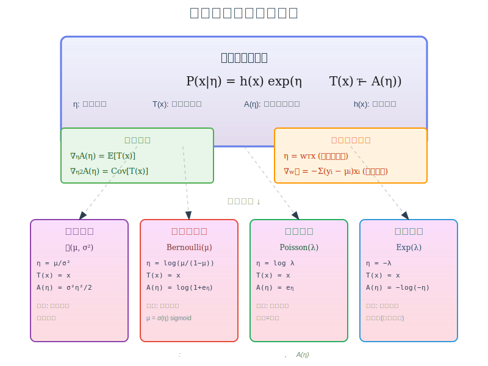

# 第04章 指数族分布

## 前言

在概率论的浩瀚海洋中,**指数族分布 (Exponential Family)** 是一座灯塔。它不仅仅是高斯分布、伯努利分布等常见分布的集合,更是它们背后的**通用模版**。

为什么线性回归、逻辑回归的梯度公式长得一模一样?为什么最大熵原理最终指向了它?为什么贝叶斯推断需要共轭先验?

本章将带你深入这个"上帝的指纹",揭示看似无关的算法背后统一的数学本质。学完本章,你将不再是一个个地记忆公式,而是掌握了生成公式的**元规则**。

---

## 目录

- [引言](#引言)
- [1. 指数族分布的定义](#1-指数族分布的定义)
  - [1.1 从伯努利分布开始](#11-从伯努利分布开始)
  - [1.2 高斯分布的改写](#12-高斯分布的改写)
  - [1.3 指数族的标准形式](#13-指数族的标准形式)
  - [1.4 对数配分函数的定义](#14-对数配分函数的定义)
  - [1.5 常见分布的指数族形式](#15-常见分布的指数族形式)
- [2. 指数族分布的性质](#2-指数族分布的性质)
  - [2.1 一阶导数:期望](#21-一阶导数期望)
  - [2.2 二阶导数:方差](#22-二阶导数方差)
  - [2.3 Fisher 信息矩阵](#23-fisher-信息矩阵)
  - [2.4 最大似然估计的矩匹配](#24-最大似然估计的矩匹配)
- [3. 指数族分布与最大熵](#3-指数族分布与最大熵)
  - [3.1 问题:如何选择概率分布?](#31-问题如何选择概率分布)
  - [3.2 熵与最大熵原理](#32-熵与最大熵原理)
  - [3.3 推导:最大熵分布是指数族](#33-推导最大熵分布是指数族)
  - [3.4 例子 1:高斯分布](#34-例子-1高斯分布)
  - [3.5 例子 2:指数分布](#35-例子-2指数分布)
  - [3.6 例子 3:离散均匀分布](#36-例子-3离散均匀分布)
- [4. 指数族分布与广义线性模型 (GLM)](#4-指数族分布与广义线性模型-glm)
  - [4.1 问题:线性回归与逻辑回归的统一](#41-问题线性回归与逻辑回归的统一)
  - [4.2 GLM 的定义](#42-glm-的定义)
  - [4.3 核心推导:GLM 的统一梯度公式](#43-核心推导glm-的统一梯度公式)
  - [4.4 Hessian 矩阵:凸性保证](#44-hessian-矩阵凸性保证)
  - [4.5 例子 1:线性回归 (高斯 GLM)](#45-例子-1线性回归-高斯-glm)
  - [4.6 例子 2:逻辑回归 (伯努利 GLM)](#46-例子-2逻辑回归-伯努利-glm)
  - [4.7 例子 3:泊松回归 (泊松 GLM)](#47-例子-3泊松回归-泊松-glm)
  - [4.8 GLM 的几何理解](#48-glm-的几何理解)
- [5. 总结](#5-总结)
  - [5.1 主要结论](#51-主要结论)
  - [5.2 为什么指数族如此重要?](#52-为什么指数族如此重要)
  - [5.3 关键公式速查表](#53-关键公式速查表)
- [参考文献](#参考文献)

---

## 引言

在机器学习中,我们会遇到各种各样的概率分布:

- 线性回归使用高斯分布 $\mathcal{N}(\mu, \sigma^2)$
- 逻辑回归使用伯努利分布 $\text{Bernoulli}(\mu)$
- 泊松回归使用泊松分布 $\text{Poisson}(\lambda)$

它们看起来截然不同:高斯处理连续变量,伯努利处理二元事件,泊松处理计数。但它们实际上**共享同一个数学结构**——这就是**指数族分布**。

本章我们将:
1. 从具体分布推导出指数族的统一形式
2. 深入理解对数配分函数的核心性质
3. 从信息论角度理解指数族的必然性(最大熵原理)
4. 揭示广义线性模型的统一本质

*图1: 指数族分布的统一视角——看似截然不同的分布,实际上都是同一个模版 $P(x|\eta) = h(x)\exp(\eta^T T(x) - A(\eta))$ 的特例,唯一的差异在于对数配分函数 $A(\eta)$ 的形式。*

---

## 1. 指数族分布的定义

### 1.1 从伯努利分布开始

考虑抛硬币实验,$x \in \{0, 1\}$,正面概率为 $\mu$:

$$
P(x|\mu) = \mu^x (1-\mu)^{1-x}
$$

取对数:

$$
\log P(x|\mu) = x \log \mu + (1-x) \log(1-\mu)
$$

重新整理:

$$
\begin{aligned}
\log P(x|\mu) &= x \log \mu + \log(1-\mu) - x \log(1-\mu) \\
&= x \left[\log \mu - \log(1-\mu)\right] + \log(1-\mu) \\
&= x \log \frac{\mu}{1-\mu} + \log(1-\mu)
\end{aligned}
$$

引入新参数 $\eta = \log \frac{\mu}{1-\mu}$ (logit 函数)。注意到 $1-\mu = \frac{1}{1+e^\eta}$,因此:

$$
\log(1-\mu) = -\log(1+e^\eta)
$$

代入得:

$$
\log P(x|\eta) = x \eta - \log(1+e^\eta)
$$

指数化:

$$
P(x|\eta) = \exp\left(\eta x - \log(1+e^\eta)\right)
$$

**观察这个形式**:
- 参数 $\eta$ 乘以数据 $x$
- 减去一个只依赖于 $\eta$ 的项 $\log(1+e^\eta)$

---

### 1.2 高斯分布的改写

考虑高斯分布 $\mathcal{N}(\mu, \sigma^2)$ (假设 $\sigma^2$ 已知):

$$
P(x|\mu) = \frac{1}{\sqrt{2\pi\sigma^2}} \exp\left(-\frac{(x-\mu)^2}{2\sigma^2}\right)
$$

展开平方项:

$$
-\frac{(x-\mu)^2}{2\sigma^2} = -\frac{x^2}{2\sigma^2} + \frac{\mu x}{\sigma^2} - \frac{\mu^2}{2\sigma^2}
$$

因此:

$$
P(x|\mu) = \underbrace{\frac{1}{\sqrt{2\pi\sigma^2}} \exp\left(-\frac{x^2}{2\sigma^2}\right)}_{h(x)} \exp\left(\frac{\mu}{\sigma^2} x - \frac{\mu^2}{2\sigma^2}\right)
$$

定义自然参数 $\eta = \frac{\mu}{\sigma^2}$,则 $\frac{\mu^2}{2\sigma^2} = \frac{\sigma^2 \eta^2}{2}$:

$$
P(x|\eta) = h(x) \exp\left(\eta x - \frac{\sigma^2 \eta^2}{2}\right)
$$

**再次观察**:同样的模式!
- 参数 $\eta$ 乘以数据 $x$
- 减去一个只依赖于 $\eta$ 的项
- 外加一个与参数无关的基础项 $h(x)$

---

### 1.3 指数族的标准形式

基于以上观察,我们定义**指数族分布**:

$$
\boxed{P(x|\eta) = h(x) \exp\left(\eta^T T(x) - A(\eta)\right)}
$$

其中:
- **$\eta \in \mathbb{R}^d$**: 自然参数 (Natural Parameter)
- **$T(x) \in \mathbb{R}^d$**: 充分统计量 (Sufficient Statistic),是关于数据 $x$ 的函数
- **$A(\eta) \in \mathbb{R}$**: 对数配分函数 (Log-Partition Function)
- **$h(x) > 0$**: 基础测度 (Base Measure),与参数 $\eta$ 无关

**充分统计量的含义**: $T(x)$ 包含了关于参数 $\eta$ 的所有信息。对于 i.i.d. 样本 $\{x_1, \ldots, x_N\}$,充分统计量为 $\sum_{i=1}^N T(x_i)$ 或其均值 $\bar{T} = \frac{1}{N}\sum_{i=1}^N T(x_i)$。

---

### 1.4 对数配分函数的定义

概率分布必须归一化:

$$
\int P(x|\eta) \, dx = \int h(x) \exp(\eta^T T(x) - A(\eta)) \, dx = 1
$$

移项:

$$
\int h(x) \exp(\eta^T T(x)) \, dx = e^{A(\eta)}
$$

取对数:

$$
\boxed{A(\eta) = \log \int h(x) \exp(\eta^T T(x)) \, dx}
$$

这就是对数配分函数的显式定义。它保证了概率的归一化,但它的作用远不止于此——它的导数蕴含了分布的所有统计性质。

---

### 1.5 常见分布的指数族形式

**伯努利分布** $\text{Bernoulli}(\mu)$:
$$
\begin{aligned}
\eta &= \log \frac{\mu}{1-\mu} \\
T(x) &= x \\
A(\eta) &= \log(1+e^\eta) \\
h(x) &= 1
\end{aligned}
$$

**高斯分布** $\mathcal{N}(\mu, \sigma^2)$ ($\sigma^2$ 已知):
$$
\begin{aligned}
\eta &= \frac{\mu}{\sigma^2} \\
T(x) &= x \\
A(\eta) &= \frac{\sigma^2 \eta^2}{2} \\
h(x) &= \frac{1}{\sqrt{2\pi\sigma^2}} \exp\left(-\frac{x^2}{2\sigma^2}\right)
\end{aligned}
$$

**泊松分布** $\text{Poisson}(\lambda)$:
$$
\begin{aligned}
\eta &= \log \lambda \\
T(x) &= x \\
A(\eta) &= e^\eta \\
h(x) &= \frac{1}{x!}
\end{aligned}
$$

**指数分布** $\text{Exp}(\lambda)$:
$$
\begin{aligned}
\eta &= -\lambda \\
T(x) &= x \\
A(\eta) &= -\log(-\eta) \quad (\eta < 0) \\
h(x) &= \mathbb{I}(x \geq 0)
\end{aligned}
$$

---

## 2. 指数族分布的性质

对数配分函数 $A(\eta)$ 不仅仅是归一化常数,它的导数编码了分布的所有矩信息。

### 2.1 一阶导数:期望

**定理 1** (对数配分函数的梯度):
$$
\boxed{\nabla_\eta A(\eta) = \mathbb{E}_{P(x|\eta)}[T(x)]}
$$

**证明**:

从 $A(\eta)$ 的定义出发:

$$
A(\eta) = \log \int h(x) \exp(\eta^T T(x)) \, dx
$$

对 $\eta_i$ 求偏导。使用对数求导法则 $\frac{d}{dx}\log f(x) = \frac{1}{f(x)} \frac{df}{dx}$:

$$
\frac{\partial A(\eta)}{\partial \eta_i} = \frac{1}{\int h(x) \exp(\eta^T T(x)) \, dx} \cdot \frac{\partial}{\partial \eta_i} \int h(x) \exp(\eta^T T(x)) \, dx
$$

利用 Leibniz 积分法则,将导数穿过积分号:

$$
\frac{\partial}{\partial \eta_i} \int h(x) \exp(\eta^T T(x)) \, dx = \int h(x) \frac{\partial}{\partial \eta_i} \exp(\eta^T T(x)) \, dx
$$

计算指数函数的导数(链式法则):

$$
\frac{\partial}{\partial \eta_i} \exp(\eta^T T(x)) = \exp(\eta^T T(x)) \cdot \frac{\partial}{\partial \eta_i}(\eta^T T(x)) = \exp(\eta^T T(x)) \cdot T_i(x)
$$

因为 $\eta^T T(x) = \sum_j \eta_j T_j(x)$,对 $\eta_i$ 求导只留下 $T_i(x)$。

代入:

$$
\frac{\partial A(\eta)}{\partial \eta_i} = \frac{\int h(x) T_i(x) \exp(\eta^T T(x)) \, dx}{\int h(x) \exp(\eta^T T(x)) \, dx}
$$

注意分母恰好是 $e^{A(\eta)}$,分子分母同除以 $e^{A(\eta)}$:

$$
\frac{\partial A(\eta)}{\partial \eta_i} = \int T_i(x) \underbrace{h(x) \exp(\eta^T T(x) - A(\eta))}_{P(x|\eta)} \, dx = \int T_i(x) P(x|\eta) \, dx = \mathbb{E}[T_i(x)]
$$

以向量形式:

$$
\boxed{\nabla_\eta A(\eta) = \mathbb{E}[T(x)]} \quad \square
$$

---

**物理意义**:

定义**均值参数** (Mean Parameter):
$$
\mu = \mathbb{E}[T(x)]
$$

定理 1 告诉我们:
$$
\mu = \nabla_\eta A(\eta)
$$

这建立了自然参数 $\eta$ 和均值参数 $\mu$ 之间的对应关系。改变 $\eta$,就改变了 $\mu$。

**验证**:对于伯努利分布,$A(\eta) = \log(1+e^\eta)$:

$$
\frac{dA(\eta)}{d\eta} = \frac{e^\eta}{1+e^\eta} = \frac{1}{1+e^{-\eta}} = \sigma(\eta) = \mu
$$

这正是 sigmoid 函数!自然参数 $\eta \in \mathbb{R}$ 通过 sigmoid 映射到概率 $\mu \in (0,1)$。

---

### 2.2 二阶导数:方差

**定理 2** (对数配分函数的 Hessian):
$$
\boxed{\nabla^2_\eta A(\eta) = \text{Cov}[T(x)]}
$$

其中 Hessian 矩阵的 $(i,j)$ 元素为:

$$
\left[\nabla^2_\eta A(\eta)\right]_{ij} = \frac{\partial^2 A(\eta)}{\partial \eta_i \partial \eta_j}
$$

协方差矩阵定义为:

$$
\text{Cov}[T(x)]_{ij} = \mathbb{E}[T_i(x) T_j(x)] - \mathbb{E}[T_i(x)] \mathbb{E}[T_j(x)]
$$

**证明**:

从定理 1 我们知道:

$$
\frac{\partial A(\eta)}{\partial \eta_i} = \mathbb{E}[T_i(x)] = \int T_i(x) P(x|\eta) \, dx
$$

对 $\eta_j$ 再次求导:

$$
\frac{\partial^2 A(\eta)}{\partial \eta_i \partial \eta_j} = \frac{\partial}{\partial \eta_j} \int T_i(x) P(x|\eta) \, dx = \int T_i(x) \frac{\partial P(x|\eta)}{\partial \eta_j} \, dx
$$

关键是计算 $\frac{\partial P(x|\eta)}{\partial \eta_j}$。从 $P(x|\eta) = h(x) \exp(\eta^T T(x) - A(\eta))$,取对数:

$$
\log P(x|\eta) = \log h(x) + \eta^T T(x) - A(\eta)
$$

对 $\eta_j$ 求导:

$$
\frac{\partial \log P(x|\eta)}{\partial \eta_j} = T_j(x) - \frac{\partial A(\eta)}{\partial \eta_j} = T_j(x) - \mathbb{E}[T_j(x)]
$$

利用对数导数技巧 $\frac{\partial P}{\partial \eta_j} = P \frac{\partial \log P}{\partial \eta_j}$:

$$
\frac{\partial P(x|\eta)}{\partial \eta_j} = P(x|\eta) \left[T_j(x) - \mathbb{E}[T_j(x)]\right]
$$

代入二阶导数:

$$
\frac{\partial^2 A(\eta)}{\partial \eta_i \partial \eta_j} = \int T_i(x) P(x|\eta) \left[T_j(x) - \mathbb{E}[T_j(x)]\right] \, dx
$$

展开:

$$
\begin{aligned}
&= \int T_i(x) T_j(x) P(x|\eta) \, dx - \int T_i(x) P(x|\eta) \, dx \cdot \mathbb{E}[T_j(x)] \\
&= \mathbb{E}[T_i(x) T_j(x)] - \mathbb{E}[T_i(x)] \mathbb{E}[T_j(x)] \\
&= \text{Cov}[T_i(x), T_j(x)]
\end{aligned}
$$

因此:

$$
\boxed{\nabla^2_\eta A(\eta) = \text{Cov}[T(x)]} \quad \square
$$

---

**物理意义**:

协方差矩阵总是半正定的 ($\text{Cov}[T(x)] \succeq 0$),因此:

$$
\nabla^2_\eta A(\eta) \succeq 0
$$

这意味着 $A(\eta)$ 是**凸函数**。

**推论** (凸性的后果):

1. 负对数似然 $-\log P(x|\eta) = A(\eta) - \eta^T T(x) + \text{const}$ 是关于 $\eta$ 的凸函数
2. 最大似然估计 (MLE) 是凸优化问题
3. MLE 的解存在且唯一 (在参数空间内部)
4. 梯度下降必然收敛到全局最优

**这是指数族分布的第一个核心优势:优化问题天然是凸的。**

---

### 2.3 Fisher 信息矩阵

定义 **Fisher 信息矩阵**:

$$
\mathcal{I}(\eta) = \mathbb{E}\left[\left(\nabla_\eta \log P(x|\eta)\right) \left(\nabla_\eta \log P(x|\eta)\right)^T\right]
$$

它度量参数 $\eta$ 的可估计性:Fisher 信息越大,参数越容易从数据中估计。

对于指数族分布:

$$
\nabla_\eta \log P(x|\eta) = \nabla_\eta \left[\eta^T T(x) - A(\eta)\right] = T(x) - \nabla_\eta A(\eta) = T(x) - \mathbb{E}[T(x)]
$$

因此:

$$
\begin{aligned}
\mathcal{I}(\eta) &= \mathbb{E}\left[(T(x) - \mathbb{E}[T(x)])(T(x) - \mathbb{E}[T(x)])^T\right] \\
&= \text{Cov}[T(x)]
\end{aligned}
$$

结合定理 2:

$$
\boxed{\mathcal{I}(\eta) = \nabla^2_\eta A(\eta)}
$$

**意义**: Fisher 信息矩阵等于对数配分函数的 Hessian。这意味着 $A(\eta)$ 的曲率直接编码了参数的可估计性:曲率越大 (方差越大),参数越难估计,需要更多数据。

---

### 2.4 最大似然估计的矩匹配

对于 i.i.d. 样本 $\{x_1, \ldots, x_N\}$,对数似然为:

$$
\ell(\eta) = \sum_{i=1}^N \log P(x_i|\eta) = \sum_{i=1}^N \left[\eta^T T(x_i) - A(\eta) + \log h(x_i)\right]
$$

去掉与 $\eta$ 无关的项:

$$
\ell(\eta) = N \eta^T \bar{T} - N A(\eta) + \text{const}
$$

其中 $\bar{T} = \frac{1}{N}\sum_{i=1}^N T(x_i)$ 是充分统计量的样本均值。

一阶最优条件:

$$
\nabla_\eta \ell(\eta) = N \bar{T} - N \nabla_\eta A(\eta) = 0
$$

即:

$$
\boxed{\nabla_\eta A(\hat{\eta}_{\text{MLE}}) = \bar{T}}
$$

结合定理 1:

$$
\boxed{\mathbb{E}_{P(x|\hat{\eta}_{\text{MLE}})}[T(x)] = \bar{T}}
$$

**MLE 的物理意义**: 最大似然估计使得**模型的理论期望等于数据的经验期望**。这称为**矩匹配** (Moment Matching)。

**例子** (伯努利分布):

$T(x) = x$,$\bar{T} = \frac{1}{N}\sum_{i=1}^N x_i = \hat{\mu}$ (样本均值)。

MLE 条件:

$$
\nabla_\eta A(\eta) = \sigma(\eta) = \hat{\mu}
$$

解得:

$$
\hat{\eta}_{\text{MLE}} = \text{logit}(\hat{\mu}) = \log \frac{\hat{\mu}}{1-\hat{\mu}}
$$

这正是我们期望的结果。

---

## 3. 指数族分布与最大熵

### 3.1 问题:如何选择概率分布?

假设我们对一个随机变量 $x$ 一无所知,只知道某些统计量的期望值:

$$
\mathbb{E}[T_k(x)] = \alpha_k, \quad k = 1, \ldots, m
$$

例如:
- 只知道均值 $\mathbb{E}[x] = \mu$
- 只知道均值和二阶矩 $\mathbb{E}[x] = \mu, \mathbb{E}[x^2] = \sigma^2 + \mu^2$

**问题**: 在满足这些约束的所有概率分布中,我们应该选择哪一个?

**答案**: 选择**熵最大**的分布。

---

### 3.2 熵与最大熵原理

Shannon 熵定义为:

$$
H[P] = -\int P(x) \log P(x) \, dx
$$

熵度量分布的"不确定性":
- 均匀分布:熵最大 (最不确定)
- Dirac delta 函数:熵为 0 (完全确定)

**最大熵原理** (Maximum Entropy Principle):

> 在满足已知约束的前提下,选择熵最大的分布。

**哲学依据**: 这是"奥卡姆剃刀"的概率版本——**不要假设你不知道的东西**。给定约束,选择最"无偏"、最"保守"的分布,不引入任何额外的假设。

---

### 3.3 推导:最大熵分布是指数族

**优化问题**:

$$
\begin{aligned}
\max_{P(x)} \quad & H[P] = -\int P(x) \log P(x) \, dx \\
\text{s.t.} \quad & \int P(x) \, dx = 1 \\
& \int P(x) T_k(x) \, dx = \alpha_k, \quad k = 1, \ldots, m
\end{aligned}
$$

构造 **Lagrange 泛函**:

$$
\mathcal{L}[P] = -\int P(x) \log P(x) \, dx + \lambda_0 \left(\int P(x) \, dx - 1\right) + \sum_{k=1}^m \lambda_k \left(\int P(x) T_k(x) \, dx - \alpha_k\right)
$$

对 $P(x)$ 做变分 (泛函导数):

$$
\frac{\delta \mathcal{L}}{\delta P(x)} = -\log P(x) - 1 + \lambda_0 + \sum_{k=1}^m \lambda_k T_k(x)
$$

令变分为零:

$$
-\log P(x) - 1 + \lambda_0 + \sum_{k=1}^m \lambda_k T_k(x) = 0
$$

解出 $\log P(x)$:

$$
\log P(x) = -1 + \lambda_0 + \sum_{k=1}^m \lambda_k T_k(x)
$$

指数化:

$$
P(x) = \exp\left(-1 + \lambda_0 + \sum_{k=1}^m \lambda_k T_k(x)\right) = e^{\lambda_0 - 1} \exp\left(\sum_{k=1}^m \lambda_k T_k(x)\right)
$$

利用归一化条件 $\int P(x) \, dx = 1$ 确定常数项。定义:

$$
A(\lambda) = 1 - \lambda_0 = \log \int \exp\left(\sum_{k=1}^m \lambda_k T_k(x)\right) dx
$$

最终得到:

$$
P(x) = \exp\left(\sum_{k=1}^m \lambda_k T_k(x) - A(\lambda)\right)
$$

这正是指数族分布的标准形式 (取 $h(x) = 1$,$\eta = \lambda$)!

**结论**:

$$
\boxed{\text{最大熵分布} = \text{指数族分布}}
$$

Lagrange 乘子 $\lambda$ 对应自然参数 $\eta$。 $\square$

---

**意义**:

指数族分布不是人为构造的,而是信息论的必然结果。给定矩约束,指数族是**唯一最保守的选择**。

---

### 3.4 例子 1:高斯分布

**约束**:只知道均值和方差,

$$
\mathbb{E}[x] = \mu, \quad \mathbb{E}[x^2] = \sigma^2 + \mu^2
$$

**充分统计量**:

$$
T(x) = \begin{bmatrix} x \\ x^2 \end{bmatrix}
$$

**最大熵分布**:

$$
P(x) = \exp(\lambda_1 x + \lambda_2 x^2 - A(\lambda))
$$

配方:

$$
\lambda_2 x^2 + \lambda_1 x = \lambda_2 \left(x + \frac{\lambda_1}{2\lambda_2}\right)^2 - \frac{\lambda_1^2}{4\lambda_2}
$$

要使其是有效概率分布 (可积),必须 $\lambda_2 < 0$。设:

$$
\lambda_2 = -\frac{1}{2\sigma^2}, \quad \lambda_1 = \frac{\mu}{\sigma^2}
$$

代入并整理,得到:

$$
P(x) = \frac{1}{\sqrt{2\pi\sigma^2}} \exp\left(-\frac{(x-\mu)^2}{2\sigma^2}\right)
$$

**结论**: 高斯分布是给定均值和方差的最大熵分布。

**物理意义**: 如果你只知道一个随机变量的均值和方差,你能做的最保守假设就是它服从高斯分布。这就是为什么高斯分布无处不在——**不是因为自然"喜欢"高斯,而是因为我们通常只掌握有限的矩信息**。

---

### 3.5 例子 2:指数分布

**约束** (假设 $x \geq 0$):

$$
\mathbb{E}[x] = \mu
$$

**充分统计量**:

$$
T(x) = x
$$

**最大熵分布**:

$$
P(x) = \exp(\lambda x - A(\lambda))
$$

归一化:

$$
A(\lambda) = \log \int_0^\infty \exp(\lambda x) \, dx
$$

为使积分收敛,必须 $\lambda < 0$。设 $\lambda = -1/\mu$,则:

$$
\int_0^\infty \exp(-x/\mu) \, dx = \mu
$$

因此:

$$
A(\lambda) = \log \mu = -\log(-\lambda)
$$

最终分布:

$$
P(x) = \frac{1}{\mu} \exp\left(-\frac{x}{\mu}\right)
$$

这是**指数分布** $\text{Exp}(1/\mu)$。

**物理意义**: 如果你只知道一个非负随机变量的均值,指数分布是最保守的选择。这解释了为什么等待时间、寿命等常服从指数分布——当我们对过程的细节一无所知时,指数分布是最自然的选择。

---

### 3.6 例子 3:离散均匀分布

**约束**:无约束 (除了归一化)。

在有限集合 $\{x_1, \ldots, x_n\}$ 上,最大熵分布是:

$$
P(x_i) = \frac{1}{n}, \quad i = 1, \ldots, n
$$

这是**离散均匀分布**。

**物理意义**: 如果你对一个离散随机变量一无所知,最保守的假设就是等概率。

---

## 4. 指数族分布与广义线性模型 (GLM)

### 4.1 问题:线性回归与逻辑回归的统一

看看两个经典模型:

**线性回归**:
- 模型:$y|x \sim \mathcal{N}(w^T x, \sigma^2)$
- 损失函数:最小二乘 $\sum (y_i - w^T x_i)^2$

**逻辑回归**:
- 模型:$y|x \sim \text{Bernoulli}(\sigma(w^T x))$
- 损失函数:交叉熵 $-\sum [y_i \log \sigma(w^T x_i) + (1-y_i) \log(1-\sigma(w^T x_i))]$

它们看起来完全不同!损失函数的形式天差地别。

**但它们本质相同**——都是广义线性模型 (Generalized Linear Model, GLM)。

---

### 4.2 GLM 的定义

**广义线性模型**由三部分组成:

**1. 随机成分**: 响应变量 $y$ 服从指数族分布

$$
P(y|x, w) = h(y) \exp\left(\eta(x, w) \cdot y - A(\eta(x, w))\right)
$$

这里假设 $T(y) = y$,称为**规范形式** (Canonical Form)。

**2. 系统成分**: 自然参数是输入的线性函数

$$
\eta(x, w) = w^T x
$$

**3. 连接函数**: 自然参数 $\eta$ 与均值 $\mu = \mathbb{E}[y|x]$ 的关系

由定理 1:

$$
\mu = \nabla_\eta A(\eta)
$$

定义**连接函数** $g$:

$$
\eta = g(\mu)
$$

若 $g$ 使得 $\eta = w^T x$ 直接对应自然参数化,称为**规范连接** (Canonical Link)。对于规范形式的指数族,规范连接就是 $g = (\nabla_\eta A)^{-1}$。

---

### 4.3 核心推导:GLM 的统一梯度公式

这是本章最激动人心的推导:**无论分布是什么,梯度公式都一样**。

给定数据 $\{(x_i, y_i)\}_{i=1}^N$,负对数似然为:

$$
\mathcal{L}(w) = -\sum_{i=1}^N \log P(y_i|x_i, w) = -\sum_{i=1}^N \left[\eta_i y_i - A(\eta_i) + \log h(y_i)\right]
$$

其中 $\eta_i = w^T x_i$。去掉与 $w$ 无关的项:

$$
\mathcal{L}(w) = -\sum_{i=1}^N \left[w^T x_i \cdot y_i - A(w^T x_i)\right] + \text{const}
$$

对 $w$ 求梯度,使用链式法则:

$$
\nabla_w \mathcal{L}(w) = -\sum_{i=1}^N \left[y_i x_i - \frac{\partial A(\eta_i)}{\partial \eta_i} \cdot \frac{\partial \eta_i}{\partial w}\right]
$$

注意:
- $\frac{\partial \eta_i}{\partial w} = \frac{\partial (w^T x_i)}{\partial w} = x_i$
- $\frac{\partial A(\eta_i)}{\partial \eta_i} = \mathbb{E}[y_i|x_i] = \mu_i$ (由定理 1)

代入:

$$
\nabla_w \mathcal{L}(w) = -\sum_{i=1}^N (y_i - \mu_i) x_i
$$

**GLM 的核心公式**:

$$
\boxed{\nabla_w \mathcal{L}(w) = -\sum_{i=1}^N (y_i - \mu_i) x_i}
$$

其中 $\mu_i = \mathbb{E}[y_i|x_i] = \nabla_\eta A(\eta_i)|_{\eta_i = w^T x_i}$。

---

**公式的物理意义**:

$$
\nabla_w \mathcal{L}(w) = -\sum_{i=1}^N \underbrace{(y_i - \mu_i)}_{\text{残差}} \cdot \underbrace{x_i}_{\text{特征}}
$$

梯度是**残差与特征的加权和**。

**关键观察**: 无论分布是什么 (高斯、伯努利、泊松),梯度都是这个形式!唯一的差异在于:
- $\mu_i = \nabla_\eta A(\eta_i)$ 的具体计算
- 而这由对数配分函数 $A(\eta)$ 完全决定

**这不仅仅是巧合**——这是指数族分布的几何本质。对数配分函数的导数性质统一了所有回归模型的优化。

---

### 4.4 Hessian 矩阵:凸性保证

继续对梯度求导:

$$
\nabla^2_w \mathcal{L}(w) = \sum_{i=1}^N \frac{\partial \mu_i}{\partial w} x_i^T
$$

使用链式法则:

$$
\frac{\partial \mu_i}{\partial w} = \frac{\partial \mu_i}{\partial \eta_i} \cdot \frac{\partial \eta_i}{\partial w} = \frac{\partial \mu_i}{\partial \eta_i} \cdot x_i
$$

注意 $\mu_i = \nabla_\eta A(\eta_i)$,因此:

$$
\frac{\partial \mu_i}{\partial \eta_i} = \nabla^2_\eta A(\eta_i) = \text{Var}[y_i|x_i]
$$

(由定理 2,对于标量情况协方差就是方差)

代入:

$$
\nabla^2_w \mathcal{L}(w) = \sum_{i=1}^N \text{Var}[y_i|x_i] \cdot x_i x_i^T
$$

以矩阵形式:

$$
\nabla^2_w \mathcal{L}(w) = X^T W X
$$

其中:
- $X \in \mathbb{R}^{N \times d}$ 是设计矩阵 (第 $i$ 行是 $x_i^T$)
- $W = \text{diag}(\text{Var}[y_1|x_1], \ldots, \text{Var}[y_N|x_N]) \in \mathbb{R}^{N \times N}$ 是权重矩阵

**凸性**:

因为方差 $\text{Var}[y_i|x_i] > 0$,且假设 $X$ 列满秩,Hessian 正定:

$$
\nabla^2_w \mathcal{L}(w) \succ 0
$$

因此:

$$
\boxed{\mathcal{L}(w) \text{ 是严格凸函数}}
$$

**推论**:
1. MLE 存在且唯一
2. 梯度下降保证收敛到全局最优
3. 无局部最优问题

这是指数族分布送给统计学习的第二个礼物 (第一个是统一的梯度公式)。

---

### 4.5 例子 1:线性回归 (高斯 GLM)

**模型**: $y|x \sim \mathcal{N}(w^T x, \sigma^2)$

**指数族参数**:
- 自然参数:$\eta = w^T x$
- 对数配分函数:$A(\eta) = \frac{\sigma^2 \eta^2}{2}$
- 均值参数:$\mu = \nabla_\eta A(\eta) = \sigma^2 \eta = w^T x$

**梯度**:

$$
\nabla_w \mathcal{L}(w) = -\sum_{i=1}^N (y_i - w^T x_i) x_i
$$

这正是最小二乘的梯度!

**Hessian**:

$$
\text{Var}[y_i|x_i] = \sigma^2 \quad (\text{常数})
$$

因此:

$$
\nabla^2_w \mathcal{L}(w) = \sigma^2 X^T X
$$

这正是线性回归的 Hessian。

---

### 4.6 例子 2:逻辑回归 (伯努利 GLM)

**模型**: $y|x \sim \text{Bernoulli}(\sigma(w^T x))$

**指数族参数**:
- 自然参数:$\eta = w^T x$
- 对数配分函数:$A(\eta) = \log(1 + e^\eta)$
- 均值参数:$\mu = \nabla_\eta A(\eta) = \frac{e^\eta}{1+e^\eta} = \sigma(\eta) = \sigma(w^T x)$

**梯度**:

$$
\nabla_w \mathcal{L}(w) = -\sum_{i=1}^N (y_i - \sigma(w^T x_i)) x_i
$$

这正是逻辑回归的梯度!

**Hessian**:

$$
\text{Var}[y_i|x_i] = \mu_i(1-\mu_i) = \sigma(w^T x_i)(1-\sigma(w^T x_i))
$$

因此:

$$
\nabla^2_w \mathcal{L}(w) = X^T W X, \quad W = \text{diag}(\mu_1(1-\mu_1), \ldots, \mu_N(1-\mu_N))
$$

这正是逻辑回归的 Hessian (也是 IRLS 算法的权重矩阵)。

---

### 4.7 例子 3:泊松回归 (泊松 GLM)

**模型**: $y|x \sim \text{Poisson}(e^{w^T x})$

**指数族参数**:
- 自然参数:$\eta = w^T x$
- 对数配分函数:$A(\eta) = e^\eta$
- 均值参数:$\mu = \nabla_\eta A(\eta) = e^\eta = e^{w^T x}$

**梯度**:

$$
\nabla_w \mathcal{L}(w) = -\sum_{i=1}^N (y_i - e^{w^T x_i}) x_i
$$

**Hessian**:

$$
\text{Var}[y_i|x_i] = \mu_i = e^{w^T x_i}
$$

因此:

$$
\nabla^2_w \mathcal{L}(w) = X^T W X, \quad W = \text{diag}(e^{w^T x_1}, \ldots, e^{w^T x_N})
$$

---

### 4.8 GLM 的几何理解

所有 GLM 都在做同一件事:

1. 通过线性组合 $w^T x$ 构造自然参数 $\eta$
2. 通过 $\mu = \nabla_\eta A(\eta)$ 将 $\eta$ 映射到均值参数空间
3. 优化目标是最小化观测值 $y$ 与预测均值 $\mu$ 之间的"距离"

不同的 GLM 只是选择了不同的分布 (即不同的 $A(\eta)$),从而对应不同的均值-方差关系:

- 高斯:$\text{Var}[y|x] = \sigma^2$ (常数)
- 伯努利:$\text{Var}[y|x] = \mu(1-\mu)$ (二次函数)
- 泊松:$\text{Var}[y|x] = \mu$ (均值-方差相等)

但优化的本质是相同的:**所有 GLM 的梯度都是残差与特征的线性组合**。

---

## 5. 总结

### 5.1 主要结论

**1. 指数族的标准形式**:

$$
P(x|\eta) = h(x) \exp\left(\eta^T T(x) - A(\eta)\right)
$$

这是概率分布的"元素周期表",涵盖了几乎所有常用的分布。

**2. 对数配分函数的核心性质**:

$$
\begin{aligned}
\nabla_\eta A(\eta) &= \mathbb{E}[T(x)] \quad \text{(一阶导数 = 期望)} \\
\nabla^2_\eta A(\eta) &= \text{Cov}[T(x)] \quad \text{(二阶导数 = 协方差)} \\
\mathcal{I}(\eta) &= \nabla^2_\eta A(\eta) \quad \text{(Fisher 信息)}
\end{aligned}
$$

这些性质使得 MLE 成为凸优化问题,保证了优化的稳定性和唯一性。

**3. 最大熵原理**:

给定矩约束,指数族分布是**唯一**最大熵分布:

$$
\max H[P] \quad \text{s.t.} \quad \mathbb{E}[T_k(x)] = \alpha_k \quad \Rightarrow \quad P(x) = \exp\left(\sum \lambda_k T_k(x) - A(\lambda)\right)
$$

这从信息论角度解释了为什么指数族无处不在:它们是最保守、最无偏的选择。

**4. GLM 的统一公式**:

所有广义线性模型共享同一个梯度:

$$
\nabla_w \mathcal{L}(w) = -\sum_{i=1}^N (y_i - \mu_i) x_i
$$

其中 $\mu_i = \nabla_\eta A(\eta_i)|_{\eta_i = w^T x_i}$。

线性回归、逻辑回归、泊松回归本质相同,只是选择了不同的 $A(\eta)$。

---

### 5.2 为什么指数族如此重要?

1. **统计学**: 充分统计量、MLE 的矩匹配、Fisher 信息
2. **信息论**: 最大熵原理
3. **优化**: 凸性保证
4. **机器学习**: GLM、变分推断的基础 (将在第5章讨论)

指数族不仅仅是一个数学定义,而是:
- 统计学的基础
- 信息论的体现
- 优化的福音
- 机器学习的支柱

当你遇到一个新的概率模型时,首先问:**它是指数族吗?** 如果是,你就拥有了这一整套强大的工具。

---

### 5.3 关键公式速查表

| 性质 | 公式 | 备注 |
|------|------|------|
| 标准形式 | $P(x \mid \eta) = h(x) \exp(\eta^T T(x) - A(\eta))$ | 定义 |
| 对数配分函数 | $A(\eta) = \log \int h(x) \exp(\eta^T T(x)) \, dx$ | 归一化 |
| 一阶导数 | $\nabla_\eta A(\eta) = \mathbb{E}[T(x)]$ | 期望 |
| 二阶导数 | $\nabla^2_\eta A(\eta) = \text{Cov}[T(x)]$ | 协方差 |
| Fisher 信息 | $\mathcal{I}(\eta) = \nabla^2_\eta A(\eta)$ | 可估计性 |
| MLE 条件 | $\nabla_\eta A(\hat{\eta}) = \bar{T}$ | 矩匹配 |
| GLM 梯度 | $\nabla_w \mathcal{L} = -\sum (y_i - \mu_i) x_i$ | 统一公式 |
| 最大熵 | $P(x) = \exp(\sum \lambda_k T_k(x) - A(\lambda))$ | 无偏选择 |
| 凸性 | $A(\eta) \text{ 是凸函数}$ | 优化保证 |

---

## 参考文献

1. **Bishop, C. M.** (2006). *Pattern Recognition and Machine Learning*. Springer, Chapter 2.
2. **Murphy, K. P.** (2022). *Probabilistic Machine Learning: An Introduction*. MIT Press, Chapter 3.
3. **Wainwright, M. J., & Jordan, M. I.** (2008). *Graphical Models, Exponential Families, and Variational Inference*. Foundations and Trends in Machine Learning, 1(1-2), 1-305.
4. **Jaynes, E. T.** (1957). Information Theory and Statistical Mechanics. *Physical Review*, 106(4), 620-630.
5. **Nelder, J. A., & Wedderburn, R. W. M.** (1972). Generalized Linear Models. *Journal of the Royal Statistical Society: Series A*, 135(3), 370-384.
