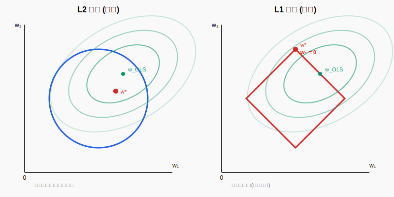
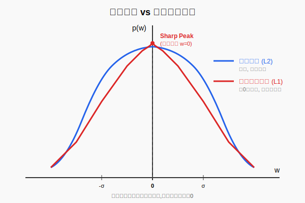

# 第05章 线性回归

> "Simplicity is the ultimate sophistication." —— Leonardo da Vinci
>
> **重要提示**：线性回归是机器学习的 "Hello World"，但请不要轻视它。
>
> 它是寻找真理的第一步。当我们试图用一条直线去拟合混沌的世界时，我们在坚持一种古老的信仰：**世界在本质上是简单的**。
>
> 本章将带你经历一次认知的跃迁：从**几何的投影**(最小二乘)，到**概率的似然**(高斯噪声)，再到**信念的约束**(贝叶斯正则化)。当你发现这三种截然不同的视角最终指向同一个公式时，你将领悟到数学那令人战栗的统一之美。这不仅仅是推导公式，这是在触摸统计学习的灵魂。

---

## 目录

1. [引言](#1-引言)
2. [最小二乘法(Least Squares Estimation, LSE)](#2-最小二乘法least-squares-estimation-lse)
   - 2.1 [目标函数](#21-目标函数)
   - 2.2 [几何视角:投影](#22-几何视角投影)
   - 2.3 [正规方程的物理意义](#23-正规方程的物理意义)
   - 2.4 [解析解](#24-解析解)
3. [概率视角:最大似然估计(MLE)](#3-概率视角最大似然估计mle)
   - 3.1 [概率模型](#31-概率模型)
   - 3.2 [似然函数](#32-似然函数)
   - 3.3 [MLE ⟺ LSE](#33-mle--lse)
4. [正则化(Regularization)](#4-正则化regularization)
   - 4.1 [问题的提出](#41-问题的提出)
   - 4.2 [Ridge 回归(L2 正则化)](#42-ridge-回归l2-正则化)
   - 4.3 [Lasso 回归(L1 正则化)](#43-lasso-回归l1-正则化)
5. [贝叶斯视角:最大后验估计(MAP)](#5-贝叶斯视角最大后验估计map)
   - 5.1 [先验分布](#51-先验分布)
   - 5.2 [Ridge = 高斯先验](#52-ridge--高斯先验)
   - 5.3 [Lasso = 拉普拉斯先验](#53-lasso--拉普拉斯先验)
   - 5.4 [为什么拉普拉斯先验导致稀疏性?](#54-为什么拉普拉斯先验导致稀疏性)
6. [总结](#6-总结)

---

## 1. 引言

**回归问题**的目标是预测**连续值**。给定训练数据 $\{(\mathbf{x}_i, y_i)\}_{i=1}^N$，其中 $\mathbf{x}_i \in \mathbb{R}^p$ 是特征向量，$y_i \in \mathbb{R}$ 是标签，我们希望学习一个函数 $f: \mathbb{R}^p \to \mathbb{R}$，使得对新的输入 $\mathbf{x}$，能够准确预测 $y = f(\mathbf{x})$。

**与第4章的连接**：在第4章我们学习了指数族分布与广义线性模型(GLM)的统一框架。线性回归是GLM最基础的特例——它对应于**高斯分布**的指数族形式。本章将从三个视角(几何、概率、贝叶斯)深入理解线性回归，你将看到第4章的抽象理论如何在最简单的模型中得到具体体现。

**线性回归**假设这个函数是线性的：

$$
f(\mathbf{x}) = \mathbf{w}^T \mathbf{x} + b
$$

为了简化记号，我们通常在 $\mathbf{x}$ 中加入常数项 1（即 $\mathbf{x} \leftarrow [1, \mathbf{x}]^T$），将偏置 $b$ 吸收到权重 $\mathbf{w}$ 中，于是模型简化为：

$$
f(\mathbf{x}) = \mathbf{w}^T \mathbf{x}
$$

用矩阵形式，设计矩阵 $X \in \mathbb{R}^{N \times p}$ 的第 $i$ 行是 $\mathbf{x}_i^T$，标签向量 $\mathbf{y} = [y_1, \ldots, y_N]^T$，则预测值为：

$$
\hat{\mathbf{y}} = X\mathbf{w}
$$

我们的任务是：**如何确定最优的 $\mathbf{w}$？**

---

## 2. 最小二乘法(Least Squares Estimation, LSE)

### 2.1 目标函数

最直观的想法是让预测值 $\hat{\mathbf{y}}$ 与真实值 $\mathbf{y}$ 尽可能接近，即最小化**残差平方和**：

$$
L(\mathbf{w}) = \|\mathbf{y} - X\mathbf{w}\|^2 = \sum_{i=1}^N (y_i - \mathbf{w}^T \mathbf{x}_i)^2
$$

这就是**最小二乘法(Ordinary Least Squares, OLS)**。

### 2.2 几何视角:投影

这里有个深刻的几何直觉，**甚至不需要求导**！

把 $X$ 看成一个 $N \times p$ 的矩阵，它的列向量张成 $\mathbb{R}^N$ 中的一个 $p$ 维子空间，称为 $X$ 的**列空间** $\text{Col}(X)$。

- $X\mathbf{w}$ 是列空间中的任意向量(线性组合)。
- $\mathbf{y}$ 是 $\mathbb{R}^N$ 中的一个向量，通常不在列空间中。

最小化 $\|\mathbf{y} - X\mathbf{w}\|^2$ 等价于：**在列空间中找到离 $\mathbf{y}$ 最近的点**。

根据投影定理，这个最近点就是 $\mathbf{y}$ 在列空间上的**正交投影** $\hat{\mathbf{y}} = X\mathbf{w}^*$。投影的几何特征是：

$$
\boxed{\mathbf{y} - X\mathbf{w}^* \perp \text{Col}(X)}
$$

即**残差向量 $\mathbf{y} - X\mathbf{w}^*$ 与 $X$ 的每一列都正交**：

$$
X^T (\mathbf{y} - X\mathbf{w}^*) = \mathbf{0}
$$

展开得到：

$$
\boxed{X^T X \mathbf{w}^* = X^T \mathbf{y}}
$$

这就是**正规方程(Normal Equation)**。

### 2.3 正规方程的物理意义

正规方程 $X^T X \mathbf{w} = X^T \mathbf{y}$ 的几何含义非常优雅：

- **左边** $X^T X \mathbf{w}$：残差 $X\mathbf{w} - \mathbf{y}$ 与 $X$ 的每一列的内积。
- **右边** $X^T \mathbf{y}$：标签 $\mathbf{y}$ 与 $X$ 的每一列的内积。

方程的意义是：**残差必须与设计矩阵 $X$ 的列空间正交**，即 $X^T(X\mathbf{w} - \mathbf{y}) = 0$。

这不是求导的结果，而是**投影的几何本质**！

### 2.4 解析解

若 $X^T X$ 可逆(即 $X$ 列满秩)，则：

$$
\boxed{\mathbf{w}^* = (X^T X)^{-1} X^T \mathbf{y}}
$$

$(X^T X)^{-1} X^T$ 称为 $X$ 的**伪逆(Moore-Penrose pseudoinverse)**，记作 $X^+$。

---

## 3. 概率视角:最大似然估计(MLE)

### 3.1 概率模型

从另一个角度看，我们可以假设数据是由以下过程生成的：

$$
y_i = \mathbf{w}^T \mathbf{x}_i + \epsilon_i, \quad \epsilon_i \sim \mathcal{N}(0, \sigma^2)
$$

即**真实标签 = 线性模型 + 高斯噪声**。

因此，给定 $\mathbf{x}_i$ 和 $\mathbf{w}$，$y_i$ 的条件分布为：

$$
p(y_i \mid \mathbf{x}_i, \mathbf{w}) = \mathcal{N}(y_i \mid \mathbf{w}^T \mathbf{x}_i, \sigma^2) = \frac{1}{\sqrt{2\pi\sigma^2}} \exp\left(-\frac{(y_i - \mathbf{w}^T \mathbf{x}_i)^2}{2\sigma^2}\right)
$$

### 3.2 似然函数

假设数据点之间独立同分布(i.i.d.)，则似然函数为：

$$
p(\mathbf{y} \mid X, \mathbf{w}) = \prod_{i=1}^N p(y_i \mid \mathbf{x}_i, \mathbf{w}) = \prod_{i=1}^N \frac{1}{\sqrt{2\pi\sigma^2}} \exp\left(-\frac{(y_i - \mathbf{w}^T \mathbf{x}_i)^2}{2\sigma^2}\right)
$$

取对数(对数似然)：

$$
\log p(\mathbf{y} \mid X, \mathbf{w}) = -\frac{N}{2}\log(2\pi\sigma^2) - \frac{1}{2\sigma^2} \sum_{i=1}^N (y_i - \mathbf{w}^T \mathbf{x}_i)^2
$$

### 3.3 MLE ⟺ LSE

**最大化对数似然**等价于**最小化**：

$$
\sum_{i=1}^N (y_i - \mathbf{w}^T \mathbf{x}_i)^2 = \|\mathbf{y} - X\mathbf{w}\|^2
$$

这正是最小二乘法的目标函数！

**结论**：在高斯噪声假设下，**最大似然估计(MLE)等价于最小二乘法(LSE)**。

这揭示了一个深刻的联系：看似无关的几何投影和概率推断，**殊途同归**。

**与GLM的联系**：线性回归是GLM的特例(第4章 §4.5)。在指数族框架下：
- 高斯分布：$\eta = \mathbf{w}^T \mathbf{x}$，$A(\eta) = \frac{\sigma^2 \eta^2}{2}$，$\mu = \nabla_\eta A(\eta) = \eta = \mathbf{w}^T \mathbf{x}$
- GLM统一梯度公式：$\nabla_\mathbf{w} \mathcal{L} = -\sum_{i=1}^N (y_i - \mu_i) \mathbf{x}_i$

对于线性回归，$\mu_i = \mathbf{w}^T \mathbf{x}_i$，因此梯度恰好是 $-\sum (y_i - \mathbf{w}^T \mathbf{x}_i) \mathbf{x}_i$——这正是我们从几何和概率两个角度推导出的结果！GLM框架揭示了这个公式背后的深层结构。

---

## 4. 正则化(Regularization)

### 4.1 问题的提出

在实际应用中，最小二乘法存在两个主要问题：

1. **过拟合(Overfitting)**：当特征数 $p$ 很大或样本数 $N$ 很小时，模型容易拟合噪声，泛化能力差。
2. **病态矩阵(Ill-conditioned Matrix)**：当 $X$ 的列之间高度相关(多重共线性)时，$X^T X$ 接近奇异，求逆数值不稳定，甚至不可逆。

**解决方案**：在目标函数中加入**正则化项**，约束 $\mathbf{w}$ 的大小。

### 4.2 Ridge 回归(L2 正则化)

Ridge 回归在损失函数中加入 $\mathbf{w}$ 的 **L2 范数**：

$$
L_{\text{Ridge}}(\mathbf{w}) = \|\mathbf{y} - X\mathbf{w}\|^2 + \lambda \|\mathbf{w}\|^2
$$

其中 $\lambda > 0$ 是正则化参数，控制惩罚强度。

#### 解析解

对 $\mathbf{w}$ 求导并令其为零：

$$
\frac{\partial L_{\text{Ridge}}}{\partial \mathbf{w}} = -2X^T(\mathbf{y} - X\mathbf{w}) + 2\lambda \mathbf{w} = 0
$$

整理得：

$$
(X^T X + \lambda I) \mathbf{w} = X^T \mathbf{y}
$$

解为：

$$
\boxed{\mathbf{w}_{\text{Ridge}} = (X^T X + \lambda I)^{-1} X^T \mathbf{y}}
$$

#### 几何直觉

- **给对角线加 $\lambda I$**：即使 $X^T X$ 奇异，$X^T X + \lambda I$ 也是满秩的，保证可逆性。
- **约束 $\|\mathbf{w}\|^2$**：限制权重的长度，防止某些权重过大导致模型对噪声敏感。

Ridge 回归等价于约束优化问题：

$$
\min_{\mathbf{w}} \|\mathbf{y} - X\mathbf{w}\|^2 \quad \text{s.t.} \quad \|\mathbf{w}\|^2 \leq t
$$

几何上，$\|\mathbf{w}\|^2 \leq t$ 是一个**超球**，优化过程是在球内寻找最优点。

### 4.3 Lasso 回归(L1 正则化)

Lasso 回归使用 **L1 范数**：

$$
L_{\text{Lasso}}(\mathbf{w}) = \|\mathbf{y} - X\mathbf{w}\|^2 + \lambda \|\mathbf{w}\|_1
$$

其中 $\|\mathbf{w}\|_1 = \sum_{j=1}^p |w_j|$。

#### 稀疏性(Sparsity)

Lasso 的一个重要特性是**产生稀疏解**，即许多 $w_j$ 会被压缩到**恰好为 0**。这使得 Lasso 天然具备**特征选择**的能力。

#### 几何解释:为什么 L1 产生稀疏性？

等价的约束优化形式：

$$
\min_{\mathbf{w}} \|\mathbf{y} - X\mathbf{w}\|^2 \quad \text{s.t.} \quad \|\mathbf{w}\|_1 \leq t
$$

在二维情况下($\mathbf{w} = [w_1, w_2]^T$)，我们可以用图形直观理解：

**关键观察**：

- **L2(圆形)**：等高线与圆的切点通常不在坐标轴上，解是"收缩"但不为零。
- **L1(菱形)**：菱形的"尖角"在坐标轴上(如 $(t, 0)$ 或 $(0, t)$)，等高线与菱形的**第一次接触往往发生在顶点**，导致某个 $w_j = 0$。

这就是 **L1 正则化产生稀疏性的几何原因**：菱形的尖锐顶点使得优化倾向于让某些权重恰好为 0。

---

## 5. 贝叶斯视角:最大后验估计(MAP)

### 5.1 先验分布

在贝叶斯框架中，我们对参数 $\mathbf{w}$ 引入**先验分布** $p(\mathbf{w})$，然后结合似然 $p(\mathbf{y} \mid X, \mathbf{w})$ 计算**后验分布**：

$$
p(\mathbf{w} \mid X, \mathbf{y}) \propto p(\mathbf{y} \mid X, \mathbf{w}) \cdot p(\mathbf{w})
$$

**最大后验估计(MAP)** 就是找使后验概率最大的 $\mathbf{w}$：

$$
\mathbf{w}_{\text{MAP}} = \arg\max_{\mathbf{w}} \log p(\mathbf{w} \mid X, \mathbf{y}) = \arg\max_{\mathbf{w}} \left[ \log p(\mathbf{y} \mid X, \mathbf{w}) + \log p(\mathbf{w}) \right]
$$

### 5.2 Ridge = 高斯先验

假设 $\mathbf{w}$ 的先验是**零均值高斯分布**：

$$
p(\mathbf{w}) = \mathcal{N}(\mathbf{w} \mid \mathbf{0}, \tau^2 I) \propto \exp\left(-\frac{\|\mathbf{w}\|^2}{2\tau^2}\right)
$$

则对数先验为：

$$
\log p(\mathbf{w}) = -\frac{\|\mathbf{w}\|^2}{2\tau^2} + \text{const}
$$

结合高斯似然：

$$
\log p(\mathbf{y} \mid X, \mathbf{w}) = -\frac{\|\mathbf{y} - X\mathbf{w}\|^2}{2\sigma^2} + \text{const}
$$

MAP 目标函数为：

$$
\mathbf{w}_{\text{MAP}} = \arg\min_{\mathbf{w}} \left[ \|\mathbf{y} - X\mathbf{w}\|^2 + \frac{\sigma^2}{\tau^2} \|\mathbf{w}\|^2 \right]
$$

令 $\lambda = \frac{\sigma^2}{\tau^2}$，这正是 **Ridge 回归**！

**结论**：**Ridge 回归 = 高斯先验下的 MAP 估计**。

### 5.3 Lasso = 拉普拉斯先验

假设 $\mathbf{w}$ 的先验是**拉普拉斯分布**：

$$
p(\mathbf{w}) = \prod_{j=1}^p \frac{1}{2b} \exp\left(-\frac{|w_j|}{b}\right) \propto \exp\left(-\frac{\|\mathbf{w}\|_1}{b}\right)
$$

则对数先验为：

$$
\log p(\mathbf{w}) = -\frac{\|\mathbf{w}\|_1}{b} + \text{const}
$$

MAP 目标函数为：

$$
\mathbf{w}_{\text{MAP}} = \arg\min_{\mathbf{w}} \left[ \|\mathbf{y} - X\mathbf{w}\|^2 + \frac{\sigma^2}{b} \|\mathbf{w}\|_1 \right]
$$

这正是 **Lasso 回归**！

**结论**：**Lasso 回归 = 拉普拉斯先验下的 MAP 估计**。

### 5.4 为什么拉普拉斯先验导致稀疏性？

拉普拉斯分布的概率密度函数在 $w_j = 0$ 处有一个**尖峰**：

拉普拉斯先验在原点不可导，这种"尖锐性"在优化时会**促使参数恰好为 0**，而不仅仅是接近 0。

这与 L1 范数的菱形约束区域的几何解释一致：**拉普拉斯先验的尖峰 = L1 约束的尖角**，两者都导致**稀疏解**。

---

## 6. 总结

我们从三个视角深入理解了线性回归：

| 视角 | 方法 | 核心思想 |
|------|------|----------|
| **几何** | 最小二乘法(LSE) | $\mathbf{y}$ 在 $X$ 列空间的正交投影，残差与列空间正交 |
| **频率** | 最大似然估计(MLE) | 高斯噪声假设下，MLE ⟺ LSE |
| **贝叶斯** | 最大后验估计(MAP) | 高斯先验 $\rightarrow$ Ridge，拉普拉斯先验 $\rightarrow$ Lasso |

**正则化的双重解释**：

| 方法 | 优化视角 | 概率视角 | 几何约束 | 稀疏性 |
|------|----------|----------|----------|--------|
| **Ridge** | $\min \|\mathbf{y} - X\mathbf{w}\|^2 + \lambda \|\mathbf{w}\|^2$ | 高斯先验 $\mathcal{N}(0, \tau^2 I)$ | 圆形 $\|\mathbf{w}\|^2 \leq t$ | 无 |
| **Lasso** | $\min \|\mathbf{y} - X\mathbf{w}\|^2 + \lambda \|\mathbf{w}\|_1$ | 拉普拉斯先验 $\text{Laplace}(0, b)$ | 菱形 $\|\mathbf{w}\|_1 \leq t$ | 有 |

**关键洞察**：

1. **正规方程的几何意义**：$X^T(X\mathbf{w} - \mathbf{y}) = 0$ 表示残差与列空间正交，这是投影的本质，无需求导。
2. **MLE = LSE**：在高斯噪声假设下，概率推断与几何投影殊途同归。
3. **L1 的稀疏性**：菱形约束区域的尖角(优化视角)与拉普拉斯先验的尖峰(概率视角)共同导致权重恰好为 0。

线性回归不仅是机器学习的基石，更是理解优化、几何、概率之间深刻联系的绝佳范例。

---

## 参考文献

1. **Bishop, C. M.** (2006). *Pattern Recognition and Machine Learning*. Springer, Chapter 3.
2. **Murphy, K. P.** (2022). *Probabilistic Machine Learning: An Introduction*. MIT Press, Chapter 11.
3. **Hastie, T., Tibshirani, R., & Friedman, J.** (2009). *The Elements of Statistical Learning* (2nd ed.). Springer, Chapter 3.
4. **Tibshirani, R.** (1996). Regression Shrinkage and Selection via the Lasso. *Journal of the Royal Statistical Society: Series B*, 58(1), 267-288.
5. **Hoerl, A. E., & Kennard, R. W.** (1970). Ridge Regression: Biased Estimation for Nonorthogonal Problems. *Technometrics*, 12(1), 55-67.
