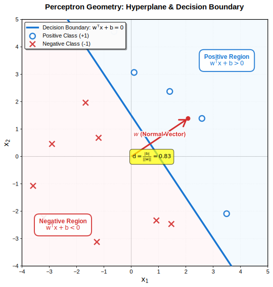
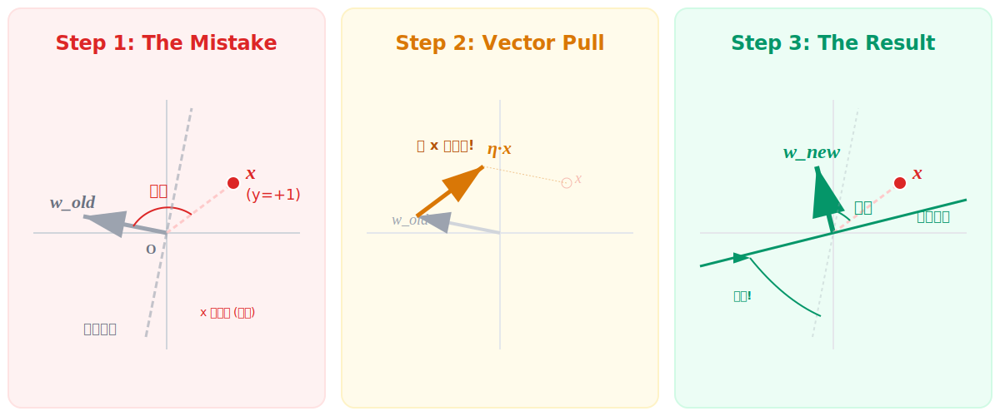
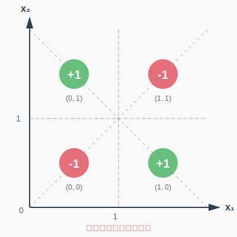

# 第06章 感知机 (Perceptron)

> "The perceptron has probably given rise to more hope, and more disappointment, than any other idea in AI." —— Marvin Minsky

**重要提示**:这不仅仅是一章关于分类器的笔记,这是人类试图用数学模拟大脑的第一次**史诗般的尝试**。

感知机是现代深度学习的**线粒体**。虽然它结构简单,但它蕴含了神经网络最核心的灵魂——**通过误差修正自我**。

本章我们将见证两个极端:一个是数学上的**奇迹**——Novikoff 定理证明了只要真理(线性可分)存在,感知机就一定能找到它;另一个是历史的**悲剧**——Minsky 如何用一个简单的 XOR 问题,将 AI 推入了长达二十年的寒冬。这是一个关于希望、幻灭与重生的故事。

---

## 目录

1. [定义](#1-定义)
2. [几何直观](#2-几何直观)
   - 超平面的性质
3. [损失函数推导](#3-损失函数推导)
   - 3.1 [从 0-1 Loss 开始](#31-从-0-1-loss-开始)
   - 3.2 [过渡到距离损失](#32-过渡到距离损失)
   - 3.3 [感知机损失函数](#33-感知机损失函数)
4. [随机梯度下降](#4-随机梯度下降)
   - 4.1 [梯度计算](#41-梯度计算)
   - 4.2 [更新规则](#42-更新规则)
   - 4.3 [几何直觉](#43-几何直觉)
5. [感知机算法](#5-感知机算法)
6. [Novikoff 收敛定理](#6-novikoff-收敛定理)
   - 6.1 [定理陈述](#61-定理陈述)
   - 6.2 [定理的意义](#62-定理的意义)
   - 6.3 [证明思路 (可选)](#63-证明思路-可选)
7. [感知机 vs SVM](#7-感知机-vs-svm)
8. [XOR 问题与 AI 的寒冬](#8-xor-问题与-ai-的寒冬)
   - 8.1 [XOR 的反例](#81-xor-的反例)
   - 8.2 [历史的教训](#82-历史的教训)
9. [总结](#9-总结)
10. [附录: 对偶形式 (Dual Form)](#附录-对偶形式-dual-form)

---

## 1. 定义

感知机是二分类的线性判别模型:

$$
f(\mathbf{x}) = \text{sign}(\mathbf{w}^T \mathbf{x} + b)
$$

其中:
- $\mathbf{w} \in \mathbb{R}^d$ 是权重向量
- $b \in \mathbb{R}$ 是偏置
- $\text{sign}(z) = \begin{cases} +1, & z \geq 0 \\ -1, & z < 0 \end{cases}$

**本质**: 用超平面 $\mathbf{w}^T \mathbf{x} + b = 0$ 将空间一分为二。

---

## 2. 几何直观

### 超平面的性质



**图示说明**：

这幅图展示了感知机的几何本质——用一个超平面 $\mathbf{w}^T \mathbf{x} + b = 0$ (黑色实线) 将空间一分为二:

- **淡蓝色区域**: 满足 $\mathbf{w}^T \mathbf{x} + b > 0$ 的正类区域，绿色点散布其中
- **淡红色区域**: 满足 $\mathbf{w}^T \mathbf{x} + b < 0$ 的负类区域，红色点散布其中

**法向量 $\mathbf{w}$ 是关键**：

- $\mathbf{w}$ 垂直于超平面，像一个"指南针"，永远指向正类区域
- **它指向哪里，哪里就是正类** (淡蓝色区域)
- 它背对的方向就是负类 (淡红色区域)

关键几何事实:
- **法向量**: $\mathbf{w}$ 不仅指示方向，还决定了超平面的法线朝向
- **决策**: $\mathbf{w}^T \mathbf{x} + b$ 的符号告诉我们点在哪一侧——正值在蓝色区域 (+1)，负值在红色区域 (-1)
- **分类**: 本质上是在计算点相对于超平面的"方位"

**点到超平面的距离**:

$$
d = \frac{|\mathbf{w}^T \mathbf{x} + b|}{\|\mathbf{w}\|}
$$

---

## 3. 损失函数推导

### 3.1 从 0-1 Loss 开始

最自然的想法: 最小化误分类点数

$$
L_\text{0-1}(\mathbf{w}, b) = \sum_{i=1}^N \mathbb{I}\{y_i (\mathbf{w}^T \mathbf{x}_i + b) \leq 0\}
$$

**问题**: 不连续、不可微、难优化。

### 3.2 过渡到距离损失

**观察**: 误分类点 $(\mathbf{x}_i, y_i)$ 满足

$$
y_i (\mathbf{w}^T \mathbf{x}_i + b) < 0
$$

这意味着:
- 如果 $y_i = +1$, 则 $\mathbf{w}^T \mathbf{x}_i + b < 0$ (点在错误一侧)
- 如果 $y_i = -1$, 则 $\mathbf{w}^T \mathbf{x}_i + b > 0$ (点在错误一侧)

**几何意义**: 点 $\mathbf{x}_i$ 到超平面的距离是

$$
d_i = \frac{|\mathbf{w}^T \mathbf{x}_i + b|}{\|\mathbf{w}\|}
$$

对于**误分类点**, $y_i (\mathbf{w}^T \mathbf{x}_i + b) < 0$, 所以

$$
-y_i (\mathbf{w}^T \mathbf{x}_i + b) = |\mathbf{w}^T \mathbf{x}_i + b| > 0
$$

这个量**总是正的**, 且恰好正比于点到超平面的距离!

### 3.3 感知机损失函数

$$
L(\mathbf{w}, b) = -\sum_{\mathbf{x}_i \in M} y_i (\mathbf{w}^T \mathbf{x}_i + b)
$$

其中 $M$ 是误分类点集合。

**理解**:
- 忽略 $\|\mathbf{w}\|$ (不影响优化方向, 可吸收进学习率)
- 只对误分类点计算损失
- 这是 **Hinge Loss 的特例** (SVM 会见到完整版)

---

## 4. 随机梯度下降

### 4.1 梯度计算

对单个误分类点 $(\mathbf{x}_i, y_i)$:

$$
\begin{aligned}
\frac{\partial L}{\partial \mathbf{w}} &= -y_i \mathbf{x}_i \\
\frac{\partial L}{\partial b} &= -y_i
\end{aligned}
$$

### 4.2 更新规则

$$
\begin{aligned}
\mathbf{w} &\leftarrow \mathbf{w} + \eta y_i \mathbf{x}_i \\
b &\leftarrow b + \eta y_i
\end{aligned}
$$

其中 $\eta > 0$ 是学习率。

### 4.3 几何直觉

**关键理解**: 被误分类的样本在"纠正"超平面的方向。

假设当前点 $(\mathbf{x}_i, y_i)$ 被误分类:
- 如果 $y_i = +1$, 意味着 $\mathbf{w}^T \mathbf{x}_i + b < 0$ (点在负半空间)
  - 更新: $\mathbf{w} \leftarrow \mathbf{w} + \eta \mathbf{x}_i$ (让 $\mathbf{w}$ 向 $\mathbf{x}_i$ 靠近)
  - 效果: 使得 $\mathbf{w}^T \mathbf{x}_i$ 增大, 更可能分对

- 如果 $y_i = -1$, 意味着 $\mathbf{w}^T \mathbf{x}_i + b > 0$ (点在正半空间)
  - 更新: $\mathbf{w} \leftarrow \mathbf{w} - \eta \mathbf{x}_i$ (让 $\mathbf{w}$ 远离 $\mathbf{x}_i$)
  - 效果: 使得 $\mathbf{w}^T \mathbf{x}_i$ 减小, 更可能分对

**形象比喻**: 每个误分类点都在"拉扯"超平面, 试图让它转向正确的位置。



**图示说明**：

这幅图讲述了一个三幕剧——感知机如何从错误中学习。

**第一幕: The Mistake (犯错现场)**

红色的点 $x$ 原本是正类 ($y=+1$)，却被灰色的超平面挡在了下方。问题出在哪里？注意看 $w_{\text{old}}$ 与 $x$ 的夹角——是钝角！它们几乎反向。这就是错误的根源：法向量指错了方向。

**第二幕: The Correction (强制纠正)**

关键动作来了：黄色的更新向量 $\eta x$ 像一只强有力的手，抓住 $w_{\text{old}}$，往 $x$ 的方向狠狠推了一把。这不是温柔的调整，而是物理上的强行拉扯。这就是更新公式 $w_{\text{new}} = w_{\text{old}} + \eta x$ 的物理图像——向量相加，力的合成。

**第三幕: The Result (完美收场)**

绿色的新法向量 $w_{\text{new}}$ 诞生了！它已经转向 $x$ 的方向。随之而来的是绿色的新超平面，像一道旋转的门，把 $x$ 从下方"推"到了上方。现在，$x$ 终于位于超平面的正确一侧——分类成功！

**核心直觉**: 每个被误分类的点都在用自己的位置向量"纠正"法向量的方向，就像一群舵手在调整船帆，直到所有人都满意为止。

---

## 5. 感知机算法

```
输入: 训练集 D = {(x_1, y_1), ..., (x_N, y_N)}, 学习率 η
输出: w, b

1. 初始化 w = 0, b = 0
2. repeat:
     随机选择一个误分类点 (x_i, y_i), 即满足
         y_i (w^T x_i + b) ≤ 0
     更新:
         w ← w + η y_i x_i
         b ← b + η y_i
   until 没有误分类点
```

---

## 6. Novikoff 收敛定理

### 6.1 定理陈述

**假设**: 数据线性可分, 即存在 $\mathbf{w}^*, b^*$ 使得

$$
\frac{y_i (\mathbf{w}^{*T} \mathbf{x}_i + b^*)}{\|\mathbf{w}^*\|} \geq \gamma > 0, \quad \forall i
$$

其中 $\gamma$ 称为**间隔** (margin)。

再设 $R = \max_i \|\mathbf{x}_i\|$ (数据的最大范数)。

**结论**: 感知机算法的误分类次数 $k$ 满足

$$
k \leq \left(\frac{R}{\gamma}\right)^2
$$

### 6.2 定理的意义

**核心信息**:
1. **必停性**: 只要数据线性可分, 算法一定收敛
2. **收敛速度**: 依赖于间隔 $\gamma$ 和数据规模 $R$
   - 间隔越大 ($\gamma$ 大), 收敛越快
   - 数据越集中 ($R$ 小), 收敛越快
3. **无需证明细节**: 关键是理解"间隔"的作用

**直观比喻**：

想象你在黑暗中摸索一条"能分开两堆石头的线"：

- **间隔 $\gamma$**：两堆石头之间的"安全距离"
  - 距离大：随便画一条线就能分开，很容易找到（收敛快）
  - 距离小：需要精确定位，反复调整（收敛慢）

- **数据规模 $R$**：石头堆的"分散程度"
  - 石头集中：活动范围小，容易控制（收敛快）
  - 石头分散：需要考虑更大范围（收敛慢）

**数学直觉**：

上界 $k \leq \left(\frac{R}{\gamma}\right)^2$ 告诉我们：
- 最坏情况下的更新次数是 $O(R^2/\gamma^2)$
- 这是一个**有限数**！只要 $\gamma > 0$（线性可分），算法必然停止
- SVM 的灵感就来源于此：既然间隔 $\gamma$ 这么重要，为什么不直接**最大化间隔**？

### 6.3 证明思路 (可选)

核心技巧: 同时跟踪两个量
- $\mathbf{w}^T \mathbf{w}^*$ 每次更新至少增加 $\gamma$
- $\|\mathbf{w}\|^2$ 每次更新至多增加 $R^2$

通过 Cauchy-Schwarz 不等式推出上界。(白板推导时可展开)

---

## 7. 感知机 vs SVM

| 维度 | 感知机 | SVM |
|------|--------|-----|
| **目标** | 找到任意一个分离超平面 | 找到**间隔最大**的分离超平面 |
| **解的唯一性** | 不唯一 (依赖初始化和顺序) | 唯一 (凸优化) |
| **对噪声的鲁棒性** | 弱 (离群点会影响解) | 强 (最大间隔 + 软间隔) |
| **损失函数** | $-y(\mathbf{w}^T \mathbf{x} + b)$ (仅误分类点) | Hinge Loss (所有点) |
| **算法** | 在线学习 (SGD) | 批量优化 (QP) |

**比喻**:
- 感知机: "及格就行" (60分万岁)
- SVM: "追求完美" (满分+安全距离)

---

## 8. XOR 问题与 AI 的寒冬

### 8.1 XOR 的反例

异或问题:

| $x_1$ | $x_2$ | $y$ |
|-------|-------|-----|
| 0     | 0     | -1  |
| 0     | 1     | +1  |
| 1     | 0     | +1  |
| 1     | 1     | -1  |



**问题**: 无法用一条直线分开对角的两类点!

### 8.2 历史的教训

- **1958**: Rosenblatt 提出感知机, AI 界充满希望与期待
- **1969**: Minsky & Papert 在著作《Perceptrons》中严格证明:
  - 单层感知机无法解决 XOR 等非线性问题
  - 多层感知机虽理论可行,但当时缺乏有效训练算法 (反向传播尚未出现)
- **结果**: 这一打击导致 AI 进入第一次寒冬 (1970s-1980s),研究资金骤减
- **转折**: 1986年,Rumelhart等人重新发现反向传播算法,证明多层网络可训练
- **教训**: 线性模型的局限性催生了非线性方法 (核方法、深度神经网络)
- **启示**: Minsky 的批评虽然一度终结了感知机研究,但也为后续的非线性革命埋下了伏笔

---

## 9. 总结

**感知机的价值**:
1. **历史地位**: 最早的学习算法之一, 神经网络的前身
2. **理论意义**: Novikoff 定理保证收敛性
3. **实用性**: 在线学习、简单高效
4. **局限性**: 只能解决线性可分问题

**现代视角**:
- 感知机 → 单层神经网络 (激活函数为 sign)
- 多层感知机 (MLP) → 深度学习
- SVM 吸收了感知机思想, 加入"最大间隔"原则

**关键思想**:
> 优化不是最小化误分类数 (不可微),
> 而是最小化误分类点到超平面的距离和 (可微)。
> 这种"替代损失"的思想贯穿整个机器学习。

---

## 附录: 对偶形式 (Dual Form)

将更新规则改写:

$$
\mathbf{w} = \sum_{i=1}^N \alpha_i y_i \mathbf{x}_i, \quad b = \sum_{i=1}^N \alpha_i y_i
$$

其中 $\alpha_i$ 是样本 $i$ 被误分类的累计次数。

**好处**: 只需计算样本间的内积 $\mathbf{x}_i^T \mathbf{x}_j$ → 核技巧的前奏!

(这部分可在讲 SVM 时深入展开)
