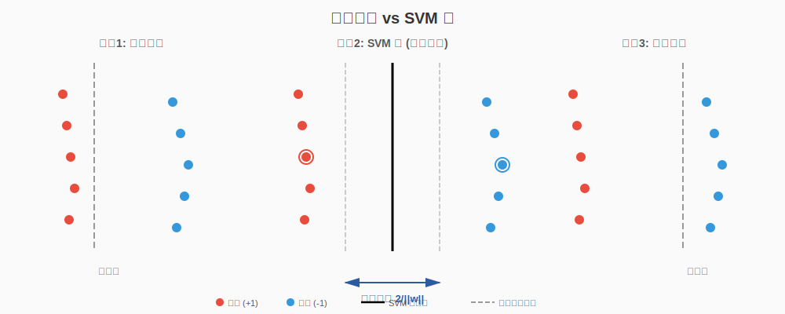
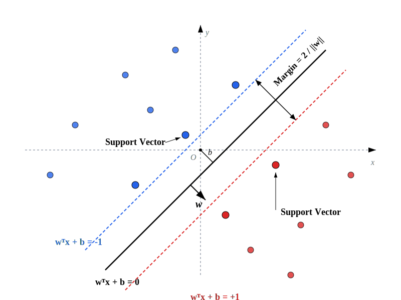
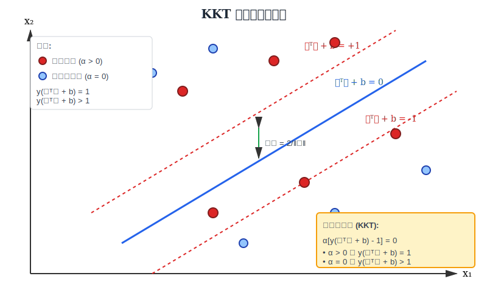
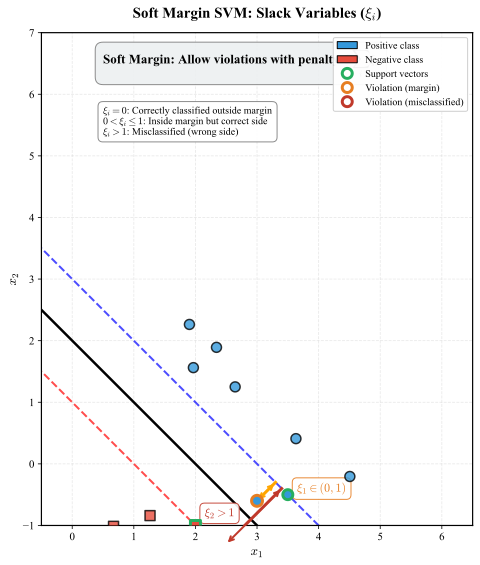
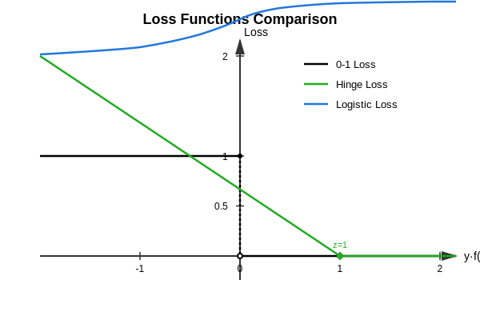
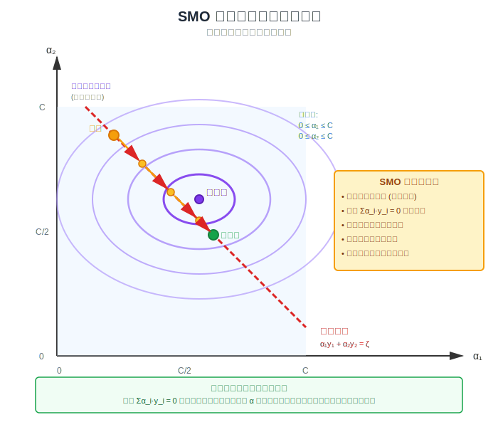
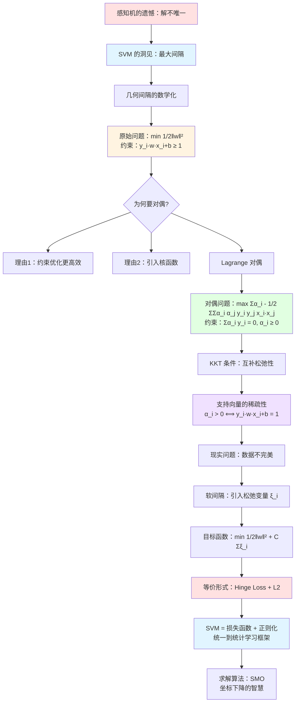

# 第07章：支持向量机 (SVM)

> "Nothing is more practical than a good theory." —— Vladimir Vapnik
>
> **重要提示**：如果说感知机是神经网络的始祖，那么支持向量机 (SVM) 就是统计学习理论的**皇冠**。
>
> 在深度学习爆发之前的二十年里，SVM 统治着机器学习的世界。它的强大不仅仅在于分类效果，更在于其背后坚如磐石的数学理论——**VC 维理论**和**结构风险最小化**。
>
> 本章我们将见证一个算法如何将几何直觉（最大间隔）转化为一个凸优化问题，并通过对偶性（Duality）巧妙地通过"支持向量"来稀疏化模型。这不仅是一个算法，这是数学美学的典范。

---

## 目录

- [一、引言：感知机的遗憾](#一引言感知机的遗憾)
- [二、几何间隔 (Margin)：最宽的分界线](#二几何间隔-margin最宽的分界线)
  - [2.1 函数间隔 vs 几何间隔](#21-函数间隔-vs-几何间隔)
  - [2.2 最大化间隔的数学表达](#22-最大化间隔的数学表达)
  - [2.3 为什么最大化间隔等价于最小化 $\frac{1}{2}\|\mathbf{w}\|^2$？](#23-为什么最大化间隔等价于最小化-frac12\mathbf{w}2)
- [三、对偶问题 (Duality)：优雅的转换](#三对偶问题-duality优雅的转换)
  - [3.1 为何要对偶？](#31-为何要对偶)
  - [3.2 Lagrange 函数构建](#32-lagrange-函数构建)
  - [3.3 对偶问题推导](#33-对偶问题推导)
  - [3.4 KKT 条件与支持向量](#34-kkt-条件与支持向量)
  - [3.5 对偶问题的物理意义](#35-对偶问题的物理意义)
- [四、软间隔 (Soft Margin)：拥抱不完美](#四软间隔-soft-margin拥抱不完美)
  - [4.1 现实世界并不完美](#41-现实世界并不完美)
  - [4.2 引入松弛变量 $\xi$](#42-引入松弛变量-xi)
  - [4.3 软间隔的对偶问题](#43-软间隔的对偶问题)
  - [4.4 Hinge Loss：打通优化视角](#44-hinge-loss打通优化视角)
  - [4.5 SVM = Hinge Loss + L2 正则化](#45-svm--hinge-loss--l2-正则化)
- [五、SMO 算法：高效求解对偶问题](#五smo-算法高效求解对偶问题)
- [六、本章小结](#六本章小结)
- [七、推荐阅读](#七推荐阅读)

---

## 一、引言：感知机的遗憾

在第6章中，我们学习了感知机算法。Novikoff 定理保证了只要数据线性可分，感知机就一定能找到一个分离超平面。但这个定理也暴露了一个致命的问题：

**感知机的解不唯一！**

对于同一个数据集，根据样本访问顺序和初始化的不同，感知机可能收敛到完全不同的超平面。这些超平面虽然都能正确分类训练数据，但它们的泛化能力可能天差地别。



**核心洞见**：我们不仅要找一个"能分开"的超平面，更要找"分得最宽"的那个！

这就是 **最大间隔 (Maximum Margin)** 的思想——SVM 的灵魂。

---

## 二、几何间隔 (Margin)：最宽的分界线

### 2.1 函数间隔 vs 几何间隔

给定训练样本 $(\mathbf{x}_i, y_i)$ 和超平面 $(\mathbf{w}, b)$，我们定义：

**函数间隔 (Functional Margin)**：

$$
\hat{\gamma}_i = y_i (\mathbf{w}^T \mathbf{x}_i + b)
$$

**物理意义**：
- 如果 $y_i = +1$ 且 $\mathbf{w}^T \mathbf{x}_i + b > 0$，则 $\hat{\gamma}_i > 0$（分类正确）
- 如果 $y_i = -1$ 且 $\mathbf{w}^T \mathbf{x}_i + b < 0$，则 $\hat{\gamma}_i > 0$（分类正确）
- $\hat{\gamma}_i$ 越大，分类越"自信"

但函数间隔有个致命问题：**它不具有尺度不变性**。如果我们把 $(\mathbf{w}, b)$ 同时放大 2 倍，超平面没有变化，但函数间隔翻倍了！

**几何间隔 (Geometric Margin)**：

$$
\gamma_i = \frac{y_i (\mathbf{w}^T \mathbf{x}_i + b)}{\|\mathbf{w}\|} = \frac{\hat{\gamma}_i}{\|\mathbf{w}\|}
$$

这正是样本点 $\mathbf{x}_i$ 到超平面的**带符号距离** (Signed Distance)。

> **关键**：几何间隔具有尺度不变性——$(\mathbf{w}, b)$ 放大 $k$ 倍，$\gamma_i$ 不变。

对于整个数据集，定义**间隔 (Margin)** 为所有样本中的最小几何间隔：

$$
\gamma = \min_{i=1,\dots,N} \gamma_i = \min_{i=1,\dots,N} \frac{y_i (\mathbf{w}^T \mathbf{x}_i + b)}{\|\mathbf{w}\|}
$$

---

### 2.2 最大化间隔的数学表达

SVM 的核心思想是：**找到使间隔最大的超平面**。

$$
\begin{aligned}
\max_{\mathbf{w}, b} \quad & \gamma \\
\text{s.t.} \quad & \frac{y_i (\mathbf{w}^T \mathbf{x}_i + b)}{\|\mathbf{w}\|} \geq \gamma, \quad i = 1, \dots, N
\end{aligned}
$$

等价于：

$$
\begin{aligned}
\max_{\mathbf{w}, b} \quad & \frac{\gamma}{\|\mathbf{w}\|} \\
\text{s.t.} \quad & y_i (\mathbf{w}^T \mathbf{x}_i + b) \geq \hat{\gamma}, \quad i = 1, \dots, N
\end{aligned}
$$

这里 $\hat{\gamma} = \gamma \|\mathbf{w}\|$ 是函数间隔。

---

### 2.3 为什么最大化间隔等价于最小化 $\frac{1}{2}\|\mathbf{w}\|^2$？

> **核心问题**：如何把上面的优化问题转化为标准形式？

**Step 1：利用尺度不变性**

由于 $(\mathbf{w}, b)$ 放大 $k$ 倍不改变超平面，我们可以**固定函数间隔 $\hat{\gamma} = 1$**。这是一个技巧性的约定，但不失一般性。

> **关键洞见**：此时几何间隔变为
> $$
> \gamma = \frac{\hat{\gamma}}{\|\mathbf{w}\|} = \frac{1}{\|\mathbf{w}\|}
> $$
> 因此，**最大化间隔 $\gamma$ 就等价于最大化 $\frac{1}{\|\mathbf{w}\|}$，也就是最小化 $\|\mathbf{w}\|$**！

此时问题变为：

$$
\begin{aligned}
\max_{\mathbf{w}, b} \quad & \frac{1}{\|\mathbf{w}\|} \\
\text{s.t.} \quad & y_i (\mathbf{w}^T \mathbf{x}_i + b) \geq 1, \quad i = 1, \dots, N
\end{aligned}
$$

**Step 2：转化为最小化问题**

最大化 $\frac{1}{\|\mathbf{w}\|}$ 等价于最小化 $\|\mathbf{w}\|$，进一步等价于最小化 $\|\mathbf{w}\|^2$（平方不改变单调性，但使问题可微）：

$$
\begin{aligned}
\min_{\mathbf{w}, b} \quad & \frac{1}{2} \|\mathbf{w}\|^2 \\
\text{s.t.} \quad & y_i (\mathbf{w}^T \mathbf{x}_i + b) \geq 1, \quad i = 1, \dots, N
\end{aligned}
$$

> **为什么加系数 $\frac{1}{2}$？**
>
> 纯粹是为了求导方便：$\frac{d}{dw} \frac{1}{2}\|\mathbf{w}\|^2 = \mathbf{w}$，不需要系数 2。

---

**推导小结**：

$$
\boxed{
\begin{aligned}
\text{最大化间隔} \quad & \Leftrightarrow \quad \max \frac{1}{\|\mathbf{w}\|} \\
& \Leftrightarrow \quad \min \|\mathbf{w}\| \\
& \Leftrightarrow \quad \min \frac{1}{2} \|\mathbf{w}\|^2
\end{aligned}
}
$$

这个优化问题称为 **硬间隔 SVM (Hard-Margin SVM)** 的原始问题 (Primal Problem)。



**几何直觉**：
- 约束条件 $y_i (\mathbf{w}^T \mathbf{x}_i + b) \geq 1$ 确保所有点都被正确分类，且至少有距离 $\frac{1}{\|\mathbf{w}\|}$
- 最小化 $\|\mathbf{w}\|^2$ 就是最大化间隔 $\frac{1}{\|\mathbf{w}\|}$
- 图中绿色圆圈标记的点是**支持向量**，它们恰好落在间隔边界上

---

## 三、对偶问题 (Duality)：优雅的转换

### 3.1 为何要对偶？

原始问题已经是一个凸二次规划 (Convex QP)，可以直接求解。那为什么还要转换到对偶问题呢？

**两大理由**：

1. **约束优化更容易解**：
   - 原始问题有 $N$ 个不等式约束（每个样本一个），优化变量是 $d+1$ 维的 $(\mathbf{w}, b)$
   - 对偶问题虽然有 $N$ 个变量（每个样本一个 Lagrange 乘子 $\alpha_i$），但约束更简单（箱约束 $\alpha_i \geq 0$）
   - 现有的 QP Solver（如 SMO 算法）对对偶问题更高效

2. **自然引入核函数**：
   - 对偶问题的解只依赖于样本间的**内积** $\mathbf{x}_i^T \mathbf{x}_j$
   - 这为核技巧 (Kernel Trick) 打开了大门——我们可以把 $\mathbf{x}_i^T \mathbf{x}_j$ 替换为 $K(\mathbf{x}_i, \mathbf{x}_j)$，从而在高维甚至无限维空间中工作，而无需显式计算特征映射

---

### 3.2 Lagrange 函数构建

对于带不等式约束的优化问题：

$$
\begin{aligned}
\min_{\mathbf{w}, b} \quad & \frac{1}{2} \|\mathbf{w}\|^2 \\
\text{s.t.} \quad & 1 - y_i (\mathbf{w}^T \mathbf{x}_i + b) \leq 0, \quad i = 1, \dots, N
\end{aligned}
$$

引入 Lagrange 乘子 $\alpha_i \geq 0$，构造 Lagrange 函数：

$$
L(\mathbf{w}, b, \alpha) = \frac{1}{2} \|\mathbf{w}\|^2 - \sum_{i=1}^N \alpha_i \left[ y_i (\mathbf{w}^T \mathbf{x}_i + b) - 1 \right]
$$

**物理意义**：
- $\frac{1}{2}\|\mathbf{w}\|^2$ 是目标函数（要最小化）
- $-\alpha_i [y_i(\mathbf{w}^T \mathbf{x}_i + b) - 1]$ 是约束的惩罚项
  - 当约束满足时 $y_i(\mathbf{w}^T \mathbf{x}_i + b) \geq 1$，这一项 $\leq 0$
  - 当约束违反时，$\alpha_i$ 增大，惩罚增大

---

### 3.3 对偶问题推导

根据 Lagrange 对偶理论，原始问题等价于：

$$
\min_{\mathbf{w}, b} \max_{\alpha_i \geq 0} L(\mathbf{w}, b, \alpha)
$$

对偶问题是：

$$
\max_{\alpha_i \geq 0} \min_{\mathbf{w}, b} L(\mathbf{w}, b, \alpha)
$$

> **强对偶性**：对于凸优化问题且满足 Slater 条件（存在严格可行解），强对偶性成立，即两者最优值相等。SVM 满足这些条件。

---

**Step 1：对 $\mathbf{w}$ 和 $b$ 求偏导**

$$
\begin{aligned}
\frac{\partial L}{\partial \mathbf{w}} &= \mathbf{w} - \sum_{i=1}^N \alpha_i y_i \mathbf{x}_i = 0 \\
\frac{\partial L}{\partial b} &= -\sum_{i=1}^N \alpha_i y_i = 0
\end{aligned}
$$

得到：

$$
\boxed{
\begin{aligned}
\mathbf{w} &= \sum_{i=1}^N \alpha_i y_i \mathbf{x}_i \\
\sum_{i=1}^N \alpha_i y_i &= 0
\end{aligned}
}
$$

> **核心洞见**：最优权重 $\mathbf{w}$ 是训练样本的**线性组合**！系数 $\alpha_i$ 衡量样本 $i$ 的"重要性"。

---

**Step 2：代入 Lagrange 函数**

将 $\mathbf{w} = \sum_{i=1}^N \alpha_i y_i \mathbf{x}_i$ 代入 $L(\mathbf{w}, b, \alpha)$：

$$
\begin{aligned}
L &= \frac{1}{2} \left\| \sum_{i=1}^N \alpha_i y_i \mathbf{x}_i \right\|^2 - \sum_{i=1}^N \alpha_i y_i \left( \sum_{j=1}^N \alpha_j y_j \mathbf{x}_j^T \mathbf{x}_i + b \right) + \sum_{i=1}^N \alpha_i
\end{aligned}
$$

展开第一项：

$$
\left\| \sum_{i=1}^N \alpha_i y_i \mathbf{x}_i \right\|^2 = \sum_{i=1}^N \sum_{j=1}^N \alpha_i \alpha_j y_i y_j (\mathbf{x}_i^T \mathbf{x}_j)
$$

展开第二项：

$$
\sum_{i=1}^N \alpha_i y_i \sum_{j=1}^N \alpha_j y_j \mathbf{x}_j^T \mathbf{x}_i = \sum_{i=1}^N \sum_{j=1}^N \alpha_i \alpha_j y_i y_j (\mathbf{x}_i^T \mathbf{x}_j)
$$

第二项中的 $b$ 项：

$$
\sum_{i=1}^N \alpha_i y_i b = b \sum_{i=1}^N \alpha_i y_i = 0 \quad \text{(由约束 $\sum_i \alpha_i y_i = 0$)}
$$

因此：

$$
L = \frac{1}{2} \sum_{i,j} \alpha_i \alpha_j y_i y_j (\mathbf{x}_i^T \mathbf{x}_j) - \sum_{i,j} \alpha_i \alpha_j y_i y_j (\mathbf{x}_i^T \mathbf{x}_j) + \sum_i \alpha_i
$$

$$
= \sum_{i=1}^N \alpha_i - \frac{1}{2} \sum_{i=1}^N \sum_{j=1}^N \alpha_i \alpha_j y_i y_j (\mathbf{x}_i^T \mathbf{x}_j)
$$

---

**对偶问题 (Dual Problem)**：

$$
\boxed{
\begin{aligned}
\max_{\alpha} \quad & \sum_{i=1}^N \alpha_i - \frac{1}{2} \sum_{i=1}^N \sum_{j=1}^N \alpha_i \alpha_j y_i y_j (\mathbf{x}_i^T \mathbf{x}_j) \\
\text{s.t.} \quad & \sum_{i=1}^N \alpha_i y_i = 0 \\
& \alpha_i \geq 0, \quad i = 1, \dots, N
\end{aligned}
}
$$

或者写成最小化形式：

$$
\boxed{
\begin{aligned}
\min_{\alpha} \quad & \frac{1}{2} \sum_{i=1}^N \sum_{j=1}^N \alpha_i \alpha_j y_i y_j (\mathbf{x}_i^T \mathbf{x}_j) - \sum_{i=1}^N \alpha_i \\
\text{s.t.} \quad & \sum_{i=1}^N \alpha_i y_i = 0 \\
& \alpha_i \geq 0, \quad i = 1, \dots, N
\end{aligned}
}
$$

---

### 3.4 KKT 条件与支持向量

对于最优解 $(\mathbf{w}^*, b^*, \alpha^*)$，必须满足 **KKT (Karush-Kuhn-Tucker) 条件**：

1. **梯度条件**：
   $$
   \begin{aligned}
   \nabla_\mathbf{w} L &= 0 \quad \Rightarrow \quad \mathbf{w}^* = \sum_{i=1}^N \alpha_i^* y_i \mathbf{x}_i \\
   \frac{\partial L}{\partial b} &= 0 \quad \Rightarrow \quad \sum_{i=1}^N \alpha_i^* y_i = 0
   \end{aligned}
   $$

2. **原始可行性**：
   $$
   y_i (\mathbf{w}^{*T} \mathbf{x}_i + b^*) \geq 1, \quad \forall i
   $$

3. **对偶可行性**：
   $$
   \alpha_i^* \geq 0, \quad \forall i
   $$

4. **互补松弛性 (Complementary Slackness)**：
   $$
   \boxed{\alpha_i^* \left[ y_i (\mathbf{w}^{*T} \mathbf{x}_i + b^*) - 1 \right] = 0, \quad \forall i}
   $$

**互补松弛性的物理意义**：



这个条件将样本分为两类：

- **$\alpha_i^* = 0$**：样本 $i$ 的约束不起作用，$y_i (\mathbf{w}^{*T} \mathbf{x}_i + b^*) > 1$（点在间隔边界外侧）
  - 这些点对模型没有贡献（$\mathbf{w}^* = \sum \alpha_i y_i \mathbf{x}_i$ 中 $\alpha_i = 0$）
  - 可以删除这些样本，模型不变

- **$\alpha_i^* > 0$**：必须 $y_i (\mathbf{w}^{*T} \mathbf{x}_i + b^*) = 1$（点恰好在间隔边界上）
  - 这些点称为 **支持向量 (Support Vectors)**
  - 它们"支撑"着分离超平面，决定了间隔的大小
  - 移动支持向量会改变超平面，移动其他点则不会

---

**支持向量的稀疏性**：

在实践中，通常只有很少一部分样本是支持向量（$\alpha_i > 0$）。这带来两大好处：

1. **模型稀疏**：$\mathbf{w} = \sum_{i \in SV} \alpha_i y_i \mathbf{x}_i$，只需要存储支持向量
2. **预测高效**：$f(x) = \sum_{i \in SV} \alpha_i y_i (\mathbf{x}_i^T \mathbf{x}) + b$，只需计算与支持向量的内积

> **比喻**：在一群人中选代表投票，只有站在边界上的人（支持向量）有投票权，远离边界的人可以回家睡觉了。

---

### 3.5 对偶问题的物理意义

让我们重新审视对偶问题的目标函数：

$$
\max_{\alpha} \quad \sum_{i=1}^N \alpha_i - \frac{1}{2} \sum_{i,j} \alpha_i \alpha_j y_i y_j (\mathbf{x}_i^T \mathbf{x}_j)
$$
**第一项 $\sum_i \alpha_i$**：
- 鼓励 $\alpha_i$ 变大
- 物理意义：每个样本都"想要"贡献更多权重

**第二项 $-\frac{1}{2} \sum_{i,j} \alpha_i \alpha_j y_i y_j (\mathbf{x}_i^T \mathbf{x}_j)$**：
- 惩罚同类样本之间的权重组合（$y_i = y_j$ 时，$y_i y_j = +1$，内积越大惩罚越大）
- 鼓励异类样本之间的权重组合（$y_i \neq y_j$ 时，$y_i y_j = -1$）
- 物理意义：模型倾向于选择"有代表性"的样本（不重复、分散）

**约束 $\sum_i \alpha_i y_i = 0$**：
- 正负样本的权重必须平衡
- 防止模型偏向某一类

---

**计算 $b^*$**：

对于任意支持向量 $\mathbf{x}_s$（满足 $\alpha_s > 0$），有：

$$
y_s (\mathbf{w}^{*T} \mathbf{x}_s + b^*) = 1
$$

因此：

$$
b^* = y_s - \mathbf{w}^{*T} \mathbf{x}_s = y_s - \sum_{i=1}^N \alpha_i^* y_i (\mathbf{x}_i^T \mathbf{x}_s)
$$

实践中通常对所有支持向量取平均以提高数值稳定性：

$$
b^* = \frac{1}{|SV|} \sum_{s \in SV} \left[ y_s - \sum_{i=1}^N \alpha_i^* y_i (\mathbf{x}_i^T \mathbf{x}_s) \right]
$$
---

## 四、软间隔 (Soft Margin)：拥抱不完美

### 4.1 现实世界并不完美

硬间隔 SVM 要求数据**完全线性可分**，即存在超平面将两类数据完美分开。但现实世界往往存在：

1. **噪声 (Noise)**：标注错误的样本
2. **离群点 (Outliers)**：远离主流分布的样本
3. **本质不可分**：两类数据分布重叠

如果强行使用硬间隔 SVM：
- 可能无解（约束不可行）
- 或者得到间隔极小的超平面（过拟合）

```
     完美世界 (Hard Margin)          现实世界 (Soft Margin)
         +  |  -                         +  |  -
         +  |  -                         + ×|  -    ← 噪声点
         +  |  -                         +  |  -
         +  |  -                         +  | ×-    ← 离群点
    ──────────────                  ──────────────
    所有点都满足间隔               允许少数点违反间隔
```

**核心思想**：我们需要一种机制，允许少数样本违反间隔约束，但要为这种违反付出代价。

---

### 4.2 引入松弛变量 $\xi$

对于每个样本 $(\mathbf{x}_i, y_i)$，引入**松弛变量 (Slack Variable)** $\xi_i \geq 0$，放宽约束：

$$
y_i (\mathbf{w}^T \mathbf{x}_i + b) \geq 1 - \xi_i
$$
**物理意义**：
- $\xi_i = 0$：样本正确分类且满足间隔（$y_i (\mathbf{w}^T \mathbf{x}_i + b) \geq 1$）
- $0 < \xi_i \leq 1$：样本正确分类但在间隔内（$0 < y_i (\mathbf{w}^T \mathbf{x}_i + b) < 1$）
- $\xi_i > 1$：样本被误分类（$y_i (\mathbf{w}^T \mathbf{x}_i + b) < 0$）



上图直观展示了松弛变量 $\xi$ 的几何含义：
- **橙色边框的点**：进入间隔但未跨越决策边界（$0 < \xi_1 < 1$）
- **深红色边框的点**：跨越决策边界被误分类（$\xi_2 > 1$）
- 红色线段的长度正是松弛变量 $\xi$ 的大小，代表违规的程度

**软间隔 SVM 的原始问题**：

$$
\boxed{
\begin{aligned}
\min_{\mathbf{w}, b, \xi} \quad & \frac{1}{2} \|\mathbf{w}\|^2 + C \sum_{i=1}^N \xi_i \\
\text{s.t.} \quad & y_i (\mathbf{w}^T \mathbf{x}_i + b) \geq 1 - \xi_i, \quad i = 1, \dots, N \\
& \xi_i \geq 0, \quad i = 1, \dots, N
\end{aligned}
}
$$

**目标函数解读**：

$$
\frac{1}{2}\|\mathbf{w}\|^2 + C \sum_{i=1}^N \xi_i
$$
- **第一项 $\frac{1}{2}\|\mathbf{w}\|^2$**：最大化间隔（结构风险）
- **第二项 $C \sum_i \xi_i$**：最小化违反间隔的总量（经验风险）
- **$C > 0$**：权衡参数
  - $C$ 很大：严惩违反，接近硬间隔（容易过拟合）
  - $C$ 很小：容忍违反，间隔更大（容易欠拟合）

> **连接到第1章**：这正是**结构风险最小化 (SRM)** 的体现！
>
> $$
> \text{结构风险} = \underbrace{\sum_i \xi_i}_{\text{经验风险}} + \underbrace{\frac{1}{2C} \|\mathbf{w}\|^2}_{\text{正则化项}}
> $$

---

### 4.3 软间隔的对偶问题

构造 Lagrange 函数（引入乘子 $\alpha_i \geq 0$ 和 $\mu_i \geq 0$）：

$$
L(\mathbf{w}, b, \xi, \alpha, \mu) = \frac{1}{2}\|\mathbf{w}\|^2 + C \sum_i \xi_i - \sum_i \alpha_i [y_i(\mathbf{w}^T \mathbf{x}_i + b) - 1 + \xi_i] - \sum_i \mu_i \xi_i
$$

对 $\mathbf{w}, b, \xi$ 求偏导并令为零：

$$
\begin{aligned}
\frac{\partial L}{\partial \mathbf{w}} &= \mathbf{w} - \sum_i \alpha_i y_i \mathbf{x}_i = 0 \quad &\Rightarrow \quad \mathbf{w} = \sum_i \alpha_i y_i \mathbf{x}_i \\
\frac{\partial L}{\partial b} &= -\sum_i \alpha_i y_i = 0 \quad &\Rightarrow \quad \sum_i \alpha_i y_i = 0 \\
\frac{\partial L}{\partial \xi_i} &= C - \alpha_i - \mu_i = 0 \quad &\Rightarrow \quad \alpha_i + \mu_i = C
\end{aligned}
$$

**关键推导**：第三个等式 $\alpha_i + \mu_i = C$ 来自对松弛变量 $\xi_i$ 的求导：

- Lagrange 函数中，$\xi_i$ 的系数为 $C - \alpha_i - \mu_i$
- 令 $\frac{\partial L}{\partial \xi_i} = 0$，得到 $\alpha_i + \mu_i = C$
- 结合约束 $\alpha_i \geq 0$ 和 $\mu_i \geq 0$，我们得到：

$$
\boxed{0 \leq \alpha_i \leq C}
$$

> **物理意义**：参数 $C$ 为 Lagrange 乘子 $\alpha_i$ 设定了**上界**！
> - $\alpha_i = 0$：$\mu_i = C$（非支持向量）
> - $0 < \alpha_i < C$：$\mu_i > 0$，由 $\mu_i \xi_i = 0$ 得 $\xi_i = 0$（边界上的支持向量）
> - $\alpha_i = C$：$\mu_i = 0$，$\xi_i$ 可以 $> 0$（间隔内或误分类的支持向量）

代入 Lagrange 函数，得到与硬间隔相同的对偶目标函数，只是约束变为**箱约束 (Box Constraint)**：

$$
\boxed{
\begin{aligned}
\max_{\alpha} \quad & \sum_{i=1}^N \alpha_i - \frac{1}{2} \sum_{i,j} \alpha_i \alpha_j y_i y_j (\mathbf{x}_i^T \mathbf{x}_j) \\
\text{s.t.} \quad & \sum_{i=1}^N \alpha_i y_i = 0 \\
& 0 \leq \alpha_i \leq C, \quad i = 1, \dots, N
\end{aligned}
}
$$

**KKT 条件**：

$$
\begin{aligned}
\alpha_i [y_i(\mathbf{w}^T \mathbf{x}_i + b) - 1 + \xi_i] &= 0 \\
\mu_i \xi_i &= 0 \\
\mu_i &= C - \alpha_i
\end{aligned}
$$

**样本分类**（根据 $\alpha_i$ 的值）：

1. **$\alpha_i = 0$**：
   - $y_i(\mathbf{w}^T \mathbf{x}_i + b) > 1$，样本在间隔外侧，正确分类
   - 不是支持向量

2. **$0 < \alpha_i < C$**：
   - $\mu_i = C - \alpha_i > 0$，由 $\mu_i \xi_i = 0$ 得 $\xi_i = 0$
   - $y_i(\mathbf{w}^T \mathbf{x}_i + b) = 1$，样本在间隔边界上
   - **支持向量**（用于计算 $b$）

3. **$\alpha_i = C$**：
   - $\mu_i = 0$，$\xi_i$ 可以大于 0
   - $y_i(\mathbf{w}^T \mathbf{x}_i + b) = 1 - \xi_i < 1$
   - 若 $\xi_i \leq 1$：样本在间隔内但正确分类
   - 若 $\xi_i > 1$：样本被误分类
   - **支持向量**（但不用于计算 $b$）

---

### 4.4 Hinge Loss：打通优化视角

现在我们从另一个角度理解 SVM——**损失函数 + 正则化**的框架。

**Hinge Loss 定义**：

$$
\ell_{\text{hinge}}(y, f(x)) = \max(0, 1 - y \cdot f(x)) = [1 - y \cdot f(x)]_+
$$

其中 $f(x) = \mathbf{w}^T \mathbf{x} + b$ 是决策函数（未经 sign）。

**物理意义**：
- 如果 $y \cdot f(x) \geq 1$（正确分类且满足间隔）：损失为 0
- 如果 $y \cdot f(x) < 1$（违反间隔或误分类）：损失为 $1 - y \cdot f(x)$



**Hinge Loss vs Logistic Loss 对比**：


**关键观察**：Hinge Loss 等价于松弛变量！

对于约束 $y_i(\mathbf{w}^T \mathbf{x}_i + b) \geq 1 - \xi_i$ 和 $\xi_i \geq 0$，有：

$$
\xi_i \geq \max(0, 1 - y_i(\mathbf{w}^T \mathbf{x}_i + b)) = [1 - y_i(\mathbf{w}^T \mathbf{x}_i + b)]_+
$$

当最小化 $\sum_i \xi_i$ 时，最优解必然是：

$$
\xi_i^* = [1 - y_i(\mathbf{w}^T \mathbf{x}_i + b)]_+
$$

---

### 4.5 SVM = Hinge Loss + L2 正则化

将 $\xi_i = [1 - y_i(\mathbf{w}^T \mathbf{x}_i + b)]_+$ 代入软间隔 SVM 的目标函数：

$$
\min_{\mathbf{w}, b} \quad \frac{1}{2}\|\mathbf{w}\|^2 + C \sum_{i=1}^N [1 - y_i(\mathbf{w}^T \mathbf{x}_i + b)]_+
$$

改写为：

$$
\boxed{
\min_{\mathbf{w}, b} \quad \underbrace{\sum_{i=1}^N [1 - y_i(\mathbf{w}^T \mathbf{x}_i + b)]_+}_{\text{经验风险：Hinge Loss}} + \underbrace{\frac{\lambda}{2} \|\mathbf{w}\|^2}_{\text{正则化：L2}}
}
$$

其中 $\lambda = \frac{1}{C}$。

> **惊人的结论**：
>
> **SVM 的本质就是 Hinge Loss + L2 正则化！**
>
> 这完全符合第1章的"统计学习三要素"框架：
> - **模型**：线性分类器 $f(x) = \mathbf{w}^T \mathbf{x} + b$
> - **策略**：Hinge Loss + 正则化
> - **算法**：通过对偶问题用 SMO 求解

**与逻辑回归对比**：

| 模型 | 损失函数 | 正则化 | 优化 |
|------|----------|--------|------|
| **逻辑回归** | Cross-Entropy Loss | L2 (Ridge) | 梯度下降 |
| **SVM** | Hinge Loss | L2 | 对偶 QP (SMO) |

两者都是线性分类器，区别仅在于损失函数的选择！

```
损失函数对比：

loss
  ^
  |   Cross-Entropy (光滑)
  |        ___---
  |   ___/
  | _/    Hinge (折线)
  |/        /
  |        /
  |───────/────→  y·f(x)
 -2  -1  0  1  2

Hinge Loss 在 y·f(x) ≥ 1 时损失为 0（稀疏性）
Cross-Entropy 永远不为 0（所有样本都贡献）
```

---

**为什么 SVM 能产生稀疏解（支持向量）？**

关键在于 Hinge Loss 的**零区域**：
- 当 $y_i(\mathbf{w}^T \mathbf{x}_i + b) \geq 1$ 时，$\ell_{\text{hinge}} = 0$，该样本对梯度没有贡献
- 对应地，对偶问题中 $\alpha_i = 0$（非支持向量）
- 只有在间隔边界或违反间隔的样本（$y_i(\mathbf{w}^T \mathbf{x}_i + b) \leq 1$）才是支持向量

相比之下，Cross-Entropy Loss 永远 $> 0$，所有样本都有贡献，无法产生稀疏性。

---

## 五、SMO 算法：高效求解对偶问题

对偶问题是一个二次规划 (QP)，理论上可以用通用 QP Solver 求解。但对于大规模数据，这些方法效率低下。

**SMO (Sequential Minimal Optimization)** 算法由 John Platt 于 1998 年提出，是求解 SVM 对偶问题的标准方法。

### 5.1 核心思想：在约束直线上跳舞

想象你要找到一个函数的最小值，但你的手脚被绳子绑住了（约束条件）。SMO 的聪明之处在于：

**每次只松开两只手，在绳子允许的范围内调整位置，然后再绑上。**

更正式地说：

- 每次只优化**两个** $\alpha_i$ 和 $\alpha_j$，固定其他所有变量
- 由于约束 $\sum_i \alpha_i y_i = 0$，固定其他变量后，这两个变量之间存在**线性关系**
- 优化路径被限制在一条直线上（见下图），问题变成了一维搜索，可以解析求解！



**几何直观**：

- **紫色椭圆**：目标函数的等高线（越靠内侧，目标函数值越优）
- **红色直线**：约束 $\alpha_1 y_1 + \alpha_2 y_2 = \zeta$（常数）
- **优化路径**：只能沿着红色直线移动（黄色→绿色点）
- **最优解**：直线与最内层等高线的切点（或在边界上）

### 5.2 为什么每次选两个？

**约束的限制**：

约束 $\sum_{i=1}^N \alpha_i y_i = 0$ 是**等式约束**，这意味着：

- 如果只改变一个 $\alpha_i$，会破坏和为零的平衡
- 改变两个变量是满足约束的**最小可行单位**

**数学推导**：

固定除 $\alpha_1, \alpha_2$ 外的所有变量，约束变为：

$$
\alpha_1 y_1 + \alpha_2 y_2 = -\sum_{i=3}^N \alpha_i y_i = \zeta \quad \text{(常数)}
$$

这是一条**直线**！我们可以用 $\alpha_2$ 表示 $\alpha_1$：

$$
\alpha_1 = (\zeta - \alpha_2 y_2) y_1
$$

（因为 $y_1^2 = 1$）

将其代入目标函数，就得到了一个**关于 $\alpha_2$ 的一元二次函数**，求导即可得到解析解！

### 5.3 算法框架（简化版）

```
输入: 数据集 D = {(x_1, y_1), ..., (x_N, y_N)}, 参数 C, 容忍度 tol
输出: α, b

1. 初始化 α = 0, b = 0

2. repeat:
     (a) 选择两个违反 KKT 条件最严重的 α_i 和 α_j
         - 外循环：遍历所有不满足 KKT 的样本
         - 内循环：选择使目标函数下降最快的配对

     (b) 固定其他 α，解析求解最优的 (α_i, α_j)
         - 计算约束直线的端点（由箱约束 0 ≤ α ≤ C 决定）
         - 求一元二次函数的极值点
         - 截断到可行域内

     (c) 更新 α_i, α_j

     (d) 更新 b（使用支持向量）

   until 所有 α 都满足 KKT 条件 (在容忍度 tol 内)
```

### 5.4 SMO 的优势

- ✅ **无需矩阵运算**：避免存储和操作 $N \times N$ 的 Gram 矩阵（内积矩阵）
- ✅ **解析解**：每步子问题有闭式解，无需数值优化
- ✅ **内存高效**：只需存储当前优化的两个变量
- ✅ **适合大规模数据**：复杂度远低于通用 QP Solver 的 $O(N^3)$

### 5.5 直观类比

**传统 QP Solver**：像是同时调整一个乐队中所有乐器的音量，需要复杂的协调。

**SMO 算法**：像是一次只调整两个乐器，听听效果，再调下一对。虽然看起来慢，但每次调整都很快（解析解），而且不需要记住所有乐器的状态。

**关键洞见**：
> 把一个 $N$ 维的复杂优化问题，分解成一系列**二维平面上的简单问题**（约束直线上的一维搜索）。这是"分而治之"思想在优化算法中的精彩应用。

### 5.6 SMO vs 梯度下降

| 维度 | SMO | 梯度下降 |
|------|-----|----------|
| **更新方式** | 每次选两个变量，解析求解 | 每次沿负梯度方向小步移动 |
| **约束处理** | 自然满足约束（在约束直线上） | 需要投影回可行域 |
| **收敛速度** | 较快（大步跳跃） | 较慢（小步迭代） |
| **适用场景** | 中等规模 SVM | 大规模深度学习 |

**历史趣闻**：

John Platt 在微软研究院提出 SMO 时，SVM 的主要瓶颈是求解对偶问题的速度。SMO 的出现让 SVM 在工业界的大规模应用成为可能，是 SVM 从学术走向实用的关键一步。

---

**延伸阅读**：

完整的 SMO 算法还包括：
- **启发式选择策略**：如何高效选择 $\alpha_i, \alpha_j$（Platt 的论文给出了两层循环策略）
- **数值稳定性**：处理边界情况（$\alpha = 0$ 或 $\alpha = C$）
- **缓存优化**：避免重复计算核函数值

这些细节在实现 LIBSVM 等工业级库时至关重要，但核心思想就是上面的**坐标下降在约束直线上的优化**。

---

## 六、本章小结

本章我们完成了从感知机到 SVM 的华丽转身。让我们回顾这个数学与几何交织的旅程：

**核心思想的演进**：



---

**从三个视角理解 SVM**：

1. **几何视角**：
   - SVM 寻找使间隔最大的分离超平面
   - 支持向量是决定间隔的关键样本
   - 间隔 = $\frac{2}{\|\mathbf{w}\|}$，最大化间隔 = 最小化 $\|\mathbf{w}\|^2$

2. **优化视角**：
   - 原始问题：带约束的凸二次规划
   - 对偶问题：将 $N$ 个不等式约束转化为 $N$ 个变量
   - KKT 条件揭示了支持向量的稀疏性

3. **统计学习视角**：
   - SVM = Hinge Loss + L2 正则化
   - 目标函数 = 经验风险（$\sum \xi_i$）+ 结构风险（$\frac{1}{2}\|\mathbf{w}\|^2$）
   - 参数 $C$ 控制权衡，连接到第1章的 SRM 框架

---

**关键数学技巧**：

1. **尺度不变性**：利用 $(\mathbf{w}, b) \to (kw, kb)$ 不改变超平面，固定函数间隔 $\hat{\gamma} = 1$
2. **Lagrange 对偶**：将约束优化转化为无约束优化（在对偶空间）
3. **KKT 条件**：互补松弛性 $\alpha_i [y_i(\mathbf{w}^T \mathbf{x}_i + b) - 1] = 0$ 揭示支持向量
4. **松弛变量消元**：$\xi_i = [1 - y_i(\mathbf{w}^T \mathbf{x}_i + b)]_+$ 连接到 Hinge Loss

---

**SVM 的优势**：

- ✅ 坚实的理论基础（VC 维、结构风险最小化）
- ✅ 凸优化问题，全局最优解
- ✅ 稀疏解（只依赖支持向量）
- ✅ 内积形式，自然支持核技巧（下一章）
- ✅ 对高维数据表现优异

**SVM 的局限**：

- ❌ 对大规模数据训练慢（$O(N^2)$ 到 $O(N^3)$）
- ❌ 对参数（$C$、核参数）敏感
- ❌ 难以处理多分类（需要 OvR 或 OvO）
- ❌ 输出不是概率（与逻辑回归不同）

---

**与第1章的连接**：

回顾第1章的结构风险最小化公式：

$$
\min_{f \in \mathcal{F}} \underbrace{\frac{1}{N} \sum_{i=1}^N L(y_i, f(\mathbf{x}_i))}_{\text{经验风险}} + \underbrace{\lambda J(f)}_{\text{正则化}}
$$

SVM 完美实例化了这个框架：

$$
\min_{\mathbf{w}, b} \underbrace{\sum_{i=1}^N [1 - y_i(\mathbf{w}^T \mathbf{x}_i + b)]_+}_{\text{Hinge Loss（经验风险）}} + \underbrace{\frac{\lambda}{2} \|\mathbf{w}\|^2}_{\text{L2 正则化（结构风险）}}
$$

而参数 $C = \frac{1}{\lambda}$ 正是权衡这两者的旋钮。

---

**哲学启示**：

SVM 的成功揭示了机器学习的一个深刻原则：

> **简单性优于复杂性**（Occam's Razor）
>
> 在满足数据的前提下，选择最"简单"的模型（最大间隔）。这种简单性不仅体现在几何上（间隔最大），也体现在代数上（$\|\mathbf{w}\|$ 最小），更体现在泛化能力上（支持向量的稀疏性）。

Vapnik 的名言 "Nothing is more practical than a good theory" 在 SVM 中得到了完美体现：从 VC 维理论出发，推导出最大间隔原则，最终落地为高效的算法（SMO）。这是理论指导实践的典范。

---

**下章预告**：

本章我们推导对偶问题时，发现最优解只依赖于样本间的**内积** $\mathbf{x}_i^T \mathbf{x}_j$。这个看似不起眼的细节，却打开了一扇通往高维甚至无限维空间的大门。

下一章 **[第08章：核方法 (Kernel Methods)](第08章_核方法.md)** 将揭示核技巧 (Kernel Trick) 的魔力：我们将看到如何在不显式计算高维特征的情况下，让 SVM 在无限维空间中工作。这不仅适用于 SVM，更是一套通用的数学工具，将线性算法拓展到非线性世界。

同时，我们还会探讨经典的核函数（多项式核、RBF 核），理解 Mercer 定理（什么样的函数可以作为核），以及核方法的几何直观（特征空间的隐式映射）。准备好迎接这场"维度的魔法"吧！

---

## 七、推荐阅读

**经典教材**：
- **《统计学习方法》 - 第7章 支持向量机** (李航)：清晰的推导，适合初学者
- **《Pattern Recognition and Machine Learning》 - Chapter 7** (Christopher Bishop)：从概率视角理解 SVM
- **《The Elements of Statistical Learning》 - Chapter 12** (Hastie, Tibshirani, Friedman)：SVM 与其他方法的对比

**论文**：
- **Cortes & Vapnik (1995). "Support-Vector Networks"**：SVM 的开创性论文
- **Platt (1998). "Sequential Minimal Optimization"**：SMO 算法原文
- **Vapnik (1999). "The Nature of Statistical Learning Theory"**：VC 维理论的系统阐述

**视频**：
- **白板推导系列 - P7~P9 支持向量机** (shuhuai008, B站)：详细的板书推导，强烈推荐
- **Stanford CS229 - Lecture 6** (Andrew Ng)：SVM 的直观讲解

**实践工具**：
- **scikit-learn SVM 文档**：`sklearn.svm.SVC` 的使用与调参技巧
- **LIBSVM**：经典的 SVM 库，了解工程实现

---

**练习题**（检验理解）：

1. **几何理解**：为什么间隔 = $\frac{2}{\|\mathbf{w}\|}$？画图推导。

2. **对偶推导**：手动推导软间隔 SVM 的对偶问题，特别注意约束 $\alpha_i + \mu_i = C$ 的来源。

3. **KKT 条件**：给定一个解 $(\mathbf{w}^*, b^*, \alpha^*)$，如何验证它满足 KKT 条件？

4. **支持向量**：在软间隔 SVM 中，$\alpha_i = C$ 的样本一定被误分类吗？为什么？

5. **等价性证明**：严格证明 $\min_{\mathbf{w},b} \frac{1}{2}\|\mathbf{w}\|^2 + C\sum_i \xi_i$ 等价于 $\min_{\mathbf{w},b} \sum_i [1-y_i(\mathbf{w}^T \mathbf{x}_i + b)]_+ + \frac{1}{2C}\|\mathbf{w}\|^2$。

6. **编程实现**：从零实现一个简化版的 SMO 算法（只需处理线性核、小规模数据）。

---

> "In God we trust, all others bring data." —— W. Edwards Deming
>
> SVM 教会我们：当数据说话时，让数学倾听；当理论指引时，让算法践行。这种理论与实践的完美结合，正是机器学习之美。
