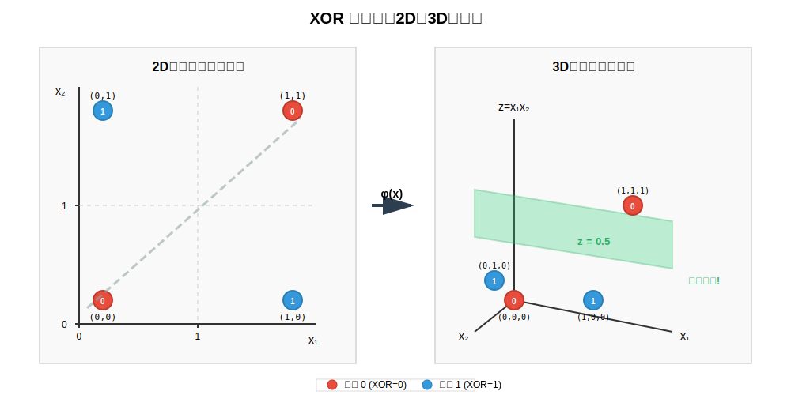
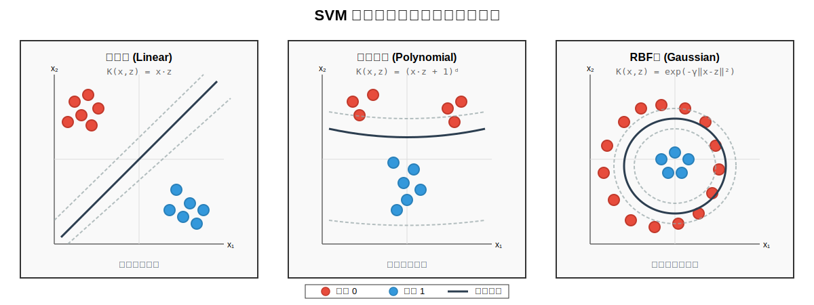

# 第 08 章 核方法 (Kernel Methods)

> "The curse of dimensionality is the blessing of kernel methods."
>
> 很多时候，我们在低维空间撞得头破血流（比如 XOR 问题），却不知道只要退后一步，升到一个更高的维度，一切都会因为稀疏而变得线性可分。
>
> 核方法是机器学习中**"升维打击"**的数学实现。它的魔力在于：我们可以在无限维的空间中挥舞利剑，却只需要支付有限维的计算代价。本章将揭示这个"免费午餐"背后的数学秘密——核技巧 (Kernel Trick)。

**与前序章节的联系**：

- **第 5 章（线性回归）** 为我们建立了岭回归的原始形式：$w^* = (X^T X + \lambda I)^{-1} X^T y$
- **本章**将展示如何通过核技巧将其推广到无穷维特征空间：$\alpha^* = (\mathbf{K} + \lambda I)^{-1} y$
- 两者通过**对偶性**完美呼应：线性岭回归在特征空间优化，核岭回归在样本空间优化

---

## 目录

1. [直觉：维度打击](#1-直觉维度打击)
2. [代价：维度的诅咒](#2-代价维度的诅咒)
3. [救赎：核技巧 (Kernel Trick)](#3-救赎核技巧-kernel-trick)
4. [Mercer 定理：什么样的函数能当核？](#4-mercer-定理什么样的函数能当核)
5. [RBF 核：通往无穷维](#5-rbf-核通往无穷维)
6. [应用：核化一切](#6-应用核化一切)
   - 6.1 [表示定理](#61-表示定理-representer-theorem)
   - 6.2 [核化的一般步骤](#62-核化的一般步骤)
   - 6.3 [案例：核岭回归](#63-案例核岭回归-kernel-ridge-regression)
   - 6.4 [其他可核化算法](#64-其他可核化算法)
7. [总结与展望](#7-总结与展望)

---

## 1. 直觉：维度打击

### 1.1 XOR 问题：二维空间的绝望

考虑经典的 XOR (异或) 问题：

| $x_1$ | $x_2$ | 类别 |
|-------|-------|------|
| 0     | 0     | 0    |
| 0     | 1     | 1    |
| 1     | 0     | 1    |
| 1     | 1     | 0    |

**问题**：在二维平面上，**不存在一条直线**能够将两个类别分开。

无论你怎么尝试，任何线性分类器 $w_1 x_1 + w_2 x_2 + b = 0$ 都会犯错。这是线性模型的根本局限。



### 1.2 升维的魔法：三维空间的救赎

定义映射 $\phi: \mathbb{R}^2 \to \mathbb{R}^3$：

$$
\phi(x) = \phi\begin{pmatrix} x_1 \\ x_2 \end{pmatrix} = \begin{pmatrix} x_1 \\ x_2 \\ x_1 x_2 \end{pmatrix}
$$

将 XOR 数据映射到三维空间：

$$
\begin{aligned}
\phi\begin{pmatrix} 0 \\ 0 \end{pmatrix} &= \begin{pmatrix} 0 \\ 0 \\ 0 \end{pmatrix} \quad &\text{(类别 0)} \\[0.5em]
\phi\begin{pmatrix} 0 \\ 1 \end{pmatrix} &= \begin{pmatrix} 0 \\ 1 \\ 0 \end{pmatrix} \quad &\text{(类别 1)} \\[0.5em]
\phi\begin{pmatrix} 1 \\ 0 \end{pmatrix} &= \begin{pmatrix} 1 \\ 0 \\ 0 \end{pmatrix} \quad &\text{(类别 1)} \\[0.5em]
\phi\begin{pmatrix} 1 \\ 1 \end{pmatrix} &= \begin{pmatrix} 1 \\ 1 \\ 1 \end{pmatrix} \quad &\text{(类别 0)}
\end{aligned}
$$

**奇迹发生**：在三维空间中，一个简单的平面 $z_3 = 0.5$ 就能完美分割两个类别！

### 1.3 推导：为什么升维有效？

**Cover 定理** (Cover's Theorem)：

> 将复杂模式投射到高维空间，模式更可能线性可分。

**直觉**：
- 在 $d$ 维空间中，$n$ 个点被随机二分的方式有 $2^n$ 种
- 用超平面线性可分的方式数量随着维度 $d$ 增加而增加
- 当 $d \geq n-1$ 时，几乎所有的二分都是线性可分的

**数学表达**：

在 $d$ 维空间中，$n$ 个一般位置的点，线性可分的二分数量为：

$$
C(n, d) = 2 \sum_{k=0}^{d} \binom{n-1}{k}
$$

当 $d = n-1$ 时，$C(n, d) = 2^n$，即所有二分都可分！

**XOR 的验证**：

对于 XOR，$n = 4$，原始维度 $d = 2$：
- $C(4, 2) = 2(\binom{3}{0} + \binom{3}{1} + \binom{3}{2}) = 2(1 + 3 + 3) = 14 < 2^4 = 16$

升维到 $d = 3$：
- $C(4, 3) = 2(\binom{3}{0} + \binom{3}{1} + \binom{3}{2} + \binom{3}{3}) = 2(1 + 3 + 3 + 1) = 16 = 2^4$

所有二分都可分，包括 XOR！

---

## 2. 代价：维度的诅咒

### 2.1 多项式特征的维度爆炸

假设我们要将 $n$ 维输入映射到 $d$ 阶多项式特征空间。

**例子**：2 维输入 $x = (x_1, x_2)$，2 阶多项式映射：

$$
\phi(x) = (1, x_1, x_2, x_1^2, x_1 x_2, x_2^2)
$$

维度从 $2 \to 6$。

**一般情况**：$n$ 维输入，$d$ 阶多项式，特征空间维度为：

$$
\text{dim}(\phi(x)) = \binom{n+d}{d} = \frac{(n+d)!}{n! \, d!}
$$

**推导**：

$d$ 阶多项式的单项式数量，等价于将 $d$ 个相同的球放入 $n$ 个不同的盒子（允许空盒），即多重集合问题：

$$
\binom{n+d}{d} = \binom{n+d}{n}
$$

### 2.2 复杂度爆炸实例

| $n$ (维度) | $d$ (阶数) | 特征维度 | 增长倍数 |
|-----------|-----------|---------|---------|
| 10  | 2   | 66       | 6.6× |
| 10  | 3   | 286      | 28.6× |
| 10  | 5   | 3,003    | 300× |
| 100 | 2   | 5,151    | 51.5× |
| 100 | 3   | 176,851  | 1,769× |
| 100 | 5   | 79,208,745 | 792,087× |

**问题**：
1. **存储开销**：需要 $O(\binom{n+d}{d})$ 空间存储 $\phi(x)$
2. **计算开销**：计算 $\phi(x)$ 需要 $O(\binom{n+d}{d})$ 时间
3. **内积开销**：计算 $\phi(x)^T \phi(z)$ 需要 $O(\binom{n+d}{d})$ 次乘法

当 $n = 100$, $d = 3$ 时，每个内积需要 **176,851 次乘法**！

### 2.3 无穷维的梦魇

如果我们想要包含**所有阶数**的多项式特征（类似泰勒展开）：

$$
\phi(x) = (1, x_1, x_2, \ldots, x_1^2, x_1 x_2, \ldots, x_1^3, \ldots)
$$

特征空间变成**无穷维**！

这似乎是不可能计算的。但核方法会告诉我们：这不仅可能，而且高效。

---

## 3. 救赎：核技巧 (Kernel Trick)

### 3.1 核心观察：我们不需要 $\phi(x)$

回顾线性分类器的决策函数（如 SVM）：

$$
f(x) = w^T \phi(x) + b
$$

**关键发现**：在很多算法中（SVM、岭回归等），最优解 $w$ 可以表示为：

$$
w = \sum_{i=1}^m \alpha_i \phi(x_i)
$$

代入决策函数：

$$
f(x) = \sum_{i=1}^m \alpha_i \phi(x_i)^T \phi(x) + b = \sum_{i=1}^m \alpha_i \underbrace{\langle \phi(x_i), \phi(x) \rangle}_{K(x_i, x)} + b
$$

**结论**：我们只需要计算**内积** $\phi(x_i)^T \phi(x)$，而不需要知道 $\phi(x)$ 本身！

### 3.2 核函数的定义

**定义**：核函数 $K: \mathcal{X} \times \mathcal{X} \to \mathbb{R}$ 满足：

$$
K(x, z) = \langle \phi(x), \phi(z) \rangle
$$

其中 $\phi: \mathcal{X} \to \mathcal{H}$ 是从输入空间到某个希尔伯特空间的映射。

**核技巧的承诺**：

> 如果 $K(x, z)$ 可以在原始空间（低维）中**高效计算**，我们就可以：
> 1. 避免显式计算 $\phi(x)$（避免维度爆炸）
> 2. 避免在高维空间中存储和计算（节省空间和时间）
> 3. 享受高维空间的表达能力（解决非线性问题）

### 3.3 核心推导：多项式核

**目标**：证明 $(x^T z)^2$ 等价于某个二阶多项式映射的内积。

设 $x = (x_1, x_2)^T$，$z = (z_1, z_2)^T$。

**步骤 1**：展开内积的平方

$$
(x^T z)^2 = (x_1 z_1 + x_2 z_2)^2
$$

**步骤 2**：展开平方

$$
\begin{aligned}
(x^T z)^2 &= (x_1 z_1)^2 + 2(x_1 z_1)(x_2 z_2) + (x_2 z_2)^2 \\
&= x_1^2 z_1^2 + 2 x_1 x_2 z_1 z_2 + x_2^2 z_2^2
\end{aligned}
$$

**步骤 3**：配成内积形式

注意到可以写成：

$$
(x^T z)^2 = x_1^2 z_1^2 + (\sqrt{2} x_1 x_2)(\sqrt{2} z_1 z_2) + x_2^2 z_2^2
$$

**步骤 4**：识别特征映射

定义：

$$
\phi(x) = \begin{pmatrix} x_1^2 \\ \sqrt{2} x_1 x_2 \\ x_2^2 \end{pmatrix}, \quad
\phi(z) = \begin{pmatrix} z_1^2 \\ \sqrt{2} z_1 z_2 \\ z_2^2 \end{pmatrix}
$$

则：

$$
\phi(x)^T \phi(z) = x_1^2 z_1^2 + 2 x_1 x_2 z_1 z_2 + x_2^2 z_2^2 = (x^T z)^2
$$

**验证完毕**：

$$
\boxed{K(x, z) = (x^T z)^2 = \langle \phi(x), \phi(z) \rangle}
$$

**计算复杂度对比**：

| 方法 | 计算 $\phi(x)$ | 计算内积 | 总计 |
|------|---------------|---------|------|
| 显式映射 | $O(n^2)$ | $O(n^2)$ | $O(n^2)$ |
| 核函数 | - | $O(n)$ | $O(n)$ |

对于 $n = 100$，这是 **100 倍**的加速！

### 3.4 一般多项式核

**$d$ 阶多项式核**：

$$
K(x, z) = (x^T z + c)^d
$$

其中 $c \geq 0$ 是常数。

**特征空间维度**：$\binom{n+d}{d}$

**计算复杂度**：$O(n)$（计算 $x^T z$ 然后取 $d$ 次方）

**加速比**：$\frac{\binom{n+d}{d}}{n} \approx \frac{n^d}{d! \cdot n} = \frac{n^{d-1}}{d!}$

**例子**：$n = 100$, $d = 3$
- 特征维度：176,851
- 核计算：100 次乘法 + 1 次立方
- 加速比：约 1,769 倍

### 3.5 核技巧的威力总结

**核技巧的本质**：

> 用 $O(n)$ 的计算代价，获得 $O(n^d)$ 甚至 $O(\infty)$ 维空间的表达能力。

这是机器学习中少有的"免费午餐"——不是真的免费，而是数学的巧妙重组。



---

## 4. Mercer 定理：什么样的函数能当核？

### 4.1 问题的提出

不是任意函数都能作为核函数。

**反例 1**：$K(x, z) = -x^T z$

如果这是核函数，应该有 $K(x, x) = \|\phi(x)\|^2 \geq 0$。

但 $K(x, x) = -x^T x = -\|x\|^2 < 0$（当 $x \neq 0$）。

矛盾！所以它不是核函数。

**反例 2**：$K(x, z) = (x^T z)^3$（在某些情况下）

虽然看起来像多项式核，但对于某些数据，核矩阵可能不是半正定的。

**问题**：什么样的函数 $K(x, z)$ 能保证对应某个 $\phi$？

### 4.2 核矩阵 (Gram Matrix)

给定数据集 $\{x_1, \ldots, x_m\}$ 和核函数 $K$，定义**核矩阵**：

$$
\mathbf{K} = \begin{pmatrix}
K(x_1, x_1) & K(x_1, x_2) & \cdots & K(x_1, x_m) \\
K(x_2, x_1) & K(x_2, x_2) & \cdots & K(x_2, x_m) \\
\vdots & \vdots & \ddots & \vdots \\
K(x_m, x_1) & K(x_m, x_2) & \cdots & K(x_m, x_m)
\end{pmatrix}
$$

**性质**：
1. 对称性：$\mathbf{K}_{ij} = K(x_i, x_j) = K(x_j, x_i) = \mathbf{K}_{ji}$
2. 如果 $K$ 是核，则 $\mathbf{K}$ 应该满足什么性质？

### 4.3 Mercer 定理（标准形式）

**Mercer 定理** (Mercer's Theorem)：

> 一个对称函数 $K: \mathcal{X} \times \mathcal{X} \to \mathbb{R}$ 是核函数，当且仅当对于任意有限数据集 $\{x_1, \ldots, x_m\}$，核矩阵 $\mathbf{K}$ 是**半正定** (positive semi-definite) 的。

**半正定的定义**：

矩阵 $\mathbf{K}$ 是半正定的，如果对于任意向量 $\alpha \in \mathbb{R}^m$：

$$
\alpha^T \mathbf{K} \alpha = \sum_{i=1}^m \sum_{j=1}^m \alpha_i \alpha_j K(x_i, x_j) \geq 0
$$

**直觉解释：为什么半正定矩阵能分解成内积？**

这是线性代数中**特征分解**的优美应用：

1. **半正定 ⇒ 非负特征值**：半正定矩阵 $\mathbf{K}$ 的所有特征值 $\lambda_i \geq 0$
2. **特征分解 = 坐标系旋转**：分解 $\mathbf{K} = \mathbf{U} \mathbf{\Lambda} \mathbf{U}^T$ 等价于在新坐标系下重新表示数据
3. **构造特征映射**：将每个点 $x_i$ 映射到 $\phi(x_i) = \sqrt{\mathbf{\Lambda}} \mathbf{U}_{i,:}^T$，本质是用特征值"拉伸"各维度
4. **内积恢复核**：新坐标系下的内积 $\langle \phi(x_i), \phi(x_j) \rangle$ 恰好等于原核矩阵元素 $K(x_i, x_j)$

**本质**：半正定矩阵 $\mathbf{K}$ 可以看作是某个隐藏特征空间中的"距离/相似度矩阵"，特征分解帮我们**逆向工程**出这个隐藏空间的坐标 $\phi(x)$。

**直观例子**：

考虑 3 个点的核矩阵：

$$
\mathbf{K} = \begin{pmatrix}
1.0 & 0.8 & 0.3 \\
0.8 & 1.0 & 0.5 \\
0.3 & 0.5 & 1.0
\end{pmatrix}
$$

特征分解后得到：$\lambda_1 = 1.95, \lambda_2 = 0.73, \lambda_3 = 0.32$（均非负 ✓）

构造特征映射：

$$
\phi(x_1) = \begin{pmatrix} \sqrt{1.95} \cdot u_{11} \\ \sqrt{0.73} \cdot u_{12} \\ \sqrt{0.32} \cdot u_{13} \end{pmatrix}
$$

则 $K(x_1, x_2) = \phi(x_1)^T \phi(x_2) = 0.8$ 自动满足！

这就是 Mercer 定理的构造性证明：**从核矩阵反推特征空间**。

### 4.4 定理的证明（充分性）

**命题**：如果 $K(x, z) = \langle \phi(x), \phi(z) \rangle$，则 $\mathbf{K}$ 半正定。

**证明**：

$$
\begin{aligned}
\alpha^T \mathbf{K} \alpha &= \sum_{i=1}^m \sum_{j=1}^m \alpha_i \alpha_j K(x_i, x_j) \\
&= \sum_{i=1}^m \sum_{j=1}^m \alpha_i \alpha_j \langle \phi(x_i), \phi(x_j) \rangle \\
&= \left\langle \sum_{i=1}^m \alpha_i \phi(x_i), \sum_{j=1}^m \alpha_j \phi(x_j) \right\rangle \\
&= \left\| \sum_{i=1}^m \alpha_i \phi(x_i) \right\|^2 \geq 0
\end{aligned}
$$

最后一步使用了范数的非负性。

### 4.5 定理的证明（必要性）

**命题**：如果 $\mathbf{K}$ 半正定，则存在 $\phi$ 使得 $K(x, z) = \langle \phi(x), \phi(z) \rangle$。

**证明**（构造性）：

**步骤 1**：对 $\mathbf{K}$ 进行特征值分解

由于 $\mathbf{K}$ 对称半正定：

$$
\mathbf{K} = \mathbf{U} \mathbf{\Lambda} \mathbf{U}^T
$$

其中：
- $\mathbf{\Lambda} = \text{diag}(\lambda_1, \ldots, \lambda_m)$，$\lambda_i \geq 0$
- $\mathbf{U} = [u_1, \ldots, u_m]$ 是正交矩阵

**步骤 2**：构造特征映射

定义 $\phi: \mathcal{X} \to \mathbb{R}^m$，对于 $x_i$：

$$
\phi(x_i) = \sqrt{\mathbf{\Lambda}} \mathbf{U}_{i,:}^T = \sum_{k=1}^m \sqrt{\lambda_k} u_{ik} \, e_k
$$

其中 $e_k$ 是标准基向量，$\mathbf{U}_{i,:}$ 是 $\mathbf{U}$ 的第 $i$ 行。

更直观地写成列向量形式：

$$
\phi(x_i) = \begin{pmatrix}
\sqrt{\lambda_1} u_{i1} \\
\sqrt{\lambda_2} u_{i2} \\
\vdots \\
\sqrt{\lambda_m} u_{im}
\end{pmatrix}
$$

**几何直觉**：
- $\mathbf{U}_{i,:}$（第 $i$ 行）是 $x_i$ 在特征向量基下的**旋转坐标**
- $\sqrt{\mathbf{\Lambda}}$ 对每个坐标轴进行**拉伸**（拉伸量 = $\sqrt{\lambda_k}$）
- 结果：$x_i$ 被映射到一个 $m$ 维空间，使得点之间的内积恰好等于原始核值

这正是**主成分分析（PCA）**的几何：特征值 = 方差，特征向量 = 主方向。

**步骤 3**：验证内积

$$
\begin{aligned}
\langle \phi(x_i), \phi(x_j) \rangle &= \sum_{k=1}^m (\sqrt{\lambda_k} u_{ik})(\sqrt{\lambda_k} u_{jk}) \\
&= \sum_{k=1}^m \lambda_k u_{ik} u_{jk} \\
&= (\mathbf{U} \mathbf{\Lambda} \mathbf{U}^T)_{ij} \\
&= \mathbf{K}_{ij} = K(x_i, x_j)
\end{aligned}
$$

**证毕**。

**可视化建议**：

Mercer 定理的核心可以用以下流程图表示：

```
核矩阵 K (m×m)
    ↓
特征分解 K = UΛU^T
    ↓
构造特征映射 φ(xᵢ) = √Λ Uᵢ,:^T
    ↓
验证内积 ⟨φ(xᵢ), φ(xⱼ)⟩ = Kᵢⱼ ✓
```

这个过程展示了如何从"观测到的相似度矩阵 $\mathbf{K}$"**逆向工程**出"隐藏的特征空间坐标 $\phi(x)$"。

### 4.6 核函数的组合性质

**定理**：如果 $K_1, K_2$ 是核函数，则以下也是核函数：

1. **线性组合**：$K(x,z) = \alpha K_1(x,z) + \beta K_2(x,z)$，其中 $\alpha, \beta \geq 0$
2. **乘积**：$K(x,z) = K_1(x,z) \cdot K_2(x,z)$
3. **函数复合**：$K(x,z) = f(x) K_1(x,z) f(z)$，其中 $f$ 是任意函数
4. **指数**：$K(x,z) = \exp(K_1(x,z))$（如果 $K_1$ 有界）
5. **多项式**：$K(x,z) = p(K_1(x,z))$，其中 $p$ 是非负系数多项式

**证明（乘积）**：

设 $K_1(x,z) = \langle \phi_1(x), \phi_1(z) \rangle$，$K_2(x,z) = \langle \phi_2(x), \phi_2(z) \rangle$。

设 $\phi_1(x) \in \mathbb{R}^{d_1}$，$\phi_2(x) \in \mathbb{R}^{d_2}$。

定义 $\phi(x) = \phi_1(x) \otimes \phi_2(x)$ (张量积)，即：

$$
\phi(x) = \begin{pmatrix}
\phi_1^{(1)}(x) \phi_2^{(1)}(x) \\
\phi_1^{(1)}(x) \phi_2^{(2)}(x) \\
\vdots \\
\phi_1^{(i)}(x) \phi_2^{(j)}(x) \\
\vdots \\
\phi_1^{(d_1)}(x) \phi_2^{(d_2)}(x)
\end{pmatrix} \in \mathbb{R}^{d_1 \times d_2}
$$

则：

$$
\begin{aligned}
\langle \phi(x), \phi(z) \rangle &= \sum_{i=1}^{d_1} \sum_{j=1}^{d_2} \phi_1^{(i)}(x) \phi_2^{(j)}(x) \phi_1^{(i)}(z) \phi_2^{(j)}(z) \\
&= \left(\sum_{i=1}^{d_1} \phi_1^{(i)}(x) \phi_1^{(i)}(z)\right) \left(\sum_{j=1}^{d_2} \phi_2^{(j)}(x) \phi_2^{(j)}(z)\right) \\
&= K_1(x,z) \cdot K_2(x,z)
\end{aligned}
$$

**证毕**。

---

## 5. RBF 核：通往无穷维

### 5.1 径向基函数核的定义

**RBF 核** (Radial Basis Function Kernel) 或**高斯核** (Gaussian Kernel)：

$$
K(x, z) = \exp\left(-\gamma \|x - z\|^2\right)
$$

其中 $\gamma > 0$ 是带宽参数。

常见形式（$\gamma = \frac{1}{2\sigma^2}$）：

$$
K(x, z) = \exp\left(-\frac{\|x - z\|^2}{2\sigma^2}\right)
$$

**性质**：
1. **对称性**：$K(x, z) = K(z, x)$
2. **有界性**：$0 < K(x, z) \leq 1$
3. **归一化**：$K(x, x) = 1$
4. **径向性**：只依赖于 $\|x - z\|$，与方向无关

### 5.2 RBF 核对应无穷维特征空间

**核心问题**：$K(x, z) = \exp(-\gamma \|x-z\|^2)$ 对应的 $\phi(x)$ 是什么？

**定理**：RBF 核对应于**无穷维希尔伯特空间**的内积。

**证明**（一维情况）：

设 $x, z \in \mathbb{R}$，$\gamma = \frac{1}{2}$：

$$
K(x, z) = \exp\left(-\frac{1}{2}(x-z)^2\right)
$$

**步骤 1**：展开平方项

$$
K(x, z) = \exp\left(-\frac{1}{2}(x^2 - 2xz + z^2)\right)
$$

分离变量：

$$
K(x, z) = \exp\left(-\frac{x^2}{2}\right) \exp(xz) \exp\left(-\frac{z^2}{2}\right)
$$

**步骤 2**：泰勒展开 $\exp(xz)$

$$
\exp(xz) = \sum_{k=0}^{\infty} \frac{(xz)^k}{k!} = \sum_{k=0}^{\infty} \frac{x^k z^k}{k!}
$$

**步骤 3**：代入

$$
\begin{aligned}
K(x, z) &= \exp\left(-\frac{x^2}{2}\right) \exp\left(-\frac{z^2}{2}\right) \sum_{k=0}^{\infty} \frac{x^k z^k}{k!} \\
&= \sum_{k=0}^{\infty} \frac{1}{k!} \left[\exp\left(-\frac{x^2}{2}\right) x^k\right] \left[\exp\left(-\frac{z^2}{2}\right) z^k\right]
\end{aligned}
$$

**步骤 4**：识别特征映射结构

观察步骤 3 的结果，我们可以直接定义特征映射：

$$
\psi_k(x) = \frac{1}{\sqrt{k!}} \exp\left(-\frac{x^2}{2}\right) x^k
$$

则核函数变为：

$$
\begin{aligned}
K(x, z) &= \sum_{k=0}^{\infty} \frac{1}{k!} \left[\exp\left(-\frac{x^2}{2}\right) x^k\right] \left[\exp\left(-\frac{z^2}{2}\right) z^k\right] \\
&= \sum_{k=0}^{\infty} \left[\frac{1}{\sqrt{k!}} \exp\left(-\frac{x^2}{2}\right) x^k\right] \left[\frac{1}{\sqrt{k!}} \exp\left(-\frac{z^2}{2}\right) z^k\right] \\
&= \sum_{k=0}^{\infty} \psi_k(x) \psi_k(z) = \langle \psi(x), \psi(z) \rangle
\end{aligned}
$$

**关键：归一化系数 $\frac{1}{\sqrt{k!}}$ 的作用**

为什么需要 $\sqrt{k!}$ 而不是 $k!$？

- 泰勒展开给出 $\frac{x^k z^k}{k!}$，如果直接分配，每边得到 $\frac{1}{\sqrt{k!}}$
- 这保证了级数的**平方收敛性**（每个分量的 $L^2$ 范数有限）
- 物理意义：$\sqrt{k!}$ 正是厄米多项式（Hermite polynomials）归一化的来源

$$
\psi(x) = \begin{pmatrix}
\psi_0(x) \\
\psi_1(x) \\
\psi_2(x) \\
\vdots
\end{pmatrix} = \begin{pmatrix}
\exp(-x^2/2) \\
\frac{\exp(-x^2/2) x}{\sqrt{1!}} \\
\frac{\exp(-x^2/2) x^2}{\sqrt{2!}} \\
\frac{\exp(-x^2/2) x^3}{\sqrt{3!}} \\
\vdots
\end{pmatrix}
$$

其中：

$$

**这是一个无穷维向量！**

**步骤 5**：验证收敛性与范数

级数的平方收敛性（$L^2$ 范数有限）：

$$
\begin{aligned}
\|\psi(x)\|^2 &= \sum_{k=0}^{\infty} \psi_k(x)^2 \\
&= \sum_{k=0}^{\infty} \left[\frac{\exp(-x^2/2) \cdot x^k}{\sqrt{k!}}\right]^2 \\
&= \exp(-x^2) \sum_{k=0}^{\infty} \frac{x^{2k}}{k!} \\
&= \exp(-x^2) \cdot \exp(x^2) \quad \text{(泰勒展开)} \\
&= 1
\end{aligned}
$$

**完美！** 特征映射 $\psi(x)$ 的范数恒为 1，这意味着：
- 无穷维级数收敛（良定义）
- 所有点都被映射到单位超球面上
- RBF 核的归一化性质 $K(x,x) = 1$ 在特征空间中对应 $\|\psi(x)\|^2 = 1$

**推导完毕**：我们成功地将 RBF 核表示为无穷维希尔伯特空间中的内积。

### 5.3 多维推广

对于 $x, z \in \mathbb{R}^n$：

$$
K(x, z) = \exp\left(-\gamma \|x-z\|^2\right) = \exp\left(-\gamma \sum_{i=1}^n (x_i - z_i)^2\right)
$$

利用指数的乘法性：

$$
K(x, z) = \prod_{i=1}^n \exp\left(-\gamma (x_i - z_i)^2\right) = \prod_{i=1}^n K_i(x_i, z_i)
$$

每个 $K_i$ 是一维 RBF 核，对应无穷维特征。

根据核的乘积性质（见 4.6 节），总的特征空间是这 $n$ 个无穷维空间的**张量积**：

$$
\phi(x) = \phi_1(x_1) \otimes \phi_2(x_2) \otimes \cdots \otimes \phi_n(x_n)
$$

**维度爆炸**：$\infty \otimes \infty \otimes \cdots \otimes \infty = \infty$（但仍可通过核技巧高效计算）

**总结：RBF 核的三层魔法**

1. **泰勒展开**：将指数函数展开为无穷级数 $\exp(xz) = \sum_{k=0}^\infty \frac{(xz)^k}{k!}$
2. **分离变量**：将交叉项 $x^k z^k$ 分配给两个特征向量 $\psi_k(x)$ 和 $\psi_k(z)$
3. **归一化**：用 $\sqrt{k!}$ 保证级数收敛（单位范数）

最终效果：用 $O(n)$ 的计算（计算 $\|x-z\|^2$ 和一次指数运算）实现无穷维空间的内积。

### 5.4 RBF 核的威力与风险

**为什么 RBF 核这么强大？**

1. **无穷维表达能力**：可以拟合任意复杂的决策边界
2. **计算高效**：$K(x, z)$ 只需 $O(n)$ 时间（计算 $\|x-z\|^2$）
3. **参数简单**：只有一个参数 $\gamma$（或 $\sigma$）
4. **万能逼近**：在适当条件下可以逼近任意连续函数

**参数 $\gamma$ 的影响**：

- **$\gamma$ 很大**（$\sigma$ 很小）：
  - 核函数"尖锐"，只有非常接近的点才有非零值
  - 决策边界非常复杂，每个训练点都是一个"孤岛"
  - **过拟合**风险高

- **$\gamma$ 很小**（$\sigma$ 很大）：
  - 核函数"平坦"，所有点的相似度都接近 1
  - 决策边界趋于线性
  - **欠拟合**风险高

**实践建议**：
- 初始值：$\gamma = \frac{1}{n \cdot \text{Var}(X)}$
- 范围：$\gamma \in [10^{-4}, 10^{1}]$（对数尺度搜索）
- 使用交叉验证选择

### 5.5 常见核函数总结

| 核函数 | 公式 | 特征空间维度 | 适用场景 |
|--------|------|--------------|----------|
| 线性核 | $K(x,z) = x^T z$ | $n$ | 线性可分问题 |
| 多项式核 | $K(x,z) = (x^T z + c)^d$ | $\binom{n+d}{d}$ | 多项式模式 |
| RBF 核 | $K(x,z) = \exp(-\gamma \|x-z\|^2)$ | $\infty$ | 通用，默认首选 |
| Sigmoid 核 | $K(x,z) = \tanh(\alpha x^T z + c)$ | - | 模拟神经网络 |
| 拉普拉斯核 | $K(x,z) = \exp(-\gamma \|x-z\|_1)$ | $\infty$ | 对异常值鲁棒 |

---

## 6. 应用：核化一切

### 6.1 表示定理 (Representer Theorem)

**核心洞察**：许多机器学习算法的最优解都可以表示为训练样本的线性组合。

**表示定理**：

考虑正则化经验风险最小化问题：

$$
\min_{w \in \mathcal{H}} \left[\sum_{i=1}^m L(y_i, \langle w, \phi(x_i) \rangle) + \lambda \Omega(\|w\|)\right]
$$

其中：
- $L$ 是损失函数
- $\Omega$ 是单调递增的正则化项
- $\lambda > 0$ 是正则化参数
- $\mathcal{H}$ 是希尔伯特空间

**定理**：最优解 $w^*$ 必然在训练样本张成的子空间中，即：

$$
w^* = \sum_{i=1}^m \alpha_i \phi(x_i)
$$

**证明**：

**步骤 1**：将 $w$ 分解

将 $w$ 分解为两部分：

$$
w = w_\parallel + w_\perp
$$

其中：
- $w_\parallel \in \text{span}\{\phi(x_1), \ldots, \phi(x_m)\}$（数据子空间）
- $w_\perp \perp \text{span}\{\phi(x_1), \ldots, \phi(x_m)\}$（正交补空间）

**步骤 2**：分析损失项

对于任意 $i$：

$$
\langle w, \phi(x_i) \rangle = \langle w_\parallel + w_\perp, \phi(x_i) \rangle = \langle w_\parallel, \phi(x_i) \rangle + \underbrace{\langle w_\perp, \phi(x_i) \rangle}_{=0}
$$

因为 $w_\perp$ 垂直于 $\phi(x_i)$。

所以：

$$
\sum_{i=1}^m L(y_i, \langle w, \phi(x_i) \rangle) = \sum_{i=1}^m L(y_i, \langle w_\parallel, \phi(x_i) \rangle)
$$

**步骤 3**：分析正则化项

$$
\|w\|^2 = \|w_\parallel\|^2 + \|w_\perp\|^2 \geq \|w_\parallel\|^2
$$

因此：

$$
\Omega(\|w\|) \geq \Omega(\|w_\parallel\|)
$$

（因为 $\Omega$ 单调递增）

**步骤 4**：结论

目标函数：

$$
\sum_{i=1}^m L(y_i, \langle w, \phi(x_i) \rangle) + \lambda \Omega(\|w\|)
= \sum_{i=1}^m L(y_i, \langle w_\parallel, \phi(x_i) \rangle) + \lambda \Omega(\|w\|)
\geq \sum_{i=1}^m L(y_i, \langle w_\parallel, \phi(x_i) \rangle) + \lambda \Omega(\|w_\parallel\|)
$$

取 $w_\perp = 0$（即 $w = w_\parallel$）时，目标函数更小。

因此最优解必然在 $\text{span}\{\phi(x_1), \ldots, \phi(x_m)\}$ 中：

$$
w^* = \sum_{i=1}^m \alpha_i \phi(x_i)
$$

**证毕**。

### 6.2 核化的一般步骤

任何算法的核化遵循以下步骤：

1. **应用表示定理**：证明 $w^* = \sum_{i=1}^m \alpha_i \phi(x_i)$
2. **代入目标函数**：将 $w$ 用 $\alpha$ 表示
3. **引入核矩阵**：将所有 $\langle \phi(x_i), \phi(x_j) \rangle$ 替换为 $K(x_i, x_j)$
4. **求解对偶问题**：优化关于 $\alpha$ 的问题
5. **预测**：$f(x) = \sum_{i=1}^m \alpha_i K(x_i, x)$

### 6.3 案例：核岭回归 (Kernel Ridge Regression)

#### 6.3.1 原始岭回归

给定数据 $\{(x_i, y_i)\}_{i=1}^m$，岭回归求解：

$$
\min_{w} \sum_{i=1}^m (y_i - w^T x_i)^2 + \lambda \|w\|^2
$$

解析解（第 5 章）：

$$
w^* = (X^T X + \lambda I)^{-1} X^T y
$$

其中 $X = [x_1, \ldots, x_m]^T \in \mathbb{R}^{m \times n}$。

**问题**：
- 需要计算 $n \times n$ 矩阵的逆（$n$ 是特征维度）
- 如果 $n$ 很大（或无穷大），无法计算

#### 6.3.2 核化推导

假设数据映射到特征空间 $\phi(x)$，优化问题变为：

$$
\min_{w} \sum_{i=1}^m (y_i - \langle w, \phi(x_i) \rangle)^2 + \lambda \|w\|^2
$$

记 $\Phi = [\phi(x_1), \ldots, \phi(x_m)]^T \in \mathbb{R}^{m \times D}$（$D$ 可能是 $\infty$）。

**步骤 1**：应用表示定理

$$
w = \Phi^T \alpha = \sum_{i=1}^m \alpha_i \phi(x_i)
$$

**步骤 2**：代入目标函数

$$
\begin{aligned}
\langle w, \phi(x_i) \rangle &= \langle \sum_{j=1}^m \alpha_j \phi(x_j), \phi(x_i) \rangle
= \sum_{j=1}^m \alpha_j \langle \phi(x_j), \phi(x_i) \rangle \\
&= \sum_{j=1}^m \alpha_j K(x_j, x_i) = (\mathbf{K} \alpha)_i
\end{aligned}
$$

其中 $\mathbf{K}_{ij} = K(x_i, x_j)$。

正则化项：

$$
\|w\|^2 = \langle \Phi^T \alpha, \Phi^T \alpha \rangle = \alpha^T \Phi \Phi^T \alpha = \alpha^T \mathbf{K} \alpha
$$

**步骤 3**：核化的目标函数

$$
\min_{\alpha} \|y - \mathbf{K} \alpha\|^2 + \lambda \alpha^T \mathbf{K} \alpha
$$

**步骤 4**：求导

$$
\frac{\partial}{\partial \alpha} \left[(y - \mathbf{K} \alpha)^T (y - \mathbf{K} \alpha) + \lambda \alpha^T \mathbf{K} \alpha\right] = 0
$$

展开：

$$
-2 \mathbf{K}^T (y - \mathbf{K} \alpha) + 2 \lambda \mathbf{K} \alpha = 0
$$

因为 $\mathbf{K}$ 对称（$\mathbf{K}^T = \mathbf{K}$）：

$$
\mathbf{K} (y - \mathbf{K} \alpha) + \lambda \mathbf{K} \alpha = 0
$$

$$
\mathbf{K} y = \mathbf{K}^2 \alpha + \lambda \mathbf{K} \alpha = \mathbf{K}(\mathbf{K} + \lambda I) \alpha
$$

假设 $\mathbf{K}$ 可逆（或使用伪逆）：

$$
y = (\mathbf{K} + \lambda I) \alpha
$$

解得：

$$
\boxed{\alpha^* = (\mathbf{K} + \lambda I)^{-1} y}
$$

#### 6.3.3 预测

对于新样本 $x_{\text{new}}$：

$$
\begin{aligned}
\hat{y}_{\text{new}} &= \langle w^*, \phi(x_{\text{new}}) \rangle \\
&= \sum_{i=1}^m \alpha_i^* \langle \phi(x_i), \phi(x_{\text{new}}) \rangle \\
&= \sum_{i=1}^m \alpha_i^* K(x_i, x_{\text{new}})
\end{aligned}
$$

定义 $k_{\text{new}} = [K(x_1, x_{\text{new}}), \ldots, K(x_m, x_{\text{new}})]^T$：

$$
\boxed{\hat{y}_{\text{new}} = k_{\text{new}}^T \alpha^* = k_{\text{new}}^T (\mathbf{K} + \lambda I)^{-1} y}
$$

#### 6.3.4 算法总结

**核岭回归算法**：

**输入**：
- 训练集 $\{(x_i, y_i)\}_{i=1}^m$
- 核函数 $K(\cdot, \cdot)$
- 正则化参数 $\lambda$

**训练**：
1. 计算核矩阵 $\mathbf{K} \in \mathbb{R}^{m \times m}$：$\mathbf{K}_{ij} = K(x_i, x_j)$
2. 求解：$\alpha = (\mathbf{K} + \lambda I)^{-1} y$

**预测** $x_{\text{new}}$：
1. 计算核向量 $k_{\text{new}}$：$k_{\text{new}, i} = K(x_i, x_{\text{new}})$
2. 预测：$\hat{y}_{\text{new}} = k_{\text{new}}^T \alpha$

**复杂度分析**：

| 操作 | 原始形式 | 对偶形式（核化） |
|------|---------|----------------|
| 训练 | $O(n^2 m + n^3)$ | $O(m^2 n + m^3)$ |
| 预测 | $O(n)$ | $O(mn)$ |
| 特征维度限制 | 必须有限 | 可以无穷 |

**何时使用核化**：
- 当 $m \ll n$（样本少、特征多）
- 当 $n = \infty$（RBF 核等无穷维特征）
- 当数据非线性可分

#### 6.3.5 线性岭回归 vs 核岭回归：完整对比

以下表格展示了第 5 章的线性岭回归与核岭回归的**对偶呼应**：

| 维度 | 线性岭回归（第 5 章） | 核岭回归（本章） |
|------|---------------------|----------------|
| **优化问题** | $\min_w \|y - Xw\|^2 + \lambda \|w\|^2$ | $\min_w \|y - \Phi w\|^2 + \lambda \|w\|^2$ |
| **特征空间** | 原始空间 $\mathbb{R}^n$ | 隐式高维空间 $\mathcal{H}$ (可能 $\infty$ 维) |
| **参数形式** | 直接求 $w \in \mathbb{R}^n$ | 表示为 $w = \sum_{i=1}^m \alpha_i \phi(x_i)$ |
| **解析解** | $w^* = (X^T X + \lambda I)^{-1} X^T y$ | $\alpha^* = (\mathbf{K} + \lambda I)^{-1} y$ |
| **矩阵维度** | $(X^T X)$: $n \times n$ | $\mathbf{K}$: $m \times m$ |
| **求逆复杂度** | $O(n^3)$ | $O(m^3)$ |
| **预测公式** | $\hat{y} = w^T x$ | $\hat{y} = \sum_{i=1}^m \alpha_i K(x_i, x)$ |
| **预测复杂度** | $O(n)$ | $O(mn)$ |
| **适用场景** | $n \ll m$（特征少、样本多） | $m \ll n$ 或 $n = \infty$ |
| **模型能力** | 线性决策边界 | 非线性决策边界 |
| **可解释性** | 高（可查看 $w$ 的每个系数） | 低（$w$ 在隐式空间） |
| **数学本质** | 在原始空间正则化 | 在特征空间正则化 + 核技巧 |

**核心洞察**：

1. **互补性**：$n$ 和 $m$ 的角色互换
   - 线性：复杂度取决于**特征数** $n$
   - 核化：复杂度取决于**样本数** $m$

2. **统一性**：当使用线性核 $K(x, z) = x^T z$ 时，核岭回归退化为线性岭回归（见下方推导）

3. **表达力权衡**：
   - 线性岭回归：快速、可解释，但表达力受限
   - 核岭回归：强大、灵活，但计算成本更高

**特殊情况：线性核的统一**

当 $K(x, z) = x^T z$（线性核）时：

$$
\begin{aligned}
\mathbf{K} &= XX^T \in \mathbb{R}^{m \times m} \\
\alpha^* &= (XX^T + \lambda I)^{-1} y \\
w^* &= X^T \alpha^* = X^T (XX^T + \lambda I)^{-1} y
\end{aligned}
$$

根据 Woodbury 矩阵恒等式：

$$
X^T (XX^T + \lambda I)^{-1} = (X^T X + \lambda I)^{-1} X^T
$$

因此：

$$
w^* = (X^T X + \lambda I)^{-1} X^T y
$$

这正是线性岭回归的解！**两者在线性核下完全等价**。

#### 6.3.6 Python 实现示例

```python
import numpy as np

class KernelRidgeRegression:
    def __init__(self, kernel='rbf', gamma=1.0, lambda_=1.0):
        self.kernel = kernel
        self.gamma = gamma
        self.lambda_ = lambda_

    def _kernel_function(self, X1, X2):
        """计算核矩阵"""
        if self.kernel == 'rbf':
            # RBF 核: exp(-gamma * ||x - z||^2)
            # ||x - z||^2 = ||x||^2 + ||z||^2 - 2 x^T z
            X1_norm = np.sum(X1**2, axis=1).reshape(-1, 1)
            X2_norm = np.sum(X2**2, axis=1).reshape(1, -1)
            K = np.exp(-self.gamma * (X1_norm + X2_norm - 2 * X1 @ X2.T))
        elif self.kernel == 'linear':
            K = X1 @ X2.T
        elif self.kernel == 'poly':
            # 多项式核: (x^T z + 1)^d
            K = (X1 @ X2.T + 1) ** self.gamma
        return K

    def fit(self, X, y):
        """训练"""
        self.X_train = X
        self.y_train = y

        # 计算核矩阵
        K = self._kernel_function(X, X)

        # 求解 alpha = (K + lambda I)^{-1} y
        m = len(y)
        self.alpha = np.linalg.solve(K + self.lambda_ * np.eye(m), y)

        return self

    def predict(self, X):
        """预测"""
        # 计算核向量 k(x)
        K_new = self._kernel_function(X, self.X_train)

        # 预测 y = k(x)^T alpha
        return K_new @ self.alpha

# 使用示例
X_train = np.random.randn(100, 5)
y_train = np.sin(X_train[:, 0]) + 0.1 * np.random.randn(100)

model = KernelRidgeRegression(kernel='rbf', gamma=0.5, lambda_=0.1)
model.fit(X_train, y_train)

X_test = np.random.randn(20, 5)
y_pred = model.predict(X_test)
```

### 6.4 其他可核化算法

| 算法 | 核化版本 | 应用 |
|------|----------|------|
| 线性回归 | 核回归 | 非线性回归 |
| 岭回归 | 核岭回归 | 高维非线性回归 |
| 逻辑回归 | 核逻辑回归 | 非线性分类 |
| PCA | 核 PCA (KPCA) | 非线性降维 |
| LDA | 核 LDA | 非线性判别分析 |
| 感知机 | 核感知机 | 在线学习 |
| K-means | 核 K-means | 非线性聚类 |

**核心思想一致**：表示定理 + 核技巧 + 对偶优化。

---

## 7. 总结与展望

### 7.1 核方法的本质

核方法是一种**"计算的艺术"**：

1. **升维的智慧**：将非线性问题转化为高维空间的线性问题
2. **计算的技巧**：通过核技巧避免显式计算高维特征
3. **数学的优雅**：Mercer 定理保证了核函数的合法性

**核心等式**：

$$
\boxed{K(x, z) = \langle \phi(x), \phi(z) \rangle}
$$

左边是 $O(n)$ 的计算，右边可能是 $O(\infty)$ 的内积。

### 7.2 三大支柱定理

核方法的数学基础由三大定理构成，它们共同回答了"为什么核技巧可行"：

1. **Cover 定理**：高维空间更可能线性可分
   - 回答：**为什么要升维？**
   - 本质：维度的诅咒反转为祝福

2. **Mercer 定理**：核函数 $\Leftrightarrow$ 半正定核矩阵 $\Leftrightarrow$ 存在特征映射 $\phi$
   - 回答：**什么样的函数可以当核？**
   - 本质：特征分解逆向构造隐藏空间

3. **表示定理**：最优解在数据子空间中，即 $w^* = \sum_i \alpha_i \phi(x_i)$
   - 回答：**为什么只需要核矩阵就够了？**
   - 本质：正则化保证解的有限性

**三者协同**：Cover 定理驱动升维，Mercer 定理保证合法性，表示定理实现核技巧。

### 7.3 核方法的优势

1. **处理非线性**：无需手工设计特征
2. **计算高效**：避免维度爆炸
3. **理论坚实**：有完整的数学基础
4. **应用广泛**：可核化几乎所有线性算法

### 7.4 核方法的局限

1. **核矩阵存储**：$O(m^2)$ 空间（大数据困难）
2. **核矩阵求逆**：$O(m^3)$ 时间复杂度
3. **核函数选择**：需要领域知识或交叉验证
4. **可解释性差**：无穷维特征难以可视化

### 7.5 实践建议

**核函数选择指南**：

| 情况 | 推荐核 | 原因 |
|------|--------|------|
| 数据线性可分 | 线性核 | 最简单，不易过拟合 |
| 特征有明确意义 | 多项式核 | 可解释性好 |
| 不清楚数据结构 | RBF 核 | 通用，几乎总是好的起点 |
| 文本、序列数据 | 字符串核 | 专门设计 |

**参数调优**：
- RBF 核：$\gamma \in [10^{-4}, 10^{1}]$（对数尺度）
- 正则化：$\lambda \in [10^{-5}, 10^{2}]$
- 使用交叉验证

### 7.6 现代发展

**大规模核方法**：
- **随机特征** (Random Features)：用随机投影近似核函数
- **Nyström 方法**：用子采样近似核矩阵
- **FastFood**：快速近似 RBF 核

**深度学习时代的核方法**：
- **神经切线核** (Neural Tangent Kernel)：无限宽神经网络等价于核方法
- **深度核学习**：用神经网络学习核函数
- **核与注意力机制**：Transformer 可以看作核方法的变体

### 7.7 与其他方法的关系

**核方法 vs 神经网络**：

| 方面 | 核方法 | 神经网络 |
|------|--------|----------|
| 非线性建模 | 隐式（核技巧） | 显式（层级组合） |
| 训练 | 凸优化 | 非凸优化 |
| 可扩展性 | 受限于 $O(m^2)$ | 可处理大数据 |
| 可解释性 | 差 | 更差（但有进步） |
| 特征工程 | 核函数选择 | 自动学习 |

### 7.8 最后的思考

**核方法的哲学**：

> "当问题在低维空间难以解决时，升维；
> 当计算在高维空间难以承受时，核化。"

这不仅仅是一个技巧，而是一种**思维方式**：
- 通过改变问题的表示空间来简化问题
- 通过数学变换来降低计算复杂度
- 在表达能力和计算效率之间找到平衡

核方法提醒我们：机器学习的核心不是暴力计算，而是**巧妙的数学洞察**。

---

**思考题**：

1. 为什么 $K(x, z) = -\|x - z\|^2$ 不是合法核函数？

2. 证明：如果 $K_1, K_2$ 是核，则 $K(x,z) = K_1(x,z) + K_2(x,z)$ 也是核。

3. RBF 核的 $\gamma \to 0$ 和 $\gamma \to \infty$ 分别对应什么情况？

4. 设计一个"字符串核"：给定两个字符串，如何度量它们的相似度？

5. 为什么说神经网络可以看作"可学习的核方法"？

---

**延伸阅读**：

- Schölkopf & Smola (2002), *Learning with Kernels*
- Shawe-Taylor & Cristianini (2004), *Kernel Methods for Pattern Analysis*
- Rahimi & Recht (2007), *Random Features for Large-Scale Kernel Machines*
- Jacot et al. (2018), *Neural Tangent Kernel*
