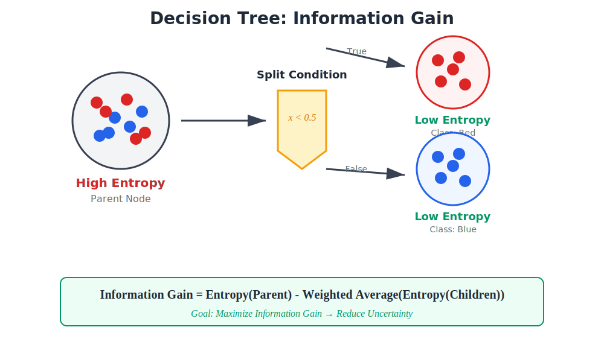
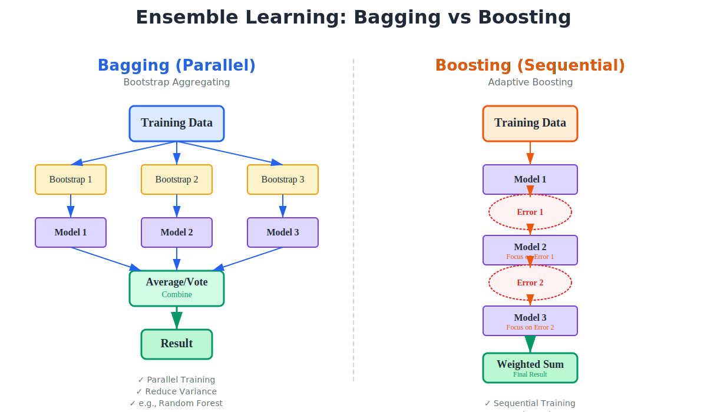

# 第09章 决策树与集成学习

> "三个臭皮匠，顶个诸葛亮。" —— 中国谚语
>
> "The whole is greater than the sum of its parts." —— Aristotle
>
> **重要提示**：集成学习是机器学习中最优雅的哲学之一。
>
> 当你意识到**一群弱小的模型，通过恰当的组织方式，能够超越任何单一的强大模型**时，你触碰到了群体智慧的数学本质。这不仅仅是工程技巧，更是对**"涌现" (emergence)** 这一概念的深刻诠释。
>
> 本章将带你经历一次从个体到集体的认知跃迁：从**单棵树的分裂策略** (信息增益)，到**多棵树的协同方式** (Bagging vs Boosting)，再到**损失函数的梯度优化** (GBDT & XGBoost)。当你发现 AdaBoost 不是拍脑袋发明的，而是在最小化指数损失；当你理解 GBDT 拟合残差的本质是负梯度下降时，你将领悟到集成学习那令人战栗的统一之美。

---

## 目录

1. [引言](#1-引言)
2. [决策树(Decision Tree)](#2-决策树decision-tree)
   - 2.1 [直觉:20个问题游戏](#21-直觉20个问题游戏)
   - 2.2 [纯度的度量:熵与基尼](#22-纯度的度量熵与基尼)
   - 2.3 [特征选择:最大化信息增益](#23-特征选择最大化信息增益)
   - 2.4 [决策树的构建算法](#24-决策树的构建算法)
   - 2.5 [过拟合与剪枝](#25-过拟合与剪枝)
3. [集成学习的总纲](#3-集成学习的总纲)
   - 3.1 [为什么需要集成?](#31-为什么需要集成)
   - 3.2 [Bias-Variance Tradeoff](#32-bias-variance-tradeoff)
   - 3.3 [集成的两大流派:Bagging vs Boosting](#33-集成的两大流派bagging-vs-boosting)
4. [Bagging与随机森林](#4-bagging与随机森林)
   - 4.1 [Bootstrap采样](#41-bootstrap采样)
   - 4.2 [Bagging的降方差机制](#42-bagging的降方差机制)
   - 4.3 [随机森林的双重随机性](#43-随机森林的双重随机性)
   - 4.4 [Out-of-Bag估计](#44-out-of-bag估计)
5. [Boosting之魂:AdaBoost](#5-boosting之魂adaboost)
   - 5.1 [AdaBoost算法流程](#51-adaboost算法流程)
   - 5.2 [核心推导:为什么是指数损失?](#52-核心推导为什么是指数损失)
   - 5.3 [样本权重更新公式的推导](#53-样本权重更新公式的推导)
   - 5.4 [AdaBoost的几何直觉](#54-adaboost的几何直觉)
6. [Boosting之神:GBDT与XGBoost](#6-boosting之神gbdt与xgboost)
   - 6.1 [GBDT:梯度提升决策树](#61-gbdt梯度提升决策树)
   - 6.2 [为什么拟合残差?](#62-为什么拟合残差)
   - 6.3 [XGBoost:二阶泰勒展开](#63-xgboost二阶泰勒展开)
   - 6.4 [XGBoost的目标函数推导](#64-xgboost的目标函数推导)
   - 6.5 [XGBoost的工程优化](#65-xgboost的工程优化)
7. [总结](#7-总结)
8. [附录:XGBoost核心公式](#8-附录xgboost核心公式)

---

## 1. 引言

**集成学习 (Ensemble Learning)** 的核心思想非常简单：**如果你不能信任单个专家，那就组织一个委员会**。

这个想法可以追溯到18世纪法国数学家 **Condorcet** 的陪审团定理 (Jury Theorem):

> 假设每个陪审员做出正确判断的概率是 $p > 0.5$，那么当陪审员人数趋于无穷时，**多数投票的正确率趋于1**。

数学上，如果有 $n$ 个独立的陪审员，每人正确率为 $p$，则多数投票的正确率为：

$$
P(\text{正确}) = \sum_{k > n/2} \binom{n}{k} p^k (1-p)^{n-k}
$$

当 $n \to \infty$ 且 $p > 0.5$ 时，$P(\text{正确}) \to 1$。

这个简单的概率论结果揭示了集成学习的两个核心假设：
1. **每个基学习器要"比瞎猜好一点"**(准确率 $> 0.5$)
2. **基学习器之间要尽可能独立**

但机器学习的集成不是简单的投票。我们有两个更深刻的问题：
- **如何让基学习器多样化？**（Bagging vs Boosting）
- **如何组合它们？**（平均 vs 加权 vs 学习组合）

本章将从最简单的基学习器——**决策树**——开始，逐步构建起集成学习的完整大厦。

---

## 2. 决策树(Decision Tree)

### 2.1 直觉：20个问题游戏

决策树的构建过程类似于一个古老的游戏：**20个问题**。

> 游戏规则：我心里想一个物品，你可以问我20个是非问题，猜出这个物品。

最优策略是什么？**每次问题都要最大化信息增益**，即让答案尽可能平均地分割可能的物品集合。

例如：
- **好问题**："是动物吗？"（假设一半是动物，一半不是）
- **坏问题**："是猫吗？"（只有1/1000的概率）

这个直觉就是决策树的核心：**每次分裂，选择最能降低不确定性的特征**。

### 2.2 纯度的度量：熵与基尼

如何度量"不确定性"或"不纯度"？

#### (1) 熵(Entropy)

来自信息论，由 Shannon 提出。对于随机变量 $Y$ 的分布 $p = (p_1, \ldots, p_C)$（$C$ 个类别），熵定义为：

$$
H(p) = -\sum_{c=1}^C p_c \log_2 p_c
$$

**物理意义**：
- 当 $Y$ 确定时（某个 $p_c = 1$），$H = 0$（无不确定性）
- 当 $Y$ 均匀分布时（所有 $p_c = 1/C$），$H = \log_2 C$（最大不确定性）
- 熵衡量的是**平均编码长度**：你需要多少bit来描述一个随机样本？

**二分类的熵曲线**：

设正类概率为 $p$，负类为 $1-p$，则：

$$
H(p) = -p \log_2 p - (1-p) \log_2 (1-p)
$$

这是一个"倒扣的碗"：
- $p = 0$ 或 $p = 1$ 时，$H = 0$（纯净）
- $p = 0.5$ 时，$H = 1$（最混乱）



上图展示了：
- **左上**：熵函数的"倒扣碗"形状
- **右上**：信息增益的直觉——分裂前后的熵减少量
- **下方**：一个具体例子——如何选择最佳分裂特征

#### (2) 基尼不纯度(Gini Impurity)

另一个常用的度量是 **Gini不纯度**：

$$
\text{Gini}(p) = 1 - \sum_{c=1}^C p_c^2 = \sum_{c=1}^C p_c(1 - p_c)
$$

**物理意义**：
- 随机选两个样本，它们类别不同的概率
- 同样是"倒扣的碗"，但计算更简单（不需要对数）

**二分类的Gini曲线**：

$$
\text{Gini}(p) = 2p(1-p)
$$

与熵类似：
- $p = 0$ 或 $p = 1$ 时，$\text{Gini} = 0$
- $p = 0.5$ 时，$\text{Gini} = 0.5$（最大）

#### (3) 熵 vs Gini：有何区别？

它们形状相似，但有微妙差异：
- **熵**对不纯度的惩罚更重（对数增长比线性快）
- **Gini**计算更快（无对数）
- 实践中性能差异很小，**CART算法用Gini，ID3/C4.5用熵**

### 2.3 特征选择：最大化信息增益

#### (1) 信息增益 (Information Gain)

设数据集 $D$，当前熵为 $H(D)$。用特征 $A$ 将 $D$ 分成 $k$ 个子集 $\{D_1, \ldots, D_k\}$，则**信息增益**定义为：

$$
\text{IG}(D, A) = H(D) - \sum_{i=1}^k \frac{|D_i|}{|D|} H(D_i)
$$

**直觉**：
- $H(D)$：分裂前的不确定性
- 后一项：分裂后的**加权平均不确定性**
- $\text{IG}$：不确定性的**减少量**

**ID3算法**：每次选择信息增益最大的特征进行分裂。

#### (2) 信息增益比 (Gain Ratio)

信息增益有个缺陷：**偏好取值数量多的特征**。

例如，用"身份证号"作为特征，每个样本一个取值，信息增益巨大（因为每个子集都纯净），但这是过拟合！

**C4.5算法** 引入 **信息增益比** 来修正：

$$
\text{GainRatio}(D, A) = \frac{\text{IG}(D, A)}{H_A(D)}
$$

其中 $H_A(D)$ 是特征 $A$ 的**固有值**(Intrinsic Value):

$$
H_A(D) = -\sum_{i=1}^k \frac{|D_i|}{|D|} \log_2 \frac{|D_i|}{|D|}
$$

它衡量特征 $A$ 自身的"分散程度"。取值越多，$H_A$ 越大，增益比越小，从而惩罚高基数特征。

#### (3) Gini增益 (Gini Gain)

**CART算法** (Classification and Regression Tree) 使用 Gini不纯度：

$$
\text{GiniGain}(D, A) = \text{Gini}(D) - \sum_{i=1}^k \frac{|D_i|}{|D|} \text{Gini}(D_i)
$$

### 2.4 决策树的构建算法

决策树的构建是一个**递归**的过程：

```
函数 BuildTree(D):
    如果 D 中所有样本属于同一类 C:
        返回叶节点，标记为 C
    如果 特征集为空 或 D 中样本在所有特征上取值相同:
        返回叶节点，标记为 D 中最多的类

    选择最优特征 A*（最大化信息增益/Gini增益）
    为 A* 的每个取值 a 创建分支:
        D_a = D 中 A* = a 的样本
        递归调用 BuildTree(D_a)

    返回决策树
```

**停止条件**：
1. 节点内所有样本同类
2. 特征集为空
3. 样本数小于阈值（预剪枝）
4. 树深度达到上限（预剪枝）

### 2.5 过拟合与剪枝

决策树非常容易**过拟合**：如果不加限制，它会生长到每个叶子只有一个样本（训练误差为0，但泛化性能极差）。

#### (1) 预剪枝(Pre-pruning)

在构建过程中提前停止：
- 限制树的最大深度
- 限制叶节点的最小样本数
- 限制分裂的最小信息增益

**优点**：快速，避免过拟合
**缺点**：可能欠拟合（停得太早）

#### (2) 后剪枝(Post-pruning)

先生成完整的树，再自底向上地剪枝：
- 对每个内部节点，考虑将其替换为叶节点
- 如果替换后验证集误差不增加，则剪枝
- **C4.5的悲观剪枝**：基于训练误差的统计检验

**优点**：通常比预剪枝效果好
**缺点**：需要验证集，计算代价大

---

## 3. 集成学习的总纲

### 3.1 为什么需要集成？

单个决策树的问题：
1. **高方差**：对训练数据敏感，稍微改变样本，树的结构可能完全不同
2. **不稳定**：容易过拟合
3. **局部最优**：贪心算法，每次只选当前最优特征

但决策树有个巨大优点：**容易生成多样化的弱学习器**！

- 随机采样 → 不同的训练集 → 不同的树
- 随机特征 → 不同的分裂 → 不同的树

这正是集成学习的基础。

### 3.2 Bias-Variance Tradeoff

回顾第5章的泛化误差分解(假设噪声 $\sigma^2$ 不可约):

$$
\mathbb{E}[(y - \hat{f}(x))^2] = \text{Bias}^2[\hat{f}(x)] + \text{Var}[\hat{f}(x)] + \sigma^2
$$

其中：
- **偏差(Bias)**：模型的**平均预测** 与 **真实值** 的差距，衡量欠拟合
- **方差(Variance)**：模型对**训练集的敏感度**，衡量过拟合

**单个决策树**：
- 如果树很深：低偏差，高方差（过拟合）
- 如果树很浅：高偏差，低方差（欠拟合）

**集成学习的两大策略**：
1. **Bagging**（如随机森林）：**降低方差**，通过平均多个高方差模型
2. **Boosting**（如AdaBoost、GBDT）：**降低偏差**，通过逐步拟合残差

### 3.3 集成的两大流派：Bagging vs Boosting



上图清晰地展示了两种范式的核心差异：

#### (1) Bagging (Bootstrap Aggregating)

**策略**：并行训练多个**独立**的强学习器，然后平均（回归）或投票（分类）

$$
\hat{f}(x) = \frac{1}{M} \sum_{m=1}^M f_m(x)
$$

**关键**：
- 基学习器之间**独立**（通过Bootstrap采样保证）
- 降低**方差**（平均的方差 = 单个方差 / $M$，如果独立）
- 基学习器要**强**（如深树）

**代表**：随机森林(Random Forest)

#### (2) Boosting

**策略**：串行训练多个**弱**学习器，每个学习器**专注于前一个的错误**

$$
\hat{f}(x) = \sum_{m=1}^M \alpha_m f_m(x)
$$

**关键**：
- 基学习器之间**相关**（后者依赖前者）
- 降低**偏差**（逐步逼近真实函数）
- 基学习器要**弱**（如浅树，甚至决策桩）

**代表**：AdaBoost、GBDT、XGBoost

**直觉对比**：
- **Bagging**："三个臭皮匠，顶个诸葛亮"——平均消除随机性
- **Boosting**："知错能改，善莫大焉"——不断纠正错误

---

## 4. Bagging与随机森林

### 4.1 Bootstrap采样

**Bootstrap**（自助采样）是统计学中的一个经典技术：

给定数据集 $D = \{(\mathbf{x}_i, y_i)\}_{i=1}^N$，进行 $M$ 次采样：
- 每次**有放回地**从 $D$ 中随机抽取 $N$ 个样本，得到 $D_m$
- 某个样本 $(\mathbf{x}_i, y_i)$ 没有被抽中的概率是：

$$
\left(1 - \frac{1}{N}\right)^N \approx e^{-1} \approx 0.368
$$

因此，每个Bootstrap样本大约包含原始数据的 **63.2%**（不同的样本）。

### 4.2 Bagging的降方差机制

假设每个基学习器的预测方差是 $\sigma^2$，它们之间的相关系数是 $\rho$。则 $M$ 个模型的平均预测的方差是：

$$
\text{Var}\left[\frac{1}{M}\sum_{m=1}^M f_m(x)\right] = \rho\sigma^2 + \frac{1-\rho}{M}\sigma^2
$$

**推导**（简化，假设方差相同）：

$$
\begin{aligned}
\text{Var}\left[\frac{1}{M}\sum_{m=1}^M f_m\right] &= \frac{1}{M^2} \text{Var}\left[\sum_{m=1}^M f_m\right] \\
&= \frac{1}{M^2} \left( M\sigma^2 + M(M-1)\rho\sigma^2 \right) \\
&= \frac{\sigma^2}{M} + \frac{M-1}{M}\rho\sigma^2 \\
&\approx \rho\sigma^2 + \frac{1-\rho}{M}\sigma^2
\end{aligned}
$$

**关键洞察**：
- 如果模型**完全独立**（$\rho = 0$），方差降低为 $\sigma^2 / M$（理想情况）
- 如果模型**完全相关**（$\rho = 1$），方差仍为 $\sigma^2$（无改进）
- Bootstrap采样保证 $\rho < 1$，但不够小

**问题**：用同一数据集的Bootstrap样本训练，模型之间仍有较高相关性。

**解决**：随机森林的**特征随机性**。

### 4.3 随机森林的双重随机性

**随机森林(Random Forest)** 在Bagging的基础上增加了**特征随机性**：

**算法**：
1. **样本随机**：用Bootstrap采样得到 $M$ 个训练集 $D_m$
2. **特征随机**：在每次分裂时，随机选择 $k$ 个特征（通常 $k = \sqrt{p}$，其中 $p$ 是总特征数），只从这 $k$ 个特征中选最优分裂
3. 训练 $M$ 棵深树（不剪枝）
4. 预测时：
   - **分类**：多数投票
   - **回归**：平均

**为什么特征随机性有效？**

强特征会在大多数树中被选中，导致树之间相似（高 $\rho$）。特征随机性强制某些树"忽略"强特征，探索其他可能性，从而**降低相关性** $\rho$。

**超参数**：
- $M$：树的数量（越多越好，但边际收益递减）
- $k$：每次分裂考虑的特征数（默认 $\sqrt{p}$ 分类，$p/3$ 回归）
- 树的深度：通常不剪枝（单棵树方差大，但集成后平均掉）

### 4.4 Out-of-Bag估计

Bootstrap采样的一个副产品：**袋外(Out-of-Bag, OOB)样本**。

对于每棵树 $f_m$，约有37%的样本没有在 $D_m$ 中出现。这些样本可以用来：
- **验证**：计算OOB误差，作为泛化误差的无偏估计
- **特征重要性**：打乱某个特征的值，看OOB误差增加多少

OOB误差几乎等价于交叉验证，但**无需额外计算**！

---

## 5. Boosting之魂:AdaBoost

### 5.1 AdaBoost算法流程

**AdaBoost**(Adaptive Boosting) 由 Freund & Schapire (1997) 提出，是Boosting的开山之作。

**算法**（二分类，$y \in \{-1, +1\}$）：

1. **初始化**样本权重：$w_i^{(1)} = \frac{1}{N}$，$i = 1, \ldots, N$

2. **For** $m = 1$ to $M$:

   a. 用权重 $\mathbf{w}^{(m)}$ 训练基学习器 $f_m(x)$，得到预测

   b. 计算**加权错误率**：
   $$
   \epsilon_m = \frac{\sum_{i=1}^N w_i^{(m)} \mathbb{I}[y_i \neq f_m(\mathbf{x}_i)]}{\sum_{i=1}^N w_i^{(m)}}
   $$

   c. 计算基学习器的**权重**：
   $$
   \alpha_m = \frac{1}{2} \ln \frac{1 - \epsilon_m}{\epsilon_m}
   $$

   d. **更新样本权重**：
   $$
   w_i^{(m+1)} = w_i^{(m)} \exp(-\alpha_m y_i f_m(\mathbf{x}_i))
   $$
   （然后归一化：$w_i^{(m+1)} \leftarrow w_i^{(m+1)} / \sum_j w_j^{(m+1)}$）

3. **输出**最终分类器：
   $$
   H(x) = \text{sign}\left(\sum_{m=1}^M \alpha_m f_m(x)\right)
   $$

**直觉**：
- $\alpha_m$：基学习器的发言权（错误率越低，权重越大）
- $w_i^{(m+1)}$：被误分类的样本权重增加（$y_i f_m(\mathbf{x}_i) < 0$）
- 每轮关注"难样本"

但这些公式是**怎么来的**？为什么是 $\ln \frac{1-\epsilon}{\epsilon}$？为什么是 $\exp(-\alpha y f)$？

### 5.2 核心推导：为什么是指数损失？

AdaBoost 不是拍脑袋发明的！它是在最小化一个特定的损失函数：**指数损失 (Exponential Loss)**。

**定理**（Friedman et al., 2000）：AdaBoost 等价于用**前向分步算法**(Forward Stagewise Additive Modeling) 最小化指数损失。

#### (1) 指数损失

定义损失函数：

$$
L(y, f(x)) = \exp(-y f(x))
$$

对于整个数据集：

$$
L = \sum_{i=1}^N \exp\left(-y_i \sum_{m=1}^M \alpha_m f_m(\mathbf{x}_i)\right)
$$

**为什么选指数损失？**
- 它是0-1损失的**上界**（可微的替代）
- 数学上容易优化（可加性）
- 对误分类点的惩罚呈指数增长（关注难样本）

#### (2) 前向分步算法

直接优化 $L$ 很难（$M$ 个模型耦合）。**前向分步算法**采用**贪心策略**：

- 假设前 $m-1$ 步已经得到 $f_{m-1}(x) = \sum_{k=1}^{m-1} \alpha_k f_k(x)$
- 第 $m$ 步只优化 $(f_m, \alpha_m)$，固定之前的

目标：

$$
(\alpha_m, f_m) = \arg\min_{\alpha, f} \sum_{i=1}^N \exp\left(-y_i [f_{m-1}(\mathbf{x}_i) + \alpha f(\mathbf{x}_i)]\right)
$$

定义：

$$
\bar{w}_i^{(m)} = \exp(-y_i f_{m-1}(\mathbf{x}_i))
$$

（这是前 $m-1$ 步累积的"难度"）

则目标函数变为：

$$
\sum_{i=1}^N \bar{w}_i^{(m)} \exp(-y_i \alpha f(\mathbf{x}_i))
$$

### 5.3 样本权重更新公式的推导

现在推导 $\alpha_m$ 和 $f_m$。

#### (1) 优化 $f_m$

给定 $\alpha$，优化 $f$：

$$
f_m = \arg\min_f \sum_{i=1}^N \bar{w}_i^{(m)} \exp(-y_i \alpha f(\mathbf{x}_i))
$$

因为 $f(\mathbf{x}_i) \in \{-1, +1\}$，分两种情况：
- 如果 $y_i = f(\mathbf{x}_i)$（正确）：$\exp(-\alpha)$
- 如果 $y_i \neq f(\mathbf{x}_i)$（错误）：$\exp(\alpha)$

因此：

$$
\begin{aligned}
\sum_i \bar{w}_i^{(m)} \exp(-y_i \alpha f(\mathbf{x}_i)) &= e^{-\alpha} \sum_{y_i = f(\mathbf{x}_i)} \bar{w}_i^{(m)} + e^{\alpha} \sum_{y_i \neq f(\mathbf{x}_i)} \bar{w}_i^{(m)} \\
&= e^{-\alpha} (W - W_{\text{err}}) + e^{\alpha} W_{\text{err}}
\end{aligned}
$$

其中 $W = \sum_i \bar{w}_i^{(m)}$，$W_{\text{err}} = \sum_{y_i \neq f(\mathbf{x}_i)} \bar{w}_i^{(m)}$。

**关键**：这个式子与 $\alpha$ 无关！$f_m$ 只需最小化**加权错误率**：

$$
f_m = \arg\min_f \sum_{i=1}^N \bar{w}_i^{(m)} \mathbb{I}[y_i \neq f(\mathbf{x}_i)]
$$

这正是AdaBoost的步骤2a！

#### (2) 优化 $\alpha_m$

给定 $f_m$，优化 $\alpha$：

$$
\alpha_m = \arg\min_\alpha \left[ e^{-\alpha} (W - W_{\text{err}}) + e^{\alpha} W_{\text{err}} \right]
$$

求导并令其为0：

$$
-e^{-\alpha} (W - W_{\text{err}}) + e^{\alpha} W_{\text{err}} = 0
$$

解得：

$$
e^{2\alpha} = \frac{W - W_{\text{err}}}{W_{\text{err}}} = \frac{1 - \epsilon}{\epsilon}
$$

其中 $\epsilon = W_{\text{err}} / W$ 是加权错误率。因此：

$$
\boxed{\alpha_m = \frac{1}{2} \ln \frac{1 - \epsilon_m}{\epsilon_m}}
$$

**完美对应**！

#### (3) 权重更新

下一轮的权重是：

$$
\bar{w}_i^{(m+1)} = \bar{w}_i^{(m)} \exp(-y_i \alpha_m f_m(\mathbf{x}_i))
$$

代入 $\bar{w}_i^{(m)} = \exp(-y_i f_{m-1}(\mathbf{x}_i))$：

$$
\bar{w}_i^{(m+1)} = \exp\left(-y_i \sum_{k=1}^m \alpha_k f_k(\mathbf{x}_i)\right)
$$

递推关系：

$$
\boxed{w_i^{(m+1)} = w_i^{(m)} \exp(-\alpha_m y_i f_m(\mathbf{x}_i))}
$$

（归一化后得到概率分布）

**至此，AdaBoost的所有公式都从指数损失推导出来了！**

### 5.4 AdaBoost的几何直觉

**为什么AdaBoost有效？**

从**函数空间**看：
- 每个基学习器 $f_m$ 是一个"方向"
- $\alpha_m$ 是沿该方向走多远
- AdaBoost在函数空间中做**梯度下降**（指数损失的负梯度）

从**样本空间**看：
- 初始所有样本等权重（均匀分布）
- 每轮增加困难样本的权重
- 最终集成 = 一系列"专家"，每个专注于前一个的盲区

**泛化能力**：
- 即使 $M$ 很大，AdaBoost也不容易过拟合（Schapire et al., 1998）
- 原因：增加 $M$ 会增加**间隔(margin)**，即 $y \sum_m \alpha_m f_m(x)$ 的绝对值
- 大间隔 → 强置信度 → 更好的泛化

---

## 6. Boosting之神:GBDT与XGBoost

### 6.1 GBDT:梯度提升决策树

**GBDT**(Gradient Boosting Decision Tree) 是AdaBoost的推广，由 Friedman (2001) 提出。

**核心思想**：AdaBoost只能用指数损失。如果我想用**任意损失函数**（如平方损失、对数损失），怎么办？

**答案**：用**梯度**代替残差！

#### (1) 前向分步算法（通用框架）

目标：最小化损失

$$
L = \sum_{i=1}^N \ell(y_i, f(\mathbf{x}_i))
$$

其中 $f(x) = \sum_{m=1}^M f_m(x)$ 是基学习器的加权和。

**前向分步**：第 $m$ 步，已有 $F_{m-1}(x)$，要找 $f_m$ 使得

$$
F_m(x) = F_{m-1}(x) + f_m(x)
$$

最小化：

$$
\sum_{i=1}^N \ell(y_i, F_{m-1}(\mathbf{x}_i) + f_m(\mathbf{x}_i))
$$

**困难**：对于复杂的 $\ell$（如交叉熵），很难直接优化 $f_m$。

#### (2) 梯度下降的类比

在参数空间，梯度下降是：

$$
\theta_{t+1} = \theta_t - \eta \nabla_\theta L(\theta_t)
$$

在**函数空间**，类比为：

$$
F_m(x) = F_{m-1}(x) - \eta \cdot g_m(x)
$$

其中 $g_m(x)$ 是损失函数对 $F_{m-1}(x)$ 的**伪残差**(pseudo-residual):

$$
g_m(\mathbf{x}_i) = \left[\frac{\partial \ell(y_i, F(\mathbf{x}_i))}{\partial F(\mathbf{x}_i)}\right]_{F = F_{m-1}}
$$

**GBDT的策略**：
- 计算伪残差 $\{g_m(\mathbf{x}_i)\}$
- 训练一棵树 $f_m$ 去**拟合** $g_m$（而不是 $y_i$）
- 更新 $F_m = F_{m-1} + \eta f_m$

### 6.2 为什么拟合残差？

对于**平方损失** $\ell(y, F) = \frac{1}{2}(y - F)^2$，伪残差是：

$$
g_m(\mathbf{x}_i) = \frac{\partial}{\partial F} \frac{1}{2}(y_i - F)^2 \bigg|_{F = F_{m-1}(\mathbf{x}_i)} = -(y_i - F_{m-1}(\mathbf{x}_i)) = -r_i^{(m)}
$$

即**负残差**！

因此，**拟合残差 = 沿负梯度方向**。

**GBDT算法**（回归）：

1. 初始化：$F_0(x) = \arg\min_c \sum_i \ell(y_i, c)$（通常是 $\bar{y}$）

2. **For** $m = 1$ to $M$:

   a. 计算伪残差：
   $$
   r_i^{(m)} = -\left[\frac{\partial \ell(y_i, F(\mathbf{x}_i))}{\partial F(\mathbf{x}_i)}\right]_{F = F_{m-1}}
   $$

   b. 训练回归树 $f_m$，拟合 $\{(\mathbf{x}_i, r_i^{(m)})\}$

   c. **更新**：
   $$
   F_m(x) = F_{m-1}(x) + \eta f_m(x)
   $$

3. 输出 $F_M(x)$

**直觉**：
- 每棵树修正前一个模型的错误
- 逐步逼近真实函数
- 类似于梯度下降，但在函数空间

**为什么GBDT强大？**
- 可用于**任意可微损失**（分类、回归、排序...）
- 树的结构能自动做**特征组合**（非线性交互）
- 天然支持**缺失值处理**

### 6.3 XGBoost：二阶泰勒展开

**XGBoost** (eXtreme Gradient Boosting) 由陈天奇 (2016) 提出，是GBDT的工程优化版本，也是Kaggle竞赛的"屠榜"利器。

**核心改进**：
1. 用**二阶泰勒展开**近似损失函数（更精确）
2. 在目标函数中加入**正则项**（防止过拟合）
3. 高效的**分裂算法**（加权分位数、稀疏感知）
4. 系统优化（并行化、缓存优化...）

### 6.4 XGBoost的目标函数推导

#### (1) 目标函数

第 $t$ 步的目标（加入正则化）：

$$
\mathcal{L}^{(t)} = \sum_{i=1}^N \ell(y_i, F_{t-1}(\mathbf{x}_i) + f_t(\mathbf{x}_i)) + \Omega(f_t)
$$

其中 $\Omega(f_t)$ 是树的复杂度惩罚：

$$
\Omega(f_t) = \gamma T + \frac{1}{2}\lambda \sum_{j=1}^T w_j^2
$$

- $T$：叶子节点数
- $w_j$：第 $j$ 个叶子的输出值
- $\gamma, \lambda$：正则化系数

#### (2) 二阶泰勒展开

对损失函数在 $F_{t-1}(\mathbf{x}_i)$ 处做泰勒展开：

$$
\ell(y_i, F_{t-1} + f_t) \approx \ell(y_i, F_{t-1}) + g_i f_t(\mathbf{x}_i) + \frac{1}{2} h_i f_t^2(\mathbf{x}_i)
$$

其中：

$$
\begin{aligned}
g_i &= \frac{\partial \ell(y_i, F)}{\partial F}\bigg|_{F = F_{t-1}(\mathbf{x}_i)} \quad \text{(一阶梯度)} \\
h_i &= \frac{\partial^2 \ell(y_i, F)}{\partial F^2}\bigg|_{F = F_{t-1}(\mathbf{x}_i)} \quad \text{(二阶梯度)}
\end{aligned}
$$

去掉常数项 $\ell(y_i, F_{t-1})$，目标函数简化为：

$$
\tilde{\mathcal{L}}^{(t)} = \sum_{i=1}^N \left[g_i f_t(\mathbf{x}_i) + \frac{1}{2} h_i f_t^2(\mathbf{x}_i)\right] + \Omega(f_t)
$$

#### (3) 叶子节点的最优值

设树 $f_t$ 将样本分到 $T$ 个叶子，定义：

- $I_j = \{i \mid f_t(\mathbf{x}_i) \text{ 在叶子 } j\}$：叶子 $j$ 的样本索引集
- $w_j$：叶子 $j$ 的输出值

则 $f_t(\mathbf{x}_i) = w_j$ 对于 $i \in I_j$。代入目标函数：

$$
\tilde{\mathcal{L}}^{(t)} = \sum_{j=1}^T \left[\left(\sum_{i \in I_j} g_i\right) w_j + \frac{1}{2}\left(\sum_{i \in I_j} h_i + \lambda\right) w_j^2\right] + \gamma T
$$

定义：

$$
G_j = \sum_{i \in I_j} g_i, \quad H_j = \sum_{i \in I_j} h_i
$$

则：

$$
\tilde{\mathcal{L}}^{(t)} = \sum_{j=1}^T \left[G_j w_j + \frac{1}{2}(H_j + \lambda) w_j^2\right] + \gamma T
$$

这是关于 $w_j$ 的二次函数！对 $w_j$ 求导并令其为0：

$$
\frac{\partial \tilde{\mathcal{L}}^{(t)}}{\partial w_j} = G_j + (H_j + \lambda) w_j = 0
$$

解得**最优叶子值**：

$$
\boxed{w_j^* = -\frac{G_j}{H_j + \lambda}}
$$

代入目标函数，得到**最小损失**：

$$
\boxed{\tilde{\mathcal{L}}^{(t)} = -\frac{1}{2} \sum_{j=1}^T \frac{G_j^2}{H_j + \lambda} + \gamma T}
$$

#### (4) 分裂增益

如何选择最优分裂？

考虑将叶子 $I$ 分成左右两个子叶 $I_L$ 和 $I_R$。分裂前的损失：

$$
L_{\text{before}} = -\frac{1}{2} \frac{G^2}{H + \lambda} + \gamma
$$

分裂后的损失：

$$
L_{\text{after}} = -\frac{1}{2} \left(\frac{G_L^2}{H_L + \lambda} + \frac{G_R^2}{H_R + \lambda}\right) + 2\gamma
$$

**分裂增益**（损失减少量）：

$$
\boxed{\text{Gain} = \frac{1}{2} \left[\frac{G_L^2}{H_L + \lambda} + \frac{G_R^2}{H_R + \lambda} - \frac{G^2}{H + \lambda}\right] - \gamma}
$$

- 如果 $\text{Gain} > 0$，则分裂
- 否则，停止（$\gamma$ 控制分裂的代价）

**关键洞察**：
- XGBoost的分裂准则**同时考虑了一阶和二阶梯度**
- GBDT只用一阶梯度（残差）
- 二阶信息 → 更精确的牛顿步 → 更快收敛

### 6.5 XGBoost的工程优化

XGBoost不仅在算法上优越，工程实现也极致：

#### (1) 分裂算法

- **精确贪心**：枚举所有特征的所有分裂点（小数据）
- **近似算法**：用加权分位数找候选分裂点（大数据）
- **稀疏感知**：缺失值分配到左/右子树，选最优方向

#### (2) 系统优化

- **列块(Column Block)**：特征按列存储，预排序，便于并行查找分裂点
- **缓存优化**：梯度统计量缓存，减少计算
- **核外计算(Out-of-core)**：数据不装入内存，分块读取

#### (3) 正则化技巧

- **列采样(Column Subsampling)**：类似随机森林，每棵树只用部分特征
- **行采样(Row Subsampling)**：每棵树只用部分样本
- **Shrinkage**：学习率 $\eta < 1$，放缓学习

---

## 7. 总结

本章我们经历了集成学习的完整旅程：

### (1) 决策树：基石

- **纯度度量**：熵与Gini，本质都是"倒扣的碗"
- **特征选择**：最大化信息增益 = 最小化划分后的不确定性
- **优缺点**：易解释、处理非线性，但高方差、易过拟合

### (2) Bagging：降方差

- **核心**：Bootstrap + 平均 → 降低方差
- **随机森林**：样本随机 + 特征随机 → 降低相关性 → 进一步降方差
- **OOB**：免费的验证集

### (3) Boosting：降偏差

#### AdaBoost：
- **本质**：前向分步算法最小化指数损失
- **公式**：样本权重、模型权重都从指数损失推导出来
- **优势**：关注难样本，增大间隔，泛化性强

#### GBDT：
- **核心**：梯度下降在函数空间
- **拟合残差 = 沿负梯度**（对于平方损失）
- **灵活**：可用于任意可微损失

#### XGBoost：
- **二阶泰勒展开**：更精确的牛顿步
- **正则化**：树复杂度惩罚（叶子数 + 叶子值平方和）
- **工程优化**：分位数近似、稀疏感知、并行化

### (4) 哲学思考

集成学习的成功揭示了两个深刻的真理：

1. **多样性 > 单一强大**：一群弱而不同的模型 > 一个强而单一的模型
2. **合作 > 竞争**：Bagging的平均、Boosting的接力，都是协同的艺术

这也许是对复杂系统的一个隐喻：**真正的智能不在于个体的完美，而在于群体的协同**。

---

## 8. 附录:XGBoost核心公式

### (1) 目标函数

$$
\mathcal{L}^{(t)} = \sum_{i=1}^N \ell(y_i, \hat{y}_i^{(t-1)} + f_t(\mathbf{x}_i)) + \Omega(f_t)
$$

其中正则项：

$$
\Omega(f_t) = \gamma T + \frac{1}{2}\lambda \sum_{j=1}^T w_j^2
$$

### (2) 二阶泰勒近似

$$
\tilde{\mathcal{L}}^{(t)} \approx \sum_{i=1}^N \left[g_i f_t(\mathbf{x}_i) + \frac{1}{2} h_i f_t^2(\mathbf{x}_i)\right] + \Omega(f_t)
$$

其中：

$$
g_i = \frac{\partial \ell(y_i, \hat{y}^{(t-1)})}{\partial \hat{y}^{(t-1)}}, \quad h_i = \frac{\partial^2 \ell(y_i, \hat{y}^{(t-1)})}{\partial (\hat{y}^{(t-1)})^2}
$$

### (3) 叶子节点最优值

$$
w_j^* = -\frac{G_j}{H_j + \lambda}
$$

其中 $G_j = \sum_{i \in I_j} g_i$，$H_j = \sum_{i \in I_j} h_i$。

### (4) 最小损失

$$
\tilde{\mathcal{L}}^{(t)} = -\frac{1}{2} \sum_{j=1}^T \frac{G_j^2}{H_j + \lambda} + \gamma T
$$

### (5) 分裂增益

$$
\text{Gain} = \frac{1}{2} \left[\frac{G_L^2}{H_L + \lambda} + \frac{G_R^2}{H_R + \lambda} - \frac{(G_L + G_R)^2}{H_L + H_R + \lambda}\right] - \gamma
$$

### (6) 常见损失函数的梯度

| 任务 | 损失函数 | $g_i$ | $h_i$ |
|------|---------|-------|-------|
| 回归 | $\frac{1}{2}(y_i - \hat{y}_i)^2$ | $\hat{y}_i - y_i$ | $1$ |
| 二分类(logistic) | $-[y_i \log p_i + (1-y_i)\log(1-p_i)]$ | $p_i - y_i$ | $p_i(1-p_i)$ |
| 多分类(softmax) | $-\sum_k y_{ik} \log p_{ik}$ | $p_{ik} - y_{ik}$ | $p_{ik}(1-p_{ik})$ |

其中 $p_i = \sigma(\hat{y}_i) = \frac{1}{1 + e^{-\hat{y}_i}}$。

---

**参考文献**：
- Breiman, L. (2001). Random Forests. *Machine Learning*, 45(1), 5-32.
- Freund, Y., & Schapire, R. E. (1997). A decision-theoretic generalization of on-line learning and an application to boosting. *Journal of Computer and System Sciences*, 55(1), 119-139.
- Friedman, J. H. (2001). Greedy function approximation: A gradient boosting machine. *Annals of Statistics*, 1189-1232.
- Chen, T., & Guestrin, C. (2016). XGBoost: A scalable tree boosting system. *KDD*, 785-794.
