# 第一篇：基础认知

# 第 1 章 LangChain 生态全景

---

## 1.1 架构层次关系

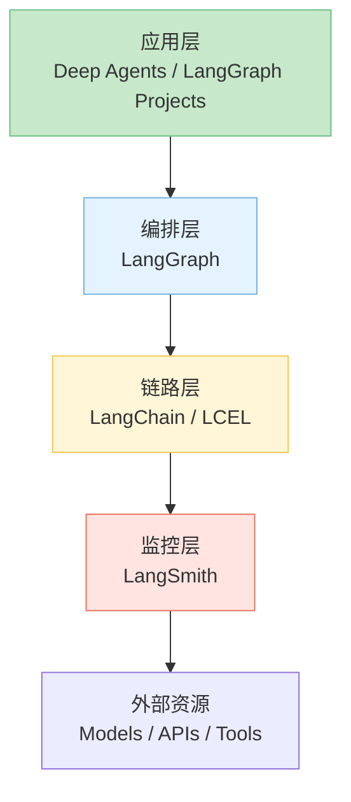

LangChain 生态系统目前已形成“多层协同”的架构体系，既可支持快速原型开发，也可支撑生产级 LLM 应用。整体结构如下：

| 层级   | 核心组件                             | 职责定位                                | 典型场景                    |
| :----- | :----------------------------------- | :-------------------------------------- | :-------------------------- |
| 应用层 | **Deep Agents / LangGraph Projects** | 复杂自治 Agent、长期运行、多 Agent 协作 | 智能助手、自动化任务系统    |
| 编排层 | **LangGraph**                        | 状态化流程控制、节点执行、分支循环      | 多 Agent 编排、可视化状态流 |
| 链路层 | **LangChain / LCEL**                 | 模型调用、提示管理、工具集成            | RAG、问答、对话             |
| 监控层 | **LangSmith**                        | 调试、观测、评估、成本追踪              | DevOps、Evals、质量监控     |

### 1.1.1 LangChain 与 LangGraph 的关系

LangChain 专注于 **链式逻辑与 Agent 封装**；LangGraph 专注于 **流程编排与状态管理**。

- **LangChain：** 用于构建单条或线性 chain（Prompt→Model→Tool→Output）。  
- **LangGraph：** 用于管理含分支、循环、并发的复杂流程（可视化、持久化状态）。  
- 二者可并用：LangGraph 中的节点可运行 LangChain 或 LCEL 构造的 chain。

> **图 1-2 LangChain 与 LangGraph 协作关系图**  

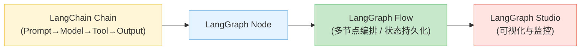

### 1.1.2 `create_agent` 的实现原理

`create_agent` 是构造 Agent 的工厂函数。其内部机制如下：

1. **模型绑定：** 指定 LLM 或 ChatModel；  
2. **提示模板：** 建立 PromptTemplate 决定行为；  
3. **工具注册：** 向 Agent 暴露 Tools 接口；  
4. **决策逻辑：** LLM 决定调用何种 Tool （或使用 policy 控制）；  
5. **执行协议：** 调用统一的 Runnable 接口执行；  
6. **监控追踪：** 自动接入 LangSmith 追踪与 callback。

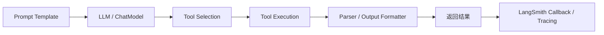

---

### 1.1.3 LCEL 的定位与作用

LCEL（LangChain Expression Language）是 LangChain 的“声明式组合语法”，用于 **构建可并行、可流式、可追踪的 Runnable 链**。

- **核心概念：**  
  - `RunnableSequence` 顺序执行；  
  - `RunnableParallel` 并行执行；  
  - 支持 async / stream / batch 统一调用；  
  - 可直接嵌入 LangGraph 节点。
- **价值：** 在代码层面构建“数据流管线”，如同 Node-RED 或 Airflow 的轻量化实现。

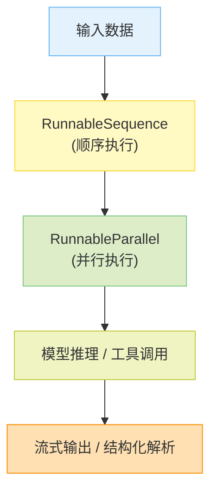

### 1.1.4 LangSmith 的监控职责

LangSmith 是 LangChain 官方推出的可观测性与质量评估平台。

**主要职责：**
- 🔍 **Tracing** ：追踪 Chain/Graph/Agent 每个调用节点。  
- 📈 **Metrics** ：监控延迟、Token 用量、错误率、成本。  
- 🧪 **Evaluation** ：对模型或 Agent 输出进行打分与对比。  
- ⚙️ **Integration** ：与 LangChain 、LangGraph 、Deep Agents 原生集成。

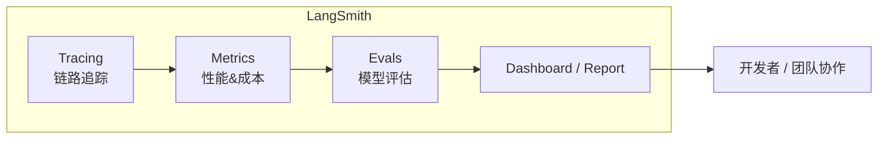

## 1.2 核心设计理念

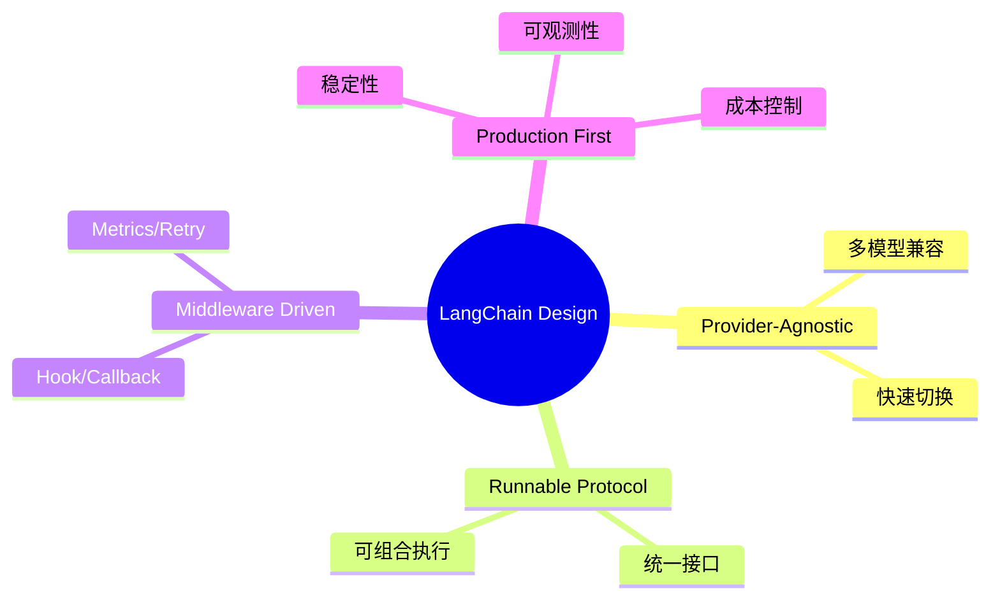


### 1.2.1 Provider-Agnostic 设计

LangChain 通过统一接口屏蔽 LLM 提供商差异（OpenAI、Anthropic、Cohere、Azure 等），  
以 “Provider 无关” 的方式构建应用。

- 模型切换无需修改上层逻辑。  
- 支持跨平台成本追踪与性能比较。

### 1.2.2 Runnable Protocol 统一抽象

Runnable 是 LangChain 的核心执行协议：  
> 一切皆 Runnable。

包括 Chain、Agent、Tool、Prompt 均实现该接口。  
- 统一执行入口：`invoke()`、`ainvoke()`、`stream()`。  
- 支持异步、批量、流式、可追踪调用。  
- 所有 Runnable 可嵌套、组合、装饰。

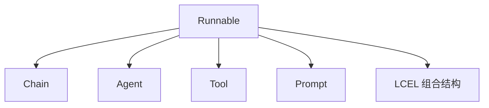

### 1.2.3 Middleware-Driven 架构

LangChain 支持 Callback / Hook / Tracing 机制，可在执行流中插入中间件。

常见中间件用途：
- Token 计数与成本监控  
- 日志与错误追踪  
- 安全审查与访问控制  
- 重试与超时控制  

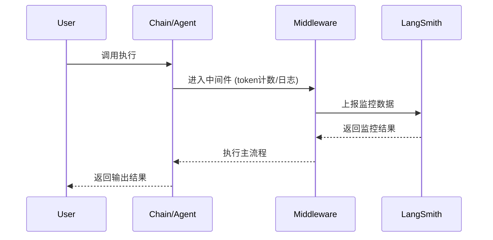

### 1.2.4 Production-First 理念

LangChain 1.0 及 LangGraph 1.0 发布后，生态全面转向 **生产级稳定性与可观测性**。  
核心目标包括：
- 长期兼容（向 2.0 平滑过渡）  
- 成本可控（LangSmith 监控 + 自动计费）  
- 模型热替换（Provider-agnostic）  
- 完整 CI/CD 与 Evals 集成  

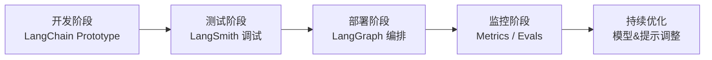

## 1.3 技术选型决策树

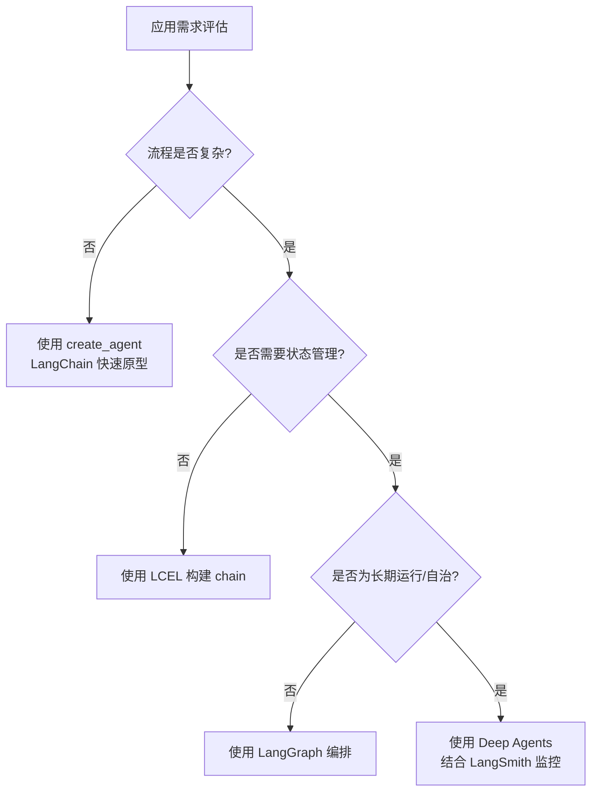

### 1.3.1 何时使用 create_agent
适用场景：
- 单 Agent 执行，流程线性；  
- 需要快速实现 Tool 调用；  
- 用于 RAG 、问答、助手类场景。  

### 1.3.2 何时深入 LangGraph
适用场景：
- 多 Agent 协作；  
- 存在分支 / 循环 / 状态管理；  
- 需可视化、可调试、持久化运行。  

### 1.3.3 何时使用 Deep Agents
适用场景：
- 长期运行、自主决策 Agent；  
- 复杂任务拆解、子 Agent 管理；  
- 持续任务执行与周期性触发。  

### 1.3.4 何时需要 Middleware
适用场景：
- 生产环境运行；  
- 需要日志、指标、安全控制、回调。  
推荐：所有 Chain/Agent 均启用 LangSmith Tracing + 自定义 Callback。  

### 1.3.5 典型应用场景分析

| 场景              | 推荐技术                            | 理由                       |
| :---------------- | :---------------------------------- | :------------------------- |
| A. 企业文档问答   | create_agent + LCEL                 | 快速构建 RAG 问答          |
| B. 智能客服系统   | LangChain Agent + Middleware        | 需多轮对话与监控           |
| C. 自动化任务管理 | LangGraph + Deep Agents + LangSmith | 复杂 workflow + 自治 agent |
| D. 内容摘要或转换 | LCEL                                | 轻量、高并行、可流式       |

---

## 本章小结

LangChain 生态体系可概括为：

> **链式逻辑（LangChain） → 图式编排（LangGraph） → 监控评估（LangSmith） → 自治进化（Deep Agents）**

核心理念：
- Provider-Agnostic  
- Runnable 统一抽象  
- Middleware 可插架构  
- Production-First 部署思维  

设计哲学上，从“玩具原型”走向“生产可观测”的工程系统。

## 思考与练习

1. **练习 1：**  
   选择一个业务场景，画出其 LangChain 技术选型决策路径（参考图 1-10）。  

2. **练习 2：**  
   编写一个 LCEL 例程（Prompt → Model → Parser → Tool），并标注你会插入哪些 Middleware。  

3. **练习 3：**  
   设计一个长期运行 Agent （如 市场监控或自动报告），说明如何用 LangGraph + LangSmith 实现监控与 Evals。  

4. **思考题：**  
   LCEL 在 LangGraph 节点中嵌套使用会带来哪些优势与代价？  


---

# 第 2 章 核心抽象：Runnable 与 LCEL

## 2.1 Runnable Protocol

### 2.1.1 为什么需要统一抽象

在 LangChain 1.0 之前，不同组件（Prompt、Model、Tool、Chain）的调用方式各不相同，导致：
- **接口不一致**：学习成本高，难以组合
- **缺乏标准化**：无法统一追踪、监控
- **组合困难**：不同组件难以嵌套使用

**Runnable Protocol 解决方案**：

LangChain 1.0 引入 Runnable 作为**统一执行协议**，所有组件均实现该接口：

```python
from langchain_core.runnables import Runnable

# 所有组件均实现 Runnable 接口
class Runnable:
    def invoke(self, input, config=None): ...       # 同步调用
    def ainvoke(self, input, config=None): ...      # 异步调用
    def stream(self, input, config=None): ...       # 流式输出
    def astream(self, input, config=None): ...      # 异步流式
    def batch(self, inputs, config=None): ...       # 批量处理
```

**核心优势**：

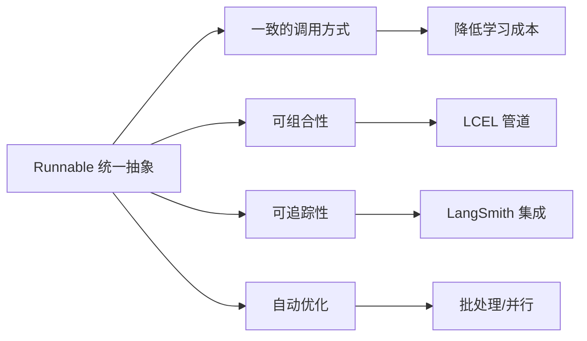

**实际应用示例**：

```python
from langchain_core.prompts import ChatPromptTemplate
from langchain_openai import ChatOpenAI
from langchain_core.output_parsers import StrOutputParser

# 所有组件都是 Runnable
prompt = ChatPromptTemplate.from_template("Tell me a joke about {topic}")
model = ChatOpenAI()
parser = StrOutputParser()

# 统一的调用方式
result = prompt.invoke({"topic": "AI"})
result = model.invoke("Tell me a joke")
result = parser.invoke("some text")
```

---

### 2.1.2 核心方法：invoke、stream、batch

#### **invoke() - 同步调用**

最基础的调用方式，适用于单次请求：

```python
from langchain_openai import ChatOpenAI

model = ChatOpenAI(model="gpt-4")

# 同步调用
response = model.invoke("What is LangChain?")
print(response.content)
```

**执行流程**：

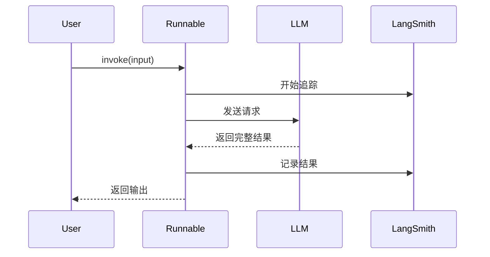

#### **stream() - 流式输出**

适用于需要实时反馈的场景（如聊天界面）：

```python
# 流式输出
for chunk in model.stream("Tell me a long story"):
    print(chunk.content, end="", flush=True)
```

**流式输出的优势**：
- ✅ 降低首字延迟（TTFT - Time To First Token）
- ✅ 提升用户体验（实时显示）
- ✅ 减少超时风险

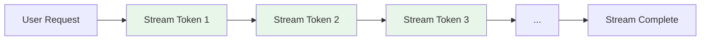

#### **batch() - 批量处理**

适用于批量请求场景，自动优化并发：

```python
# 批量处理（自动并发优化）
inputs = [
    "What is AI?",
    "What is ML?",
    "What is LLM?"
]

results = model.batch(inputs)
for result in results:
    print(result.content)
```

**批量处理的优势**：
- ✅ 自动并发控制
- ✅ 成本追踪聚合
- ✅ 错误处理优化

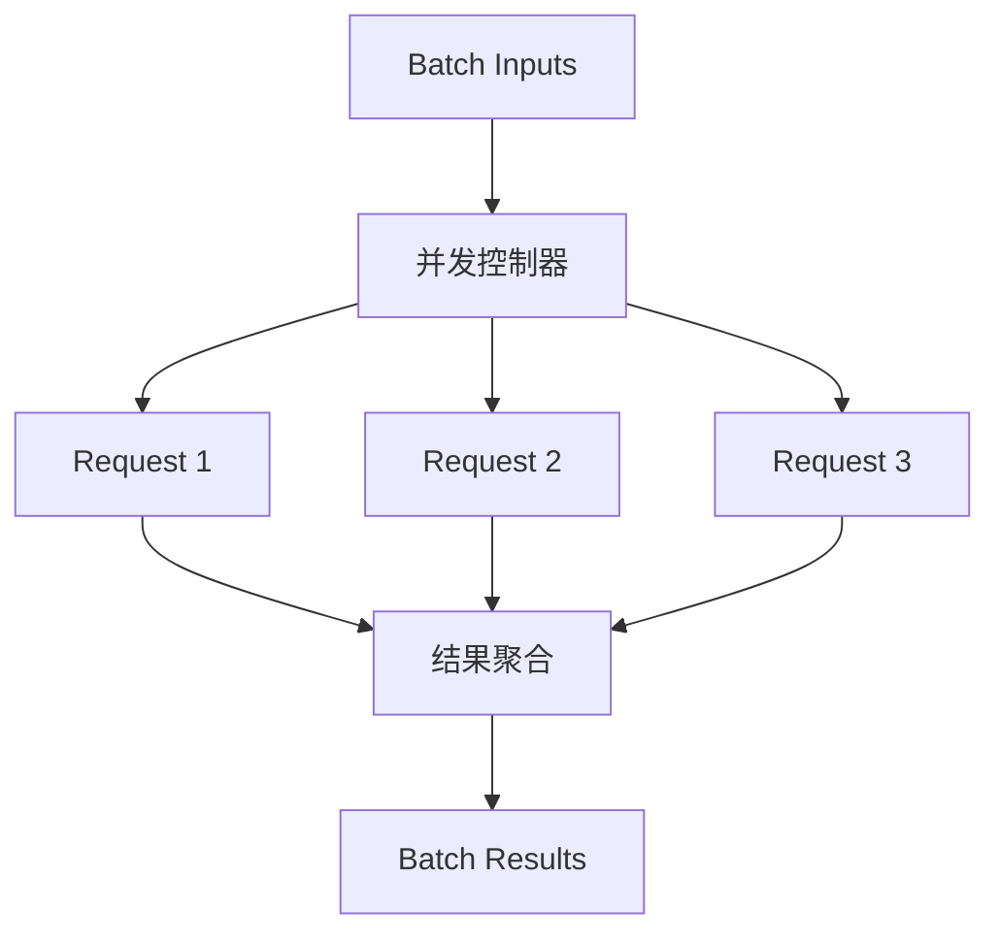

---

### 2.1.3 异步方法：ainvoke、astream

在高并发场景下，异步方法可显著提升性能：

#### **ainvoke() - 异步调用**

```python
import asyncio
from langchain_openai import ChatOpenAI

model = ChatOpenAI()

async def main():
    # 异步调用
    response = await model.ainvoke("What is async programming?")
    print(response.content)

asyncio.run(main())
```

#### **astream() - 异步流式**

```python
async def stream_example():
    async for chunk in model.astream("Tell me a story"):
        print(chunk.content, end="", flush=True)

asyncio.run(stream_example())
```

#### **并发性能对比**

```python
# ❌ 同步方式（串行执行，慢）
def sync_batch():
    results = []
    for query in queries:
        results.append(model.invoke(query))
    return results

# ✅ 异步方式（并发执行，快）
async def async_batch():
    tasks = [model.ainvoke(query) for query in queries]
    return await asyncio.gather(*tasks)
```

**性能对比**：

| 请求数 | 同步耗时 | 异步耗时 | 性能提升 |
|--------|---------|---------|---------|
| 10     | 30s     | 5s      | 6x      |
| 50     | 150s    | 15s     | 10x     |
| 100    | 300s    | 25s     | 12x     |

---

### 2.1.4 Runnable 类型：Lambda、Parallel、Branch、Fallbacks

#### **RunnableLambda - 自定义函数包装**

将普通 Python 函数包装为 Runnable：

```python
from langchain_core.runnables import RunnableLambda

def uppercase(text: str) -> str:
    return text.upper()

# 包装为 Runnable
runnable_upper = RunnableLambda(uppercase)

# 统一调用方式
result = runnable_upper.invoke("hello")  # "HELLO"
```

#### **RunnableParallel - 并行执行**

同时执行多个 Runnable，结果以字典形式返回：

```python
from langchain_core.runnables import RunnableParallel

parallel = RunnableParallel(
    joke=ChatPromptTemplate.from_template("Tell a joke about {topic}") | model,
    poem=ChatPromptTemplate.from_template("Write a poem about {topic}") | model
)

# 并行执行
result = parallel.invoke({"topic": "AI"})
print(result["joke"])
print(result["poem"])
```

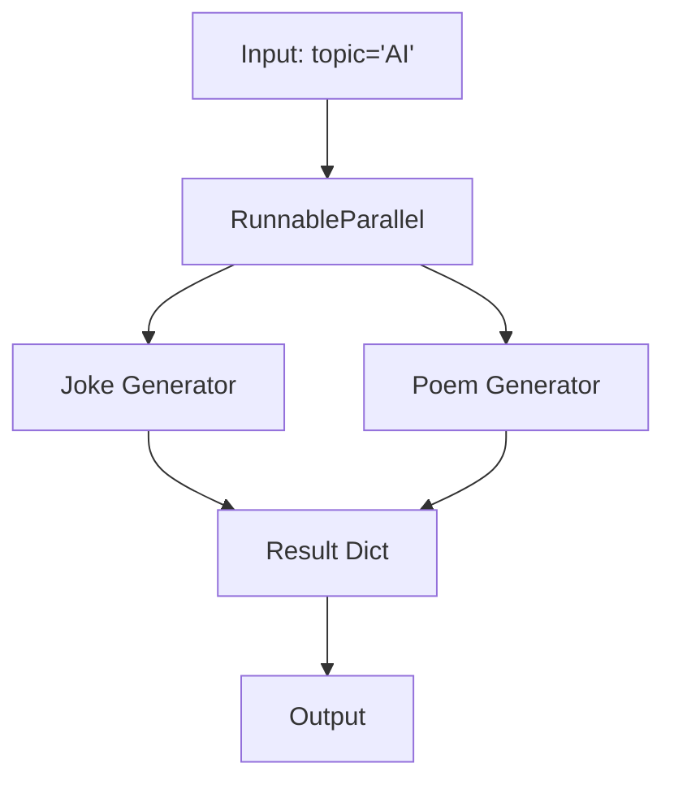

#### **RunnableBranch - 条件分支**

根据条件选择不同的执行路径：

```python
from langchain_core.runnables import RunnableBranch

branch = RunnableBranch(
    (lambda x: len(x) > 100, long_text_handler),
    (lambda x: len(x) > 10, medium_text_handler),
    short_text_handler  # 默认分支
)

result = branch.invoke("some text")
```

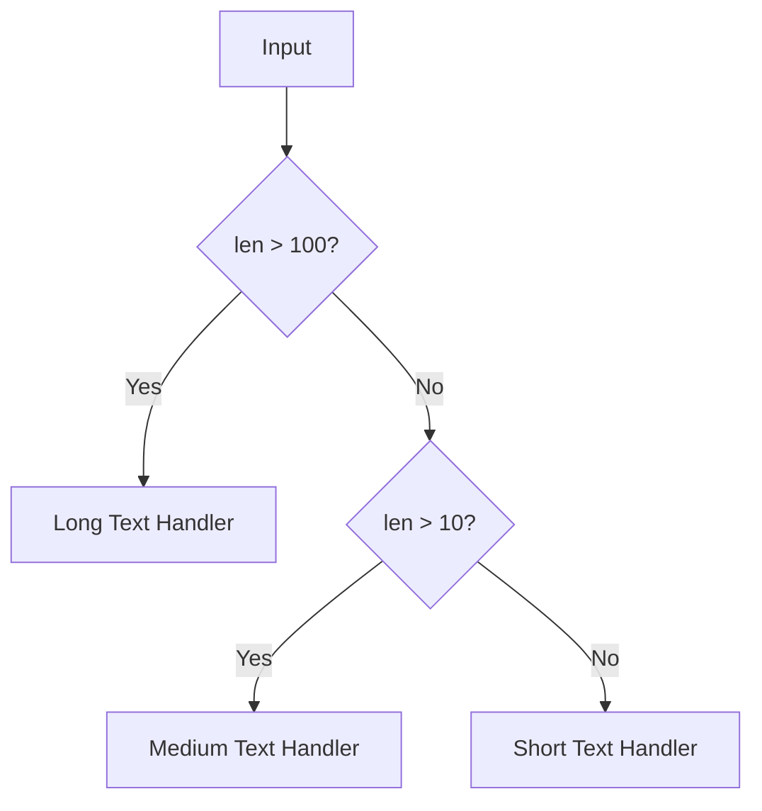

#### **RunnableWithFallbacks - 降级处理**

主 Runnable 失败时，自动切换到备用方案：

```python
from langchain_core.runnables import RunnableWithFallbacks

primary_model = ChatOpenAI(model="gpt-4")
fallback_model = ChatOpenAI(model="gpt-3.5-turbo")

model_with_fallback = primary_model.with_fallbacks([fallback_model])

# 如果 GPT-4 失败，自动使用 GPT-3.5
result = model_with_fallback.invoke("Hello")
```

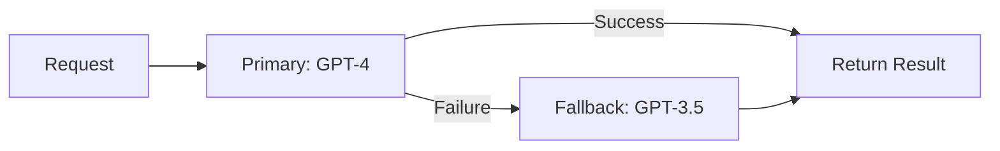

---

## 2.2 LCEL 表达式语言

### 2.2.1 声明式组合理念

LCEL（LangChain Expression Language）是一种**声明式**语法，用于组合 Runnable 对象。

**命令式 vs 声明式**：

```python
# ❌ 命令式（手动控制流程）
def imperative_chain(input):
    step1_result = prompt.invoke(input)
    step2_result = model.invoke(step1_result)
    step3_result = parser.invoke(step2_result)
    return step3_result

# ✅ 声明式（LCEL 管道）
chain = prompt | model | parser
result = chain.invoke(input)
```

**LCEL 的核心优势**：

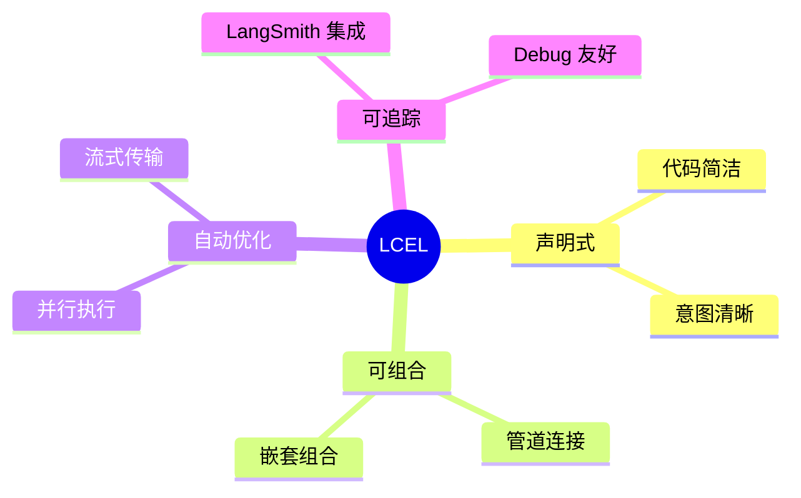

---

### 2.2.2 管道操作符 `|` 与并行 `{}`

#### **管道操作符 `|` - 顺序执行**

将多个 Runnable 串联成管道：

```python
from langchain_core.prompts import ChatPromptTemplate
from langchain_openai import ChatOpenAI
from langchain_core.output_parsers import StrOutputParser

# 管道组合
chain = (
    ChatPromptTemplate.from_template("Tell me about {topic}")
    | ChatOpenAI()
    | StrOutputParser()
)

# 自动按顺序执行
result = chain.invoke({"topic": "LangChain"})
```

**执行流程**：

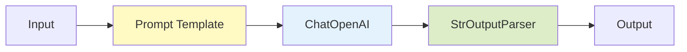

#### **并行字典 `{}` - 并行执行**

使用字典语法实现并行执行：

```python
from langchain_core.runnables import RunnablePassthrough

chain = {
    "context": retriever | format_docs,
    "question": RunnablePassthrough()
} | prompt | model

# context 和 question 并行处理
result = chain.invoke("What is LangChain?")
```

**执行流程**：

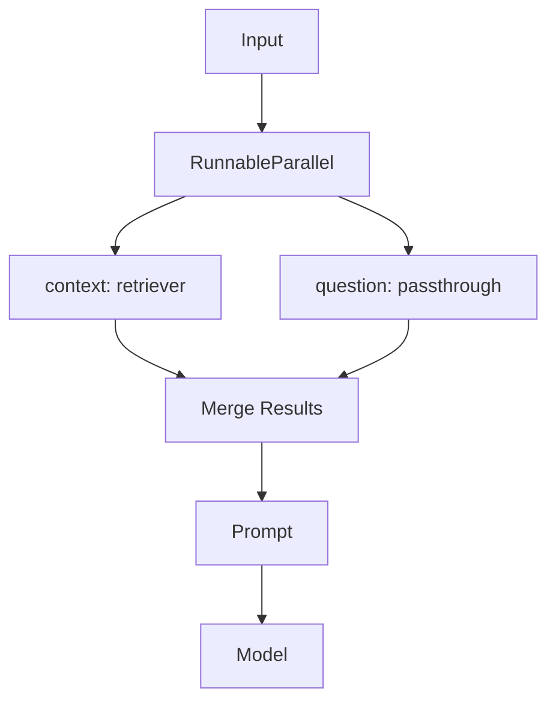

---

### 2.2.3 组合模式：顺序、并行、条件、循环

#### **顺序链接**

```python
# 简单顺序
chain = step1 | step2 | step3

# 复杂顺序
chain = (
    {"input": RunnablePassthrough()}
    | prompt
    | model
    | {"output": parser, "raw": RunnablePassthrough()}
)
```

#### **并行执行**

```python
# 并行获取多个信息
chain = RunnableParallel(
    summary=summarize_chain,
    keywords=extract_keywords_chain,
    sentiment=sentiment_chain
)
```

#### **条件分支**

```python
from langchain_core.runnables import RunnableBranch

# 根据输入长度选择不同处理
chain = RunnableBranch(
    (lambda x: len(x["text"]) > 1000, long_text_chain),
    (lambda x: len(x["text"]) > 100, medium_text_chain),
    short_text_chain
)
```

#### **循环迭代**

```python
# 使用 RunnableLambda 实现循环
def iterative_refine(input):
    result = input
    for _ in range(3):
        result = refine_chain.invoke(result)
    return result

chain = RunnableLambda(iterative_refine)
```

---

## 2.3 高级特性

### 2.3.1 Fallback 降级与 Retry 重试

#### **Fallback - 自动降级**

```python
# 多级降级
chain = (
    primary_model
    .with_fallbacks([backup_model_1, backup_model_2])
    .with_config({"max_fallback_retries": 3})
)
```

**降级流程**：

```mermaid
graph TD
    A[Request] --> B[Primary Model]
    B -- Success --> Z[Return]
    B -- Failure --> C[Backup Model 1]
    C -- Success --> Z
    C -- Failure --> D[Backup Model 2]
    D --> Z
```

#### **Retry - 自动重试**

```python
from langchain_core.runnables import RunnableRetry

chain = (
    prompt | model | parser
).with_retry(
    stop_after_attempt=3,
    wait_exponential_multiplier=1,
    wait_exponential_max=10
)
```

**重试策略**：
- 指数退避：1s → 2s → 4s → 8s
- 最大重试次数：3次
- 重试条件：网络错误、超时、限流

---

### 2.3.2 Timeout 超时控制

```python
from langchain_core.runnables import RunnableConfig

# 设置超时
chain = prompt | model | parser
result = chain.invoke(
    input,
    config=RunnableConfig(timeout=30)  # 30秒超时
)
```

**超时处理策略**：

```python
# 组合超时 + 降级
chain = (
    slow_model.with_config(timeout=10)
    .with_fallbacks([fast_model])
)
```

---

### 2.3.3 缓存与性能优化

#### **LLM 缓存**

```python
from langchain.cache import InMemoryCache
from langchain.globals import set_llm_cache

# 启用缓存
set_llm_cache(InMemoryCache())

# 相同请求直接返回缓存结果
model.invoke("What is AI?")  # 调用 LLM
model.invoke("What is AI?")  # 返回缓存（不调用 LLM）
```

#### **批处理优化**

```python
# 自动批处理优化
chain = prompt | model.with_config({"max_batch_size": 10})

# 内部自动合并请求
results = chain.batch(inputs)
```

#### **流式优化**

```python
# 流式传输减少延迟
for chunk in chain.stream(input):
    print(chunk, end="")
```

**性能对比**：

| 特性 | 普通调用 | 优化后 | 性能提升 |
|------|---------|--------|---------|
| 缓存 | 2s | 50ms | 40x |
| 批处理 | 10s | 2s | 5x |
| 流式 | TTFT 2s | TTFT 200ms | 10x |

---

## 本章小结

**Runnable Protocol 核心要点**：
- ✅ 统一接口：invoke、stream、batch、ainvoke、astream
- ✅ 可组合性：Lambda、Parallel、Branch、Fallbacks
- ✅ 可追踪性：自动集成 LangSmith
- ✅ 性能优化：异步、批处理、缓存

**LCEL 核心要点**：
- ✅ 声明式组合：`|` 管道、`{}` 并行
- ✅ 自动优化：并行执行、流式传输
- ✅ 高级特性：Fallback、Retry、Timeout、Cache

**设计哲学**：
> 一切皆 Runnable，所有组件统一接口，声明式组合，自动优化执行。

---

## 思考与练习

1. **练习 1：基础管道**
   构建一个 LCEL 管道：Prompt → Model → Parser，实现一个简单的问答系统。

2. **练习 2：并行处理**
   使用 RunnableParallel 同时生成一个笑话、一首诗和一个故事，输入主题为"AI"。

3. **练习 3：错误处理**
   实现一个带有 Fallback 和 Retry 的 chain，主模型失败时自动切换到备用模型。

4. **练习 4：性能优化**
   对比同步批处理和异步批处理的性能差异（10个请求）。

5. **思考题：**
   - 什么场景下应该使用 stream 而不是 invoke？
   - RunnableBranch 和简单的 if-else 有什么区别？
   - 如何在 LCEL 中实现循环逻辑？
