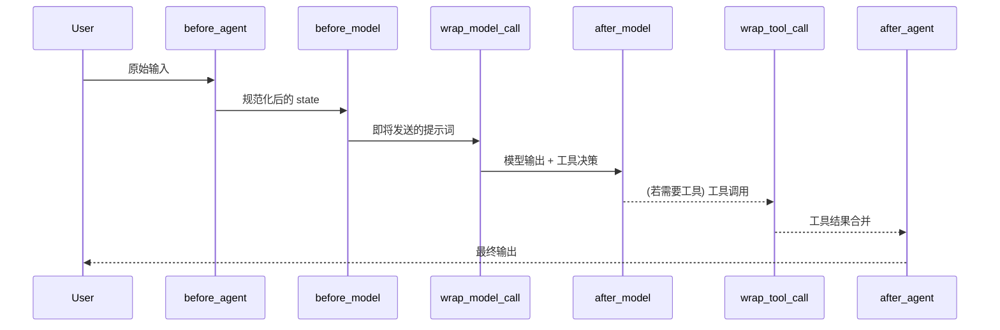

# 第五篇 Middleware 工程化

> **目标**: 掌握优化和控制 Agent 行为的能力

本篇开始进入 **Context Engineering + Middleware** 阶段：我们不再满足于"LLM 想怎么调用工具就怎么调用"，而是通过 Hook、策略和监控把 Agent 的行为放进"护栏"里，确保**可靠性、可观测性与合规性**。

---

## 第 11 章 Middleware 体系与内置组件

> **关注点**：理解 Middleware 的运行机制、Hook 分布以及官方内置组件的使用场景。

### 11.1 Context Engineering 理论

#### 11.1.1 核心理念：正确的信息、时机、方式

**Middleware** 是 LangChain 1.0 引入的核心机制，用于在 Agent 执行循环的各个阶段精准干预和控制。核心理念是"在正确的时机、以正确的方式提供正确的信息"。

**三大匹配原则**：

1. **信息匹配**：只把任务相关的上下文推给模型，其余通过文件/缓存卸载
2. **时机匹配**：针对不同阶段（用户输入、模型推理、工具调用、输出落地）注入不同策略
3. **方式匹配**：选择拦截（阻断）、注入（补充提示）、改写（结构化输出）等不同干预手段

**为什么需要 Context Engineering**？

```python
# 问题场景：对话太长导致 Token 超限
messages = [
    HumanMessage("介绍一下 Python"),
    AIMessage("Python 是...（2000 字）"),
    HumanMessage("介绍一下 JavaScript"),
    AIMessage("JavaScript 是...（2000 字）"),
    # ...继续 10 轮对话
    HumanMessage("现在帮我写个 Hello World"),  # 此时 Token 已超限
]

# ❌ 不使用 Middleware：直接报错 "context_length_exceeded"
# ✅ 使用 SummarizationMiddleware：自动摘要前面的对话，保留最近 N 条
```

#### 11.1.2 主要挑战：Token 限制、信息过载、上下文漂移

| 挑战 | 表现 | Middleware 解决方案 |
|------|------|-------------------|
| **Token 限制** | 长对话导致超限 | `SummarizationMiddleware` 自动摘要 |
| **信息过载** | 工具太多导致模型混乱 | `LLMToolSelectorMiddleware` 动态筛选 |
| **上下文漂移** | Agent 偏离原始任务 | `before_model` Hook 注入目标提醒 |
| **敏感数据泄露** | 输出包含 PII | `PIIMiddleware` 自动脱敏 |
| **工具调用失败** | 重复失败没有重试 | `ToolRetryMiddleware` 自动重试 |

#### 11.1.3 诊断矩阵

| 现象 | Hook 位置 | 典型措施 |
|------|-----------|---------|
| 模型回答离题 | `before_model` | 注入系统摘要、强调目标 |
| 工具反复失败 | `wrap_tool_call` | 捕获异常，限制重试次数，记录指标 |
| 输出包含敏感信息 | `after_model`/`after_agent` | PII 脱敏、输出审计 |
| Token 成本过高 | `wrap_model_call` | 缓存相似请求、切换更便宜的模型 |
| 模型选择错误 | `wrap_model_call` | 根据任务复杂度动态切换模型 |

---

### 11.2 Middleware Hook 体系

LangChain 1.0 为 Agent 暴露了 **6 个 Hook**，形成一条可插拔的调用链。

#### 11.2.1 六大 Hook 执行链



**Hook 执行时机**：

1. `before_agent`：Agent 执行开始前，可以做租户鉴权、输入归一化
2. `before_model`：模型调用前，典型用来控制提示词、补充上下文、阻止超限
3. `wrap_model_call`：**最强的 Hook**，可完全接管 LLM 调用，实现缓存、A/B、成本注入
4. `after_model`：模型响应后，读取模型输出，做输出审核或结构化转换
5. `wrap_tool_call`：工具调用时，劫持工具调用，加入熔断、重试、并发限制
6. `after_agent`：Agent 执行结束后，对整轮会话做审计、保存日志、回写数据库

**Hook 分类**：

- **Node-Style Hooks** (before_agent, before_model, after_model, after_agent)
  - 顺序执行
  - 可返回 `dict` 修改 state，返回 `None` 则沿用原值

- **Wrap-Style Hooks** (wrap_model_call, wrap_tool_call)
  - 嵌套执行（第一个 middleware 最外层）
  - 完全控制调用流程，可短路返回

#### 11.2.2 Hook 签名与参数

**Node-Style Hooks 签名**：

```python
def before_agent(state: AgentState, runtime: Runtime) -> dict[str, Any] | None:
    """
    Agent 执行开始前的 Hook

    Args:
        state: 当前状态（包含 messages, input 等）
        runtime: 运行时上下文（包含 config, token_counter 等）

    Returns:
        dict: 返回字典会更新 state
        None: 返回 None 则沿用原 state
    """
    pass

def before_model(state: AgentState, runtime: Runtime) -> dict[str, Any] | None:
    """模型调用前的 Hook"""
    pass

def after_model(state: AgentState, runtime: Runtime) -> dict[str, Any] | None:
    """模型响应后的 Hook"""
    pass

def after_agent(state: AgentState, runtime: Runtime) -> dict[str, Any] | None:
    """Agent 执行结束后的 Hook"""
    pass
```

**Wrap-Style Hooks 签名**：

```python
def wrap_model_call(
    request: ModelRequest,
    handler: Callable[[ModelRequest], ModelResponse]
) -> ModelResponse:
    """
    模型调用的包装 Hook

    Args:
        request: 模型请求（包含 model, messages, tools 等）
        handler: 实际执行模型调用的函数

    Returns:
        ModelResponse: 模型响应
    """
    # 可以在调用前修改 request
    request.model = ChatOpenAI(model="gpt-4o")

    # 调用实际的模型
    response = handler(request)

    # 可以在调用后修改 response
    return response

def wrap_tool_call(
    request: ToolCallRequest,
    handler: Callable[[ToolCallRequest], ToolMessage | Command]
) -> ToolMessage | Command:
    """
    工具调用的包装 Hook

    Args:
        request: 工具调用请求（包含 tool, tool_call 等）
        handler: 实际执行工具调用的函数

    Returns:
        ToolMessage 或 Command
    """
    try:
        return handler(request)
    except Exception as e:
        # 捕获异常并返回错误消息
        return ToolMessage(
            content=f"工具调用失败: {str(e)}",
            tool_call_id=request.tool_call["id"]
        )
```

**Runtime 对象的常用属性**：

```python
class Runtime:
    config: dict[str, Any]         # 运行时配置
    token_counter: TokenCounter    # Token 计数器
    summarizer: Summarizer         # 摘要器（如果配置了）
    metrics: Metrics               # 指标收集器
```

#### 11.2.3 Hook 能力：修改输入、拦截调用、增强输出、监控

**示例：Token 预算控制 Middleware**

```python
from langchain.agents.middleware import AgentMiddleware

class TokenBudgetMiddleware(AgentMiddleware):
    """控制对话历史的 Token 数量"""

    def __init__(self, max_tokens: int = 32000, keep_last: int = 4):
        self.max_tokens = max_tokens
        self.keep_last = keep_last

    def before_model(self, state, runtime):
        messages = state.get("messages", [])

        # 计算当前 Token 数量
        token_count = runtime.token_counter.count_messages(messages)

        if token_count > self.max_tokens:
            # 超限：保留最近 N 条消息，其余摘要
            recent_messages = messages[-self.keep_last:]
            old_messages = messages[:-self.keep_last]

            # 使用 runtime.summarizer 摘要旧消息
            summary = runtime.summarizer.summarize(
                old_messages,
                prompt="简要总结以下对话的关键信息："
            )

            # 返回新的 messages
            return {
                "messages": [
                    SystemMessage(content=f"对话历史摘要：{summary}")
                ] + recent_messages
            }

        return None  # 未超限，沿用原 state
```

**示例：工具白名单 Middleware**

```python
from langchain.agents.middleware import wrap_tool_call
from langchain_core.messages import ToolMessage

@wrap_tool_call
def tool_whitelist_middleware(request, handler):
    """限制可用工具列表"""
    allowed_tools = {"search", "get_weather"}

    tool_name = request.tool_call["name"]

    if tool_name not in allowed_tools:
        # 拦截不允许的工具
        return ToolMessage(
            content=f"工具 {tool_name} 不在允许列表中，请使用其他工具。",
            tool_call_id=request.tool_call["id"]
        )

    # 放行允许的工具
    return handler(request)
```

**示例：动态模型选择 Middleware**

```python
from langchain.agents.middleware import wrap_model_call
from langchain_openai import ChatOpenAI

basic_model = ChatOpenAI(model="gpt-4o-mini")
advanced_model = ChatOpenAI(model="gpt-4o")

@wrap_model_call
def dynamic_model_selection(request, handler):
    """根据对话复杂度选择模型"""
    message_count = len(request.state["messages"])

    # 对话超过 10 轮，使用高级模型
    if message_count > 10:
        request.model = advanced_model
    else:
        request.model = basic_model

    return handler(request)
```

#### 11.2.4 观测与审计闭环

结合 `LoggingMiddleware`/`MetricsMiddleware` 可以把每次 Hook 的输入输出写到结构化日志，实现：

1. **Prompt Diff**：记录 before/after 的提示差异，定位谁修改了上下文
2. **Tool Telemetry**：统计工具成功率、平均延迟，驱动熔断与扩缩容
3. **安全追责**：把 after_agent 输出与审核结论存档，满足合规审计

**示例：审计日志 Middleware**

```python
import logging
from langchain.agents.middleware import AgentMiddleware

logger = logging.getLogger(__name__)

class AuditMiddleware(AgentMiddleware):
    """审计所有 Agent 执行过程"""

    def before_agent(self, state, runtime):
        user_id = runtime.config.get("user_id", "anonymous")
        logger.info(f"[AUDIT] User {user_id} started agent")
        return None

    def before_model(self, state, runtime):
        messages = state.get("messages", [])
        logger.info(f"[AUDIT] Model call with {len(messages)} messages")
        return None

    def after_model(self, state, runtime):
        last_message = state["messages"][-1]

        # 检查是否有工具调用
        if hasattr(last_message, "tool_calls") and last_message.tool_calls:
            tool_names = [tc["name"] for tc in last_message.tool_calls]
            logger.info(f"[AUDIT] Tools called: {tool_names}")

        return None

    def after_agent(self, state, runtime):
        final_output = state["messages"][-1].content
        logger.info(f"[AUDIT] Agent completed. Output length: {len(final_output)}")

        # 可以将审计日志写入数据库
        # db.insert_audit_log(user_id, input, output, timestamp)

        return None
```

---

### 11.3 内置 Middleware

LangChain 官方已经提供了一套覆盖"安全 + 体验 + 合规"的默认组件。

#### 11.3.1 常用组件对比

| Middleware | 核心作用 | 典型策略 | 额外成本 |
|------------|---------|---------|---------|
| `SummarizationMiddleware` | 控制上下文长度 | 动态摘要、保留最近 N 条消息 | 追加一次模型调用 |
| `HumanInTheLoopMiddleware` | 注入人工审批 | `interrupt_on=["tool_start"]` | 等待人工操作 |
| `PIIMiddleware` | 检测并处理敏感数据 | `redact`(脱敏)、`mask`、`block` | 正则/模型检测开销 |
| `AnthropicPromptCachingMiddleware` | 缓存重复提示词 | Anthropic 模型专用缓存 | 无（节省成本） |
| `ModelCallLimitMiddleware` | 限制模型调用次数 | 防止死循环、控制成本 | 无 |
| `ToolCallLimitMiddleware` | 限制工具调用次数 | 全局或单个工具限制 | 无 |
| `ModelFallbackMiddleware` | 模型降级 | 主模型失败时切换备用模型 | 可能增加延迟 |
| `TodoListMiddleware` | 任务规划和追踪 | 启用任务分解能力 | 无 |
| `LLMToolSelectorMiddleware` | 智能工具筛选 | 根据任务动态筛选相关工具 | 追加一次模型调用 |
| `ToolRetryMiddleware` | 工具重试 | 指数退避重试 | 增加延迟 |
| `LLMToolEmulatorMiddleware` | 工具模拟 | 测试环境模拟工具执行 | 无 |
| `ContextEditingMiddleware` | 上下文编辑 | 管理对话上下文 | 无 |

#### 11.3.2 SummarizationMiddleware - 对话摘要

**场景**：长对话导致 Token 超限。

**用法**：

```python
from langchain.agents import create_agent
from langchain.agents.middleware import SummarizationMiddleware
from langchain_openai import ChatOpenAI

model = ChatOpenAI(model="gpt-4o")

agent = create_agent(
    model=model,
    tools=tools,
    system_prompt="你是一个助手",
    middleware=[
        SummarizationMiddleware(
            model=model,                      # 用于摘要的模型
            max_tokens_before_summary=2000,   # 超过 2000 tokens 时触发摘要
            messages_to_keep=6,               # 保留最近 6 条消息
            summary_prompt="简要总结以下对话的关键信息，保留重要事实："
        )
    ]
)
```

**工作原理**：

1. `before_model` Hook 检查 Token 数量
2. 超过 `max_tokens_before_summary` 时：
   - 保留最近 `messages_to_keep` 条消息
   - 其余消息用 `model` 摘要
   - 将摘要作为 SystemMessage 插入到对话开头
3. 返回新的 messages 列表

#### 11.3.3 HumanInTheLoopMiddleware - 人工审批

**场景**：关键操作需要人工确认（如发送邮件、执行数据库操作）。

**用法**：

```python
from langchain.agents.middleware import HumanInTheLoopMiddleware

agent = create_agent(
    model=model,
    tools=[send_email, delete_data],
    middleware=[
        HumanInTheLoopMiddleware(
            interrupt_on=["tool_start"],  # 在工具调用前中断
            # interrupt_on=["tool_end"]   # 在工具调用后中断
        )
    ]
)

# 执行 Agent
result = agent.invoke(
    {"messages": [("user", "发送邮件给 alice@example.com")]},
    config={"configurable": {"thread_id": "thread-001"}}
)

# 此时 Agent 会在调用 send_email 前中断，等待审批
# 需要人工恢复执行：
agent.invoke(
    None,  # 传入 None 表示恢复执行
    config={"configurable": {"thread_id": "thread-001"}}
)
```

**高级用法：选择性中断**

```python
from langchain.agents.middleware import wrap_tool_call
from langchain_core.messages import ToolMessage

@wrap_tool_call
def selective_approval(request, handler):
    """只对危险工具要求审批"""
    dangerous_tools = {"delete_data", "send_email"}

    if request.tool_call["name"] in dangerous_tools:
        # 触发中断（需要配合 Checkpointer 和 interrupt）
        approval = input(f"是否允许调用 {request.tool_call['name']}? (y/n): ")

        if approval.lower() != 'y':
            return ToolMessage(
                content="操作已被用户取消",
                tool_call_id=request.tool_call["id"]
            )

    return handler(request)
```

#### 11.3.4 PIIMiddleware - 敏感数据处理

**场景**：防止敏感信息泄露（邮箱、电话、身份证号等）。

**用法**：

```python
from langchain.middleware import PIIMiddleware

agent = create_agent(
    model=model,
    tools=tools,
    middleware=[
        PIIMiddleware(
            fields=["email", "credit_card", "phone"],  # 检测的 PII 类型
            strategy="redact",                          # 处理策略
            apply_to_output=True                        # 是否应用到输出
        )
    ]
)

# 输入包含邮箱：
result = agent.invoke({
    "messages": [("user", "我的邮箱是 alice@example.com")]
})

# 实际发送给模型的是：
# "我的邮箱是 [REDACTED_EMAIL]"
```

**处理策略**：

- `redact`：替换为 `[REDACTED_EMAIL]`
- `mask`：部分遮蔽（如 `a***e@example.com`）
- `block`：直接拒绝请求

**自定义 PII 检测**：

```python
import re

PIIMiddleware(
    fields={
        "id_card": r"\d{18}",  # 自定义正则：18 位身份证号
        "wechat": r"wx[a-zA-Z0-9]{6,20}"
    },
    strategy="redact"
)
```

#### 11.3.5 ModelCallLimitMiddleware - 限制模型调用

**场景**：防止死循环、控制成本。

**用法**：

```python
from langchain.agents.middleware import ModelCallLimitMiddleware

agent = create_agent(
    model=model,
    tools=tools,
    middleware=[
        ModelCallLimitMiddleware(
            run_limit=10,           # 单次调用最多 10 次模型
            thread_limit=100,       # 单个 thread 总共最多 100 次
            exit_behavior="error"   # 超限时抛异常（或 "end" 直接结束）
        )
    ]
)
```

**exit_behavior 选项**：

- `"error"`：抛出异常
- `"end"`：优雅结束，返回当前状态

#### 11.3.6 ToolCallLimitMiddleware - 限制工具调用

**用法**：

```python
from langchain.agents.middleware import ToolCallLimitMiddleware

agent = create_agent(
    model=model,
    tools=tools,
    middleware=[
        # 限制所有工具总共调用 20 次
        ToolCallLimitMiddleware(
            run_limit=20,
            exit_behavior="continue"  # 继续执行但不再调用工具
        ),

        # 限制单个工具调用次数
        ToolCallLimitMiddleware(
            tool_name="expensive_api",
            run_limit=3,              # 单次执行最多调用 3 次
            thread_limit=10           # 单个 thread 最多调用 10 次
        )
    ]
)
```

#### 11.3.7 ToolRetryMiddleware - 工具重试

**场景**：工具调用失败时自动重试。

**用法**：

```python
from langchain.agents.middleware import ToolRetryMiddleware

agent = create_agent(
    model=model,
    tools=tools,
    middleware=[
        ToolRetryMiddleware(
            max_retries=3,           # 最多重试 3 次
            initial_delay=1.0,       # 初始延迟 1 秒
            backoff_factor=2.0,      # 指数退避因子（1s, 2s, 4s）
            jitter=True              # 添加随机抖动避免雷鸣羊群
        )
    ]
)
```

**工作原理**：

1. 工具调用失败时捕获异常
2. 等待 `initial_delay * (backoff_factor ^ retry_count)` 秒
3. 重试，最多 `max_retries` 次
4. 如果仍然失败，返回错误消息给模型

#### 11.3.8 LLMToolSelectorMiddleware - 智能工具筛选

**场景**：工具太多导致模型混乱，动态筛选相关工具。

**用法**：

```python
from langchain.agents.middleware import LLMToolSelectorMiddleware

# 假设有 50 个工具
all_tools = [tool1, tool2, ..., tool50]

agent = create_agent(
    model=model,
    tools=all_tools,
    middleware=[
        LLMToolSelectorMiddleware(
            model=ChatOpenAI(model="gpt-4o-mini"),  # 用于筛选的模型
            max_tools=5                             # 最多选择 5 个工具
        )
    ]
)
```

**工作原理**：

1. `before_model` Hook 分析用户意图
2. 使用 LLM 从所有工具中筛选最相关的 N 个
3. 只将这 N 个工具传递给主模型

#### 11.3.9 组合示例

```python
from langchain.middleware import PIIMiddleware
from langchain.agents.middleware import (
    SummarizationMiddleware,
    ModelCallLimitMiddleware,
    ToolRetryMiddleware
)

middleware_stack = [
    # 1. 安全：先做 PII 检测
    PIIMiddleware(
        fields=["email", "credit_card"],
        strategy="redact",
        apply_to_output=True
    ),

    # 2. 成本控制：限制模型调用次数
    ModelCallLimitMiddleware(run_limit=20),

    # 3. 可靠性：工具自动重试
    ToolRetryMiddleware(max_retries=3),

    # 4. 性能：摘要长对话
    SummarizationMiddleware(
        model=model,
        max_tokens_before_summary=2000,
        messages_to_keep=6
    )
]

agent = create_agent(
    model=model,
    tools=tools,
    system_prompt="你是一个助手",
    middleware=middleware_stack
)
```

**执行顺序**：

- `before_*` hooks：按列表顺序（1 → 2 → 3 → 4）
- `wrap_*` hooks：嵌套执行（1 包装 2 包装 3 包装 4）
- `after_*` hooks：逆序执行（4 → 3 → 2 → 1）

---

### 11.4 Middleware 执行顺序与组合

#### 11.4.1 执行顺序规则

**多个 Middleware 的执行顺序**：

```python
middleware = [A, B, C]

# before_* hooks: A → B → C
# wrap_* hooks: A 包装 B 包装 C (嵌套)
# after_* hooks: C → B → A (逆序)
```

**示例**：

```python
class MiddlewareA(AgentMiddleware):
    def before_model(self, state, runtime):
        print("A: before_model")
        return None

    def after_model(self, state, runtime):
        print("A: after_model")
        return None

class MiddlewareB(AgentMiddleware):
    def before_model(self, state, runtime):
        print("B: before_model")
        return None

    def after_model(self, state, runtime):
        print("B: after_model")
        return None

agent = create_agent(
    model=model,
    tools=[],
    middleware=[MiddlewareA(), MiddlewareB()]
)

# 输出顺序：
# A: before_model
# B: before_model
# (模型调用)
# B: after_model
# A: after_model
```

#### 11.4.2 组合策略

**1. 安全 → 观测 → 优化**

```python
middleware = [
    PIIMiddleware(...),              # 1. 先保障合规
    AuditMiddleware(),               # 2. 再记录日志
    SummarizationMiddleware(...)     # 3. 最后做性能调优
]
```

**2. 单一职责**

每个 Middleware 只做一件事，方便拆卸和测试：

```python
# ❌ 不好：一个 Middleware 做太多事情
class MonsterMiddleware(AgentMiddleware):
    def before_model(self, state, runtime):
        # PII 检测
        # Token 计数
        # 日志记录
        # 缓存检查
        pass

# ✅ 好：每个 Middleware 职责单一
middleware = [
    PIIMiddleware(),
    TokenBudgetMiddleware(),
    LoggingMiddleware(),
    CacheMiddleware()
]
```

**3. 配置化**

通过 `runtime.config` 或环境变量控制开关：

```python
class FeatureFlagMiddleware(AgentMiddleware):
    def before_model(self, state, runtime):
        # 从 config 读取开关
        enable_experimental = runtime.config.get("enable_experimental", False)

        if enable_experimental:
            # 注入实验性提示词
            messages = state["messages"]
            messages.insert(0, SystemMessage("使用实验性功能"))
            return {"messages": messages}

        return None

# 使用时控制开关
agent.invoke(
    {"messages": [("user", "测试")]},
    config={"enable_experimental": True}
)
```

#### 11.4.3 冲突处理

**问题**：多个 Middleware 同时修改 `messages`。

**解决方案**：

1. **明确优先级**：后面的 Middleware 覆盖前面的
2. **幂等设计**：避免重复追加相同内容
3. **单元测试**：验证组合行为

**示例：幂等设计**

```python
class SystemPromptMiddleware(AgentMiddleware):
    def before_model(self, state, runtime):
        messages = state["messages"]

        # 检查是否已经添加过系统提示
        if messages and isinstance(messages[0], SystemMessage):
            return None  # 已存在，跳过

        # 添加系统提示
        return {
            "messages": [SystemMessage("你是一个助手")] + messages
        }
```

---

### 本章小结

1. **Middleware 核心理念**：在正确的时机、以正确的方式提供正确的信息
2. **六大 Hook**：`before_agent`, `before_model`, `wrap_model_call`, `after_model`, `wrap_tool_call`, `after_agent`
3. **内置组件**：`SummarizationMiddleware`、`PIIMiddleware`、`HumanInTheLoopMiddleware`、`ModelCallLimitMiddleware` 等覆盖 80% 场景
4. **组合策略**：安全 → 观测 → 优化，单一职责，配置化

---

### 思考与练习

1. **思考**：给 `PIIMiddleware` 增加一个"仅提醒不阻断"的模式，应该放在什么 Hook？

   <details>
   <summary>答案</summary>

   放在 `after_model` Hook，检测到 PII 后追加一条提示消息，而不修改原始输出。

   ```python
   class PIIWarningMiddleware(AgentMiddleware):
       def after_model(self, state, runtime):
           last_message = state["messages"][-1]
           if self.detect_pii(last_message.content):
               # 追加警告消息
               return {
                   "messages": state["messages"] + [
                       SystemMessage("⚠️ 检测到敏感信息，请注意保护隐私")
                   ]
               }
           return None
   ```
   </details>

2. **练习**：实现一个 `CostTrackingMiddleware`，记录每次模型调用的成本（假设 gpt-4o 输入 $0.005/1K tokens，输出 $0.015/1K tokens）。

3. **思考**：针对 Token 超限问题，比较 `SummarizationMiddleware` 与写入临时文件的优缺点。

   <details>
   <summary>答案</summary>

   | 方案 | 优点 | 缺点 |
   |------|------|------|
   | SummarizationMiddleware | 保留语义信息，模型仍能理解上下文 | 需要额外模型调用，增加成本 |
   | 写入临时文件 | 完全卸载上下文，节省 Token | 模型无法直接访问，需要显式读取 |

   **结论**：对话式任务用 Summarization，文件操作任务用临时文件。
   </details>

---

## 第 12 章 自定义 Middleware 开发

> **关注点**：掌握自定义 Middleware 的接口、性能考量以及组合策略，能够落地项目级护栏。

### 12.1 开发规范

#### 12.1.1 Middleware 接口与最佳实践

**基础接口**：

```python
from langchain.agents.middleware import AgentMiddleware

class CustomMiddleware(AgentMiddleware):
    """自定义 Middleware 模板"""

    name = "custom_middleware"  # 可选：Middleware 名称

    def before_agent(self, state, runtime):
        """Agent 执行前"""
        pass

    def before_model(self, state, runtime):
        """模型调用前"""
        pass

    def after_model(self, state, runtime):
        """模型响应后"""
        pass

    def after_agent(self, state, runtime):
        """Agent 执行后"""
        pass

# 使用装饰器定义 Wrap-Style Hook
from langchain.agents.middleware import wrap_model_call, wrap_tool_call

@wrap_model_call
def my_model_wrapper(request, handler):
    """包装模型调用"""
    return handler(request)

@wrap_tool_call
def my_tool_wrapper(request, handler):
    """包装工具调用"""
    return handler(request)
```

**最佳实践**：

1. **继承 `AgentMiddleware`**：覆盖需要的 Hook
2. **返回值规则**：
   - Node-Style Hook：返回 `dict` 修改 state，返回 `None` 沿用原值
   - Wrap-Style Hook：必须返回 `ModelResponse` 或 `ToolMessage`
3. **异常处理**：抛异常会中止执行，错误传给调用方
4. **使用 `runtime.config`**：读取外层传入的上下文（租户、阈值、A/B 分组）

#### 12.1.2 自定义 State Schema

**场景**：需要在 state 中存储自定义字段。

**用法**：

```python
from typing_extensions import NotRequired
from langchain.agents import AgentState

class CustomState(AgentState):
    """扩展 AgentState"""
    model_call_count: NotRequired[int]        # 模型调用计数
    user_id: NotRequired[str]                 # 用户 ID
    cost: NotRequired[float]                  # 累计成本

class CallCounterMiddleware(AgentMiddleware[CustomState]):
    """统计模型调用次数"""

    state_schema = CustomState  # 声明使用自定义 State

    def before_agent(self, state, runtime):
        # 初始化计数器
        return {"model_call_count": 0}

    def before_model(self, state, runtime):
        # 递增计数器
        count = state.get("model_call_count", 0)
        return {"model_call_count": count + 1}

    def after_agent(self, state, runtime):
        # 输出统计
        print(f"总共调用模型 {state['model_call_count']} 次")
        return None
```

#### 12.1.3 性能考量

**1. 避免阻塞 I/O**

```python
# ❌ 不好：同步数据库查询会阻塞
class BadMiddleware(AgentMiddleware):
    def before_model(self, state, runtime):
        user = db.query("SELECT * FROM users WHERE id = ?", user_id)  # 阻塞！
        return {"user_info": user}

# ✅ 好：使用异步或缓存
class GoodMiddleware(AgentMiddleware):
    def __init__(self):
        self.cache = {}

    def before_model(self, state, runtime):
        user_id = runtime.config.get("user_id")

        # 从缓存读取
        if user_id in self.cache:
            return {"user_info": self.cache[user_id]}

        # 缓存未命中：使用异步客户端或跳过
        return None
```

**2. 控制附加模型调用**

```python
# 摘要/安全检测的模型最好与主模型解耦，可用便宜模型
class SummaryMiddleware(AgentMiddleware):
    def __init__(self):
        # 使用便宜的模型做摘要
        self.summary_model = ChatOpenAI(model="gpt-4o-mini")

    def before_model(self, state, runtime):
        # 只在必要时调用
        if len(state["messages"]) > 20:
            summary = self.summary_model.invoke(...)
            return {"summary": summary}
        return None
```

**3. 观测指标**

每个 Middleware 都要写入耗时、命中率：

```python
import time
from langchain.agents.middleware import AgentMiddleware

class ObservableMiddleware(AgentMiddleware):
    def before_model(self, state, runtime):
        start_time = time.time()

        # 执行逻辑
        result = self._do_something(state)

        # 记录耗时
        elapsed = time.time() - start_time
        runtime.metrics.histogram("middleware.before_model.duration", elapsed)

        return result
```

---

### 12.2 常见模式

#### 12.2.1 日志 Middleware

**完整示例**：

```python
import logging
from langchain.agents.middleware import AgentMiddleware

logger = logging.getLogger(__name__)

class DetailedLoggingMiddleware(AgentMiddleware):
    """详细的日志记录"""

    def before_agent(self, state, runtime):
        user_id = runtime.config.get("user_id", "anonymous")
        logger.info(f"[{user_id}] Agent started")
        logger.debug(f"[{user_id}] Initial state: {state}")
        return None

    def before_model(self, state, runtime):
        messages = state.get("messages", [])
        logger.info(f"Calling model with {len(messages)} messages")

        # 记录最后一条用户消息
        user_messages = [m for m in messages if m.type == "human"]
        if user_messages:
            logger.debug(f"Last user message: {user_messages[-1].content}")

        return None

    def after_model(self, state, runtime):
        last_message = state["messages"][-1]

        # 记录模型输出
        logger.debug(f"Model output: {last_message.content[:100]}...")

        # 记录工具调用
        if hasattr(last_message, "tool_calls") and last_message.tool_calls:
            tool_names = [tc["name"] for tc in last_message.tool_calls]
            logger.info(f"Model requested tools: {tool_names}")

        return None

    def after_agent(self, state, runtime):
        final_output = state["messages"][-1].content
        logger.info(f"Agent completed. Output length: {len(final_output)}")
        return None
```

**集成 OpenTelemetry**：

```python
from opentelemetry import trace
from langchain.agents.middleware import AgentMiddleware

tracer = trace.get_tracer(__name__)

class TracingMiddleware(AgentMiddleware):
    """OpenTelemetry 追踪"""

    def before_agent(self, state, runtime):
        # 创建 Span
        self.span = tracer.start_span("agent_execution")
        self.span.set_attribute("user_id", runtime.config.get("user_id"))
        return None

    def before_model(self, state, runtime):
        with tracer.start_as_current_span("model_call"):
            pass
        return None

    def after_agent(self, state, runtime):
        # 结束 Span
        self.span.end()
        return None
```

#### 12.2.2 安全 Middleware

**输出审核**：

```python
from langchain.agents.middleware import AgentMiddleware
from langchain_core.messages import AIMessage

class ContentSafetyMiddleware(AgentMiddleware):
    """内容安全审核"""

    def __init__(self, safety_detector):
        self.detector = safety_detector  # 外部安全检测服务

    def after_model(self, state, runtime):
        last_message = state["messages"][-1]

        # 只检查 AI 输出
        if not isinstance(last_message, AIMessage):
            return None

        # 调用安全检测
        result = self.detector.check(last_message.content)

        if result.is_blocked:
            # 替换为安全提示
            return {
                "messages": state["messages"][:-1] + [
                    AIMessage(
                        content="⚠️ 内容被安全策略阻止，请联系管理员。"
                    )
                ]
            }

        return None
```

**输入验证**：

```python
class InputValidationMiddleware(AgentMiddleware):
    """输入验证"""

    def before_agent(self, state, runtime):
        messages = state.get("messages", [])

        if not messages:
            raise ValueError("消息列表不能为空")

        # 检查最后一条是否为用户消息
        if messages[-1].type != "human":
            raise ValueError("最后一条消息必须是用户消息")

        # 检查输入长度
        user_input = messages[-1].content
        if len(user_input) > 10000:
            raise ValueError("输入内容过长（最多 10000 字符）")

        return None
```

#### 12.2.3 优化 Middleware

**缓存 Middleware**：

```python
import hashlib
import json
from langchain.agents.middleware import wrap_model_call

class CacheMiddleware:
    """缓存模型响应"""

    def __init__(self):
        self.cache = {}  # 生产环境应使用 Redis

    @wrap_model_call
    def __call__(self, request, handler):
        # 计算请求的哈希
        cache_key = self._compute_hash(request)

        # 检查缓存
        if cache_key in self.cache:
            print(f"✅ Cache hit: {cache_key}")
            return self.cache[cache_key]

        # 缓存未命中：调用模型
        print(f"❌ Cache miss: {cache_key}")
        response = handler(request)

        # 存入缓存
        self.cache[cache_key] = response

        return response

    def _compute_hash(self, request):
        """计算请求的哈希值"""
        # 使用 messages 和 model 作为缓存键
        key_data = {
            "model": str(request.model),
            "messages": [
                {"role": m.type, "content": m.content}
                for m in request.state["messages"]
            ]
        }
        key_str = json.dumps(key_data, sort_keys=True)
        return hashlib.md5(key_str.encode()).hexdigest()

# 使用
agent = create_agent(
    model=model,
    tools=tools,
    middleware=[CacheMiddleware()]
)
```

**Chain-of-Thought 注入**：

```python
class CoTMiddleware(AgentMiddleware):
    """注入 Chain-of-Thought 提示"""

    def before_model(self, state, runtime):
        messages = state["messages"]

        # 在最后一条用户消息后注入 CoT 提示
        if messages and messages[-1].type == "human":
            cot_prompt = SystemMessage(
                "在回答前，请先一步步分析问题，然后给出答案。"
            )
            return {
                "messages": messages + [cot_prompt]
            }

        return None
```

#### 12.2.4 路由 Middleware

**动态模型路由**：

```python
from langchain.agents.middleware import wrap_model_call
from langchain_openai import ChatOpenAI

class ModelRouterMiddleware:
    """根据任务类型选择模型"""

    def __init__(self):
        self.fast_model = ChatOpenAI(model="gpt-4o-mini")
        self.smart_model = ChatOpenAI(model="gpt-4o")
        self.code_model = ChatOpenAI(model="gpt-4o")  # 可替换为 Claude

    @wrap_model_call
    def __call__(self, request, handler):
        # 分析任务类型
        task_type = self._classify_task(request.state["messages"])

        # 路由到不同模型
        if task_type == "code":
            request.model = self.code_model
        elif task_type == "complex":
            request.model = self.smart_model
        else:
            request.model = self.fast_model

        return handler(request)

    def _classify_task(self, messages):
        """简单分类逻辑"""
        last_message = messages[-1].content.lower()

        if any(kw in last_message for kw in ["代码", "编程", "bug", "函数"]):
            return "code"
        elif len(last_message) > 500:
            return "complex"
        else:
            return "simple"
```

**工具路由**：

```python
from langchain.agents.middleware import wrap_tool_call

class ToolRouterMiddleware:
    """根据租户控制工具访问"""

    def __init__(self):
        self.tool_permissions = {
            "free": {"search", "weather"},
            "pro": {"search", "weather", "database", "email"},
            "enterprise": {"search", "weather", "database", "email", "admin"}
        }

    @wrap_tool_call
    def __call__(self, request, handler):
        # 获取租户
        tenant = request.state.get("tenant", "free")
        allowed_tools = self.tool_permissions.get(tenant, set())

        tool_name = request.tool_call["name"]

        # 检查权限
        if tool_name not in allowed_tools:
            return ToolMessage(
                content=f"工具 {tool_name} 需要 {self._required_plan(tool_name)} 计划",
                tool_call_id=request.tool_call["id"]
            )

        return handler(request)

    def _required_plan(self, tool_name):
        for plan, tools in self.tool_permissions.items():
            if tool_name in tools:
                return plan
        return "enterprise"
```

---

### 12.3 Middleware 组合与测试

#### 12.3.1 组合策略

**1. 分层组合**

```python
# 安全层
security_layer = [
    InputValidationMiddleware(),
    PIIMiddleware(fields=["email"], strategy="redact")
]

# 观测层
observability_layer = [
    LoggingMiddleware(),
    TracingMiddleware(),
    MetricsMiddleware()
]

# 优化层
optimization_layer = [
    CacheMiddleware(),
    SummarizationMiddleware(...)
]

# 组合
middleware = security_layer + observability_layer + optimization_layer
```

**2. 条件组合**

```python
import os

def get_middleware():
    """根据环境返回不同的 Middleware"""
    base = [
        InputValidationMiddleware(),
        LoggingMiddleware()
    ]

    if os.getenv("ENABLE_CACHE") == "true":
        base.append(CacheMiddleware())

    if os.getenv("ENV") == "production":
        base.extend([
            PIIMiddleware(...),
            ContentSafetyMiddleware(...)
        ])

    return base

agent = create_agent(
    model=model,
    tools=tools,
    middleware=get_middleware()
)
```

#### 12.3.2 冲突处理

**问题示例**：

```python
class AddSystemPromptA(AgentMiddleware):
    def before_model(self, state, runtime):
        return {
            "messages": [SystemMessage("来自 A")] + state["messages"]
        }

class AddSystemPromptB(AgentMiddleware):
    def before_model(self, state, runtime):
        return {
            "messages": [SystemMessage("来自 B")] + state["messages"]
        }

# ❌ 冲突：B 会覆盖 A 的修改
middleware = [AddSystemPromptA(), AddSystemPromptB()]
```

**解决方案 1：合并而非替换**

```python
class MergeSystemPrompts(AgentMiddleware):
    def before_model(self, state, runtime):
        messages = state["messages"]

        # 检查是否已有系统提示
        existing_system = [m for m in messages if isinstance(m, SystemMessage)]

        if existing_system:
            # 追加到现有系统提示
            combined = existing_system[0].content + "\n\n来自新 Middleware"
            return {
                "messages": [
                    SystemMessage(content=combined)
                ] + [m for m in messages if not isinstance(m, SystemMessage)]
            }
        else:
            # 添加新系统提示
            return {
                "messages": [SystemMessage("来自新 Middleware")] + messages
            }
```

**解决方案 2：使用标记避免重复**

```python
class IdempotentMiddleware(AgentMiddleware):
    MARKER = "__idempotent_marker__"

    def before_model(self, state, runtime):
        # 检查是否已执行
        if runtime.config.get(self.MARKER):
            return None  # 跳过

        # 标记已执行
        runtime.config[self.MARKER] = True

        # 执行逻辑
        return {"messages": [SystemMessage("只执行一次")] + state["messages"]}
```

#### 12.3.3 单元测试

**测试 Node-Style Hook**：

```python
import pytest
from langchain_core.messages import HumanMessage, SystemMessage

def test_token_budget_middleware():
    """测试 Token 预算 Middleware"""

    # 模拟 state
    state = {
        "messages": [HumanMessage(content="测试消息")] * 100  # 100 条消息
    }

    # 模拟 runtime
    class MockRuntime:
        class TokenCounter:
            def count_messages(self, messages):
                return len(messages) * 100  # 每条 100 tokens

        token_counter = TokenCounter()

        class Summarizer:
            def summarize(self, messages, prompt):
                return "摘要内容"

        summarizer = Summarizer()
        config = {}

    runtime = MockRuntime()

    # 创建 Middleware
    middleware = TokenBudgetMiddleware(max_tokens=5000, keep_last=4)

    # 调用 Hook
    result = middleware.before_model(state, runtime)

    # 断言
    assert result is not None
    assert len(result["messages"]) == 5  # 1 条摘要 + 4 条最近消息
    assert isinstance(result["messages"][0], SystemMessage)
    assert "摘要" in result["messages"][0].content
```

**测试 Wrap-Style Hook**：

```python
def test_cache_middleware():
    """测试缓存 Middleware"""

    cache_mw = CacheMiddleware()

    # 模拟 request
    class MockRequest:
        model = "gpt-4o"
        state = {"messages": [HumanMessage("测试")]}

    request = MockRequest()

    # 模拟 handler
    call_count = 0
    def mock_handler(req):
        nonlocal call_count
        call_count += 1
        return {"content": "响应"}

    # 第一次调用：缓存未命中
    response1 = cache_mw(request, mock_handler)
    assert call_count == 1

    # 第二次调用：缓存命中
    response2 = cache_mw(request, mock_handler)
    assert call_count == 1  # handler 没有被再次调用
    assert response1 == response2
```

**集成测试**：

```python
def test_middleware_integration():
    """测试 Middleware 组合"""
    from langchain.agents import create_agent
    from langchain_openai import ChatOpenAI

    agent = create_agent(
        model=ChatOpenAI(model="gpt-4o-mini"),
        tools=[],
        middleware=[
            InputValidationMiddleware(),
            LoggingMiddleware(),
            CacheMiddleware()
        ]
    )

    # 测试正常流程
    result = agent.invoke({"messages": [("user", "你好")]})
    assert result["messages"][-1].content

    # 测试输入验证
    with pytest.raises(ValueError):
        agent.invoke({"messages": []})  # 空消息应该失败
```

---

### 12.4 高级技巧

#### 12.4.1 Agent Jumps - 提前退出

**场景**：在某些条件下跳过后续步骤。

**用法**：

```python
from langchain.agents.middleware import AgentMiddleware, hook_config

class EarlyExitMiddleware(AgentMiddleware):
    """条件提前退出"""

    @hook_config(can_jump_to=["end", "tools", "model"])
    def before_model(self, state, runtime):
        messages = state["messages"]
        last_message = messages[-1].content

        # 检测特定关键词
        if "再见" in last_message or "拜拜" in last_message:
            # 直接结束，跳过模型调用
            return {
                "messages": messages + [
                    AIMessage(content="再见！很高兴为您服务。")
                ],
                "jump_to": "end"  # 跳转到结束节点
            }

        return None
```

**jump_to 选项**：

- `"end"`：完成 Agent 执行
- `"tools"`：跳转到工具执行节点
- `"model"`：返回到模型节点（重新调用模型）

**注意**：需要使用 `@hook_config(can_jump_to=[...])` 装饰器声明允许的跳转目标。

#### 12.4.2 动态工具注入

**场景**：根据上下文动态添加或移除工具。

```python
from langchain.agents.middleware import AgentMiddleware

class DynamicToolsMiddleware(AgentMiddleware):
    """动态工具注入"""

    def __init__(self, admin_tools):
        self.admin_tools = admin_tools

    def before_model(self, state, runtime):
        # 检查用户权限
        is_admin = runtime.config.get("is_admin", False)

        if is_admin:
            # 为管理员注入额外工具
            current_tools = runtime.config.get("tools", [])
            return {
                "tools": current_tools + self.admin_tools
            }

        return None
```

#### 12.4.3 成本追踪

**完整示例**：

```python
from langchain.agents.middleware import AgentMiddleware

class CostTrackingMiddleware(AgentMiddleware):
    """追踪模型调用成本"""

    # 价格（美元/1K tokens）
    PRICING = {
        "gpt-4o": {"input": 0.005, "output": 0.015},
        "gpt-4o-mini": {"input": 0.00015, "output": 0.0006},
    }

    def __init__(self):
        self.total_cost = 0.0

    def before_agent(self, state, runtime):
        # 初始化成本
        return {"cost": 0.0}

    def after_model(self, state, runtime):
        # 计算本次调用成本
        model_name = str(runtime.config.get("model", "gpt-4o-mini"))

        # 提取模型名称（去掉 provider 前缀）
        for key in self.PRICING:
            if key in model_name:
                model_name = key
                break

        if model_name not in self.PRICING:
            return None

        pricing = self.PRICING[model_name]

        # 获取 token 使用量（需要从 runtime 或 response 中读取）
        # 这里简化为估算
        messages = state["messages"]
        input_tokens = sum(len(m.content.split()) * 1.3 for m in messages)
        output_tokens = len(messages[-1].content.split()) * 1.3

        # 计算成本
        cost = (
            input_tokens / 1000 * pricing["input"] +
            output_tokens / 1000 * pricing["output"]
        )

        # 累加成本
        current_cost = state.get("cost", 0.0)
        new_cost = current_cost + cost

        print(f"💰 本次调用成本: ${cost:.6f}, 累计: ${new_cost:.6f}")

        return {"cost": new_cost}

    def after_agent(self, state, runtime):
        total_cost = state.get("cost", 0.0)
        print(f"💰 总成本: ${total_cost:.6f}")

        # 可以写入数据库
        # db.insert_cost_record(user_id, total_cost, timestamp)

        return None
```

---

### 12.5 生产级 Middleware 示例

**综合示例：生产环境 Middleware Stack**

```python
from langchain.agents import create_agent
from langchain.agents.middleware import (
    SummarizationMiddleware,
    ModelCallLimitMiddleware,
    ToolRetryMiddleware
)
from langchain.middleware import PIIMiddleware

# 自定义 Middleware
class ProductionMiddleware(AgentMiddleware):
    """生产环境综合 Middleware"""

    def __init__(self, db_client, metrics_client):
        self.db = db_client
        self.metrics = metrics_client

    def before_agent(self, state, runtime):
        # 1. 鉴权
        user_id = runtime.config.get("user_id")
        if not user_id:
            raise ValueError("缺少 user_id")

        # 2. 速率限制检查
        if self.db.check_rate_limit(user_id):
            raise ValueError("请求过于频繁，请稍后再试")

        # 3. 记录请求
        self.db.log_request(user_id, state)
        self.metrics.increment("agent.requests")

        return None

    def after_model(self, state, runtime):
        # 记录模型调用
        self.metrics.increment("model.calls")
        return None

    def after_agent(self, state, runtime):
        # 1. 记录响应
        user_id = runtime.config.get("user_id")
        self.db.log_response(user_id, state)

        # 2. 更新速率限制
        self.db.update_rate_limit(user_id)

        # 3. 记录成功
        self.metrics.increment("agent.success")

        return None

# 构建生产级 Agent
def create_production_agent(model, tools, db_client, metrics_client):
    """创建生产环境 Agent"""

    middleware = [
        # 1. 业务层
        ProductionMiddleware(db_client, metrics_client),

        # 2. 安全层
        PIIMiddleware(
            fields=["email", "phone", "credit_card"],
            strategy="redact",
            apply_to_output=True
        ),
        InputValidationMiddleware(),

        # 3. 可靠性层
        ToolRetryMiddleware(max_retries=3),
        ModelCallLimitMiddleware(run_limit=50),

        # 4. 性能层
        SummarizationMiddleware(
            model=model,
            max_tokens_before_summary=3000,
            messages_to_keep=8
        ),
        CacheMiddleware(),

        # 5. 观测层
        LoggingMiddleware(),
        CostTrackingMiddleware()
    ]

    return create_agent(
        model=model,
        tools=tools,
        system_prompt="你是一个专业的助手。",
        middleware=middleware
    )

# 使用
agent = create_production_agent(
    model=ChatOpenAI(model="gpt-4o"),
    tools=[search_tool, weather_tool],
    db_client=db,
    metrics_client=metrics
)

result = agent.invoke(
    {"messages": [("user", "查询天气")]},
    config={"user_id": "user-123"}
)
```

---

### 本章小结

1. **自定义 Middleware 开发**：继承 `AgentMiddleware`，覆盖需要的 Hook
2. **常见模式**：日志、安全、优化、路由
3. **性能考量**：避免阻塞 I/O、控制附加模型调用、记录观测指标
4. **组合策略**：分层组合、条件组合、冲突处理
5. **测试**：单元测试、集成测试、模拟 state 和 runtime

---

### 思考与练习

1. **练习**：实现一个 `RateLimitMiddleware`，限制单个用户每分钟最多调用 10 次 Agent。

   <details>
   <summary>参考答案</summary>

   ```python
   import time
   from collections import defaultdict

   class RateLimitMiddleware(AgentMiddleware):
       def __init__(self, max_calls=10, window=60):
           self.max_calls = max_calls
           self.window = window
           self.calls = defaultdict(list)  # user_id -> [timestamps]

       def before_agent(self, state, runtime):
           user_id = runtime.config.get("user_id", "anonymous")
           now = time.time()

           # 清理过期记录
           self.calls[user_id] = [
               t for t in self.calls[user_id]
               if now - t < self.window
           ]

           # 检查速率限制
           if len(self.calls[user_id]) >= self.max_calls:
               raise ValueError(
                   f"速率限制：每 {self.window} 秒最多 {self.max_calls} 次请求"
               )

           # 记录本次调用
           self.calls[user_id].append(now)
           return None
   ```
   </details>

2. **思考**：为日志 Middleware 添加 OpenTelemetry 导出，需要在哪些 Hook 注入 Trace ID？

   <details>
   <summary>答案</summary>

   在 `before_agent` Hook 创建 Span 并注入 Trace ID，在 `after_agent` Hook 结束 Span。中间的 Hook 可以创建子 Span。
   </details>

3. **练习**：设计一个"高价值问题自动升级"的 Middleware：如果用户提问包含"紧急"、"重要"等关键词，自动切换到更强的模型（如 gpt-4o）。

4. **思考**：当 `SummarizationMiddleware` 与自定义缓存同时启用时，如何保证提示词一致性？

   <details>
   <summary>答案</summary>

   问题：摘要后提示词变化，导致缓存失效。

   解决方案：
   1. 缓存应该在摘要之后（将 `CacheMiddleware` 放在 `SummarizationMiddleware` 后面）
   2. 或者缓存键排除掉会被摘要的消息
   </details>

---

## 第五篇总结

**核心要点**：

1. **Middleware 是 LangChain 1.0 的核心机制**，用于精准控制 Agent 行为
2. **六大 Hook**：`before_agent`, `before_model`, `wrap_model_call`, `after_model`, `wrap_tool_call`, `after_agent`
3. **内置组件**：覆盖安全、性能、可靠性、观测等 80% 场景
4. **自定义开发**：继承 `AgentMiddleware`，遵循单一职责、性能优先、可测试原则
5. **组合策略**：分层组合（安全 → 观测 → 优化），避免冲突

**下一步**：

- **第六篇：监控评估** - 使用 LangSmith 追踪和评估 Agent 质量
- **第七篇：高级应用** - 多 Agent 协作、MCP 集成、多模态
- **第八篇：生产实践** - 架构设计、性能优化、安全合规

---

**参考资源**：

- [LangChain Middleware 官方文档](https://docs.langchain.com/oss/python/langchain/middleware)
- [LangChain Agents 官方文档](https://docs.langchain.com/oss/python/langchain/agents)
- [Middleware API Reference](https://reference.langchain.com/python/langchain/middleware/)